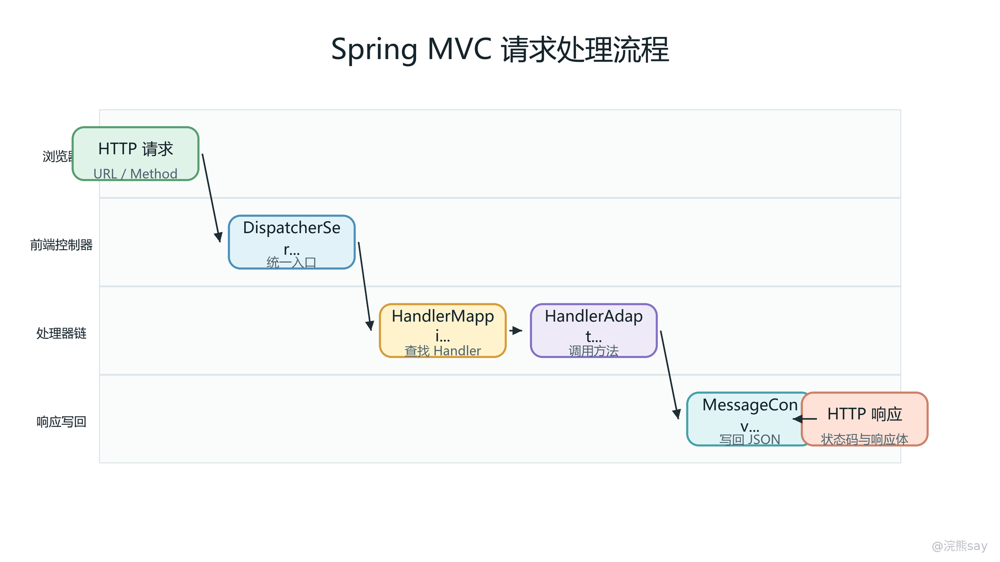
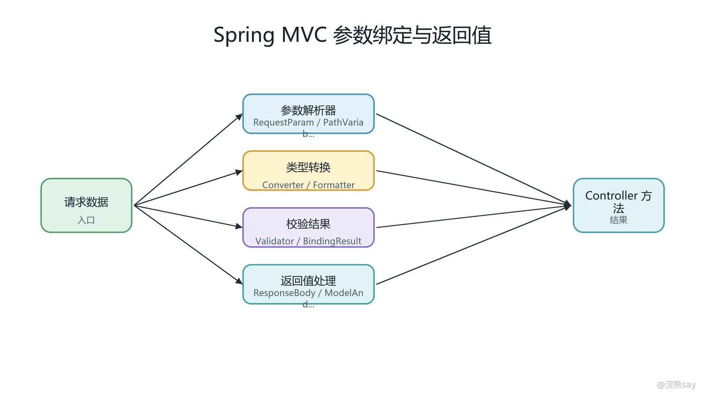
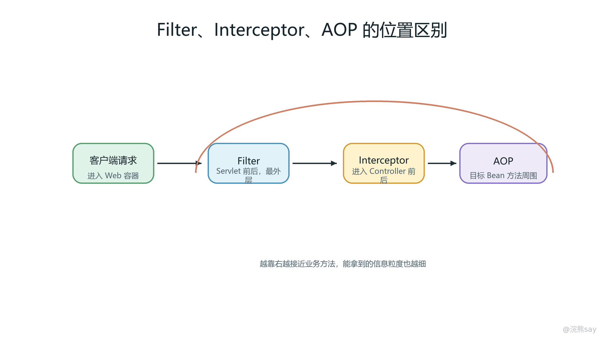

# Spring MVC 请求处理与 Web 层机制：Java 面试复习深度手册

Spring MVC 是 Spring Framework 在 Servlet 体系之上实现的一套 Web MVC 请求处理框架。它的核心不是提供 @Controller、@RequestMapping、@RequestBody 这些注解本身，而是把一次 HTTP 请求从 Servlet 容器进入应用、匹配到 Controller 方法、完成参数解析与数据绑定、执行业务方法、处理返回值、写出 JSON 或渲染视图、统一异常收口的全过程，组织成一条可扩展、可替换、可插拔的调度链。

面试里问 Spring MVC，真正考察的是对 Web 层执行模型的理解。只背“请求先到 DispatcherServlet，然后到 HandlerMapping，再到 HandlerAdapter”是不够的。合格回答要能继续解释：DispatcherServlet 为什么是 Servlet 体系里的前端控制器，HandlerMapping 找到的到底是什么，HandlerAdapter 为什么能调用任意签名的 Controller 方法，参数解析器、类型转换器、数据绑定器、校验器如何配合，返回值处理器和 HttpMessageConverter 如何把 Java 对象写成 JSON，Filter、Interceptor、AOP 为什么不是同一层东西，异常链路为什么既有 HandlerExceptionResolver 又有 @ControllerAdvice。

复习这章时，可以把 Spring MVC 看成一套“Web 层操作系统”。Servlet 容器负责底层网络连接、请求对象和响应对象，Spring MVC 负责把原始 HTTP 语义变成面向业务方法的调用模型。Controller 方法只是链路中间的一环，前面有映射、拦截、参数解析和校验，后面有返回值处理、内容协商、消息转换和异常解析。能把这条链路讲成一个完整系统，就能应对大多数 Spring MVC 八股追问。

## 一、Spring MVC 在 Servlet 体系中的位置

### 1\. Servlet 容器先接住请求，Spring MVC 再接管 Web 层调度

Spring MVC 不是脱离 Servlet 单独运行的 Web 框架。传统 Java Web 应用运行在 Servlet 容器中，例如 Tomcat、Jetty、Undertow。浏览器或前端服务发起 HTTP 请求后，首先由容器解析 TCP 连接、HTTP 报文、请求头、请求体、Cookie、Session 标识等底层信息，然后封装成 HttpServletRequest 和 HttpServletResponse。只有当请求匹配到某个 Servlet 的 URL 映射时，容器才会调用这个 Servlet 的 service 方法。

Spring MVC 的入口就是一个特殊的 Servlet：DispatcherServlet。它继承自 Servlet 体系，最终也会被 Servlet 容器调用。区别在于，普通 Servlet 往往自己完成参数读取、业务调用和响应写出，而 DispatcherServlet 不直接处理业务，它把请求再分发给 Spring MVC 内部的一组组件。也就是说，Servlet 容器负责“把 HTTP 请求交给 Java Web 应用”，Spring MVC 负责“把这个请求交给哪个 Controller 方法以及如何完成前后处理”。

面试表达时要把层级说清楚：浏览器请求不是直接进入 Controller，也不是直接进入 Spring Bean，而是先进入 Servlet 容器，再经过 Filter 链，再进入 DispatcherServlet，然后才进入 Spring MVC 的 Handler 查找与调用链。很多人回答时把 Filter、Interceptor、Controller 混在一起，本质是没有分清 Servlet 容器层和 Spring MVC 框架层。

### 2\. DispatcherServlet 的前端控制器职责

DispatcherServlet 采用 Front Controller 模式。所谓前端控制器，不是前端页面里的控制器，而是 Web 后端统一入口控制器。它把所有符合映射规则的请求集中接入，再统一完成请求分发、拦截器调用、异常处理、视图渲染或响应体写出。这样做的价值是让 Web 层具备统一治理能力。

如果没有统一入口，每个 Servlet 或每个接口都要重复处理编码、参数、权限、异常、视图跳转、JSON 输出等问题。统一入口出现后，这些公共动作就可以抽象为框架组件。例如 HandlerMapping 负责处理器查找，HandlerAdapter 负责处理器调用，HandlerExceptionResolver 负责异常收口，ViewResolver 负责视图解析，HttpMessageConverter 负责消息读写。Controller 方法只需要表达“这个请求对应什么业务动作”。

源码入口可以从 DispatcherServlet#doDispatch 记。面试不要求逐行背源码，但要知道主流程大致围绕几个动作展开：先通过 getHandler 获取 HandlerExecutionChain，再通过 getHandlerAdapter 找到能调用该 Handler 的适配器，然后执行拦截器 preHandle，调用 Handler，处理返回值或视图，最后在成功、异常、完成阶段分别触发后续处理。

### 3\. Spring MVC 与 Spring 容器的关系

Spring MVC 运行时离不开 Spring 容器。Controller、拦截器、异常处理器、消息转换器、视图解析器等组件都可以作为 Spring Bean 被管理。传统 Spring MVC 项目中常见父子容器结构：根容器管理 Service、Repository、事务等通用 Bean，DispatcherServlet 自己关联一个 WebApplicationContext，管理 Controller、HandlerMapping、HandlerAdapter 等 Web 层 Bean。Spring Boot 项目把这些配置自动化了，但底层仍然是 Spring 容器提供 Bean 管理和依赖注入。

这一点经常和“Controller 默认单例是否线程安全”一起追问。Spring MVC 的 Controller 默认是单例 Bean，这并不意味着每个请求共用同一份方法参数。方法参数、局部变量、HttpServletRequest 等请求数据都在当前线程调用栈或请求对象中，天然是请求级的。真正危险的是把请求相关状态放到 Controller 成员变量中，例如把当前用户、当前订单、临时参数放成字段。因为单例 Controller 会被多个请求线程并发访问，字段会被不同请求共享，从而产生线程安全问题。

项目里正确做法是：Controller 保持无状态，成员变量只放线程安全的依赖 Bean，例如 Service；请求数据通过方法参数传入；需要跨方法传递请求上下文时，可以使用参数对象、上下文对象或经过谨慎封装的 ThreadLocal，并保证请求结束后清理。面试里如果被问“Spring MVC Controller 是单例还是多例”，不要只答“默认单例”，还要补一句“只要不在字段保存请求状态，方法级参数和局部变量就是安全的”。

### 4\. Spring MVC 相对传统 Servlet 的抽象价值

传统 Servlet 开发中，接口代码通常长这样：从 request.getParameter 取字符串，手动做类型转换，手动校验，手动调用 Service，手动 response.getWriter().write 写 JSON，出现异常时再手动设置状态码和错误信息。代码量只是表象，真正的问题是协议处理、业务逻辑和错误治理混在一个方法里。

Spring MVC 的改进是建立了标准链路：映射规则把 URL 找到方法，参数解析器把 HTTP 数据变成 Java 参数，数据绑定器把字段填入对象，类型转换器处理 String 到 Long、Date、Enum 等转换，校验器处理 Bean Validation，返回值处理器决定输出路径，消息转换器完成 JSON 序列化，异常解析器统一处理错误。它把 Web 层重复动作变成框架扩展点，让业务代码保持在较稳定的结构中。

面试官追问“为什么不用原生 Servlet”时，不要只说 Spring MVC 简化开发。更好的回答是：原生 Servlet 面向请求响应对象，开发者需要自己组织参数解析、路由分发、异常处理和响应输出；Spring MVC 在 Servlet 之上提供了以 Handler 方法为中心的请求调度模型，把 Web 层通用机制抽象成组件链，更适合大型项目中的统一鉴权、统一异常、统一返回、参数校验和接口规范治理。

## 二、DispatcherServlet 初始化与请求分发主链路

### 1\. Spring MVC 初始化阶段的映射注册

DispatcherServlet 在启动时会初始化一批策略组件，这些组件决定了后续请求如何被处理。典型组件包括 HandlerMapping、HandlerAdapter、HandlerExceptionResolver、ViewResolver、LocaleResolver、MultipartResolver 等。Spring MVC 的设计思想是“策略对象可插拔”：框架定义接口和调用时机，具体实现可以替换。

最重要的初始化动作之一是请求映射注册。以注解式 Controller 为例，RequestMappingHandlerMapping 会扫描 Spring 容器中的 Controller Bean，读取类和方法上的 @RequestMapping、@GetMapping、@PostMapping 等注解，把请求路径、HTTP 方法、请求参数条件、请求头条件、consumes、produces 等信息封装成映射条件，并和目标 Controller 方法关联起来。目标方法在框架内部通常会被抽象为 HandlerMethod。

因此，请求到达时并不是从所有 Controller 方法中暴力扫描，而是在启动阶段已经建立了映射注册表。请求阶段的核心动作是拿当前请求的路径、方法、请求头等信息去匹配注册表，找出最合适的 Handler。理解这一点后，就能解释为什么路径冲突会在启动时报错，为什么两个接口路径相同但 HTTP 方法不同可以共存，为什么 params、headers、consumes、produces 也会影响匹配。

### 2\. doDispatch 主流程的执行顺序

一次典型请求进入 DispatcherServlet 后，核心流程可以先看图，再按阶段背。

images/03-springmvc-dispatcher-flow.png

从源码入口看，DispatcherServlet#doDispatch 的主线可以概括为：

1. 检查是否为文件上传请求，如果配置了 MultipartResolver，可能先把请求包装成 multipart 请求。
2. 调用 getHandler，遍历 HandlerMapping，找到当前请求对应的 HandlerExecutionChain。
3. 调用 getHandlerAdapter，根据 Handler 类型选择能调用它的 HandlerAdapter。
4. 执行拦截器链的 preHandle。只要有一个返回 false，请求就不会继续进入 Controller。
5. 通过 HandlerAdapter 调用 Controller 方法。对注解式 Controller 来说，关键实现是 RequestMappingHandlerAdapter。
6. Controller 正常返回后，得到 ModelAndView 或请求已被标记为响应体写出。
7. 执行拦截器链的 postHandle。
8. 处理结果，可能渲染视图，也可能响应体已经由消息转换器写出。
9. 如果发生异常，交给异常解析器链处理。
10. 请求完成后执行 afterCompletion，用于最终清理、日志和异常感知。

这里的顺序非常适合面试口述：入口是 DispatcherServlet，定位靠 HandlerMapping，调用靠 HandlerAdapter，前后处理靠 HandlerInterceptor，参数和返回值在 HandlerAdapter 内部完成，异常走 HandlerExceptionResolver，最终可能走 ViewResolver 或 HttpMessageConverter。

### 3\. HandlerExecutionChain 表示 Handler 加拦截器链

HandlerMapping 返回的不是一个裸 Controller 方法，而是 HandlerExecutionChain。它里面包含真正的 Handler，以及和当前请求匹配的一组拦截器。这个细节很重要，因为拦截器不是全局无条件执行所有逻辑，而是会根据配置路径、排除路径、映射规则参与到特定请求链路中。

对于注解式 Controller，Handler 通常是 HandlerMethod。它封装了目标 Bean、目标 Method、方法参数信息、注解信息等。这样框架才能在后续调用阶段知道要调用哪个对象的哪个方法，并且知道每个参数应该如何解析。HandlerExecutionChain 再把这个 Handler 和拦截器组合起来，形成“目标方法加前后置处理”的执行单元。

面试官可能会问：为什么 HandlerMapping 不直接调用 Controller？因为职责不同。HandlerMapping 的职责是“找谁处理”，它只负责匹配和返回处理器链；真正调用由 HandlerAdapter 完成。这样可以支持不同类型的 Handler，不一定都是注解方法，也可以是传统 Controller、HttpRequestHandler、静态资源处理器等。适配器模式让 DispatcherServlet 不需要知道每种 Handler 的调用细节。

### 4\. 正常返回、异常返回和拦截器回调的关系

preHandle、postHandle、afterCompletion 是 Interceptor 面试题的核心。preHandle 在 Controller 方法前执行，可以决定是否继续。返回 false 表示请求被拦截，后续 HandlerAdapter 不会调用 Controller。常见场景是未登录、权限不足、签名校验失败。

postHandle 在 Controller 方法执行成功后、视图渲染前执行。对于传统页面渲染，它可以修改 ModelAndView。但在 REST 接口中，如果返回值已经由 HttpMessageConverter 写出，postHandle 能做的事情会少很多。并且如果 Controller 抛出异常，postHandle 通常不会执行。

afterCompletion 在请求完成后执行，无论是正常完成还是异常完成，只要 preHandle 成功放行过的拦截器，通常都有机会收到完成回调。它适合做资源清理、耗时统计收尾、MDC 清理、ThreadLocal 清理、最终审计日志。项目中经常把开始时间放在 request attribute 或上下文中，在 afterCompletion 里计算总耗时。

容易踩坑的是在 preHandle 返回 false 后忘记写响应。如果拦截器拦住了请求，但既没有设置状态码，也没有写错误体，前端可能拿到空响应或默认错误页。比较规范的做法是统一构造错误响应，设置 Content-Type 和状态码，并确保不再继续链路。

## 三、HandlerMapping、HandlerAdapter、HandlerMethod 的深层职责

### 1\. HandlerMapping 的匹配条件

很多初学回答会把 HandlerMapping 简化成“根据 URL 找 Controller”。这个说法不算错，但太浅。Spring MVC 的请求匹配条件不仅包括路径，还包括 HTTP 方法、请求参数条件、请求头条件、Content-Type 对应的 consumes、Accept 对应的 produces，以及路径模式的精确程度。

例如两个方法都映射到 /users，一个限定 GET，一个限定 POST，它们可以共存，因为 HTTP 方法条件不同。两个方法路径都能匹配 /users/1，一个是 /users/{id}，一个是 /users/\*，框架需要比较哪一个更具体。一个接口声明 consumes = "application/json"，如果客户端用 text/plain 提交，就可能匹配失败并抛出 415。一个接口声明 produces = "application/json"，如果客户端 Accept 只接受 XML，就可能导致 406。

所以面试回答可以升级为：HandlerMapping 会基于请求路径、HTTP 方法、参数、请求头、消费类型、生产类型等条件，从启动时注册好的映射中选择最匹配的处理器。它返回的是 HandlerExecutionChain，其中包括目标 Handler 和当前请求适用的拦截器链。

### 2\. HandlerMethod 让普通 Java 方法变成可调度的处理器

注解式 Spring MVC 的核心抽象是 HandlerMethod。一个 Controller 方法本质上只是普通 Java 方法，但框架需要知道它属于哪个 Bean、方法对象是什么、参数列表是什么、每个参数上有哪些注解、返回值上有哪些注解、方法所属类上有什么映射信息。HandlerMethod 就是这些元数据的载体。

有了 HandlerMethod，框架才能支持非常灵活的方法签名：

@PostMapping("/orders/{id}/pay") 
public ResponseEntity&lt;OrderPayResult> pay( 
@PathVariable Long id, 
@RequestHeader("X-Trace-Id") String traceId, 
@Valid @RequestBody PayRequest request, 
BindingResult bindingResult) { 
// business call 
}

这个方法里同时出现路径变量、请求头、请求体、校验结果和响应实体。Controller 开发者只写业务签名，底层由 RequestMappingHandlerAdapter 结合参数解析器把每个位置的值准备好。面试官追问“为什么 Controller 方法参数能随便写”时，答案不是“Spring 很智能”，而是“HandlerMethod 保存了方法元数据，HandlerAdapter 使用参数解析器链逐个解析参数”。

### 3\. HandlerAdapter 屏蔽不同 Handler 的调用方式

DispatcherServlet 只负责调度，它不知道每种 Handler 如何调用。注解方法、传统 Controller、静态资源处理器的调用方式不同，如果 DispatcherServlet 直接判断所有类型，代码会高度耦合。Spring MVC 用 HandlerAdapter 解决这个问题：每个适配器声明自己是否支持某类 Handler，如果支持，就负责执行它。

在现代注解式开发中，最重要的是 RequestMappingHandlerAdapter。它内部维护两组非常关键的组件：HandlerMethodArgumentResolver 参数解析器和 HandlerMethodReturnValueHandler 返回值处理器。调用 Controller 方法前，它用参数解析器准备参数；方法返回后，它用返回值处理器处理结果。

这就是 HandlerMapping 和 HandlerAdapter 的本质区别：前者负责找到“谁”，后者负责解决“怎么调用”。回答时可以用一句话收束：HandlerMapping 把请求映射到 HandlerExecutionChain，HandlerAdapter 把 Handler 适配成一次真实的方法调用，并在调用前后接入参数解析和返回值处理。

### 4\. Controller 单例、线程安全和请求状态

Spring MVC 默认把 Controller 注册为单例 Bean。单例的好处是创建成本低、依赖注入稳定、生命周期简单，也符合 Spring 容器的默认管理方式。它能成立的前提是 Controller 不保存请求级状态。每次请求都会在线程栈中创建本次方法调用的局部变量，方法参数也是本次调用独有的引用；只要不把这些数据写入共享字段，多个请求并发调用同一个 Controller Bean 是可以安全工作的。

危险写法通常是这样的：

@RestController 
public class OrderController { 
private Long currentUserId; 
 
@GetMapping("/orders") 
public List&lt;OrderVO> list(Long userId) { 
this.currentUserId = userId; 
return orderService.query(currentUserId); 
} 
}

这个字段会被所有请求共享，高并发下 A 用户的请求可能覆盖 B 用户的数据。正确写法是把 userId 保持在方法参数、局部变量或明确的请求上下文中。面试里如果被问线程安全，建议从“Controller 默认单例”说到“方法栈安全、成员字段不安全”，再补“Service 通常也应无状态，事务和连接等上下文由框架绑定到当前线程并在结束后清理”。

## 四、参数解析、类型转换、数据绑定、校验与 BindingResult

### 1\. 参数解析器决定一个方法参数从哪里来

Spring MVC 方法参数能写很多类型，依赖的是 HandlerMethodArgumentResolver。它的工作方式可以理解为两步：先判断是否支持当前参数，再真正解析参数值。RequestMappingHandlerAdapter 会按顺序遍历解析器列表，找到第一个支持该参数的解析器。

images/03-springmvc-binding-return-chain.png

常见参数来源可以这样记：
| 参数形式 | 数据来源 | 背后重点 |
| --- | --- | --- |
| @RequestParam | 查询参数、表单字段、multipart 普通字段 | 常用于简单类型、分页参数、搜索条件 |
| @PathVariable | URI 模板变量 | 常用于 REST 风格资源 ID |
| @RequestHeader | HTTP 请求头 | 常用于 token、traceId、客户端版本 |
| @CookieValue | Cookie | 常用于会话标识、灰度标识 |
| @RequestBody | 请求体 | 常用于 JSON 反序列化 |
| 普通 Java Bean | 查询参数或表单字段绑定到属性 | 常被视为 @ModelAttribute 风格 |
| HttpServletRequest 等 Servlet 对象 | 容器提供的底层对象 | 需要底层协议能力时使用 |
| Principal、Locale、Model 等 | MVC 上下文或请求上下文 | 用于认证、国际化、页面模型 |

面试追问通常集中在 @RequestParam、@PathVariable、@RequestBody 和普通对象的区别。@RequestParam 更适合简单参数和表单字段；@PathVariable 表达路径中的资源标识；@RequestBody 会读取请求体并走消息转换；普通 Java Bean 不加注解时通常按属性名从请求参数中绑定，不会读取 JSON 请求体。很多参数绑定失败，就是把 JSON 请求体对象写成普通对象却忘了加 @RequestBody，或者把查询参数误写成 @RequestBody。

### 2\. 类型转换与数据绑定的职责边界

类型转换解决的是“值的类型怎么变”。HTTP 请求里的查询参数、路径变量、表单字段本质上大多是字符串，而 Controller 方法可能需要 Long、Integer、BigDecimal、LocalDateTime、Enum。Spring MVC 通过 ConversionService、Converter、Formatter、PropertyEditor 等机制完成类型转换。比如把 "1001" 转成 Long，把 "2026-06-30" 转成 LocalDate，把 "ENABLE" 转成枚举。

数据绑定解决的是“多个字段怎么填到对象里”。例如请求参数是 name=Tom&age=18&address.city=Beijing，目标参数是 UserForm，框架需要创建对象实例，把每个字段绑定到对应属性上，并记录绑定错误。这个过程由 WebDataBinder 参与。它不仅做属性绑定，还可以设置允许绑定的字段、禁止绑定的字段、注册自定义编辑器、触发校验。

两者关系可以这样说：类型转换是数据绑定中的基础能力之一，绑定对象时每个字段都可能需要类型转换。绑定失败不一定是 JSON 反序列化失败，也可能是普通请求参数无法转成目标类型。例如 age=abc 绑定到 Integer age 会产生类型转换错误；日期字符串格式不符合 @DateTimeFormat 或全局 Formatter 配置，也会绑定失败。

### 3\. @RequestBody 走消息转换，普通对象走数据绑定

@RequestBody 和普通 Java Bean 的区别是高频失分点。@RequestBody 表示方法参数来自请求体，Spring MVC 会根据请求的 Content-Type 选择合适的 HttpMessageConverter 读取请求体。例如 Content-Type: application/json 时，通常由 Jackson 把 JSON 反序列化成 Java 对象。

普通 Java Bean 参数没有 @RequestBody 时，一般按 @ModelAttribute 的方式处理，也就是从 query string 或 form data 中按属性名绑定。它不消费 JSON 请求体。因此，前端发：

POST /users 
Content-Type: application/json 
 
{"name":"Tom","age":18}

Controller 如果写成 public Result create(UserCreateRequest request)，通常拿不到 JSON 字段；应该写成 public Result create(@RequestBody UserCreateRequest request)。相反，如果前端提交的是表单或查询参数，用 @RequestBody 又可能因为请求体格式和消息转换器不匹配而失败。

项目表达时可以说：我们会按接口语义选择入参方式。GET 查询条件通常使用 @RequestParam 或查询对象，资源 ID 用 @PathVariable，POST/PUT 的 JSON 对象用 @RequestBody，文件上传用 MultipartFile，需要拿请求头时显式使用 @RequestHeader。这样接口契约清晰，也方便 OpenAPI 文档和前后端联调。

### 4\. Bean Validation、BindingResult 与异常类型

参数校验通常使用 Bean Validation。请求 DTO 字段上写 @NotNull、@NotBlank、@Size、@Min、@Max、@Email 等约束，Controller 参数前加 @Valid 或 @Validated。@Valid 来自 Jakarta Validation 或 Javax Validation 标准，@Validated 是 Spring 提供的增强，支持分组校验。框架在参数绑定完成后触发校验。

校验失败后有两种处理方式。第一种是方法参数后面紧跟 BindingResult 或 Errors，框架会把绑定错误和校验错误放进去，由业务代码自己判断。例如：

@PostMapping("/users") 
public Result create(@Valid @RequestBody UserCreateRequest request, 
BindingResult bindingResult) { 
if (bindingResult.hasErrors()) { 
return Result.fail(bindingResult.getFieldError().getDefaultMessage()); 
} 
return userService.create(request); 
}

第二种是没有声明 BindingResult，框架直接抛异常，再交给全局异常处理器。REST 项目更常用第二种，因为可以统一返回错误码和字段错误列表。常见异常包括：MethodArgumentNotValidException，通常对应 @RequestBody 对象校验失败；BindException，常见于表单对象或查询对象绑定校验失败；ConstraintViolationException，常见于方法级简单参数约束；MissingServletRequestParameterException，表示必需请求参数缺失；MethodArgumentTypeMismatchException，表示类型转换失败。

BindingResult 有一个位置规则：它必须紧跟在被校验的参数后面。中间插入别的参数，Spring MVC 可能无法把错误结果正确关联到目标对象。面试官追问时可以这样回答：BindingResult 是绑定和校验结果的容器，如果声明了它，框架不会直接抛出部分校验异常，而是把错误交给 Controller；如果没有声明，就由异常机制处理。项目里为了统一错误格式，一般更倾向全局异常处理。

## 五、返回值处理、HttpMessageConverter、JSON 序列化与内容协商

### 1\. 返回值处理器决定 Controller 结果往哪里走

Controller 方法可以返回 String、ModelAndView、普通对象、ResponseEntity、void、Callable、DeferredResult、SseEmitter、StreamingResponseBody 等多种类型。Spring MVC 能处理这些返回形式，依靠的是 HandlerMethodReturnValueHandler 返回值处理器链。它和参数解析器类似，也是按顺序判断哪个处理器支持当前返回值。

传统页面项目中，返回 String 可能表示逻辑视图名，例如返回 "user/list"，再由 ViewResolver 找到具体 JSP 或 Thymeleaf 模板。返回 "redirect:/login" 表示重定向，返回 "forward:/internal" 表示服务端转发。返回 ModelAndView 则同时携带模型数据和视图名。

前后端分离项目中，更多返回普通 Java 对象、集合、ResponseEntity&lt;T> 或统一响应包装对象。只要方法或类上具备 @ResponseBody 语义，返回值就不会被当成视图名，而是交给消息转换器写入响应体。@RestController 的本质就是 @Controller 加 @ResponseBody，使类中方法默认都走响应体写出。

### 2\. HttpMessageConverter 同时负责读请求体和写响应体

HttpMessageConverter 是 REST 接口里非常关键的扩展点。它有两个方向：读取请求体和写出响应体。读取请求体时，@RequestBody 参数会触发消息转换器，从请求输入流中读取数据并转换成 Java 对象。写出响应体时，@ResponseBody 或 ResponseEntity 会触发消息转换器，把 Java 对象写到响应输出流。

常见转换器包括字节数组转换器、字符串转换器、资源转换器、表单转换器、JSON 转换器、XML 转换器等。实际项目里最常见的是 Jackson 对应的 JSON 转换器。它会根据对象字段、getter、注解、ObjectMapper 配置、日期格式、枚举策略、空值策略等完成序列化和反序列化。

因此 @RequestBody 绑定失败的常见原因可以从消息转换器角度排查：
| 现象 | 可能原因 | 面试表达 |
| --- | --- | --- |
| 415 Unsupported Media Type | Content-Type 与接口 consumes 或转换器不匹配 | 请求体格式和服务端声明的消费类型不一致 |
| 400 Bad Request | JSON 格式错误或字段类型错误 | 转换器读取请求体时反序列化失败 |
| 字段为 null | 字段名不一致、setter 缺失、反序列化规则不匹配 | JSON 字段没有正确映射到 Java 属性 |
| 日期解析失败 | 日期格式与 ObjectMapper 或注解配置不一致 | 需要统一时间格式或使用 @JsonFormat |
| 枚举解析失败 | 前端传值与枚举名称或自定义规则不一致 | 枚举序列化策略需要前后端约定 |

项目中不要在每个 Controller 手动使用 ObjectMapper 解析请求体。那样会绕开 Spring MVC 的参数解析、校验、异常处理和接口文档约定。更好的做法是统一配置消息转换器、ObjectMapper、日期格式、枚举策略和异常处理，让 Controller 保持声明式签名。

### 3\. 内容协商决定返回 JSON、XML 还是其他格式

内容协商是很多人忽略的追问点。HTTP 里客户端可以通过 Accept 请求头声明自己能接受的响应媒体类型，例如 application/json、application/xml。服务端接口也可以通过 produces 声明自己能产生的类型。Spring MVC 会结合请求头、接口声明、可用转换器等因素，选择最终使用哪个 HttpMessageConverter。

如果客户端只接受 XML，但服务端只有 JSON 转换器，或者接口声明只生产 JSON，就可能出现 406 Not Acceptable。如果请求体是 JSON，但 Content-Type 写成 text/plain，服务端找不到合适的读取转换器，就可能出现 415 Unsupported Media Type。很多接口联调问题并不是业务代码错，而是请求头和内容协商不匹配。

面试里可以这样讲：Content-Type 描述请求体是什么格式，影响服务端如何读取请求体；Accept 描述客户端希望接收什么格式，影响服务端如何写响应体。@RequestBody 读取时主要看 Content-Type 和 consumes，@ResponseBody 写出时主要看 Accept、produces 和可用的 HttpMessageConverter。

### 4\. ResponseEntity、统一响应结构和状态码

ResponseEntity&lt;T> 允许同时控制响应体、状态码和响应头。普通 @ResponseBody 返回对象时，状态码通常默认 200；如果需要返回 201 Created、204 No Content、400 Bad Request，或者需要设置下载文件名、缓存头、Location 头，就可以使用 ResponseEntity。

很多项目会定义统一响应结构，例如：

public class ApiResult&lt;T> { 
private Integer code; 
private String message; 
private T data; 
}

统一响应结构的价值是让业务错误码、提示信息和数据格式稳定。但要注意，不是所有错误都应该 HTTP 200。比较成熟的做法是：业务可预期错误可以返回统一结构和业务错误码，HTTP 状态码根据团队规范保持 200 或使用 4xx；认证失败、权限不足、参数格式错误、资源不存在、系统异常等协议语义明显的场景，最好不要完全抹平 HTTP 状态码。面试时不必和面试官争规范，但要体现你知道业务错误码和 HTTP 状态码是两个层面的语义。

如果项目里做了统一响应包装，常见实现位置可能是 ResponseBodyAdvice。它可以在返回值被消息转换器写出之前，对响应体做统一包装。但要谨慎处理已经是统一结构、文件下载、流式响应、错误响应、Swagger 文档等场景，避免把二进制文件或 SSE 流包装成 JSON 导致接口损坏。

## 六、Filter、Interceptor、AOP 的执行时机、能力边界与误用

### 1\. 三者位置：Servlet 外围、MVC 链路、Bean 方法调用

Filter、Interceptor、AOP 都能做“前后增强”，但它们不在同一层。可以先用这张图建立位置感。

images/03-springmvc-filter-interceptor-aop.png

Filter 属于 Servlet 规范，由 Servlet 容器调用，执行在 DispatcherServlet 之前和之后。它能看到原始 HttpServletRequest 和 HttpServletResponse，适合处理 Web 容器入口级问题，例如字符编码、CORS、安全过滤、请求包装、响应包装、日志 traceId 初始化等。因为它发生在 Spring MVC Handler 匹配之前，通常不知道最终会进入哪个 Controller 方法。

Interceptor 属于 Spring MVC，由 DispatcherServlet 在 Handler 调用链中触发。它已经能拿到 Handler 信息，尤其当 Handler 是 HandlerMethod 时，可以拿到 Controller 类、方法和注解。因此它适合处理登录态、接口权限、幂等 token、接口审计、请求耗时、基于注解的接口控制等 MVC 语义问题。

AOP 属于 Spring 容器和代理机制，拦截的是 Spring Bean 方法调用。它不局限于 HTTP 请求，Service 方法被 Controller、定时任务、消息消费者、其他 Service 调用时都可能被 AOP 增强。事务 @Transactional 就是典型 AOP 场景。AOP 适合业务方法级横切逻辑，例如事务、业务日志、方法级权限、幂等、监控埋点。

### 2\. 能拿到的信息不同，决定了适用场景不同

Filter 能拿到请求和响应对象，也能读取 URI、请求头、请求体输入流、响应状态等底层信息，但它缺少 Controller 方法语义。Interceptor 能拿到请求响应对象和 Handler，如果 Handler 是 HandlerMethod，还能读取方法注解、类注解、方法参数元数据，但它只覆盖 Spring MVC 请求。AOP 能拿到被代理方法的参数、返回值、异常和注解，但默认不天然知道 HTTP 请求上下文，除非通过 RequestContextHolder 等方式额外获取。

因此典型分工是：
| 需求 | 推荐位置 | 原因 |
| --- | --- | --- |
| 设置请求编码 | Filter | 发生在读取请求参数之前 |
| CORS 跨域处理 | Filter 或 Spring MVC CORS 配置 | 属于 HTTP 入口协议问题 |
| 登录态校验 | Interceptor 或安全框架 Filter | 取决于安全体系设计 |
| 读取 Controller 方法上的自定义权限注解 | Interceptor 或 AOP | Interceptor 可拿 HandlerMethod，AOP 可拦方法 |
| Service 事务 | AOP | 与 Web 请求无关，属于方法调用增强 |
| 接口耗时统计 | Filter、Interceptor、AOP 都可做 | 统计口径不同，入口耗时、MVC 耗时、业务方法耗时不同 |
| 统一响应包装 | ResponseBodyAdvice 更合适 | 不应硬塞进 Filter 或 Interceptor |

面试里要避免说“Filter 比 Interceptor 更底层所以更强”这类空话。更准确的说法是：Filter 的位置更靠近 Servlet 容器，适合处理协议入口；Interceptor 的位置更靠近 Controller，适合处理 MVC 语义；AOP 的位置更靠近业务 Bean，适合处理方法级横切逻辑。

### 3\. 请求体只能读一次与包装请求

Filter 和 Interceptor 中常见误用是读取请求体。Servlet 请求体来自输入流，默认只能读取一次。@RequestBody 后续也要读取这个输入流，如果你在 Filter 或 Interceptor 里提前读完而没有包装缓存，Controller 参数解析时就会拿不到请求体，表现为 JSON 为空、Required request body is missing 或反序列化失败。

如果确实需要记录请求体日志、验签或重复读取请求体，应该使用 request wrapper 缓存 body，例如在 Filter 中把请求包装成可重复读取的对象，或者使用 Spring 提供的 ContentCachingRequestWrapper。但 ContentCachingRequestWrapper 也有使用时机问题，它通常是在请求体被读取后才缓存内容，不能简单理解为包装后立刻可无限读取。生产环境还要考虑大请求体、文件上传、敏感字段脱敏和性能开销。

项目表达可以这样说：我们不会在普通拦截器里直接读取 request.getInputStream() 做日志，因为会影响 @RequestBody。如果要做请求响应日志，会在 Filter 层使用缓存包装，并限制最大记录长度，对密码、token、身份证等字段脱敏，文件上传接口跳过 body 记录。

### 4\. 常见误用：把所有横切逻辑塞进拦截器

拦截器不是万能入口。把所有逻辑都塞进 Interceptor，会带来几个问题：第一，非 Spring MVC 请求覆盖不到，例如消息消费、定时任务、Dubbo 或 gRPC 调用；第二，过多读取请求体和响应体容易破坏正常链路；第三，业务方法级语义不清楚，例如事务、幂等、审计到底跟接口有关还是跟业务命令有关；第四，异常处理和响应包装容易与 Spring MVC 原有机制冲突。

更合理的分层是：安全认证如果使用 Spring Security，核心通常在 Filter 链；Web 接口层面的登录态、租户、语言、traceId 可以放 Filter 或 Interceptor；Controller 方法注解控制可以放 Interceptor 或 AOP；业务操作日志、事务、幂等和限流可以根据作用域放 AOP、网关、Filter 或专门中间件。面试项目表达时，能说清楚“为什么放这一层”，比单纯说“我用了拦截器”更有含金量。

## 七、异常处理链路：@ControllerAdvice、@ExceptionHandler 与参数异常

### 1\. Spring MVC 异常解析链路

Spring MVC 请求处理过程中可能在多个阶段抛异常：HandlerMapping 找不到处理器可能是 404；HTTP 方法不支持可能是 405；Content-Type 不支持可能是 415；参数缺失可能抛 MissingServletRequestParameterException；类型转换失败可能抛 MethodArgumentTypeMismatchException；JSON 反序列化失败可能抛 HttpMessageNotReadableException；参数校验失败可能抛 MethodArgumentNotValidException、BindException 或 ConstraintViolationException；业务层可能抛自定义业务异常；未知错误可能是 RuntimeException。

这些异常不会简单原样返回。DispatcherServlet 在请求处理失败时会尝试交给 HandlerExceptionResolver 链处理。异常解析器可以返回 ModelAndView，也可以写出响应体，或者标记异常已处理。Spring MVC 默认提供一些异常解析器，同时开发者可以通过 @ExceptionHandler、@ControllerAdvice、@RestControllerAdvice 编写注解式异常处理。

面试回答可以抓住这一句：@ControllerAdvice 不是异常机制的底层唯一入口，它是基于 Spring MVC 异常解析器体系提供的注解式全局增强方式。实际项目中常用 @RestControllerAdvice + @ExceptionHandler 统一捕获参数异常、业务异常和系统异常，再返回统一 JSON 响应。

### 2\. @ExceptionHandler 的匹配规则与全局增强

@ExceptionHandler 可以写在某个 Controller 内，也可以写在 @ControllerAdvice 标注的全局增强类中。写在 Controller 内时，通常只处理该 Controller 的异常；写在全局增强类中，可以覆盖多个 Controller。@RestControllerAdvice 等价于 @ControllerAdvice 加 @ResponseBody 语义，更适合 REST API。

异常匹配通常按异常类型寻找最合适的方法。例如你同时写了处理 BusinessException 和 Exception 的方法，业务异常应该进入更具体的 BusinessException 处理方法。全局异常处理里通常会分层：

@RestControllerAdvice 
public class GlobalExceptionHandler { 
@ExceptionHandler(MethodArgumentNotValidException.class) 
public ApiResult<?> handleValid(MethodArgumentNotValidException ex) { 
// extract field errors 
} 
 
@ExceptionHandler(BusinessException.class) 
public ApiResult<?> handleBusiness(BusinessException ex) { 
// return business code and message 
} 
 
@ExceptionHandler(Exception.class) 
public ApiResult<?> handleUnknown(Exception ex) { 
// log stack and return generic message 
} 
}

注意最后的 Exception 兜底不能把日志吞掉。未知异常应该记录完整堆栈和请求上下文，但返回给前端的信息要克制，避免泄露 SQL、类名、堆栈、服务器路径等内部细节。业务异常可以返回明确提示，系统异常则返回统一的“系统繁忙”或内部错误码。

### 3\. 参数异常要能说清楚具体类型

很多面试官会追问“参数校验失败抛什么异常”。这道题不一定要求一字不差，但要能区分来源。
| 场景 | 常见异常 | 说明 |
| --- | --- | --- |
| @RequestBody JSON 解析失败 | HttpMessageNotReadableException | 请求体不是合法 JSON、字段类型不匹配等 |
| @RequestBody 对象 Bean Validation 失败 | MethodArgumentNotValidException | JSON 已反序列化成对象，但字段校验失败 |
| 查询对象或表单对象绑定校验失败 | BindException | 非请求体对象绑定或校验失败 |
| 简单参数缺失 | MissingServletRequestParameterException | 必填 @RequestParam 没传 |
| 路径变量缺失或类型不匹配 | MissingPathVariableException、MethodArgumentTypeMismatchException | URI 模板或转换失败 |
| 方法级参数约束失败 | ConstraintViolationException | 例如 @RequestParam @Min(1) Integer page |
| 不支持请求方法 | HttpRequestMethodNotSupportedException | 例如只支持 POST 却发 GET |
| 媒体类型不支持 | HttpMediaTypeNotSupportedException | 请求 Content-Type 不匹配 |

项目里处理参数异常时，最好返回字段级错误信息。例如 field=name, message=姓名不能为空。对于 JSON 解析失败，可能无法定位到 Bean Validation 字段，这时可以返回“请求体格式错误”。不要把 Jackson 原始异常完整返回给前端，因为里面可能包含类路径、字段路径、内部结构。

### 4\. 异常处理与拦截器、返回值处理的关系

异常发生后，正常返回值处理链路可能不会继续。Controller 抛出异常时，postHandle 通常不会执行，但 afterCompletion 会在完成阶段拿到异常信息。异常如果被 @ExceptionHandler 处理并返回对象，这个异常处理方法的返回值仍然可能经过返回值处理器和消息转换器写成 JSON。

这也是为什么全局异常处理方法可以直接返回统一响应对象。它本质上也是一个被 Spring MVC 管理的处理方法，只是触发时机来自异常解析。异常处理方法返回对象后，依然可以走 @ResponseBody 语义和 HttpMessageConverter，最终序列化为 JSON。

面试官如果问“统一异常处理和统一返回包装哪个先执行”，可以这样回答：正常 Controller 返回会进入返回值处理和可能的 ResponseBodyAdvice；如果 Controller 抛异常，先进入异常解析器，匹配到 @ExceptionHandler 后由异常处理方法产生返回值，这个返回值再进入响应体写出流程。实际顺序和是否应用 ResponseBodyAdvice 还取决于配置和返回类型，所以项目里要测试异常响应不要被重复包装。

## 八、乱码、请求体、跨域、转发重定向、文件上传等高频问题

### 1\. 中文乱码：先区分请求阶段、响应阶段和 URL 编码

中文乱码不是一个问题，而是一组编码链路问题。POST 表单或请求体乱码，通常和请求体读取编码有关，传统 Spring MVC 项目常通过 CharacterEncodingFilter 设置 UTF-8。Spring Boot 项目一般已经自动配置了字符编码，但老项目或手写配置仍可能出现遗漏。

GET 请求乱码更多和 URL 编码、浏览器编码、服务端连接器编码有关。现代 Tomcat 和 Spring Boot 默认已经更友好，但老项目中可能需要配置 URIEncoding。不要在业务代码里到处写 new String(str.getBytes("ISO-8859-1"), "UTF-8")，这类补丁会让编码问题扩散，而且一旦上游配置修正，反而可能二次乱码。

响应乱码则要看 Content-Type 和响应编码。例如返回 JSON 时应有 application/json 和 UTF-8 语义；返回文本或页面时要保证响应头、模板文件、页面 meta、服务器配置一致。面试回答可以说：乱码排查要按“客户端编码、请求头、容器解码、Spring 编码过滤器、消息转换器、响应 Content-Type”顺序看，而不是只记一个过滤器。

### 2\. 请求体只能读一次：日志、验签和 @RequestBody 的冲突

Servlet 请求体输入流默认只能消费一次。@RequestBody 依赖消息转换器读取请求体，如果在 Filter 或 Interceptor 中提前调用 getInputStream() 或 getReader() 读完，后续 Controller 可能报 Required request body is missing。这个问题在接口日志、签名校验、网关转发、请求加解密中非常常见。

解决思路是使用包装请求缓存 body，并在后续读取时返回新的输入流。生产项目还需要限制缓存大小，避免大文件或大 JSON 把内存打爆。文件上传接口不要随意缓存整个 body；敏感字段要脱敏；请求体日志最好只在测试环境或问题排查开关下开启。

面试里可以这样答：如果需要多次读取请求体，不能直接在拦截器里读原始流，而应在 Filter 层使用可重复读取的 request wrapper，将 body 缓存下来，再让后续 @RequestBody 从包装后的流读取。同时要考虑大请求体、文件上传、敏感信息和性能。

### 3\. 跨域 CORS 的浏览器安全模型

跨域是浏览器同源策略触发的限制。服务端之间调用不受浏览器 CORS 限制，Postman 也通常不受这个限制。当前端页面所在的协议、域名、端口与后端接口不同，浏览器会要求后端返回合适的 CORS 响应头，例如 Access-Control-Allow-Origin、Access-Control-Allow-Methods、Access-Control-Allow-Headers。

复杂请求会先发预检请求 OPTIONS。后端如果没有正确处理 OPTIONS，或者拦截器、安全框架把预检请求拦掉，前端就会看到跨域失败。Spring MVC 可以通过 @CrossOrigin、WebMvcConfigurer#addCorsMappings 或 Filter 方式配置 CORS。使用 Spring Security 时，还要让安全过滤链正确放行或处理 CORS。

面试回答要强调：跨域不是 Controller 方法业务异常，而是浏览器在发起或接收跨源请求时执行的安全策略。后端解决时要在足够靠前的位置处理 CORS，尤其是 OPTIONS 预检请求；如果需要携带 Cookie，还不能简单写 Access-Control-Allow-Origin: \*，需要明确来源并允许凭证。

### 4\. 转发、重定向和 REST 接口的边界

forward: 是服务端内部转发。浏览器只发一次请求，地址栏不变，原 request 对象和 request 域数据可以继续使用。它常用于传统页面项目内部跳转。redirect: 是客户端重定向。服务端返回 3xx 状态码和 Location，浏览器再发起新请求，地址栏变化，原 request 域数据不再自动存在。

表单提交后常用重定向，是为了避免刷新页面导致重复提交，这就是 Post/Redirect/Get 思路。登录成功跳转、创建资源后跳转详情页，也常用重定向。REST API 中通常不依赖服务端页面跳转，更多使用状态码、响应体和前端路由控制页面变化。

面试里如果只答“转发一次请求，重定向两次请求”太浅。可以补充：转发发生在服务端内部，不能跳到外部站点，request 数据保留；重定向由客户端重新请求，可以跳外部地址，request 数据丢失但可以通过 URL、Session、FlashMap 等方式传递短期状态。

### 5\. 文件上传：MultipartResolver 与 MultipartFile

Spring MVC 文件上传依赖 multipart 请求解析。客户端提交时 Content-Type 通常是 multipart/form-data。服务端需要 multipart 解析能力，把请求中的文件部分解析成 MultipartFile。在 Spring Boot 中通常自动配置 multipart 支持；传统项目可能需要配置 MultipartResolver。

Controller 可以这样接收：

@PostMapping("/upload") 
public ApiResult<?> upload(@RequestParam("file") MultipartFile file) { 
if (file.isEmpty()) { 
return ApiResult.fail("文件不能为空"); 
} 
// check size, suffix, content type, storage path 
}

文件上传的项目表达不要停留在“用 MultipartFile 接收”。还要补安全和工程边界：限制文件大小，校验扩展名和真实内容类型，避免使用原始文件名直接拼路径，防止路径穿越；大文件考虑分片上传、对象存储和异步处理；上传后返回文件 ID 或访问 URL；私有文件要做权限控制，不要把内部存储路径暴露给前端。

## 九、Spring MVC 与 Struts2：从设计模型和线程安全回答

### 1\. 入口模型不同：Servlet 前端控制器与 Filter 入口

Spring MVC 的核心入口是 DispatcherServlet，它本身是 Servlet，采用前端控制器模式统一分发请求。Struts2 的历史核心入口是 Filter，请求先进入 Struts2 Filter，再进入其 Action 调用体系。单纯说“一个是 Servlet，一个是 Filter”还不够，要继续解释它们背后的处理模型。

Spring MVC 把请求映射到 Controller 方法，方法参数由框架解析，返回值由框架处理。它更像是围绕“方法调用”建立的 Web 层调度模型。Struts2 更偏向围绕 Action 对象建立调用模型，很多历史用法中，一个请求对应一个 Action 实例或 Action 方法，参数通过属性注入到 Action 对象中。

面试里这道题现在不算一线高频，但老题库和传统企业仍会问。回答时不要背表格，要强调设计模型差异：Spring MVC 以 Servlet 前端控制器接入，以 HandlerMethod 为核心处理单元；Struts2 以 Filter 接入，以 Action 模型为核心处理单元。

### 2\. 参数模型不同：方法参数绑定与成员变量注入

Spring MVC 的 Controller 方法可以直接声明参数，例如 @RequestParam Long id、@RequestBody UserDTO dto、@PathVariable Long id。这些参数是一次方法调用的输入，通常保存在栈帧或请求对象关联的数据中。请求结束后，方法参数也就结束了。

Struts2 传统 Action 常见写法是把请求参数绑定到 Action 的成员变量上，再通过 getter/setter 使用。这种模型下，请求状态更容易成为对象状态。如果 Action 是单例，就会产生线程安全问题。因此 Struts2 历史上通常使用多例 Action，保证每个请求有自己的 Action 实例。

Spring MVC Controller 默认单例也能安全，关键在于它不鼓励把请求参数放在成员字段中，而是通过方法参数传递。这个点是 Spring MVC 与 Struts2 区别题的核心，不要只背“Spring MVC 单例，Struts2 多例”，要解释为什么：前者以无状态方法参数为主，后者历史上以有状态 Action 属性为主。

### 3\. Controller 线程安全的状态边界

线程安全问题本质上取决于共享可变状态。Spring MVC Controller 默认单例，如果开发者把请求级数据放进字段，同样不安全；Struts2 Action 多例只是通过每请求一个对象降低共享风险。框架默认模型影响风险，但不能替代开发规范。

面试可以这样组织回答：Spring MVC 通常以 Controller 方法为处理单元，Controller 默认单例，参数通过方法参数绑定，不把请求状态保存在成员变量中，因此默认开发方式下线程安全风险较低；Struts2 传统上以 Action 对象为处理单元，请求参数常注入成员变量，所以通常需要多例 Action 来隔离请求状态。真正判断线程安全，要看请求状态是否被多个线程共享。

这一回答比表格更有说服力，因为它解释了“为什么”。如果面试官继续追问“Spring MVC Controller 能不能设置成多例”，可以答：可以通过 Spring Bean scope 配置，但通常没必要。正确做法是保持 Controller 无状态，而不是用多例掩盖共享字段设计问题。

### 4\. 生态整合与现代项目选择

Spring MVC 是 Spring Framework 的一部分，与 IoC、AOP、事务、校验、数据访问、Spring Security、Spring Boot 自动配置天然集成。Spring Boot 进一步降低了 Web 项目配置成本，使 Spring MVC 成为 Java 后端主流 Web 框架之一。

Struts2 在历史项目中仍可能存在，但新项目中较少作为首选。面试回答不要贬低老框架，而是从生态和维护现实说明：Spring MVC 更贴合当前 Spring Boot、微服务、REST API、统一配置和自动装配体系，团队招聘、资料、组件生态也更成熟。

如果被问“Spring MVC 和 Spring Boot 的关系”，也要顺手区分：Spring MVC 是 Web MVC 框架，Spring Boot 是快速构建 Spring 应用的脚手架和自动配置体系。Spring Boot Web Starter 默认集成 Spring MVC 和嵌入式 Tomcat，但不是 Spring MVC 的替代品。

## 十、高频追问表与项目表达模板

### 1\. 高频面试追问表
| 面试问题 | 回答抓手 | 容易被追问 |
| --- | --- | --- |
| Spring MVC 核心流程是什么 | DispatcherServlet -> HandlerMapping -> HandlerAdapter -> Controller -> 返回值处理 -> 视图或 JSON -> 异常处理 | HandlerMapping 返回什么，HandlerAdapter 做什么 |
| DispatcherServlet 是什么 | Servlet 体系中的前端控制器，统一接入并分发请求 | 它和普通 Servlet、Filter 的关系 |
| HandlerExecutionChain 是什么 | Handler 加当前请求匹配的拦截器链 | 为什么不是只返回 Handler |
| HandlerMethod 是什么 | 对 Controller Bean 和目标 Method 的封装 | 为什么能读取方法参数和注解 |
| @RequestBody 和普通对象区别 | 前者读请求体并走消息转换，后者多为请求参数绑定 | 请求体为什么只能读一次 |
| 参数绑定失败怎么排查 | 参数来源、类型转换、消息转换、校验、请求头 | 400、415、406 分别可能是什么 |
| BindingResult 有什么用 | 接收绑定和校验错误，必须紧跟被校验参数 | 不写时为什么会抛异常 |
| 返回 JSON 靠什么 | 返回值处理器加 HttpMessageConverter | Content-Type 和 Accept 区别 |
| Filter 和 Interceptor 区别 | Servlet 容器层与 Spring MVC 链路层 | 谁能拿到 HandlerMethod |
| AOP 和 Interceptor 区别 | Bean 方法调用增强与 Web 请求链路拦截 | 定时任务调用 Service 时谁会生效 |
| 统一异常处理怎么做 | @RestControllerAdvice + @ExceptionHandler | 参数校验异常有哪些 |
| Spring MVC 和 Struts2 区别 | 方法模型与 Action 模型，单例无状态与多例隔离 | 为什么 Controller 默认单例仍可安全 |

背这个表时不要机械记答案。每个问题都要能展开到“为什么”。例如问 Filter 和 Interceptor，不能只答执行顺序，还要说能拿到的信息不同，所以适合的场景不同。问 @RequestBody，不能只答读 JSON，还要说它依赖请求体输入流和消息转换器，因此会受到 Content-Type、JSON 格式、ObjectMapper 配置和请求体重复读取影响。

### 2\. 核心流程题的标准回答模板

可以按下面这段组织语言：

Spring MVC 的请求首先进入 Servlet 容器，经过 Filter 链后进入 DispatcherServlet。DispatcherServlet 作为前端控制器，会通过 HandlerMapping 根据路径、HTTP 方法、请求头、参数、consumes、produces 等条件找到目标 Handler，并得到包含拦截器的 HandlerExecutionChain。然后它选择合适的 HandlerAdapter 调用 Handler。对于注解式 Controller，实际调用由 RequestMappingHandlerAdapter 完成，调用前会通过参数解析器、类型转换、数据绑定和校验准备方法参数。Controller 执行业务后返回结果，返回值处理器会判断是视图渲染、重定向转发，还是通过 HttpMessageConverter 写 JSON。过程中如果出现异常，会交给 HandlerExceptionResolver 体系处理，项目里常用 @RestControllerAdvice 做统一异常响应。拦截器的 preHandle、postHandle、afterCompletion 分别插在方法前、正常返回后和请求完成后。

这段回答的优点是覆盖了入口、映射、适配、参数、返回、异常、拦截器，不会停留在“几步流程图”。如果面试官打断追问任意节点，都能继续展开。

### 3\. 项目表达模板：统一异常、参数校验、接口规范

项目里可以这样表达 Spring MVC 的使用：

我们项目的 Web 层主要基于 Spring MVC。Controller 只负责接收请求、触发基础参数校验和调用 Service，不在 Controller 里写复杂业务逻辑。GET 查询接口一般用 @RequestParam 或查询对象，资源路径参数用 @PathVariable，新增和修改接口用 @RequestBody 接收 JSON DTO。DTO 字段上用 Bean Validation 做基础约束，校验失败统一交给 @RestControllerAdvice 处理，返回固定的错误码和字段错误信息。业务异常由 Service 抛出自定义异常，也在全局异常处理器里转换成统一响应。

如果项目里有登录鉴权，可以继续说：

登录态和接口权限不直接散落在每个 Controller 方法里。入口层会通过安全框架或拦截器解析 token、设置用户上下文，拦截器可以结合 HandlerMethod 上的注解判断是否需要登录或权限。请求结束后在 afterCompletion 或 Filter finally 中清理上下文，避免 ThreadLocal 泄漏。对于业务方法级的日志、事务和幂等，我们更倾向使用 AOP 或专门组件，而不是全部塞进 MVC 拦截器。

如果项目里有统一响应包装，可以这样补充：

普通 JSON 响应由 HttpMessageConverter 统一序列化，项目里会统一配置 Jackson 的时间格式、枚举序列化和空值策略。对于响应包装，如果使用 ResponseBodyAdvice，会排除文件下载、流式响应、已经包装过的响应和错误响应，避免重复包装或破坏二进制输出。

这些表达比“我用了 Spring MVC 写接口”更像真实项目经验，因为它把框架机制、工程规范和失败边界连在了一起。

### 4\. 最终复习优先级

P0 级别必须能闭眼讲出请求主链路：Servlet 容器、Filter、DispatcherServlet、HandlerMapping、HandlerExecutionChain、Interceptor、HandlerAdapter、参数解析器、Controller、返回值处理器、HttpMessageConverter 或 ViewResolver、异常解析器。任何 Spring MVC 流程题都围绕这条链路展开。

P1 级别要掌握参数和返回值机制：@RequestParam、@PathVariable、@RequestBody、普通对象绑定、类型转换、WebDataBinder、Bean Validation、BindingResult、常见参数异常、ResponseEntity、内容协商、Jackson 配置。它们直接对应接口开发和联调问题。

P2 级别要能处理工程追问：Filter、Interceptor、AOP 的边界，请求体只能读一次，乱码，跨域，转发和重定向，文件上传，统一异常处理，统一返回包装，Spring MVC 与 Struts2 的设计差异。这些问题单独看像杂项，但面试里常用来判断你有没有真实排查经验。

最终标准是：能用一条请求链路串起所有组件，能解释每个组件为什么存在，能说出常见失效场景，能把机制落到项目表达。达到这个程度，Spring MVC 就不是零散注解清单，而是一套完整的 Web 层执行模型。
