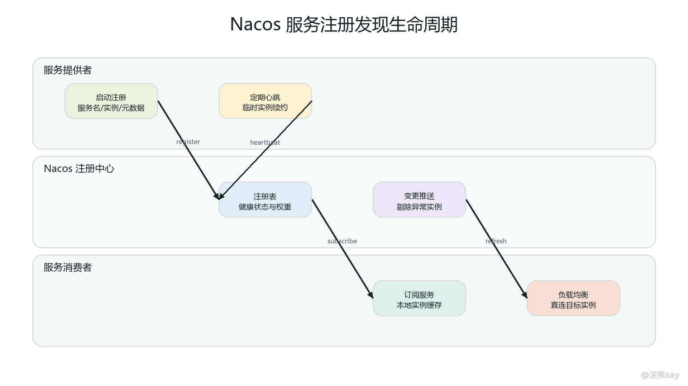
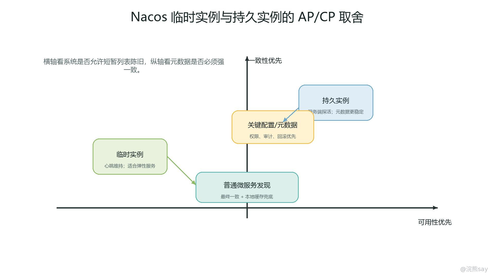
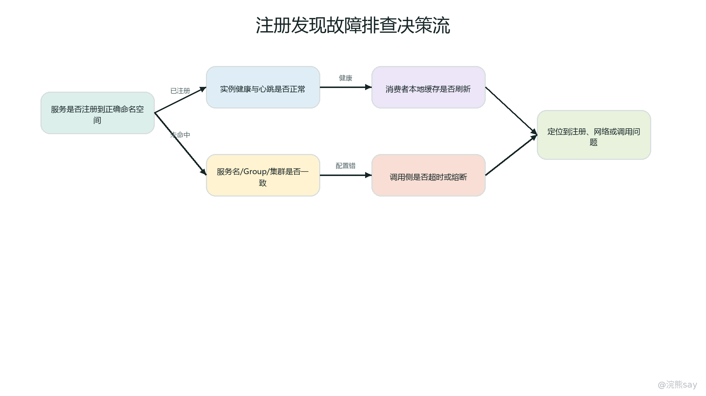

# Nacos 服务发现与注册中心排查

Nacos 作为注册中心时，解决的是微服务系统中“服务实例在哪里、当前是否可用、调用方如何拿到实例列表”的问题。它不直接转发业务请求，也不保证一次远程调用一定成功，而是维护服务名到实例地址的动态目录，并把实例变化同步给消费者。Spring Cloud Alibaba 项目中常见的链路是：服务提供者启动后向 Nacos 注册实例，消费者通过服务名订阅实例列表，OpenFeign 或 Spring Cloud LoadBalancer 再从本地缓存的实例列表中选择目标实例发起 HTTP 调用。

传统硬编码地址的方式适合实例数量固定、部署环境简单的系统。一旦服务进入容器化、弹性伸缩、灰度发布或多集群部署，实例地址会频繁变化，调用方不可能靠手工维护配置来保持准确。Nacos 的价值就在于把地址变化、健康状态、权重、集群、版本、元数据等信息集中管理，并通过心跳、推送、拉取和本地缓存机制，让调用方在大多数情况下能感知可用实例集合。

从工程角度看，注册中心的重点不是“会不会用一个注解”，而是要讲清楚四件事：实例如何注册和续约，消费者如何发现和缓存实例，Nacos 在 AP/CP、一致性和可用性之间如何取舍，注册中心异常时业务调用会受到什么影响。本章围绕这条链路展开，目标是能把 Nacos 注册发现讲成一套可排查、可调参、可面试表达的机制。

## 一、Nacos 注册发现链路的核心对象

Nacos 注册中心中最核心的概念是服务、实例和订阅关系。服务名通常对应一个微服务能力，例如 order-service、user-service 或 device-service；实例是某个服务的一台运行进程，包含 IP、端口、权重、健康状态、是否启用、集群名、元数据等信息；消费者订阅某个服务后，会获得该服务当前可用或全部实例列表，并在本地维护缓存。

在 Spring Cloud Alibaba 中，服务提供者通常通过 spring.cloud.nacos.discovery.server-addr 指向 Nacos 集群，通过 spring.application.name 或显式配置确定注册的服务名。应用启动后，自动配置会收集本机 IP、端口、服务名、命名空间、分组、集群名、权重、元数据等信息，并调用 Nacos Naming 接口完成注册。服务消费者侧也会创建 Nacos Naming 客户端，在第一次按服务名调用或主动订阅时获取服务实例列表。

需要区分两个边界。第一，Nacos 维护的是“服务目录”，不是业务网关。消费者拿到实例列表后，业务请求通常直接打到目标服务实例，Nacos 不在每一次业务请求的转发路径上。第二，注册中心只提供相对及时的实例视图，不能消除网络延迟、应用假死、线程池耗尽、数据库阻塞、连接池打满等问题。也就是说，Nacos 可以告诉你“目前目录里有哪些实例”，但不能保证这些实例每一次调用都能成功返回。

一个完整的服务发现链路可以拆成五步。第一，提供者启动，向 Nacos 注册实例信息。第二，临时实例持续发送心跳，Nacos 根据心跳判断实例健康和存活。第三，消费者按服务名订阅实例列表，并把结果放到本地缓存。第四，业务发起调用时，LoadBalancer 从本地实例列表中按策略选择一个实例。第五，当实例上下线、健康状态或元数据变化时，Nacos 推送或客户端拉取更新，消费者刷新本地缓存。

images/02-nacos-discovery-lifecycle.png

这张生命周期图适合在面试中配合口述：注册中心只在“注册、续约、发现、订阅变更”这几类控制链路中发挥作用，业务流量并不经过 Nacos。正因为业务流量不经过 Nacos，注册中心短暂不可用时，已经拿到实例列表的消费者仍然可能依赖本地缓存继续调用；但也正因为注册中心不参与每次调用，它无法替调用方做实时故障隔离，超时、重试、熔断、降级仍然要在调用链路中单独设计。

## 二、服务注册、心跳与健康检查机制

服务注册本质上是把运行实例写入注册表。实例信息通常包含 ip、port、serviceName、groupName、clusterName、weight、healthy、enabled、ephemeral 和 metadata。其中 healthy 表示健康状态，enabled 表示是否允许流量访问，weight 影响负载均衡选择概率，clusterName 常用于同机房优先或同区域优先调用，metadata 则用于灰度、版本、协议、标签等扩展路由。

临时实例的健康维护依赖客户端心跳。客户端注册完成后，会定期向 Nacos 服务端发送心跳包，心跳中携带实例身份和部分元数据。服务端如果在一段时间内收不到心跳，会先把实例标记为不健康；如果超出删除阈值仍未恢复，就会从注册表中剔除该临时实例。常见默认认知可以记成“几秒级心跳、十几秒健康超时、几十秒删除”，例如很多版本中默认心跳间隔约 5 秒、健康超时约 15 秒、删除超时约 30 秒，但项目里应以当前 Nacos 与客户端版本的实际配置为准。

心跳参数不是越短越好。间隔越短，故障发现越快，但 Nacos 服务端压力、网络包数量和客户端定时任务开销都会增加；间隔越长，系统越稳定，但故障实例被发现和摘除的速度变慢。生产环境通常要结合实例数量、服务端规格、网络稳定性和业务容忍度设置。如果系统对错误调用非常敏感，应重点配合调用侧超时、熔断和重试，而不是只靠把心跳调到极短。

Nacos 的健康检查还要区分“注册中心视角健康”和“业务真实健康”。心跳正常只能说明客户端进程还在按时续约，并不必然说明业务接口、数据库、Redis、MQ、线程池都正常。一个服务如果主线程存活但业务线程池打满，仍然可能正常上报心跳，却对外接口持续超时。因此工程上通常会结合 Actuator 健康检查、接口探活、业务指标、错误率和 P99 延迟来判断服务是否应该继续接流量。必要时可以通过 Nacos 控制台或自动化运维把异常实例设置为下线、降低权重或禁用。

排查注册失败时，先看客户端启动日志中是否成功连接 Nacos，再看命名空间、分组、服务名是否一致，然后检查 IP 选择是否正确。容器环境里常见问题是实例注册成 Pod 内网地址、宿主机地址、回环地址或不可达网段，导致消费者能发现实例但无法连接。还要检查端口是否是应用真实监听端口，是否被网关、Service Mesh 或容器端口映射改变。注册中心里“看得到实例”只是第一步，消费者网络上“打得到实例”才是可调用。

## 三、临时实例、持久实例与 AP/CP 取舍

images/02-nacos-ap-cp-instance-model.png

Nacos 实例可以按 ephemeral 分为临时实例和持久实例。临时实例通常对应普通微服务进程，生命周期跟客户端进程绑定，依赖客户端心跳续约。如果实例宕机、网络断开或进程退出，Nacos 在心跳超时后会自动标记不健康并剔除。大多数 Spring Cloud 服务注册场景默认更适合临时实例，因为容器化环境中实例频繁创建和销毁，注册中心应该自动清理失联实例。

持久实例更像一条被注册中心长期保存的服务地址记录。它不会因为客户端停止发送心跳就被简单删除，健康状态更多依赖服务端探测或人工维护。持久实例适合一些相对固定的服务地址、非 SDK 注册的外部服务、需要人工维护生命周期的实例。它的好处是实例记录稳定，不会因为短暂客户端异常丢失；代价是如果运维没有及时维护健康状态，消费者可能看到已经不可用的地址。

临时实例和持久实例背后对应 Nacos 的一致性取舍。简单记忆可以是：临时实例偏 AP，强调高可用和最终一致；持久实例偏 CP，强调注册数据的一致性。AP 模式下，在网络抖动或节点异常时，注册中心更倾向于保持服务发现能力，允许短时间内不同节点看到的实例视图略有差异，后续再通过同步收敛。CP 模式下，注册数据写入更强调多数派确认和一致性，牺牲一部分可用性来避免注册表分裂。

这组取舍在面试里经常被问成“Nacos 和 Eureka 有什么区别”。不能只回答“Nacos 支持 AP 和 CP”。更完整的表达是：Eureka 的服务注册发现整体偏 AP，自我保护机制也体现了可用性优先；Nacos 同时支持临时实例和持久实例，临时实例适合普通微服务弹性伸缩，偏向 AP，持久实例适合需要更强一致注册数据的场景，偏向 CP。实际项目中，大多数业务服务用临时实例即可，不要为了听起来更“强一致”就把所有服务都改成持久实例。

选择实例类型时可以按三条线判断。第一，看实例生命周期是否由应用进程自然驱动，如果是容器、K8s、弹性伸缩实例，优先临时实例。第二，看注册数据是否必须被长期保留，如果服务地址是人工维护的外部系统或固定基础设施，可以考虑持久实例。第三，看故障处理期望，如果更希望注册中心自动剔除失联进程，临时实例更合适；如果更希望地址记录不因客户端波动消失，就需要持久实例配合健康探测和运维流程。

## 四、消费者本地缓存与实例列表刷新

消费者调用服务时，通常不会每次都实时请求 Nacos 查询实例列表，而是使用本地缓存。这个设计非常关键：如果每一次业务调用都访问注册中心，注册中心就会变成高频业务链路上的瓶颈；一旦 Nacos 抖动，所有业务调用都会被放大影响。客户端本地缓存把“服务目录同步”和“业务调用”解耦，使业务调用在短时间内可以依赖已有实例列表继续运行。

本地缓存一般包含内存中的服务实例列表，也可能包含磁盘快照或故障转移缓存。消费者订阅服务后，Nacos 客户端会维护对应服务的 ServiceInfo，当服务端推送实例变更或客户端定时更新时，本地列表随之刷新。OpenFeign 或 LoadBalancer 发起调用时，拿到的是客户端当前缓存视图。这个视图通常足够及时，但不是绝对实时，因此刚下线的实例仍可能被短暂调用，刚上线的实例也可能需要一点时间才被消费者选中。

本地缓存带来的第一个工程问题是“延迟摘除”。服务实例已经宕机，但消费者本地缓存还没刷新，或实例已经被标记不健康但调用侧仍有旧连接、旧列表和正在执行的请求，就可能出现短时间调用失败。解决方式不是只依赖注册中心，而是要给 HTTP 客户端配置合理的连接超时、读取超时、连接池、失败重试和熔断策略。对于非幂等接口，重试要谨慎，避免一个订单创建或扣款请求被重复执行。

第二个问题是“缓存污染”。如果实例注册的 IP、端口、集群名或元数据错误，消费者会把错误信息缓存下来，后续负载均衡不断选中异常实例。排查时要从消费者视角看它实际拿到了什么实例，而不是只看 Nacos 控制台。可以通过应用日志、临时诊断接口、LoadBalancer 调试日志或 Nacos 客户端日志确认本地服务列表，检查是否存在不可达 IP、错误端口、权重异常、健康状态不一致、元数据缺失等问题。

第三个问题是“注册中心恢复后缓存没有按预期更新”。这类问题常见于消费者与 Nacos 长连接异常、订阅没有建立成功、命名空间或分组写错、客户端版本兼容问题、网络策略阻断推送通道。排查时应确认消费者是否订阅了正确的服务名，客户端日志里是否持续出现连接重建、订阅失败、反序列化失败、权限失败等异常。如果只重启服务可以恢复，说明很可能是客户端连接、订阅状态或本地缓存刷新链路出了问题。

本地缓存还决定了注册中心故障时的调用影响。如果 Nacos 短暂不可用，已经启动且已经拿到实例列表的消费者通常可以继续调用旧实例；但新启动消费者可能拿不到实例列表，新上线提供者无法被及时发现，已下线或故障实例无法被及时摘除，灰度和权重调整也无法及时生效。这个结论在面试里很重要：注册中心故障不等于所有业务调用立刻中断，但服务发现的动态能力会下降。

## 五、实例元数据、权重与灰度路由

Nacos 实例元数据是注册发现从“能找到地址”走向“能按规则选地址”的关键。元数据本质上是一组键值对，可以描述实例版本、部署区域、机房、协议、租户、灰度标记、能力标签等。例如 version=v2、zone=shanghai-a、gray=true、protocol=http、secure=true 都可以作为调用侧路由决策的依据。

权重用于影响实例被选中的概率。灰度发布、容量差异和预热场景中经常会调权重。例如新版本只想承接 5% 流量，可以注册为同一服务下的实例，但把权重设置得较低；性能更强的机器可以适当提高权重；刚启动的实例为了避免瞬间被打满，可以先低权重预热，再逐步提升。权重不是限流器，它只影响负载均衡选择概率，不能保证精确流量比例，也不能替代 Sentinel、网关限流或业务侧容量保护。

集群名常用于就近调用。一个服务可能在多个机房或可用区部署，消费者优先调用同集群实例，可以降低跨机房延迟和网络成本。若同集群没有可用实例，再降级选择其他集群实例。这类策略需要调用侧负载均衡规则配合，Nacos 只负责保存实例的 clusterName，真正如何选实例由客户端策略决定。

元数据还常用于版本隔离和灰度路由。比如用户服务有 v1 和 v2 两个版本，普通流量走 v1，测试账号、内部租户或灰度用户走 v2。此时不能只在 Nacos 上加元数据，还要在网关、Feign 拦截器、LoadBalancer 策略或请求上下文中传递灰度标记，并在选择实例时过滤对应元数据。否则元数据只是“挂在实例上的说明”，不会自动改变调用路径。

元数据使用过多也会带来维护风险。标签命名不统一、大小写混乱、不同服务含义不一致、发布时忘记更新元数据，都会导致路由规则失效。生产项目最好把常用元数据收敛成少数稳定字段，配合发布平台、配置中心或脚本自动写入，避免开发人员在多个服务里手工维护。排查灰度问题时，要同时看请求标记、负载均衡过滤规则、实例元数据和最终访问日志，不能只看 Nacos 控制台上有没有某个标签。

## 六、注册中心故障时的调用影响

Nacos 故障要分层看，不能笼统说“服务全挂了”。第一类是服务端部分节点异常。如果 Nacos 集群仍有可用节点，客户端可能通过重连、节点切换或负载均衡继续访问注册中心，影响主要表现为日志报错、订阅延迟、服务列表刷新变慢。第二类是注册中心整体不可用。此时已经缓存实例列表的消费者可以在一段时间内继续调用旧实例，但服务发现的新鲜度下降。第三类是注册中心可访问但数据异常，例如命名空间错乱、服务列表为空、实例健康状态错误、权限配置错误，这类问题对调用链路影响更直接。

对服务提供者来说，注册中心故障会影响注册和续约。已经注册的临时实例如果无法续约，Nacos 服务端恢复后可能把实例视为过期；新启动实例可能注册失败，导致消费者无法发现新容量；主动下线或权重调整也可能失败。对消费者来说，故障主要影响订阅和刷新，新服务列表拿不到，旧列表继续用，错误实例无法及时摘除。

对业务调用来说，影响取决于调用链路是否依赖实时发现。如果消费者已经有可用缓存，且实例本身健康，短时间调用可能继续成功；如果消费者刚启动、服务名第一次调用、缓存为空，调用会因为找不到实例失败；如果旧缓存中包含已经故障的实例，调用会出现超时、连接失败或 5xx；如果正在发布扩容，新实例无法被发现，容量提升不会立刻生效。这里的判断逻辑比“注册中心挂了所以服务都挂了”更符合真实工程。

还要注意注册中心故障与下游服务故障的区分。请求超时不一定是 Nacos 问题，可能是目标服务线程池满、数据库慢查询、连接池耗尽、网关限流、DNS 异常或网络 ACL 阻断。Nacos 问题通常会伴随服务发现日志异常、实例列表为空、订阅失败、注册失败、心跳失败、客户端重连频繁等信号。真正排查时，应把“发现链路”和“业务调用链路”分开看。

images/02-nacos-registry-failure-diagnosis.png

这张排查图可以按“控制面”和“数据面”理解。控制面是注册、心跳、订阅、推送和实例列表刷新；数据面是消费者到服务提供者的真实 HTTP/RPC 请求。Nacos 异常主要影响控制面，业务请求是否失败，还要看本地缓存、目标实例健康、负载均衡策略和调用侧容错配置。

## 七、线上排查步骤与参数取舍

排查 Nacos 注册发现问题时，第一步先明确现象。是提供者没有出现在控制台，消费者提示没有可用实例，还是调用到了错误实例？是所有服务异常，还是某个服务、某个命名空间、某个集群异常？是发布后出现，还是网络变更、权限变更、Nacos 升级后出现？现象范围越清楚，越能避免在注册中心、网关、Feign、网络和业务服务之间来回猜。

第二步看服务端状态。检查 Nacos 集群节点是否存活，控制台是否能打开，服务列表是否完整，节点之间是否同步正常，磁盘、内存、CPU、连接数和日志是否异常。若使用鉴权，还要检查账号、权限、Token、命名空间访问是否正常。Nacos 服务端日志中如果出现大量连接失败、心跳处理异常、数据同步失败或权限拒绝，说明问题在注册中心或客户端到注册中心的控制链路上。

第三步看提供者注册。确认应用启动日志中注册是否成功，注册的服务名、命名空间、分组、集群名是否符合消费者配置，IP 和端口是否从消费者网络可达。容器、虚拟机、多网卡机器容易注册错 IP；本地调试容易把 127.0.0.1 注册给其他机器；K8s 环境要确认 Pod IP、NodePort、Service 和实际调用方式是否匹配。如果注册信息错了，Nacos 控制台看起来“有实例”，调用仍然会失败。

第四步看消费者发现。确认消费者订阅的服务名、命名空间和分组与提供者一致，检查本地缓存实例列表是否为空，观察 Nacos 客户端是否持续重连或订阅失败。若使用 OpenFeign，要确认 @FeignClient 的 name 与服务名一致；若使用自定义 LoadBalancer，要确认没有错误过滤掉全部实例；若做灰度路由，要确认请求上下文里的版本标记与实例元数据匹配。

第五步看业务调用。若消费者能发现实例但调用失败，要从网络连通性、端口监听、HTTP 客户端超时、连接池、TLS、网关转发、目标服务日志、线程池、数据库和下游依赖继续排查。注册中心只负责给地址，地址可达性和接口响应能力要通过真实请求验证。可以临时对目标实例发起 curl 或健康检查，也可以用 traceId 追踪一次失败请求最终落到哪个实例。

参数取舍可以按下面这张表记忆：
| 参数或机制 | 调小或增强的收益 | 调小或增强的风险 | 项目表达重点 |
| --- | --- | --- | --- |
| 心跳间隔 | 更快感知实例存活 | 服务端压力和网络包增加 | 不靠极短心跳解决所有故障 |
| 健康超时 | 更快标记异常实例 | 网络抖动时可能误判 | 与调用侧超时、熔断配合 |
| 删除超时 | 更快清理临时实例 | 短暂抖动后实例需要重新注册 | 适合弹性实例，注意误删 |
| 权重 | 控制实例接流概率 | 不是精确限流 | 灰度和容量差异要结合监控 |
| 本地缓存 | 降低注册中心依赖 | 实例视图有延迟 | 注册中心故障时可短暂续航 |
| 元数据路由 | 支持版本、区域、灰度 | 标签维护复杂 | 规则、标签、请求标记要闭环 |

生产建议可以概括为：注册中心参数保持稳健，调用侧容错做扎实，发布平台维护元数据，监控系统覆盖控制面和数据面。不要把所有稳定性压力都压到 Nacos 心跳上。真正可靠的微服务调用链路，通常需要 Nacos、LoadBalancer、HTTP 客户端、Sentinel 或 Resilience4j、网关、日志和指标共同配合。

## 八、面试追问与表达模板

面试问“Nacos 注册中心的工作原理”时，可以这样回答：Nacos 维护服务名到实例列表的映射。提供者启动后把 IP、端口、权重、集群、健康状态和元数据注册到 Nacos；临时实例通过心跳续约，服务端根据心跳判断健康和剔除；消费者按服务名订阅实例列表并缓存在本地；调用时由 LoadBalancer 从本地列表选择目标实例；实例上下线或状态变化后，Nacos 通知消费者刷新缓存。注册中心不转发业务流量，所以还需要超时、重试、熔断和降级来保护真实调用。

追问“注册中心挂了，服务还能不能调用”时，要分情况回答。已经启动并且有本地缓存的消费者，短时间内可能继续调用已有实例；新启动消费者、第一次调用某服务或缓存为空时，可能因为拿不到实例列表而失败；新实例注册、旧实例摘除、权重变更和灰度路由会受影响；如果旧缓存里有坏实例，调用侧仍会失败。因此注册中心故障不是业务立刻全断，但会让服务发现动态能力下降。

追问“Nacos 临时实例和持久实例有什么区别”时，可以强调生命周期和一致性。临时实例跟客户端进程绑定，通过心跳续约，失联后自动剔除，适合普通微服务弹性伸缩，整体偏 AP；持久实例记录会保留，更多依赖服务端探测或人工维护健康，适合固定地址或外部服务，注册数据更偏 CP。项目里大多数微服务用临时实例即可，持久实例要配合运维流程，否则容易留下不可用地址。

追问“为什么消费者要本地缓存实例列表”时，可以从性能和可用性解释。如果每次调用都查 Nacos，注册中心会进入业务高频链路，调用延迟和故障影响都会被放大。本地缓存让服务发现控制面和业务调用数据面解耦，Nacos 短暂异常时消费者仍可用旧列表调用。但缓存也带来延迟摘除和旧实例短暂命中的问题，所以调用侧要有超时、熔断、重试和健康过滤。

追问“如何排查消费者找不到服务实例”时，可以按顺序说：先看 Nacos 控制台有没有提供者实例；再核对命名空间、分组、服务名、集群名是否一致；再看提供者注册 IP 和端口是否可达；然后看消费者 Nacos 客户端日志和本地缓存；如果使用 Feign，确认 @FeignClient 的服务名；如果使用灰度或元数据过滤，检查是否把所有实例过滤掉。最后再进入网络连通性、网关、目标服务健康和调用侧超时排查。

## 九、学习自测

1. Nacos 注册中心是否会转发每一次业务请求？为什么这个结论会影响注册中心故障时的判断？

参考回答：通常不会。消费者拿到实例列表后直接调用目标实例，Nacos 主要负责注册、发现、订阅和实例变更通知。因此 Nacos 短暂不可用时，已有缓存的消费者可能继续调用旧实例；但新实例发现、旧实例摘除和缓存刷新会受到影响。

1. 临时实例为什么更适合普通 Spring Cloud 微服务？

参考回答：普通微服务实例通常跟进程、容器或 Pod 生命周期绑定，会频繁启动、停止和扩缩容。临时实例通过心跳维护存活状态，失联后自动剔除，能减少人工清理成本，也更符合弹性环境的 AP 型服务发现需求。

1. 如果 Nacos 控制台能看到实例，但消费者调用失败，应该优先怀疑哪些方向？

参考回答：要检查注册 IP 和端口是否可达，命名空间、分组、服务名和集群名是否一致，消费者本地缓存是否拿到正确实例，LoadBalancer 或灰度规则是否过滤异常，目标服务端口是否真实监听，以及 HTTP 客户端超时、连接池、目标服务日志和网络策略是否正常。

1. 心跳间隔调得很短能不能彻底解决故障实例调用问题？

参考回答：不能。更短心跳只能加快注册中心发现失联实例，但会增加服务端和网络压力，而且无法识别所有业务假死场景。目标服务业务线程池打满、数据库慢、接口阻塞时，心跳可能仍然正常。调用侧仍需要超时、熔断、降级、重试和业务健康检查。

1. 元数据为什么不能只在 Nacos 控制台配置完就算灰度完成？

参考回答：元数据只是实例上的标签，不会自动改变所有调用路径。灰度需要请求侧携带灰度标记，网关或调用侧把标记传递下去，LoadBalancer 根据元数据过滤或选择实例，并通过日志和监控验证流量是否真的进入目标版本。

1. 注册中心整体不可用时，新启动消费者和已经运行的消费者有什么差异？

参考回答：已经运行的消费者可能有本地缓存，可以继续调用旧实例；新启动消费者没有缓存或第一次订阅失败，可能拿不到实例列表而无法调用。即使已运行消费者还能调用，也会面临实例列表陈旧、坏实例无法及时摘除、新实例无法及时发现的问题。

复习到位的标准是：能画出注册、心跳、订阅、本地缓存和调用的完整链路；能解释临时实例与持久实例的取舍；能把 AP/CP 放到实例类型和工程场景里讲；能区分注册中心控制面故障和业务调用数据面故障；能按服务端、提供者、消费者、负载均衡和真实调用五层排查 Nacos 相关线上问题。
