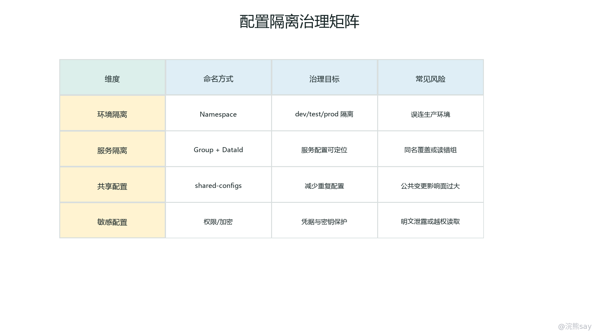
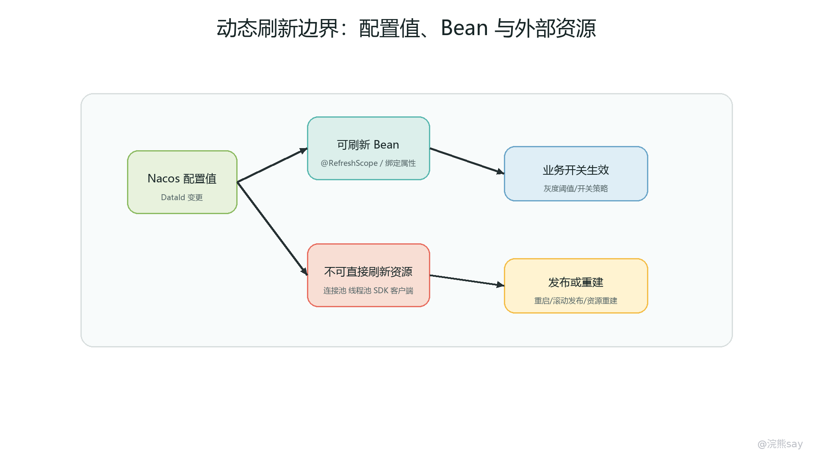
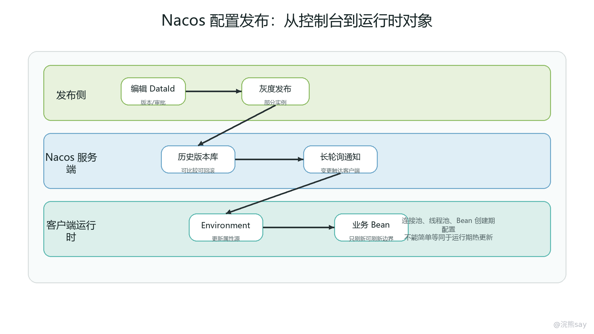
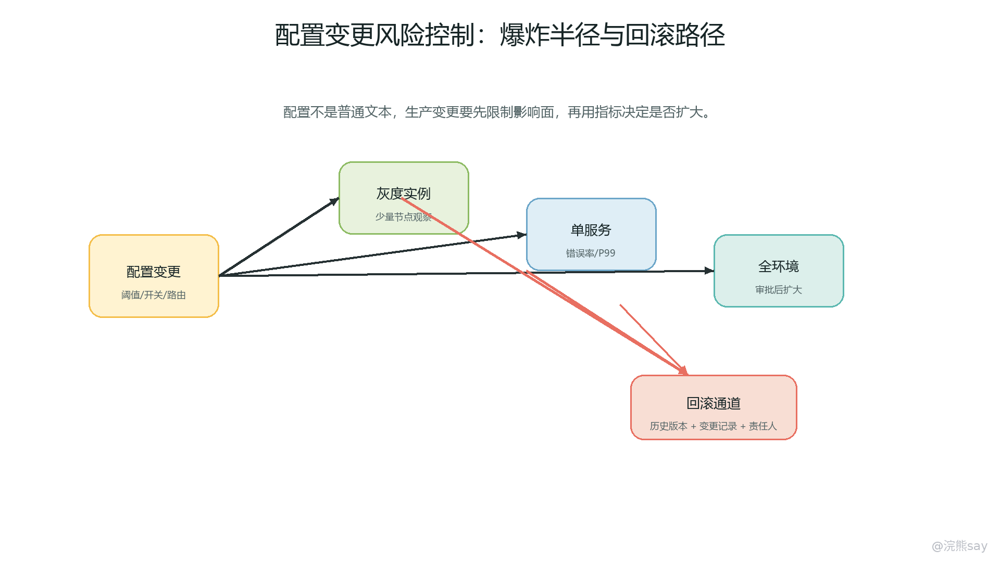

# Nacos 配置中心与动态配置治理

Nacos Config 是 Nacos 提供的集中配置管理能力，它解决的不是“把 application.yml 换个地方存放”这么简单的问题，而是微服务系统中配置如何被隔离、发布、监听、刷新、回滚、审计和排查的问题。单体应用里，配置通常跟随代码一起打包发布；微服务系统里，几十个服务、多个环境、多套租户、多个灰度批次同时存在，如果仍然靠人工复制配置文件，很容易出现测试配置污染生产、服务读取错配置、开关误开全量、敏感信息泄漏和错误配置快速扩散。

从工程角度看，配置中心是一种运行期治理能力。它把配置从应用包中抽离出来，用统一的命名、权限、版本和发布流程管理，让服务在启动时可以拉取配置，在运行中可以感知部分配置变化，并在出现问题时快速回滚。但也正因为它绕过了完整发版流程，配置中心必须被当成生产变更入口来治理，而不是被当成一个随手修改的在线文本框。

## 一、配置中心的职责边界

配置中心首先负责集中管理配置。常见配置包括数据库连接地址、Redis 地址、缓存开关、限流阈值、业务开关、第三方接口地址、灰度规则、日志级别、设备阈值、告警策略等。对于微服务项目来说，集中管理的价值在于减少重复配置、统一环境差异、降低回滚成本，并让配置变更有记录可查。

但配置中心并不适合承载所有运行参数。动态刷新适合开关类、阈值类、策略类和路由类配置，因为这些配置通常可以在运行期被重新读取；不适合随意刷新连接池核心参数、线程池结构性参数、序列化框架配置、日志框架底层初始化参数、Bean 创建阶段就固定下来的依赖关系。配置中心把新值推给客户端，不代表运行中的对象一定会安全重建。

面试里可以把职责边界讲成三层。第一层是存储层，Nacos 保存不同环境、不同服务、不同分组的配置，并记录版本历史。第二层是分发层，客户端启动时拉取配置，运行期通过监听机制感知配置变化。第三层是治理层，生产变更需要权限、审批、灰度、回滚、审计和监控验证。只讲“配置变了会自动刷新”，说明还停留在功能使用；能讲清楚哪些配置能刷新、刷新后风险在哪里，才是工程表达。
| 配置类型 | 是否适合动态刷新 | 生产治理重点 |
| --- | --- | --- |
| 业务开关、功能开关 | 适合 | 控制范围、默认值、回滚路径 |
| 阈值、限流、告警策略 | 适合 | 灰度验证、指标观察、单位校验 |
| 路由、灰度规则 | 适合但要谨慎 | 命中范围、白名单、错误兜底 |
| 数据库、Redis 连接信息 | 通常不建议直接热刷新 | 密钥管理、重启验证、连接池重建 |
| 线程池核心结构参数 | 取决于实现 | 是否支持重新绑定、是否影响存量任务 |
| 日志框架底层配置 | 取决于框架 | 避免全量 DEBUG、避免敏感日志 |

一个常见误区是把配置中心当成“无发布改代码”的入口。例如把复杂业务规则都写成配置，表面上发布更快，实际上会让代码分支、配置语义和线上行为变得难以追踪。更合理的做法是：稳定规则写在代码中，变化频繁且有明确边界的参数放在配置中心；配置变更需要能被解释、能被审计、能被回滚。

## 二、Namespace、Group、DataId 的隔离模型

Nacos Config 的核心定位由 Namespace、Group、DataId 三个维度组成。Namespace 通常用来做环境级或租户级隔离，例如 dev、test、prod，也可以用于不同业务域或不同客户的配置空间。Group 用来做应用组、业务组或配置用途分组，例如 DEFAULT\_GROUP、ORDER\_GROUP、IOT\_GROUP。DataId 通常对应一个具体配置文件，例如 device-service.yaml、common.yaml、gateway-gray.yaml。

这三个概念不能只背名词，要能讲出为什么需要它们。Namespace 解决大边界问题，避免测试环境的配置被生产环境读取；Group 解决组织和业务归属问题，避免不同业务团队的配置混在一起；DataId 解决具体文件和配置项定位问题，让客户端知道要读取哪一份配置。三者组合起来，才构成一条完整的配置地址。

images/03-nacos-config-isolation-governance.png

在生产项目中，常见设计是用 Namespace 区分环境，用 Group 区分业务域或团队，用 DataId 区分服务配置和公共配置。例如 IoT 项目中，可以把 prod 命名空间作为生产环境，IOT\_GROUP 作为设备平台业务组，device-service.yaml 作为设备服务自身配置，iot-common.yaml 作为公共配置，alarm-rule.yaml 作为告警策略配置。这样排查时能快速回答三个问题：当前应用读的是哪个环境、哪个业务组、哪一份配置。

隔离模型的风险也很明显。第一，Namespace 写错会让服务读取到另一个环境的配置，最严重时可能出现测试库、生产库串用。第二，Group 不一致会导致控制台能看到配置，但客户端始终拉不到。第三，DataId 命名不统一会导致服务在不同 Profile 下读取错文件。第四，多个共享配置叠加时，如果没有优先级规范，同一个 key 可能被后加载的配置覆盖。

面试表达可以这样说：“Nacos 的配置定位不是只靠文件名，而是 Namespace、Group、DataId 三元组。Namespace 更适合做环境或租户隔离，Group 适合做业务分组，DataId 对应具体配置文件。项目里会把生产和测试 Namespace 严格隔离，并限制生产 Namespace 的修改权限，避免服务误读配置或错误配置跨环境扩散。”

## 三、配置加载链路与共享配置

Nacos 配置的读取链路可以分成启动加载和运行监听两段。启动时，客户端根据服务名、Profile、文件扩展名、Namespace、Group 等信息组装 DataId，然后从 Nacos 拉取配置并加入 Spring Environment。运行期，如果配置发生变化，客户端监听到变更，再触发本地配置更新和相关 Bean 刷新。

在 Spring Cloud Alibaba 项目中，常见 DataId 命名会围绕应用名和 Profile 展开，例如 user-service.yaml、user-service-dev.yaml、user-service-prod.yaml。应用级配置放服务自己的 DataId，公共配置放共享 DataId，例如 common.yaml、redis.yaml、sentinel-rule.yaml。这样既能避免每个服务重复写公共项，又能保留服务自己的差异化配置。

共享配置和服务配置要特别关注优先级。一般来说，服务自身配置应该比公共配置更靠近业务，也更适合覆盖公共默认值；公共配置负责提供统一默认值，不应该悄悄覆盖服务的关键个性化参数。实际项目中要在团队内约定：哪些 key 只能放公共配置，哪些 key 只能放服务配置，哪些 key 可以被服务覆盖。否则一个公共 DataId 的修改，可能影响一批服务。

下面是一种常见的配置分层方式：

spring: 
application: 
name: device-service 
cloud: 
nacos: 
config: 
server-addr: nacos.prod.internal:8848 
namespace: prod 
group: IOT\_GROUP 
file-extension: yaml 
shared-configs: 
\- data-id: iot-common.yaml 
group: IOT\_GROUP 
refresh: true 
\- data-id: redis-common.yaml 
group: INFRA\_GROUP 
refresh: false

这段配置里，device-service 代表服务自身配置入口，iot-common.yaml 是 IoT 业务公共配置，redis-common.yaml 是基础设施公共配置。refresh: true 表示允许监听刷新，但它只说明客户端会感知变化，不等于所有使用这些配置的对象都会自动安全更新。生产环境中，公共配置的刷新尤其要谨慎，因为它的影响范围通常比单服务配置更大。

配置加载还要考虑 Spring 配置优先级。启动参数、环境变量、本地配置文件、远程配置、Profile 配置、共享配置之间存在覆盖关系。线上排查“明明 Nacos 改了值，应用里还是旧值”时，不能只看 Nacos 控制台，要同时检查是否被 JVM 参数、容器环境变量、Kubernetes ConfigMap、本地 application.yml 或更高优先级的 PropertySource 覆盖。

## 四、动态刷新与配置监听机制

images/03-refresh-scope-runtime-boundary.png

Nacos 动态刷新依赖客户端监听配置变更。客户端通常会为关心的 DataId 注册监听，服务端配置发布后，客户端收到变更通知或通过长轮询感知变化，然后拉取最新配置内容，计算差异，更新本地缓存，再把变更交给 Spring Cloud 的刷新机制处理。这个过程可以理解为“发布配置 -> 通知客户端 -> 更新 Environment -> 刷新可刷新对象”。

images/03-nacos-config-publish-refresh.png

刷新链路里有两个边界必须讲清楚。第一，Nacos 负责发现配置内容变化，不负责判断配置语义是否正确。比如阈值单位写错、JSON 格式不符合业务要求、开关组合互相冲突，Nacos 只能分发，不能替业务兜底。第二，Spring 刷新机制只会影响支持重新绑定或处在刷新作用域内的对象。使用 @Value 注入到普通单例 Bean 的字段、构造方法里固定下来的值、初始化阶段创建的连接池参数，都可能不会按预期更新。

常见做法是用 @ConfigurationProperties 承接一组配置，再配合刷新能力让属性重新绑定；对于确实需要重新创建的 Bean，可以使用 @RefreshScope。但 @RefreshScope 不是越多越好，它会通过代理和刷新作用域管理 Bean 生命周期，过度使用会增加理解成本，也可能在刷新瞬间带来状态切换问题。对于高频访问、持有连接、持有本地缓存或有复杂初始化逻辑的 Bean，刷新前要明确它是否可以被安全重建。

@ConfigurationProperties(prefix = "device.alarm") 
public class AlarmRuleProperties { 
private boolean enabled; 
private int offlineMinutes; 
private List&lt;String> notifyChannels; 
// getter/setter 
}

这类属性对象适合承载业务开关和阈值，因为它表达的是一组可变策略。相比把多个 key 分散注入到不同 Bean 中，集中配置对象更容易校验、打印摘要和做变更审计。生产上还可以在监听到配置变化后，输出一条脱敏后的配置变更日志，例如配置版本、DataId、变更人、关键开关摘要、旧值新值 hash，而不是完整打印敏感内容。

动态刷新还有一个常见坑：刷新粒度比想象中更粗。一次 DataId 发布可能触发整个配置文件的重新解析；一个公共配置刷新可能影响多个服务实例；一个错误配置可能在很短时间内被所有实例接收。因此，动态刷新不是免发布的万能钥匙，而是一条需要限权、灰度、监控和回滚的生产变更链路。

## 五、灰度发布、回滚与错误扩散控制

images/03-config-risk-blast-radius.png

配置灰度的目标是控制影响范围。普通发布是把配置直接推给所有订阅实例；灰度发布则希望先让一部分实例、一部分用户、一部分租户或一部分设备命中新配置，观察指标稳定后再扩大范围。Nacos 自身提供历史版本和回滚能力，具体灰度策略还经常要结合业务开关、网关路由、实例 metadata、租户白名单和监控指标一起实现。

配置灰度不能只理解成“先改一个小开关”。真正可控的灰度至少要回答四个问题：谁会命中新配置，命中后如何验证效果，出现异常如何快速回滚，回滚后是否还有本地缓存或下游状态残留。比如设备告警阈值从 10 分钟改成 3 分钟，如果直接全量生效，可能导致告警量暴增、通知通道拥塞、客服工单飙升。更好的方式是先按租户或设备分组灰度，再观察告警数量、通知成功率、接口延迟和用户反馈。

配置回滚通常依赖历史版本。Nacos 控制台可以查看配置历史并回滚到某个版本，但工程上不能只依赖“点一下回滚”。关键配置应该在发布前记录变更单、发布人、审批人、影响范围和预期指标；发布后观察错误率、P99 延迟、业务成功率、消息堆积和告警量；出现异常时要能判断是配置问题、代码问题、依赖问题还是数据问题。否则回滚配置可能掩盖真正根因。

错误配置扩散风险是配置中心最容易被低估的风险。一次发版通常经过构建、测试、发布窗口和灰度流程，而配置变更可能由一个人在控制台直接完成。如果没有权限和审批，一个错误的数据库地址、错误的限流阈值、错误的路由规则、错误的开关组合，会比代码发布更快影响线上。生产治理上应当把配置变更纳入发布管理：关键 Namespace 只允许少数角色修改；关键 DataId 修改需要审批；高风险配置必须灰度；每次变更都要有审计记录和回滚方案。

面试中可以用这句话收束：“动态配置降低了发版成本，但提升了变更治理要求。我们不会把生产 Nacos 当成随手编辑的配置文件，而是把它当成生产发布入口，关键配置要有权限、审批、灰度、监控和回滚。”

## 六、敏感配置、权限审计与安全边界

敏感配置包括数据库密码、Redis 密码、第三方密钥、Token、证书、私钥、短信平台密钥、支付回调密钥等。把这些内容集中到配置中心后，管理效率提高了，但泄漏影响面也变大了。以前某个服务的本地配置泄漏，影响可能只限于一个应用；现在如果配置中心权限过宽，攻击者可能一次看到多个环境、多个服务的关键凭据。

生产环境至少要做四类治理。第一，访问控制，按 Namespace、Group、DataId 控制谁能查看、修改、发布和回滚，开发人员不应默认拥有生产敏感配置明文查看权限。第二，加密存储或密钥托管，敏感值尽量由 KMS、Vault、云密钥服务或内部密钥平台管理，Nacos 中只保存引用或密文。第三，审计追踪，记录谁在什么时间查看、修改、发布了哪份配置。第四，日志脱敏，应用启动和刷新时不要完整打印密码、Token、私钥和连接串。

敏感配置还涉及轮换机制。密钥不是写进去就结束，它应该支持定期轮换、泄漏后快速替换、旧密钥过渡期兼容和变更后验证。比如第三方接口密钥轮换时，可以先让服务支持新旧双密钥，再灰度切换调用方，最后废弃旧密钥。如果直接覆盖一个全量使用的密钥，任何刷新失败、缓存未更新或依赖方未同步，都可能导致大面积调用失败。

审计并不只是为了事后追责，更是为了排查。线上故障发生后，如果能看到最近 30 分钟哪些 DataId 被改过、谁发布的、改了哪些 key、影响哪些服务，排查速度会明显提升。反过来，如果配置中心没有审计记录，排查只能靠口头确认，很容易漏掉“刚改过一个不起眼开关”这种真正根因。

## 七、配置问题排查路径

配置问题的排查要从“定位配置地址”开始，而不是直接怀疑代码。第一步确认应用读取的 Namespace、Group、DataId、Profile、服务名和文件扩展名是否正确。很多线上问题来自环境错配：控制台看的是 prod Namespace，应用实际读的是另一个 Namespace；配置发布到了 DEFAULT\_GROUP，客户端却读 IOT\_GROUP；DataId 使用了 yaml 后缀，客户端配置的扩展名却是 properties。

第二步确认配置是否发布成功以及客户端是否监听成功。看 Nacos 控制台的配置版本、发布时间、发布人和历史记录；再看应用日志是否连接到正确的 Nacos 地址，是否拉取到目标 DataId，是否收到刷新事件。网络策略、防火墙、权限、Token 过期、Nacos 集群异常，都可能导致客户端读取失败或监听中断。

第三步检查配置优先级和覆盖关系。Spring Boot 中启动参数、环境变量、本地配置、远程配置、Profile 配置可能互相覆盖。容器化部署时尤其要注意 Kubernetes 环境变量、启动命令、ConfigMap、Secret、镜像内置配置与 Nacos 配置的关系。排查时可以通过 Actuator 的 environment 端点、启动日志或临时诊断日志确认最终生效值来自哪个 PropertySource。

第四步检查刷新边界。配置中心已经推送新值，但目标 Bean 不一定刷新。排查时要确认属性绑定方式，是 @ConfigurationProperties、@Value、构造方法参数还是手动读取 Environment；确认 Bean 是否在刷新作用域内；确认组件是否支持运行期重建。对于连接池、线程池、缓存客户端这类对象，还要看是否需要主动关闭旧资源并创建新资源。

第五步检查配置值本身。常见错误包括布尔值写成字符串、时间单位不一致、数字范围越界、YAML 缩进错误、列表格式错误、JSON 内容不合法、中文或特殊字符编码问题、枚举值大小写不匹配。配置中心只保证内容分发，不保证业务语义正确，所以关键配置最好在应用侧做启动校验和刷新校验，发现非法值时拒绝生效并告警。

可以把排查模板记成一句话：“先定位三元组，再看发布和监听，再看优先级覆盖，再看 Bean 刷新边界，最后校验配置值语义。”这比只说“重启一下服务试试”更接近真实工程。

## 八、面试表达与学习自测

Nacos Config 的面试回答可以从四段展开。第一段讲定位：它是配置中心，解决多服务配置集中管理、环境隔离、动态刷新、版本回滚和权限审计问题。第二段讲模型：配置通过 Namespace、Group、DataId 定位，Namespace 常用于环境或租户隔离，Group 用于业务分组，DataId 对应具体配置文件。第三段讲机制：客户端启动时拉取配置，运行期监听 DataId 变化，配置发布后更新本地 Environment，并刷新支持动态绑定的对象。第四段讲边界：不是所有配置都适合热更新，错误配置会快速扩散，生产配置需要权限、审批、灰度、回滚、审计和监控。

如果面试官追问“为什么有些配置刷新不生效”，可以回答：“配置中心只能把新配置推到客户端，最终是否生效取决于 Spring 的属性绑定和目标 Bean 的生命周期。普通单例 Bean 构造时写死的字段、连接池初始化参数、没有放进刷新作用域的对象，都可能不会自动更新。项目里通常用 @ConfigurationProperties 管理可变业务配置，必要时配合 @RefreshScope，但对于连接池、线程池这类资源型 Bean，会更谨慎，通常通过灰度发布或重启来保证安全。”

如果追问“生产配置怎么治理”，可以回答：“生产 Nacos 不是所有人都能随意修改。我们会按 Namespace 和 DataId 控制权限，关键配置走审批，发布前明确影响范围，发布时先灰度，发布后观察错误率、延迟和业务指标；敏感配置不明文暴露，配合密钥管理、加密、审计和日志脱敏；出现异常时优先查看配置历史并回滚，同时结合 traceId、指标和变更记录定位影响范围。”

**学习自测**

1. Nacos Config 中 Namespace、Group、DataId 分别解决什么隔离问题？为什么只靠 DataId 不够？
2. 公共配置和服务自身配置同时包含同一个 key 时，应该如何设计优先级和团队规范？
3. Nacos 客户端监听到配置变化后，为什么运行中的某些 Bean 仍然可能不生效？
4. 哪些配置适合动态刷新，哪些配置更适合通过发版或重启变更？
5. 配置灰度要观察哪些指标？为什么配置回滚不能只依赖控制台按钮？
6. 敏感配置放入配置中心后，泄漏风险为什么会放大？应该如何做权限、加密和审计？
7. 线上发现配置变更后接口大量报错，你会按照什么顺序排查？

掌握这一章的标准不是会背“Nacos 支持动态刷新”，而是能讲清楚配置如何被定位、如何被加载、如何被监听、哪些对象能刷新、错误配置如何扩散、生产上怎样灰度和回滚，以及配置事故发生后如何沿着 Namespace、Group、DataId、监听日志、配置优先级和 Bean 生命周期逐层排查。
