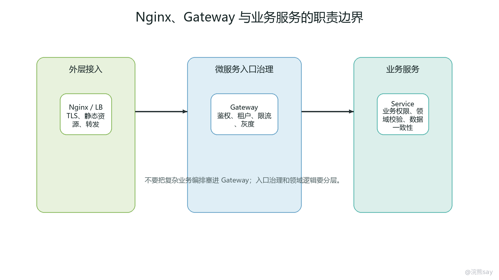
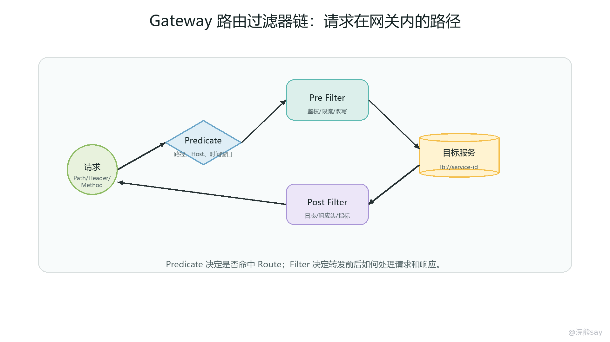
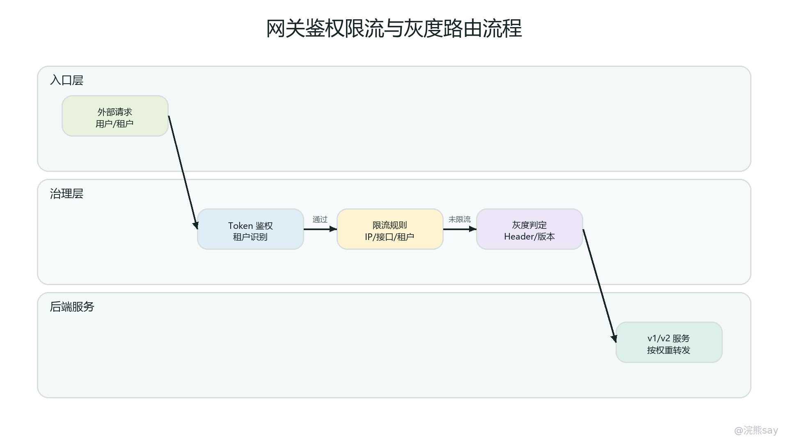

# 05 Spring Cloud Gateway：入口治理与灰度路由

Spring Cloud Gateway 是 Spring Cloud 体系中的 API Gateway 组件，也就是微服务系统的统一入口治理层。它的核心思想是：外部请求不直接感知后端多个微服务地址，而是先进入网关，由网关根据路由规则选择目标服务，并在转发前后完成鉴权、限流、灰度、路径重写、跨域、日志和观测上下文传递等公共能力。

在单体应用中，入口通常就是一个 Web 应用本身；拆成微服务以后，用户服务、订单服务、设备服务、告警服务、文件服务都可能独立部署，前端如果直接调用每个服务，会把服务拓扑、鉴权逻辑、跨域规则、版本切换和限流策略暴露到客户端。Gateway 的价值就在于把这些入口问题收拢到一个稳定边界：外部只知道统一域名和 API 规范，内部服务可以独立扩缩容、改路径、灰度发布和迁移。

从工程角度看，Gateway 不是“再写一层 Controller”，也不是业务编排中心。它适合做入口横切治理，不适合承载复杂业务状态和高成本业务计算。准备这一章时，要把网关理解成一条请求进入微服务体系前后的控制链路：先匹配路由，再执行过滤器链，最后转发到目标服务，并把响应按过滤器链返回。

## 一、统一入口的定位与分层边界

images/05-gateway-nginx-service-boundary.png

微服务入口治理首先解决的是“外部如何稳定访问内部变化的服务”。后端服务可能按业务拆分，也可能因为容量、机房、版本和租户进行横向扩展。没有统一入口时，客户端要知道每个服务的地址、路径和版本，发布一个服务就可能牵动多个客户端。Gateway 把外部 API 与内部服务解耦，客户端访问 /api/user/\*\*、/api/order/\*\*、/api/device/\*\* 这类统一路径，网关再把请求路由到 user-service、order-service、device-service 等内部服务。

入口层还天然适合放公共治理能力。鉴权可以在网关统一校验 Token、签名、AppKey、租户、时间戳和权限范围；限流可以在请求进入后端之前按 IP、用户、租户、设备、接口或应用做保护；灰度可以根据 Header、Cookie、用户标签、租户、客户端版本选择新旧服务；日志可以在入口记录 traceId、路径、目标服务、状态码和耗时。这样做的好处是治理规则集中、变更成本低、对业务服务侵入小。

但统一入口也意味着故障影响面扩大。网关一旦路由配置错误、鉴权规则误放行或误拦截、限流阈值配置不合理、日志打印过重，可能影响所有进入系统的请求。因此，网关层的配置发布要比普通业务配置更谨慎，要有灰度、回滚、监控和审计。尤其是生产环境中的路由、鉴权白名单、跨域来源、限流规则、路径重写规则，都应当有明确的变更流程。

Nginx、Gateway 和 Zuul 的边界也要分清。Nginx 更适合作为外层反向代理和高性能边缘入口，承担 TLS 终止、静态资源、负载均衡、通用转发和基础限流；Spring Cloud Gateway 更贴近 Java 微服务治理，适合与注册中心、服务发现、动态路由、统一鉴权、业务灰度和可观测上下文结合；Zuul 是 Netflix 旧体系中的网关组件，Zuul 1.x 基于 Servlet 阻塞模型，老项目中仍可能存在，新项目中更常见 Gateway。常见部署形态是“云负载均衡或 Nginx 在外层，Gateway 在内层，业务服务在注册中心后面”。

面试里可以这样表达：“Nginx 更偏边缘代理和通用流量入口，Gateway 更偏微服务内部 API 治理。两者不是简单替代关系，通常是 Nginx 处理公网、TLS 和静态资源，Gateway 处理服务级路由、鉴权、限流、灰度和上下文传递。Zuul 属于旧 Netflix 组件，理解它的路由和过滤器思想有价值，但当前 Spring Cloud 项目更常用 Gateway。”

## 二、Route、Predicate 与 Filter 的配置模型

Spring Cloud Gateway 的核心模型由 Route、Predicate 和 Filter 组成。Route 表示一条完整路由规则，说明请求命中后要转发到哪里；Predicate 表示路由匹配条件，决定请求是否属于这条 Route；Filter 表示命中路由后对请求或响应做什么处理。可以把它理解成一句话：Predicate 负责“能不能进这条路”，Route 负责“进了以后去哪儿”，Filter 负责“转发前后要加工什么”。

Route 通常包含 id、uri、predicates、filters 和可选的 metadata。id 用来标识路由，排查日志和指标时很有用；uri 可以是固定地址，也可以是 lb://服务名，后者表示结合服务发现和负载均衡选择实例；predicates 是一个条件列表；filters 是只作用在当前路由上的过滤器；metadata 可以放超时、分组、灰度标记等附加信息。

一个典型配置如下：

spring: 
cloud: 
gateway: 
routes: 
\- id: device-api 
uri: lb://device-service 
predicates: 
\- Path=/api/device/\*\* 
\- Method=GET,POST 
filters: 
\- StripPrefix=1 
\- AddRequestHeader=X-Entry, gateway 
\- id: gray-order-api 
uri: lb://order-service 
predicates: 
\- Path=/api/order/\*\* 
\- Header=X-Gray-Version, v2 
filters: 
\- RewritePath=/api/order/(?&lt;segment>.\*), /order/${segment}

这段配置表达了两类常见能力。第一类是普通服务路由：外部访问 /api/device/\*\*，网关匹配路径和方法后，通过 lb://device-service 找到设备服务实例，并在转发前去掉第一段路径。第二类是灰度路由：只有请求头 X-Gray-Version: v2 命中时，才进入对应灰度规则。真实项目中还会结合服务实例 metadata、用户标签或租户规则做更细的版本选择。

Predicate 常见类型包括 Path、Host、Method、Header、Cookie、Query、RemoteAddr 和时间类 Predicate。Path 最常用，用于按 URL 前缀区分服务；Host 适合多域名入口；Method 可以限制 GET、POST、PUT、DELETE；Header 和 Cookie 常用于灰度、租户、客户端版本识别；RemoteAddr 适合内网白名单或来源限制。多个 Predicate 一般是“同时满足”关系，因此配置时要注意条件是否过窄，避免请求没有命中任何路由。

Filter 分为两类：路由级 GatewayFilter 和全局 GlobalFilter。路由级过滤器只对当前 Route 生效，适合做路径处理、请求头修改、单个服务的熔断、重试、限流或特殊适配。全局过滤器对所有路由生效，适合做统一鉴权、traceId 注入、访问日志、统一响应头、安全头清洗、入口限流、黑白名单等公共能力。两者会合并成一条过滤器链，按顺序执行。

配置模型的面试重点不是背所有 Predicate 和 Filter 名字，而是说清楚三层关系。一个扎实回答可以是：“Gateway 通过 RouteDefinition 定义路由，一条 Route 由匹配条件、目标地址和过滤器组成。请求进入后先由 Predicate 判断命中哪条路由，命中后把 GlobalFilter 和该路由的 GatewayFilter 合成过滤器链，前置逻辑执行完再转发到目标服务，响应返回时再按相反方向执行后置逻辑。”

## 三、路由匹配与过滤器链的运行机制

Gateway 的运行链路可以从 RoutePredicateHandlerMapping、FilteringWebHandler、GlobalFilter、GatewayFilter、GatewayFilterChain、RouteDefinitionLocator 这些概念理解。请求进入网关后，框架会先从路由定义中查找能够匹配当前请求的 Route；匹配成功后，将路由级过滤器和全局过滤器合并并排序；过滤器链执行前置逻辑，例如鉴权、限流、路径重写、请求头清洗；随后由路由转发过滤器把请求发往下游；响应返回后，再执行后置逻辑，例如记录耗时、补充响应头、统计状态码和异常。

images/05-gateway-route-filter-chain.png

这条链路有两个很重要的细节。第一，路由匹配发生在过滤器链执行之前，如果请求路径、Host、Method 或 Header 条件没有命中，后面的鉴权和转发都不会进入对应 Route。排查 404 或路由不生效时，不能只看下游服务是否启动，要先看请求是否命中了预期路由。第二，过滤器有顺序，鉴权、路径重写、日志、限流、转发、响应处理的相对顺序会影响结果。例如路径重写放在转发之后就没有意义，请求头清洗放在鉴权之后可能留下伪造风险，访问日志如果没有包住完整链路就记录不到真实耗时。

GlobalFilter 和 GatewayFilter 的边界也很适合追问。GlobalFilter 适合做全局一致的入口策略，例如统一 traceId、统一访问日志、统一鉴权、统一 CORS 响应头、统一安全头处理。GatewayFilter 更适合某条路由的个性化处理，例如某个服务需要 StripPrefix，某个接口要 RewritePath，某类请求需要特定限流规则，某个旧服务需要添加兼容请求头。把所有逻辑都写成 GlobalFilter 会导致规则过重，也会让局部需求影响全站。

Gateway 基于 WebFlux 和 Reactor，底层不是传统 Servlet 阻塞模型。过滤器中如果直接调用阻塞 IO、同步数据库查询、远程服务慢调用或复杂 CPU 计算，会占用事件循环线程，导致入口吞吐下降。真实项目里如果确实需要调用外部权限服务或配置服务，要尽量使用异步非阻塞客户端，配置超时和降级，并把可缓存的权限、公钥、租户规则放到本地缓存或配置中心，避免每个请求都在网关层做重型查询。

路由匹配还涉及优先级。多条 Route 都能匹配同一个请求时，需要通过路由顺序保证更具体的规则先命中。例如 /api/order/internal/\*\* 应该优先于 /api/order/\*\*，灰度规则也常常要优先于普通规则。否则，请求可能先被普通路由吃掉，灰度 Predicate 永远没有机会生效。面试或排查中可以补一句：“Gateway 的路由配置要关注匹配范围和顺序，尤其是通配路径、灰度路由和管理端接口共存时。”

## 四、鉴权、跨域、路径重写与上下文传递

鉴权是 Gateway 最常见的全局能力之一。入口层通常会校验 Token、JWT、签名、时间戳、AppKey、租户、客户端版本、设备编号和权限范围。校验通过后，网关可以把用户 ID、租户 ID、角色、请求来源、客户端类型等可信上下文写入内部请求头，传给下游服务。这里的关键不是“能不能在过滤器里解析 Token”，而是安全边界：外部请求传来的 X-User-Id、X-Tenant-Id 不能直接信任，网关应先清洗这类头，再根据鉴权结果重新注入。

下游服务是否还需要鉴权，要按风险分层回答。普通查询接口可以依赖网关注入的可信上下文，但要保证请求确实来自可信网关，例如通过内网隔离、服务间认证、mTLS、网关签名头或防火墙规则控制。高风险接口，如资金操作、权限变更、设备控制、数据导出，业务服务仍应做业务权限和数据权限校验。网关解决统一入口身份问题，下游解决业务资源授权问题，两者不是简单二选一。

跨域 CORS 也常在网关层统一处理。浏览器发起跨域请求时，会根据方法和请求头决定是否发送预检 OPTIONS 请求。如果网关没有正确放行预检请求，或者 Access-Control-Allow-Origin、Access-Control-Allow-Methods、Access-Control-Allow-Headers、Access-Control-Allow-Credentials 配置不一致，前端会看到跨域错误，但后端业务服务可能根本没有收到请求。排查跨域问题时，要先看浏览器网络面板中的预检请求状态，再看网关 CORS 配置和响应头。

路径重写用于屏蔽内外部路径差异。外部 API 可能统一以 /api/order/\*\* 暴露，而订单服务内部只识别 /order/\*\* 或 /v1/order/\*\*。Gateway 可以使用 StripPrefix 去掉前缀，也可以用 RewritePath 按正则重写路径。路径重写看似简单，但很容易造成 404：前缀去多了、正则没有匹配、转发后缺少服务内部 context-path、灰度路由和普通路由的重写规则不一致，都会让下游收到错误路径。

上下文传递包括 traceId、用户上下文、租户上下文、客户端信息和调用来源。traceId 应在入口生成或接续，随后通过请求头传到下游服务，并进入日志 MDC 和链路追踪系统。用户和租户上下文应由网关注入标准内部头，例如 X-User-Id、X-Tenant-Id、X-Client-Type，但同时要避免把原始 Token、密码、身份证、手机号、密钥等敏感信息继续向下游无差别扩散。网关是入口，不是敏感数据中转站。

一个工程上比较稳的鉴权链路可以这样描述：请求进入网关后，先生成或读取 traceId，再清理外部伪造的内部上下文头；随后根据白名单判断是否跳过登录校验；需要鉴权的接口校验 Token、签名和租户状态；通过后写入内部用户上下文；接着执行限流和路由过滤；最后把请求转发给目标服务。响应返回时记录状态码、耗时和异常摘要。这个顺序能兼顾安全、观测和性能。

## 五、限流、灰度路由与发布回滚

限流是网关层保护后端的第一道闸门。入口层限流通常按 IP、用户、租户、设备编号、AppKey、接口路径或业务分组统计请求量，当超过阈值时直接拒绝或返回降级响应。Gateway 中常见的 RequestRateLimiter 可以结合 Redis 令牌桶实现分布式限流，也可以通过自定义 KeyResolver 决定限流维度。比如按用户限流时，Key 可以来自用户 ID；按设备上报限流时，Key 可以来自设备编号；按租户保护时，Key 可以来自租户 ID。

网关限流和业务服务限流的目标不同。网关限流更偏入口保护，避免异常流量进入后端；业务服务限流更偏资源保护，可以按业务资源、热点参数、线程池、数据库连接或下游依赖做更细粒度控制。比如 IoT 场景中，网关可以先按设备或租户限制上报 QPS，设备服务内部再用 Sentinel 对热点设备、异常接口、数据库写入做保护。面试回答时不要把“网关限流”说成系统稳定性的全部答案。

灰度路由用于把一部分请求导向新版本服务，观察指标稳定后再扩大范围。Gateway 侧可以根据 Header、Cookie、用户 ID、租户、客户端版本、设备分组、地域或实验分组匹配灰度规则。服务发现侧可以在实例 metadata 中标记 version=v1、version=v2、zone=shanghai、group=gray，再由网关或负载均衡策略选择目标实例。较完整的灰度方案通常需要“入口识别规则 + 实例版本标记 + 指标观察 + 快速回滚”四个环节。

images/05-gateway-gray-auth-flow.png

灰度与鉴权经常组合出现。比如只有登录用户、特定租户或内部测试账号才能进入 v2 版本；未登录请求、管理端请求、高风险写接口仍走稳定版本。此时网关需要先完成身份识别，再根据用户或租户标签选择路由。如果先按 Header 做灰度而没有鉴权，外部用户可能伪造 Header 进入灰度环境；如果灰度规则写得过宽，可能把不该进入新版本的核心流量也切过去。

灰度发布最容易忽视的是回滚。网关路由能快速切流，也能快速放大错误。上线前要明确哪些指标判断灰度失败，例如 5xx 升高、P99 延迟变长、鉴权失败率异常、业务错误码升高、下游熔断触发、订单或设备指令成功率下降。回滚方式也要明确：删除灰度路由、调整 Predicate 范围、把实例 metadata 从 v2 改回 v1、下线新版本实例，或者将配置中心中的灰度开关关闭。

配置示例可以按思路理解，而不必死背：

spring: 
cloud: 
gateway: 
routes: 
\- id: order-gray-v2 
uri: lb://order-service 
order: -10 
predicates: 
\- Path=/api/order/\*\* 
\- Header=X-Gray-User, true 
filters: 
\- StripPrefix=1 
\- id: order-stable 
uri: lb://order-service 
order: 0 
predicates: 
\- Path=/api/order/\*\* 
filters: 
\- StripPrefix=1

这类配置要特别注意顺序。灰度路由比稳定路由更具体，应当优先匹配；稳定路由兜底接住普通流量。真实项目中，灰度不应只靠客户端传入的 Header，而应由网关根据鉴权结果、用户标签、租户规则或配置中心规则计算是否进入灰度，再写入内部灰度标记。

## 六、访问日志、可观测与故障排查路径

网关访问日志是微服务排查的入口。一个实用的网关日志通常包含 traceId、routeId、请求方法、原始路径、重写后路径、目标服务、客户端 IP、用户或租户标识、状态码、耗时、限流结果、鉴权结果和异常摘要。日志不应完整打印 Token、密码、手机号、身份证、密钥、请求体大字段和文件内容。尤其是 Gateway 处于入口高 QPS 场景时，过度日志会造成磁盘压力、性能下降和敏感信息泄露。

可观测指标应覆盖入口请求量、状态码分布、P95/P99 延迟、路由命中数、限流拒绝数、鉴权失败数、下游连接错误、超时数、响应体异常、过滤器耗时和实例选择结果。结合 traceId，可以从网关日志跳到下游服务日志和链路追踪平台，判断慢点是在网关过滤器、负载均衡、目标服务、数据库、Redis、MQ 还是第三方接口。

Gateway 故障排查可以按请求生命周期走。第一，看请求是否进入网关，包括域名解析、Nginx 转发、TLS、端口和网关实例健康。第二，看是否匹配到正确 Route，包括路径、Host、Method、Header、Cookie、Query、路由顺序和配置是否刷新。第三，看 Filter 是否拒绝请求，包括鉴权失败、黑白名单、限流、CORS 预检、请求体大小限制。第四，看路径是否被正确改写，目标 URI 是否正确。第五，看目标服务是否能被发现，注册中心实例列表和服务名是否一致。第六，看下游是否超时、报错或返回 4xx/5xx。

常见现象可以这样拆解：
| 现象 | 优先排查方向 | 典型原因 |
| --- | --- | --- |
| 404 | Route 和路径重写 | Path 没匹配、StripPrefix 错误、RewritePath 正则错误、下游 context-path 不一致 |
| 401/403 | 鉴权和权限 | Token 过期、签名失败、租户状态异常、内部上下文头被清洗、下游二次鉴权失败 |
| 429 | 限流 | KeyResolver 维度不合理、阈值过低、单租户流量异常、Redis 限流组件异常 |
| CORS 错误 | 预检请求和响应头 | OPTIONS 未放行、允许来源不匹配、Header 或 Credentials 配置冲突 |
| 502/503 | 下游发现和转发 | 服务未注册、实例不健康、连接失败、路由目标服务名写错 |
| 504 或超时 | 下游慢响应 | 业务服务线程池满、数据库慢 SQL、第三方接口慢、网关转发超时过短或过长 |

排查网关问题时，要避免一个误区：看到网关返回错误，就认为网关代码有问题。Gateway 是入口聚合点，很多下游故障会以网关状态码体现出来。正确做法是先判断错误发生在“进入网关前、路由匹配阶段、过滤器阶段、转发阶段、下游处理阶段、响应返回阶段”中的哪一段，再用 traceId 和指标定位。

## 七、网关误用、性能风险与面试表达

网关最常见的误用是承载复杂业务逻辑。订单价格计算、库存扣减、设备指令编排、报表聚合、文件解析、复杂权限查询都不适合放在 Gateway 中。网关一旦变成“业务中台”，会出现三个问题：入口发布频率被业务需求拖高，所有服务共享同一个故障点，过滤器链变长导致入口延迟不可控。合理边界是：网关做认证、授权前置、路由、协议和入口治理，业务服务做领域规则和状态变更。

第二个误用是在 Gateway 中执行阻塞调用。由于 Gateway 基于 WebFlux，事件循环线程应尽量保持轻量。如果在过滤器里同步查数据库、调用远程用户中心、读取大文件或执行复杂加解密，入口吞吐会迅速下降。工程上更好的做法是把公钥、白名单、租户状态、灰度规则等放到本地缓存，并通过配置中心或事件机制更新；确实需要远程调用时，使用非阻塞客户端、超时、熔断和降级。

第三个误用是无节制读取和打印请求体。请求体在响应式模型中是流式数据，不当读取可能导致下游无法再次读取，也可能造成内存压力。上传文件、大 JSON、二进制报文、设备批量上报都不适合在网关完整落日志。需要审计时，可以记录摘要、哈希、大小、业务编号和脱敏字段，而不是把完整内容写入日志。

第四个误用是把网关限流当成后端容量规划。限流能保护系统，但不能替代服务扩容、数据库优化、缓存、异步削峰、线程池隔离和下游熔断。入口限流阈值也不是拍脑袋配置的，要基于压测结果、服务容量、业务优先级和降级策略。对核心接口、普通查询、后台任务、设备心跳、文件上传应采用不同阈值和处理策略。

面试表达可以准备三个层次。

第一层，概念回答：“Spring Cloud Gateway 是微服务系统的统一入口组件，核心模型是 Route、Predicate 和 Filter。Predicate 判断请求是否命中路由，Route 指定目标地址，Filter 在转发前后处理鉴权、限流、路径重写、日志、灰度和响应加工。”

第二层，机制回答：“请求进入 Gateway 后，先由路由匹配器根据 Path、Method、Host、Header 等 Predicate 找到 Route，再把 GlobalFilter 和当前 Route 的 GatewayFilter 合并成过滤器链。前置过滤器完成鉴权、限流、上下文注入和路径重写，随后转发到目标服务；响应返回后，后置过滤器记录耗时、状态码和异常信息。”

第三层，项目回答：“项目里外层通常是 Nginx 或云负载均衡，内层 Gateway 负责微服务入口治理。我们在网关做 Token 校验、租户识别、traceId 注入、访问日志、跨域、路径重写、入口限流和灰度路由。下游服务仍会对高风险接口做业务权限校验。线上排查时，会按请求是否进入网关、是否匹配 Route、Filter 是否拒绝、路径是否改写正确、目标服务是否可发现、下游是否超时这条链路逐段定位。”

如果面试官继续追问“为什么不用 Zuul”，可以回答：“Zuul 1.x 是旧 Netflix 体系中的网关组件，基于 Servlet 阻塞模型；Gateway 是 Spring 官方后续主推的网关，基于 WebFlux，和 Spring Cloud 的服务发现、过滤器链、配置体系、限流和响应式生态结合更自然。老项目可能继续维护 Zuul，新项目更常见 Gateway，但两者背后的路由和过滤器思想是一致的。”

## 八、学习自测

1. Gateway 的 Route、Predicate、Filter 分别解决什么问题？

答：Route 描述一条路由规则和目标地址，Predicate 描述请求是否命中该路由的条件，Filter 描述命中路由后在请求转发前后执行的处理逻辑。三者组合起来，才能形成完整的入口规则。

1. GlobalFilter 和 GatewayFilter 的区别是什么？

答：GlobalFilter 对所有路由生效，适合统一鉴权、日志、traceId、头清洗、全局安全策略等公共能力；GatewayFilter 只对具体 Route 生效，适合路径重写、单服务限流、服务兼容头、局部熔断等个性化逻辑。二者最终会合并排序成过滤器链。

1. 网关做了鉴权后，下游服务还要不要鉴权？

答：要按接口风险分层。网关负责统一入口身份校验和可信上下文注入，下游普通接口可以复用上下文；但高风险接口仍应校验业务权限、数据权限和资源归属。同时要保证请求来自可信网关，不能让外部绕过网关直接访问内部服务。

1. 路由配置正确但接口仍然 404，可能有哪些原因？

答：可能是 Route 顺序不对、Path Predicate 没有真正命中、StripPrefix 去掉了过多路径、RewritePath 正则错误、目标服务内部 context-path 不一致、灰度路由和普通路由重写规则不同，或者请求被转发到了错误服务。

1. 网关限流和 Sentinel 服务内限流有什么区别？

答：网关限流偏入口保护，目的是在流量进入后端之前按 IP、用户、租户、设备、接口等维度拦截异常流量；服务内限流偏资源保护，可以针对具体业务资源、热点参数、线程池、数据库或下游依赖做更细粒度保护。两者通常配合使用。

1. 灰度路由为什么不能只依赖客户端传入 Header？

答：客户端 Header 可以被伪造，直接依赖它会带来安全和规则失控风险。更稳的方式是网关先完成鉴权，再根据用户、租户、设备、版本或配置中心规则计算灰度标记，随后选择目标路由或实例。灰度还要配合监控指标和快速回滚。

1. Gateway 中写阻塞数据库查询有什么风险？

答：Gateway 基于 WebFlux 和 Reactor，阻塞数据库查询会占用事件循环线程，降低入口吞吐并放大延迟。入口层应保持轻量，常用规则应缓存，远程调用要使用非阻塞客户端、超时、降级和隔离。

1. 排查 Gateway 线上问题时，推荐的顺序是什么？

答：先确认请求是否进入网关，再确认是否匹配正确 Route；随后检查 Predicate、Filter、鉴权、限流、CORS 和路径重写；再看目标服务是否可发现、下游是否超时或报错；最后结合 traceId、网关访问日志、下游日志和指标定位具体阶段。

掌握本章的标准是：能画出 Gateway 的路由过滤器链，能解释 Route、Predicate、GatewayFilter、GlobalFilter 的关系，能讲清 Nginx、Gateway、Zuul 的边界，能把鉴权、限流、灰度、跨域、路径重写和日志放到正确层次，并且能按请求生命周期排查网关故障。
