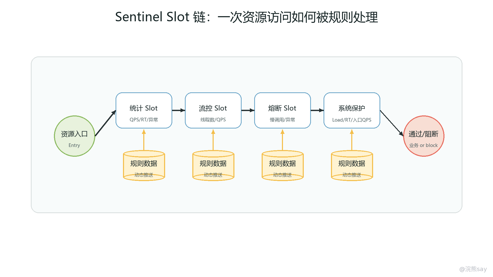
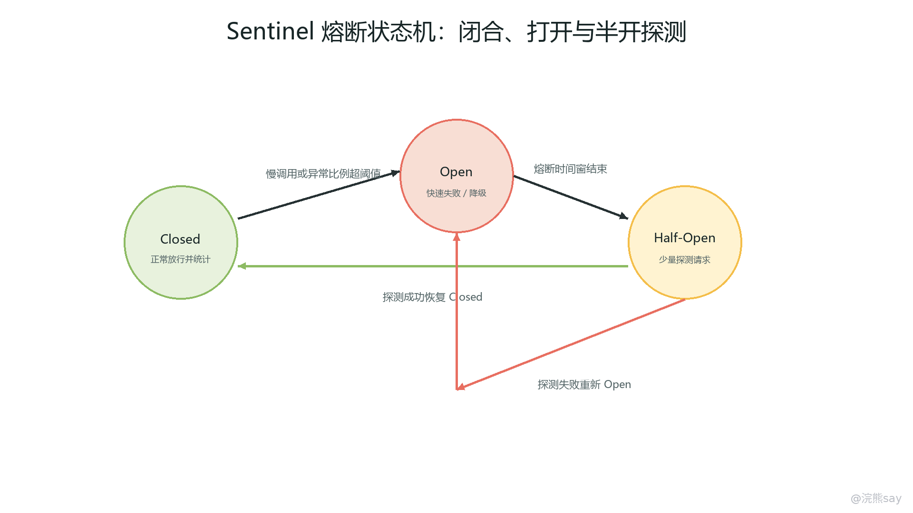
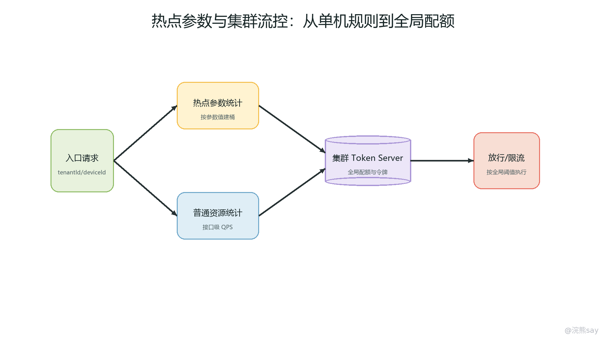
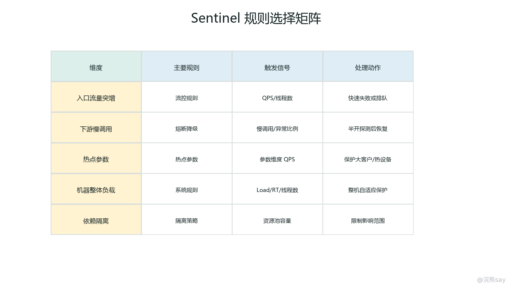

# 06 Sentinel：流量治理、熔断降级与资源隔离

Sentinel 是阿里开源的流量治理与服务容错组件，在 Spring Cloud Alibaba 体系中常用于限流、熔断降级、热点参数保护、系统自适应保护和实时监控。它的核心思想不是“服务挂了以后返回一个默认值”，而是把系统中的入口接口、远程调用、方法、消息消费、定时任务等都抽象成资源，然后围绕资源建立实时统计、规则判断和异常处理链路。一次请求进入资源时，Sentinel 会先经过一条 Slot 责任链，依次完成上下文构建、调用树维护、指标统计、规则校验、熔断判断和授权判断，只有通过校验的请求才会真正执行业务逻辑。

在微服务系统中，远程调用、数据库访问、缓存查询、第三方接口和设备上报入口都可能成为故障扩散点。传统做法往往只配置超时和重试，但超时只能限制等待时间，重试在下游变慢时还可能放大流量。Sentinel 的价值在于把“流量是否应该进入”“依赖是否已经不健康”“热点参数是否需要单独保护”“当前机器是否已经到达负载边界”这些判断前置到调用链路中，使服务在过载和故障时尽早拒绝、快速失败、返回兜底结果，而不是等线程、连接池和 CPU 被耗尽后再崩溃。

从工程角度看，Sentinel 适合放在 Spring Cloud Gateway、OpenFeign 调用方、核心 Controller、Service 方法、MQ 消费入口和第三方依赖封装层。面试复习时不要只背“限流、熔断、降级、隔离”几个词，而要能说清楚：什么是资源，规则作用在哪里，Slot 链如何统计和判断，请求被拒绝后走 blockHandler 还是 fallback，慢调用和异常比例怎样触发熔断，线程数和 QPS 规则分别保护什么，热点参数与普通限流有什么区别，Sentinel 与 Hystrix、Resilience4j 的边界在哪里。

## 一、Sentinel 的核心定位：按资源做实时保护

Sentinel 的资源可以理解为“需要被保护的一段调用逻辑”。它可以是一个 HTTP 接口，例如 /api/device/report；也可以是一个 Feign 方法，例如 AlarmClient.pushNotice；还可以是某个 Service 方法、MQ 消费方法、定时任务或自定义代码块。只要代码通过 Sentinel 的适配器、注解或 API 进入保护范围，Sentinel 就能对它统计通过量、拒绝量、异常数、响应时间、并发线程数等指标，并根据规则决定是否放行。

这种资源模型有两个好处。第一，它比“按服务限流”更细，因为同一个服务里的设备上报、告警查询、用户登录、报表导出承载能力完全不同，不能只给整个应用一个统一 QPS。第二，它比“只在网关限流”更接近真实瓶颈。网关可以挡住入口流量，但服务内部的数据库查询、下游调用、第三方接口、热点租户和热点设备仍然需要业务服务自己保护。项目里更常见的组合是：网关做粗粒度入口保护，Sentinel 在业务服务内部做资源级保护。

Sentinel 的规则不是业务语义规则，而是稳定性规则。流控规则回答“当前资源还能不能接更多请求”；熔断降级规则回答“这个依赖或资源是否已经不健康”；热点参数规则回答“某些参数值是否把资源打成热点”；系统规则回答“当前机器整体负载是否已经危险”；授权规则回答“当前来源是否允许访问资源”。这些规则可以写在本地配置，也可以通过 Nacos、Apollo、ZooKeeper 等动态数据源托管，在生产环境中更推荐动态配置、审批发布和回滚。
| 保护对象 | Sentinel 常用能力 | 典型场景 |
| --- | --- | --- |
| 接口入口 | QPS 限流、线程数限流、系统保护 | 秒杀、设备上报、报表查询 |
| 远程依赖 | 慢调用熔断、异常比例熔断、fallback | Feign 调用、第三方接口、通知服务 |
| 热点参数 | 参数级限流、参数例外项 | 单租户、单设备、单用户异常流量 |
| 本机整体 | Load、CPU、入口 QPS、平均 RT、线程数 | 机器过载前主动保护 |
| 调用来源 | 黑白名单授权 | 内部系统、灰度来源、异常来源隔离 |

面试中可以这样定义 Sentinel：“Sentinel 是以资源为中心的流量治理组件。它通过 Slot 链对每个资源的调用进行实时统计，并根据流控、熔断降级、热点参数、系统保护等规则决定请求是否通过。它解决的是微服务系统中突发流量、慢依赖、异常依赖、热点参数和机器过载导致的故障扩散问题。”

## 二、资源、规则和 Slot 链路如何协同工作

Sentinel 的一次保护流程可以拆成三层：资源入口、Slot 链、业务执行。资源入口负责告诉 Sentinel “现在进入哪个资源”；Slot 链负责统计和判断；业务执行只有在规则校验通过后才发生。如果规则不通过，Sentinel 会抛出 BlockException 的子类，例如流控异常、熔断异常、热点参数异常或系统保护异常，框架适配层再把它转换成响应、异常或指定的 blockHandler。

images/06-sentinel-slot-chain.png

Slot 链是 Sentinel 原理题的核心。NodeSelectorSlot 负责按照上下文维护调用树，使同一个资源在不同调用入口下可以形成不同节点；ClusterBuilderSlot 负责构建资源维度的统计节点，便于汇总 QPS、RT、异常等指标；StatisticSlot 负责滑动窗口统计通过、拒绝、异常、响应时间、线程数；FlowSlot 根据流控规则做 QPS 或线程数判断；DegradeSlot 根据慢调用比例、异常比例或异常数判断是否熔断；SystemSlot 根据系统规则判断本机是否处于危险状态；AuthoritySlot 可以按调用来源做授权控制。

理解 Slot 链时要注意一个顺序问题：规则判断依赖实时统计，实时统计又依赖资源被正确埋点。很多线上“Sentinel 没生效”的问题，根因不是规则写错，而是资源名不一致、方法没有被代理、注解没有生效、Feign 或 Gateway 适配没有开启、调用没有经过被保护方法，导致统计链路没有建立。排查时先看控制台有没有资源和实时 QPS，再看规则是否绑定到正确资源，最后看触发后是否走了预期的异常处理。

常见资源埋点方式有三类。第一，框架自动适配，例如 Spring MVC、WebFlux、Gateway、OpenFeign、Dubbo、Reactor 等集成，会自动把接口或调用包装成资源。第二，使用 @SentinelResource 注解标记方法，适合保护某个 Service 方法或远程依赖封装方法。第三，使用 SphU.entry("resourceName") 手动包裹代码块，适合更细粒度的自定义资源。项目里一般优先用框架适配和注解，只有在需要精确保护一段非标准调用逻辑时才手动埋点。

@SentinelResource( 
value = "alarmPush", 
blockHandler = "alarmPushBlocked", 
fallback = "alarmPushFallback" 
) 
public PushResult pushAlarm(AlarmCommand command) { 
return thirdPartyAlarmClient.push(command); 
} 
 
public PushResult alarmPushBlocked(AlarmCommand command, BlockException ex) { 
return PushResult.rejected("alarm push is limited"); 
} 
 
public PushResult alarmPushFallback(AlarmCommand command, Throwable ex) { 
return PushResult.degraded("alarm push temporary unavailable"); 
}

这段代码表达了两个边界：blockHandler 处理的是 Sentinel 规则拒绝，例如限流、熔断、热点参数、系统保护；fallback 处理的是业务方法执行过程中的普通异常，例如第三方调用失败、运行时异常、解析异常。两者不要混着写，否则面试和排查时会分不清“系统主动保护”与“业务执行失败”。

## 三、限流规则：QPS、线程数、流控模式和流控效果

限流解决的是“进入资源的请求量不能超过承载能力”。Sentinel 常用限流阈值有两类：QPS 和线程数。QPS 限流关注单位时间内通过多少请求，适合保护吞吐能力明确的接口，例如设备上报每秒最多处理 2000 次、报表查询每秒最多 20 次。线程数限流关注当前资源正在并发执行的线程数量，适合保护慢接口或强依赖接口，例如第三方通知接口最多允许 20 个并发，避免慢调用占满业务线程池。

QPS 限流和线程数限流的区别非常重要。QPS 规则在流量进入时按滑动窗口统计请求数量，超过阈值就拒绝或排队；线程数规则更像并发隔离，只有当当前资源正在执行的线程数达到阈值时才拒绝。一个接口 QPS 不高但每次执行很慢，也可能把线程数打满；一个接口执行很快但突发流量很高，更适合先用 QPS 限流。真实项目里通常把入口接口用 QPS 控制，把慢依赖和第三方接口用线程数控制。

Sentinel 流控模式包括直接、关联和链路。直接模式表示当前资源达到阈值就限流，是最常见的配置。关联模式表示当关联资源达到阈值时，限制当前资源，适合保护关键链路。例如订单查询和订单创建共用同一套数据库资源，当订单创建压力高时，可以限制低优先级查询。链路模式按调用入口区分同一个资源的统计，适合一个底层方法被多个入口调用，但只想限制某条入口链路的场景。

流控效果也要分清。快速失败是最常用方式，超过阈值直接抛出 FlowException，上层返回明确的限流响应。Warm Up 适合冷启动保护，系统刚启动或缓存刚恢复时逐步放大通过量，避免流量瞬间打满冷系统。排队等待适合匀速处理突发流量，例如后台任务或消息发送，但不适合用户强交互接口，因为等待会增加响应时间并占用线程。
| 配置维度 | 常见选择 | 使用边界 |
| --- | --- | --- |
| 阈值类型 | QPS | 保护吞吐量，适合入口接口和高频查询 |
| 阈值类型 | 线程数 | 保护并发执行资源，适合慢调用和第三方依赖 |
| 流控模式 | 直接 | 当前资源达到阈值就保护 |
| 流控模式 | 关联 | 高优先级资源繁忙时限制低优先级资源 |
| 流控模式 | 链路 | 按调用入口区分同一资源 |
| 流控效果 | 快速失败 | 接口型请求最常用，失败语义清晰 |
| 流控效果 | Warm Up | 冷启动、缓存预热、扩容刚上线 |
| 流控效果 | 排队等待 | 削峰填谷，但要控制等待超时 |

误用限流最常见的是只凭感觉写阈值。阈值应该来自压测、容量评估和线上指标，而不是“先写 1000 看看”。另一个误用是所有接口共用一个规则，导致低价值接口和核心接口争抢同一保护额度。还有一种误用是把限流当成业务失败，给调用方返回“系统错误”。更合理的响应应该明确表示请求被保护策略拒绝，例如返回可重试提示、排队提示或降级数据，并在日志和指标中区分限流拒绝与业务异常。

## 四、熔断降级：慢调用、异常比例和异常数

images/06-sentinel-circuit-state-machine.png

熔断解决的是“依赖或资源已经不健康时，暂时不要继续访问它”。Sentinel 的熔断降级规则通常基于三类指标：慢调用比例、异常比例和异常数。慢调用比例适合处理下游没有报错但响应变慢的场景；异常比例适合处理一段时间内失败率升高的场景；异常数适合处理绝对错误数量超过阈值的场景。面试时不要只说“失败就熔断”，因为真实线上更常见的是下游半死不活：还能返回，但 P99 很高，把上游线程拖住。

慢调用比例规则需要配置最大 RT、比例阈值、最小请求数、统计时长和熔断时长。比如把最大 RT 设置为 500ms，慢调用比例阈值设置为 0.6，最小请求数设置为 20，表示统计窗口内请求数达到要求后，如果 60% 以上调用超过 500ms，就打开熔断。熔断打开后，请求不再访问下游，而是直接被拒绝或进入降级逻辑；熔断时长结束后进入探测阶段，少量请求成功后再恢复。

异常比例规则关注异常请求占比。例如第三方通知接口最近一段时间失败率超过 50%，继续调用只会浪费线程和连接，此时应该短时间熔断。异常数规则关注绝对异常数量，例如 1 分钟内异常超过 100 次触发保护，适合 QPS 较稳定的资源。异常比例适合吞吐波动较大的接口，但要配置最小请求数，避免低流量下一个异常就把资源熔断。

熔断和降级经常一起出现，但它们不是一件事。熔断是状态和决策：根据统计指标把资源从可访问切换为短时间不可访问。降级是结果和业务策略：当资源不可访问时返回什么。读接口可以返回缓存、空列表、默认值、稍后重试提示或部分字段；写接口要更谨慎，支付、扣款、库存、设备控制这类操作不能伪装成成功，否则会造成数据不一致。降级结果必须符合业务语义，并且要能被日志和监控识别出来。

一个可落地的熔断配置表达可以这样写：

spring: 
cloud: 
sentinel: 
datasource: 
degrade-rules: 
nacos: 
server-addr: 127.0.0.1:8848 
data-id: order-service-degrade-rules 
group-id: SENTINEL\_GROUP 
rule-type: degrade

实际规则内容通常由控制台或动态数据源维护，关键字段包括资源名、熔断策略、慢调用 RT、比例阈值、异常数、最小请求数、统计窗口和熔断时长。生产环境不建议只依赖控制台内存规则，因为应用重启后可能丢失；更稳妥的做法是把规则推送到 Nacos 等配置中心，控制台负责编辑和发布，客户端监听动态规则。

## 五、热点参数与系统自适应保护

images/06-sentinel-hotspot-cluster-flow.png

热点参数限流解决的是“总 QPS 看起来正常，但某个参数值把资源打爆”。普通 QPS 限流只看资源总体请求量，例如 /device/detail 每秒 1000 次；热点参数限流会进一步看参数维度，例如某个 deviceId、tenantId、userId 或 skuId 在短时间内被大量访问。IoT 项目里单个设备异常上报、单个租户批量拉取数据、单个报表被反复查询，都属于热点参数风险。

热点参数规则通常需要指定参数索引、单机阈值、统计窗口和参数例外项。参数索引表示保护第几个方法参数；单机阈值表示同一个参数值在窗口内最多通过多少请求；例外项可以为某些重要参数值单独设置阈值。例如普通租户每秒最多查询 20 次，大客户租户经过容量评估后允许每秒 100 次。例外项不是“放开权限”，而是让不同业务等级有不同保护额度。

热点参数的误用是把它当成鉴权或业务限额。Sentinel 只负责稳定性保护，不应该替代会员等级、租户套餐、权限校验和计费规则。业务限额要落在业务系统中，Sentinel 热点规则只用于防止某个参数值在短时间内造成资源倾斜。另一个坑是保护参数选错，例如接口真正的热点是 tenantId，却只按 userId 限流，结果单租户下大量用户仍然能把服务打满。

系统自适应保护关注的是整台机器的入口流量与系统负载，而不是某个单独资源。Sentinel 可以根据 Load、CPU 使用率、平均 RT、入口 QPS、并发线程数等指标判断当前机器是否已经到达危险边界。当系统规则触发时，Sentinel 会从入口维度拒绝部分请求，避免机器继续过载。它适合做最后一道保护线，但不应该替代资源级规则。

系统规则要谨慎配置。CPU 或 Load 阈值过低会导致服务在正常波动时频繁拒绝请求；阈值过高又起不到保护作用。系统保护也不是容量规划的替代品，如果服务长期靠系统规则拒绝请求维持可用，说明实例数、线程池、数据库、缓存或下游依赖已经存在容量问题。项目里可以把系统规则作为兜底保护，同时把常态流量治理放在接口限流、热点参数和熔断规则上。

images/06-sentinel-rule-decision-matrix.png

这张决策矩阵适合用来回答“到底该配什么规则”。入口突发流量优先看 QPS 限流；慢依赖优先看线程数限流和慢调用熔断；错误率升高看异常比例或异常数熔断；单用户、单设备、单租户打爆资源看热点参数；整机 CPU、Load 或入口 RT 异常看系统保护。规则之间不是互斥关系，但每条规则都要有明确目标，不能为了“看起来稳定”把所有阈值都配一遍。

## 六、fallback、blockHandler 与 Feign 集成边界

@SentinelResource 的 blockHandler 和 fallback 是面试高频点。blockHandler 只处理 Sentinel 规则阻断，方法签名通常与原方法一致，并额外允许最后一个参数为 BlockException。fallback 处理业务异常，方法签名通常与原方法一致，并额外允许最后一个参数为 Throwable。如果同时配置二者，限流、熔断、热点参数等保护异常优先进入 blockHandler，业务执行过程中的异常进入 fallback。

这一区分直接影响排查。假设接口返回了兜底结果，如果日志显示进入 blockHandler，说明请求没有真正执行业务逻辑，是 Sentinel 主动保护；如果进入 fallback，说明业务逻辑已经执行并抛出异常。限流阈值太低、熔断打开、热点参数命中、系统保护触发，排查路径完全不同于第三方接口报错、空指针、数据库异常或序列化异常。

Feign 集成 Sentinel 时，调用方的 Feign Client 可以配置 fallback 或 fallbackFactory。fallback 适合返回简单兜底结果；fallbackFactory 可以拿到异常原因，更适合记录是限流、熔断、超时还是业务异常。项目中不要在 fallback 里继续调用同一个故障下游，也不要执行复杂数据库查询，否则降级路径会变成新的故障路径。好的 fallback 应该轻量、稳定、依赖少，并且能表达业务含义。

@FeignClient( 
name = "device-service", 
fallbackFactory = DeviceClientFallbackFactory.class 
) 
public interface DeviceClient { 
@GetMapping("/devices/{id}/summary") 
DeviceSummary getSummary(@PathVariable("id") Long id); 
} 
 
@Component 
public class DeviceClientFallbackFactory implements FallbackFactory&lt;DeviceClient> { 
@Override 
public DeviceClient create(Throwable cause) { 
return id -> DeviceSummary.unavailable(id, "device summary degraded"); 
} 
}

这里的项目表达重点不是代码本身，而是兜底策略：设备摘要查询失败可以返回“暂不可用”或缓存摘要；设备控制、扣费、库存扣减这类写操作不能简单 fallback 成成功。面试官如果追问“降级会不会影响数据正确性”，要回答读写边界：读接口可以降级但要标识数据新鲜度，写接口通常宁可失败、排队或进入补偿流程，也不能返回假成功。

## 七、集群流控与动态规则管理

单机限流只看当前实例的统计数据。如果一个服务部署了 10 个实例，每个实例限流 100 QPS，那么理论总量是 1000 QPS。但真实流量不一定均匀，某个实例可能因为负载均衡、连接复用、灰度规则或热点租户而承受更多请求。集群流控用于在集群维度统一分配限流配额，避免单机规则在流量不均时出现“有的实例被打满，有的实例很空”的情况。

Sentinel 集群流控通常包含 Token Server 和 Token Client。Client 在请求资源时向 Token Server 申请令牌，Server 根据集群规则统一判断是否允许通过。这样限流额度不再完全分散在各个实例本地，而是由集群维度统一控制。它适合全局额度明确的场景，例如某第三方接口全公司每秒只能调用 500 次，或者某核心后端资源总承载能力有限，需要多个应用实例共享一个总阈值。

集群流控也有成本。它引入了额外网络调用和 Token Server 可用性问题，规则设计、部署模式、容灾策略都比单机限流复杂。普通接口不一定需要集群流控，尤其是实例负载比较均衡、阈值可以按实例容量拆分时，单机限流更简单。只有当全局配额强约束、流量明显不均或外部依赖有统一调用额度时，再考虑集群流控。

动态规则管理是生产落地的关键。Sentinel 控制台默认更偏运行期查看和编辑，生产环境要避免只把规则保存在应用内存中。常见做法是使用 Nacos 作为动态数据源，规则按服务、环境、类型拆分 DataId，例如 order-service-flow-rules、order-service-degrade-rules、order-service-param-rules。规则变更需要经过测试、审批、灰度和回滚，并且发布后观察通过 QPS、拒绝 QPS、异常比例、P95/P99、线程数和业务成功率。

规则配置还要注意命名和环境隔离。资源名要稳定，不要把带随机值、ID、时间戳的路径当成资源名；生产、测试、开发环境要用不同命名空间或分组；网关规则、接口规则、Feign 规则要分开管理；规则修改要记录变更人、变更原因和回滚方案。很多线上事故不是没有限流，而是规则发布错环境、资源名写错、阈值少写一个零，或者把测试规则推到了生产。

## 八、Hystrix、Resilience4j 与 Sentinel 的边界

Hystrix 是 Netflix 旧微服务体系中的经典容错组件，核心能力是熔断、降级、线程池隔离、信号量隔离和监控。它的教学价值很高，因为 Closed、Open、Half-Open 熔断状态机、fallback、线程池隔离这些概念至今仍然重要。但 Hystrix 已经不再是新项目首选，Spring Cloud 生态中更常见的是 Sentinel 或 Resilience4j。

Resilience4j 是轻量级容错库，模块化程度高，常见能力包括 CircuitBreaker、RateLimiter、Retry、Bulkhead、TimeLimiter。它不依赖大型控制台，适合纯 Java、Spring Boot 或非 Alibaba 体系项目，也适合希望在代码和配置中精细组合容错策略的场景。它强调库级能力，和 Micrometer 等观测体系结合也比较自然。

Sentinel 的特点是围绕流量治理展开，除了熔断降级，还把流控、热点参数、系统保护、实时指标、控制台和动态规则作为整体能力提供。在 Spring Cloud Alibaba、Nacos、Gateway、OpenFeign 这类组合里，Sentinel 的接入路径更完整，特别适合需要运行期动态调规则、看实时监控、做热点参数保护和入口流量治理的项目。
| 对比维度 | Hystrix | Resilience4j | Sentinel |
| --- | --- | --- | --- |
| 主要定位 | 旧 Netflix 容错组件 | 轻量级 Java 容错库 | 流量治理与服务保护平台 |
| 核心能力 | 熔断、降级、隔离 | 熔断、限流、重试、舱壁、超时 | 限流、熔断降级、热点参数、系统保护、授权 |
| 隔离模型 | 线程池、信号量 | Bulkhead、线程池舱壁 | 线程数规则、调用资源保护，通常配合业务线程池 |
| 动态治理 | 旧体系能力有限 | 依赖配置体系 | 控制台与动态数据源更常见 |
| 当前项目表达 | 老项目和八股题常见 | Spring Boot 通用项目常见 | Spring Cloud Alibaba 项目常见 |

面试回答时不要贬低某个组件，而要说边界：如果题目问 Hystrix，就讲经典熔断器、线程池隔离和 fallback；如果项目是 Spring Cloud Alibaba + Nacos，就讲 Sentinel 的资源规则和动态治理；如果项目不使用 Alibaba 生态、只需要轻量容错库，可以选择 Resilience4j。概念上，熔断、降级、隔离、限流是通用稳定性思想，组件只是不同实现。

## 九、常见误用与线上排查路径

Sentinel 的第一个误用是资源名混乱。控制台里看到的资源名和规则里配置的资源名不一致，规则就不会生效。Spring MVC 默认资源名可能是 URL，也可能受配置影响；@SentinelResource 的 value 要稳定；Feign 资源名要看具体适配方式。排查时先看控制台实时监控有没有目标资源，再确认规则绑定的资源名完全一致。

第二个误用是降级逻辑太重。fallback 或 blockHandler 如果继续访问数据库、Redis、第三方服务，甚至再次调用原依赖，本质上没有降级，只是换了一条路径继续消耗资源。降级逻辑要轻量，最好返回静态兜底、短 TTL 缓存、明确错误码或排队提示。若必须查缓存，也要给缓存访问设置超时和保护。

第三个误用是阈值脱离容量。没有压测就配置 QPS，没有区分实例规格就平均分配阈值，没有考虑接口 RT 就只看吞吐，这些都会导致规则要么过早拒绝，要么保护太晚。合理做法是先通过压测和线上指标得到接口容量，再按实例规格、线程池、连接池、数据库承载能力和下游 SLA 反推规则。

第四个误用是只配入口限流，不配依赖保护。入口 QPS 正常不代表下游健康。一个低 QPS 的报表接口可能每次查询都很慢，一个第三方通知接口可能偶发阻塞，一个热点租户可能打爆数据库分区。Sentinel 规则要沿着真实资源瓶颈配置，而不是只在 Controller 上贴注解。

线上排查可以按六步走。第一，看 Sentinel 控制台或指标，确认资源是否有实时 QPS、拒绝数、异常数、平均 RT。第二，看被拒绝异常类型，是 FlowException、DegradeException、ParamFlowException、SystemBlockException 还是授权异常。第三，核对规则数据源，确认生产环境加载的是预期规则。第四，结合 traceId 和日志判断请求是否真正进入业务逻辑，区分 blockHandler 和 fallback。第五，看线程池、连接池、数据库、Redis、第三方接口和 GC 指标，确认触发保护的根因。第六，处理规则变更，必要时临时收紧熔断或限流，故障恢复后再复盘阈值。

项目表达可以这样说：“我们不是把 Sentinel 当成一个兜底注解，而是按资源做治理。入口接口按 QPS 控制，慢依赖按线程数和慢调用熔断保护，热点租户或设备用热点参数规则，整机过载时由系统规则兜底。规则通过 Nacos 动态管理，发布后观察通过量、拒绝量、RT 和业务成功率。出现限流或熔断时，先看资源名和异常类型，再结合链路追踪定位是流量突增、下游慢、错误率高还是规则配置问题。”

## 十、面试表达与学习自测

回答 Sentinel 原理题时，可以按“资源 -> Slot 链 -> 规则 -> 处理结果 -> 项目落地”组织。一个完整回答可以这样说：“Sentinel 会把接口、方法或远程调用抽象成资源，请求进入资源后经过 Slot 链。链路中会维护调用树、统计 QPS、RT、异常和线程数，再由流控、熔断、系统保护、热点参数等规则判断是否放行。如果被规则拒绝，会抛出 BlockException 并进入 blockHandler；如果业务执行异常，则进入 fallback。项目里我们用 Nacos 托管规则，网关做粗粒度入口限流，服务内部按资源配置 QPS、线程数、慢调用熔断和热点参数保护。”

项目复盘题要落到具体场景。比如 IoT 设备上报突增，可以说网关先按租户或设备维度做入口限流，设备服务内部对上报资源配置 QPS 和热点设备限流，写库或推送 MQ 失败时通过异常指标告警，非关键数据可采样或丢弃，关键指令链路不能伪成功。比如第三方短信接口变慢，可以说 Feign 调用设置超时，Sentinel 对短信发送资源配置线程数限制和慢调用比例熔断，fallback 返回“通知稍后补发”并写入补偿任务，而不是同步阻塞主链路。

**学习自测**

1. Sentinel 的“资源”是什么？为什么不能只按服务维度限流？

- 参考要点：资源是需要被保护的一段调用逻辑，可以是接口、方法、远程调用或消息消费。只按服务维度限流太粗，无法区分不同接口和依赖的承载能力，也无法处理热点参数和慢依赖。

1. QPS 限流和线程数限流分别保护什么？

- 参考要点：QPS 限流保护单位时间吞吐，适合入口和高频接口；线程数限流保护并发执行资源，适合慢调用和第三方依赖，避免线程被长期占用。

1. 慢调用比例熔断适合解决什么问题？

- 参考要点：适合下游没有大量报错但响应时间明显变长的场景。它通过最大 RT、比例阈值、最小请求数和统计窗口判断资源是否不健康。

1. blockHandler 和 fallback 的区别是什么？

- 参考要点：blockHandler 处理 Sentinel 规则阻断，异常类型通常是 BlockException；fallback 处理业务方法执行过程中的普通异常，异常类型通常是 Throwable。

1. 热点参数限流与普通 QPS 限流有什么区别？

- 参考要点：普通 QPS 看资源总体流量，热点参数看某个参数值的局部流量。它适合单用户、单设备、单租户、单商品等参数值异常集中的场景。

1. 系统自适应保护为什么不能替代资源级规则？

- 参考要点：系统规则保护整台机器，是最后一道兜底线；资源级规则能更早、更精准地限制具体接口、依赖和热点参数。长期依赖系统规则说明容量或资源治理存在问题。

1. Sentinel 集群流控适合什么场景？

- 参考要点：适合全局配额明确或实例流量不均的场景，例如多个实例共享第三方接口总额度。普通接口若单机限流足够稳定，不必增加集群流控复杂度。

1. 为什么 fallback 不能返回假成功？

- 参考要点：读接口可以返回缓存或默认值，但写接口如果降级成成功，会造成业务状态和真实执行结果不一致。核心写链路应失败、排队、补偿或明确告知调用方。

1. Sentinel 与 Hystrix 的主要区别怎么表达？

- 参考要点：Hystrix 是旧 Netflix 容错组件，强调熔断、降级和线程池隔离；Sentinel 更偏流量治理，除熔断外还提供限流、热点参数、系统保护、控制台和动态规则能力。

1. 线上发现 Sentinel 规则不生效，优先排查什么？

- 参考要点：先看控制台是否有目标资源和实时指标，再核对资源名、规则数据源、环境分组、注解或适配是否生效，最后通过异常类型和日志确认请求是否经过 Sentinel 链路。

准备到位的标准是：能画出资源进入 Slot 链后的统计与规则判断流程，能区分 QPS、线程数、慢调用、异常比例、热点参数和系统保护的适用场景，能说清 fallback 与 blockHandler 的边界，并能把 Sentinel 放回 Spring Cloud 项目链路中解释限流、熔断、降级、隔离和排查。
