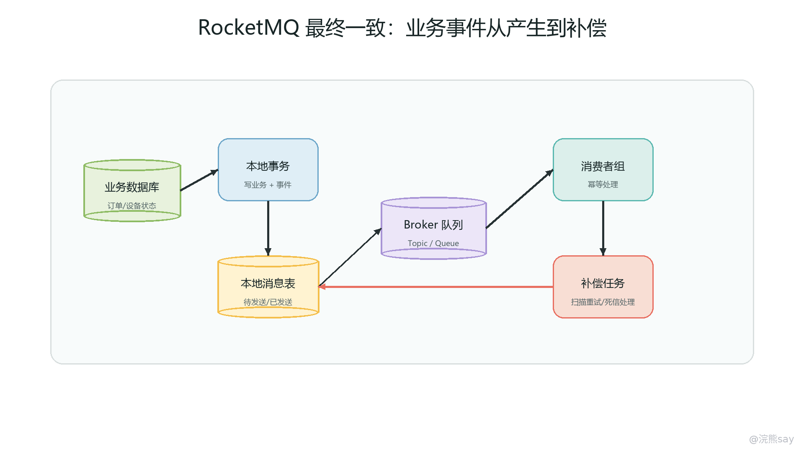
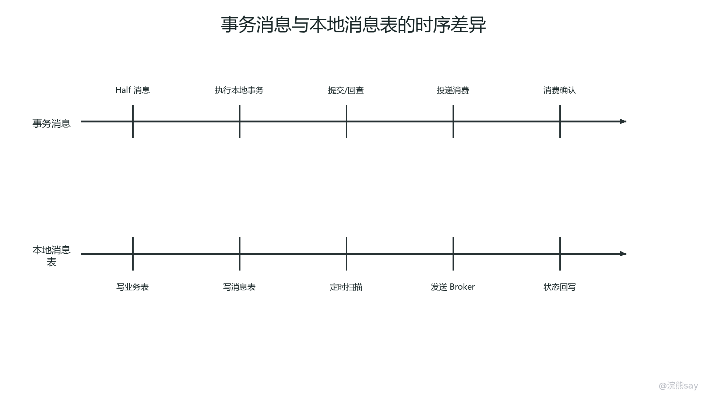
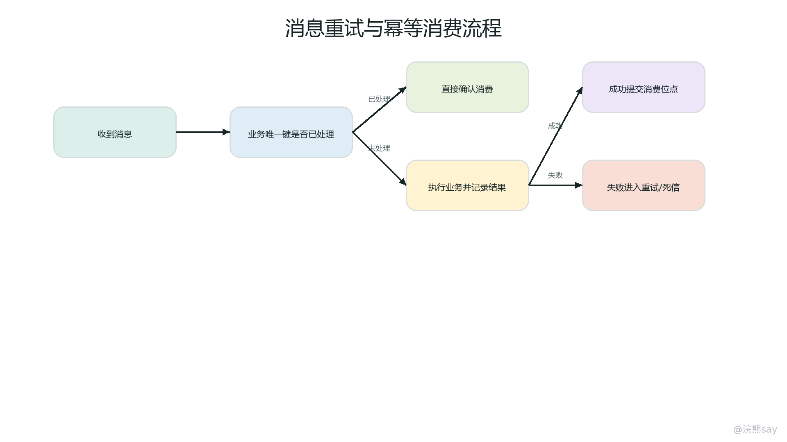

# 08 RocketMQ：消息削峰与最终一致实践

RocketMQ 是面向分布式系统的消息中间件，在 Spring Cloud Alibaba 体系中常用于异步解耦、流量削峰、事件通知、可靠消息和最终一致性治理。它解决的不是“服务之间怎么互相找到”，也不是“远程调用怎么写得像本地方法”，而是当一个业务动作不适合全部同步串行完成时，系统如何把后续动作转成可持久化、可重试、可观测的消息链路。

在微服务拆分以后，很多业务动作会同时牵涉多个服务。比如订单创建后要扣库存、发优惠券、写积分、推送通知、刷新搜索索引；设备上报后要写时序数据、触发告警规则、更新设备状态、推送 WebSocket 通知。若全部使用同步 Feign 串行调用，主链路会被慢依赖拖长，下游抖动会向上游扩散，突发流量也会直接打到数据库和第三方接口。MQ 的价值在于把“必须立刻完成的核心写操作”和“可以稍后完成的派生动作”分开，使主链路更短，下游按自己的消费能力逐步处理。

面试复习时，不能只说“RocketMQ 可以削峰解耦”。更完整的表达应该包括四层：第一，消息适合哪些业务边界，例如异步通知、状态同步、数据汇总、日志流水和最终一致；第二，生产者、Broker、Topic、队列、消费者组、消费位点如何构成基本链路；第三，消息发送、本地事务、消费幂等、失败重试、死信和补偿任务怎样共同保证可靠性；第四，RocketMQ 与 Seata 的边界在哪里，什么时候选择最终一致，什么时候评估强一致事务。

## 一、消息治理的定位：把同步链路拆成可靠异步链路

消息治理的核心思想是把服务间协作从“调用方等待所有下游完成”转成“调用方提交核心事实，下游围绕事实事件异步推进”。这里的“事实”通常是业务状态已经发生变化，例如订单已创建、支付已成功、设备已上报、告警已生成、任务已完成。生产者把事实写成消息发送到 RocketMQ，消费者根据消息执行自己的本地逻辑，并通过重试、幂等和补偿保证结果最终收敛。

这种结构首先带来解耦。订单服务不需要直接知道积分服务、通知服务、搜索服务的内部接口，只需要发布“订单已创建”事件；下游服务订阅自己关心的 Topic 或 Tag，独立演进自己的处理逻辑。解耦不是完全没有依赖，而是把同步接口依赖变成事件契约依赖。契约仍然要治理，包括消息字段、版本兼容、业务主键、事件含义、幂等键和生产消费双方的责任边界。

其次是削峰。入口流量瞬间增加时，生产者可以快速把请求转成消息并落到 Broker，消费者按线程池、批量大小和实例数量逐步拉取处理。对数据库、第三方通知、报表汇总这类承载能力有限的资源，MQ 相当于在前面放了一层缓冲区。削峰不是凭空增加系统容量，而是把峰值压力摊平到更长时间内。如果消费者长期处理速度低于生产速度，消息会持续堆积，最终仍然需要扩容、限流或降级。

第三是异步通知。通知短信、邮件、站内信、企业微信、Webhook 回调、搜索索引刷新等动作，大多数不应该阻塞核心交易链路。主业务只要确认核心状态已经写入，就可以发出事件；通知失败可以重试，最终失败再进入死信或补偿。这里要注意业务语义：异步通知可以延迟，但不能伪装成已经成功；如果通知本身是用户可见承诺，就要有通知状态表、失败原因和人工补发入口。
| 场景 | MQ 适配程度 | 设计重点 |
| --- | --- | --- |
| 订单创建后发通知 | 高 | 主链路提交订单，通知异步重试 |
| 设备上报后规则计算 | 高 | 削峰、批量消费、堆积监控 |
| 搜索索引刷新 | 高 | 最终一致、失败补偿、版本覆盖 |
| 库存强扣减 | 需谨慎 | 幂等、库存状态机、超卖边界 |
| 资金扣款 | 低或需严格方案 | 强一致、对账、补偿和审计 |
| 用户查询接口 | 不适合直接替代 | 查询通常需要同步返回结果 |

因此，MQ 的选型不是“异步一定更高级”。如果调用方必须立即拿到结果，或者业务要求跨服务同时成功失败，纯消息异步就不适合直接替代同步事务。更准确的判断是：核心事实能否先落库，后续动作是否允许延迟，失败后能否重试或补偿，用户是否能接受中间状态。如果这四个问题回答清楚，MQ 的边界就比较稳。

## 二、RocketMQ 基本链路：生产者、Broker、Topic、队列与消费者组

从系统结构上看，RocketMQ 的基本链路由生产者、Broker、Topic、消息队列、消费者组和消费位点构成。生产者负责把业务事件封装成消息并发送到 Broker；Broker 负责持久化消息、维护队列、支持消费者拉取和重试；Topic 是消息的逻辑分类，例如订单事件、设备上报事件、通知事件；一个 Topic 通常会被拆成多个队列，用于并发存储和并发消费；消费者组表示一组共同消费同一类消息的实例；消费位点记录消费者组处理到哪里。

理解消费者组时要区分广播和集群消费。集群消费下，同一个消费者组内的多个实例共同分摊消息，一条消息通常只由组内某一个实例处理，适合订单处理、通知发送、数据落库等任务。广播消费下，组内每个实例都会收到同一条消息，适合本地缓存刷新、配置通知一类场景，但要谨慎使用，因为实例数增加会放大处理次数。大多数业务事件使用集群消费。

Topic 和 Tag 的设计要服务于业务边界。Topic 不宜过细，否则治理成本上升；也不宜过粗，否则权限、监控、订阅关系和堆积排查都会混乱。常见做法是按业务域划分 Topic，例如订单事件、支付事件、设备事件，再用 Tag 区分事件类型，例如创建、支付、取消、状态变更。消息体中应携带业务主键、事件类型、事件时间、版本号、traceId 和必要的上下文字段，但不要把整张业务表或敏感信息无脑塞进消息。

images/08-rocketmq-eventual-consistency-chain.png

这条链路可以按“核心事实落库、消息可靠投递、消费者幂等处理、失败重试补偿”来理解。生产者侧最重要的是避免“数据库成功但消息丢失”或“消息发出但数据库失败”造成事实与事件不一致；消费者侧最重要的是接受重复投递的现实，通过幂等和状态机让重复消息不会重复产生业务副作用。RocketMQ 提供了消息存储、投递和重试能力，但最终一致性仍然需要业务表、消费记录、补偿任务和监控一起完成。

可观测性也要从一开始纳入消息设计。同步链路里 traceId 主要沿 HTTP 或 RPC Header 传播，进入 MQ 后就要把 traceId 写入消息属性或消息头，消费者取出后恢复日志上下文。否则一次请求从网关到订单服务还能串起来，但从订单服务发出消息后，库存服务、通知服务、积分服务的日志就断了。线上排查消息问题时，至少要能按业务主键、消息键、traceId、Topic、消费者组和消费时间查询。

## 三、削峰、解耦与异步通知的工程用法

削峰场景的重点是“入口快进，后端慢出”。例如设备每分钟集中上报状态，如果设备服务同步写库、同步计算规则、同步发通知，入口线程很容易被慢逻辑拖住。改成 MQ 后，设备服务只做校验、必要落库和消息发送，规则服务、告警服务、通知服务分别消费事件。消费者可以根据数据库能力控制并发，也可以在低峰期逐步追赶堆积。

削峰要配合容量设计。生产速度、Broker 写入能力、消费者处理速度、单条消息处理耗时、消息堆积阈值和可接受延迟，都要在压测或线上指标中量化。如果每秒生产 10000 条，消费者只能处理 2000 条，短期削峰可以承受，长期就会形成持续堆积。此时不能只说“MQ 能抗住”，还要扩容消费者、优化处理逻辑、批量写入、降低非核心消息频率，或者在入口接入 Sentinel 和网关限流。

解耦场景的重点是事件契约。一个订单事件可能被库存、积分、通知、风控、报表等多个服务消费，但生产者不能频繁改变字段含义，也不能把内部临时状态暴露成公共事实。较好的事件命名应表达已经发生的业务事实，而不是命令下游做什么。例如“订单已支付”比“通知积分服务加积分”更适合作为领域事件。前者允许多个消费者独立订阅，后者把生产者和某个下游动作绑死。

异步通知场景要把通知结果纳入业务状态。短信、邮件、Webhook、站内信等动作常常失败，失败原因可能是第三方限流、网络超时、模板错误、号码异常或签名配置错误。工程上通常会有通知记录表，记录业务主键、通知渠道、发送状态、失败原因、重试次数和最后处理时间。MQ 负责触发发送，记录表负责承载状态，定时补偿任务负责兜底，监控告警负责发现大面积失败。
| 工程问题 | 常见表现 | 处理方式 |
| --- | --- | --- |
| 消息积压 | 消费延迟持续升高 | 扩容消费者、批量处理、限流入口、排查慢依赖 |
| 事件字段不兼容 | 消费者反序列化失败 | 版本字段、向后兼容、新旧字段过渡 |
| 重复消费 | 下游重复扣减或重复通知 | 业务幂等键、唯一索引、状态机校验 |
| 消费失败无限重试 | 队列被坏消息卡住 | 最大重试、死信队列、人工处理 |
| trace 断裂 | MQ 后日志查不到同一链路 | 消息头传递 traceId，消费者恢复上下文 |

真实项目表达时，可以用 IoT 链路举例：设备上报进入 Gateway 和设备服务，入口做鉴权、限流和基本校验，核心上报记录写入后发送设备事件；规则服务消费事件做告警判断，告警服务写告警记录并发送通知事件，通知服务再异步调用短信或企业微信。整个链路不是所有动作都在一个事务里完成，而是通过消息、状态表、重试和补偿让各服务状态最终收敛。

## 四、事务消息、本地消息表与补偿任务的取舍

images/08-rocketmq-transaction-message-timeline.png

最终一致性最难的地方在生产者侧。假设订单服务先写订单表，再发送“订单已创建”消息，如果写库成功但发送失败，下游永远不知道订单创建；如果先发消息再写库，消费者可能看到一个数据库里还不存在或最终失败的订单。解决这个问题通常有两类思路：RocketMQ 事务消息，或者本地消息表加补偿任务。

事务消息可以理解为“先把消息以半消息形式提交给 Broker，再执行本地事务，最后根据本地事务结果决定消息是否可投递”。如果生产者在提交最终状态前异常，Broker 会反查生产者，由生产者根据本地事务状态判断消息应该提交还是回滚。这种方案适合本地事务结果可以被可靠查询的场景，例如根据订单号查询订单是否已经创建成功。它降低了本地事务与消息投递之间的断裂风险，但仍然要求业务能够正确实现事务状态检查。

本地消息表的思路更直接：在同一个本地数据库事务中，同时写业务表和消息表。事务提交后，由后台任务扫描待发送消息表，把消息投递到 RocketMQ；发送成功后更新消息状态。若发送失败，任务后续继续重试。这种方案的优点是逻辑清晰、可审计、可补偿，消息是否待发送、发送中、成功、失败都有本地记录；缺点是需要维护消息表、扫描任务、状态流转和清理策略。

补偿任务是最终一致链路的兜底，不是“出了问题再手工跑脚本”。补偿任务应当常态化存在，定期扫描未完成、超时、失败次数未超过阈值的业务记录或消息记录。比如订单已支付但积分未到账，可以根据订单状态和积分流水状态补发事件；通知发送失败但仍可重试，可以按失败原因和重试次数重新投递；死信消息处理完成后，也可以由补偿任务恢复业务状态。
| 方案 | 适用场景 | 优点 | 风险点 |
| --- | --- | --- | --- |
| RocketMQ 事务消息 | 本地事务状态可查询，消息与本地写强相关 | 减少写库成功但消息丢失 | 事务反查要可靠，业务状态判断要清晰 |
| 本地消息表 | 需要审计、补偿、可查询的可靠消息 | 简单透明，容易排查 | 需要维护扫描、状态和清理 |
| 直接事务后发送 | 低风险通知或允许人工修复 | 实现简单 | 进程崩溃会丢消息，需要额外补偿 |
| 定时补偿 | 所有最终一致链路的兜底 | 能修复临时失败 | 依赖业务状态可判定，不能替代幂等 |

工程上不要把这些方案理解成互斥。事务消息解决生产者本地事务和消息投递的一致性，本地消息表提供可审计的可靠投递记录，补偿任务修复超时和失败状态。对高价值链路，可以组合使用本地状态表、消息投递状态、消费幂等表和补偿任务。对低价值通知，可以简化一些，但至少要能监控失败率和积压情况。

## 五、幂等消费：把“可能重复”设计成“重复也安全”

RocketMQ 和大多数消息系统一样，工程上应按“至少一次投递”来设计消费逻辑。也就是说，消费者可能收到重复消息。重复的原因很多：消费者处理成功但提交消费位点失败，消费超时后 Broker 重新投递，消费者实例重启，网络抖动导致结果不确定，或者业务主动重试。面试时不要承诺“MQ 保证绝对只消费一次”，更可靠的说法是“消息系统尽量减少重复，业务消费必须幂等”。

幂等设计的第一层是业务幂等键。消息中要有稳定的业务主键或事件编号，例如订单号、支付单号、设备上报流水号、通知任务号。消费者不要只依赖消息系统生成的消息 ID，因为同一个业务事件在补偿重发时可能生成新的消息 ID。真正能表达业务唯一性的，是业务侧定义的事件键。

第二层是消费记录或唯一约束。消费者处理前可以根据业务幂等键检查是否已经处理过，或在本地表中写入消费记录并加唯一索引。对“只能执行一次”的动作，例如发放积分、生成账单、创建通知任务，最好让数据库唯一约束成为最后一道防线。代码里的先查后写在并发下可能仍然竞态，唯一索引能把重复写收敛成可识别的幂等结果。

第三层是状态机。很多业务不是简单的“处理过或没处理过”，而是有状态流转。例如订单从已创建到已支付、已取消、已完成；通知从待发送到发送中、成功、失败；设备任务从待下发到已下发、执行中、成功、失败。消费者处理消息时要判断当前状态是否允许流转，过期事件、重复事件、逆序事件不能直接覆盖当前状态。

images/08-message-retry-idempotent-flow.png

这张图可以按“接收消息、提取业务键、幂等判断、业务处理、提交结果、失败重试或死信”来理解。关键点是业务处理和幂等记录要尽量处在同一个本地事务中，至少要能通过状态表恢复出真实结果。若处理成功但记录幂等失败，后续可能重复执行；若记录成功但业务处理失败，后续可能误判已经完成。因此设计时要明确以哪张表、哪个状态作为最终事实。

## 六、顺序消息、延迟消息与消费并发边界

顺序消息解决的是同一个业务对象的事件必须按顺序处理。比如同一个订单的创建、支付、取消，或者同一个设备的上线、状态变更、离线，如果乱序消费可能导致状态倒退。RocketMQ 的顺序通常是队列级顺序，生产者需要把同一个业务键的消息路由到同一个队列，消费者对该队列按顺序处理。它不是全局顺序，也不应该为了少数对象的顺序要求牺牲整个 Topic 的并发能力。

顺序消息的工程坑是热点键。如果所有消息都按同一个键进入同一队列，消费并发会被压到很低；如果某个大客户、热门设备或核心订单产生大量事件，也会形成局部队列堆积。设计顺序消息时要问清楚：是否真的需要严格顺序，顺序范围是全局、租户级、订单级还是设备级，乱序是否可以通过状态机和版本号解决。很多场景只需要“同一业务对象不倒退”，不需要全局有序。

延迟消息适合表达“稍后再处理”的动作，例如订单超时未支付自动关闭、通知失败后隔一段时间重试、设备离线一段时间后触发告警。它和定时任务的区别在于，延迟消息更贴近单个事件的后续动作，定时任务更适合批量扫描和补偿。延迟消息不是精准调度系统，如果业务要求严格到秒级甚至毫秒级的调度精度，需要评估专门的调度方案。

消费并发要和下游容量匹配。消费者线程开得越多，拉取和处理越快，但数据库、Redis、第三方接口可能被打爆。消息消费入口也需要稳定性治理，可以结合线程池隔离、限流、批量处理、熔断和降级。比如通知消费者调用第三方短信接口，如果第三方变慢，不能让大量消费线程全部阻塞；应当限制并发、缩短超时、记录失败、后续重试。

消息体大小也要控制。大消息会增加网络传输、Broker 存储、消费者反序列化和重试成本。更合理的方式是消息中只放业务键、事件类型和必要快照，消费者需要详情时再查自己的读模型或上游服务。若担心查详情导致强耦合，可以在事件里放稳定的业务快照，但要注意字段兼容和敏感信息脱敏。

## 七、重试、死信与消息堆积排查

消费失败后的重试是可靠消息的重要能力。消费者处理消息抛出异常、返回失败或超时，Broker 会在后续重新投递。重试适合临时性故障，例如网络抖动、数据库短暂不可用、第三方接口限流、缓存连接异常。对这些问题，延迟重试可以让系统在依赖恢复后自动收敛。

但重试不能解决永久性错误。消息字段缺失、版本不兼容、业务状态非法、模板配置错误、消费者代码 bug，这类问题反复重试只会占用队列和线程。超过最大重试次数后，消息通常进入死信队列，由人工、后台工具或专门的死信处理任务介入。死信不是垃圾桶，而是生产事故线索。死信消息要能查询原始内容、失败原因、消费者组、重试次数和关联业务主键。

重试策略要避免放大故障。下游已经异常时，如果大量消息立即重试，会形成重试风暴。更稳妥的做法是设置退避间隔、限制消费者并发、对下游调用配置超时和熔断，并在失败率升高时告警。必要时可以临时暂停某个消费者组、降低消费线程、扩容下游资源或对入口限流。处理消息堆积时，不要一上来盲目扩容消费者，先确认下游是否能承受更高写入。

消息堆积排查可以按五步走。第一，看生产速率和消费速率，判断是流量突增还是消费变慢。第二，看消费者错误率和重试量，确认是否有坏消息或代码异常。第三，看消费者处理耗时，定位慢在数据库、Redis、第三方接口还是本地计算。第四，看队列分布和业务键，判断是否顺序消息或热点键导致局部堆积。第五，看最近发布和配置变更，确认是否有字段不兼容、订阅关系变化或消费线程配置变化。
| 指标 | 含义 | 典型动作 |
| --- | --- | --- |
| 消费延迟 | 消息从产生到处理完成的时间 | 判断削峰是否进入危险区 |
| 堆积量 | 待消费消息数量 | 扩容、限流、排查慢消费者 |
| 重试量 | 失败后重新投递次数 | 排查临时依赖故障或坏消息 |
| 死信量 | 超过重试上限的消息数 | 人工处理、修复数据、补偿 |
| 消费耗时 | 单条消息处理时间 | 优化数据库、批量处理、隔离慢依赖 |
| 生产速率 | 生产者写入速度 | 判断入口是否需要限流 |

项目里还要准备消息应急方案。比如通知类消息堆积，可以先保护核心交易链路，允许通知延迟；设备上报类消息堆积，要评估是否允许采样、丢弃低价值数据或按租户限流；订单状态类消息堆积，则要优先保障一致性，必要时暂停非核心消费者，把资源集中给关键消费者。不同消息的业务等级不同，处理策略不能一刀切。

## 八、RocketMQ 与 Seata 的边界

RocketMQ 和 Seata 都出现在分布式一致性问题里，但它们解决问题的方式不同。Seata 更偏向在一段可控链路内协调多个本地事务，追求更强的一致性语义；RocketMQ 更偏向通过事件、重试、幂等和补偿实现最终一致。二者不是谁替代谁，而是适用于不同业务约束。

Seata AT 适合链路较短、主要围绕关系型数据库 DML、吞吐压力可接受、回滚语义清晰的场景。它会引入 undo log、全局锁、SQL 解析、TC 通信和二阶段处理，因此不适合把外部接口调用、消息发送、文件操作、长时间计算全部包进全局事务。项目选型中要反复强调一点：看到跨服务写操作就套 Seata 是常见误区。

RocketMQ 更适合可以接受短暂中间状态的场景。比如订单已创建但积分稍后到账，支付成功后通知稍后发送，设备状态写入后告警稍后计算，搜索索引稍后刷新。这些场景中，业务事实先落库，后续动作通过消息推进。系统承认短时间不一致，但通过重试、死信、补偿和对账让状态最终收敛。

一个常见错误是在全局事务里直接发送外部消息，并期待事务回滚时消息也自动撤回。消息一旦对外可见，消费者可能已经处理，外部通知可能已经发出，Seata 的数据库回滚不能自动撤销这些副作用。更合理的方式是把消息发送放在本地事务提交之后，或者使用事务消息、本地消息表等可靠消息方案，让“业务事实成功”与“事件可投递”之间有明确边界。

选型时可以按三个问题判断。第一，调用方是否必须同步知道所有下游结果，如果必须，MQ 异步不是直接答案。第二，失败后能否通过业务补偿修复，如果能，可靠消息通常更适合高吞吐链路。第三，参与方是否主要是关系型数据库且链路短，如果是，可以评估 Seata；如果包含第三方接口、通知、文件、缓存、搜索索引等外部副作用，更应优先考虑消息、状态机和补偿。

面试中可以这样表达：“我们不会把 Seata 当成所有跨服务写操作的默认方案。核心数据先看能不能收敛在一个服务本地事务里；可以异步推进的派生动作，用 RocketMQ、幂等消费和补偿任务做最终一致；只有对强一致要求高、链路短、数据源适配、吞吐可接受的场景，才评估 Seata AT 或 TCC。消息和全局事务的边界要清楚，外部副作用不能指望数据库回滚自动撤销。”

## 九、面试表达与学习自测

回答 RocketMQ 项目题时，可以按“场景 -> 链路 -> 可靠性 -> 边界 -> 排查”组织。一个完整回答可以这样说：“在 Spring Cloud Alibaba 项目里，我们用 RocketMQ 处理异步通知、流量削峰和最终一致。核心服务先完成本地事务，把已经发生的业务事实转成消息发送到 Topic；消费者组按业务域订阅消息，处理时使用业务主键做幂等，并通过状态机避免重复和乱序影响。生产者侧用事务消息或本地消息表降低写库成功但消息丢失的风险，消费者侧依靠重试、死信和补偿任务保证最终收敛。线上排查时会看生产速率、消费延迟、堆积量、重试量、死信量和 traceId。”

如果面试官追问“RocketMQ 如何保证消息不丢”，不要回答成绝对不丢。更稳的回答是分层说明：Broker 层有持久化和复制等可靠性设计；生产者要处理发送结果和异常；本地事务与消息投递之间要用事务消息或本地消息表兜住；消费者失败会重试，但业务必须幂等；超过重试上限的消息进入死信，再由人工或补偿流程处理。也就是说，可靠消息不是一个开关，而是一整套生产、存储、消费、补偿和监控链路。

如果被问“MQ 和 Feign 怎么选”，可以回答：需要立即返回结果、调用链路短、依赖稳定、失败要直接反馈给用户时，用 Feign 这类同步调用更自然；后续动作可以延迟、下游处理较慢、消费者较多、流量有峰值或需要最终一致时，用 MQ 更合适。真实项目常常二者并用，核心校验和查询走同步，派生通知、数据同步和状态推进走异步消息。

**学习自测**

1. RocketMQ 在微服务治理中主要解决哪些问题？

- 参考要点：异步解耦、流量削峰、事件通知、可靠消息和最终一致。它不替代注册中心、网关、Feign、Sentinel，也不自动解决所有分布式事务。

1. 为什么消息消费必须做幂等？

- 参考要点：消息系统工程上通常按至少一次投递设计，消费成功但位点提交失败、网络抖动、消费者重启、业务重试都可能导致重复投递。消费者要用业务幂等键、唯一约束、消费记录和状态机保证重复也安全。

1. 事务消息和本地消息表分别解决什么问题？

- 参考要点：二者都用于降低本地事务与消息投递不一致的风险。事务消息依赖半消息、本地事务执行和事务状态反查；本地消息表依赖同库事务写业务表和消息表，再由后台任务可靠投递。

1. 消息堆积时应该如何排查？

- 参考要点：先看生产速率和消费速率，再看错误率、重试量、单条处理耗时、队列分布、热点键、下游数据库或第三方接口，最后结合发布和配置变更判断是否有字段兼容或订阅关系问题。

1. 顺序消息的边界是什么？

- 参考要点：RocketMQ 顺序通常是队列级顺序，需要把同一业务键路由到同一队列。它不是全局顺序，使用过度会降低并发；很多业务可以用版本号和状态机处理乱序。

1. RocketMQ 和 Seata 如何选型？

- 参考要点：Seata 适合链路短、关系型数据库操作为主、强一致收益大于成本的场景；RocketMQ 适合可接受延迟和补偿的最终一致场景。外部通知、搜索索引、第三方接口、设备上报等更常用消息和补偿，不应默认放进全局事务。

最后的准备标准是：能画出生产者、Broker、Topic、队列、消费者组和消费位点的链路；能说明削峰不是无限容量，解耦仍然需要事件契约；能讲清事务消息、本地消息表、幂等消费、顺序消息、重试、死信、补偿任务的关系；能把 RocketMQ 与 Seata 的边界讲清楚，并落到项目排查指标，而不是只背“削峰、解耦、异步”三个词。
