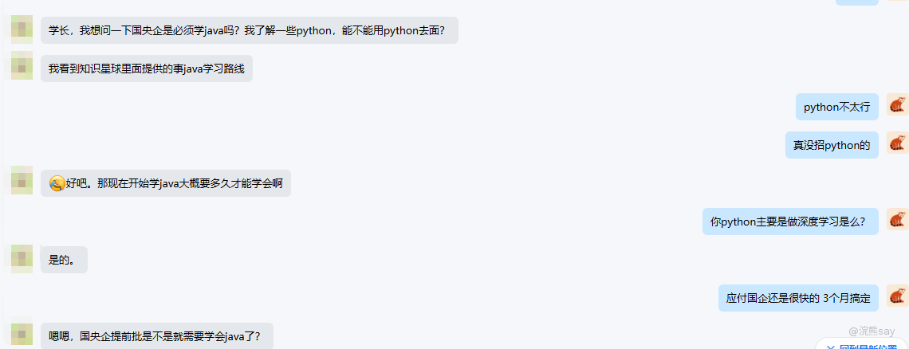

# 计算机专业最大的秋招幻觉：我 Python 写得熟，面哪个厂都不虚

* * *

快秋招了，连着遇到好几个只会 Python 的同学。

不是普通学校的——有本硕 985 的，有中科院的，学历都不差。简历打开一看，项目全是 Python + 深度学习。面互联网大厂也许还能搏一搏，但他们的目标是央国企。然后问我同一句话：秋招怎么办，只会 Python 能不能进好的央国企？

能问出这句话，说明你已经隐约感觉到不对劲了。我来帮你把这个不对劲说清楚。

先说个前提：央国企得拆开看。

有一类"考试型央企"——笔试面试走形式，真正看的是学历和学校牌子。人家自己不做研发，你简历上写 Python 还是 Java 还是 C++，面试官其实不太在意。对于这一类，只会 Python 顶多少几个机会，谈不上致命。

但问题是，你秋招投 20 家，能有 3 家是这种"考试型"就不错了。剩下 17 家，都是**真做技术的央国企**。对它们来说，你简历上只有 Python，基本等同于开局就亮红牌。不信你去翻任何一家技术类央国企的校招 JD，招纯 Python 开发的岗位少到你可以用一只手数完。纯算法岗倒是有——但你往下看，第四条我会告诉你那条路有多窄。

今天聊透这件事：**为什么计算机专业的同学，面央国企技术岗，别把 Python 当主力语言。**

* * *

## 一、Python 的两大主场，在央国企一个都用不上力

很多同学有个惯性思维：大学几年最熟的就是 Python，那面试当然拿最顺手的东西上。

这里有个致命的混淆：**“你最熟的语言"不等于"面试最有竞争力的语言”。** 在央国企这个场景里，这是两码事。

Python 真正非它不可的场合，数来数去就两个。

**第一个是写脚本。** 自动化部署、数据处理、运维巡检——Python 能干，Shell 也能干，Go 也能干，Node.js 也不是不行。脚本赛道上拼的根本不是语言，是你对系统和业务的熟悉程度。面试官听到"我会写 Python 脚本"，内心翻译过来就四个字：**会写脚本。** 用什么写的，他不会追问第二句。

**第二个是 AI 和机器学习。** 这是 Python 真正站稳脚跟的地方。PyTorch、Hugging Face、LangChain，整个 AI 技术栈的底座就是 Python。做这个方向你没得选，Python 是刚需。

听起来不错对吧？但问题来了——

**央国企的 AI 研发岗，对大多数人来说根本就不存在。** 人家招不招是一回事，就算招，你大概率也够不着门槛。这个后面细说。

**脚本岗不挑语言，AI 岗不招普通人。Python 的两大主场，在央国企的招聘版图里，恰好落在两个最尴尬的位置。**

* * *

## 二、央国企的技术栈真相：Java 是王，C++ 是将，Python 是兵

先扔结论：**在央国企技术岗，Java 是绝对主力，C++ 和 C# 各有地盘，Python 是工具，不是主力。** 分行业看——

**银行系统：Java 一统天下。** 六大行软开、数据中心、省分科技岗，核心交易系统、信贷系统、风控系统、网银后端、手机银行后端、中间业务平台，清一色 Java + Spring 全家桶。这不是某家银行的偏好，是整个金融 IT 行业二十年的技术沉淀。你带 Python 当主力去面银行软开，面试官连追问项目细节的兴趣都会打折。

**运营商（移动、联通、电信）：Java 为主，C/C++ 守关键位置。** BOSS 系统、CRM、大数据平台、电渠系统，后端全 Java。网络域——核心网、接入网、传输网——C 和 C++ 是铁打的主力，Python 基本没有存在感。

**电力/石油/能源：C++ 和 Java 两分天下。** 电网调度系统、SCADA、DCS 控制系统基本是 C++ 的地盘；管理信息系统、ERP、数据中台是 Java 的主场。三桶油和五大发电集团同理，底层控制和上层管理泾渭分明，Python 在哪儿都只是配角。

**军工/航天/研究所：C++ 吃重，C# 有一席之地。** 嵌入式系统、实时控制、仿真平台——C++。桌面工具、测试平台、内部管理系统——C#（.NET）还有大量存量项目。这些体系里，Python 基本当胶水语言用。

**制造业央企：C#(.NET)、Java 并行。** 中车、中船、一汽东风长安这些制造类央企，内部信息化系统大量 MES、ERP、WMS——Java 做后端服务，C# 做桌面客户端和工厂上位机。Python 在制造业央企里的角色接近隐形。

一句话总结：**你拿 Python 当主力去面央国企技术岗，等于带着羽毛球拍去打篮球——装备本身不差，但这赛场压根不是打这个球的。**

## 三、算法岗那条路，多数人连入场券都摸不到

你可能想：那我直接面 AI 研发岗不就行了？Python 在那个赛道不是王者吗？

**Python 在 AI 赛道确实是王者。问题是，你得先拿到入场券。**

央国企的算法和 AI 研发岗，有三道硬门槛——

**第一道：学历。** 双 985 硕是起步线，博士更受欢迎。985 本科 + 海归硕算标配。普通 211 或双非的同学，简历第一关就筛掉了，连面试官长什么样都不知道。

**第二道：名额。** 一个省公司招 50 个软件开发，算法岗可能就两三个。总部研究院更夸张——一个岗位几百人抢，录取比比你考研还刺激。

**第三道：面试深度。** 不是让你展示"我会调 sklearn"。算法岗聊的是论文创新点、模型架构设计、训练优化策略、分布式训练经验。你拿几个 GitHub 上跑过的 tutorial 项目去面，面试官一个问题就能让你现原形。

现实就是这样残酷：**对 95% 的计算机专业同学来说，你能拿到的央国企面试机会，刚好是 Python 最使不上劲的那批岗位。** 你以为你的 Python 是王牌，结果发现桌子上的游戏根本不是打这张牌的。

## 四、Python 项目在面试官眼里，默认按 demo 处理

不是 Python 不行。恰恰相反，是 Python 生态太行了，行到了**面试官没法分辨你深浅**的地步。

几十行代码跑一个模型。一个周末搭一个聊天机器人。每个候选人都在简历上写"基于 Transformer 的情感分析"“基于 LangChain 的智能问答系统”——面试官怎么办？他面 100 个人，80 个写的是同一套东西。他没精力也没办法去验证：你这项目是花了三个月啃论文复现出来的，还是照着 tutorial 跑了一遍。

**最省事的策略就是：一律按 demo 处理。**

这不是面试官不专业，这是**信息不对称下的理性选择。** Python 把 AI 的门槛降到了地下室，反而让真正有深度的人被淹没在了同质化的项目列表里。

反过来，你用 Java 做了一个后端系统——有权限控制、有数据库设计、有接口文档、有压测数据——面试官一眼就能看出你做了什么，工程能力落在哪个层次。**可验证的工程能力，在面试场上比"看起来很唬人"的 AI 项目值钱十倍。**

## 写在最后

说这些不是要劝退 Python。Python 是好语言，AI 方向也是好方向。但你要清楚一件事：

**秋招不是技术比武，是匹配游戏。** 你的简历不是在展示"我会什么"，而是在回答面试官一个问题——**“把你招进来，你能立刻上手什么活？”**

对央国企技术岗来说，这个答案在绝大多数情况下都应该是 Java 或 C++。Python 可以是你的第二把刀、第三把刀，但它不能是你身上唯一的一把。

还在大二大三的同学，趁还有时间，把 Java 补齐。已经大四快秋招的同学，实在来不及，至少把项目经验往工程化方向靠——权限、数据库、部署、压测，这些才是面试官真正会看的东西。

**在央国企的游戏规则里，Python 写得好是加分项，但 Java 写得出来才是入场券。**
