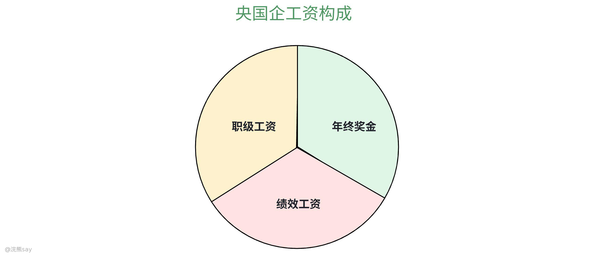
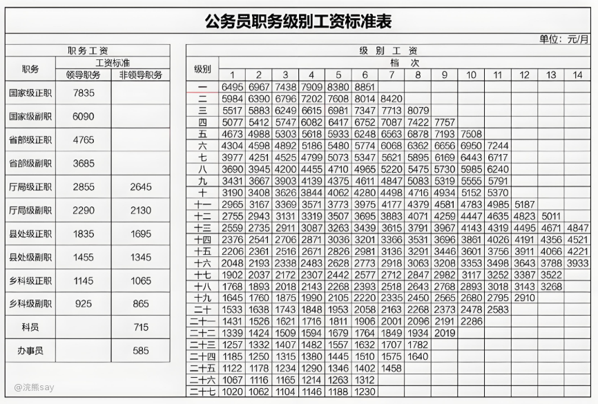
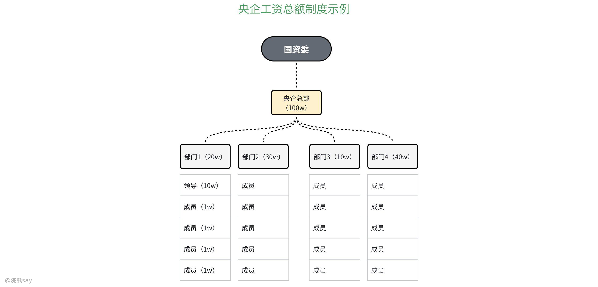

# 2.央企薪资构成详解

我相信，大多数小伙伴对于央企、国企最为关注和担忧的问题就是工资问题了。网上鱼龙混杂的信息很多，喷的人很多，多数是说央企、国企的待遇多么多么低，甚至很多人举例一个月到手2k~3k的国企。

对于这些负面信息我并不否认，因为确实央企、国企的盘子很大，中国烟草研究所是央企，那些上级央企控股4级~5级的还有私人控股的公司也宣称央企，显然不同的央企单位的福利待遇和工作氛围会完全不一样。

浣熊哥的这篇文章，主要帮助大家了解真实的央企、国企的薪资，福利待遇，工资计算方式等，让大家对央国企的工资构成有个真实的了解。

# 薪资构成

央企、国企的薪资构成一般都是职级工资+绩效工资+年终奖金组成，其中职级工资是根据职级固定的，绩效工资和年终是浮动的。

# 职级工资

职级工资是指在央企国企内部会有自己的职级划分，每个职级会对应不同的基本工资，以公务员的职级工资为例，正科级的基本工资就是1145，但是公务员的到手工资肯定不止1000块钱，所以职级工资只占央企、国企员工的薪资的一小部分。

央企、国企内部和公务员类似，也会有一个自己的职级工资，但是一般会比公务员的职级别工资高，对于校招生一些好的央企职级别工资一般在3000~4000 ，当然央企、国企之间的内部情况不同，这个职级工资具体金额也不同。

# 绩效工资

绩效工资的可操作性就非常大了，有的人绩效工资只有1k~2k，所以每个月到手3k~4k，有的人绩效工资就比较高，8k~1w都是有可能的。

既然绩效工资这么重要，那么这个绩效工资是怎么定的呢？这个其实根据不同的央企国企的类型不同有所区别：

像中国石油、中国烟草和国家电网这种垄断央企一般没有议价权，所有的应届生进来都是打包价格，同一个岗位根据学历不同你的绩效工资都是定死的，没什么可以argue的点。

但是对于有些社招的央企，例如中国商飞、中国电科某些所，无论对于校招还是社招的小伙伴来说，面试之后会有机会跟HR聊工资待遇情况，不满意的有些央企还可以argue。这个时候你问这些HR工资的Base是多少，她会告诉你一个具体的月薪资，例如：15k、20k。这里的15k、20k其中的80%以上的都是绩效工资。

那么绩效工资可以随意扣减吗？央企、国企的绩效工资一般和私企不同，不是随意可以扣减，基本上你和HR所谈的那个Base或者总包就是你每个月会拿到的绩效工资计算进去之后得出来的，所以可以简单的理解为Base。

# 年终奖金

国企年终奖这块儿一般都会提前算在HR给你说的那个工资总包里面，一般的计算公式如下：

**年终奖 = 工资总包 - 已按月发放的工资；**

所以其实没啥好期待的，肯定不会比HR给你承诺的薪资总包更多，但是拿了低绩效的话，年终奖是可能会扣的。

其实还有另外一种年终奖的计算方式，就是**某些国企的HR会给你承诺一个月Base，然后其中按比例扣下来作为年终发放。**

比如说给你开2w/月的base，然后说其中20%扣下来作为年终发放，那么年终大概是4k x 12 = 4.8w。

# 工资总额制度

对于央企、国企的工资总额制度我相信大家都很感兴趣，这里详细展开给大家讲讲。

央国企和私企不同，收入的大部分不是落入了股东的腰包，因为央企最大的股东是国资委和国务院，所以盈利的大头都是作为税收或者其它方式充入国库了。因此央企国企一般不会出现今年盈收好了，老板大笔一挥为了激励员工就发一个大大的年终奖，这基本上是不可能的。

那么央企员工们的工资是怎么定的呢？实际上，每个央企在年末的时候都会有一个营收相关的盘点，就是看你这个企业的盈利情况，支出情况，然后国资委根据每个央企的实际情况和员工情况设置一个工资总包给到央企集团总部。

然后，央企集团总部又会根据旗下各个子公司的实际盈利情况，继续往下划分工资总包，最终到你所在的部门和每个员工的头上。

所以，你们部门每年的工资总额的蛋糕大小就是固定的，至于每个人拿多少就看分蛋糕的人怎么去划分了。对于某些离谱的央企来说，例如建筑设计院，由于效益不好，工资总额就少。但是再苦不能苦领导，分蛋糕的人肯定要吃大的那块，于是就出现了底层设计师工资几千块，领导年终奖几十万的情况。

# Q&A

1.  **HR不说工资的央国企能去吗？**

这个真的分情况，有的例如某些运营商不说工资可能是工资太低了，例如到手2k~3k，这个真是HR不敢说。有的央企，例如中航工业旗下某些所，工资总包并不低，大概20w左右，但是薪资保密就不会告诉你，得托人去打听。

2.  **为啥央国企的Offer上不写工资？**

我也不懂，但是大多数央企发放的offer上都不写工资，如果HR跟你聊过工资的话，一般最后都是跟你聊的那个总包（一定搞清楚HR说的总包的计算方式！！！），如果没跟你聊工资，一定提前打听清楚。

3.  **怎么样判断央国企的HR说的薪资总包是否真实？**

这个就是比较大的话题了，加入星球，后面给大家详解...
