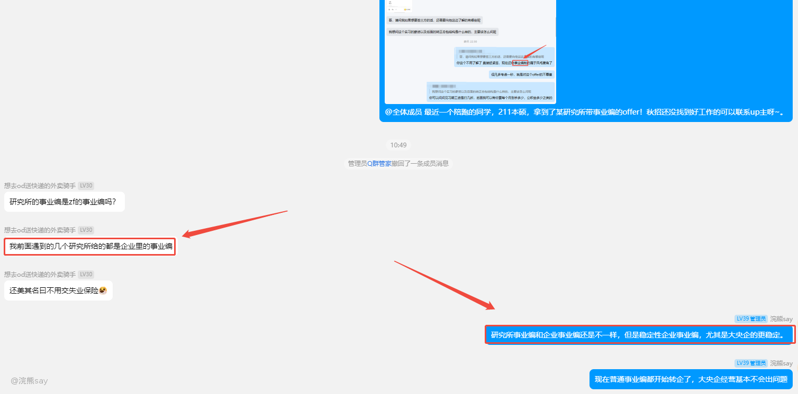

# 4.央国企研究所事业编和普通事业编制区别？

**央国企研究所事业编和普通事业编制区别？**

最近有陪跑的同学拿到了某研究所事业编offer，这里给大家科普下企业事业编制和普通事业编制区别。

其实研究所之间的事业编制本身也是有区别的，如果研究所是**普通部门（如科技局、中科院系统等）直接设立或管理**的，它的事业编就是 “（普通）体系内的事业编”，经费、管理都归普通相关部门，属于传统意义上的事业单位编制。

如果研究所是**企业（比如大型国企旗下）创办或管理**的，所谓 “企业里的事业编” 其实是比较特殊的情况（更像是企业自身搞的 “类事业编” 管理，和普通官方的事业编不一样）—— 因为严格来讲，企业本身没有 “事业编”，事业编是事业单位（非企业性质的公共服务 / 科研单位）的编制。这类 “企业里的事业编”，在经费来源、管理归属上更偏向企业，和普通序列的事业编（比如学校、医院的事业编）有明显区别，很多是历史遗留或企业内部的特殊安排。

现在事业单位改革后，纯企业化运营的研究所，大多会逐渐取消 “事业编”，转向企业合同制。

# 企业事业编制和普通事业编制区别？

央国企的事业编制和普通编制的区别，从职业发展角度，两者核心区别可从**稳定性、晋升、资源平台、薪酬福利**这几方面看：

1.  **编制与稳定性**

**普通直属研究所**：是 “传统事业编”，和普通事业单位体系直接挂钩，稳定性极强。退休后走**机关事业单位养老体系**（养老金替代率超 70%，还有公费医疗 / 高额医保）；编制 “跟人走”，甚至能跨事业单位调动（比如从 A 市研究所调到 B 市同类型单位）。

**企业旗下研究所**：多是 “企业化管理的事业编”（或 “岗编”），编制和**岗位绑定**（“在岗在编、离岗退编”），甚至本质是企业内部的 “类事业编”。稳定性受企业经营影响，合同到期要考核续聘；退休后更接近**企业职工养老标准**（养老金替代率约 40%，医疗待遇也打折扣）。

1.  **晋升路径**

**普通直属研究所**：晋升通道清晰，走 “专业技术 + 管理” 双通道 ：

专业技术岗：靠论文、项目、职称考试（如评 “中级工程师→高级工程师”），评上后收入提升明显（比如有前辈评完中级，收入超过同单位科长）。

管理岗：从 “九级职员” 慢慢升科级，还能 “双肩挑”（既有职称待遇，又当管理干部）。

**企业旗下研究所**：晋升更偏**企业逻辑**：

虽也能评职称，但受企业考核（比如项目利润、业绩指标）影响大；

管理岗晋升更看企业内部岗位空缺、业务布局，很难像普通直属那样 “跨单位调动”，去国际组织、部委挂职的机会也更少。

1.  **资源与发展平台**

**普通直属研究所**：依托普通部门（如工信部、国务院发展研究中心），能参与**国家重大政策研究**（比如产业规划、法规起草），和部委、地方普通、行业头部企业合作多，还有机会去国际组织（如中德智能制造联盟）任职，平台更偏向 “公共领域长期发展”。

**企业旗下研究所**：资源围绕**企业自身业务**（如央企的产业链、技术方向），市场化项目多（比如技术转化、产业投融资），能接触前沿技术，但参与 “国家顶层政策研究” 的机会少，发展更贴近企业的市场布局。

1.  **薪酬与福利**

**普通直属研究所**：薪资 “稳”，有行业竞争力；福利很全，比如**职业年金**（单位缴 8%、个人缴 4%，退休多一笔收入）、足额公积金、物业 / 采暖补贴、过渡性宿舍，还有 “研究成果奖、项目奖” 等。

**企业旗下研究所**：薪资**市场化**（比如年终奖可能发 6 - 12 个月工资），但波动大（企业亏损就可能缩水）；福利受企业效益影响，像住房补贴、公积金基数，可能不如普通直属的 “足额保障”。

# 企业事业编制和合同工区别？

事业编制（哪怕是企业旗下的）更接近 “带编制的正式身份”，合同工是劳动合同关系。然后稳定性，编制的只要不犯大错，很难被辞退；

合同工合同到期或企业有变化，可能不续签。福利待遇上，编制的社保、公积金这些通常更全，还有职业年金、各种补贴，工资也更稳定，甚至财政拨款；合同工的福利按合同来，可能少一些，工资也可能波动。

晋升方面，编制的有明确的晋升通道，能评职称、参与重要项目；合同工机会少。招聘方式也不同，编制一般要考试（像事业单位考试、国企内部编制招考），合同工是企业自主招聘，流程灵活。

现在还有改革趋势，企业编制在减少，合同工占比变多，但同工同酬在推进。现在把这些点整理清楚，用通俗的话讲出来。

**（1）身份与稳定性**：

-   企业事业编制：属于 “带编制的正式身份”，只要没重大错误，基本不会被辞退，稳定性强，像 “铁饭碗”。
-   合同工：和企业签劳动合同，关系靠合同维系，合同到期或企业不需要了，可能不续签，稳定性差。

**（2）福利待遇**：

-   企业事业编制：工资常和财政或企业核心福利体系挂钩，更稳定；社保、公积金一般足额交，还有职业年金（退休多一笔钱）、各种补贴（比如住房、节日福利）。
-   合同工：工资、福利按合同约定，可能比编制少；社保、公积金缴纳比例或基数可能低，有些福利（像职业年金）可能没有。

**（3）晋升与发展**：

-   企业事业编制：有清晰的晋升通道，能评职称（比如工程师、研究员），容易参与重要项目、培训，发展路径明确。
-   合同工：晋升机会少，评职称难，参与核心项目的机会也少，职业发展受限。

**（4）招聘方式**：

-   企业事业编制：一般要通过考试（比如国企内部编制招考、类似事业单位的招录考试），流程规范、竞争大。

-   合同工：企业自主招聘，流程灵活，面试通过就可能入职，门槛相对低。

最后，**改革趋势**：现在企业在 “去编制化”，合同工用得越来越多，国家也要求 “同工同酬”，但实际中编制和合同工的待遇、发展差距还是存在，不过合同工的权益（比如社保、工资保障）在逐步加强。
