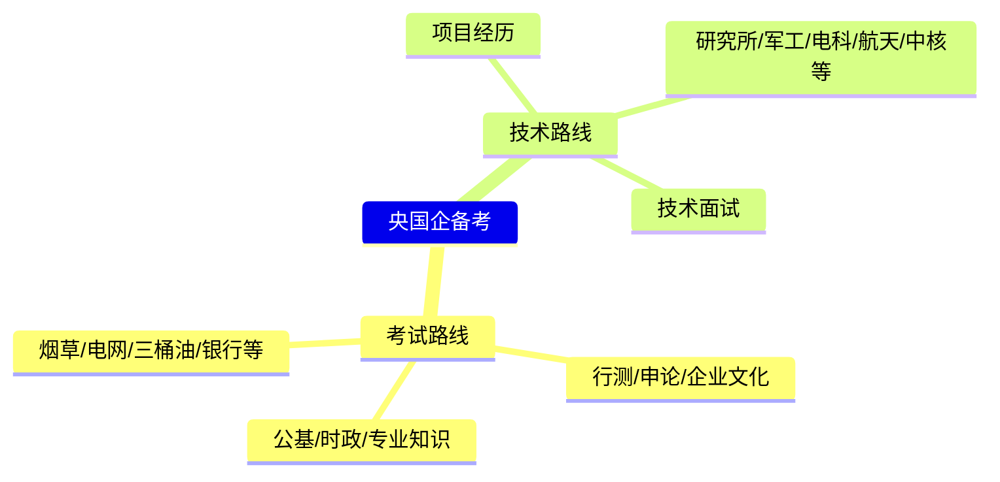
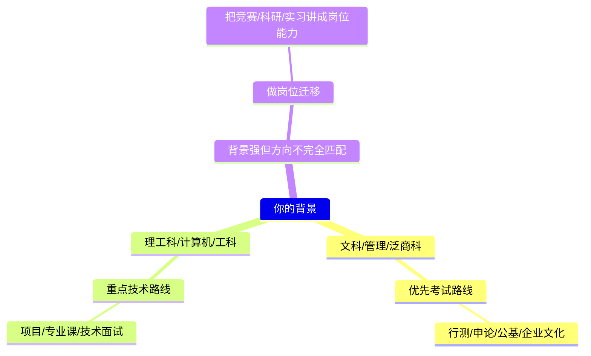

# 1.我能帮到你什么——一个不光教你刷行测央国企知识库

秋招有一个坑，踩的人特别多。

你每天刷行测、背企业文化、看时政、整理申论模板，觉得自己很认真在准备央国企。市面上大部分央国企备考课也确实就这么教的：行测、申论、企业文化、时政，再加一点专业知识。

有用，但不够。

烟草、电网、三桶油、国家能源、部分银行和运营商，这套东西比较对路——这些单位考试属性强。可你要投的是头部研究所、军工科研院所、央企科技公司、设计院、智能制造、AI 岗、软件开发岗、嵌入式岗，情况就不一样了。这些岗位不怎么靠"行测刷了多少题"筛人，看的是专业基础、项目经历、技术表达、岗位匹配和面试表现。

结果经常是这样：投了简历、进了面试，发现学了半天的东西根本不考。面试官问的是你的项目，问你为什么选这个研究所，问简历里的竞赛、科研、实习跟这个岗位有什么关系。

到这时候很多人才反应过来——不是没努力，是一开始就把央国企想窄了。

央国企不止考试路线。技术岗、研究所、设计院、军工单位、央企科技公司、地方国企项目岗、银行金融科技岗、运营商研发岗，都在央国企体系里。用一种方法准备所有单位，很容易出问题：该考试的单位没系统准备，该看项目的单位又讲不清技术。

这事得先讲清楚，它是整个知识库的起点。

## 先看一个真实案例

前阵子有位背景很强的同学，投了中国电科旗下某研究所的 AI 岗。面试前她妈妈来找我：这个岗位到底怎么准备？

JD 写得很清楚，面向计算机、人工智能、算法、数据处理方向。这位同学不是计算机也不是 AI 专业的，但学校背景好，竞赛经历非常亮眼，简历筛进来不意外。

问题是简历过了之后怎么办。这岗位会不会问 AI？问不问项目？问不问编程和科研？问到技术问题，一个非科班的同学怎么把自己的经历讲明白？这些才是真正的备考重点。

但一提央国企，很多人的条件反射还是：要刷行测吧？要学申论吧？要背企业文化吧？

这套思路不算错，但只适合一部分单位和岗位。这位同学能考上顶校、能拿高质量竞赛奖，学习能力不用怀疑。问题不是让她花几十个小时再过一遍行测课，而是帮她判断：这个岗位到底考什么、她的经历怎么往这个岗位上迁移、项目怎么讲、技术短板怎么补、面试官会追什么问题。

岗位不考行测，甚至没有传统笔试，你还花大把时间刷行测学申论——这不叫勤奋，叫浪费。央国企备考最怕的从来不是不努力，而是用一套打法打所有单位。

## 所以，这个知识库到底解决什么

我不是来再给你塞一堆资料的。现在最不缺资料，缺的是判断。

先判断自己适合哪条路线，再决定学什么；先判断目标单位考什么，再决定时间怎么分；先判断岗位要什么，再决定简历和面试怎么说。

很多同学不是学不会行测，不是写不了申论，也不是做不来项目——缺的是路线感。

比如你到底该主攻考试类央国企，还是把技术岗当主线？你这个专业适合投哪些集团、哪些研究所、哪些二三级公司？要花大量时间刷行测，还是先把项目和简历补起来？已经进面了，面试官更可能问综合题还是专业题？拿到 offer 了，该看单位层级、岗位、城市还是待遇结构？

这个知识库想帮你的就是这些。

不是让你更努力，是让你往对的方向用力。

你现在如果是下面几种状态之一，这个知识库会比较适合你：想进央国企但不清楚该走考试岗、技术岗还是银行金融类；一直在刷行测申论，心里也不确定这些够不够覆盖你的目标单位；理工科出身，有项目、竞赛、实习或科研经历，但不知道怎么把这些讲成央国企面试官能听懂的东西；投了大量单位，简历反馈一般，开始怀疑方向是不是选错了；已经拿到笔试、面试或 offer，不确定下一步怎么准备、怎么判断、怎么选。

如果你只是想要一个"所有人照着背"的模板，这里可能不太舒服。我不会说所有单位都一样，也不会说刷完某套资料就能搞定央国企秋招。央国企求职最麻烦的地方，就是不一样。

## 央国企准备，大体分两条主线

熟悉我的同学知道，我一直不建议无脑刷行测申论。不是没用，是对不同的人优先级不一样。央国企准备应该根据专业背景、学校层次、目标地区、目标单位、岗位类型和秋招时间来定，而不是看别人刷什么你就刷什么。

我一般分两条主线：考试路线和技术路线。

## 第一条：考试路线

大多数同学最熟悉这条路。

这类单位笔试流程通常很清楚：行测、企业文化、时政、公基、专业知识，有些还会考申论、材料写作或英语。典型目标包括三桶油、国家电网、南方电网、国家能源集团、国家管网、部分银行、部分烟草、三大运营商，还有一些考试组织比较规范的央企和省属国企。

走考试路线不能靠临场发挥。行测要练速度，企业文化要背重点，时政要抓高频，专业知识看岗位，申论和材料写作也得有基本结构。尤其烟草、电网、能源、银行这些竞争激烈的单位，笔试不过，简历再好也没用。

但现实是秋招只有几个月，不可能把公务员、选调、事业单位、烟草、电网、银行、三桶油每一套资料都完整学一遍。更合理的是找共性。

行测、公基、时政、企业文化、专业知识，这些东西在不同考试里反复出现。要做的不是给每个单位重新学一套，而是搭一个通用底座，再按目标单位加内容：电网加电力和企业文化，银行加金融常识和英语，能源类加行业知识，烟草盯当地公告和写作题型。

考试路线的核心不是刷题，是把有限时间投到最高频、最可迁移、最容易提分的模块上。

## 第二条：技术路线

这条路线很多同学容易忽略，但对理工科——尤其是计算机、电子信息、自动化、通信、机械、电气、材料、能源、控制、人工智能专业——非常重要。

技术路线覆盖的单位包括中国电科、中国兵器、中国船舶、航天科工、航天科技、中航工业、中核工业、中国五矿、中国电建、中国能建，以及大量研究所、设计院、信息化公司、智能制造单位、央企二三级科技子公司。

这类岗位不一定有标准化笔试。有的有简单笔试，有的更看简历，有的直接进专业面或综合面。面试里真正决定结果的还是项目、论文、竞赛、实习、课程基础、技术表达和岗位匹配度。

拿计算机来说，央国企里的技术岗也不少：Java 后端、前端、嵌入式、网络安全、数据分析、图形图像、AI 算法、工业软件、信息化系统、运维开发、项目管理。

这些岗位的准备方法和考试路线完全不同。简历怎么写，项目怎么包装，技术八股怎么准备，面试官会追问哪些细节，央国企技术岗和互联网大厂技术岗有什么差别——都得搞清楚。央国企技术岗不至于像大厂那样高强度考算法和系统设计，但它一样看你能不能把项目讲明白，能不能解释技术选择，能不能体现岗位相关性。

理工科同学如果只把时间花在行测、申论和企业文化上，会错过大把技术岗机会。这是我最想提醒的。

## 不同背景，准备重点完全不一样

偏文科、管理、财经、法学、行政类专业的同学，走考试路线没问题。你们可选的岗位里，综合管理、党建宣传、人力资源、财务金融、运营管理、行政综合这类比较多，很多单位也确实用行测、公基、申论、企业文化来筛人。

但理工科同学——尤其是计算机、电子信息、自动化、通信、机械、电气——不能只盯考试路线。可以投电网、能源、运营商、银行科技岗，可以准备统一笔试，但更应该把技术路线纳入主线：研究所、军工集团、央企科技公司、设计院、信息化岗、智能制造岗，都是很好的机会。

还有一种更特殊的情况：背景很强，但专业和岗位不太对口。前面那个案例就是，本硕背景和竞赛经历都好，投的是 AI 岗。这类同学不需要从头学一套大而全的课程，需要的是岗位迁移——把已有经历拆成这个岗位能听懂的能力，把竞赛、科研、数据处理、数学建模、论文训练转化成 AI 岗关心的东西：逻辑能力、建模能力、工程理解、学习能力。

这种判断，才是央国企备考里最值钱的东西。

## 我能帮到你什么

本科、研究生，基本学习能力不用怀疑。真正的问题不是"学不学得会"，是你不知道学什么。

不知道集团考不考笔试，不知道岗位看行测还是看项目，不知道专业适合投哪些单位，不知道简历为什么总没反馈，不知道面试官问项目到底想听什么，不知道拿了 offer 后该怎么判断值不值。

这个知识库想帮你解决的，就是这一层。

它把央国企求职拆成几条路线：

-   [上岸攻略总览](https://www.hxsay.com/%E4%B8%8A%E5%B2%B8%E6%94%BB%E7%95%A5%E6%80%BB%E8%A7%88)：不同单位、不同集团、不同岗位到底怎么准备

-   [央国企笔试知识库总览](https://www.hxsay.com/%E5%A4%AE%E5%9B%BD%E4%BC%81%E7%AC%94%E8%AF%95%E7%9F%A5%E8%AF%86%E5%BA%93%E6%80%BB%E8%A7%88)：行测、企业文化、专业课、公基、申论和笔试真题

-   [面试总览](https://www.hxsay.com/%E6%B5%A3%E7%86%8A%E9%9D%A2%E8%AF%95%E6%80%BB%E8%A7%88)：结构化面、半结构化面、无领导小组、技术面和项目表达

-   [技术路线总览](https://www.hxsay.com/%E6%8A%80%E6%9C%AF%E8%B7%AF%E7%BA%BF%E6%80%BB%E8%A7%88)：理工科同学的 Java、C++、AI、项目包装和技术岗面试

-   [陪跑总览](https://www.hxsay.com/%E6%B5%A3%E7%86%8A%E9%99%AA%E8%B7%91%E6%80%BB%E8%A7%88)：真实陪跑案例、offer 证明和同学反馈，看看不同背景的人是怎么上岸的

我希望它是一张路线图，不是一个"越多越好"的资料包。先知道往哪走，再决定学什么。

## 这本手册到底在做什么

这篇文章是《央国企手册》的开篇。

它不是要说行测不用学，也不是说技术岗一定优于考试岗——这两种理解都不对。

结论很简单：央国企备考，先分路线，再谈努力。

走考试路线，就认真准备行测、申论、公基、企业文化、专业知识和行业知识。走技术路线，就认真准备项目、技术八股、专业面试、简历表达和岗位迁移。不同背景、不同目标、不同时间节点，策略不一样。

别看着别人刷什么就刷什么，也别看见"央国企"三个字就默认只有行测申论。

如果这个知识库能让你少走点弯路，少浪费点时间，多看到几条本来适合你的机会——那就够了
