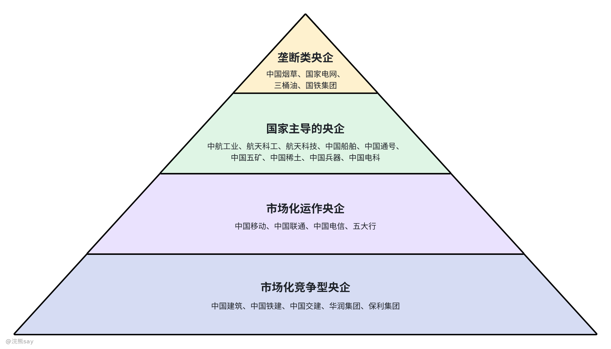

# 1.央国企的四个梯队

# 垄断央企——不裁员

垄断类央企是指那些在特定行业内拥有独家经营权或占据绝对主导地位的企业。这类企业通常涉及国计民生的关键领域，如能源供应、交通基础设施等。例如中国烟草、国家电网、“三桶油”（中石油、中石化、中海油）、国铁集团等。

由于这些企业的业务性质，它们对保障国家经济安全和社会稳定具有重要作用。这些企业往往受到严格的政府监管，以确保其服务质量和价格的合理性。一般垄断央企稳定性极强、基本没有裁员失业的可能性发生，但是对于人员的进入把控也非常严格，通常有全国统一组织的考试，也是我常说的考试类央企。
| 企业名称 | 官网地址 |
| --- | --- |
| 中国石油天然气集团有限公司 | https://www.cnpc.com.cn/cnpc/index.shtml |
| 中国石油化工集团有限公司 | http://www.sinopecgroup.com/group/ |
| 中国海洋石油集团有限公司 | https://www.cnooc.com.cn/ |
| 国家电网有限公司 | http://www.sgcc.com.cn/ |
| 中国南方电网有限责任公司 | https://www.csg.cn/ |
| 中国烟草总公司 | http://www.tobacco.gov.cn/ |
| 中粮集团有限公司 | https://www.cofco.com/cn/ |

# 国家主导央企——不裁员

国家主导的央企，这类企业主要从事国防科技工业、航空航天、船舶制造等战略性行业。它们承载着国家安全和发展的重要使命，如中航工业、航天科工、航天科技、中国船舶、中国通号、中国五矿、中国稀土、中国兵器、中国电科等。
| 企业名称 | 官网地址 |
| --- | --- |
| 中国核工业集团有限公司 | https://www.cnnc.com.cn/ |
| 中国航天科技集团有限公司 | https://www.spacechina.com/n25/index.html |
| 中国航天科工集团有限公司 | http://www.casic.com.cn/ |
| 中国航空工业集团有限公司 | https://www.avic.com.cn/ |
| 中国船舶集团有限公司 | http://www.cssc.net.cn/ |
| 中国兵器工业集团有限公司 | http://www.norincogroup.com.cn/ |
| 中国兵器装备集团有限公司 | https://www.csgc.com.cn/ |
| 中国电子科技集团有限公司 | https://www.cetc.com.cn/ |
| 中国航空发动机集团有限公司 | https://www.aecc.cn/ |
| 中国融通资产管理集团有限公司 | https://www.crtamg.com.cn/ |
| 中国航空集团有限公司 | http://www.airchinagroup.com/cnah/ |
| 中国东方航空集团有限公司 | https://mgt.ceair.com/mapp/Home |
| 中国南方航空集团有限公司 | https://www.csair.com/cn/?ref=www.007la.com |
| 中国广核集团有限公司 | http://www.cgnpc.com.cn/ |
| 中国五矿集团有限公司 | http://www.minmetals.com.cn/ |
| 中国电力建设集团有限公司 | https://www.powerchina.cn/ |
| 中国能源建设集团有限公司 | http://www.ceec.net.cn/ |

这些企业不仅需要满足商业目标，还需完成国家赋予的战略任务，比如研发先进武器装备、开发前沿技术等，它们的研发投入大，技术水平高，在国际上也代表着中国的技术实力。这类央企虽然在整体的盈利和垄断性上比不过垄断央企，但是由于这类央企所涉及到的基本是国家的战略性行业，因此整体的稳定性也非常好。

# 市场化运作央企——很少裁员

市场化运作央企，这指的是那些虽然由国家控股但已基本实现市场化运作的企业。中国移动、中国联通、中国电信以及五大国有商业银行（工商银行、农业银行、中国银行、建设银行、交通银行）属于这一类。这些企业在各自的行业中扮演着重要角色，通过市场竞争来提升效率和服务质量。
| 企业名称 | 官网地址 |
| --- | --- |
| 中国电信集团有限公司 | http://www.chinatelecom.com.cn/ |
| 中国联合网络通信集团有限公司 | https://www.chinaunicom.com.cn |
| 中国移动通信集团有限公司 | https://10086.cn |
| 中国工商银行股份有限公司 | https://www.icbc-ltd.com/ |
| 中国农业银行股份有限公司 | https://www.abchina.com/cn/ |
| 中国银行股份有限公司 | https://www.boc.cn/ |
| 中国建设银行股份有限公司 | http://group2.ccb.com/cn/group/index.html |
| 交通银行股份有限公司 | https://www.bankcomm.com/BankCommSite/default.shtml |
| 中国农业发展银行 | https://www.adbc.com.cn/ |
| 中国进出口银行 | http://www.eximbank.gov.cn/ |
| 国家开发银行 | https://www.cdb.com.cn/ |
| 中国出口信用保险公司 | https://www.sinosure.com.cn/ |
| 中国人民保险集团股份有限公司 | https://www.picc.com/ |
| 中国人寿保险（集团）公司 | https://www.chinalife.com.cn/chinalife/index/ |
| 中国太平保险集团有限责任公司 | https://www.cntaiping.com/ |
| 中国中信集团有限公司 | https://www.group.citic/ |
| 中国光大集团股份公司 | https://www.ebchina.com/ |
| 中国投资有限责任公司 | https://www.china-inv.cn/ |
| 中国华融资产管理股份有限公司 | https://www.chamc.com.cn/ |
| 中国长城资产管理股份有限公司 | https://www.gwamcc.com/ |
| 中国东方资产管理股份有限公司 | http://www.coamc.com.cn/ |
| 中国信达资产管理股份有限公司 | https://www.cinda.com.cn/home/pc/cn/xdjt/index.shtml |
| 中央国债登记结算有限责任公司 | http://www.chinaclear.cn/ |
| 中国农业再保险股份有限公司 | https://www.china-agrore.com/ |
| 中国政企合作投资基金股份有限公司 | https://www.cpppf.org/index.html |
| 国家融资担保基金有限责任公司 | https://www.gjrdjj.com/ |
| 中国银河金融控股有限责任公司 | https://www.china-galaxy.com.cn/ |
| 中国建银投资有限责任公司 | http://www.jic.cn/ |
| 中国再保险（集团）股份有限公司 | https://www.chinare.com.cn/ |

尽管它们仍然承担一定的社会责任，但主要依靠市场机制来指导其运营和发展策略，主要目标还是以盈利和给国家纳税为主，但是由于引入了市场化的运作机制，因此其稳定性相对一般。

# 市场化竞争央企——可能裁员

市场化竞争型央企，这是指那些完全置身于市场竞争环境中的央企。中国建筑、中国铁建、中国交建、华润集团、保利集团等都是此类企业。它们不仅要面对国内同行的竞争，还要参与国际市场角逐。
| 企业名称 | 官网地址 |
| --- | --- |
| 中国建筑集团有限公司 | https://www.cscec.com/zgjz_new/index.html |
| 中国铁道建筑集团有限公司 | https://www.crcc.cn/ |
| 中国交通建设集团有限公司 | https://www.ccccltd.cn/ |
| 华润（集团）有限公司 | https://www.crc.com.hk/ |
| 保利集团有限公司 | https://www.poly.com.cn/ |
| 中国中车集团有限公司 | https://www.crrcgc.cc/ |
| 中国铁路工程集团有限公司 | http://www.crecg.com/ |
| 中国中化控股有限责任公司 | https://www.sinochem.com/ |
| 中国铝业集团有限公司 | https://www.chinalco.com.cn/ |
| 中国宝武钢铁集团有限公司 | https://www.baowugroup.com/home |
| 中国远洋海运集团有限公司 | https://www.coscoshipping.com/ |
| 中国商用飞机有限责任公司 | http://www.comac.cc/ |
| 中国节能环保集团有限公司 | https://www.cecep.cn/ |
| 中国第一汽车集团有限公司 | https://www.faw.com.cn/ |
| 东风汽车集团有限公司 | https://www.dfmc.com.cn/ |
| 中国一重集团有限公司 | https://www.cfhi.com/ |
| 中国机械工业集团有限公司 | https://www.sinomach.com.cn/ |
| 哈尔滨电气集团有限公司 | https://www.harbin-electric.com/ |
| 中国东方电气集团有限公司 | https://www.dongfang.com/ |
| 鞍钢集团有限公司 | http://www.ansteel.cn/ |
| 中国矿产资源集团有限公司 | https://campus.51job.com/p/cmr/ |
| 中国黄金集团有限公司 | https://www.chinagoldgroup.com/ |
| 中国安能建设集团有限公司 | https://www.china-an.cn/&wd=&eqid=977f49930003ea5e0000000364819717 |
| 中国电气装备集团有限公司 | https://www.cee-group.cn/ |
| 中国物流集团有限公司 | https://www.chinalogisticsgroup.com.cn/ |
| 中国国新控股有限责任公司 | https://www.crhc.cn/index.htm |
| 中国检验认证（集团）有限公司 | https://www.ccic.com/ |
| 中国冶金地质总局 | https://www.cmgb.com.cn/ |
| 中国煤炭地质总局 | https://www.ccgc.cn/ |
| 新兴际华集团有限公司 | http://www.xxcig.com/ |
| 中国民航信息集团有限公司 | https://www.caac.gov.cn/INDEX/ |
| 中国航空油料集团有限公司 | https://www.cnaf.com/ |
| 中国航空器材集团有限公司 | https://www.casc.com.cn/cas/ |

这类企业更加注重成本控制、技术创新和客户服务，以提高竞争力和市场份额，这类央企充分、完全的参与了市场竞争，企业效益随市场的波动和影响较大，稳定性不行，可能出现裁员、失业的情况发生。
