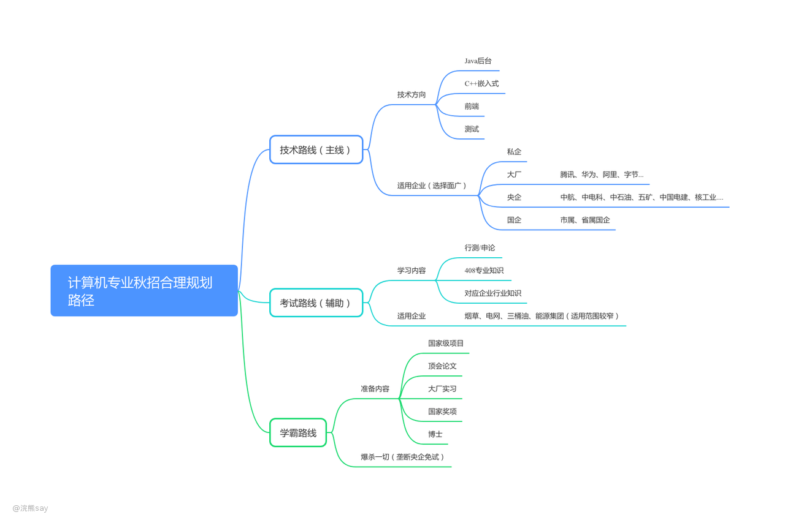

# 2.央国企考试路线&技术路线

**央国企考试路线&技术路线**

# 央国企考试路线&技术路线

## 技术路线

-   中国五矿：[https://wecruit.hotjob.cn/SU62f37858bef57c29ead8adab/pb/custom.html?parentKey=section\_hide\_1660130532845&pageType=customize\_section\_hide\_1660130532845#/](https://wecruit.hotjob.cn/SU62f37858bef57c29ead8adab/pb/custom.html?parentKey=section_hide_1660130532845&pageType=customize_section_hide_1660130532845#/)
-   中国建筑：[https://recruit.cscec.com/recruit#/index\_nav?contract\_unit=31997577&company\_id=1873](https://recruit.cscec.com/recruit#/index_nav?contract_unit=31997577&company_id=1873)
-   中国电建：[https://zhaopin.powerchina.cn/index](https://zhaopin.powerchina.cn/index)
-   中国核工业集团：[https://cnnc.zhiye.com/](https://cnnc.zhiye.com/)
-   中国兵器装备：[https://www.csgc.com.cn/](https://www.csgc.com.cn/)
-   中国兵器工业：[http://www.norincogroup.com.cn/](http://www.norincogroup.com.cn/)
-   航天科技：[https://www.spacechina.com/n25/index.html](https://www.spacechina.com/n25/index.html)
-   航天科工：[http://www.casic.com.cn/](http://www.casic.com.cn/)
-   中航工业：[https://www.avic.com.cn/](https://www.avic.com.cn/)
-   中国电科：[https://www.cetc.com.cn/](https://www.cetc.com.cn/)
-   中国船舶：[http://www.cssc.net.cn/](http://www.cssc.net.cn/)
-   中国物理工程研究院：[https://zpxx.caep.cn/#/index](https://zpxx.caep.cn/#/index)

。。。

以上这些央企实际上都会招聘一些技术相关的岗位，技术路线其实是投入产出比最高的路线，因为岗位需求无论是国企还是互联网需求都很大。

即使大家最终的目标是想去一个大央企、大国企，准备技术路线也是没有错的，因为现在大量的传统央企都在做智能化升级，岗位甚至比互联网大厂还多。

所以即使你是想去央国企，也不要捡了芝麻丢了西瓜，把大量的时间精力投入到行测、申论、408这种适用范围极其窄的路线上。

## 考试路线

-   国家电网：[https://zhaopin.sgcc.com.cn/sgcchr/static/unitPart.html?bullet\_id=1d05b1f3d7bd437a90a6e1d14ba626d1](https://zhaopin.sgcc.com.cn/sgcchr/static/unitPart.html?bullet_id=1d05b1f3d7bd437a90a6e1d14ba626d1)
-   中国烟草：[http://www.tobacco.gov.cn/gjyc/zpxx/list.shtml](http://www.tobacco.gov.cn/gjyc/zpxx/list.shtml)
-   中国石油（网站只有秋招和春招的时候才能打开）：[https://zhaopin.cnpc.com.cn/index.html](https://zhaopin.cnpc.com.cn/index.html)
-   中国石化：[http://job.sinopec.com/#/index](http://job.sinopec.com/#/index)
-   中国海油：[https://cnooc.iguopin.com/](https://cnooc.iguopin.com/)
-   中国中铁：[https://rczp.china-railway.com.cn/](https://rczp.china-railway.com.cn/)
-   中国铁建：[https://wecruit.hotjob.cn/SU6125b2ce0dcad4106f124ff0/pb/school.html](https://wecruit.hotjob.cn/SU6125b2ce0dcad4106f124ff0/pb/school.html)
-   国家能源集团：[https://zhaopin.chnenergy.com.cn/planSerch?kinds=3](https://zhaopin.chnenergy.com.cn/planSerch?kinds=3)
-   国家管网集团：[https://wecruit.hotjob.cn/SU617b87702f9d247cb97cc6b7/pb/school.html](https://wecruit.hotjob.cn/SU617b87702f9d247cb97cc6b7/pb/school.html)
-   中粮集团：[https://cofco-campus.zhaopin.com/](https://cofco-campus.zhaopin.com/)
-   中国农业银行：[https://career.abchina.com.cn/build/index.html#/](https://career.abchina.com.cn/build/index.html#/)
-   中国工商银行：[https://job.icbc.com.cn/pc/index.html](https://job.icbc.com.cn/pc/index.html)
-   中国建设银行：[https://job3.ccb.com/cn/job/index.html](https://job3.ccb.com/cn/job/index.html)
-   中国银行：[https://www.boc.cn/aboutboc/bi4/](https://www.boc.cn/aboutboc/bi4/)
-   中国邮政储蓄银行：[https://www.psbc.com/cn/gyyc/rczp/xyzp/](https://www.psbc.com/cn/gyyc/rczp/xyzp/)
-   中国银行：[https://www.boc.cn/aboutboc/bi4/](https://www.boc.cn/aboutboc/bi4/)

现在大多数培训机构，对于计算机专业培训的都是考试路线，他们培训这个也没错，但是你光刷行测、申论和408秋招风险很大。

这个路线适用的企业一个手都能数完，烟草、电网、中石油、国家能投等，而且这几个央企报录比至少都是几千比1的级别，all in考试路线风险极大。

但是，如果你一心就想上岸，同时考公务员、事业单位啥的，那么all in考试路线也没啥关系，但是真心不建议all in，也不建议报班。

行测、申论路线自己网上看看免费的视频，刷几套题作为辅助路线的话，完全够了，本来对于大多数人来说也都是陪跑。

## 学霸路线

不谈！学霸随意吧～

## The END

建议大家秋招的时候以技术路线为主，适用范围广：私企、互联、央企、国企都有岗位，我知道现在计算机写代码的岗位卷，但是架不住确实招聘的企业多大，无论什么时候技术路线都应该是主路线。

考试路线为辅，虽然说计算机专业能报考的体制内岗位和垄断央企的岗位也很多，但是始终是就业面少太多了，不建议all in。如果all in这个的话，要是都考失败了，还会面临真的找不到工作的窘境。
