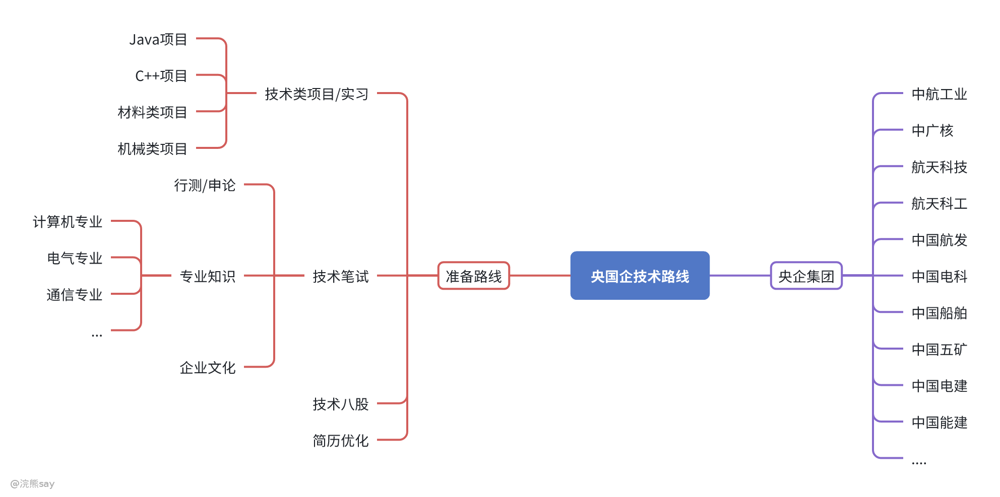
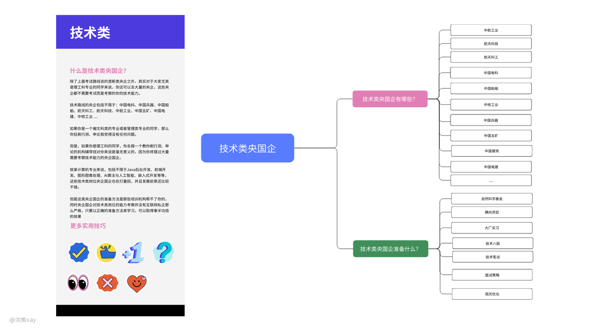
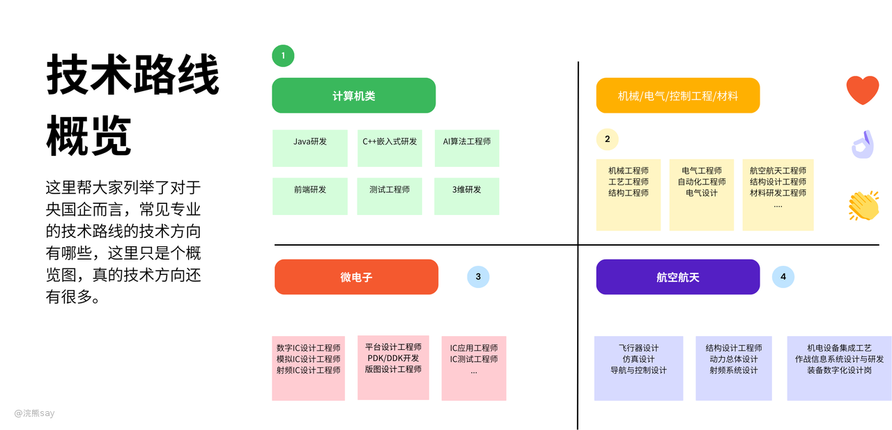
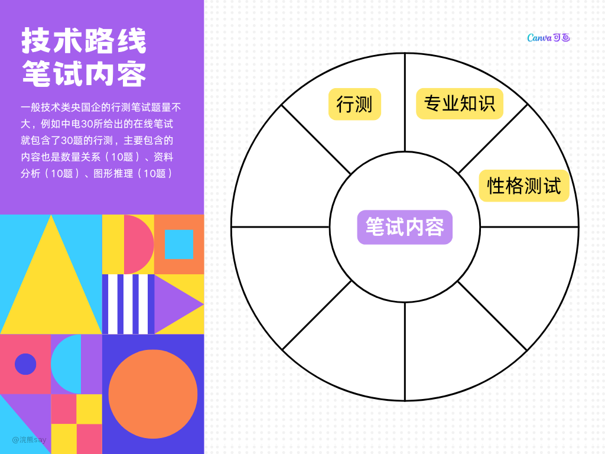
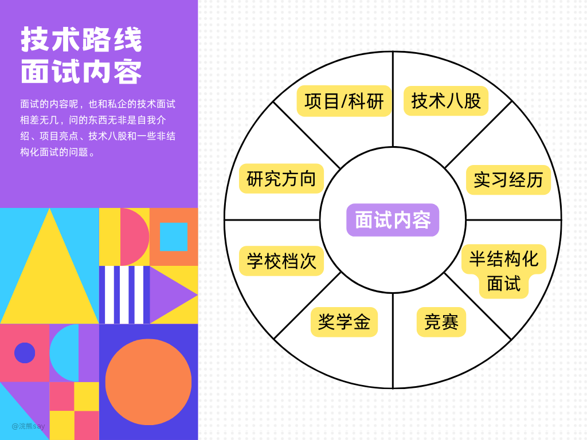
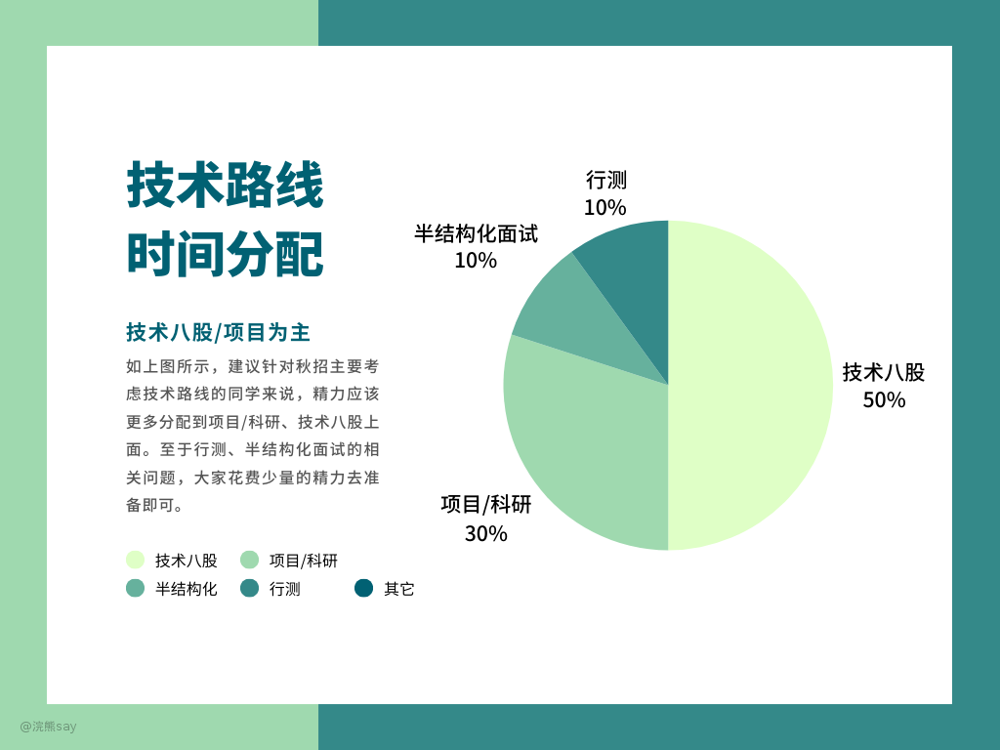

# 央国企技术路线概述

## 什么是技术路线？

如上图所示，技术路线能去的央国企很多，这些央企大多数是资源类型、军工类的央企，之所以招聘这么多技术岗位是，因为公司所涉及到的业务就是需要大量的技术人员来进行研发。

所以去技术类的央企、国企重点不在于刷综合知识、专业知识，而是和私企一样会问一些技术类的八股题、项目场景题和一些开放性问题。

所以，针对技术路线大家的重点在于技术方向和目标公司的确定，虽然少量技术路线的央企也会有行测的笔试，但是大多数来说只有几十道的题量，并且是在线笔试的，所以难度并不大。

## 技术方向

如图所示，技术路线可以选择方向很多，对于央国企来说还是理工科专业的招聘量会大一些，偏文科的技术岗会很少。像电气、机械、计算机等专业几乎是所有国企都有需求的，而航空航天类的专业主要是集中在一些军工、航天类的央企较多。大家秋招如果考虑走技术路线的话，针对技术方向一定要提前选好。

## 笔试准备概述（非重点）

首先，给大家强调一个最重要的点，针对技术类央企来说，80%是没有笔试的，直接邀请你去面试就可以了。

但是少数央企还是会有一个线上的笔试，笔试的内容一般都是行测、专业知识，像银行可能会有些金融行业知识。

具体而言，可能的笔试内容如下：

**（1）行测**

一般技术类央国企的行测笔试题量不大，例如中电30所给出的在线笔试就包含了30题的行测，主要包含的内容也是数量关系（10题）、资料分析（10题）、图形推理（10题），应此行测不宜花费过多时间。

**（2）专业知识**

考察专业知识的央国企相对较多，例如：中电29所会有线上笔试，考试内容则完全为专业知识相关内容；而银行的软开岗，如果你是走的Java后台方向的话，则是一份关于Java后台的笔试题。

**（3）性格测试**

性格测试几乎所有央企、企业招聘都有，这个没啥好说的。

目前技术类的央国企笔试的内容就上述3个方面，由于大家秋招时准备央国企肯定是广撒网的方式去准备，建议还是需要刷一定量的行测、专业知识有个最基本的准备即可。

再次说明，对于技术类央国企大多数是没有笔试的，所以这部分不作为重点去准备！具体到每个央企的笔试内容，大家可以参考星球的上岸指南专栏中查看。

## 面试准备概述

技术类央国企的面试一般都是技术类问答面试，和大家去面试私企、互联网的形式一样。一般都是几个人一起面你一个人，针对你的简历、项目进行提问，你回答之后还会进行追问。

面试的内容呢，也和私企的技术面试相差无几，问的东西无非是自我介绍、项目亮点、技术八股和一些非结构化面试的问题。

具体的技术类央国企需要准备的内容包含以下4个方面：

**（1）项目/科研**

这里项目和科研写在一起是因为，国企和私企不同不会要求一个应届生非常精通一门技术栈，当然精通是最好。

所以，对于央国企来说你用实验室的横向项目、自然科学基金，甚至是你自己做的玩具项目去面试都是可以的。

科研的话，面试官会对你研究的背景很感兴趣，同时如果有好的论文的话，无论面试什么岗位都是有加分的，因为国企更看重人的综合能力。

**（2）实习**

大家都知道国企技术不咋滴，所以如果你提前有大厂或者相关岗位的实习的话，也是非常加分的，在校生一定要抓住机会去实习，尤其是大厂。

**（3）技术八股（非常重要！）**

技术八股绝对是面试问问题的主力，无论是央企还是私企，毕竟技术岗是招人进来干活儿的，所以大家都会喜欢技术方面懂得多的人。

但是大家准备国企的技术面试就不用像私企、互联网那么焦虑了，很多国企面试官技术能力也不咋样，问的问题都是很常见的一些八股，大家只要正常准备就行。

**（4）半结构化面试问题**

央企非常看重候选人的稳定性，所以还会问到一些半结构化面试相关的问题，例如：为什么选择我们公司？对我们公司的了解有多少？你个人的优点缺点是什么？之类的问题。

## 路线规划

如上图所示，建议针对秋招主要考虑技术路线的同学来说，精力应该更多分配到项目/科研、技术八股上面。至于行测、半结构化面试的相关问题，大家花费少量的精力去准备即可。

因为半结构化面试相关的问题过于简单，行测的考试题量过于的少，并且大量央企是不考察的，所以应当把更多精力集中到技术方向本身。

其实最好的技术路线学习方法是从研一、大一就开始选一门技术路线进行积累，到毕业的时候你已经超过身边99%的同学，这样不仅仅面试优势大，自己创业也并非不可能。
