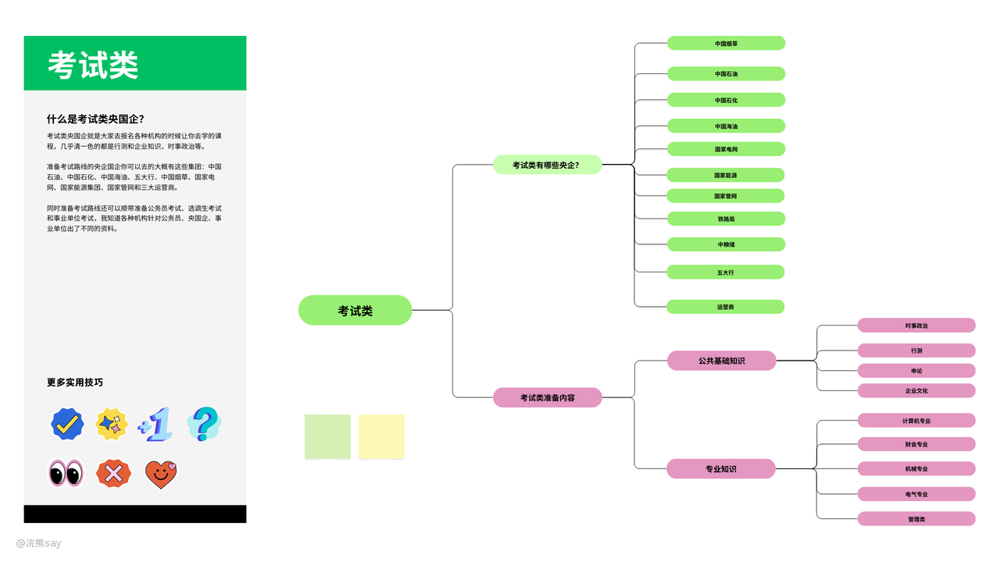
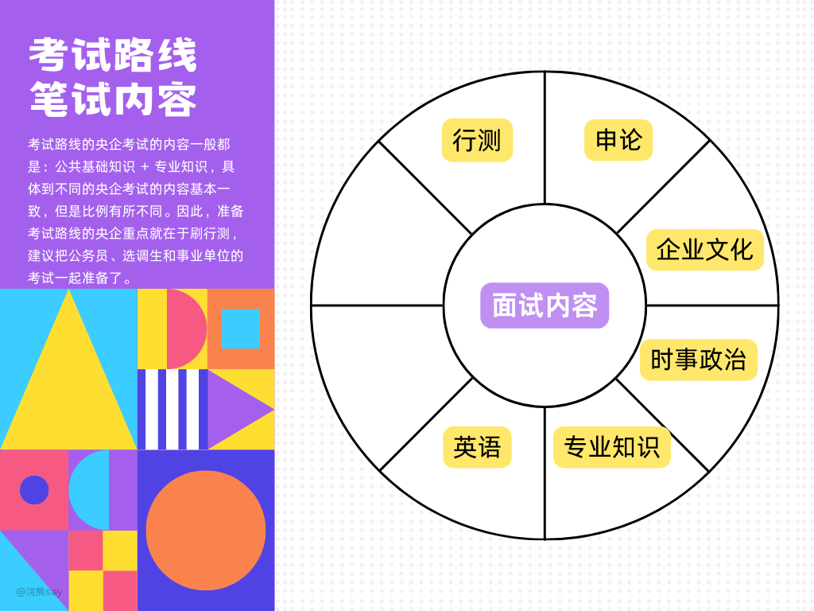
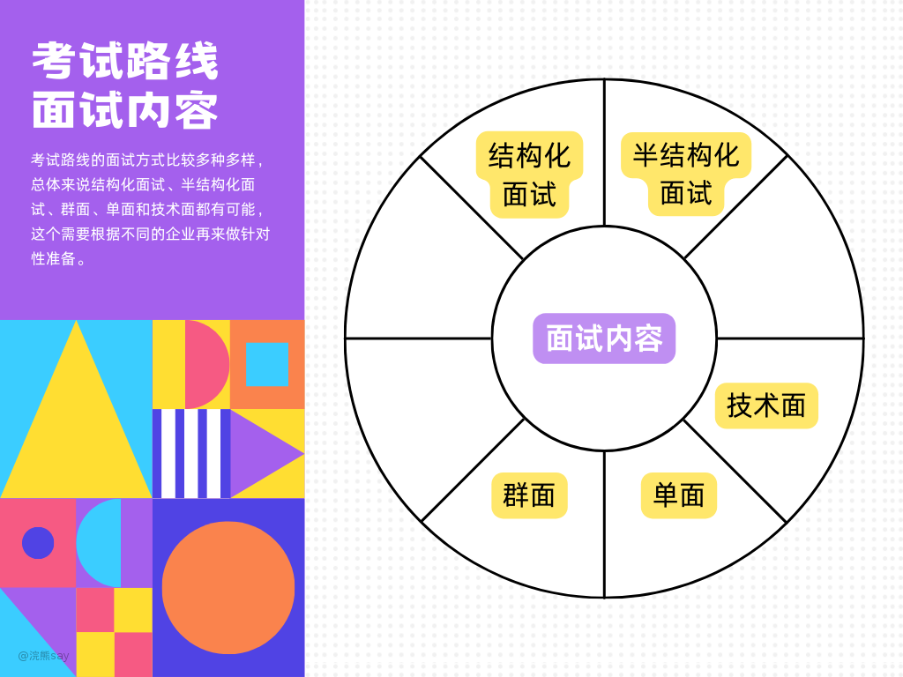
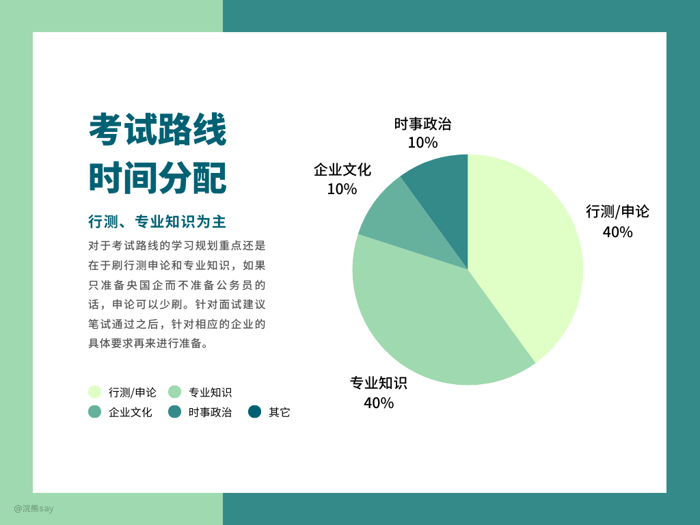

# 央国企考试路线概述

 ## 什么是考试路线？

考试路线就是招聘有统一的全国性或者各省组织的招聘考试的央企，这些央企一般是垄断类央企居多，对技术要求不高。

考试路线的央企考试的内容一般都是：公共基础知识 + 专业知识，具体到不同的央企考试的内容基本一致，但是比例有所不同。

因此，准备考试路线的央企重点就在于刷行测，建议把公务员、选调生和事业单位的考试一起准备了。

 ## 笔试内容

（1）行测

国企行测和公务员行测没有太大区别，区别在于不同央国企的行测比例不同，难度都是一样的。

（2）申论

笔试申论的央国企很少，一般比公务员的申论简单很多，就是300字左右的小作文。

（3）专业知识

专业知识是准备的重点，一般和考试专业课类似，具体可以参考不同公司的要求文档，也可以购买相关机构的资料。

（4）时事政治

和公务员考试的时事政治类似，一般题量不大，这个准备可以参考公务员相关的准备资料即可。

（5）企业文化

即该企业的发展历史、行业文化等，例如：烟草会考察烟叶相关的知识，电网会考察电力相关的知识。

（6）英语

考试英语的很少，一般过了6级，无需单独准备。

 ## 面试内容

考试路线的面试方式比较多种多样，总体来说结构化面试、半结构化面试、群面、单面和技术面都有可能，这个需要根据不同的企业再来做针对性准备。

（1）结构化面试

面试问题是公司内部的题库，面试打分有严格的标准，面试期间和面试官没有任何交流，你的面试得分跟面试官的个人喜好无关。

（2）半结构化面试

面试题库是公司内部题库，但是没有严格的打分标准，面试期间面试官会根据感兴趣的点追问，你的得分跟面试官喜好相关。

（3）群面

很多人一起面试，共同解决一个场景问题，面试官会观察你在团队中扮演的角色和表现来进行打分。

（4）单面

多个人面试你一个人，问一个个人经历类、求职意愿类等相对来说非常简单的问题，比较好作答

（5）技术面试

没错，考试类央国企也可能会进行技术面试，例如国家能源集团就问了嵌入式相关的技术问题。

 学习规划

对于考试路线的学习规划重点还是在于刷行测申论和专业知识，如果只准备央国企而不准备公务员的话，申论可以少刷。

最后，这里只给出了笔试的学习规划，针对面试建议笔试通过之后，针对相应的企业的具体要求再来进行准备。
