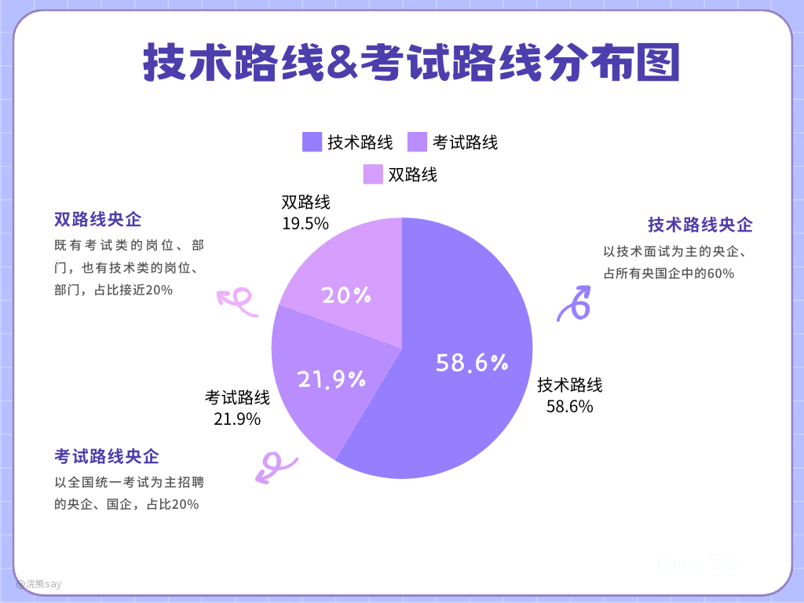

# **考试路线&技术路线央国企分布图**

大家一定听说过师兄、师姐的建议，或者听说过培训班的课程介绍，想要去央企、国企刷行测就可以了，其它啥也不用管。但是今天我要告诉你，刷行测、专业知识能去的央企、国企绝对不是主流。

对于理工科专业的学生来说，你将大量的时间、精力完全投入到行测、专业知识的学习上其实反而会缩小你的选择范围，如下图所示，技术路线的央企占比在所有央企占比当中超过60%，而纯粹考试类央企才20%左右，还有20%的央企是技术路线和考试路线都有招聘的。

所以大家没必要去哼哧哼哧报各种央企、国企的培训班，因为他们只教刷行测、结构化面试、半结构化面试之类的东西，按照这些培训班的路线学习，你大概率只有去卷几百比一、几千比一的考试路线央企了。
