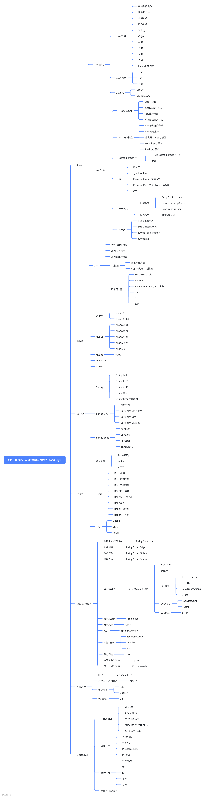
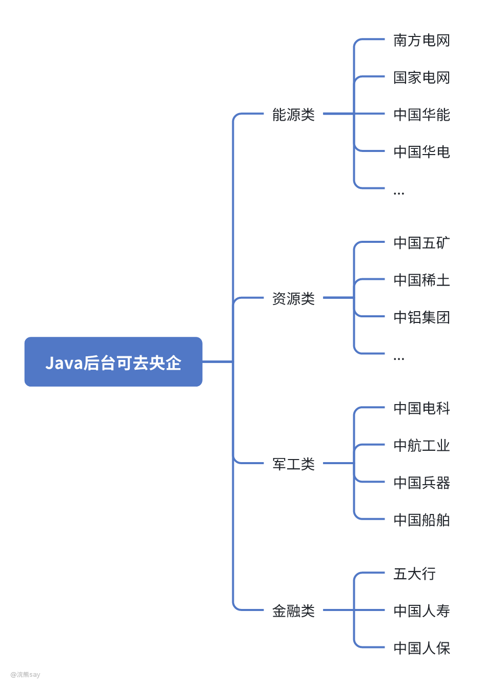

# 央企、研究所Java学习路线图

**学习内容：** Java基础、JVM、Java多线程编程、MySQL、Redis、MyBatis Plus、Spring Boot、分布式/微服务、RocketMQ、OpenFeign、Docker、Git、Maven、计算机基础知识。

**央企集团：** 中国五矿、中国电科、中国兵器、中航工业、铁路局、南方电网、国家电网、中国商飞、中国通号、五大行....太多了，列举不完。

**Java项目：浣熊Java后台项目**

这个路线图不仅仅是现在大型央企、国企研究所Java相关岗位用到的技术栈，也是主流私企、互联网用到的，大家直接先看图，完事之后讲几个问题：

# 央企研究所Java研发主要做什么？

相信大家无论是在网络上，或者是在学校里面，关于Java了解的更多的是去互联网大厂或者一些小私企，对于Java在央国企里面能做什么知之甚少。

实际上，近些年来由于互联网的下行，以前网上传播的什么35岁就被淘汰找不到工作已经变得过于乐观了，现在**很多互联网大厂普通员工，32岁甚至30岁就会被淘汰。**

并且随着AI的广泛使用，现在互联网大厂和私企对程序员的需求是逐年走低的，叠加以前培训班疯狂量产的程序员，这个时候再**去私企、互联网大厂做程序员实际上并不是一个好的选择**。

而众所不周知的是**央企和研究所也会招聘大量的Java开发程序员**，来负责**内部系统、上级央企集团的业务**或者是一些科研项目的开发。例如：

**中国石油、中国五矿、中国稀土**等资源型的央企都在做数字化转型，很多**油田、矿山工厂、冶炼厂**等都需要做物联网平台建设项目，所以Java后台在这些央企多半是做物联网相关的平台开发工作。

**中国建筑、中国电建、中国铁建**等建筑类央企，同样会做数字化转型相关的业务，对于房建、公路和铁路等场景针对性的开发一些物联网的相关平台运用。

**五大行、中国人保、中国人寿**等金融类央企则是开发to C的相关应用，这也是招聘Java程序员比较多的一个方向，开发的内容也是大家平时用到的金融类的app。

当然，大量的央企会有一部分业务是找外包公司来完成的，所以进去只承担项目经理的角色即可，但是也有一部分研发单位是需要自己开发和写代码的，这种一般偏向于社招。

# 央企、研究所Java研发工资真的很低吗？

很多人说到央企、国企的研发，第一印象就是工资很低，实际上虽然工资待遇比不上互联网大厂，但是在二线城市来说好好生活并不成问题，一线城市的央企由于工资太低，确实需要慎重考虑才行。

并且，由于互联网大厂、私企的加班较多，并且稳定性相对较差，因此央企、国企的Java开发时薪相对较高，如果是央企的正式员工的话，职业生涯也会更长，无需担心35岁中年危机的问题。

例如**中国商飞对于校招信息技术岗的应届生工资就可以开到21w的总包**，而南网数字集团的应届生工资也能达到25w左右，虽然比起互联网大厂的头部offer什么50w~60w的总包确实少很多，但是考虑到工作强度和稳定性也是非常值得考虑的。

除此之外，**央企的公积金一般都按照12%的比例缴纳**，同时还会有企业年金、补充医疗保险等，这些东西虽然大厂也有，但是**缴纳15年社保和缴纳30年社保是2个不同的概念**。

# 央企、研究所Java研发的难度怎么样？

由于央企、国企研发的软件一般是内部使用为主，即使是类似于中国五矿研发的矿山管理系统，也是一个矿山、冶炼厂单独一套软件，所以使用的体量不会特别大，甚至某些**央企内部研发的软件只有一个部门几十上百号人使用**。

所以体量决定了央企、研究所里面的**Java研发所涉及到的技术难度不会太大，同时线上压力非常小、加班也非常少**（除非碰到比较变态的领导）。

有的人可能会说，用户量这么少，根本没有技术含量，技术不能成长，我这辈子就废了。实际上这是一种很严重的学生思维，工作几年的人只想着早点儿干完活儿下班，而且想学技术可以去华为OD，为的就是这块儿技术。

实际上，技术再好没有需求场景也并不能给你带来收益，并且现在无论是什么**Java开发、C++开发都不存在特别高深的技术**，都是前人已经做好的方案，并没有太多的创新，即使去大厂也是ppt雕花。

所以，业务简单，工资待遇还可以，稳定性好，早点儿下班儿比什么都强，同时对于技术能力不是很强的同学，央企、研究所更是你的天堂，一般领导对于新人都会给出很长的时间和周期来让你学习。

所以，央企国企的研发岗，综合性价比更高。
