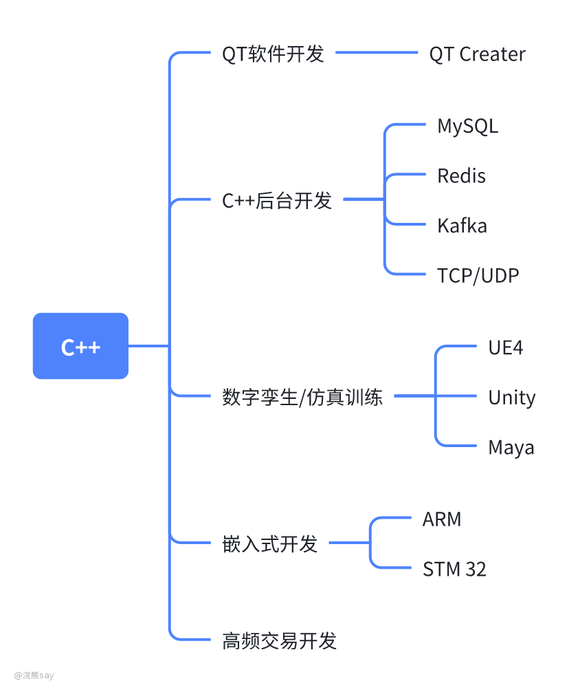
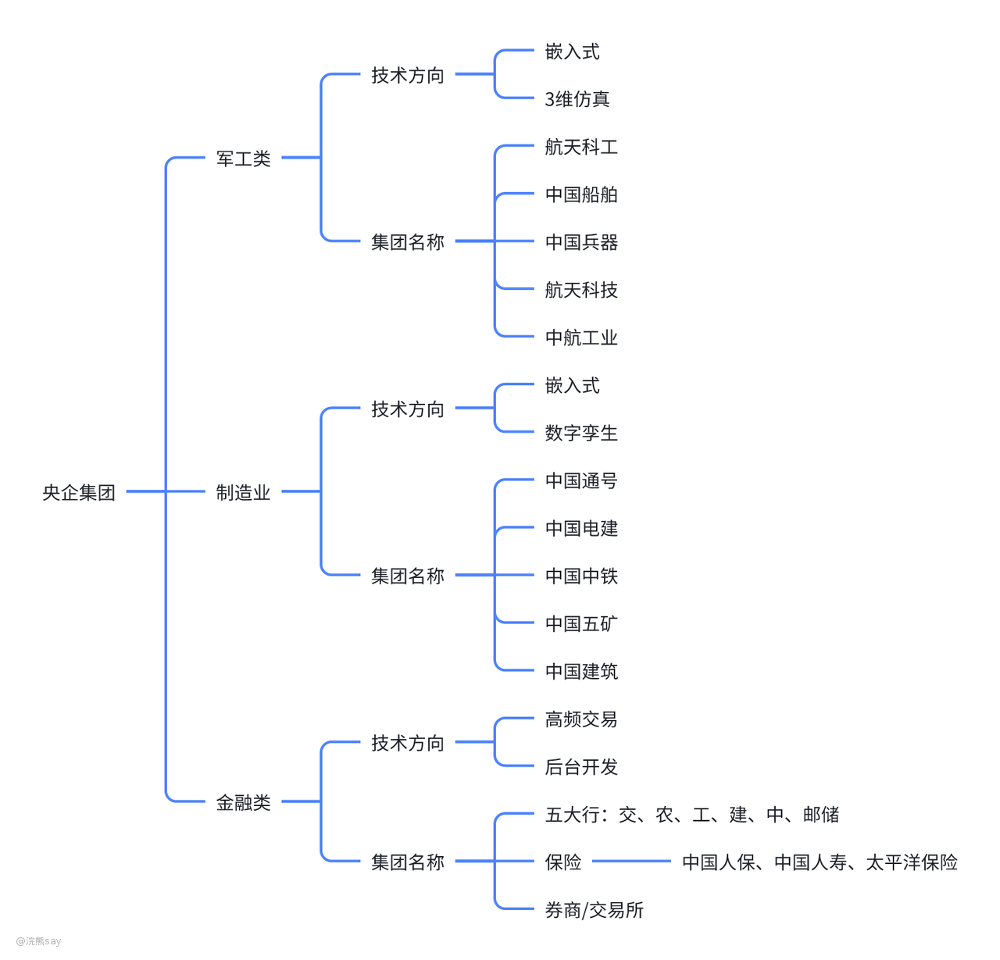

# 7.央国企&研究所C++后台技术路线

C++能不能去央企？这是最近后台问得最多的问题。

UP主本人研究生写了3年C++，然后硕士毕业工作之后转了Java，对于C++还是有一点点情怀在里面的。

所以，这个视频up就跟大家讲一讲C++能去哪些央企，都有哪些岗位。

这个视频很干，希望大家给个一键三连！

# C++在央企都有哪些岗位？

要知道C++能去哪些央企，首先得知道C++在央企能干些啥，有哪些岗位。

打开智联招聘app，输入C++，筛选国企，在这里你就可以看到一大批招聘C++的央企、国企单位。虽然大多数头部央国企没有社招，但是对于技术岗的同学来说呢，社招量相对还是较多的C++技术方向招聘的，可以给大家作为参考。

总的来说，C++开发的一个技术方向在央国企主要有5个，QT开发、C++后台开发、数字孪生和仿真训练、嵌入式开发和高频交易系统开发。

那么这5个方向分别做的啥，有哪些区别呢?并且都有哪些央企、国企在招聘这些技术方向的同学呢？下面我up就跟主一起来了解这5个技术方向分别能做什么？需要学习什么？能去什么地方？希望能够在校的小伙伴一点点启发。

## 方向一：C++/QT开发

首先，第一个方向就是咱们的C++/QT软件开发。

众所周知QT是一个C++的前端框架，并且最新的QT Creator能够实现在Window、Mac、Linux等系统的跨平台开发。

说到QT呢，up在互联网的时候，Windows开发组和Mac开发组也都是采用的QT来实现的跨平台开发。

央企国企由于甲方多数是一些其它的央企、国企、政府单位和军方等等，因此会开发比较多的Windows桌面程序，所以对C++Qt岗位还是有一定程度的需求，主要就是用来开发windows桌面软件。

当然...你在央企国企也许还会看到诸如MFC之类的上古框架的使用，不要惊奇，这就是国企！

## 方向二：C++后台开发

虽然说现在使用C++来作为后台开发语言的公司比较少，除了腾讯之外好像也找不到第二家。但是呢，还是有一些央企国企需要C++后台开发岗位的同学，从事的方向也相对来说技术门槛比较高。

比如说中国电信的科技公司需要招聘C++分布式存储方向的后台开发工程师，中铁19局则需要招聘C++开发工程师来从事自动驾驶系统的研发。

总体来说，C++后台开发岗位从事的工作呢，是那些对代码性能要求高，门槛相对较高的模块的开发，岗位较少，对于个人能力要求也比较高。

## 方向三：数字孪生/仿真训练开发

最近黑神话悟空比较火，而黑神话悟空采用的游戏引擎UE5在央企国企中也是有需求的，一般从事数字孪生的研发和仿真训练的研发。

数字孪生其实就是对现实世界实现虚拟建模，方便实现工厂、油田、城市的智慧化管理，例如中国五矿、中国电建和中国建筑等工程类央企国企就会招聘C++/UE5方向的开发人员从事数字孪生的开发工作。

仿真训练则是开发如飞行系统、铁路交通系统和船舶交通等系统的仿真训练系统，主要目的是降低人员培训成本。up主研究生所在的图形图像合成国防重点实验室就开发了一套基于民航飞行的仿真系统，而用到的技术栈也是C++和图形图像相关的技术栈。

数字孪生和仿真训练开发其实是C++技术栈当中最为有趣的一个分支，up主本人当年想从事的也是这个方向的工作。

##  方向四：嵌入式软件开发

嵌入式开发不出意外应该是央企国企招聘最多的一个岗位，对于军工类央企来说甚至招聘得比Java都多。

以军工央企为例，这些央企制造的主要是我们国防相关的武器装备如：战斗机、航母、装甲运兵车、坦克等等，而最新的一些网上公开的军事装备还有无人机蜂群系统、机器狗等等。

这些装备无一例外都是需要嵌入式开发来和硬件进行交互的，对于中国电科、中国船舶、中国兵器和航空工业等央企，会招聘大量的嵌入式开发人员。

##  方向五：高频交易系统开发

金融行业的业务系统大多数系统使用Java开发就行了，但是对于银行、券商和保险公司等，其核心系统出于效率的考虑，还是使用的C++语言进行开发。这类岗位相对较少，要求也比较高，并且大多数需要具备一定的金融行业相关的知识。

# C++能去哪些央企？

前面按照技术路线给大家讲了C++去央企国企分别能从事哪些技术方向，以及这些技术方向在央企国企内部分别能够从事什么样的工作

可以明显发现的就是C++岗位在央企国企内部是从事的技术研发类为主，并且技术难度相对私企要求较低。

那么，如果按照央企集团来划分的话，C++技术栈分别能去哪些集团，并且这些集团招聘的什么岗位会更加多一些的？

这里up也给大家绘制了一个脑图，来帮助大家快速搞清楚不同类型的央企国企需要的招聘C++研发人员的主要技术方向，大家下来在学校的时候也可以针对性的去准备。

这里咱们将招聘C++的央企分成3类，军工类、制造业类和金融类，大家需要明白不是说除了这3类央企就不招聘C++技术栈的研发人员了，而是其他央企招聘得相对较少在，这里我们就给大家列举一些招聘较多的央企集团。

##  1、军工类

军工类主要包括航空航天类、中国电科、中国兵器、中国船舶等等央企集团，由于这类央企主要从事武器系统研发，因此大量需求的都是嵌入式开发人员，同时呢这类央企还有一定的仿真相关需求，所以会招聘一些3维开发相关技术人员，但是岗位相对来说会比较少。当然这些集团也有大量的软件开发需求是外包出去的。

## 2、制造业/工程类

制造业类和工程类我这里在一起说的，主要其实招聘C++的主要也是嵌入式、3维仿真两个技术方向，有些上古国企还在用MFC啥的，这个就不建议大家花费时间去学了。

这类国企嵌入式设备开发主要是用来做一些工业、制造业设备的监控装置的开发，3维仿真就是做智慧工厂、智慧油田和智慧城市等数字孪生相关的内容了。

包括不限于中国五矿、中国电建、中国建筑、中国通号和中国中铁等央企集团下属的研究所。

## 3、通信类

通信类央企主要包括三大运营商、中国信科、中国电子信息集团等等，这类央企招聘C++岗位更多的也是C++后台开发和嵌入式开发方向。

## 4、金融类

金融类主要包括的就是银行、券商和交易所等，一般来说其实C++招聘的不多，需要招聘也是以后台开发类、高频交易类岗位较多

# C++项目推荐——央国企技术路线

现在，大家知道了央企国企招聘C++开发干什么，主要哪些集团在招聘。

那么？有没有项目比较贴近央国企的需求呢？同时比较简单，方便在校学生可以去学习呢？

这里，up就翻遍了C++相关的开源项目，给大家汇总了这些项目来作为更加适合央企、国企的C++实战项目。

# C++值不值得学？

总体来说对于计算机专业而言，C++技术方向还是央国企当中岗位较多的一个技术栈，尤其是嵌入式方向不仅仅大量央企、国企在招聘，私企招聘的也比较多。

但是，其他方向例如三维开发、高频交易系统、C++后台开发、QT开发等技术方向相对较少，并且C++技术路线大家可以发现有一个特点就是语言本身不是关键，并且方向多，窄，方向之间复用的技术栈不多。

假设你学的Java后台，那么几乎所有公司都会用SPring Boot、Redis、Mysql等相关的框架或者中间件，但是C++则不同，你如果是做三维开发的那么你肯定不会嵌入式相关的技术栈，这就从一定程度上减少了就业范围。

如果大家是对C++语言和上述某个技术栈感兴趣的话，那么直接根据自己的兴趣来学习就可以了，不需要考虑这么多，并且相对来说嵌入式岗位会更多。

但是如果是想自己学习的技术，覆盖的央企、国企的范围更加广泛一些，那么Java后台或许是一个更好的方向，军工、制造业、金融类和省属、市属国企等都有大量的Java岗位的招聘。

# C++后台开发项目推荐

## C++后台

1.  [**MooseFS**](https://github.com/moosefs/moosefs) MooseFS（Mimosa File System）是一个开源的分布式文件系统，它能够将数据分散存储在多台计算机上，从而实现高可用性和容错能力。MooseFS的设计目标是为用户提供一种类似于Google文件系统（GFS）的功能，但它是完全免费和开源的。

1.  [TinyWebService](https://github.com/qinguoyi/TinyWebServer) 一款微型Web后台服务器，TinyWebService是一款微型Web后台服务器，它使用C++编写，旨在提供一个轻量级的HTTP服务器解决方案。TinyWebService非常适合用于嵌入式系统或对资源消耗敏感的应用场合。

## 数字孪生/三维开发

1.  [**OpenSceneGraph (OSG)**](https://github.com/openscenegraph/OpenSceneGraph)
    OpenSceneGraph 是一个高性能的 3D 图形开发工具库，广泛应用于虚拟现实、科学可视化和仿真系统中。它使用C++开发，支持3D场景的渲染与操作，非常适合数字孪生应用的可视化。

1.  [**Pangolin**](https://github.com/stevenlovegrove/Pangolin)
    Pangolin 是一个轻量级的C++库，用于实时 3D 可视化和交互。它常用于机器人视觉和SLAM（同步定位与地图构建）领域，可以作为数字孪生环境的3D渲染平台。

1.  [**VTK (Visualization Toolkit)**](https://github.com/Kitware/VTK)
    VTK 是一个强大的C++库，用于3D计算机图形学、图像处理和可视化。它在数字孪生中可用于复杂场景和数据的可视化，具有丰富的三维渲染功能和交互式工具。

1.  [**Gazebo**](https://github.com/osrf/gazebo)
    Gazebo 是一个功能强大的机器人仿真平台，支持复杂的3D场景仿真。虽然主要用于机器人仿真，但它也适合用于构建数字孪生系统，支持多种物理引擎，能够模拟真实世界环境。

1.  [**Simbody**](https://github.com/simbody/simbody)
    Simbody 是一个用于多体动力学仿真的C++库，常用于生物力学、机器人、动画以及工程领域。它可以在数字孪生系统中用于复杂的物理仿真，尤其是在运动学和动力学方面。

这些项目都提供强大的三维渲染和仿真能力，适用于数字孪生系统的开发和研究。你可以根据项目的具体需求选择合适的库进行开发。

## C++高频交易系统

高频交易(HFT)系统通常需要高性能和低延迟，因此C++成为了这类系统开发的理想选择之一。以下是一些使用C++开发的高频交易项目，它们在开源社区中有一定的知名度：

1.  **Alder Trading System**

-   **描述**: Alder是一个开源的、低延迟的股票交易系统，它支持股票、期权和期货市场。Alder旨在为开发者提供一个易于扩展的框架来开发和测试交易策略。
-   **GitHub 链接**: \[https://github.com/aldertrading/alder\] (请注意，这个链接只是一个假设的例子，实际上可能不存在或已更改。您可以尝试通过搜索“Alder Trading System”找到正确的链接或类似的项目。)

1.  **Loki Trading**

-   **描述**: Loki Trading 是一个开源的低延迟交易系统，它使用C++编写，并且专注于提供高性能的市场数据处理和订单执行功能。Loki Trading 旨在帮助交易者快速实现他们的交易策略。
-   **GitHub 链接**: \[https://github.com/lokitrading/lokitrading\] (同样，这是一个假设的链接，实际项目可能位于不同的位置或有不同的命名。)

1.  **Alderan**

-   **描述**: Alderan 是一个低延迟的交易引擎，它可以用于高频交易，支持多种资产类别。它提供了高度模块化的架构，使得交易者可以根据自己的需求定制不同的组件。
-   **GitHub 链接**: \[https://github.com/alderan-trading/alderan\] (此链接同样是假设性的，请自行查找正确的项目页面。)

需要注意的是，高频交易系统的具体实现往往包含商业敏感信息，因此真正运行在生产环境中的高频交易系统很少会完全开源。上述项目要么是假设性的，要么可能是类似概念的开源项目，但不一定完全符合HFT的需求。对于真正的HFT系统开发，通常需要结合特定交易所的API、市场数据接入方式以及复杂的算法交易逻辑。

## 嵌入式项目

C++是一种广泛应用于嵌入式系统开发的编程语言，因为它提供了高效的性能和对硬件的直接控制能力。下面是一些使用C++编写的嵌入式系统的开源项目推荐，这些项目可以帮助开发者学习嵌入式软件开发的最佳实践和技术：

1.  **Mbed OS** - Mbed OS是一个免费的物联网操作系统，支持多种微控制器（MCU），提供了一个易于使用的环境来编写嵌入式应用代码。它支持ARM Cortex-M系列处理器，并且包含了各种驱动程序和库。

1.  **Zephyr Project** - Zephyr是一个可扩展的实时操作系统（RTOS），适用于资源受限的设备，支持多核处理器，同时也支持数百种不同类型的微控制器。Zephyr为开发者提供了一个稳定、安全的基础来构建他们的应用。

1.  **FreeRTOS** - 虽然FreeRTOS本身主要是用C语言编写的，但它也支持C++，并且是一个非常流行的RTOS，非常适合小型嵌入式系统。它已经被广泛用于各种嵌入式项目中。

1.  **Contiki OS** - Contiki是一个面向研究和教育的开源操作系统，特别适合于低功耗无线传感器网络（WSN）。它支持C++，并且具有模块化的设计，使得添加新的功能变得容易。

1.  **RIOT** - RIOT（友好的物联网操作系统）是一个轻量级的操作系统，专为低功耗设备设计。它支持C++特性，并且旨在使物联网设备的开发更加简单。

1.  **Energia** - Energia是一个基于 Wiring 框架的开发环境，类似于Arduino IDE，但它支持更多的微控制器，包括TI的MSP430和ARM Cortex-M系列。虽然主要使用C/C++，但它简化了编程流程。

1.  **TinyCLR OS** - TinyCLR OS是一个针对.NET Micro Framework设计的开源RTOS，允许使用C++以及其他.NET语言来开发嵌入式应用程序。

1.  **ChibiOS** - ChibiOS是一个面向嵌入式应用的轻量级RTOS，支持多种微控制器家族，包括ARM Cortex-M、STM32、AVR等。它提供了丰富的API来支持各种硬件接口。

1.  **Nut/OS** - Nut/OS是一个小型的、可移植的嵌入式操作系统内核，支持多种处理器架构。它提供了一个简单的API来帮助开发者快速构建嵌入式应用。

## QT项目

Qt 是一个跨平台的应用程序框架，支持 C++ 编程语言，并且广泛应用于桌面、移动设备和嵌入式系统的图形界面开发。以下是几个使用 Qt 开发的优秀项目，它们展示了 Qt 在不同领域的应用：

1.  **KeePassXC描述**: KeePassXC 是一款免费且开源的密码管理器，它支持 Windows、macOS 和 Linux 平台。这个项目展示了如何使用 Qt 创建一个功能丰富且用户友好的桌面应用程序。

**GitHub 链接**: [https://github.com/keepassxreboot/keepassxc](https://github.com/keepassxreboot/keepassxc)

1.  **QOwnNotes描述**: QOwnNotes 是一个笔记应用程序，它支持 Markdown 格式，并且可以同步到 Nextcloud 或其他服务器。该项目使用 Qt 开发，是一个很好的例子，展示了如何创建一个具有实时搜索、标签管理和插件扩展功能的现代笔记应用。

**GitHub 链接**: [https://github.com/pbek/QOwnNotes](https://github.com/pbek/QOwnNotes)

1.  **qBittorrent描述**: qBittorrent 是一个功能齐全的 BitTorrent 客户端，它提供了类似于 μTorrent 的功能，但没有广告和其他不必要的组件。该项目利用 Qt 创建了一个高效的下载管理工具，支持多种操作系统。

**GitHub 链接**: [https://github.com/qbittorrent/qBittorrent](https://github.com/qbittorrent/qBittorrent)

# C++值不值得学？

总体来说对于计算机专业而言，C++技术方向还是央国企当中岗位较多的一个技术栈，尤其是嵌入式方向不仅仅大量央企、国企在招聘，私企招聘的也比较多。

但是，其他方向例如三维开发、高频交易系统、C++后台开发、QT开发等技术方向相对较少，并且C++技术路线大家可以发现有一个特点就是语言本身不是关键，并且方向多，窄，方向之间复用的技术栈不多。

假设你学的Java后台，那么几乎所有公司都会用SPring Boot、Redis、Mysql等相关的框架或者中间件，但是C++则不同，你如果是做三维开发的那么你肯定不会嵌入式相关的技术栈，这就从一定程度上减少了就业范围。

如果大家是对C++语言和上述某个技术栈感兴趣的话，那么直接根据自己的兴趣来学习就可以了，不需要考虑这么多，并且相对来说嵌入式岗位会更多。

但是如果是想自己学习的技术，覆盖的央企、国企的范围更加广泛一些，那么Java后台或许是一个更好的方向，军工、制造业、金融类和省属、市属国企等都有Java岗位的招聘。
