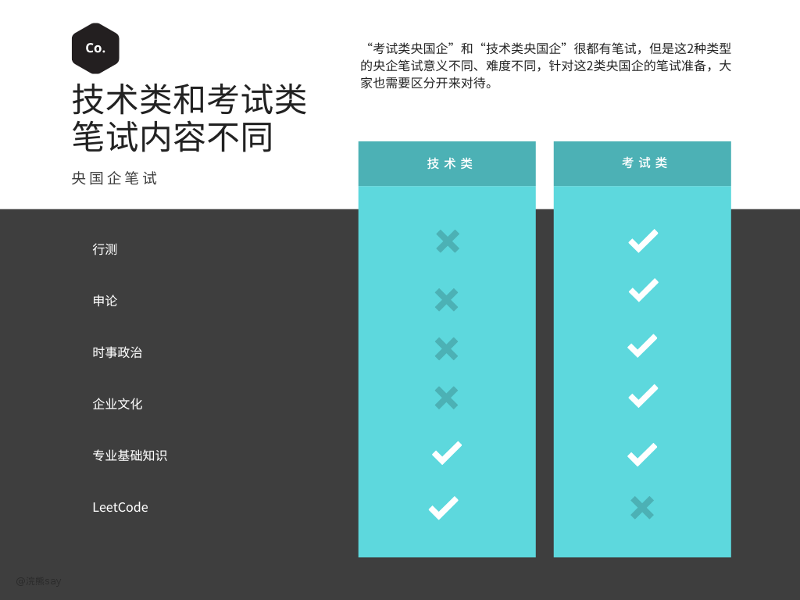
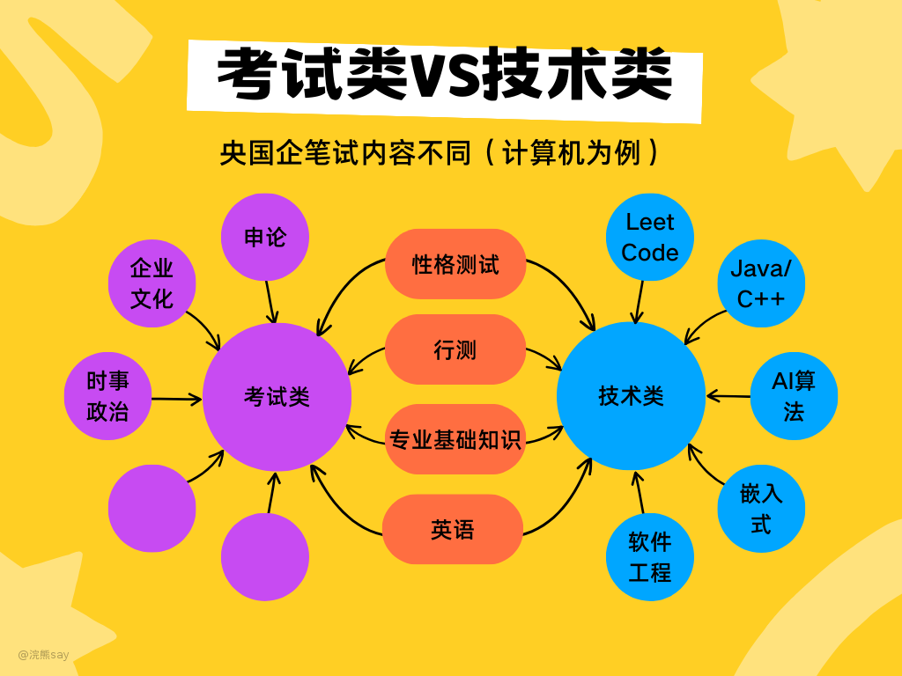

# 技术类VS考试类央国企笔试区别？

“考试类央国企”和“技术类央国企”很都有笔试，但是这2种类型的央企笔试意义不同、难度不同，针对这2类央国企的笔试准备，大家也需要区分开来对待。

如上图所示，考试类央国企笔试的重点在于行测、申论、企业知识，而技术类央国企的重点在于专业知识的笔试（少量的央企也会有行测相关内容）。

这里需要强调的是，技术类央企笔试本身不是重点，大家在准备技术八股的时候顺带就可以把笔试准备了。

# 笔试形式不同

## 考试类央国企笔试（集团统一笔试）

对于垄断类央企，也就是我们所说的考试类央企，一般的笔试形式是全国统一组织考试的形式。

所有满足要求的学生站在同一起跑线上，大家统一报名然后进行笔试，笔试过了才会筛选你的简历，安排面试。

这类央企笔试最大的特点是，事先面试官是不知道你的简历的，也不会根据你的简历来把你筛掉。

所以普通高校毕业的学生只要考试能力够强，也有机会上岸，总体来说风格偏向于考研、高考之类的考试。

## 技术类央国企笔试（线上笔试）

技术类央国企关于笔试大概分成2类，一类是需要先筛简历，然后简历过了之后才会发送给你一个笔试链接；另一类是你报名之后就会给你一个笔试链接（包含：行测、专业知识和性格测试），笔试完毕之后才会筛选简历。

这类央企一般是军工、制造业、能源相关央企较多，对学历要求较高，笔试反而不是一个重点，但是大家还是需要实现准备，免得阴沟里面翻船。

## 笔试内容不同

（1）考试类央企笔试内容

如图，考试类央企的笔试内容和公务员考试类似：行测、申论（少）、企业文化、时事政治、专业基础知识、英语（少），不同央企笔试比例不同，具体比例可以参考“浣熊手册”相关内容。

（2）技术类央企笔试内容（大多数无笔试，直接面试）

技术类央企的笔试内容比较宽泛，有一个基本逻辑就是如果有笔试，那么笔试的内容一般是行测+专业知识，这里的专业知识 一般就是你报岗位对应的知识。

例如：嵌入式会笔试C/C++相关、嵌入式相关的知识，Java类经典如银行类的笔试会有Java、Mysql、Redis等比较简单的笔试。

# 重要性不同

考试类央企非常重要，只有笔试过了才有机会被筛简历，参加面试，相对来说对于顶尖高校和普通高校的学生都比较公平。

考试类央企的笔试一般会和后面的面试成绩按照1:1的成绩计入总分，也就是说笔试成绩会最终影响你的录取结果，因此非常重要！

技术类央企不是特别重要，有的事先发笔试链接的一般就是行测+性格测试，非常简单；先筛简历的央国企，则更重要的是自身简历和履历情况。

对于技术类央企来说，由于都是通过学历等筛选过一轮在给笔试的，因此笔试只有过和没过2种情况，不会记分数，也不会影响你最后面试的结果

# THE END

如果大家意向是考试类央企，笔试一定要好好准备，最终笔试结果会影响你是否能够被录取。

如果意向是技术类央企，那么笔试就没有那么重要了，更重要的是学校档次、项目、技术问题的回答情况。

所以大家综合自己的情况来分析，到底选择什么路线，以及如何准备笔试即可。
