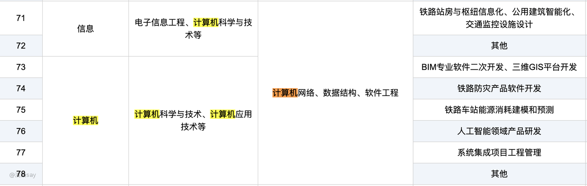
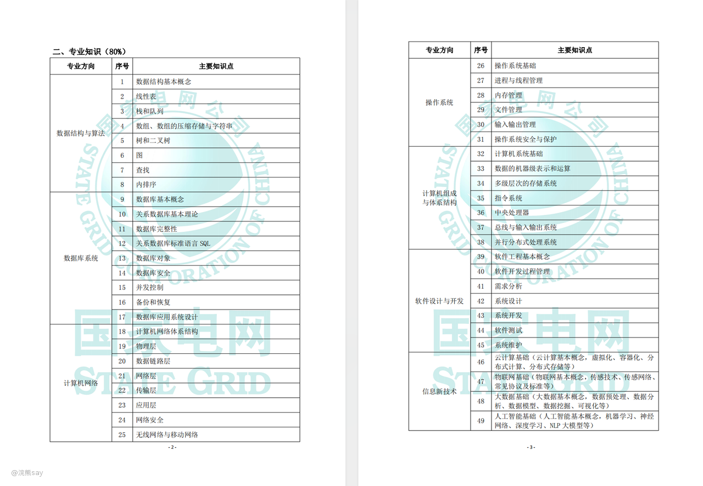

# 哪些央企会考专业综合知识？

[央国企笔试考试内容&比例](https://docs.qq.com/sheet/DVGRjdE9oVmh4b0JZ?tab=BB08J2)

由于不同的央企国企笔试的内容和比例不太一样，up已经帮助大家把各个央企考试内容的比例汇总在上面的文档当中了，大家可以去参考。

那么哪些央企会考试专业综合知识呢？常见的如：烟草、电网、中国石油都会有专业知识的考试，占有的比例各不相同。

而像中国石化、中国海油则比较奇怪全部是行测相关的考试内容，没有专业知识的考查。

所以对于考试路线的央企来说，也并不是都会考试，而且考试的内容还有些各不相同，这就给我们复习带来了难度。

另外，像中电29所也有一个在线的笔试，其内容则完全是专业知识，以算法岗为例，笔试的内容为：机器学习、大数据hadoop、雷达原理、数字信号处理。

但是重点29所的官网却没有关于笔试题目内容的任何介绍，这对于需要准备的小伙伴儿来说，一定要提前打好相关的专业知识。

# 央企专业知识考试内容各不相同

考试专业知识的央企国企很多，但是考试比例和考试具体内容各不相同，例如[国家电网](https://zhaopin.sgcc.com.cn/sgcchr/static/unitPart.html?bullet_id=1d05b1f3d7bd437a90a6e1d14ba626d1)、[中铁二院](https://xz.creegc.com/Home/service.html)等会给出各个专业的具体笔试内容，但是中电29所这类却没有明确给出，这就给我们的复习造成了麻烦。

但是总体来说，对于同一个专业，笔试的内容大相径庭，以计算机相关专业为例，中铁二院笔试内容如下：

类似的，大家去看国家电网的计算机类的笔试内容和科目如下：

可以看到，以计算机专业为例的话，几乎都是数据结构 、操作系统、计算机网络、计算机体系结构等几门专业课。

对于其它专业电气、机械等，笔试的科目和计算机专业可能不同，但是基本思路应该是一致的，在复习的时候找到这些央企专业课的最大子集去复习，至少核心的内容能够掌握。

然后再针对性复习少量的特殊的知识点，这样才是最为广泛的央企、国企的笔试准备策略，具体的准备复习策略在后面给出。

# 一般来说与考研专业课重合

一般来说，央国企对于专业知识的笔试内容和相关专业的考研专业课的内容80%以上是重合的。

以计算机专业为例，考研408考试的专业课为：《计算机网络》、《数据结构》、《操作系统》和《计算机组成原理》。

而国家电网的考试内容则除了上面4门专业课之外，还多了：《数据库》、《软件工程》和《信息新技术》。

而中铁二院的笔试内容就更少了，为《计算机网络》、《数据结构》和《软件工程》。

基本上和考研的专业课相差不多，所以时间充裕的可以使用考研专业课的资料进行复习，时间不充裕的可以使用中公、粉笔等专业机构的资料进行复习。

对于机械电气等专业基本逻辑一致，后续个性化定制的时候会给出相应专业的资料推荐。

# 专业知识的复习策略？

## 时间充裕的复习策略

对于时间充裕的同学，建议按照所有央国企的最大公共集来进行复习，例如上面我们举的栗子可以看出，对于计算机专业来说国家电网的考试内容是最多的，包含了《计算机网络》、《数据结构》、《操作系统》、《计算机组成原理》、《数据库》、《软件工程》和《信息新技术》等7门课程。

所以我们可以有足够的时间去一门、一门课程的学习这些考试内容，然后呢对于核心的专业课，比如《计算机网络》、《数据结构》、《操作系统》、《计算机组成原理》可以采用考研资料进行复习。

对于其它的课程呢，由于市面上可能并没有特别专业的资料，所有建议买相应的教材来老老实实的复习，复习策略呢还是建议采用建立自己的知识库的方式进行，这样对你未来工作考证等都是非常有帮助的。

## 速成复习策略

还有很多同学，压根就没有准备过计算机考试的央企国企、专业知识也没有系统的刷题准备。

到了秋招快考试，或者已经报名了这些央企国企的招聘的时候才想起来要复习了，这种情况是不是就没办法高分上岸了？

其实也不一定，如果你基础比较好的话，专业知识学习得比较到位，央企、国企的专业知识其实是可以轻松应对的。

那么具体的策略就是直接找真题来刷，先刷题总结自己的薄弱知识环节，补充薄弱知识环节的基础知识，然后再刷题，不断迭代。

具体方法参考行测复习攻略一节，差不太多，但是如果你说你全部是薄弱环节的话，那么确实没办法。

关于真题等资料，由于UP主本人能找到的资料都是没有版权的，给大家的话容易出现法律风险，这个建议大家去淘宝、京东、拼多多等购买即可。

## 热门央企&冷门央企的最优策略

对于热门央企，有一种同学会想all in某一类企业，比如说：all in 电网、all in 烟草考试这种。

对于这类同学，我上述的复习方法确实不是特别适合你，你也可以参考时间充裕的复习策略，对于这部分同学，最好的建议还是去报个专门针对烟草、电网等考试的班，他们会比我更加专业。

对于冷门央企，类似于中电29所这类的，笔试内容又比较奇怪的，一定要提前跟UP提出意向，帮你制定专属的复习策略才行。

## 专业知识的推荐资料？

推荐浣熊小站的《计算机专业课部分》
