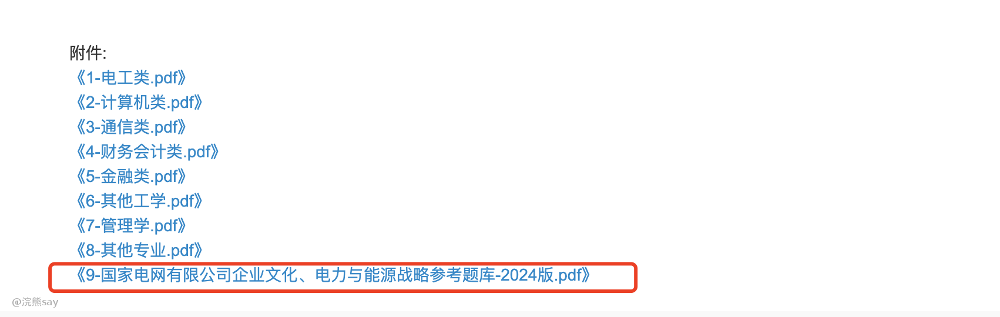
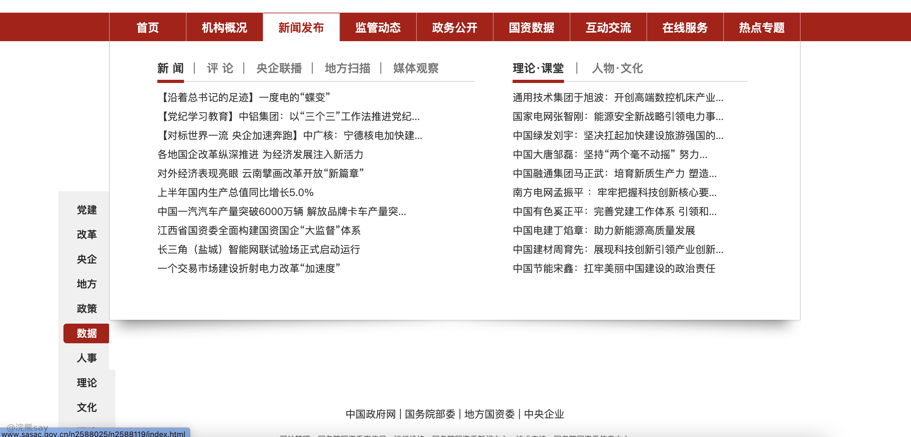
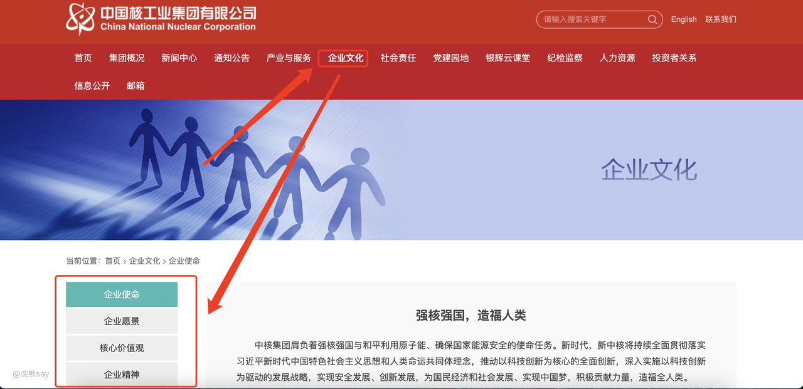

# 哪些央国企会考行业知识&企业文化？

[https://docs.qq.com/sheet/DVGRjdE9oVmh4b0JZ?tab=BB08J2](https://docs.qq.com/sheet/DVGRjdE9oVmh4b0JZ?tab=BB08J2)

行业知识&企业文化也不是所有央国企都考，烟草、电网、三桶油等大型央企集团一般有20%左右比例的企业文化的考试题目，大多数是以选择题居多。

但是像中铁二院、中电29所这类央企则是不考试企业文化，同时也不需要准备。

而企业文化的考试内容则一般是这个企业的发展历程、所从事行业的相关知识之类的内容。因为，这些央企一般集团非常大，在一个行业扎根了少则十几年多则几十年的时间，所以有非常浓厚的行业底蕴。

因此，对于校招过来的应届生，企业还是希望大家对相关行业的知识、企业的文化有一定了解的，也能够增强员工对企业的认同感。

但是，由于各个企业的文化、背景、发展历程各不相同，同时考试的分值还并不低，如何准备成为了每一个同学最为疑惑的问题。

这里UP将会给大家系统的讲解所有央企、国企的行业知识的最有效的准备策略，帮助大家在这个模块尽可能的多得分。

# 为啥央国企对企业文化这么重视？

企业文化考试的内容一般比较简单，多数是看过有印象就能选对，甚至可能出现类似于中石油是挖石油还是挖矿的？这类看似有些弱智的问题。

那么，既然这么简单，而且准备起来不太方便，为啥这些大型央企和国企还是要考试企业文化的相关内容呢？

实际上对于央企来说，企业发展了这么些年，在相应的行业一般具备垄断的地位，盘子大、人员多、关系杂。

所以在应届招聘的时候，就尽量要删选掉那些对该行业毫无兴趣、毫不了解的学生，这样也可以一定程度上避免应届生进来之后因为工资、福利待遇没有私企高之类的原因而快速离职。

用简单的话来说，公司就是希望招到那些又红又专的人才，学历的筛选已经帮助央企筛掉大部分基础能力不行的人，而企业文化的筛选则帮助央企筛掉那些不认同、不了解企业文化的人。

所以，虽然简单，大家也要好好准备。

1.  行业知识&企业文化怎么准备？

这部分内容通常占分值不高，题目较为简单，主要考察公司500强排名、核心价值观、企业文化、公司品牌等。这些内容一般官网上就有，而且题目的形式选择题为主，所以针对这部分内容，大家只需要做到看过且有印象即可。

# 热门央国企攻略

热门央企如烟草、电网、三桶油、国家能源集团、国家管网集团，外面各种培训机构神仙打假，相应的资料也一应俱全，直接去购买他们的资料即可。

但是，我知道，这些机构其实也是非常黑的，本来是免费的资料可能好几百块、甚至上千块才卖给你。

例如：国家电网官网都有企业文化&行业知识的资料，网址如下：[https://zhaopin.sgcc.com.cn/sgcchr/static/unitPart.html?bullet\_id=1d05b1f3d7bd437a90a6e1d14ba626d1](https://zhaopin.sgcc.com.cn/sgcchr/static/unitPart.html?bullet_id=1d05b1f3d7bd437a90a6e1d14ba626d1)

对于这类官方提供了的企业文化&行业知识的资料，且无版权纠纷的资料，up后续渐渐给大家汇总在星球里面，让大家在星球里面免费获取即可。

但是，对于中公、粉笔等专业机构，具有版权的资料，还是建议大家自行搜索京东、淘宝和拼多多进行购买，up上传到星球会引起版权纠纷。

# 冷门央国企准备

冷门央企的话，例如中国五矿、航天科技、航天科工等央企，由于学历要求高，备考的人少，机构能忽悠的人也少，所以连机构一般也不会出这类央国企的行业知识&企业文化的资料。

那么对于这部分央企就没办法准备了吗？no no no，这里up就教大家一个方法，至少能够搞定80%的这类型的笔试。

前面说过很多遍了，企业知识类的题相对来说非常简单，所以其实没必要耗费太多的时间去学习，所以建议大家甚至不需要特殊去准备，直接考前简单突击即可。

例如你收到了中航xxx企业的笔试央企，然后了解到有一部分的企业知识的考试内容，那么你提前一天到2天去这个公司的官网上翻翻企业知识的相关内容一般就足够应付考试了。

具体这些企业的官网链接，在后文资料推荐部分给到大家。

# 推荐资料

## 机构资料推荐

机构资料主要是针对于比较热门的央国企，各种各样铺天盖地的资料都给大家整得非常完善了，如烟草、电网、铁路局、三桶油、国家能源和国家管网这类央企。

如果大家准备的是这类央企的考试的话，直接去购买例如粉笔、中公、国聘的考试资料即可，这里UP就不给他们打广告了。

## 官方资料推荐

-   **国务院国资委官网**：[http://www.sasac.gov.cn/n16582853/index.html](http://www.sasac.gov.cn/n16582853/index.html)

-   该网站提供了大量关于中央企业宣传思想文化工作的最新动态和政策文件。例如，2024年2月28日，国务院国资委党委召开了中央企业宣传思想文化工作会议，会议内容涉及企业文化建设的多个方面，包括理论武装、舆论引导、文化底色、国际传播等。

这个官网是针对于时间比较多，同时比较闲的同学，没事儿可以去关注下。

-   **各个企业官网：**[http://www.sasac.gov.cn/n2588045/n27271785/n27271792/c14159097/content.html](http://www.sasac.gov.cn/n2588045/n27271785/n27271792/c14159097/content.html)

大家可以通过上面的链接，跳转到国资委的中央企业名录，对于大家需要去准备的央企，可以在考试之前提前去刷刷这个公司官网上的企业文化。

由于前面也说了，企业文化类的题型非常简单，所以直接去官网上简单看看就行了，就一些选择题而已，有个印象肯定能答对。
