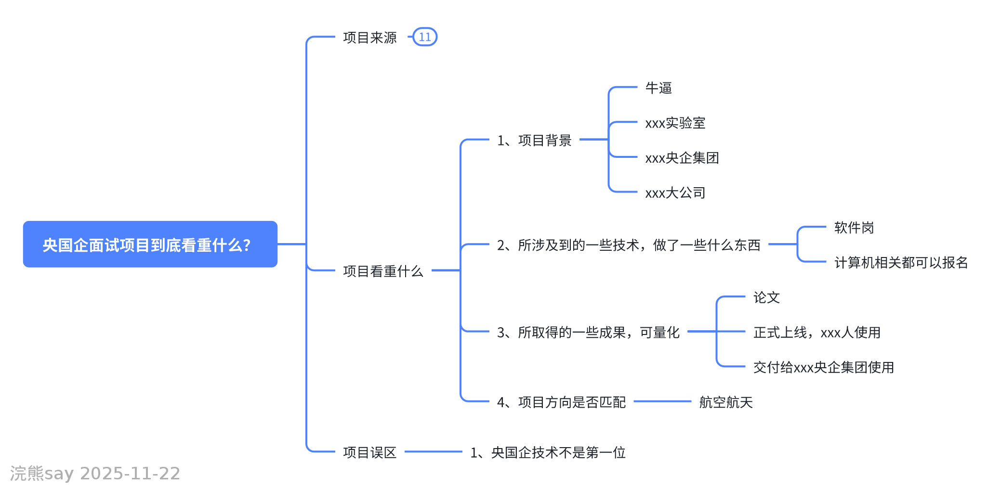

# 央国企面试项目到底看重什么？

在央国企的面试中，项目经历往往是面试官关注的重点。相较于私企和互联网企业，央国企对项目的考察维度和侧重点有明显不同。今天就来详细解析，央国企面试时如何看待项目经历，以及同学们需要注意的要点。

## 一、项目来源：哪些项目更受认可？

对于校招同学来说，项目来源的“背景”往往会影响其在央国企面试中的认可度，主要分为以下几类：

### 网上找来的项目
这类项目（如高并发商城系统、通用类网站等）在央国企面试中的认可度最低。面试官通常认为这类项目更像“玩具”，难以体现实际解决问题的能力，因此参考价值有限。

### 实验室项目
实验室项目在央国企面试中是“加分项”，尤其是横向项目（与企业、研究所合作）或纵向项目（如国家科研基金支持的项目）。如果项目涉及重点实验室、央企合作或研究所课题，会更受青睐。
需要注意的是，私企或互联网企业可能更看重项目的技术栈是否匹配，而央国企更关注项目的科研背景和合作单位，只要与岗位方向相关，都会认可其价值。

### 实习项目
实习项目的认可度取决于实习单位和业务方向：
- 大厂或央企的实习项目几乎是“降维打击”，这类经历能直接体现你接触优质项目的能力；
- 小公司的实习项目加分程度较低，但如果业务方向与目标央国企高度匹配（例如应聘航空航天类央企，实习项目恰好涉及相关领域），也会有一定优势。反之，若项目与央国企业务无关（如外卖系统、普通商城等），则吸引力有限。

## 二、项目考察核心：央国企到底看什么？
不同于私企和互联网企业对“高深技术”的追捧，央国企对项目的考察更侧重综合背景和实际价值，主要包括以下几点：

###  项目背景：是否“有来头”？
项目背景是第一印象的关键。如果项目来自重点实验室、央企集团、知名大厂或国家级科研基金支持，面试官会默认项目“有分量”，从而更有兴趣深入了解。这种“背景光环”能直接提升项目的可信度和吸引力。

###  涉及的技术：解决问题比技术本身更重要
央国企对技术的要求相对灵活，除非是明确的技术岗（如银行软开岗对Java、C++有硬性要求），多数岗位更关注“技术如何解决问题”，而非技术本身是否高深。例如，你不需要纠结用的是Java还是Python，只需清晰说明“用了什么技术，解决了什么具体问题”即可。

###  可量化的成果：项目的实际价值
项目成果需要具体、可验证，例如：
- 科研类项目：发表论文、申请专利；
- 开发类项目：成功上线、交付给某央企/机构使用；
- 合作类项目：为合作单位解决了某类问题（如效率提升、成本降低等）。
这些成果能直观体现项目的实际价值，是面试官的重要参考。

### 方向匹配度：与岗位需求是否契合？
项目方向与目标岗位的匹配度至关重要。例如，应聘航空航天类央企，若没有相关领域的项目经历，甚至可能过不了简历筛选。因此，针对性积累与目标行业、岗位相关的项目，是提升通过率的关键。

## 三、常见误区：技术并非第一位
很多同学在准备项目时，会过度关注技术难度，这其实是对央国企面试的误解。与私企、互联网企业不同，央国企更看重项目背后的综合背景（如合作单位、科研平台）、实际价值和方向匹配度，技术只是实现目标的手段，而非核心考察点。

总之，准备央国企面试时，要重点梳理项目的背景、成果、方向匹配度，避免陷入“唯技术论”的误区。如果对央国企求职有更多疑问，欢迎关注和交流，后续会分享更多相关内容。
