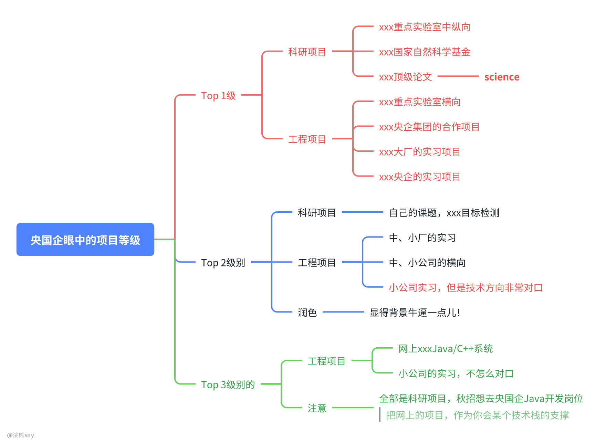

# 7.央国企项目等级划分

在秋招过程中，项目经历是简历的重要组成部分，尤其对于实验室资源有限或本科阶段的同学而言，项目背景往往成为求职的关键加分项。以下从央国企面试官的视角，对项目等级进行梳理，供同学们参考。

# Top 级项目（最具竞争力）

这类项目在面试官眼中认可度最高，能充分体现个人能力与背景优势，分为科研项目和工程项目两类。
## 1. 科研项目
- 国家级重点纵向项目：如国家自然科学基金支持的项目、重点实验室（前四级别）牵头的纵向科研项目等，这类项目具有明确的科研目标和资金支持，能体现深度研究能力。
- 顶刊论文支撑项目：若项目成果发表于国际顶级期刊（如 “三大顶刊” 等），即使未直接提及项目名称，相关研究经历也属于 Top 级，因其能反映长期科研积累与学术能力。

注意：此类项目的核心价值在于体现个人在学习阶段的研究深度与周期投入，并非仅局限于与岗位的直接相关性。例如，曾有双非硕士因发表顶刊论文未在简历中突出，错失优势，这类经历需重点呈现。
## 2. 工程项目
- 重点实验室横向项目：依托国家重点实验室开展、直接服务于特定行业（如民航、军工等）的横向项目，因应用场景明确、技术落地性强，在央企及知名企业招聘中极具竞争力。
- 央企合作项目：参与高校与央企集团的合作项目，因与企业实际业务结合紧密，面试对应企业时会更具优势。
- 大厂 / 央企实习项目：在头部企业或央企的实习经历，其项目经验能直接反映对企业业务与工作模式的熟悉度，属于高认可度的实践经历。
# Top 2 级项目（中等竞争力）
这类项目虽不及 Top 级突出，但仍能为简历加分，同样涵盖科研与工程领域。
## 1. 科研项目
主要指依托学校实验室、由导师安排的课题项目（如模式识别、目标检测等方向）。这类项目的优势在于个人参与周期长、理解深入，面试时能清晰阐述细节；但因缺乏国家级基金等背景支撑，竞争力稍弱。
## 2. 工程项目
- 中小厂实习项目：在中小型企业的实习经历，若能体现完整的项目参与流程，可作为实践能力的证明。
- 中小公司横向项目：与中小型企业合作的横向项目，虽规模有限，但能反映技术应用能力，需通过润色突出项目背景与个人贡献，提升吸引力。
# Top 3 级项目（竞争力较弱，但仍需重视）
这类项目认可度较低，主要为缺乏背景支撑的工程类项目，但并非毫无价值。

- 通用型系统项目：如网上常见的 Java、C++ 等语言开发的系统，因缺乏特定场景和深度，认可度较低。
- 小公司非对口实习：若实习内容与求职岗位关联度低，竞争力较弱。

特殊情况：若小公司实习项目与求职岗位（如航空航天类岗位）技术方向高度匹配，即使公司规模小，也可能达到 Top 2 级甚至 Top 级的认可度。
# 项目准备建议
1. 补足技术支撑：若实验室以科研项目为主，而求职方向为技术岗（如 Java 开发），需通过网上项目补足技术栈，体现学习能力与实践意愿。
2. 综合背景加持：将项目经历与实验室成果、论文、奖项等结合，全方位展示能力，提升面试官认可度。
3. 突出重点：在简历中优先呈现高等级项目，清晰阐述个人角色与贡献，避免埋没优势（如顶刊论文、重点项目经历等）。

以上为央国企项目等级的梳理，同学们可结合自身经历调整简历侧重点。如需更多央国企求职信息（如准备方案、策略等），可关注相关知识星球获取详细内容。
