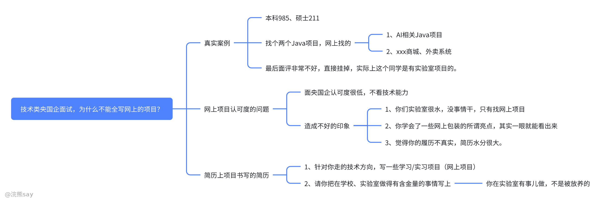

# 为什么不能全写网上的项目

央国企技术类岗位面试中，不少应届生因简历全部是网上的项目而导致面评很差，直接被挂掉。近期就有这样一个典型案例：一位本科 985、硕士 211 的同学，学历背景亮眼，面试交互后台技术岗时，简历中仅呈现了两个从网上找的 Java 项目 —— 一个是热门 AI 相关项目，另一个是普通的商城外卖系统，实验室虽然有项目但是没写上去。

导致面试官对他的简历都不是很感兴趣，最终面评极差，直接面试失败。事实上，这位同学本身拥有 CS 项目经历，却未在简历中体现。这个案例折射出一个关键问题：应聘央国企技术类岗位，简历切不可全写网上项目。下面，我们就来详细分析其中原因，并给出简历优化方向。

# 网上项目在央国企面试中的认可度困境

与私企不同，网上项目在央国企技术类岗位面试中的认可度极低，主要源于央国企对候选人的考察重点和评价逻辑有显著差异。

从考察重点来看，央国企并非单纯看重候选人的技术能力，更不是 “八股背得好” 就能过关。而很多仅依靠网上项目填充简历的同学，不仅技术实力可能不足，连项目相关的 “八股内容” 也往往掌握得一塌糊涂。

这种情况会让面试官对候选人形成两大负面印象：一是认为候选人在校学习期间 “很水”，没有扎实的专业实践经历，只能依赖网上项目凑数；二是觉得候选人缺乏真诚，简历水分大。因为那些从网上学来的所谓项目 “亮点”，在有经验的面试官眼中一目了然，很容易被识破是包装而来，而非真实的实践成果。这两大负面印象，往往成为面试官淘汰候选人的重要理由。

# 央国企技术类岗位简历的优化方向

既然全写网上项目不可取，那么应届生该如何优化央国企技术类岗位的简历呢？

## （一）在校项目 + 学习项目是更好的搭配

针对目标技术方向，可在简历中适当加入一个学习类项目（可基于网上项目思路，但需体现个人学习过程）。虽然央国企更看重候选人的学校履历，但如果应聘 Java 后台开发、C++ 开发等特定技术岗，完全没有相关项目经验也会让面试官质疑候选人的岗位适配性。一个合适的学习项目，能向面试官展示候选人的学习能力和对该技术方向的意向，让面试官了解到候选人有主动学习相关技能的意识。不过需要注意的是，央国企对这类学习项目的关注度有限，最多只会简单询问项目中遇到的技术八股，不会作为核心考察内容。

## （二）大厂实习、大厂项目是个加分项

若有大厂实习经历，务必在简历中重点突出。对于央国企而言，大厂实习经历是极具含金量的加分项，它能从侧面证明候选人具备一定的行业实践经验和职业素养，比单纯的网上项目更有说服力。因此，在求职准备阶段，应届生应尽可能争取优质的实习机会，为简历增添亮点。

## （三）学校做的科研项目，实验室项目也是很加分的

学校实验室的科研项目、横向纵向项目，也是简历中的重要 “加分素材”。这类项目能让面试官直观地感受到，候选人在学校期间并非 “放养状态”，而是有扎实的专业实践经历，参与过真正的项目研发过程。这不仅能体现候选人的专业能力，还能反映出其在团队协作、问题解决等方面的潜力，与央国企对候选人综合素养的要求更为契合。

总之，在应聘央国企技术类岗位时，应届生一定要避免简历全是网上项目的情况。无论是面试官是校招直接进入央企的，还是从互联网大厂跳槽过来的，都能轻松识别出网上项目的 “水分”。简历应围绕自身真实经历，合理搭配学习项目、突出优质实习、呈现实验室项目，才能更大概率获得面试官的认可，提高面试通过率。
