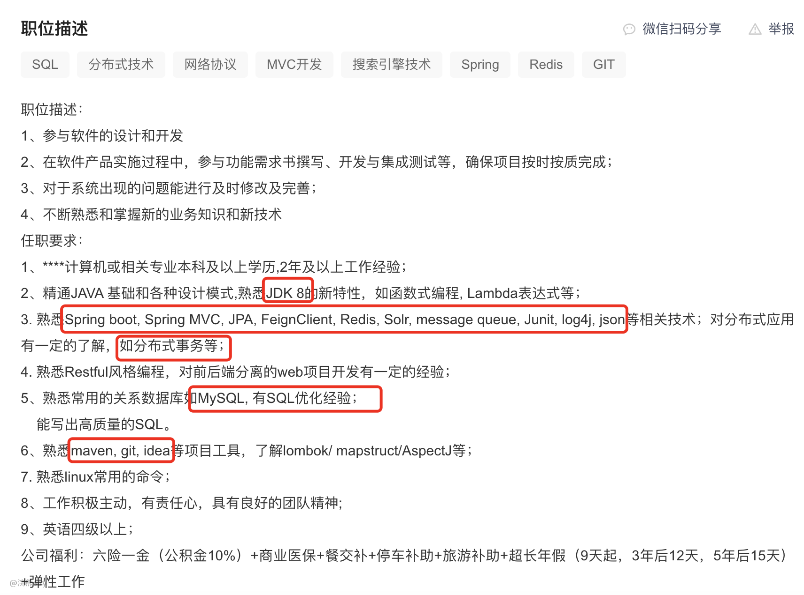
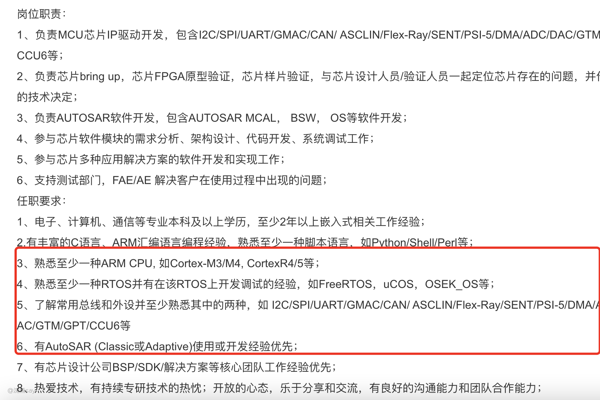
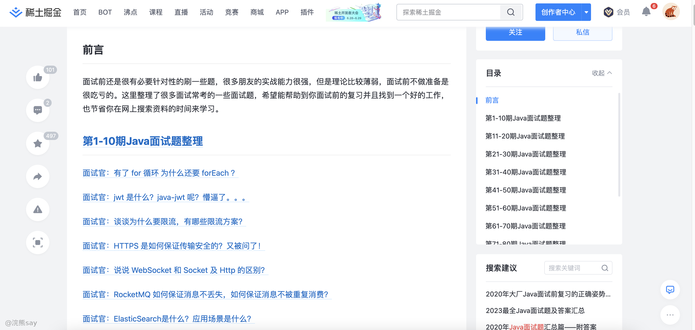
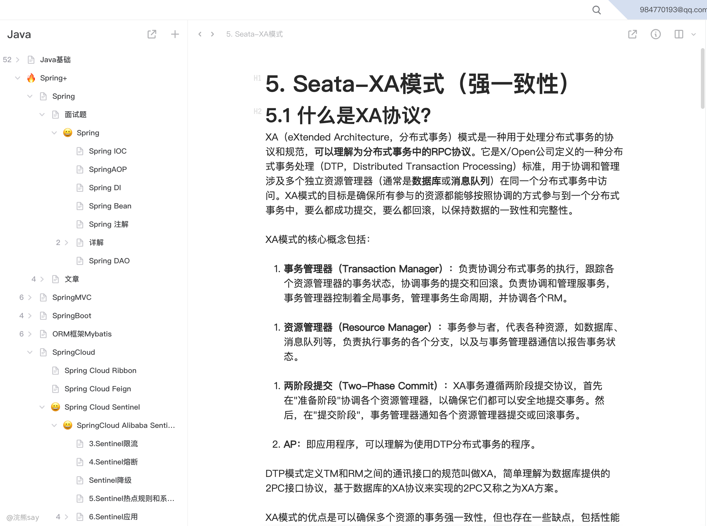
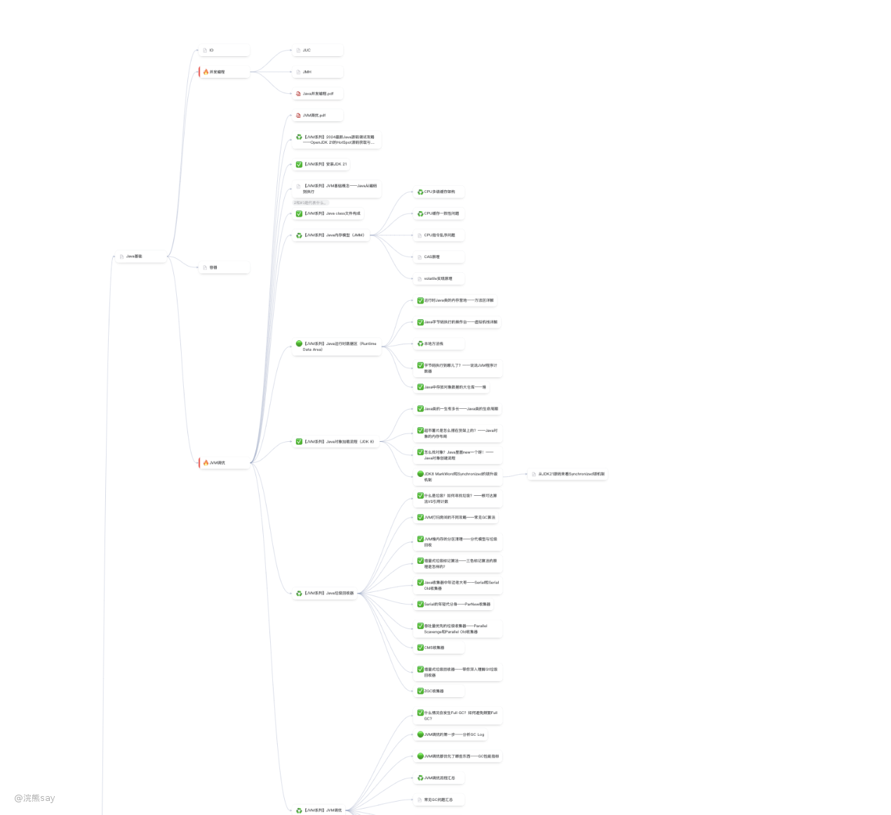

# 技术类面试必杀技——建立自己的面试知识库 (1)

**技术类面试必杀技——建立自己的面试知识库**

## 面试学习VS项目学习的区别

-   项目学习：项目学习需要不断的实战，不断的去解决问题，这样才能够提升解决问题的实际能力——实操能力。

-   面试学习：面试官无法让你实际上手操作项目，只能够通过场景题、八股文、LeetCode等内容来预估你的实际解决问题的能力——吹牛能力。

如果你将面试的学习和项目学习搞混淆的话，花费了大量时间，但是在面试中却可能屡战屡败，我们这里教授的主要是一种面试的学习方法。

## 知识树增量学习法——面试学习的最优实战

人的精力和记忆力是有限的，无论什么学科的知识都是浩如烟海，真的完全掌握并不是应付面试和考试的有效方法。

这里推荐大家采用基于招聘JD、面经等精华内容进行的核心知识点学习方法，这才是针对面试来说最高效的方法。

## 从招聘JD上获取知识脉络

如下图所示，为up去boos直聘上截取的一份Java后台开发岗位的招聘JD，上面明确的指出了需要掌握哪些技术栈。

同理，对于C++嵌入式开发，大家也可以看到招聘JD上都会非常详细的列出需要哪些技术栈：

上面这些招聘JD实际上就是大家准备面试的蓝本，大家只需要根据上面列出的能去，去构建自己的知识树，去一一掌握即可。这些技术栈就是招聘方，无论是央国企还是私企所需要的一些技术能力。

## 从面经中获取面试高频问题

在上面根据招聘了解好需要的技术栈和具体的知识之后，一般人的想法肯定是抱着书去一个个啃这些知识点。

但是！！！我这里必须打破你的错误认识，直接看书是一个效率极低且浪费时间的做法，因为针对于面试来说，很多东西面试官根本不关心，也根本不会问，你也根本记不住。

所以，针对上面的这些知识点大家只需要去网络上收集前人的面经，一个个的去总结和背诵面经即可，这才是针对面试最有效的方法。

**但是如果你的专业非常冷门，根本没人总结过面经，这就没办法了需要你自己多去看书，找到重点，然后总结起来。**

## 建立自己的面试知识库-Lattcis

直接背面经的方法很好，也很高效，但是问题是人都是健忘的，而且网络上的面经多且杂，提前半年准备好的面经/八股说不定半年之后就忘完了，甚至当初在哪里看到的都不清楚了。那么如何能够解决这个问题呢？——建立自己的面试知识库

这里推荐大家使用一款软件——Lattcis，这个软件能够帮助大家以树状目录的方式建立自己的面试知识库，同时还支持脑图功能，能够非常高效的帮助大家建立起来自己的知识树，下面这个图是up本人建立的知识树：

1.  知识库的丰富和迭代

有了这样一个知识库的基座，剩下的任务就是去完善和丰富这个知识库了，首先大家在学习阶段就需要注意去积累相关的面试知识，丰富到知识库中。

但是，更加重要的是，大家在实际的面试过程中，无论是实习面试还是正式的秋招面试，都需要在实战中去丰富自己的知识库。

## 面试的正确参与姿势

有些人之所以能够成为面霸，offer拿到手软，一方面是因为真的很牛逼，做了很多事情，但是另一方面是因为有的人参加的面试多，知道什么样子的答案能够让面试官眼前以亮，什么样的问题需要什么样的答案。

所以称为面霸的核心要义其实就是——多面试、多总结！正确的参加面试的姿势应该是：

**1）面试前找相关企业面经**

这个不用说，对于大家重点想去的公司，面试前一定要找到相关公司的面经把哪些问题都刷一刷，因为有些面试官每次面试的问题都一样，刷到了就是捡offer。

**2）面试中录音**

如果在线面试的话，有条件面试过程一定要录音，这样才能够面试下来复盘和总结，发现自己的不足。

## 面试之后的复盘（关键！！！）

一场面试，最重要的其实不是你过或者没过，拿到offer没有，而是从一场面试中可以知道自己还有哪些不足，下次面试应该注意些什么。

面试之后的复盘，才是一场面试的重中之重，才是帮助你成为面霸的核心要义，复盘过程中主要注意以下几点：

**1）听自己哪些问题答得不好**

**2）梳理总结自己答得不好的问题**

**3）拓展、衍生类似问题**

**4）将经验沉淀下来，积累到自己的知识库当中**

## 丰富自己的面试知识库

在面试复盘完成之后，你会发现大多数的知识点你已经记录过，但是可能面试的时候已经忘记了，没关系，你需要的是通过一遍遍的面试来重温这些知识和问题。

这就是我前面提到的建立树状知识库的重要性，对于已经存在你知识库里面的面试知识，你可以稍加完善并且记忆一下就可以了。

对于还没有进入到你知识库的知识，你则需要认真学习，总结，并且加入到你的知识库中。

这样随着你面试、复盘越来越多，你会发现很多公司的面试题都差不多，你也会更加游刃有余的应对面试。

 END

这套实际上是面试方法论，是星主本人参加过数百场面试，拿下过大量中、大厂offer和央国企offer总结出来的。

不仅仅适用于大家秋招、校招面试，也适用于大家今后社招跳槽积累面试经验和总结面试方法，是值得大家长期去积累的东西。
