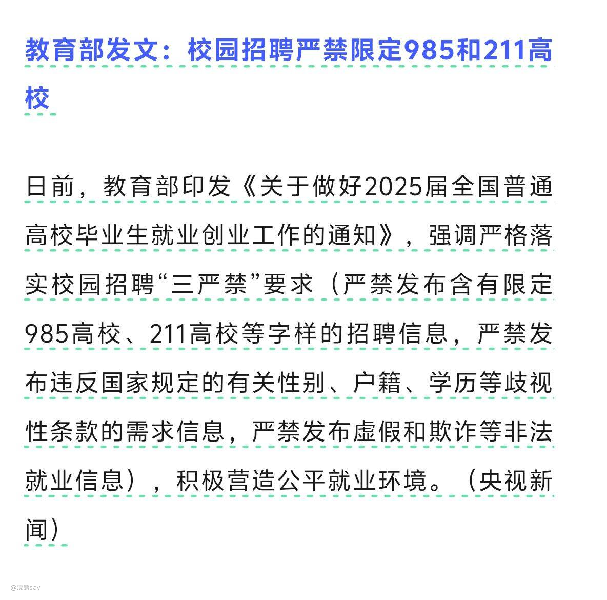

# 说说央国企对学历的要求

最近，教育部又发文了，严禁校园招聘限定985和211高校，当然这个说的不止是央企、国企，也包含了私企，但是众所周期，央国企其实是卡学历最严重的地方。

虽然，无论什么央企都不会在招聘的时候明显上写我们只要985/211毕业的学生，但是实际上在内部的公司招聘文件上，会明确标明招聘学生的层级，以某央企的录用人员基本要求规定为例：

## 毕业生招聘基本要求

 (一)学历:
(1)京外生源原则上为全日制硕士及以上学历人员，毕业院校为 985/211/国内一流院校并取得相应学位，且专业为教育部评级B+及以上:
(2)京内生源原则上为全日制大学本科及以上学历人员并取得相应学位:
(3)留学归国人员须取得经教育部留学服务中心认证通过的本科及以上学历学位认证。(二)外语成绩:须通过国家英语四级考试或达到同等水平:
(三)专业对口，成绩优秀，身体健康，符合岗位任职资格的要求:
(四)在专业方面特别优秀或有专业特长的，条件可适当放宽。

## 社会化招聘基本要求

(一)学历:全日制大学本科及以上学历并取得相应学位:
(二)年龄:原则上不超过50周岁，特殊人才年龄适当放宽限制:
(三)工作经验:符合岗位任职条件要求:
(四)身体健康，符合岗位任职资格的要求:
(五)在原工作单位无违规、违纪行为，表现良好，且对与公司有竞争关系的其他单位无竞业限制义务;
(六)具有企业急需执业资格证书或特殊紧缺人才，条件可适当放宽。

## 实习生招聘基本要求

(一)全日制本科及以上正式在读学生:

从上面的文件要求，可以看出，央企内部招聘要求会明确的去卡学历，对于应届生的要求至少是本科211以上，同时还要求专业评级为教育部的B+以上。但是对于社会化招聘的人才，对于学历的要求会降低，全日制本科以上即可，但是实际上学历不够的同学即使是在社招也容易过不了领导审核这一关。

例如我们公司最近一批面试大概面试了100来号，最终招聘了6个人，其中还有一个人部门领导非常想要，因为专业、背景和工作履历各个方面非常对口，但是由于本科是双非院校，所以最终无论怎么说都没能过集团领导那一关，他的offer也就被卡了下来。

当然，星主这里说的是二级央企的内部招聘规范要求，对于三级以下央企要求并没有那么多的限制，但是对于学历、学校的朋友来说，千万不要觉得央企国企面试简单就是没门槛，实际上央企国企的门槛在卡学历这一块儿。
