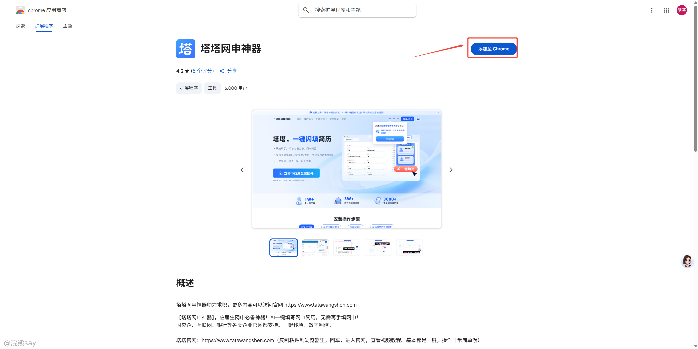
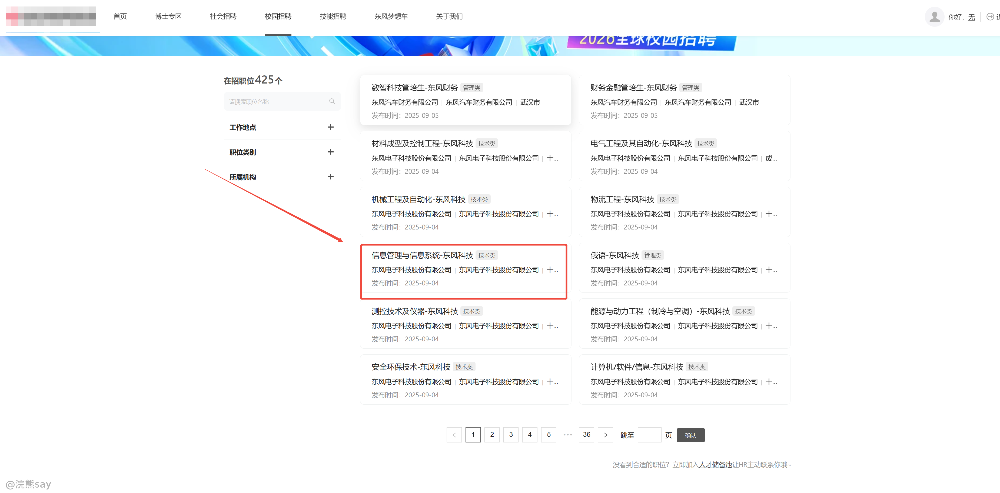
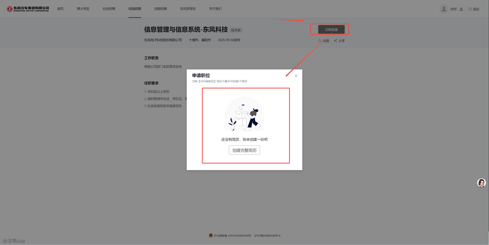
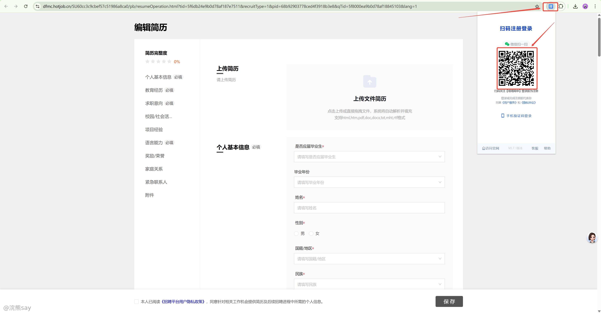
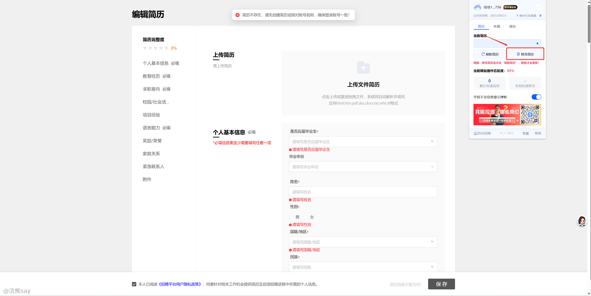
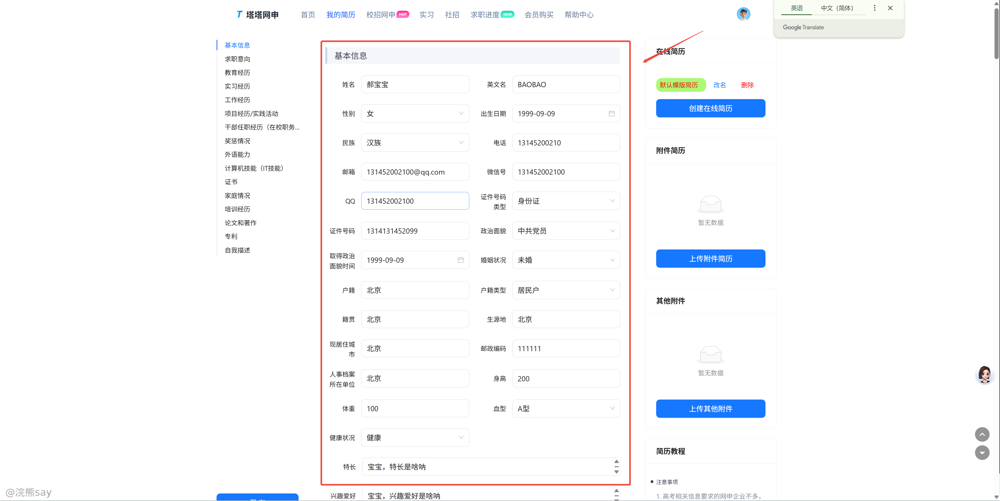
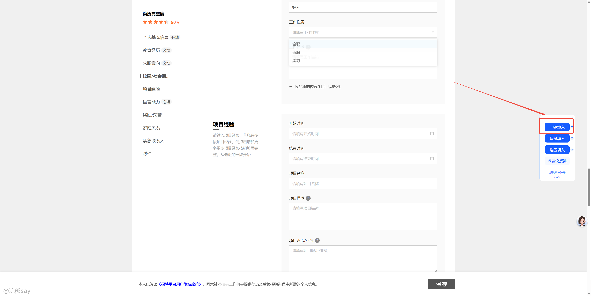

# 2.推荐一个快速网申神器

**推荐一个快速网申神器**

不知道大家秋招投央国企是否遇到这样一个问题，每个招聘官网都会要求你在该官网填写一份简历，什么个人信息、毕业院校、项目经历等都需要手动填写，对于大多数同学来说都是不胜其烦。

今天学长就给大家推荐一个帮助大家网申的神器——塔塔网申，首先这里是它的官网：https://www.tatawangshen.com/

# 第一步：点击下载安装插件

这里目前支持chrome和edge两种浏览器，星主的浏览器是chrome的所以选择了chrome

# 第二步：添加到chrome

添加成功后浏览器右上角有一个小logo，可以点击固定将其固定在浏览器的顶部

# 第三步：使用塔塔网申

1.  **这里我们点击进入一个央企的秋招网申页面，然后选择你想投递的岗位：https://dfmc.hotjob.cn/**

1.  **点击立即投递之后，会让你创建一份简历，如下图所示：**

1.  **点击创建简历之后，点击塔塔网申，会弹出二维码让你登录，可以扫码登录下：**

1.  **点击修改简历，在塔塔网申创建一份新的简历**

1.  **选择一键填入，就能够自动帮助大家填入基本信息了！**

现在正是秋招疯狂投递的时候，有时间网申简历填得人头疼，有个这个插件能够帮助大家快速的填写网申简历，大家快去试试吧
