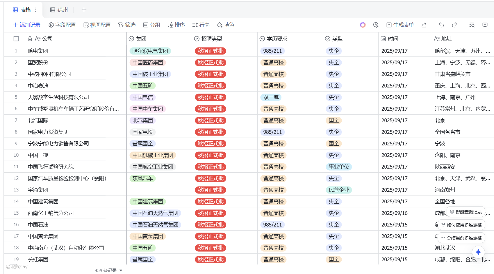
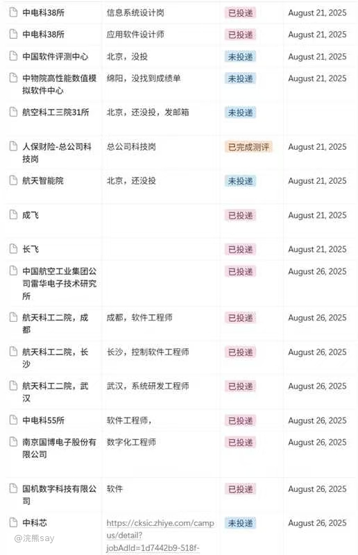
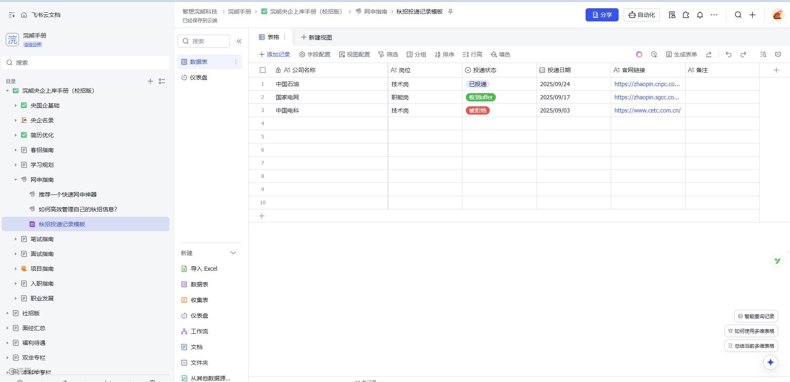
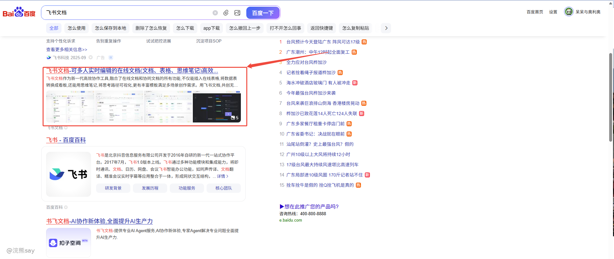
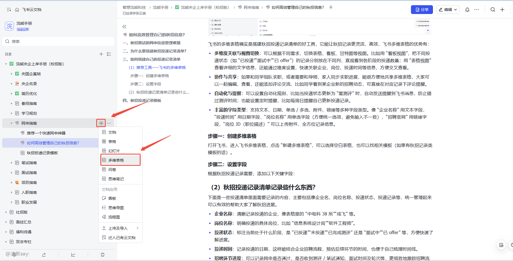
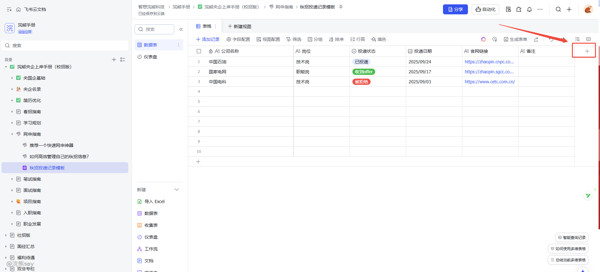
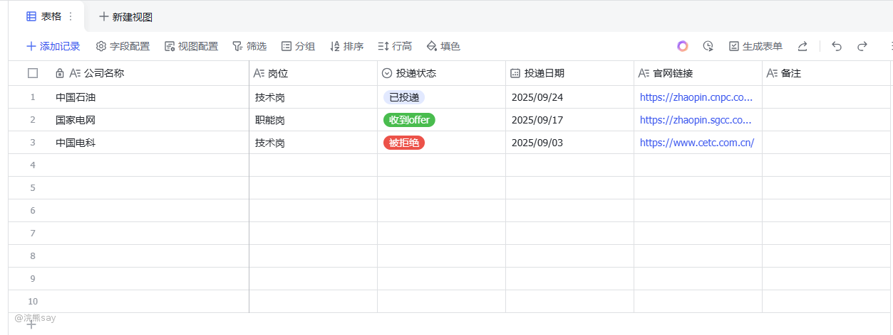

# 3.如何高效管理自己的秋招信息？

**如何高效管理自己的秋招信息？**

【本文say原创，创作日期2025年9月19】

# 一、秋招面试的网申信息管理难题

25年的秋招如火如荼的进行当中，而且今年的秋招比起往年竞争更加激烈，所以很多同学都选择了海投。一位不知名的银行学长也说：“秋招先投他个100份简历再说！”。

学长对此表示深以为然，在秋招初期，尤其是大家还没拿下offer的时候一定要去多投递简历，多练习面试在实战中不断成长，才是秋招取得胜利的不二法门（当然前提是简历得做好）。

那么，我相信大家一定面临过这样的问题，面对秋招密密麻麻的招聘信息，哪些公司投递了简历？哪些拿到了笔试？哪些拿到了面试应该怎么样去把这些信息管理起来呢？做到游刃有余心中有数呢？

这里学长就推荐大家可以用飞书的表格将自己的秋招投递信息管理起来，方便随时记录和查看自己的秋招投递状况——文末辅秋招投递记录表格的excel模板。

# 二、为什么要搭建秋招投递记录清单？

那么针对秋招纷繁复杂的信息，同学们往往会投递大量企业岗位，不同企业的招聘流程（如网申、测评、笔试、面试等）时间节点、岗位信息、投递状态都不尽相同。

如上图所示，我就建议大家一定要搭建一份属于自己的秋招投递记录清单，就像有了一本 “秋招指南”，能让大家对自己的秋招进展做到心里有数，秋招投递记录清单的搭建主要有下面三个优势：

**首先能避免遗忘，**能清楚知道自己投了哪些企业、什么岗位，防止因为投的太多，把某些投递过的企业 “忘在脑后”，错过后续的招聘环节，比如测评或面试通知。

**其次能更好的把握节奏，**通过记录的投递时间、企业招聘进度，合理安排自己的准备时间。比如有的企业投完很快就发测评，就可以提前准备相关题型；有的企业流程长，也能做到心中有数。

**最后，可以帮助大家高效复盘，**在求职过程中，能根据记录复盘自己的投递策略，比如哪些类型的企业投递后反馈好，哪些岗位可能不太适合自己，以便及时调整后续的投递方向。

# 三、如何搭建自己的投递记录清单

# （1）推荐工具——飞书的多维表格

飞书的多维表格确实是搭建秋招投递记录清单的好工具，它能让秋招记录更灵活、高效，飞书多维表格的优势有：

-   **多维度关联与视图切换**：可以根据不同需求，切换表格、看板、甘特图等视图。比如用 “看板视图”，把不同投递状态（如 “已投递”“面试中”“已 offer”）的记录分别放在不同列，直观看到各阶段的投递数量；用 “表格视图” 查看详细的文字信息，还能通过维度设置，快速关联企业、岗位、投递时间等信息，方便交叉查看。
-   **协作与共享**：如果和同学组队求职，或者需要和导师、家人同步求职进展，能很方便地共享多维表格，大家可以一起编辑、查看，还能添加评论交流，比如同学看到某企业新的招聘动态，可直接在对应记录下评论提醒。
-   **自动化与提醒**：可以设置自动化规则，比如当投递状态更新为 “需测评” 时，自动发送提醒到飞书消息，防止错过测评时间；也能设置定时提醒，比如每周日提醒自己更新投递记录。
-   **丰富的字段类型**：支持文本、日期、单选 / 多选、附件、链接等多种字段类型。像 “企业名称” 用文本字段，“投递时间” 用日期字段，“岗位名称” 用单选字段（方便统一选项，避免输入不一致），“招聘官网” 用链接字段，“岗位 JD（职位描述）” 可以上传附件，全方位记录信息。

# 步骤一：百度搜索飞书文档

# 步骤二：创建多维表格

打开飞书，进入飞书多维表格，点击 “新建多维表格”，可以选择空白表格，也可以找相关模板（如果有秋招记录类模板的话）。

# 步骤三：设置字段

根据秋招投递记录需要，添加自己需要的字段

# （2）秋招投递记录清单记录些什么东西？

下面是一些投递清单里面需要记录的内容，主要包括像企业名、岗位名称、投递状态、投递记录等，统一管理起来可以有效的帮助大家了解秋招进展。

-   **企业名称**：清晰记录投递的企业，像表格里的 “中电科 38 所”“成飞” 等。
-   **岗位名称**：明确投递的具体岗位，比如 “信息系统设计岗”“软件工程师”。
-   **投递状态**：标注当前处于什么阶段，是 “已投递”“未投递”“已完成测评” 还是 “面试中”“已 offer” 等，方便快速了解进展。
-   **投递时间**：记录投递的日期，这样能结合企业招聘流程，预估后续环节的时间，也便于自己梳理时间线。
-   **招聘环节进度**：可以记录网申是否通过、是否收到测评 / 笔试通知、面试时间及轮次等，更细致地跟踪招聘流程。
-   **备注**：填写一些额外信息，比如企业的招聘官网链接、内推人的信息（如果有内推）、岗位的特殊要求（如需要掌握某类技术）等，方便随时查看补充。

这样搭建好后，定期（比如每天或每周）更新记录，秋招求职就能更有条理啦。

# 四、秋招投递记录模板

上图的飞书模板，大家自取：[秋招投递记录模板](https://ecnhcesakwkz.feishu.cn/wiki/JFItw88V1i47JYkDg4acnEoZnFg)，最后，希望大家秋招高效管理自己的网申信息，拿到自己满意的offer！
