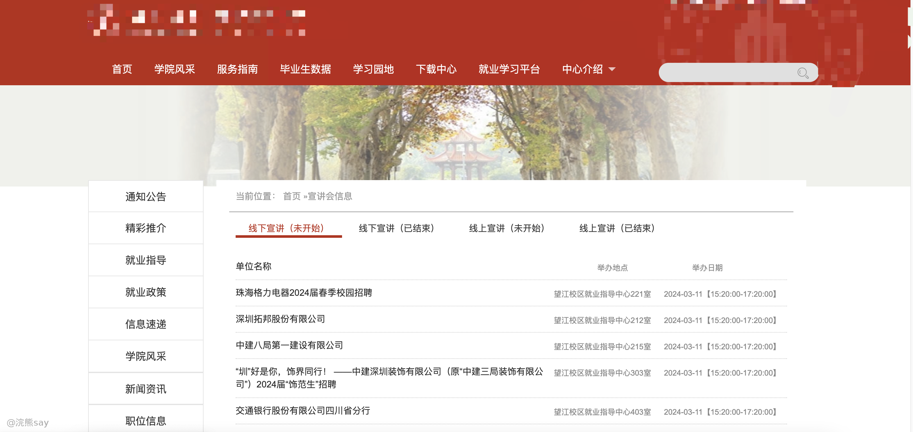
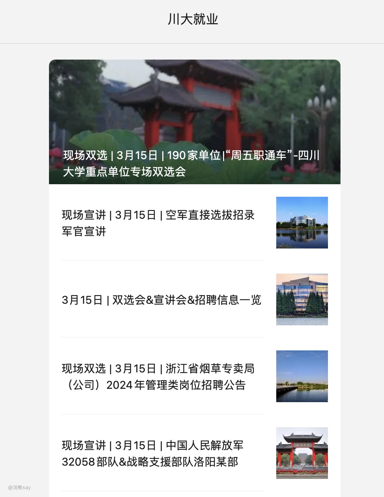
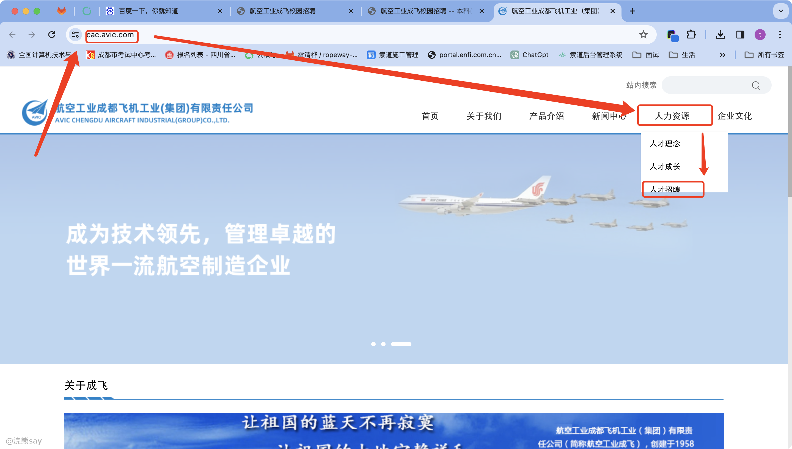
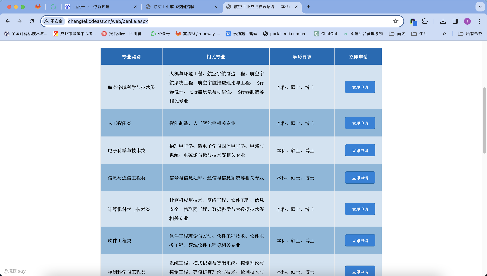
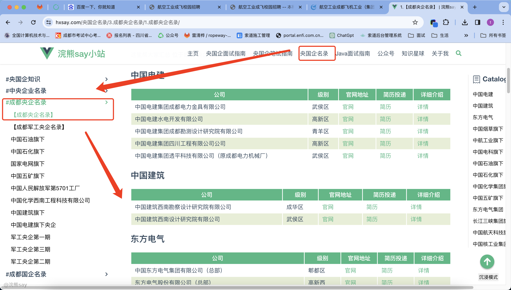
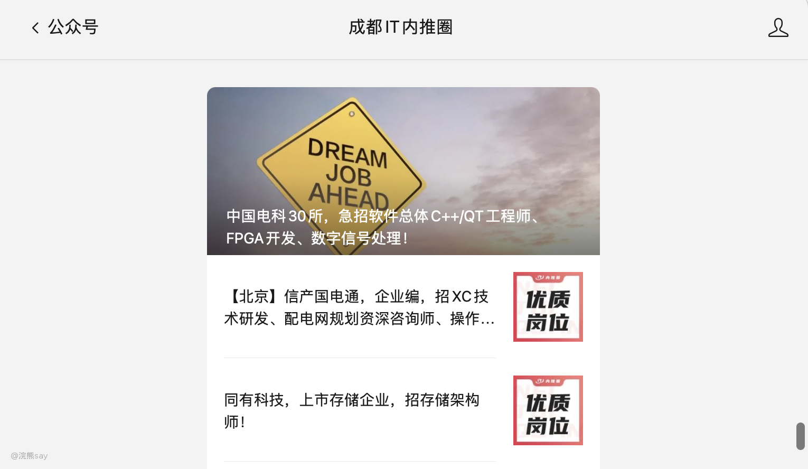
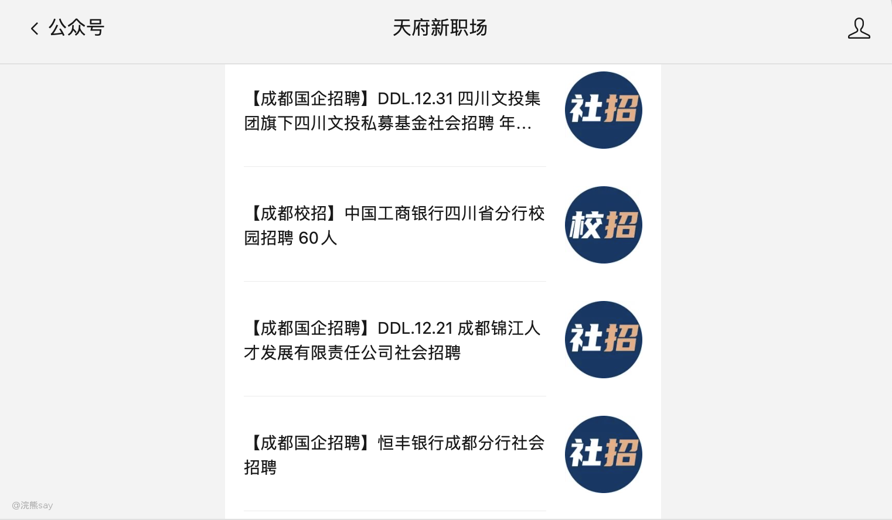
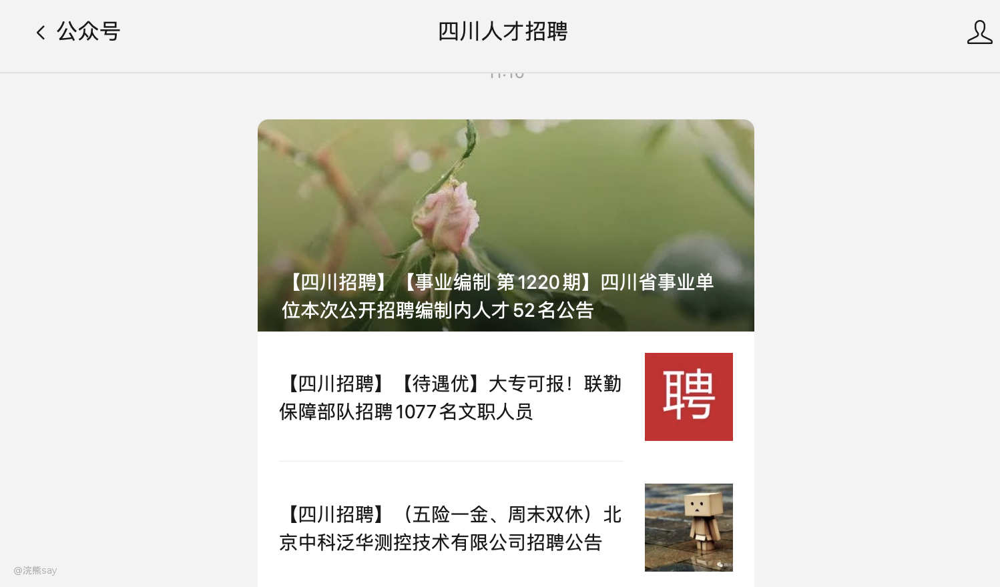
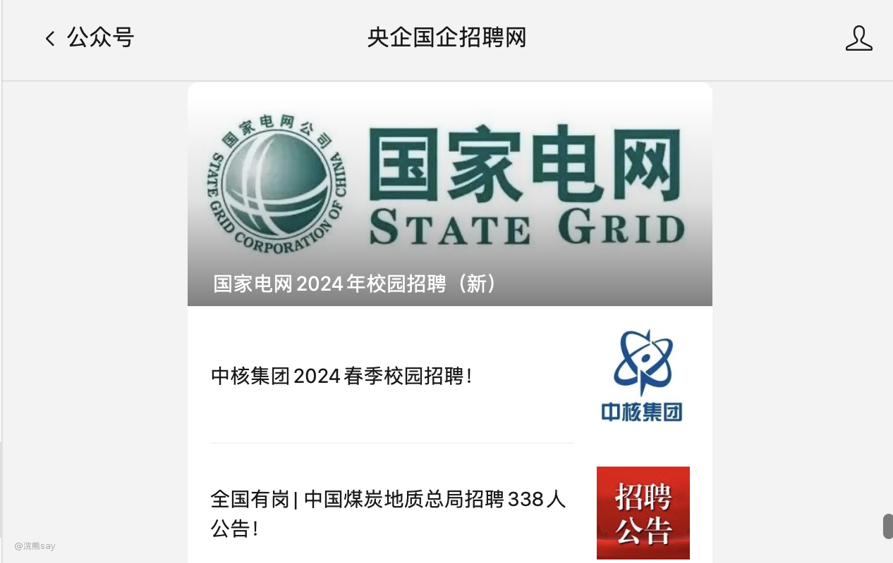
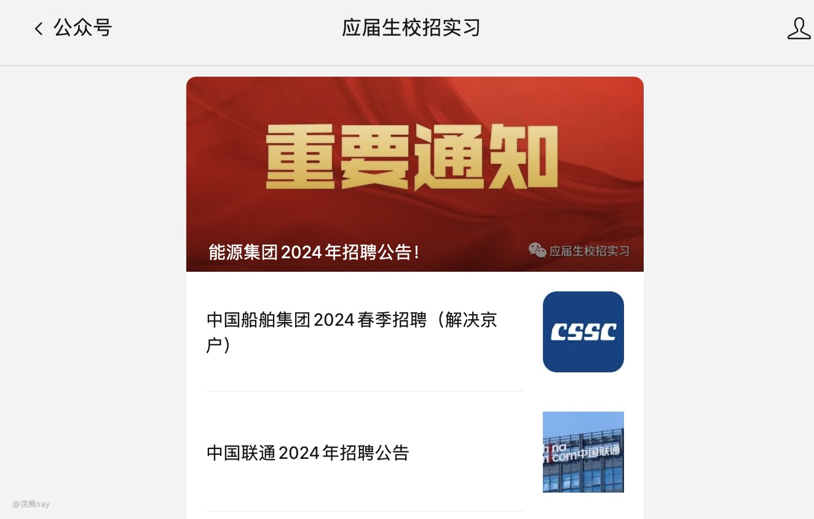

# 4.央国企招聘信息获取

一般对于应届生来说，央国企招聘信息的获取渠道主要是：宣讲会、就业公众号、招聘软件和公司官网等4种渠道。

# 目标院校宣讲会

一般来说大型央国企会去各个省的顶尖高校（985/211）开办校园宣讲会，对于学校比较好的学生来说可以随时关注学校的宣讲会信息。

宣讲会上投递简历的效率更好、通过率更高，可以直接将简历递到HR手上，相对来说要求也会更低。

对于普通高校的学生来说，虽然也会有央国企来你们学校宣讲，但是档次往往不及本地的顶尖高校，因此，建议大家也去关注本地高校的官网获取宣讲会信息。

需要注意的是，比如大型央国企在川大开办宣讲会，并不代表只招聘川大本校的学生，普通高校的学生简历匹配也是有很大机会的。

这里给出川大校园宣讲会信息的公布网站：[https://jy.scu.edu.cn/index/index/employ.html](https://jy.scu.edu.cn/index/index/employ.html)，其它省的类似高效也有类似网站可以去获取宣讲会信息。

# 就业公众号

各个学校一般都有自己的就业公众号，春/秋招的时候会推送大量的就业消息，而且这些公众号上的信息一般是最及时的，而且完全面对校招的，例如**川大就业**就是川大的专属就业公众号：

普通学校的同学同样也可以关注下你们省市的头部高校，其实很多央国企并不限制学历层次，只要投递简历就有机会。

# 公司官网/公众号

公司官网也是很重要的一个招聘信息的获取途径，并且大多数央国企都要求应聘者重新再去其官网上填写一份简历，所以大家对于意向度很高的公司，其实从8月份开始就可以去官网上投递简历了，以成飞为例：

-   步骤1:
-   登陆官网（[http://chengfei.cdeast.cn/web/benke.aspx](http://chengfei.cdeast.cn/web/benke.aspx)）
-   步骤2:
-   如下图所示，找到人力资源->人才招聘

-   步骤3:

进入人才招聘页面，大家可以看到上面按照专业类型划分列举出了成飞当年所需要招聘的

然后大家就可以根据自己的专业进行简历投递了，一般公司官网投递的简历能够很快被公司HR收集到。并且这里星主帮大家整理了成都几乎所有大型央国企的官网地址，大家可以登录网站[https://hxsay.com/](https://hxsay.com/)查看：

星主还会继续不断完善成都以及未来全国各省的央国企官网地址，帮大家更加便捷的找到相应公司的官网！

# 招聘软件&三方公众号

普通的招聘软件，如：智联招聘、前程无忧、Boos直聘等软件上的招聘信息主要还是以社会招聘为主，校招的岗位少，质量也一般，不如上面给出的渠道获取招聘信息高校，这里列举下有哪些招聘软件，大家可以关注一下。

靠谱的国企招聘平台的话，我观察我们主任经常逛**智联招聘**这个软件，好多简历也是从上面拿的，实际上智联上确实国企会多一些。除此之外我推荐一些成都国企的招聘平台：

-   **智联招聘/猎聘/Boos直聘/前程无忧：**不用说，最常用的招聘软件，国企喜欢挂在智联上，猎聘主要是一些猎头来捞人，国企也比较多，还算比较可靠。
-   成**都IT内推网（公众号）**：这个我看上面工作推荐挺多的，但是正儿八经的国企比较少。

-   **天府新职场（公众号）**：这个公众号比较不错，专门推荐国企的，还给你详细标注了是社会招聘还是校招，但是我看大多数对学历要求较高。

-   **四川人才招聘网（公众号）**：这个上面的职位类型比较全，比较多，很多事业单位和公务员的招聘考试信息也在上面。

-   **央企国企招聘网：**这个是专门针对于央国企的，全国性的招聘公众号，大家可以在上面获取招聘信息，然后去官网投递。

-   **应届生校招实习（公众号）：** 也是一个全国性的招聘公众号，可以第一时间获取相关的央国企的招聘信息。

# 内推

内推其实也是一个进入央国企的好渠道，但是由于大家的实际情况、学校层次等各不相同，因此我放在最后来说。

实际上，要积极利用校友、同门师兄弟、导师等相关资源，问问他们能否帮你内推，内推实际上是可以将简历递交到你的直属领导的手上的，这样的招聘效率实际上是最高的。

但是，国企实际上内推对个人没啥好处也没有奖励措施，大多数员工还是本着多一事儿不如少一事儿的原则，也不会轻易帮人内推。

所以需要找关系比较好的朋友、师兄师姐、校友等才能够有效内推。

# 避坑

类似脉脉这种软件上，常常存在着一些人说手里掌握大量的央国企资源，然后可以帮你内推面试之类的，但是这个内推的价格可不便宜，星主问过一般都收费在几万～10几万不等。

这些人力资源公司还是会对你简历进行修改，面试，然后拿你的简历帮你内推，实际上他们可能根本没有任何内部资源。

只是拿到了你的简历，帮你修改简历，然后帮你投递，最后告诉你是他们的资源起到了作用。

实际上，他们去投递和你自己去投递没有任何区别，他们可能会承诺面试不通过会给你退款，但是比如你参加了面试就会让你支付一定比例的钱。

这样就相当于，他们只是帮你修改了下简历，帮你投递了下目标公司，就能够赚到大家的钱，所以对于这种情况大家一定不要相信。

其实大多数国企的招聘还是公正公开的，除非那种要求很奇葩的萝卜坑之外，大多数岗位都是可以靠着大家的努力至少拿到面试机会的。

所以，不要相信这些歪门邪道，靠自己拿到offer是最好的！
