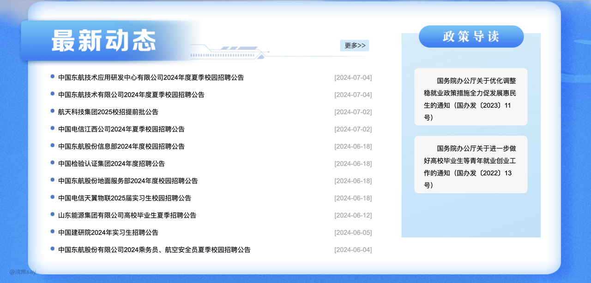
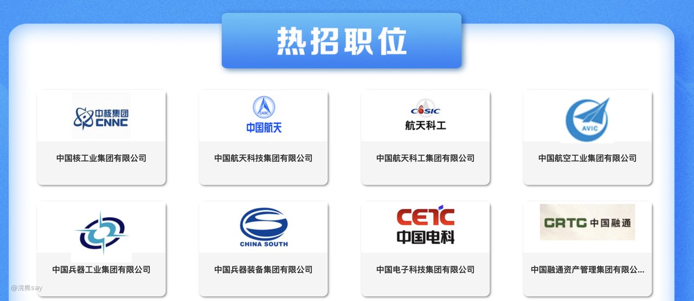
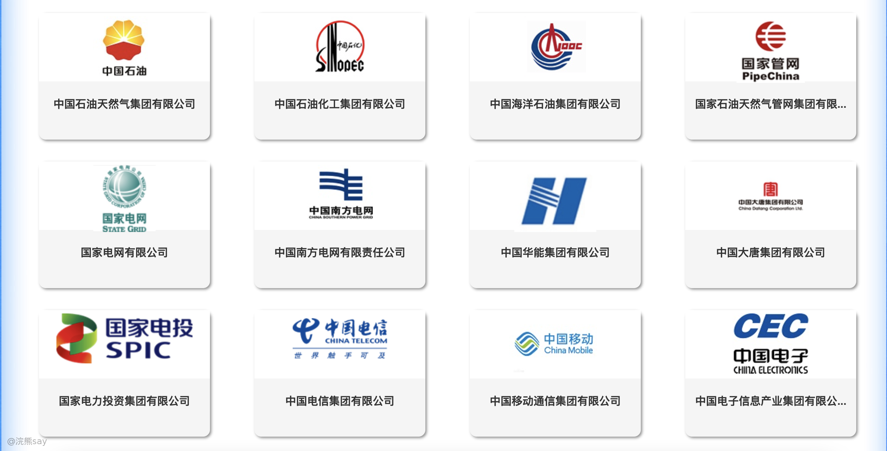
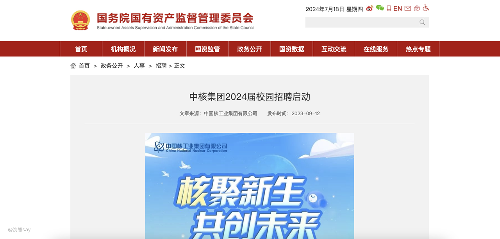

# **国资委最全央企招聘网站安利！**

对于想去央企的小伙伴，不知道大家秋招的时候有没有遇到这么一个问题——央企招聘信息哪里找？

央企公司浩如烟海，各种招聘公众号层出不穷，有的推送的信息甚至都是无用的，点进去发现是去年的招聘信息的情况也屡见不鲜。

难道只有遭受各种培训机构的疯狂折磨吗？就没有一个不包含任何营销，任何广告的招聘网站吗？（当然，我本人的公众号也做不到hhhh）

但是，咱们国资委就给咱们早就提供了这样一个央国企的招聘网站，上面汇总了所有的央企招聘信息，让大家轻松实现招聘信息自由！！！

这是一个国资委的网站：[http://www.sasac.gov.cn/n4470048/n26915116/n28754408/index.html](http://www.sasac.gov.cn/n4470048/n26915116/n28754408/index.html)

上面有所有的央企的招聘信息，到时候秋招的时候就再也不需要到处去找央企的招聘信息了！！！

首先呢，这个网站有最近最新的央企招聘信息，这个招聘信息呢还不是某一个公司，某一个研究所的招聘信息，而是某个央企集团的招聘信息。

比如最近正在招聘的航天科技集团、中国检验认证集团、东方航空集团，几乎是最及时的就把招聘信息放在上面了。

除此之外呢，还有各种央企集团的招聘信息都在这里，全部都给你汇总了，up斗胆猜测，很多机构的招聘信息都是这里获取的。

这回up主真的帮大家打破信息差了，帮助大家实现了央企国企招聘信息自由，这些集团的链接点进去之后，就会出现整个集团所有的招聘信息的入口。

但是目前呢，还没更新到2024年的招聘信息，大家秋招有需要的可以自行关注该网站，而且呢上面基本上都是应届招聘信息！
