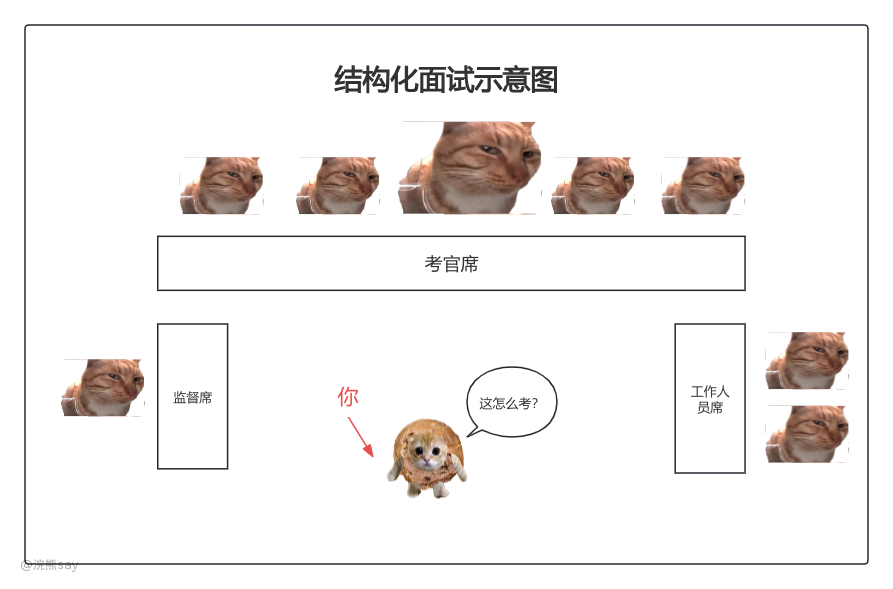

# 4.结构化面试概述

PS：结构化面试一般银行非技术岗、央企总部和公务员考试比较多，**技术类的面试结构化面试较少**，这里up也是简单的总结了结构化面试的策略，更深入的学习可以参考更专业的资料。

# UP真实的结构化面试经历

虽然UP本人也面试过非常多央企、国企、私企，但是遇到结构化面试的情况少之又少，因为我主要是面试的是研发技术岗，而非职能岗位。

一般对于技术岗来说，结构化面试的央企少之又少，无需特殊准备，但是本手册作为一个完整的央国企准备手册，所涵盖的内容这里都要讲明白。

实际上，up还是有过结构化面试的经历，不过不是央企的面试过程中遇到的，而是考试深圳市某行政单位系统某岗位的公务员考试时的经历，这里简单给大家分享一下结构化面试到底是一个什么样子的体验。

当时的面试是在广州某机关单位进行的，面试的人非常多，大概有300多人的样子。我和我的室友是提前一天飞到广州去的，然后在面试单位外面定下了一个酒店（PS：参加考试之前说的所有费用都报销，但是实际上后来好像没有报销，真的是蛮费钱的）。

头一天下午先去这个单位签到，表示你是来报道了的，第二天要参加面试，完事儿之后我们就会到我们自己租的酒店里面。不得不吐槽这个酒店，当时租在广州的一个城中村里面，酒店的床又黑又硬，我真的是一夜没睡着。

第二天一早，就出发去参加面试去了，所有人都先被集中到一个大厅里面这个过程所有人都不许出去，然后等着被叫到的人可以去参加面试。由于人特别多，所以不是一个上午可以面完的，因此还蹭了一顿这个单位的午饭，不得不说还是真的挺好吃的。

到了下午，轮到我们一批人去面试了，就被领头的工作人员带走，然后去到另外一栋楼里面的会议室，一个个的安排面试。

面试的时间不长，一个人大概10多分钟左右，面试的地方空空旷旷的，里面坐着5～6个面试官，然后你坐在中间的一张小桌子上，给了你一张笔一张纸，让你可以打草稿，如下图所示：

然后面试官开始提问，面试官的问题都是提前准备妥当的，我估计所有人的问题都差不多，问题一共2～3个题，具体内容记不清了也不能说，大概就是遇到工作中突发情况怎么处理啥的。

然后，一般你可以思考30s左右，打一下草稿，然后就必须开始回答问题，up没有怎么准备过，感觉答得不是特别好，最后的分数是在70分左右（PS：后面了解到上岸的都是笔试/面试 80分，up如果有时间可以早点儿准备说不定就是另一段人生了）。

面试完毕之后，人直接被带走到另一个会议室等着，成绩全部出来之前所有人都不许走，估计是为了防止题泄密啥的，所以up猜测所有人的问题都是一样的。

最后，如果想直观了解结构化面试是什么样子的，可以参考b站视频公务员结构化面试视频：[https://www.bilibili.com/video/BV1uJ411H7w4/?spm\_id\_from=333.337.search-card.all.click&vd\_source=c0a8b0502007d136a5f2f0a20f182d38](https://www.bilibili.com/video/BV1uJ411H7w4/?spm_id_from=333.337.search-card.all.click&vd_source=c0a8b0502007d136a5f2f0a20f182d38)

# 什么是结构化面试？

上面给大家讲完故事，这里给大家严谨一点儿描述结构化面试是个什么东西。

结构化面试是一种标准化的面试方法，它通过事先设计好的一系列问题来评估应聘者的能力和适合度，因为事先准备好了问题和答案，所以被称为——结构化面试。

简单来说就是面试官事先有一份集团或者企业的面试问题列表，然后这个列表上的相关问题都有一份标准答案和评分标准，这个过程跟你笔试一样都是有得分点，扣分点的，比较机械。

然后，面试官会在这个列表上挑选问题来提问，然后根据面试者的回答和评分标准进行比对，得到相应的得分。结构化面试方式旨在通过一致的评估标准来减少主观性，提高面试的公平性和准确性，以下是结构化面试的一些关键特点：

1.  **标准化问题**：面试官会使用预先准备好的问题列表，这些问题针对所有应聘者都是相同的，一定程度上保证了面试的公平性。

1.  **评估标准**：面试官根据既定的标准来评估应聘者的回答，这些标准通常与工作要求相关，一般是比较大的集团才会有这样的规范的面试规定。

1.  **行为事件访谈**：面试官可能会询问应聘者过去在特定情境下的行为，以此来预测他们未来的表现。

1.  **评分系统**：面试过程中，面试官会根据应聘者的回答给出评分，这些评分通常是基于预先定义的评分标准。

1.  **多轮面试**：结构化面试可能包括多轮，每轮由不同的面试官进行，以确保评估的全面性和一致性。

1.  **法律合规性**：结构化面试有助于避免潜在的歧视问题，因为它减少了面试官的主观判断，使面试过程更加公正。

1.  **准备性**：应聘者可以提前准备对常见问题的回答，这有助于他们在面试中更好地展示自己的能力和经验。

1.  **效率**：由于问题和评估标准是一致的，结构化面试可以更高效地比较不同应聘者的能力和适合度。

结构化面试对于技术类的央企、研究院的招聘来说并不是非常常见，银行招聘、烟草、电网、公务员选拔等面试过程中可能会出现结构化面试。通过这种方法，组织可以更系统地评估和选择最合适的候选人。

# 结构化面试流程

上图就是压迫感满满的结构化考试的座次，你的前后左右都被严防死守，都有新鲜哥盯着你，想跑都不行。总结下来，结构化面试的一般流程是：

1.  **签到与验证**：考生需提前10至30分钟到达指定地点进行签到。工作人员会核对考生的身份证和面试通知书等必要证件。完成验证后，考生将进行抽签，以此决定其面试的分组和进场顺序。

1.  **候考阶段**：在抽签确定面试顺序后，考生需在候考区等待。此期间，考生不得随意离开，将有考场工作人员进行监督。

1.  **进入考场**：当轮到某位考生时，工作人员会引导其进入考场。考生应按照指示行动。

1.  **面试作答**：

-   考生进入考场后，首先向考官问好，并在获得“请坐”的指令后落座。
-   主考官会宣读面试指导语，随后根据面试题目要求考生作答。
-   面试题目的呈现方式有两种：题本看题或考官读题。
-   每位考生的面试时间总计为20分钟，其中15分钟用于回答问题。

1.  **面试结束与成绩公布**：

-   考生完成所有问题的回答后，主考官会询问考生是否有补充。
-   记分员将收集所有考官的评分表，并进行分数核算。
-   核算完成后，监督员和主考官会进行审核，并在审核无误后，当场宣布考生的面试成绩。

一般结构化面试的流程就是这样了，确保了面试的公平性和透明性，每位考生都能在相同的条件下展示自己的能力。

# 哪些央企有结构化面试？

那么问题来了？哪些央企在面试过程中喜欢用结构化面试呢？

实际上对于技术岗来说，很少有央企、研究所等采用结构化面试，UP个人面了很多大型的央企、国企，技术相关采用结构化面试的非常少，反而是参加公务员考试遇到了所谓的结构化面试。

但是，还有一些央企在招聘过程中都会采用结构化面试的方法，以下是UP总结的哪些些央企在面试的过程中会使用结构化面试：

1.  **地方国有企业总部**：在地方国有企业的校园招聘中，结构化面试是一种常用的面试方法。这种面试形式围绕特定的考察内容，由特定的人员按照特定的流程，运用特定的问题和标准，对候选人进行考察评价。

1.  **金融央企（主要是银行）**：在金融央企的招聘中，结构化面试也是常见的面试形式之一。面试过程中，面试官会使用预先设计好的问题来评估应聘者的能力和适合度。这种面试在技术类岗位的面试中出现得较少，一般是各大行的省分行会出现结构化面试，而科技研发中心则是和各大互联网大厂的面试形式相差无几。

1.  **央国企集团总部**：对于央国企集团总部来说，为了保证公平性，很多许多央企的招聘信息中也会提到结构化面试的使用。例如，华润集团、中国联通、中铝集团等央企在招聘过程中，可能会采用结构化面试来评估候选人。

1.  **公务员面试**：对于公务员面试来说，为了保证面试的公平性，防止因为面试官的个人喜好来决定面试者的得分，所以一般也采用结构化面试的方法来给大家进行面试，更加具有公平性。

最后，关于哪些央企会有结构化面试这个问题，up这里先埋个坑，后续也通过云文档的方式帮大家总结/归纳好，帮助大家有的放矢。

# 结构化面试如何准备？

结构化面试的准备实际上还不是一两句话能说清楚的，这个文档我就不展开了，更多的可以参考 **浣熊面试** 的相关内容。
