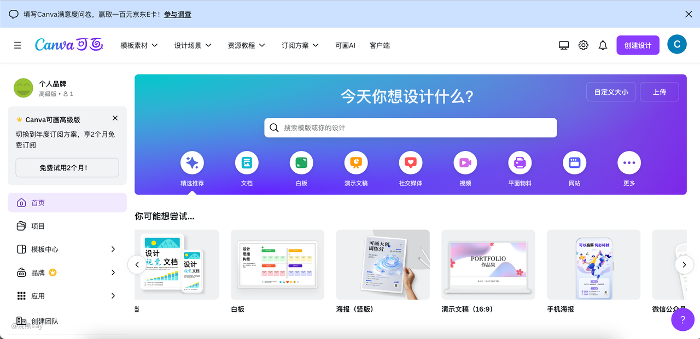
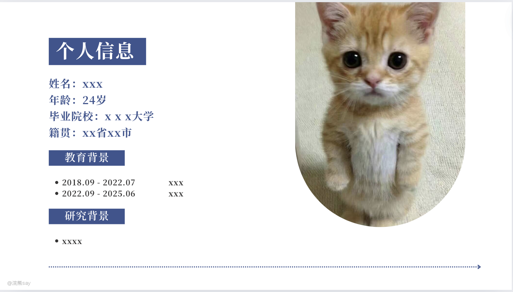
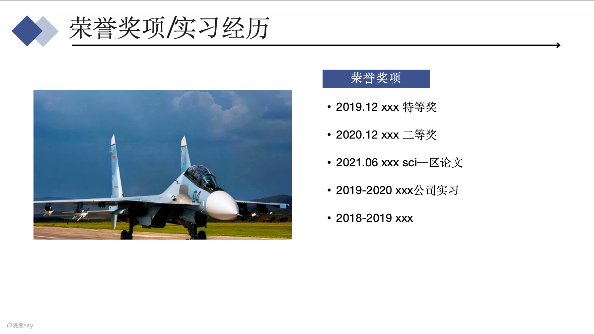
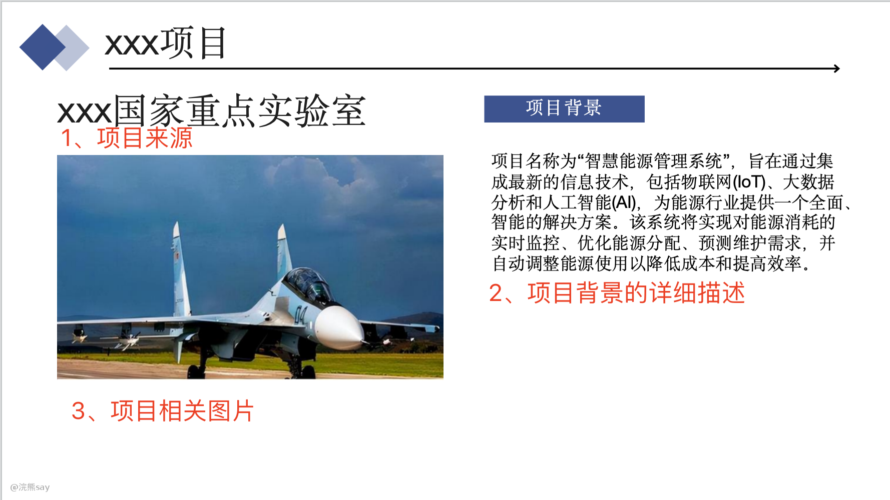
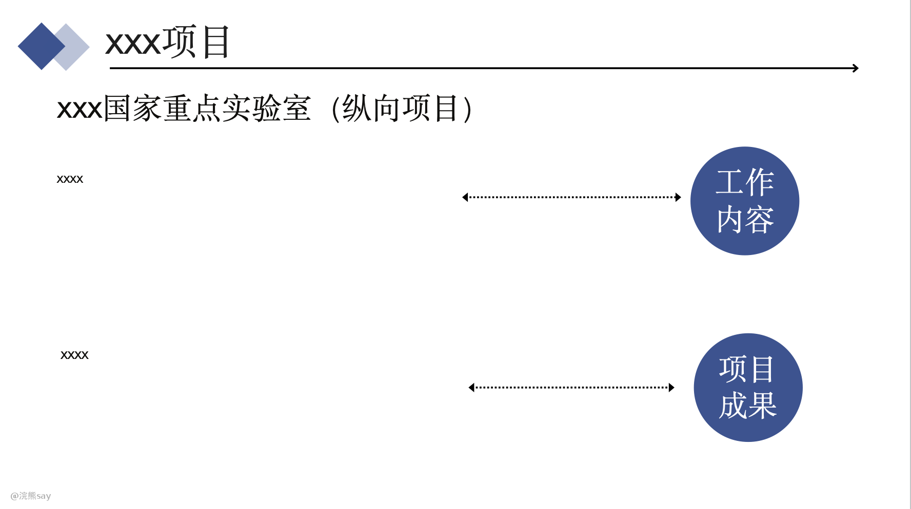

# 8.需要做ppt类国企面试准备攻略

有部分大央企要求应聘者在面试的时候需要自己制作一份ppt，然后线上或者线下的方式花费大概10min左右通过ppt来介绍自己。

实际上呢，ppt和简历基本上差不多的，优点在于面试官可以更加轻松容易的去了解你。

# ppt模版工具推荐——可画

直接浏览器搜索一下“可画”，这个网站的模板质量较高，并且一个月的费用也才20多块钱，是一个非常好的ppt模板网站，这里安利下。

# ppt该怎么做？

面试叫你做的ppt实际上是一个复杂版的自我介绍，重点应该包含以下几个部分的内容：个人信息、荣誉奖项（实习经历/科研经历）、项目经历和个人评价四个部分。

## 个人信息

由于我说了，ppt整个相当于一个大型的自我介绍，因此呢你的ppt的自我介绍这部分就需要简洁一点儿，重点给出自己的基本信息、教育经历和研究经历（实习经历）即可，如下：

当然，大家可以使用自己喜欢的模板，但是内容大差不差。

## 荣誉奖项/校园经历/实习经历

这一部分是对大家校园经历的一个概述，重点是突出你整个读书期间最为有亮点的事情。

而有亮点的事情包括这些：**大公司的实习经历**、校园经历、**SCI论文**和**荣誉奖项**等都能算作你的亮点。

这部分放在项目前面讲，就是为了告诉面试官，我大学/研究生这几年没白过，干了哪些事情，然后获得了哪些成果。

## 项目/科研经历

这一块应该是你整个ppt中的核心，最重要的还是通过项目来告诉面试官你发现问题，解决问题的能力。

而项目经历呢和我们自我介绍的部分是一样的，都遵循三段式原则：**项目背景+工作内容+工作成果（可量化）。**

对于项目多的同学，挑选2个项目详细介绍，其它项目简单介绍即可，每个都详细介绍面试官会觉得很烦。

## 项目背景

如上图所示，项目背景一般可以这样组织：

一是项目来源：如果是某国家重点实验室的项目，或者某互联网大厂的项目的话，面试官第一印象就会觉得含金量很高，对你有个很好的印象分。

二是项目背景：这里用尽可能言简意赅的文本描述你项目的背景内容，主要是让面试官清晰明了的知道你这个项目是干啥的，因为很多面试官不是你这个专业的，尽量简单明白的给他们讲清楚。

三是项目图片：俗话说一图胜千言，一张项目相关的图片能够给面试官最直接的印象，比文字更佳具有说服力。

至于为什么项目背景要单独一页是因为，很多面试官对你做的啥并不清楚，一定要让面试官对背景很了解，才能知道你后面的工作内容的价值和含金量。

## 工作内容&项目成果

工作内容和项目成果呢就可以放在一起写了，工作内容就是言简意赅的把你在实验室/实习期间负责做的事情说清楚，突出你解决问题和思考的能力。

项目成果呢，主要是你的这个项目做完所取得的一些可量化的成果，包括不限于：论文、奖项、指标提升、实习转正offer等等都可以算作项目成果。

### 个人评价

这部分呢没啥好说的，自己去组织就行了，主要是突出你的一些个人素质、兴趣爱好、集体活动之类的东西。

让面试官觉得你除了学习之外还是有自己的生活的人，国企其实不太喜欢太过于机械的人，还是希望你拥有一些自己的兴趣爱好，并且在内部呢也会被鼓励发展这些爱好的。

另外，多提一句，关于所有央企一定要突出自己的稳定性，这个非常重要，央企不喜欢人呆不了多久就跑了。

对于军工央企呢，突出自己的吃苦耐劳、甘于奉献、能出差、能加班的特点，并且有一点儿家国情怀是最好的。

# 面试要点——多练习

由于是照着ppt讲的，所以对于内向的同学来说压力会小很多，但是大家在参加面试之前，一定要自己对着ppt多练习几次，增加自己讲ppt的熟练程度。

有条件的话，可以让你的好朋友一起听听你讲得怎么样，让他给你提出问题和改进的意见。

# 常见问题

一般在照着ppt讲完之后呢，面试官会根据你讲解的内容来提出一些问题，但是这些问题一般不会太难，给大家举几个栗子。

1、我看你是xxx人，那么你以后的是打算在xxx定居吗？

2、能说说你做的项目和我们公司的联系吗？

3、你讲的xxx项目中，xxx问题是如何解决的？

4、讲讲你这些项目中遇到的最难的问题，你是怎么解决的？

5、对于工作中加班和出差问题你是怎么看待的？

上面是一些常见的央国企的问题，后面会出更加专业的文档给大家解析
