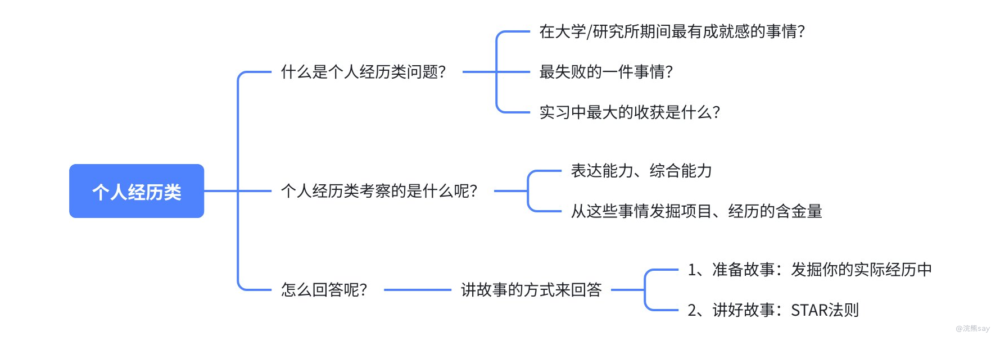

# 如何回答“个人经历”类问题

个人经历类问题，是央国企半结构化面试里最容易出现、也最容易拉开差距的一类题。这类题表面上是在问你的大学经历、实习经历、科研经历，本质上是在判断三件事：你的经历是不是真实，你做事有没有结果，你能不能从经历里总结出方法。很多同学回答这类问题时会犯一个毛病：把经历讲成流水账。比如“我参加了一个项目，负责资料整理，最后项目顺利完成，我收获很多”。这类回答听起来没错，但面试官听不出你的价值。 **个人经历类问题的核心，不是证明你经历很多，而是证明你在关键经历里真的做过事。**



## 一、常见问法

这类题一般会这样问：

-   请分享你大学/研究生期间最有成就感的一件事。
    
-   谈谈你印象最深的一次失败经历。
    
-   讲一次你遇到困难并解决的经历。
    
-   讲讲你某段实习经历，你最大的收获是什么？
    
-   你简历里这个项目具体是怎么做的？
    
-   你在团队中承担了什么角色？
    

面试官问这些题，不是为了听你把简历复述一遍，而是想看你能不能把一段经历讲清楚：背景是什么、你负责什么、你做了什么、最后结果怎样、你有什么复盘。

## 二、哪些经历适合拿来讲？

个人经历类素材，优先从简历里找。简历上出现过的内容，都可能被面试官追问，所以你写上去的每一段经历都要能经得起问。常见素材包括：

| 经历类型 | 适合突出什么 |
| --- | --- |
| 实习经历 | 岗位认知、执行力、沟通协调、业务理解 |
| 科研经历 | 问题解决、学习能力、专业基础、复盘能力 |
| 项目经历 | 技术应用、个人职责、结果产出、可追问细节 |
| 竞赛经历 | 目标设定、团队协作、压力应对、展示表达 |
| 学生工作 | 组织协调、责任心、服务意识、突发处理 |
| 志愿服务 | 稳定性、责任感、沟通能力、公共服务意识 |

这里需要注意，经历不一定越大越好。应届生的经历本来就有限，面试官更看重真实性和细节。一个普通课程项目，如果你能讲清楚自己负责的模块、遇到的问题和最后的结果，也比一个包装得很大的“团队项目”更有说服力。

## 三、答题框架：STAR+L

个人经历类问题，最稳的框架是 STAR+L。

| 模块 | 要回答的问题 |
| --- | --- |
| S 背景 | 当时是什么情况？为什么这件事重要？ |
| T 任务 | 你承担了什么责任？目标是什么？ |
| A 行动 | 你具体做了哪些动作？ |
| R 结果 | 最后结果如何？有没有数据、奖项、交付物？ |
| L 复盘 | 你学到了什么？以后怎么迁移到岗位？ |

这个框架不是让你机械背字母，而是帮你避免讲散，尤其是 Action 和 Result，一定要具体。面试官真正关心的是“你做了什么”和“做出了什么结果”，可以直接套这个表达：

我想分享一个{项目/实习/科研/竞赛}的经历，当时的背景是{S}，我主要负责{T}。为了完成这个任务，我做了三件事：第一{A1}，第二{A2}，第三{A3}。最后结果是{R}，这件事给我的收获是{L}，也让我意识到这个能力和贵单位{岗位/业务}是匹配的。

## 四、示例：科研项目怎么讲？

假设你想讲一个机器学习算法优化的科研经历，可以这样组织：

> 我想分享一个研究生阶段的机器学习算法优化项目。当时我们做的是一个面向大规模数据集的模型优化任务，原始模型在数据量变大后训练时间比较长，准确率也不稳定。我的任务主要是负责数据预处理和模型参数优化，为了推进这个项目，我做了三件事。第一，我先把原始数据做了清洗和特征筛选，减少无效特征对模型训练的影响；第二，我对比了几组常见模型参数，记录不同参数组合下的训练时间和准确率；第三，我和组内同学一起复盘实验结果，把表现较好的方案固化成最终实验流程。最后，模型在测试集上的准确率有明显提升，训练效率也比最初版本更稳定，相关结果支撑了后续论文撰写。这个经历让我意识到，科研项目里不能只追求模型名字好听，更重要的是能把问题拆清楚，用实验结果证明方案有效。

这个回答比“我参与了机器学习项目，提升了算法效果”要具体得多。面试官后续也可以追问数据处理、模型选择、参数优化、论文工作量等细节，你能接得住。

## 五、失败经历怎么讲？

失败经历是很多同学最害怕的题。其实面试官不是想看你有多惨，而是想看你能不能复盘。失败经历可以按这个结构回答：

1.  简单讲失败背景；
    
2.  说明失败原因，不甩锅；
    
3.  讲你采取了什么补救；
    
4.  讲后来怎么避免同类问题；
    
5.  落到成长和岗位。
    

示例：

```text
我之前有一次竞赛答辩准备得不够充分，虽然项目本身完成了，但答辩时评委追问商业落地场景，我回答得比较散，最后成绩没有达到预期。复盘之后，我发现问题不是项目本身，而是我只准备了技术实现，没有提前准备应用场景、成本收益和落地难点。后面再准备答辩时，我会把项目拆成“问题背景、解决方案、个人工作、结果数据、落地价值”五部分，并提前模拟追问。这件事对我影响挺大。后来我在面试准备项目介绍时，也会提前把可能被问到的问题列出来，避免只讲自己熟悉的技术部分。
```

这类回答要注意，不要把失败全部归因给队友、老师或外部环境。央国企面试很看重担当意识，失败可以讲，但复盘要落到自己身上。

## 六、常见坑

第一，不要讲流水账。经历类回答不是从“我们什么时候开始做”一路讲到“最后结束”，而是要围绕一个核心能力展开。第二，不要只讲团队。可以说团队完成了什么，但一定要讲清楚你负责什么。面试官评价的是你，不是整个团队。第三，不要夸大经历。普通项目可以润色，但不要包装成企业核心系统；短期实习可以讲收获，但不要说成自己主导了整个部门项目。第四，不要没有结果。结果不一定非要是奖项和论文，也可以是交付物、效率提升、流程优化、被团队复用、老师认可、通过验收。第五，不要忘记复盘。个人经历类题最后一定要补一句你学到了什么，否则很容易停留在“做过事”，体现不出成长。

## 七、准备清单

面试前建议把自己的经历按下面这张表整理一遍：

| 经历 | 可回答题型 | 我的职责 | 关键动作 | 结果 | 可追问点 |
| --- | --- | --- | --- | --- | --- |
| 科研项目 | 困难、成就、学习能力 | 负责数据/模型/实验 | 做了哪些具体工作 | 论文/实验结果/交付 | 技术细节、分工 |
| 实习经历 | 岗位认知、沟通协调 | 负责什么任务 | 如何推进 | 报告/系统/流程优化 | 部门、业务、结果 |
| 竞赛经历 | 团队合作、压力应对 | 担任什么角色 | 如何分工和答辩 | 奖项/排名/作品 | 团队矛盾、复盘 |

最后总结一句：**个人经历类问题，不怕经历普通，怕你讲不出自己的动作和复盘。**
