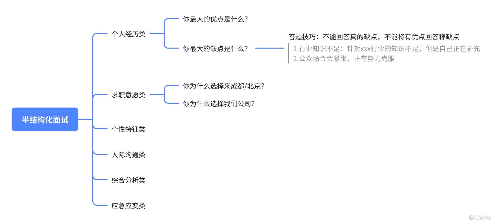

# 半结构化面试准备方法论

很多同学准备半结构化面试时，第一反应就是去网上搜“标准答案”，这个思路一开始看起来很省事，但真正到面试现场，很容易变成背稿，半结构化面试和技术八股不一样。技术八股很多题有明确答案，背熟了至少能说到点上；半结构化面试问的是你的经历、选择、性格、沟通、稳定性和岗位匹配，题目变化非常多，面试官还会根据你的回答继续追问，你如果只背标准答案，前两句可能还像样，一追问细节就会露怯，所以准备半结构化面试的核心，不是背答案，而是建立自己的面试素材库。

## 一、半结构化面试为什么不能只背模板？

第一，题目太散，面试官可能问“你为什么选择我们单位”，也可能问“你最大的缺点是什么”，还可能直接追问“你这个项目里到底负责什么”，这些题目看起来不在一个系统里，但背后都指向同一件事：判断你这个人能不能稳定、真实、靠谱地进入岗位；

第二，答案必须来自你自己，比如同样是回答“抗压能力”，有人可以讲科研赶 ddl，有人可以讲实习多任务并行，有人可以讲竞赛临场改方案。经历不同，答案就不可能完全一样。强行套用别人的范文，面试官很容易听出来。

第三，半结构化面试非常容易追问，你说自己负责了核心模块，面试官可能问“核心在哪里”；你说自己协调了团队，面试官可能问“具体怎么协调”；你说自己想长期留在某城市，面试官可能问“为什么不回家乡”。没有真实素材支撑，回答会越来越虚，这里给大家一个判断标准：**半结构化答案可以借框架，但不能借经历。**

## 二、先搭一棵“题型树”

准备半结构化面试，建议先把题目分门别类，不要今天看到一个问题背一个答案，明天看到另一个问题又从头准备，这样效率很低。

常见题型可以先分成这几类：

| 题型 | 常见问法 | 核心考察 |
| --- | --- | --- |
| 自我介绍 | 请做一个简单自我介绍 | 你能否快速呈现岗位匹配点 |
| 个人经历类 | 最有成就/最失败/最困难的一件事 | 真实经历、复盘能力、结果意识 |
| 求职意愿类 | 为什么来我们单位/为什么留这个城市 | 稳定性、岗位认知、长期意愿 |
| 个性特征类 | 优点、缺点、他人评价 | 自我认知、岗位匹配、表达分寸 |
| 沟通协调类 | 和领导/同事意见不一致怎么办 | 组织意识、协作意识、解决问题 |
| 应急应变类 | 突发任务、系统故障、临时变化 | 优先级、冷静程度、资源协调 |
| 综合分析类 | 对行业热点/社会现象怎么看 | 逻辑表达、政策敏感度、思考深度 |
| 压力面试类 | 质疑学历、经历、稳定性 | 情绪稳定、抗压能力、回应方式 |

这张表不用背，但要用它做自己的准备清单，你至少要保证每一类问题都有基本思路，不要某一类完全空白。

## 三、再建一个“故事银行”

半结构化面试里，最有用的不是漂亮话，而是可验证的经历，建议大家从自己的简历里挑 3-5 个经历，做成故事银行，可以优先挑这些素材：

-   科研项目：适合讲问题解决、学习能力、技术难点、复盘总结；
    
-   实习经历：适合讲岗位认知、沟通协调、执行力、业务理解；
    
-   竞赛经历：适合讲目标设定、团队协作、领导力、压力应对；
    
-   课程项目：适合讲学习能力、技术实践、项目推进；
    
-   学生工作/社团经历：适合讲组织协调、沟通表达、应急处理；
    
-   志愿服务/社会实践：适合讲责任心、服务意识、团队配合。
    

每个故事不要写成长篇作文，按 STAR+L 提纲整理就够了：

> 故事名称：
> 适用题型：
> S 背景：当时是什么情况？
> T 任务：我负责什么，要达成什么目标？
> A 行动：我做了哪 2-3 个关键动作？
> R 结果：最后有什么结果，能否量化？
> L 复盘：这件事给我什么启发，能迁移到岗位哪里？
> 可追问点：面试官可能追问什么细节？

这套方法的好处是，一个故事可以回答多个问题，比如一个竞赛经历，可以回答“团队合作”“遇到困难”“领导力”“最有成就感”“如何处理分歧”等多个题，你不是准备几十个答案，而是准备几个能打的素材。

## 四、回答时按“结论-证据-匹配”走

半结构化回答最怕绕，很多同学一紧张，就开始从头讲背景，讲半天还没说到重点，面试官听不出你想表达什么，分数自然不会高。比较稳的表达顺序是：

1.  先给结论：直接回答问题；
    
2.  再给证据：用一段真实经历证明；
    
3.  最后落到岗位：说明这件事和目标岗位有什么关系。
    

比如问“你最大的优点是什么”，不要只说“我执行力强”，可以这样讲：

> 我最大的优势是执行力比较强，尤其是在任务多、时间紧的情况下，能把目标拆清楚并按节点推进。
> 比如我之前做课程项目时，团队一开始进度比较慢，我主动把功能模块、负责人和截止时间整理成表，每两天做一次小验收，最后项目按时完成，并且拿到了课程优秀。
> 所以如果进入岗位，我觉得自己能比较快适应项目节奏，先把交给我的任务稳稳完成，再逐步承担更复杂的工作。

这个答案的关键不是“执行力强”四个字，而是后面的证据和岗位承接。

## 五、练习方法：不要默看，要开口

半结构化面试一定要开口练，你在脑子里想得很顺，和真正说出来完全是两回事，建议按这个步骤练：

1.  每类题先写 3-5 行提纲，不写完整背诵稿；
    
2.  对着手机录音，每题控制在 1.5-2 分钟；
    
3.  听回放，删掉“然后、就是、嗯、反正”等口头禅；
    
4.  检查有没有具体证据，不能只有态度；
    
5.  找同学模拟追问，尤其追问简历、项目和稳定性；
    
6.  面试前一天只看提纲，不再临时大改答案。
    

这里要强调一点：**半结构化不是越会背越好，而是越自然越好。**你可以提前准备，但不要把自己训练成机器人，面试官要的是一个表达清楚、真实可信、能进入团队的人。

## 六、最后给一个准备清单

面试前至少完成这几件事：

-   把目标单位、岗位职责、工作地点和招聘公告再看一遍；
    
-   准备一版 1 分钟自我介绍；
    
-   准备 3-5 个 STAR+L 故事；
    
-   每个故事标注能回答哪些题；
    
-   准备“为什么来我们单位”“为什么选择这个城市”“职业规划”三类稳定性问题；
    
-   准备自己的优点、缺点、他人评价；
    
-   准备 2-3 个可能被质疑的短板解释；
    
-   开口录音练习至少 3 轮。半结构化面试看起来随意，其实很吃准备。真正有效的准备，不是背一堆标准答案，而是把自己的经历拆清楚、讲顺、讲具体。
    

最后记住一句话：**框架是给你兜底的，真实经历才是让面试官相信你的东西。**
