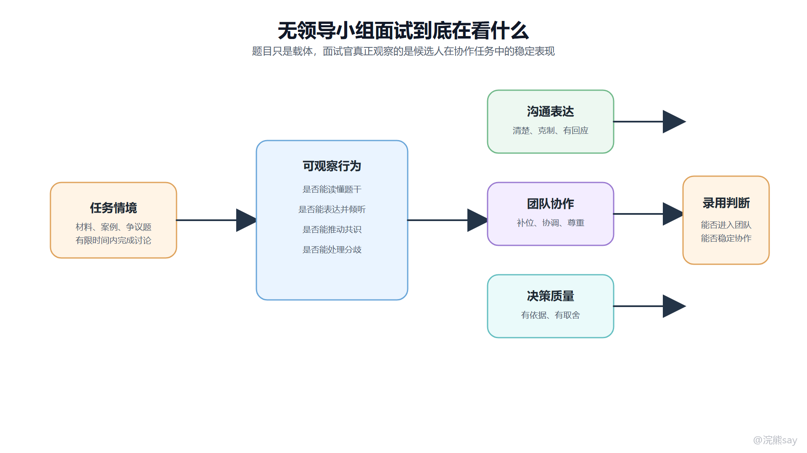
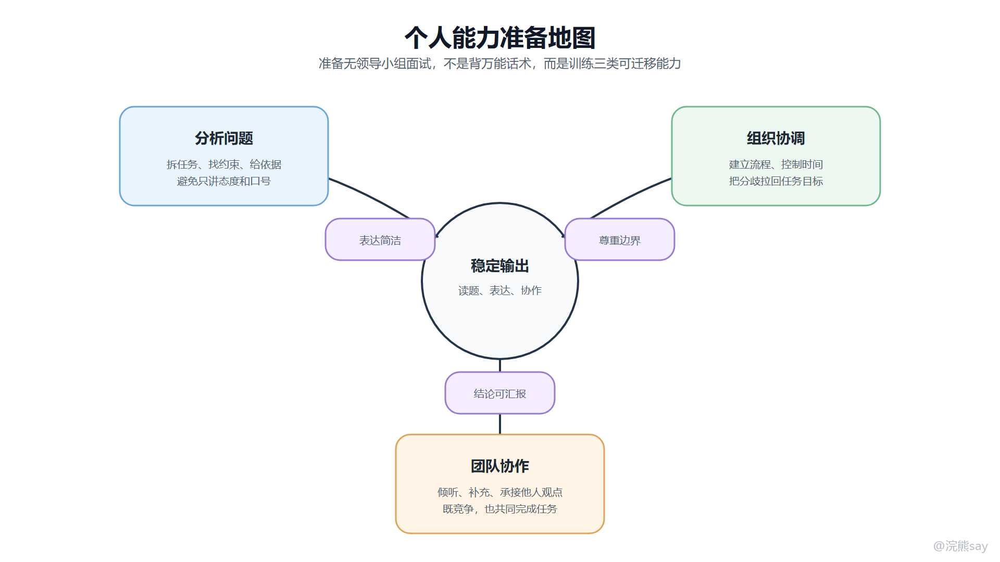
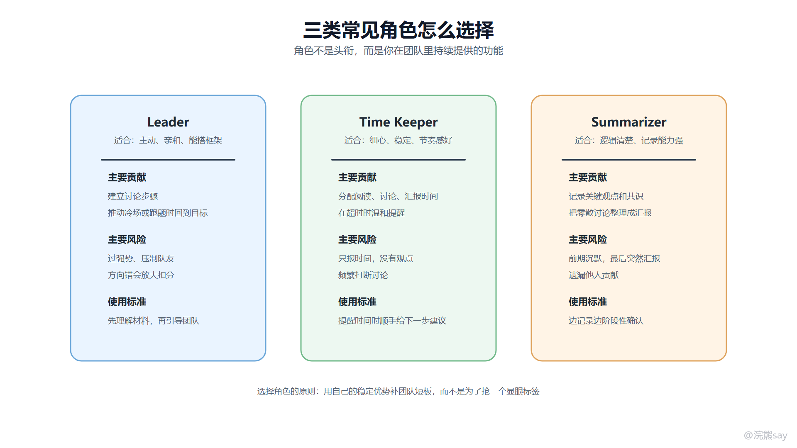

# 无领导小组到底应该如何准备？

无领导小组面试的准备，核心不是把自己训练成一个“特别会抢话的人”，而是让自己在材料阅读、观点表达、团队协作和总结汇报几个环节里都能稳定发挥。

很多同学第一次接触群面时，会把注意力放在“我要不要当 leader”“我是不是必须第一个发言”这些问题上。更稳妥的准备顺序应该是：先理解面试目的，再训练基础表达，最后根据自己的性格选择合适角色。

## 一、先理解面试目的

群面题目本身只是观察载体。面试官真正想看的是候选人在协作任务里的行为模式：你能不能读懂材料，能不能用清楚的语言表达观点，能不能和陌生人合作，能不能在有限时间内推动团队形成结果。

images/group\_interview\_purpose.png

所以准备群面时，不能只准备“说什么”，还要准备“什么时候说、怎么接别人、怎么推动团队”。同样一句话，如果在团队卡住时说出来，就是推进；如果在别人还没讲完时抢着说出来，就可能变成打断。

## 二、面试前准备

面试前准备分为现场准备、材料准备和能力准备三类。
| 准备项 | 具体做法 | 目的 |
| --- | --- | --- |
| 路线和时间 | 提前查路线，至少预留半小时缓冲 | 避免迟到导致状态失控 |
| 面试通知 | 核对时间、地点、证件、简历、纸笔和线上会议要求 | 避免低级遗漏 |
| 公司信息 | 查公司业务、岗位方向、往年面经和常见题型 | 发言时能结合场景 |
| 分析框架 | 熟悉 SWOT、5W1H、利益相关方、成本收益、风险控制等框架 | 阅读材料后能快速搭结构 |
| 模拟练习 | 找同学或同伴做限时讨论和复盘 | 训练真实节奏和临场表达 |

准备框架时不要把它们背成名词。比如 SWOT 不只是“优势劣势机会威胁”，真正有用的是它能帮助你把一个方案拆成内部条件和外部环境；5W1H 也不是为了显得专业，而是帮助你把活动方案讲完整。

## 三、个人能力准备地图

无领导小组面试最终落到三类能力：分析问题、组织协调和团队协作。准备时可以围绕这三类能力训练，而不是只盯着“我要不要当 leader”。

images/personal\_competency\_map.png

分析问题能力决定你能不能提出有信息量的观点；组织协调能力决定你能不能在讨论混乱时提供秩序；团队协作能力决定你能不能承接、补充和推动共识。三类能力不一定都要靠大量发言体现，有时一次准确的归纳、一次温和的时间提醒，也能体现候选人的成熟度。

## 四、自我介绍怎么准备

有些群面会安排简短自我介绍，有些不会。即使没有自我介绍环节，提前准备一版 30 秒和一版 60 秒版本也很有必要，因为它能帮助你在开场阶段快速进入状态。

自我介绍建议采用“基本信息 + 相关经历 + 群面优势 + 结束语”的结构。

各位老师、各位同学大家好，我是 XXX，来自 XXX 学校 XXX 专业。  
我过去在 XXX 项目/实习中主要负责 XXX，这段经历让我比较熟悉 XXX 领域，也锻炼了我在团队中拆解问题、整理信息和推动协作的能力。  
今天的讨论中，我会尽量结合材料提出有依据的观点，也会认真听取大家的意见，帮助小组形成清晰结论。  
谢谢大家。

自我介绍不要堆太多简历细节，也不要讲过度夸张的个人故事。群面里的自我介绍更像一个职业化开场，重点是让面试官知道你是谁、你和岗位有什么关系、你在团队里可能提供什么价值。

## 五、材料阅读怎么做

群面材料阅读时间通常很短，常见是 5 到 10 分钟。阅读时不要从第一句话开始慢慢读到最后，而要先建立任务意识。

一个比较稳的阅读顺序是：

1.  先看最后的问题，确认到底要分析原因、提出方案、排序选择，还是辩论表态。
2.  再看材料中的限制条件，例如时间、预算、对象、监管要求、数量要求。
3.  标记能支持观点的数据、事实、案例和冲突点。
4.  最后形成自己的初步结构，准备 2 到 3 个可表达观点。

如果材料是英文或数据较多，不要追求每个词都看懂。群面不是阅读理解考试，重点是抓住任务、条件和可引用的信息。遇到不确定内容，可以在讨论中用“材料中提到的这个数据可能说明……”这样的方式谨慎表达。

## 六、根据性格选择角色

群面里常见的角色包括 Leader、Time Keeper 和 Summarizer。角色本身没有绝对高低，关键是你能不能把这个角色做实。

images/role\_selection\_strategy.png

### 1\. Leader

Leader 的价值在于搭建讨论框架、控制讨论方向、推动团队达成共识。适合表达主动、逻辑清楚、能够兼顾他人感受的候选人。

但 Leader 风险也最高。如果对材料理解不深就强行带节奏，很容易把团队带偏；如果过于强势，也会破坏团队氛围。因此，想担任 Leader，必须先确保自己已经理解题目，再用建议式语言引导团队。

可以这样表达：

我建议我们先用两分钟统一一下题目目标，再分别讨论原因、方案和风险，最后留三分钟形成汇报结论。大家看这个节奏是否合适？

### 2\. Time Keeper

Time Keeper 的价值不只是报时间，而是帮助团队保持节奏。只说“还剩五分钟”信息量不够，更好的提醒是把时间和下一步动作结合起来。

我们现在还剩五分钟，前面原因已经讨论得比较充分了，建议接下来先确定三条核心方案，再留一分钟给总结同学整理汇报。

这样既提醒了时间，也推动了讨论进入下一阶段。

### 3\. Summarizer

Summarizer 的价值在于记录、归纳和汇报。适合逻辑清楚、表达稳定、记录速度较快的候选人。

但 Summarizer 不能前期一直沉默，最后突然站出来汇报。更好的做法是在讨论中阶段性确认：

我先简单确认一下目前的共识：第一，我们认为主要问题是 XXX；第二，方案上大家比较认可 XXX；第三，风险控制需要补充 XXX。这个理解有遗漏吗？

这种确认既能帮助团队校准方向，也能为最后汇报打基础。

## 七、自由讨论中怎么参与

自由讨论阶段最容易拉开差距。很多同学会陷入两个极端：一种是完全不敢说，另一种是为了表现不断插话。更稳定的策略是根据团队状态选择发言功能。
| 团队状态 | 你可以做什么 | 示例表达 |
| --- | --- | --- |
| 刚开始没人搭框架 | 提议讨论顺序 | “我们可以先明确评价标准，再看每个选项。” |
| 大家观点很多但散 | 做阶段总结 | “目前意见可以分成两类，一类关注成本，一类关注效果。” |
| 出现争执 | 把争执转成标准比较 | “两位其实都在讨论风险，只是侧重点不同，我们能否从短期和长期分别看？” |
| 有人一直沉默 | 温和邀请 | “刚才小王同学一直在记录，你这边有没有补充？” |
| 时间不够 | 推动收敛 | “这个点可以先记为风险项，我们先确定最终方案。” |

如果你一开始没有思路，可以先认真听别人发言，记录可承接的点。承接别人观点并补充，也是一种有效参与。

我同意刚才同学提到的用户体验角度。我想补充一点，如果这是银行业务场景，除了体验，还要考虑合规和风险控制，所以方案里最好加入身份核验和数据权限边界。

这类表达比单纯重复“我同意”更有价值。

## 八、总结陈词怎么准备

总结陈词不是把每个人说过的话机械复述一遍，而是把团队共识整理成清晰结构。一个通用结构是：讨论主题、分析框架、核心结论、方案或排序、风险补充、结束。

中文模板可以这样准备：

各位面试官好，我代表本组做总结汇报。  
  
本次讨论的主题是 XXX，我们小组围绕题目要求，主要从 XXX、XXX 和 XXX 三个维度进行了分析。  
  
经过讨论，我们形成以下结论：  
第一，XXX，主要依据是 XXX。  
第二，XXX，主要考虑到 XXX。  
第三，XXX，在执行过程中需要注意 XXX 风险。  
  
总体来看，我们认为 XXX 是当前更合适的选择。以上是本组汇报，谢谢各位老师。

如果遇到英文总结，可以使用简单稳定的表达，不要追求复杂句式：

Good afternoon, interviewers. I will summarize our group discussion.  
  
Our topic is XXX. We discussed it from three perspectives: XXX, XXX and XXX.  
  
First, we believe that XXX, because XXX.  
Second, we suggest XXX, mainly considering XXX.  
Third, we also noticed the risk of XXX, so we propose XXX.  
  
In conclusion, our group agrees that XXX is the most suitable solution. Thank you.

总结时要避免两个问题：一是过度加入个人私货，导致汇报不代表团队；二是没有结构，只是把讨论过程流水账讲一遍。

## 九、面试官追问怎么回答

群面结束后，面试官可能会问一些互评或自评问题。回答时要客观、克制、具体。

### 1\. 你认为小组里谁表现最好？

可以说自己，也可以说别人，关键是给出具体行为依据。

我认为 XXX 同学表现比较好。原因是他在讨论初期帮助我们建立了分析框架，中段也多次把跑偏的话题拉回题目目标，最后还补充了风险控制维度，对团队形成结论帮助比较大。

### 2\. 你认为谁表现相对不足？

不要带情绪评价，更不要嘲讽。可以从客观表现和改进建议说。

如果一定要说相对不足，我觉得 XXX 同学今天发言偏少，可能是因为前面讨论节奏比较快。不过他在记录和补充材料信息上有贡献，如果后面能更主动表达自己的判断，表现会更完整。

### 3\. 你自己哪里做得好，哪里需要改进？

回答要有自我认知，不要只说优点。

我觉得自己做得比较好的地方是能持续记录团队观点，并在中段做了一次阶段性总结，帮助大家统一了方向。需要改进的是开场发言还可以更靠前一些，后续我会加强限时表达训练，让观点更早进入讨论。

### 4\. 是否接受调剂到柜员或营销岗位？

银行或运营商等单位可能会问岗位调剂。回答时要结合个人职业目标和单位实际，不要简单说“都可以”。

我更希望优先匹配与专业能力和长期发展更一致的岗位，但如果单位确实有培养安排和岗位需要，我也愿意了解调剂岗位的具体职责、培养路径和发展空间，再做认真评估。

## 十、训练计划

如果距离面试还有一到两周，可以按以下顺序训练：
| 阶段 | 训练内容 | 标准 |
| --- | --- | --- |
| 第 1-2 天 | 熟悉流程和常见题型 | 能说清群面每个阶段的任务 |
| 第 3-5 天 | 练习材料阅读和 1 分钟陈述 | 能在 5 分钟内完成读题和初步观点 |
| 第 6-8 天 | 练习开放题、排序题、辩论题 | 每类题至少做 2 道 |
| 第 9-10 天 | 进行完整模拟和复盘 | 记录自己的发言次数、有效发言和问题 |

群面准备的最终目标，是让自己在陌生环境里也能稳定提供价值。你可以不是最强势的人，但要让面试官看到你能理解任务、尊重团队、推动讨论，并把结果讲清楚。
