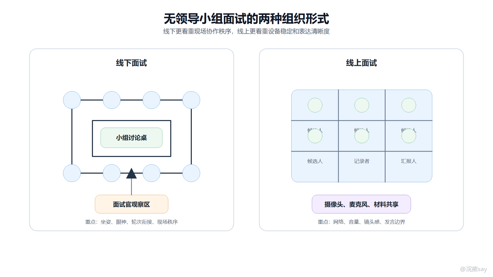
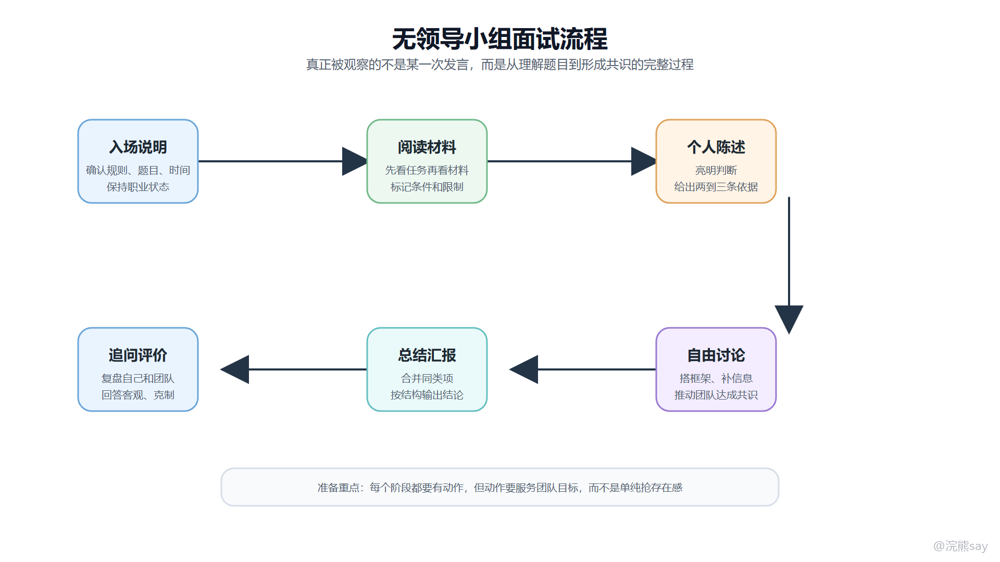
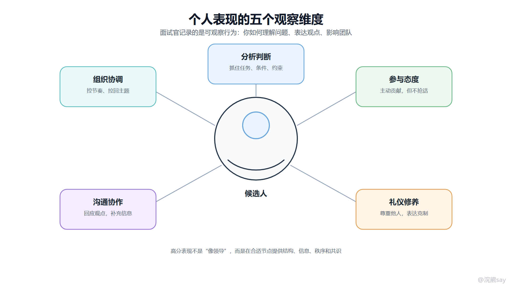
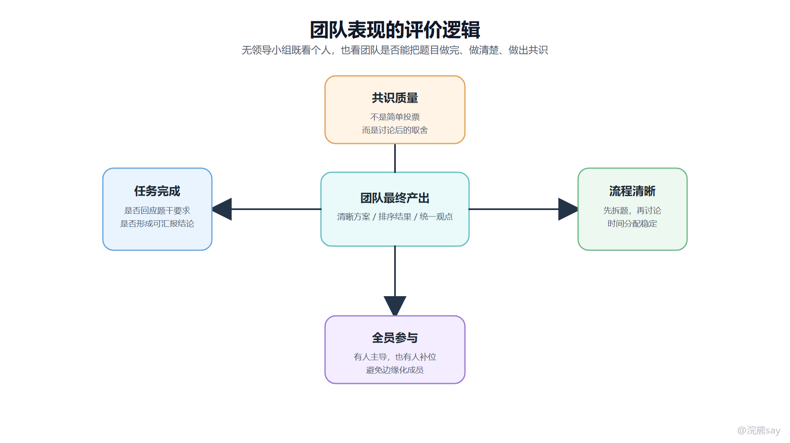

# 无领导小组面试（群面）概述

ZQ # 无领导小组面试（群面）概述

无领导小组面试，也常被称为群面，是一种通过集体讨论观察候选人综合表现的面试形式。它不会提前指定组长，而是把多名候选人放在同一个任务情境里，让大家在有限时间内阅读材料、表达观点、讨论分歧并形成小组结论。

这类面试考察的重点不是谁说得最多，也不是谁看起来最像“领导”。面试官更关心的是：候选人能不能快速理解题目，能不能把观点说清楚，能不能在陌生团队里推动讨论，能不能在冲突中保持职业化表达，并最终帮助团队产出一个可汇报的结果。

## 一、无领导小组面试的基本形式

从组织方式上看，无领导小组面试主要分为线下和线上两类。两种形式的考察逻辑相同，但现场注意点不完全一样。

images/group\_interview\_forms.png

线下群面通常安排在会议室或培训室，一组候选人围绕桌面讨论，面试官坐在一侧观察。线下形式会放大候选人的现场状态，例如坐姿、眼神交流、插话方式、记录习惯和对团队节奏的感知。

线上群面通常通过腾讯会议、钉钉、Zoom 等视频会议工具进行。线上形式更容易出现设备、网络、抢话和延迟问题，因此候选人要提前检查摄像头、麦克风、网络和桌面材料，发言时也要更注意停顿和衔接，避免多人同时开口。

## 二、标准流程

不同单位的群面流程会有差异，但主线基本一致：先说明规则，再阅读材料，随后个人陈述、自由讨论、总结汇报，最后可能进入追问或互评。

images/group\_interview\_process.png
| 阶段 | 候选人要做什么 | 面试官主要观察什么 |
| --- | --- | --- |
| 入场说明 | 听清规则、时间、任务和提交方式 | 是否认真、是否有基本职业状态 |
| 阅读材料 | 先看问题，再标记关键信息、限制条件和任务目标 | 是否能抓住题干核心，而不是只复述材料 |
| 个人陈述 | 用较短时间亮明观点，并给出两到三条依据 | 表达是否清晰，观点是否有结构 |
| 自由讨论 | 承接他人观点，补充信息，推动团队达成共识 | 是否能协作、协调分歧、控制节奏 |
| 总结汇报 | 将讨论结果合并同类项，按逻辑顺序汇报 | 结论是否完整，汇报是否清楚 |
| 追问评价 | 复盘自己和团队表现，回答互评问题 | 是否客观、克制、有反思能力 |

准备群面时，不建议只背“万能话术”。更稳定的做法是熟悉每个阶段的目标：阅读阶段要找到任务，陈述阶段要输出观点，讨论阶段要帮助团队形成结构，汇报阶段要把零散讨论转化为清晰结论。

## 三、个人考察维度

个人维度主要看候选人在讨论中的可观察行为。面试官不会只根据某一句话判断，而是综合记录候选人在整个讨论链路中的稳定表现。

images/individual\_assessment\_matrix.png

### 1\. 分析判断

分析判断能力体现在能否读懂材料、抓住问题本质，并提出有依据的观点。比如面对“银行未来应发展专业化银行还是跨界银行”这类题目，只说“跨界更有前景”是不够的，还要说明客户需求、监管边界、风险控制和业务协同之间的关系。

### 2\. 参与态度

参与态度不是发言次数越多越好，而是能否在关键节点提供有效信息。高质量参与通常包括：补充被遗漏的条件、总结前面几位同学的共识、提醒团队回到题目目标，或者在分歧处给出可讨论的折中方案。

### 3\. 礼仪修养

礼仪修养主要体现在倾听和表达边界上。不要打断他人，不要用“你这个不对”直接否定，也不要在别人发言时频繁低头玩手机。更好的表达是先承接，再提出补充，例如：“我理解你刚才强调的是成本因素，我想再补充一个风险控制角度。”

### 4\. 沟通协作

群面里既有竞争，也有协作。候选人需要展示个人能力，但不能把团队讨论变成个人展示。能回应他人观点、帮助沉默成员加入、把冲突转化为可比较的标准，往往比单纯抢发言更有价值。

### 5\. 组织协调

组织协调能力不等于强行当组长。它可以体现在很多细节里：开局建议讨论框架，中段提醒时间，跑题时拉回任务，分歧较大时提议先确定评价标准。这些动作如果做得自然，会让面试官看到候选人的推进能力。

## 四、团队考察维度

无领导小组面试还会看团队整体表现。一个候选人即使个人发言不错，如果严重破坏团队协作，也可能被扣分。

images/team\_assessment\_matrix.png

团队层面通常看四件事：第一，是否完成了题目要求；第二，讨论流程是否清晰；第三，共识是不是经过真实讨论形成的，而不是简单举手投票；第四，是否有基本的全员参与，避免某些成员完全被边缘化。

因此，群面中的高分表现通常不是“压住所有人”，而是在团队需要结构时给结构，需要推进时给推进，需要降温时给降温，需要汇报时把结果讲清楚。

## 五、常见题型

无领导小组面试题型很多，但备考时可以先抓住三类主干题型。
| 题型 | 典型任务 | 核心能力 |
| --- | --- | --- |
| 开放讨论型 | 围绕材料分析原因、提出方案、设计活动或营销策略 | 拆题、发散、归纳、方案表达 |
| 选择排序型 | 从多个选项中选择若干项，或按重要性排序 | 评价标准、取舍逻辑、共识达成 |
| 辩论对抗型 | 正反双方分别立论，再尝试形成统一结论 | 论证、反驳、让步、融合观点 |

三类题型的准备方式不同。开放讨论型要训练“问题分析到方案设计”的链路；选择排序型要先建立评价标准，再讨论选项；辩论型不能只顾攻击对方，还要为最后统一观点预留融合空间。

## 六、准备优先级

无领导小组面试的准备可以按优先级推进。
| 优先级 | 准备内容 | 合格标准 |
| --- | --- | --- |
| P0 | 熟悉流程、题型和基本礼仪 | 知道每个阶段该做什么，不出现明显失礼行为 |
| P1 | 训练材料阅读和结构化表达 | 1-2 分钟内能讲清观点、依据和结论 |
| P2 | 积累常见题型框架 | 开放题、排序题、辩论题都有可套用的分析路径 |
| P3 | 模拟练习和复盘 | 能发现自己的角色倾向、发言短板和节奏问题 |

总体来看，群面不是临场“表演型”面试，而是协作任务中的稳定输出。准备时把重点放在读题、表达、协作和总结四件事上，比背一堆漂亮话更可靠。
