# 操作系统概念与功能

OS是操作系统（Operating System）的缩写，是一种系统软件程序，主要负责控制计算机的操作和运行，管理硬件和软件资源，提供公共服务，同时也是计算机系统的核心。操作系统需要处理内存管理、资源优先级、输入输出控制、网络操作、文件系统管理等基本事务，并提供用户与系统互动的操作界面。

## 操作系统的主要组成部分

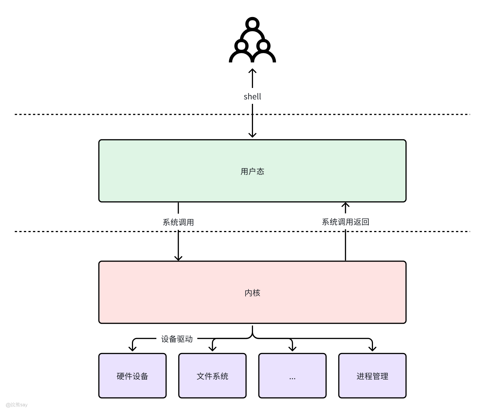

1.  **内核（Kernel）：** 操作系统的内核是最底层的部分，负责最基础的系统调用和服务，如进程管理、内存管理、中断处理等。
2.  **系统调用接口（System Call Interface）：** 提供用户程序与内核之间的接口，允许用户程序请求操作系统的服务。
3.  **设备驱动程序（Device Drivers）：** 控制和管理硬件设备，如磁盘、键盘、鼠标等，使操作系统能够与硬件交互。
4.  **文件系统（File System）：** 组织和管理文件，提供文件的创建、删除、读写等功能。
5.  **外壳（Shell）：** 提供用户与操作系统交互的界面，可以是命令行界面（如Unix Shell）或图形用户界面（如Windows Explorer）。

| 【真题示例】计算机的操作系统是一种()。A.应用软件B. 系统软件C. 工具软件D. 字表处理软件答案：B. 系统软件解析：首先得明确计算机软件的核心分类 —— 系统软件和应用软件是两大核心类别，这道题本质是考二者的区别。操作系统（比如 Windows、Linux、iOS）的核心作用是 “管理计算机硬件和软件资源”，给其他所有软件提供运行环境，就像电脑的 “大管家”，没有它，办公软件、游戏这些都没法用，这正是系统软件的定义：为计算机使用提供基础支持、不针对特定应用场景的软件。 |
| --- |

## 操作系统的主要功能

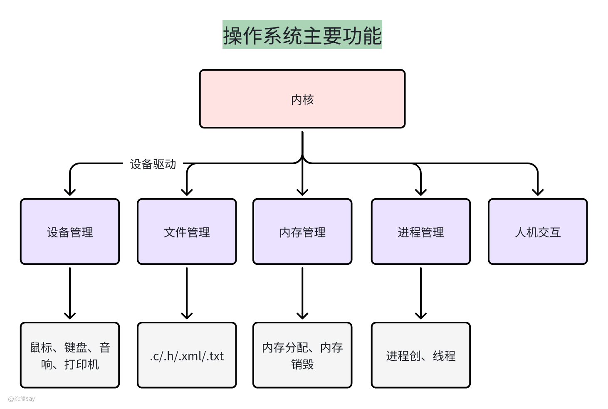

**1、进程管理**

进程管理负责创建全新进程，依据特定算法对进程精准调度，合理分配 CPU 时间。借助信号量、管道等技术实现进程同步，防止冲突。还能安全终止进程，管理进程间通信，确保系统内各任务有序运行，维持系统高效运转。

**2、内存管理**

内存管理在程序运行时，动态分配内存空间，确保程序数据能正确存储。当程序结束，及时回收内存，避免浪费。通过虚拟内存技术，将部分暂时不用的数据存至磁盘，扩大可用内存，显著提升内存整体利用率，让系统能同时承载更多任务。

**3、 文件管理**

文件管理以树状等结构组织文件，方便用户查找。将文件按规则存储于磁盘等存储设备，建立索引用于快速检索。支持文件内容更新，提供如创建、删除、复制等文件系统服务，为用户和应用程序提供便捷的文件操作途径。

**4、 设备管理**

设备管理识别并连接各类外部设备，如打印机、硬盘等。通过驱动程序控制设备工作，针对不同设备特性，实现共享设备的并发访问，避免冲突；对独占设备合理分配，保障设备安全高效运行，充分发挥设备性能。

**5、 操作系统与用户之间的接口管理**

操作系统提供命令行和图形化两种接口。命令行接口供专业用户精准输入指令操作，图形化接口以直观图标、菜单展示，方便普通用户交互。接口管理确保用户指令能被系统识别执行，将系统反馈清晰呈现给用户，提升用户使用体验。
| 【真题示例】操作系统的主要功能模块有( )。A.进程管理、存储器管理、设备管理、处理机管理B.虚拟存储管理、处理机管理、进程调度、 文件系统C.处理机管理、存储器管理、设备管理、文件系统D.进程管理、中断管理、设备管理、 文件系统答案：C. 处理机管理、存储器管理、设备管理、文件系统解析：无 |
| --- |

# 操作系统的特性

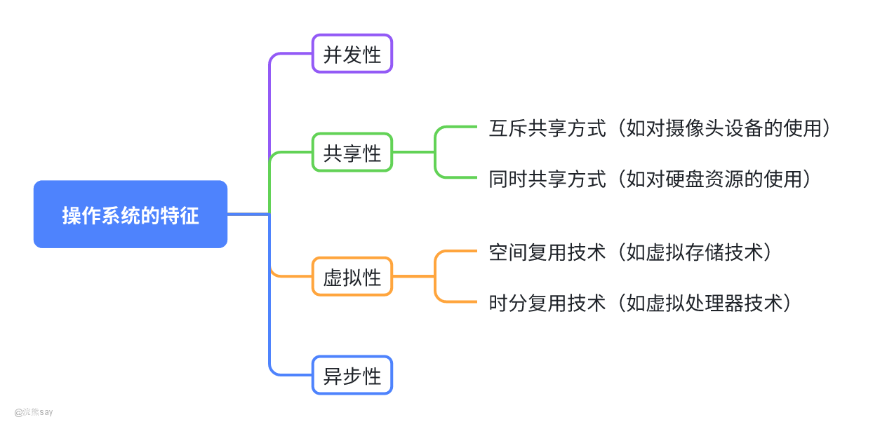

1、 **并发性**

所谓并发性是指操作系统能够同时处理多个程序或任务的执行能力（宏观上 “同时”，微观上通过 CPU 调度交替执行），例如：

-   多任务处理：用户可同时打开浏览器、文档编辑软件、音乐播放器等，操作系统负责协调这些任务的资源分配。
-   实现基础：进程管理机制，通过进程调度算法（如时间片轮转）让多个进程 “交替” 使用 CPU，营造并发的假象。

2、**共享性**

在操作系统环境下，共享是指系统中的资源可以被内存中多个并发执行的进程或线程共同使用，例如：系统中的硬件和软件资源（如 CPU、内存、打印机、文件等）可被多个并发执行的任务共同使用。

-   互斥共享：资源在同一时间只能被一个任务使用（如打印机、独占式文件），需通过同步机制（如锁）避免冲突。
-   同时共享：资源可被多个任务同时访问（如内存、可读写的共享文件），需保证数据一致性（如通过信号量控制访问顺序）。

3、  **虚拟性**

操作系统中的“虚拟”特性，是通过特定技术将单一的物理资源转换为多个逻辑资源的过程。这包括但不限于通过时分复用技术将CPU时间切分成多个时间段分配给不同的任务，以及通过空分复用技术让多个进程共享内存空间，例如：

-   虚拟内存：将硬盘空间模拟为内存，让程序以为拥有更大的内存空间，解决物理内存不足的问题。
-   虚拟 CPU：通过时间分片，让单个物理 CPU 被多个进程 “感知” 为多个独立的 CPU。
-   虚拟设备：如虚拟打印机，多个任务可同时 “排队” 使用同一台物理打印机，通过缓冲区实现异步处理。

4、 **异步性**

在多道程序环境下，操作系统允许多个进程并发执行，即使是在单处理器环境下也是如此。这里的关键在于，尽管每次只有一个进程可以执行，但操作系统通过快速切换当前执行的进程，给用户造成了多个进程同时运行的错觉。这种异步行为增加了系统的灵活性和响应速度。
| 【真题示例】操作系统的特性包括( )。A.并发性和共享性B.共享性和虚拟性C.并发性、共享性和虚拟性D.并发性、共享性和通信性答案：C. 并发性、共享性和虚拟性解析：操作系统的核心基本特性是 “并发性、共享性、虚拟性、异步性”，选项中仅 C 包含前三个核心特性。D 的 “通信性” 不是 OS 基本特性，A、B 均遗漏关键特性，所以选 C。 |
| --- |

| 【真题示例】现代操作系统的两个基本特征是( )和资源共享。A.多道程序设计B.中断处理C.程序的并发执行D.实现分时与实时处理答案：C. 程序的并发执行解析：现代 OS 的两个基本特征是 “程序并发执行” 和 “资源共享”，二者相辅相成。A 是实现并发的技术，B 是底层支撑机制，D 是 OS 的功能类型，均不是基本特征，所以选 C。 |
| --- |

| 【真题示例】所谓()是指将一个以上的作业放入主存，并且同时处于运行状态，这些作业共享处理机的 时间和外围设备等其他资源。A.多重处理B.多道程序设计C.实时处理D.共行执行答案：B. 多道程序设计解析：题干描述的是 “多道程序设计” 的标准定义 —— 多个作业存入主存、共享资源、同时处于运行状态（宏观并行）。A 是多 CPU 处理，C 是强调响应及时性，D 不是标准术语，所以选 B。 |
| --- |

# 操作系统的分类

从最早的无操作系统阶段，经过批处理系统（包括单道批处理和多道批处理）、分时系统、实时系统，直到现在的个人计算机操作系统（如单用户单任务的MS-DOS、单用户多任务的Windows、多用户多任务的Unix和Linux等），操作系统经历了从简单到复杂、从无交互到高度交互的发展历程。操作系统是管理计算机硬件与软件资源的系统软件，根据其设计目标、技术特点和应用场景的不同，可分为操作系统主要由单道批处理系统、多道批处理系统、分时计算机系统、实时计算机系统、网络操作系统等类型。

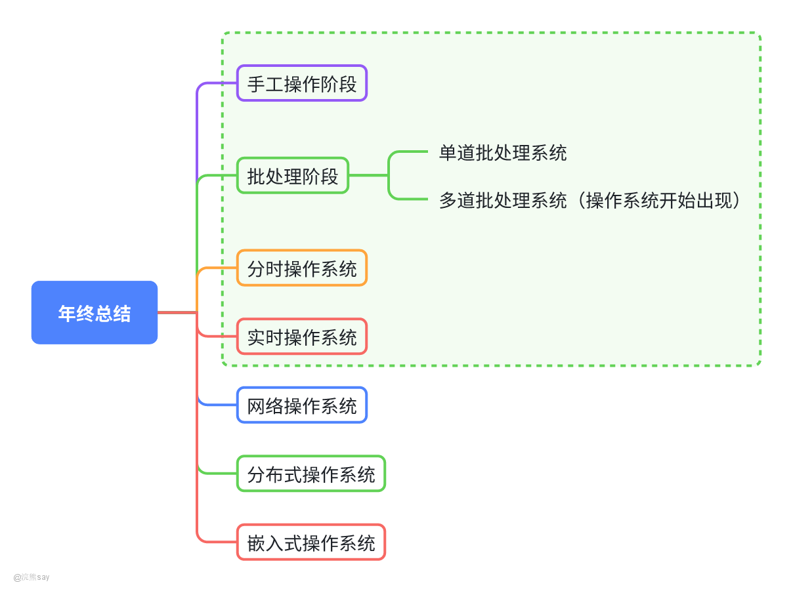

## 手工操作阶段

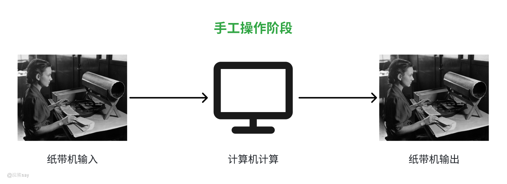

## 单道批处理系统

批处理系统，又名批处理操作系统，[批处理](https://baike.baidu.com/item/%E6%89%B9%E5%A4%84%E7%90%86/1448600?fromModule=lemma_inlink)是指用户将一批作业提交给操作系统后就不再干预，由操作系统控制它们自动运行。这种采用[批量处理](https://baike.baidu.com/item/%E6%89%B9%E9%87%8F%E5%A4%84%E7%90%86/4973973?fromModule=lemma_inlink)作业技术的操作系统称为批处理操作系统。批处理操作系统分为单道批处理系统和[多道批处理系统](https://baike.baidu.com/item/%E5%A4%9A%E9%81%93%E6%89%B9%E5%A4%84%E7%90%86%E7%B3%BB%E7%BB%9F/3792844?fromModule=lemma_inlink)。批处理操作系统不具有交互性，它是为了提高CPU的利用率而提出的一种操作系统。

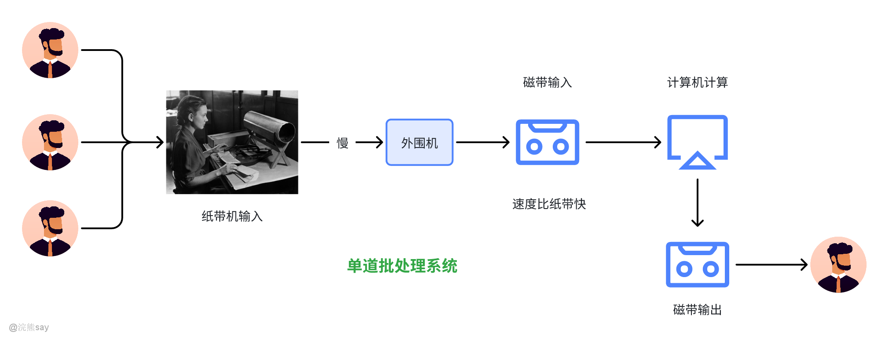

单道批处理系统为了实现对作业的连续处理，需要先把一批作业以[脱机](https://baike.baidu.com/item/%E8%84%B1%E6%9C%BA%E5%A4%84%E7%90%86)的方式输入到磁带上，并在系统中配上监督程序（Monitor），使得作业能一个接一个地连续处理 。这样一来同一批内作业自动更替，改善 CPU 和 I/O 设备使用效率，提高吞吐量。缺点在于磁带 / 磁盘需人工装卸，作业需人工分类；监督程序易被用户程序破坏（需人工恢复）；交互性极差。

## 多道批处理系统

单道批处理操作系统中存在 CPU 与 I/O 设备忙闲不均的问题（计算型作业外设空闲，I/O 型作业 CPU 空闲），用户所提交的作业先存放在外存上，排成一个“后备队列”，由作业调度程序按照一定的算法从队列中选择若干作业进入内存，这些作业共享CPU和系统中的各种资源。

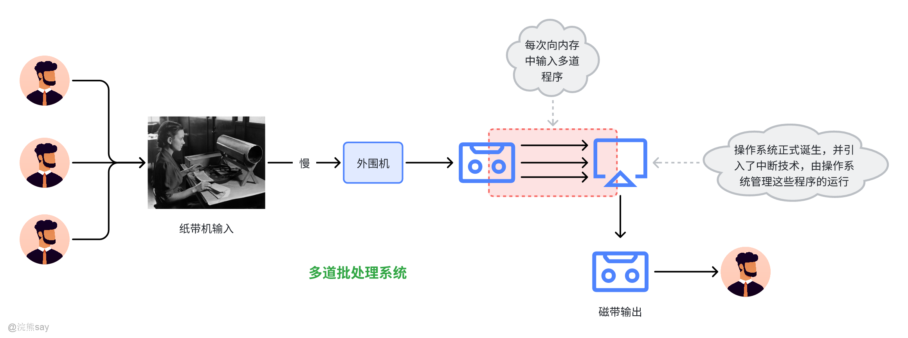

由于存在多个程序，因此CPU可以在一个作业的I/O阶段进行另一个作业的处理。多道程序交替运行，使CPU始终处于忙碌状态多道批处理系统的优点在于，资源利用率高，作业吞吐量大。缺点在于用户交互性差（仅在作业完成或出错时交互，不利于调试）；作业平均周转时间长（短作业周转时间显著增加）。

## 分时操作系统

分时操作系统以 “交互性” 为核心，通过分时技术实现多用户共享计算机资源。利用分时技术（时间片轮转）实现多道程序设计，使一台计算机同时为多个终端用户服务，保证快速响应和交互会话功能。

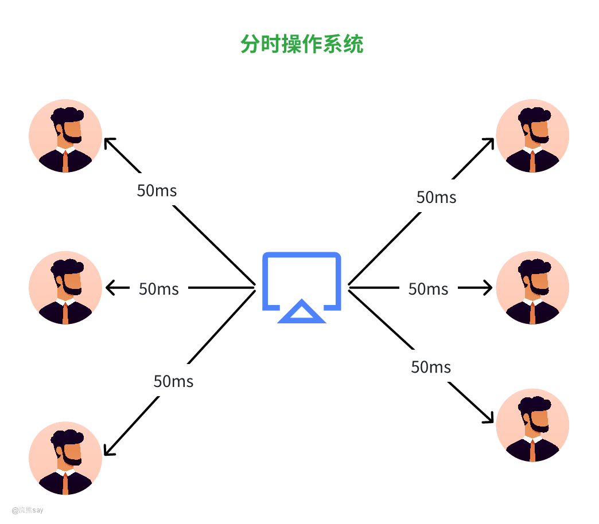

-   分时技术：将处理机响应时间分为若干时间片（如 100 毫秒），终端用户获得 CPU 即获得时间片，时间片用完后程序暂停，等待下一轮调度。
-   “分时” 含义：多个用户分享同一台计算机，多个程序分时共享软硬件资源。
-   特点：
-   交互性：用户可自主操作调试和运行程序。
-   多路性：多个用户同时使用计算机。
-   独占性：用户感觉独占计算机（OS 通过虚机器隔离，互不干扰）。

## 实时操作系统

实时操作系统以 “时效性” 和 “可靠性” 为核心，确保在规定时间内完成特定功能，保证在一定时间限制内完成特定功能的操作系统，及时响应和高可靠性是核心特点。

-   分类：
-   硬实时：必须在规定时间内完成操作（由操作系统设计强制保证）。
-   软实时：按任务优先级尽可能快地完成操作即可。
-   主要应用场景：生产过程控制、工业控制、防空系统、实时信息处理等。

## 网络操作系统

网络操作系统是在基础操作系统功能上扩展网络能力的系统，聚焦网络资源共享与通信，在常规操作系统功能基础上，提供网络通信和网络服务功能，未改变 OS 基本结构，主要功能包括：

-   基础 OS 功能：处理机管理、存储器管理、设备管理、文件管理等。
-   网络通信：通过网络协议实现高效可靠的数据传输。
-   网络资源管理：协调用户对网络资源的使用。
-   网络服务：文件 / 设备共享、信息发布等。
-   网络管理：安全管理、故障管理、性能管理等。

## 分布式操作系统

分布式操作系统是管理分布式计算机系统的统一操作系统，强调资源全局管理与任务协作，多台计算机通过通信设施连接，无主次之分；由统一操作系统管理所有资源、调度任务、协调操作，并为用户提供统一接口。

-   特点：
-   自治性：每台机器有独立 CPU 和内存，但无独立操作系统。
-   分布性：设备分布在有限物理范围内（如一栋楼、一个办公室）。
-   模块性：通常要求机型同构，以实现任务转移。
-   并行性：支持任务并行处理。
-   核心功能：实现任务的协作处理，充分利用分布式系统的资源优势。

## 嵌入式系统

嵌入式系统是嵌入到其他设备中的专用软硬件系统，聚焦特定功能与实时性，在各种设备、装置或系统中，完成特定功能的软硬件系统，是大设备的一部分（大设备未必是 “计算机”）。

-   工作环境：通常工作在对处理时间有严格要求的环境中。
-   核心特点：专用性强、资源受限（如内存、功耗）、实时性要求高（部分场景）。

| 【真题示例】Windows10 操作系统属于( )。A.单用户单任务操作系统B.单用户多任务操作系统C.多用户单任务操作系统D.多用户多任 务操作系统答案：B. 单用户多任务操作系统解析：单用户指同一时间只有一个用户能登录使用；多任务指该用户可同时运行多个程序（比如边开浏览器边用 Word、听音乐）。Windows10 完全符合这两点，所以选 B。A 是早期 DOS 系统（一次只能运行一个程序），C、D 是多用户（比如服务器系统，多个用户同时登录），均不符合。 |
| --- |

| 【真题示例】UNIX 属于 一种( )操作系统。A.分时系统B.批处理系统C.实时系统D.分布式系统答案：A. 分时系统解析：UNIX 的核心特性是 “分时”—— 把 CPU 时间分成若干片段，轮流分给多个用户 / 程序，每个用户都能快速得到响应，感觉独占系统（比如多个终端同时登录 UNIX 服务器操作）。B 是早期无交互的批处理（先攒任务再执行），C 强调毫秒级响应（如工业控制），D 是多计算机协同工作，均不符合 UNIX 的核心定位，所以选 A。 |
| --- |

# 操作系统核心概念

## 内核态和用户态

### 内核态和用户态

内核态和用户态是进程的一种状态，通常是用某个控制寄存器中的一个模式位来实现这个功能。通常情况下程序是运行在用户态当中，当操作系统发生诸如中断、故障或者系统调用之类的异常的时候，此时操作系统就会将进程置为内核态。

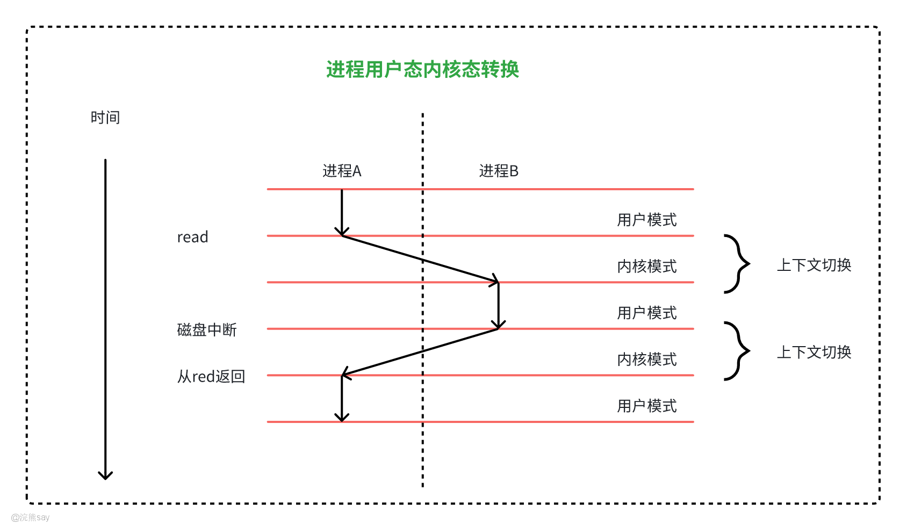

处于内核态的进程通常拥有一些超级权限，可以执行用户态不允许执行的特权指令，比如说IO操作、暂停CPU、访问硬件等等功能。当进程从用户态变到内核态的时候，需要进行上下文切换，上下文切换的时候操作系统会保存进程的上下文，通常包括寄存器、浮点数寄存器、程序计数器、用户栈、状态寄存器等各种内核数据结构，方便进程恢复为用户态。

如上图所示展示了一个进程A从用户态切换到内核态的过程，进程A一开始运行在用户态当中，直到它通过执行系统调用read陷入到内核态当中。内核态中的程序率先处理了来自磁盘控制器的DMA请求，完成之后再从内核态切换到了用户态。
| 【真题示例】用户程序在目态下使用特权指令将引起的中断是属于( )。A.硬件故障中断B. 程序中断C.外部中断D.访管中断答案：B. 程序中断解析：先明确核心概念：目态（用户态）是用户程序运行的状态，**特权指令只能在管态（核心态）使用**，用户程序在目态下用特权指令属于“程序执行出错”。 再看选项：A硬件故障中断是硬件出问题（如内存损坏）触发，和特权指令无关；C外部中断是外设触发（如键盘输入），排除；D访管中断是用户程序**主动请求**操作系统服务（如调用系统函数），是“主动发起”，而题干是“违规使用指令”导致的被动中断，属于程序执行错误，对应程序中断。所以选B。 |
| --- |

### 管态和目态

**内核态和用户态的另外一种叫法就是——管态和目态，管态即具有管理权限的状态，即内核态、系统态，目态则是指用户态。**

管态是 CPU 的一种特权状态，操作系统的内核程序（如进程管理、内存管理、设备驱动等核心功能）运行在该状态下。在管态下，程序可以访问所有系统资源，并执行所有类型的指令，包括特权指令。

目态是 CPU 的非特权状态，用户程序（如应用程序、普通进程）运行在该状态下。在目态下，程序的访问权限受到严格限制，只能使用非特权指令，无法直接访问系统核心资源。

管态和目态之间的切换是操作系统运行的核心机制之一，他们之间的切换通常通过通过以下场景触发：

1、  **系统调用：** 用户程序需要访问系统资源（如读写文件、申请内存）时，通过执行系统调用指令（一种特殊的特权指令）主动触发从目态到管态的切换，内核处理请求后再返回目态。

2、  **中断：** 当硬件设备完成操作（如 I/O 完成）或发生异常（如除零错误、内存访问越界）时，CPU 会暂停当前运行的用户程序，自动切换到管态，由内核处理中断事件，处理完毕后返回目态继续执行用户程序。

3、 **进程调度：** 当内核完成进程调度（如时间片用完、高优先级进程就绪）时，会从管态切换到新进程的目态，让新进程获得 CPU 资源。

| 【真题示例】系统在( ),发生从目态到管态的转换。A.发出P 操作时B.发出V 操作时C.执行系统调用时D.执行置程序状态字时答案：C. 执行系统调用时解析：先明确核心逻辑：目态（用户态）是用户程序运行的低权限状态，管态（核心态）是操作系统内核运行的高权限状态，转换的关键是“用户程序需要内核提供服务”。系统调用是用户程序主动请求操作系统服务的接口（比如读写文件、分配内存），这些操作需要特权指令，用户程序在目态无法直接执行，必须触发从目态到管态的转换，让内核代为执行，这是典型的转换场景。再看其他选项：A、B：P/V操作是进程同步的内核原语，本身就在管态执行，不会触发目态→管态转换；D：置程序状态字（PSW）是特权指令，只能在管态执行，是管态下的操作，不是转换的触发条件。所以选C。 |
| --- |

## 系统调用

系统调用（System Call）是操作系统提供给用户程序与内核进行交互的接口，它允许用户程序请求操作系统内核执行某些特权操作或访问受保护的系统资源。这些操作通常是用户程序无法直接完成的（如硬件访问、进程管理等），必须通过系统调用由内核代为执行。

### 系统调用的核心作用

1.  隔离用户态与内核态：现代操作系统采用 “用户态” 和 “管态（内核态）” 的特权分级机制。用户程序运行在用户态，无法直接访问内核资源或执行特权指令；而系统调用是用户态程序进入内核态的唯一合法途径。
2.  资源安全管理：操作系统通过系统调用统一管控各类资源（如 CPU、内存、文件、设备等），避免用户程序直接操作硬件或内核数据结构导致的系统崩溃或安全问题。
3.  提供核心功能接口：用户程序通过系统调用使用操作系统的核心功能，如创建进程、读写文件、网络通信等，无需关心底层硬件细节。

### 系统调用的步骤

系统调用的执行需要从用户态切换到内核态，完成后再返回用户态，一般会中断现行程序，转而执行其它程序以完成系统功能，完成之后则会返回当前程序继续执行。

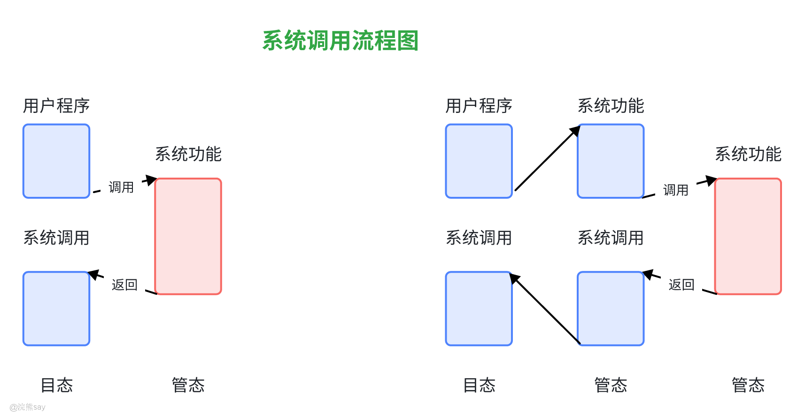

1.  **用户程序发起请求：** 用户程序通过调用高级语言中的库函数（如 C 语言的printf()底层调用write()系统调用）触发系统调用，传入参数（如文件名、操作命令等）。
2.  **陷入内核态：** 库函数通过执行特殊的陷阱指令（Trap Instruction） 或系统调用指令（如 x86 的syscall、ARM 的svc），触发 CPU 从用户态切换到内核态，并** 保存用户程序的执行上下文**（如寄存器状态、程序计数器等）。
3.  **内核处理请求：** 内核根据系统调用号（每个系统调用对应唯一编号）识别请求类型，调用对应的内核函数处理（如文件读写、内存分配等）。处理过程中，内核会访问相关系统资源并完成操作。
4.  **返回用户态：** 内核处理完毕后，将结果返回给用户程序，恢复用户程序的上下文，通过陷阱返回指令切换回用户态，用户程序继续执行后续代码。

| 【真题示例】系统调用是操作系统向用户提供的程序一级的服务，经过编译后，形成若干参数和( )。A.访管指令B.启动I/0指令C.屏蔽中断指令D.通道指令答案：A. 访管指令解析：系统调用的核心是 “用户程序无法直接执行特权指令，需主动请求操作系统帮忙”。编译后，除了传递参数，还会生成访管指令—— 这是触发目态（用户态）切换到管态（核心态）的关键指令，能让操作系统接收请求并代为执行特权操作。B、C 是特权指令（用户态不能直接用），D 是管态下控制外设的指令，均不符合系统调用的编译结果，所以选 A |
| --- |

| 【真题示例】系统调用的目的是( )。A.请求系统服务B.终止系统服务C.申请系统资源D.释放系统资源答案：A. 请求系统服务解析：系统调用是用户程序向操作系统求助的 “接口”，目的就是获取 OS 提供的服务（比如读写文件、分配内存、创建进程等）。C、D 是系统服务的具体类型，不是核心目的；B 终止系统服务不是系统调用的作用，所以选 A。 |
| --- |

## 中断

### 什么是中断

在计算机系统中，中断是指 CPU 在正常执行程序的过程中，遇到外部或内部事件的触发时，暂停当前正在运行的程序，转而去执行处理该事件的专用程序（即中断服务程序），待事件处理完毕后，再回到原来程序的断点处继续执行的过程。它是计算机系统实现并发操作、设备交互、异常处理等功能的核心机制之一。

### 中断的核心作用

1.  实现 CPU 与外设的并行工作：当外设（如键盘、磁盘、打印机等）完成数据传输或操作后，通过中断通知 CPU，避免 CPU 一直等待外设，提高 CPU 利用率。
2.  响应紧急事件：如电源故障、硬件错误等紧急情况，通过中断迫使 CPU 立即处理，保障系统安全。
3.  支持多任务调度：操作系统可通过时钟中断等方式切换不同任务，实现多程序并发执行。
4.  处理异常情况：如程序运行中的除零错误、内存访问越界等异常，通过中断进入异常处理流程。

### 中断的类型

根据中断的触发来源和性质，可分为内中断和外中断：

1、 **外中断（硬件中断）**

由计算机外部设备或外部事件触发的中断，与当前运行的程序无关。

-   可屏蔽中断：通过 CPU 的中断屏蔽位可以禁止响应的中断（如外设的 I/O 请求，如键盘输入、磁盘读写完成等）。
-   不可屏蔽中断：无法被屏蔽的紧急中断，必须立即响应（如电源掉电、硬件故障等）。

2、  **内中断（软件中断 / 异常）**

由 CPU 内部事件或程序执行过程中的异常触发的中断，与当前运行的程序直接相关。

-   陷阱（Trap）：程序主动请求的中断（如系统调用时的软中断指令，如int指令）。
-   故障（Fault）：可恢复的异常（如页面缺失，需操作系统加载页面后继续执行）。
-   终止（Abort）：严重的不可恢复错误（如硬件故障、非法指令，通常导致程序终止）。

### 中断的处理过程

中断的处理通常遵循以下步骤，确保 CPU 能高效响应并恢复执行：

1.  中断请求：外部设备或内部事件通过中断信号（如硬件的中断请求线 IRQ）通知 CPU。
2.  中断响应：CPU 在执行完当前指令后，检测到中断请求，若允许响应（未被屏蔽），则暂停当前程序。
3.  保护现场：将当前程序的断点信息（如程序计数器 PC、寄存器状态等）保存到栈或特定存储区，防止后续操作覆盖。
4.  中断判优：当多个中断同时发生时，通过硬件或软件优先级机制确定处理顺序（如电源故障优先级高于键盘输入）。
5.  执行中断服务程序：根据中断类型找到对应的中断服务程序入口地址，转去执行处理逻辑（如处理 I/O 数据、修复异常等）。
6.  恢复现场：处理完毕后，从保存的断点信息中恢复 CPU 状态，包括程序计数器、寄存器等。
7.  中断返回：回到被中断的程序断点处，继续执行原程序。

中断机制是计算机系统高效运转的 “神经中枢”，它使 CPU 能够灵活应对各种事件，实现多任务并发、设备交互和异常处理，是现代操作系统不可或缺的核心技术。
| 【真题示例】中断处理和子程序调用都需要压栈以保护现场，中断处理一定要保存而子程序调用不需要保存 其内容的是( )。A.程序计数器B.程序状态字寄存器C.通用数据寄存器D.通用地址寄存器答案：B. 程序状态字寄存器解析：核心区别在 “程序状态字（PSW）的作用”——PSW 存的是当前程序的关键状态（比如中断屏蔽位、运算标志位、优先级）。中断处理是 “强行打断现行程序”，必须保存 PSW，否则处理完中断返回时，原程序的运行状态会丢失；而子程序调用是程序主动跳转，主程序和子程序属于同一任务，状态连续，不需要保存 PSW。A（程序计数器）、C（通用数据寄存器）、D（通用地址寄存器），不管是中断还是子程序调用，都需要保存以保证返回后能正常执行，所以排除。 |
| --- |

| 【真题示例】“中断”的概念是指( )。A.暂停处理机执行B.暂停处理机对现行程序的执行C.停止整个系统运行D.使处理机空转答案：B. 暂停处理机对现行程序的执行解析：中断的核心是 “打断当前程序，处理紧急事件（如外设请求、错误），处理完再返回原程序”。A 错在 “暂停处理机执行”—— 处理机是转去执行中断服务程序，不是停着；C “停止整个系统” 和 D “空转” 均不符合中断的定义（中断是系统正常的响应机制，不会停系统或空转），所以选 B。 |
| --- |

# 操作系统体系结构

操作系统的体系结构一般分为单内核体系机构、分层结构、微内核结构、虚拟机结构等，不同的操作系统体系结构是在不断的发展过程中逐渐完善的。

## 单内核结构

单内核操作系统(monolithic operating system)是最早出现的也是最常用的操作系统体系结构。在这种结构中，操作系统的每一个组件都包含在内核中，并能够直接与其他任何组件进行通信（即简单地通过函数调用来实现通信）。

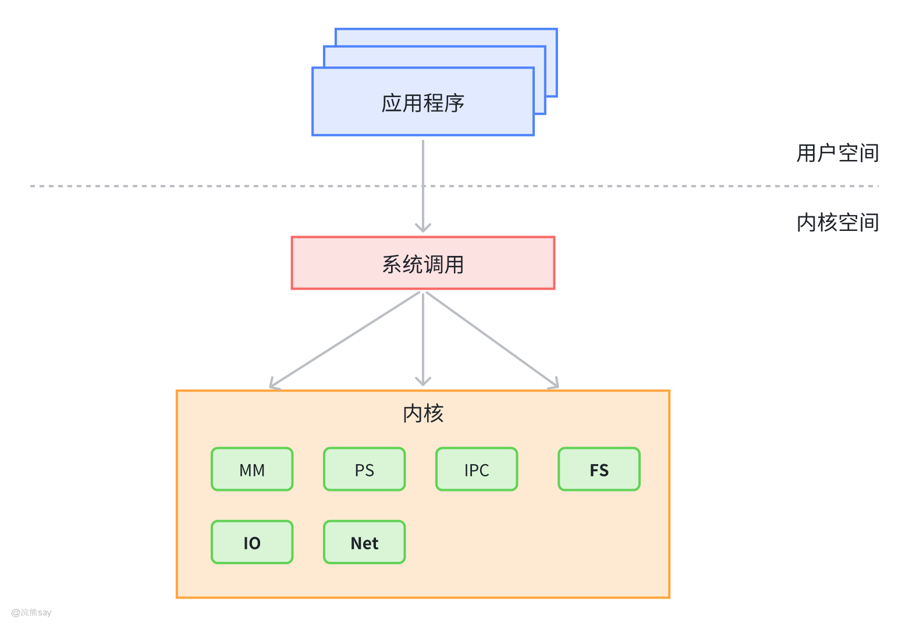

一般情况下，内核执行可以不受限制地访问计算机系统。OS/360,VMS 和Linux 等操作系统明显地具有单内核操作系统的特性。由于组件之间直接进行通信，所以单内核操作系统效率很高。因为单内核操作系统将组件集合在一起，所以无论如何，要查出bug和其他错误的来源都不是一件容易的事。而且，由于所有代码的执行都可以不受限制地访问系统，所以单内核系统尤其容易受到错误代码或者恶意代码的破坏。

## 分层体系结构

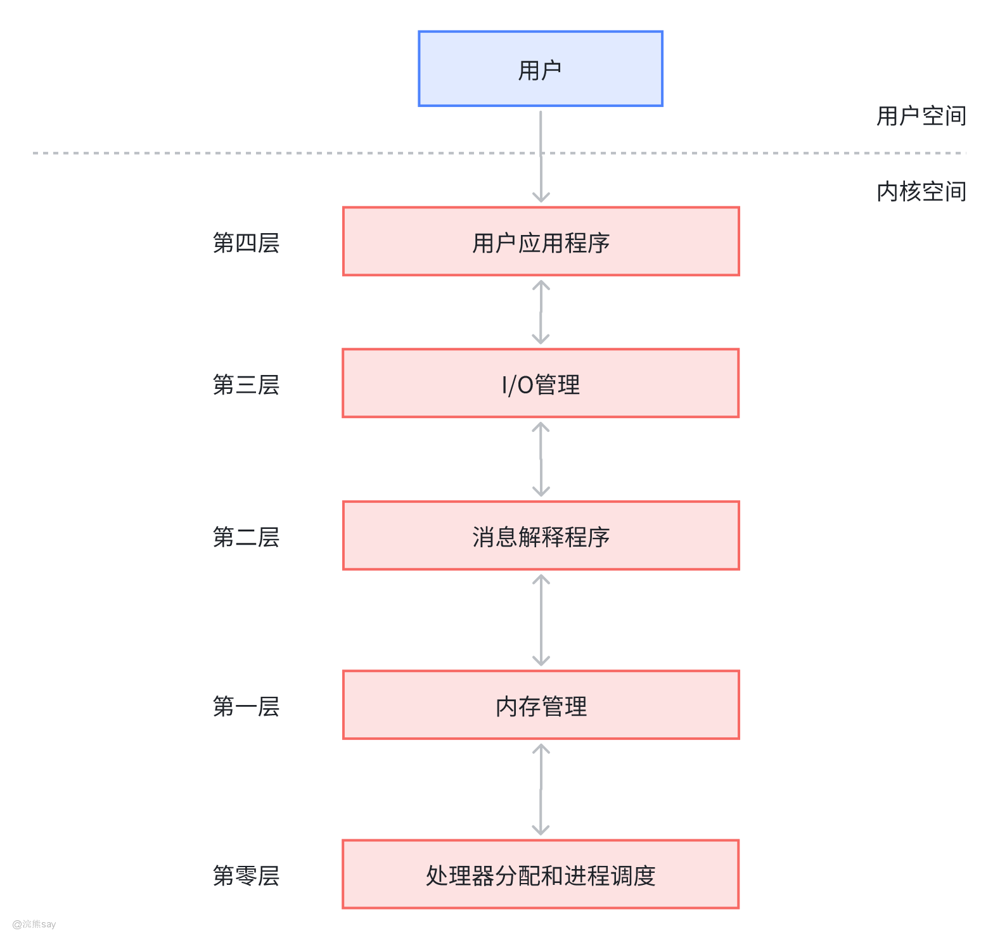

随着操作系统变得越来越大，越来越复杂，完全使用单内核设计就不太适用了。对操作系统进行分层可以解决这一问题，这种方法将执行相似功能的那些组件分组成层。每一层都只能与其相邻的上层或相邻的下层进行通信。较低的层使用一个将其实现隐藏起来的接口为较高的层提供服务。

分层的操作系统比单内核操作系统具有更好的模块性，因为对每一层的实现进行修改时，都不需要修改其他层。模块化系统具有整个系统都可以重用的自含式组件。每一个组件都将其完成作业的具体方式隐藏起来，并提供了一个标准接口，其他组件可以使用此接口请求这一组件的服务。模块性使操作系统具有结构化和一致性。

但是，采用分层方法，一个用户进程的请求可能需要传过许多层才能得到服务；因为必须调用额外的方法，才能将数据从一个层传递到邻接的层，所以与单内核操作系统相比，其性能会有所降低。在单内核操作系统中，要为与此相似的请求提供服务，可能只需要执行一次调用。另外，由于所有的层都可以不受限制地访问系统，所以分层的内核也容易遭到错误代码或恶意代码的破坏。THE操作系统是分层式操作系统的一个早期范例。107今天的许多操作系统，包括 Windows XP 和 Linux,都在一定程度上实施了分层。

## 微内核体系结构

微内核操作系统(microkernel operating system)体系结构只提供少量的服务，力图使内核较小，且可伸缩。一般情况下，这些服务包括底层内存管理、进程间通信以及基本的进程同步（进程同步使进程能够协作完成任务）。在微内核设计中，大多数操作系统组件（例如，进程管理、网络连接、文件系统交互和设备管理)在内核的外部执行，它们具有较低的权限级别。

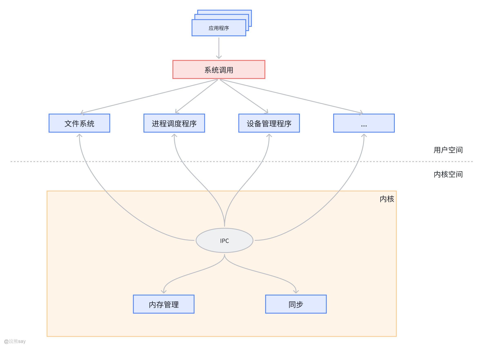

微内核展示了高度的模块性，这样的系统可扩展、可移植和可伸缩。而且，因为微内核的执行并不依赖于每一个组件，所以如果一个或多个组件发生故障，也不会引起操作系统故障。但是，这种模块性的获得是以增加模块间的通信级数为代价的，这就降低了系统性能。虽然当今流行的操作系统很少有完全基于微内核设计的系统，但是，Linux和Windows XP等操作系统都包含模块组件。

## 虚拟机结构

通过某种技术，使物理计算机作为共享资源从而创建虚拟机；利用 CPU 调度，虚 拟内存技术， OS 能创建一种幻觉，从而使进程认为有自己的处理器和自己的内存：每台虚拟机都与 裸机相同，所以每台虚拟机可以运行一台裸机所能够运行的任何类型的操作系统，不同的虚拟机可 以运行不同的操作系统。通过完成保护系统资源，虚拟机提供了一个安全层，每个虚拟机完全与其 它虚拟机隔开，从而使系统资源被完全保护。
| 【真题示例】计算机系统的层次结构自下而上是( )。A.编译系统、操作系统、支撑软件和应用软件B.支撑软件、操作系统、编译系统和应用软件C. 应用软件、操作系统、编译系统和支撑软件D.操作系统、编译系统、支撑软件和应用软件答案：D. 操作系统、编译系统、支撑软件和应用软件解析：计算机系统层次结构的核心逻辑是 “从底层支撑到上层应用”，自下而上的顺序要遵循 “直接操作硬件→提供基础支撑→满足具体需求”：最底层是操作系统（直接管理硬件，给所有上层软件提供运行环境）；往上是编译系统（将高级语言翻译成机器语言，依赖操作系统运行）；再往上是支撑软件（如数据库、工具软件，辅助开发和运行）；最上层是应用软件（针对具体用途，如办公、游戏）。A、B、C 均颠倒了底层支撑（操作系统）的位置，所以选 D。 |
| --- |

| 【真题示例】操作系统程序结构的主要特点是( )。A.一个程序模块B.分层结构C.层次模块化D.子程序结构答案：C. 层次模块化解析：操作系统的程序结构核心是 “既分模块，又有层次”—— 按功能拆分成独立模块（如处理机管理、设备管理模块），同时模块间有明确的层次关系（底层模块支撑上层模块，避免混乱）。A（单模块）是早期简单 OS 的结构，不是主要特点；B（分层结构）只强调层次，忽略了 “模块化拆分”；D（子程序结构）过于简单，无法体现 OS 的复杂功能组织。所以选 C。 |
| --- |
