# 2、进程与线程管理

**Part 02：进程与线程管理**
| 【原创声明】大家好，我是say，是这篇文章的原创作者！985硕士毕业，应届进入某大厂后道心破碎，社招上岸多家855半垄断央企，因为自己淋过雨，希望帮大家撑把伞，帮助更多同学找到不内卷、能够好好生活的央国企，已帮助1000+同学上岸央国企，需要连联系学长的加微信：wx_hxsay |
| --- |

## 进程

## 什么是进程？

### 进程概念

进程（Process） 是操作系统进行资源分配和调度的基本单位，是一个正在运行的程序的实例，并且包括这个运行的程序中占据的所有[系统资源](https://baike.baidu.com/item/%E7%B3%BB%E7%BB%9F%E8%B5%84%E6%BA%90/974435?fromModule=lemma_inlink)，比如说[CPU](https://baike.baidu.com/item/CPU/120556?fromModule=lemma_inlink)（[寄存器](https://baike.baidu.com/item/%E5%AF%84%E5%AD%98%E5%99%A8/187682?fromModule=lemma_inlink)），IO,内存，[网络资源](https://baike.baidu.com/item/%E7%BD%91%E7%BB%9C%E8%B5%84%E6%BA%90/406657?fromModule=lemma_inlink)等。每个进程包含以下主要组成部分：

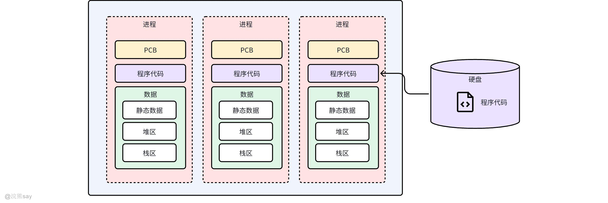

1.  程序代码（Program Code）：进程执行的指令集，通常称为文本段（Text Segment）。
2.  数据（Data）：
3.  包括全局变量和静态变量等。
4.  堆（Heap）：动态分配的内存区域，用于存放动态分配的数据结构，如通过 malloc 或 new 分配的内存。
5.  栈（Stack）：用于存储函数调用时的局部变量和函数参数。每次函数调用都会在栈上创建一个新的栈帧（Stack Frame），函数返回时栈帧会被销毁。
6.  进程控制块（Process Control Block, PCB）：操作系统用于管理和调度进程的数据结构，包含进程的状态信息、优先级、资源使用情况、内存管理信息等。

在我们计算机中，例如一个qq程序、一个微信程序都是一个进程，而一个进程通常包含多个线程来共同完成任务。

### 进程与程序的区别

1.  **动态与静态的区别：**进程是程序的一次执行过程，具有动态性，有创建、运行、暂停、消亡等生命周期；程序是静态的指令和数据的集合，不涉及执行过程。
2.  **存在的持久性不同：**进程是暂时的，随程序的开始执行而创建，执行结束后消亡；程序是永久的，可长期存储在存储介质中。
3.  **组成不同：**进程由程序、数据和进程控制块（PCB）三部分组成；程序仅包含指令和数据。
4.  **对应关系不同：**一个程序可以对应多个进程，比如多个用户同时运行同一个应用程序，会产生多个进程；而一个进程只能对应一个程序。
5.  **与资源的关系不同：**进程是资源分配和调度的基本单位，在执行过程中需要占用 CPU、内存等系统资源；程序本身不占用系统资源，只有当它作为进程的一部分执行时才会间接使用资源。

### 进程的性质

1.  动态性：进程是程序的执行过程，从创建到消亡有完整的生命周期，在这个过程中，进程的状态会不断发生变化。
2.  并发性：多个进程可以在同一时间段内同时运行（宏观上并行，微观上交替执行），这是操作系统实现多任务处理的基础。
3.  独立性：进程是一个能独立运行的基本单位，也是系统进行资源分配和调度的独立单位，每个进程都有自己独立的地址空间和系统资源。
4.  异步性：进程的执行是异步的，各进程按照各自独立的、不可预知的速度向前推进，操作系统需要通过进程调度等机制来协调它们的执行。
5.  结构性：进程由程序、数据和进程控制块（PCB）组成，PCB 是进程存在的唯一标志，记录了进程的各种属性和状态信息，供系统管理进程使用。

| 【真题示例】进程和程序的一个本质区别是( )。A.前者分时使用CPU, 后者独占CPUB.前者存储在内存，后者存储在外存C.前者在一个文件 中，后者在多个文件中D.前者为动态的，后者为静态的答案：D解析： 程序是静态的（比如存着的软件安装包、代码文件），只是一堆指令的集合；进程是程序的执行过程（比如打开软件后运行的状态），是动态的，会创建、运行、结束，这是两者最本质的区别。A、B、C 都不是核心区别 —— 比如程序也可能被加载到内存（B 错），进程不一定分时用 CPU（A 错）。 |
| --- |

| 【真题示例】操作系统中，资源分配的基本单位是( )。A.进程B.线程C.作业D.程序答案：A解析： 操作系统里，资源（CPU、内存、硬盘等）分配的基本单位是进程。线程是调度执行的基本单位（不是分配资源），作业是用户提交的任务，程序是静态指令，都不负责资源分配。 |
| --- |

## 进程的生命周期

### 进程状态

如上图所示，进程在其生命周期中会经历多种状态，主要包括就绪态、运行态和阻塞态，在一些情况下进程的状态可以发生切换：

-   **新建态：**进程刚刚被创建，还未分配所需要的资源，如IO资源、内存资源等。
-   **就绪态**：当进程已经获得了除CPU之外的所有必要资源时，它就处于就绪状态，此时，进程只需要等待CPU调度即可开始执行。
-   **运行态**：当进程被调度程序选中并分配到CPU时，它就进入了运行状态。在单处理器系统中，任何时候只有一个进程处于运行状态；而在多处理器系统中，可能会有多个进程同时运行。
-   **阻塞态**：如果正在执行的进程因为等待某些事件（如I/O操作完成）而无法继续执行，那么它就会进入阻塞状态。此时，进程会释放CPU，直到所等待的事件发生。
-   **结束态：**进程完成所有任务，释放资源。

### 进程状态切换

1.  新建→就绪：当系统为新建进程分配完必要资源（如内存、文件句柄等）后，进程进入 “就绪” 状态，等待 CPU 调度。
2.  就绪→运行：系统调度器选中 “就绪” 队列中的进程，为其分配 CPU 时间片，进程进入 “运行” 状态，开始执行代码逻辑。
3.  运行→就绪：若进程的 CPU 时间片用完，或被更高优先级进程抢占，会从 “运行” 回到 “就绪”，重新等待调度。
4.  运行→阻塞：若进程执行中需要等待 IO 资源（如读写文件、网络请求），会主动进入 “阻塞” 状态，释放 CPU，等待 IO 完成。
5.  阻塞→就绪：当 IO 操作完成（如文件读取结束、网络响应到达 ），阻塞的进程被唤醒，回到 “就绪” 状态，重新参与 CPU 调度。
6.  运行→结束：进程代码执行完毕（或因异常终止 ），会从 “运行” 直接进入 “结束” 状态，系统回收其占用的资源。

### 进程挂起和解挂

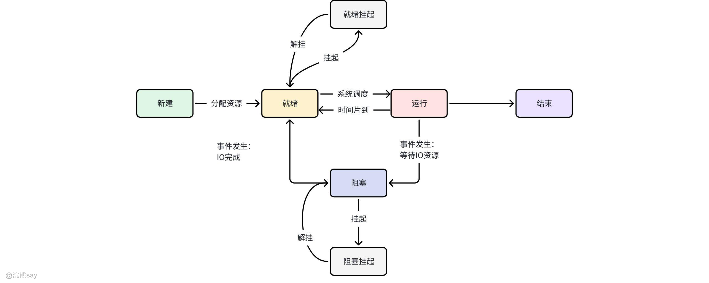

# 进程挂起（Suspend）

进程挂起通常是指将进程从内存转移到外存（如磁盘的交换区），使其暂时不参与CPU调度，释放内存资源，通常为了平衡系统负载或满足高优先级进程需求，具体有以下三种转换：

1.  **等待 → 挂起等待**当系统中没有就绪进程，或就绪进程需要更多内存资源时，会将处于等待状态（因等待某事件如I/O完成而阻塞）的进程转移到外存，成为“挂起等待”状态。目的是释放内存，为新进程提交或就绪进程运行提供资源。
2.  **就绪 → 挂起就绪**当系统中存在高优先级的等待进程（系统判断其很快会就绪），且同时有低优先级的就绪进程时，会将低优先级的就绪进程转移到外存，成为“挂起就绪”状态。这是为了优先保障高优先级进程一旦就绪就能快速获得资源。
3.  **运行 → 挂起就绪**在抢先式分时系统中，若高优先级的挂起等待进程因等待事件完成而进入“挂起就绪”状态，系统可能会暂停当前运行的低优先级进程，将其转移到外存成为“挂起就绪”状态，为高优先级进程让路。

# 进程解挂（Activate）

**进程解挂是指**将外存中挂起的进程重新转移到内存，使其恢复参与CPU调度的资格。一般当系统资源（尤其是内存）充足，或需要优先调度高优先级进程时，具体有以下两种转换：

1.  **挂起就绪 → 就绪**当系统中没有就绪进程（内存中无等待调度的进程），或挂起就绪进程的优先级高于当前内存中的就绪进程时，会将外存中的挂起就绪进程转移到内存，成为“就绪”状态，等待CPU调度。
2.  **挂起等待 → 等待**当某个进程释放了足够的内存资源时，系统会选择外存中高优先级的挂起等待进程（系统判断其等待的事件很快会发生），将其转移到内存，恢复为“等待”状态，继续等待事件完成后进入就绪状态。

挂起和解挂的核心是通过内存与外存的进程转移，动态调整系统资源分配，优先保障高优先级进程的运行，同时避免内存资源耗尽，从而提高系统整体效率和响应速度。挂起的进程处于外存，不参与调度；解挂后回到内存，重新具备运行或等待调度的条件。

# 挂起和阻塞的区别？

阻塞（Blocked/Waiting）：进程因等待某一事件（如 I/O 完成、信号量释放、外部中断等）而暂时无法继续运行，主动放弃 CPU，仍驻留在内存中，等待事件完成后可直接进入就绪状态。

挂起（Suspended）：进程被系统从内存转移到外存（如磁盘交换区），暂时不占用内存资源，其状态转换由系统根据内存负载、优先级等主动触发，与进程自身是否等待事件无关。
| 【真题示例】进程所请求的一次打印输出结束后，将使进程状态从()。A.运行态变为就绪态B.运行态变为阻塞态C.就绪态变为运行态D.阻塞态变为就绪态答案：D解析： 进程请求打印时，会因等待打印完成（IO 事件）进入阻塞态。现在打印结束，等待的事件完成，进程就不用再等了，会从阻塞态变回就绪态，等着 CPU 调度执行。其他选项不对 ——A 是 CPU 用完了才变，B 是刚开始等事件时变，C 是拿到 CPU 时变。 |
| --- |

| 【真题示例】从执行状态挂起的进程解除挂起时进入()状态。A.就绪B.执行C.阻塞D.挂起答案：A解析： 挂起的进程解除挂起后，不会直接占用 CPU（执行态），而是先进入就绪态，排队等 CPU 调度。B 是正在用 CPU，C 是还在等其他资源，D 是没解除挂起，都不符合。 |
| --- |

## 进程控制块

### 什么是进程控制块

进程控制块（Process Control Block，PCB）是存放进程管理和控制信息的数据结构，是进程管理与控制的核心数据结构。其生命周期与进程一致：在进程创建时建立，伴随进程运行全过程，直至进程撤销时被销毁。PCB 的核心作用包括：

-   记录进程的外部特征，描述进程的运动变化过程；
-   是系统感知进程存在的唯一标志，操作系统通过 PCB 对进程进行控制和管理；
-   进程与 PCB 一一对应，每个进程都有且仅有一个 PCB。

进程控制块的作用在于使多道程序环境下无法独立运行的程序（含数据）成为能独立运行的基本单位，实现与其他进程的并发执行。操作系统正是通过 PCB 对并发进程进行控制和管理，例如调度进程、分配资源、跟踪进程状态等。

### 进程控制块中的基本信息

PCB 包含三类核心信息：进程标志信息、处理器状态信息、进程控制信息，具体如下：

# （1）进程标识符

用于唯一标识一个进程，分为两种：

-   内部标识符：由系统分配的唯一数字标识符（如进程序号），方便系统内部管理和操作。
-   外部标识符：由创建者提供，通常由字母和数字组成，供用户或其他进程访问该进程时使用。

此外，还包括父进程标识、子进程标识（描述进程家族关系）和用户标识（指示进程所属用户）。

# （2）处理器状态信息

用于保存进程运行时处理器的状态，以便进程被切换后能恢复执行，包括：

-   用户可见寄存器：用户程序可访问的寄存器，用于暂存数据和中间结果。
-   控制和状态寄存器：如程序计数器（PC，记录下一条要执行的指令地址）、程序状态字（PSW，包含进程状态、中断屏蔽标志等）。
-   堆栈指针：指向进程的系统栈，用于存放过程调用、系统调用的参数和返回地址。

# （3）进程控制信息

用于进程调度、资源管理和进程间通信，包括：

-   调度和状态信息：进程当前状态（就绪、运行、阻塞等）、调度优先级、与调度相关的其他参数。
-   队列链接指针：记录进程在各种队列（如就绪队列、阻塞队列）中的位置，便于系统快速查找和管理。
-   进程间通信信息：如用于同步或互斥的标志位、信号量、消息队列等。
-   主存使用信息：进程占用的主存大小、地址范围等。
-   资源使用信息：进程打开的文件、使用的 I/O 设备等其他资源的记录。
-   服务优先级：进程获取系统服务（如 I/O 服务）的优先级。

### 进程控制块组成方式

系统中的进程非常多，因此需要通过一定的方式将大量的进程组织起来，为了方便调度和管理进程，因此需要对进程的PCB以适当的方式进行组织。

# （1）单表

所谓单表组织方式，就是将所有进程的PCB都统一通过一个链表来进行维护：

# （2）索引表

同一状态的进程归入一个索引表(由索引指向 PCB), 多个状态对应多个不同的索引 表。各状态的进程形成不同的索引表：就绪索引表、阻塞索引表。

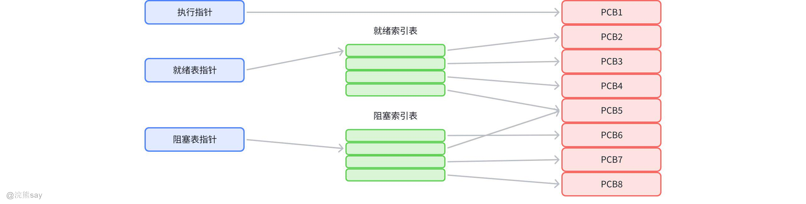

# （3）链表

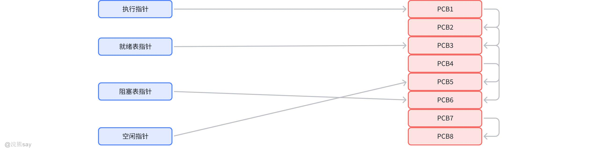

分别把具有相同状态的所有进程的 PCB 按优先级排成一个或多个队列，同一状态的进 程其 PCB 成一链表，多个状态对应多个不同的链表。各状态的进程形成不同的链表：就绪链表、阻 塞链表等。
| 【真题示例】在下列叙述中不正确的是()。A.进程被撤消时，只需要释放其PCB就可以了B.PCB是进程存在的唯一标志C.进程的互斥和同步都能用PV原语实现D.设备独立性是指用户再编程时，所使用的设备与实际设备无关答案：A解析： 进程撤消时，不能只释放 PCB（进程控制块），还得释放它占用的所有资源（比如内存、CPU、设备等），之后再释放 PCB。B、C、D 都是正确的 ——PCB 是进程存在的唯一标志，PV 原语能实现互斥和同步，设备独立性就是编程时不用管实际用什么设备。 |
| --- |

| 【真题示例】进程控制块是描述进程状态和特性的数据结构，一个进程()。A.只能有惟一的进程控制块B.可以有多个进程控制块C.可以和其他进程共用一个进程控制块D.可以没有进程控制块答案：A解析： 一个进程只能有一个唯一的 PCB，PCB 里存着进程的所有关键信息（状态、资源、优先级等），是进程的 “身份证”，不能多个进程共用，也不能没有，所以 B、C、D 都错。 |
| --- |

## 进程间通信

进程间通信（IPC，Inter-Process Communication）是操作系统中进程之间进行信息交换的机制，其核心目的是协调多个进程的工作、共享资源或传递数据。每个进程各自有不同的用户地址空间，任何一个进程的全局变量在另一个进程中都看不到，所以进程之间要交换数据必须通过内核，在内核中开辟一块缓冲区，进程1把数据从用户空间拷到内核缓冲区，进程2再从内核缓冲区把数据读走，内核提供的这种机制称为**进程间通信（IPC，InterProcess Communication）**

### 管道/匿名管道（Pipe）

管道的实质内核维护的一段临时内存缓冲区，通过文件描述符实现读写操作，遵循 “先进先出”（FIFO）规则。管道一端的进程顺序的将数据写入缓冲区，另一端的进程则顺序的读出数据。

该缓冲区可以看做是一个循环队列，读和写的位置都是自动增长的，不能随意改变，一个数据只能被读一次，读出来以后在缓冲区就不复存在了。

当缓冲区读空或者写满时，有一定的规则控制相应的读进程或者写进程进入等待队列，当空的缓冲区有新数据写入或者满的缓冲区有数据读出来时，就唤醒等待队列中的进程继续读写。管道一般具有以下特点：

1.  **半双工通信：**管道是半双工的，数据只能向一个方向流动；需要双方通信时，需要建立起两个管道。
2.  **条件限制：**只能用于父子进程或者兄弟进程之间(具有亲缘关系的进程);
3.  **单独构成一种独立的文件系统：**管道对于管道两端的进程而言，就是一个文件，但它不是普通的文件，它不属于某种文件系统，而是自立门户，单独构成一种文件系统，并且只存在与内存中。
4.  **数据的读出和写入：**一个进程向管道中写的内容被管道另一端的进程读出。写入的内容每次都添加在管道缓冲区的末尾，并且每次都是从缓冲区的头部读出数据。

### 命名管道（FIFO）

有名管道（FIFO）是为解决匿名管道只能用于亲缘进程间通信的局限而设计的。与匿名管道相比，其核心差异在于有名管道与一个路径名相关联，并以特殊文件的形式存在于文件系统中。这一特性使得即便进程间无亲缘关系，只要能访问该路径，就能通过有名管道实现通信，从而突破了匿名管道的使用限制，让非相关进程也能交换数据。

有名管道和匿名管道均严格遵循先进先出（FIFO）原则：读取操作总是从数据起始位置返回内容，写入操作则将数据添加到末尾，且二者都不支持lseek()等文件定位操作。需要注意的是，有名管道的名称保留在文件系统中，而其实际数据存储在内存中。

匿名管道与有名管道的特性可总结如下：

1.  两者均为特殊类型文件，读写操作遵循先入先出原则，不支持定位读写。
2.  匿名管道是单向通信通道，仅适用于有亲缘关系的进程；有名管道以磁盘文件形式存在，可实现本机任意两个进程间的通信。
3.  匿名管道无需显式打开，创建时直接返回文件描述符。其读写操作依赖于对方进程的存在：写入数据时，需确保管道另一端有进程接收，若写入数据超过管道容量，写操作会阻塞；读取数据时，若管道为空则读操作阻塞；若发现管道另一端断开，会自动退出。
4.  有名管道在打开时要求对方进程已存在，否则会陷入阻塞。例如，以读方式打开管道前，必须有进程以写方式打开该管道；若以读写（O\_RDWR）模式打开，则当前进程可同时进行读写操作，不会产生阻塞。

### 信号（Signal）

信号是Linux系统中进程间通信或交互的重要机制，它能在任何时刻发送给目标进程，且无需知晓该进程的当前状态。若进程当前未处于执行状态，信号会由内核暂存，待进程恢复运行后再传递给它。当进程对某一信号设置了阻塞，则该信号的传递会被延迟，直至阻塞状态解除才会送达进程。

信号是软件层面对中断机制的模拟，属于异步通信方式，可在用户空间进程与内核间直接交互。内核通过信号告知用户空间进程发生的系统事件，其主要来源有两类：

-   **硬件来源**：如用户按键输入Ctrl+C退出、硬件异常（如无效的存储访问）等。
-   **软件来源**：包括终止进程的信号、其他进程调用kill函数发送的信号、软件异常产生的信号等。

# Linux系统常用信号

1.  **SIGHUP**：用户从终端注销时，所有已启动的进程都会收到此信号。系统默认处理方式为终止进程。
2.  **SIGINT**：程序终止信号，运行中按下Ctrl+C键会触发该信号。
3.  **SIGQUIT**：程序退出信号，运行中按下Ctrl+\\\\键会产生该信号。
4.  **SIGBUS和SIGSEGV**：分别对应进程访问非法地址的情况。
5.  **SIGFPE**：运算中出现致命错误时触发，如除零操作、数据溢出等。
6.  **SIGKILL**：用户强制终止进程的信号，在shell中执行kill -9可发送此信号。
7.  **SIGTERM**：结束进程的信号，shell中执行kill 进程pid会发送该信号。
8.  **SIGALRM**：定时器相关信号。
9.  **SIGCLD**：子进程退出时产生的信号。若其父进程未忽略且未处理该信号，子进程退出后会形成僵尸进程。

# 信号生命周期及处理流程

1.  某一进程产生信号，指定信号的传递对象（通常是目标进程的pid），随后将信号传递给操作系统。
2.  操作系统根据接收进程的设置（是否阻塞该信号）决定是否立即发送：

-   若接收进程阻塞该信号（且该信号可被阻塞），操作系统会暂时保留信号，待进程解除阻塞后再传递（若进程已退出则丢弃信号）。
-   若接收进程未阻塞该信号，操作系统会立即传递。

1.  目标进程收到信号后，根据自身对该信号的预处理方式，暂时中止当前代码执行，保存上下文（包括临时寄存器数据、程序当前位置及CPU状态），转而执行中断服务程序。执行完毕后，恢复到中断前的位置继续运行。对于抢占式内核，中断返回时还可能引发新的调度。

### 消息队列（Message Queue）

消息队列是内核中的消息链表，由消息队列标识符唯一标识。与管道（无名管道仅存在于内存，命名管道存在于磁盘或文件系统）不同，消息队列存储于内核中，仅在内在内核重启（操作系统重启）或显式删除时才会被真正移除。

此外，消息队列与管道的另一重要区别是：某进程向队列写入消息前，无需其他进程提前在该队列上等待消息到达，消息队列特点总结：

1.  消息队列是具有特定格式的消息链表，存储于内存中，由消息队列标识符标识。
2.  支持一个或多个进程向其写入和读取消息。
3.  通信数据遵循先进先出原则，与管道一致。
4.  可实现消息的随机查询，不仅能按先进先出次序读取，还可按消息类型读取，这是相比FIFO的显著优势。
5.  克服了信号承载信息量少、管道只能传输无格式字节流及缓冲区大小受限等缺陷。
6.  主要分为POSIX消息队列和System V消息队列，其中System V消息队列应用广泛，且随内核持续存在，仅在核重起或人工删除时才会消失。

消息传递作为一种通信范型，其模型是由传信者向一个或多个收信者发送消息。消息的形式因操作系统和编程语言的支持而不同，常见的有方法、信号和数据包等。

著名的消息传递系统包括开放网络运算远程过程调用（ONC RPC）、CORBA、Java RMI、Distributed COM、SOAP等。

### 共享内存（Shared Memory）

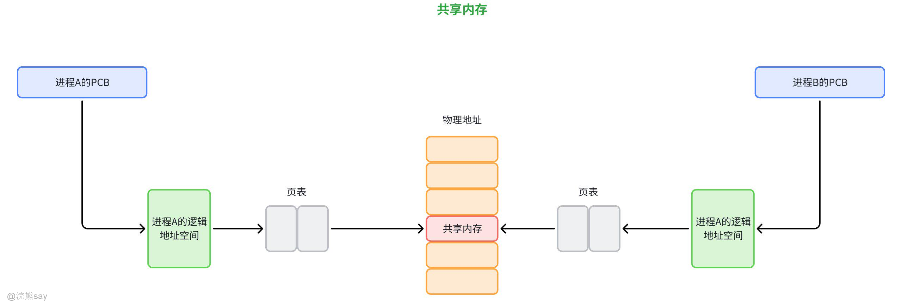

共享内存机制的出现，主要是为了规避消息队列中频繁进行消息拷贝和系统调用所带来的性能开销。从字面意义理解，共享内存允许无关联的进程将同一段物理内存映射到各自的地址空间中，使这些进程能够共同访问这块物理内存，这块内存便被称为共享内存。当某个进程向共享内存写入数据时，其改动会“立即”反映到所有可访问该共享内存的其他进程中。

结合内存管理的知识，我们可以深入理解共享内存的原理：每个进程都拥有自己的进程控制块（PCB）和逻辑地址空间（Addr Space），并且对应一套页表，用于将进程的逻辑地址（虚拟地址）与物理地址进行映射，这一过程由内存管理单元（MMU）负责管理。而共享内存的核心就在于，两个不同进程的逻辑地址通过各自的页表，最终映射到物理空间的同一区域，这个被共同指向的区域就是共享内存。

与消息队列需要频繁执行系统调用不同，共享内存机制仅在建立共享内存区域时需要一次系统调用。一旦共享内存建立完成，所有的访问操作都如同常规内存访问一般，无需再依赖内核介入。这使得数据无需在进程间来回拷贝，因此共享内存成为速度最快的进程间通信方式。

### 信号量（Semaphore）和PV操作

信号量是用于多进程访问共享数据的计数器，主要用于进程间同步,其使用涉及三个关键操作：

1.  **创建一个信号量**：这要求调用者指定初始值，对于二值信号量来说，它通常是1，也可是0。
2.  **等待一个信号量**：该操作会测试这个信号量的值，如果小于0，就阻塞。也称为P操作。
3.  **挂出一个信号量**：该操作将信号量的值加1，也称为V操作。

为确保正确性，信号量值的测试及减1操作需为原子操作，因此通常在内核中实现。在Linux环境中，信号量有三种类型：Posix有名信号量（使用Posix IPC名字标识）、Posix基于内存的信号量（存于共享内存区）和System V信号量（由内核维护），三者均可用于进程间或线程间的同步。

### 套接字（Socket）

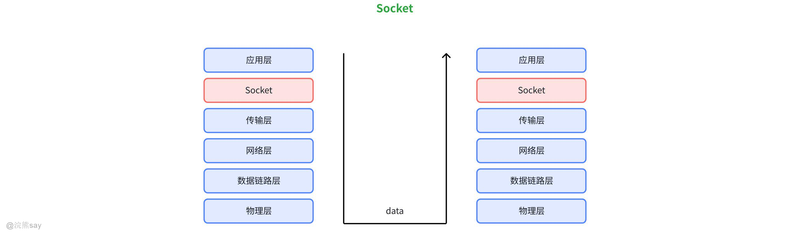

套接字（Socket）是计算机网络中实现进程间通信的一种机制，它为不同设备或同一设备上的进程提供了通过网络交换数据的接口。

从本质上看，套接字是网络协议栈中的一个抽象表示，包含了通信所需的关键信息：如本地主机地址、端口号，以及远程主机的地址和端口等，这些信息共同确定了网络中两个进程之间的连接端点。

在网络编程中，套接字是实现TCP/IP等协议通信的基础工具。它支持两种主要的通信模式：面向连接的TCP（传输控制协议）和无连接的UDP（用户数据报协议）。使用TCP时，通信双方需先通过三次握手建立可靠连接，确保数据按序、无差错地传输；而UDP则不建立连接，直接发送数据，虽传输效率较高，但不保证数据的可靠性和顺序性。

套接字的工作流程通常包括创建套接字、绑定地址和端口、监听连接（服务器端）或发起连接（客户端）、数据传输以及关闭连接等步骤。这种机制屏蔽了底层网络硬件和协议的细节，让开发者能更便捷地实现网络通信功能，是构建各类网络应用（如网页浏览、文件传输、即时通讯等）的核心技术之一。

### 内存映射文件（Memory-mapped Files）

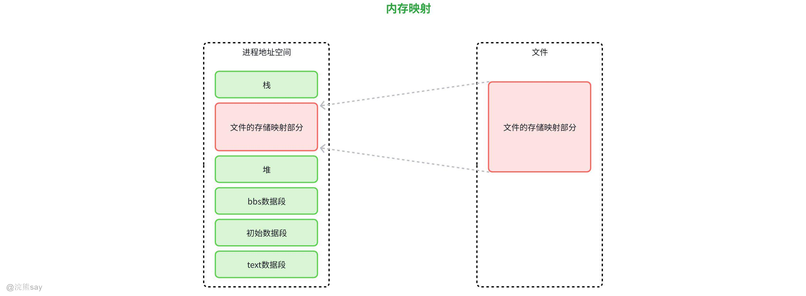

文件映射（File Mapping）是一种将磁盘文件的部分或全部内容直接映射到进程地址空间的技术，使得进程可以像访问内存一样访问文件内容，无需通过传统的读写操作（如read/write）来处理文件数据。

其核心原理是通过操作系统的内存管理机制，建立磁盘文件与进程虚拟地址空间之间的映射关系。当进程访问这段映射的内存区域时，操作系统会自动完成数据在内存与磁盘之间的交换，实现了文件数据与内存数据的同步。

文件映射的优势在于高效性，尤其适用于处理大型文件。传统的文件读写需要多次系统调用和数据缓冲区拷贝，而文件映射减少了这些中间环节，允许进程直接操作内存中的数据，大幅提升了大文件的处理效率。此外，它还支持多进程共享映射区域，便于进程间通过共享内存进行数据交换，简化了进程间通信的实现。

在使用上，文件映射通常涉及打开文件、创建映射（指定映射区域大小和权限）、获取映射的内存地址、操作内存数据，最后解除映射并关闭文件等步骤。不过，这种技术也有一定限制，例如映射的文件大小受进程地址空间限制，且对于频繁小范围修改的小文件，其优势并不明显。

文件映射在很多场景中被广泛应用，如数据库系统处理大型数据文件、编辑器打开大文档、共享库的加载等，是提升文件操作性能的重要手段。

### IPC机制对比与选择
| 机制 | 速度 | 数据量 | 跨主机 | 适用场景 |
| --- | --- | --- | --- | --- |
| 管道 | 中 | 小 | 否 | 父子进程简单通信 |
| 命名管道 | 中 | 小 | 否 | 无亲缘进程简单通信 |
| 信号 | 快 | 极小 | 否 | 事件通知（如异常处理） |
| 消息队列 | 中 | 中 | 否 | 按类型/优先级传递消息 |
| 共享内存 | 最快 | 大 | 否 | 高性能数据共享 |
| 信号量 | 快 | 无 | 否 | 同步与互斥控制 |
| 套接字 | 中/慢 | 任意 | 是 | 网络通信或复杂本地通信 |
| 内存映射文件 | 快 | 极大 | 否 | 持久化大数据共享 |

选择时需权衡：通信效率、数据量、是否跨主机、同步需求等因素。例如，高频低延迟场景选共享内存+信号量，网络场景选套接字；简单通知选信号。
| 【真题示例】UNIX 系统中提供了一种实现进程间的传送机制，把一个进程的标准输出与另一个进程的标准 输入连接起来，着种机制称为( )。A.重定向B.管道C.过滤器D.消息缓冲答案：B解析： 管道就是 UNIX 里专门用来连接两个进程的机制 —— 把前一个进程的输出，直接当成后一个进程的输入（比如命令行里的 “|” 就是管道）。A 重定向是改输入输出的目标（比如输出到文件），C 过滤器是处理数据的程序，D 消息缓冲是另一种进程通信方式，都不是 “直接连接输出和输入” 的机制。 |
| --- |

| 【真题示例】在并发拷贝中，一进程读管道时发现管道中没有内容时将转入( )状态。A.封锁B.就绪C.读源文件D.写源文件答案：A解析： 读管道时没内容，进程就会 “等数据”，暂时卡住 —— 也就是转入封锁（阻塞）状态，直到有其他进程往管道里写数据。B 就绪是等 CPU，C、D 都不是进程状态，所以不对。 |
| --- |

## 什么是线程

## 线程的基本概念

### 什么是线程

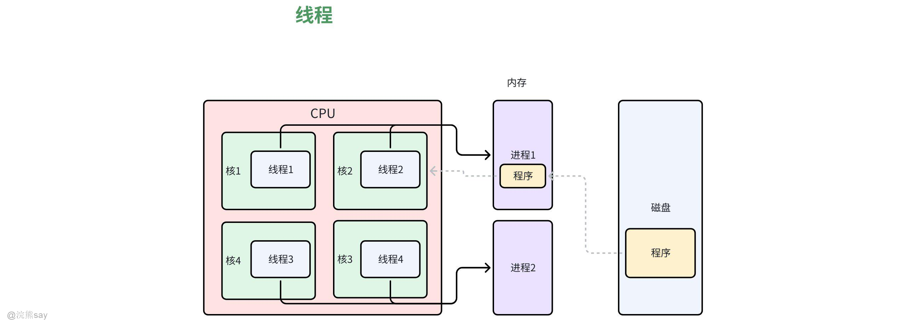

在计算机操作系统和程序设计领域，线程（Thread）是进程内部的基本执行单元，也是操作系统进行任务调度和资源分配的最小单位。要准确理解线程，需先明确其与 “进程” 的关联 —— 进程是程序在计算机中的一次运行实例，包含了程序执行所需的代码、数据、内存空间等资源，而线程则是在进程资源的基础上，独立负责指令执行的 “轻量级实体”。一个进程至少包含一个线程（称为 “主线程”），也可根据需求创建多个线程（即 “多线程”），这些线程共享所属进程的内存空间（如全局变量、静态变量、代码段等），但各自拥有独立的程序计数器（记录当前执行指令位置）、寄存器组（暂存计算数据）和栈空间（存储函数调用与局部变量），这种资源共享与局部独立的特性，决定了线程的核心价值。

从操作系统调度角度看，线程的 “轻量级” 体现在两个关键维度：一是创建与销毁开销低，由于线程无需像进程那样申请独立的内存空间和系统资源，仅需分配少量私有数据结构（如栈和寄存器），因此创建速度远快于进程，销毁时资源回收也更高效；二是上下文切换效率高，当操作系统在不同线程间切换时，只需保存和恢复线程的程序计数器、寄存器等少量信息，无需切换进程的内存映射和资源句柄，这使得多线程程序在处理高频任务切换时，能显著减少系统资源消耗，提升整体执行效率。

在实际应用中，线程的核心作用是实现 “并发执行”—— 即使在单 CPU 环境下，操作系统通过分时调度（将 CPU 时间片分配给不同线程），也能让多个线程 “交替执行”，从用户视角呈现出 “同时运行” 的效果；而在多 CPU 或多核环境下，线程可被分配到不同核心上 “并行执行”，真正实现多个任务的同步推进，这对于提升程序响应速度（如图形界面程序中，用独立线程处理用户交互与后台数据加载，避免界面卡顿）、优化资源利用率（如服务器程序中，用多线程同时处理多个客户端请求，充分利用 CPU 资源）具有关键意义。

### 线程特性

1.  **轻量级**：线程是轻量级的进程，与同进程中的其他线程共享内存空间和资源（如文件描述符、全局变量等），创建和销毁的开销比进程小得多。
2.  **独立性**：每个线程有自己独立的程序计数器（PC）、栈空间和寄存器集合，这使得线程能够独立执行代码路径。
3.  **并发性**：多个线程可以在同一进程中并发执行，操作系统通过时间分片等方式实现线程的快速切换，宏观上表现为同时运行。
4.  **共享性**：同一进程内的线程共享进程的地址空间和资源，这使得线程间通信更加高效，但也需要注意同步问题。
5.  **动态性**：线程有生命周期，包括新建、就绪、运行、阻塞和终止等状态，会在这些状态间动态转换。

| 【真题示例】在引入线程的操作系统中，把()作为调度和分派的基本单位，而把()作为资源拥有 的基本单位。A. 进程、线程B. 程序、线程C. 程序、进程D. 线程、进程答案：D解析： 引入线程后，CPU 调度的基本单位是线程（线程更轻量化，切换快），而资源（内存、设备等）的拥有者还是进程（进程分配资源，线程共享进程的资源）。简单说：“调度看线程，资源归进程”，对应选项 D。 |
| --- |

| 【真题示例】在下面的叙述中不正确的是( )。A.线程是比进程更小的能独立运行的基本单位B. 引入线程可提高程序并发执行的程度，可进 一步提高系统效率C. 线程的引入增加了程序执行时时空开销D.一个进程一定包含多个线程答案：C、D解析： 逐个看选项：A 正确：线程比进程小，能独立被 CPU 调度运行；B 正确：线程切换开销比进程小，能提高并发度和系统效率；C 错误：线程引入是减少时空开销（比如切换线程比切换进程快），不是增加；D 错误：一个进程可以只有一个线程（单线程进程，比如简单的小程序），不是 “一定包含多个”。 |
| --- |

## 线程状态以及管理

### 线程状态参数

在操作系统中，每个线程通过线程标识符和一组状态参数来描述，主要包括：

1.  **寄存器状态**：包含程序计数器（PC）和堆栈指针中的内容，用于记录线程执行位置和堆栈信息。
2.  **堆栈**：存储局部变量和返回地址，为线程独立执行提供数据支撑。
3.  **线程运行状态**：描述线程当前所处的运行阶段（如就绪、运行、等待等）。
4.  **优先级**：决定线程获得CPU调度的优先顺序。
5.  **线程专有存储器**：用于保存线程自身的局部变量拷贝，确保线程数据独立性。
6.  **信号屏蔽**：对某些信号进行屏蔽，避免不必要的信号干扰线程执行。

### 线程的基本状态

线程作为调度和执行的基本单位，在生命周期中会经历以下状态变化：

1.  **就绪状态**：线程已满足执行条件，仅等待调度程序分配CPU资源。
2.  **运行状态**：线程正在CPU上执行指令，占据处理器资源。
3.  **等待状态**：线程因等待某一事件（如I/O操作完成、信号触发等）而暂停执行，释放CPU资源。

这些状态之间会根据系统调度和事件触发进行转换，例如：就绪状态的线程被调度后进入运行状态；运行中的线程因等待事件进入等待状态；等待状态的线程在事件完成后重新进入就绪状态，等待下一次调度。

## 进程与线程的区别

### 进程与线程的比较

1.  **调度**：进程中可能有多个线程，一个线程阻塞并不影响整个进程，进程中的其他线程仍然可以参与调度运行。
2.  **并发性**：进程间可并发，同一进程中的线程间亦可并发；在多CPU环境中，线程可以被分配到不同的CPU上并行运行，而进程只能在一个CPU上运行。
3.  **拥有资源**：进程拥有资源，进程中有挂起操作，线程不拥有资源，没有权力决定进程或自己从主存撤出，挂起只是进程一级的概念。
4.  **系统开销**：线程上下文切换比进程上下文切换要快得多，同一进程中的线程切换系统开销小。
5.  **地址空间和其他资源(如打开文件)**：进程间相互独立，同一进程的各线程间共享(某进程内的线程在其他进程不可见)。
6.  **通信**：进程间通信通过IPC，线程间可以直接读写进程数据段(如全局变量)来进行通信，需要进程同步和互斥手段的辅助，以保证数据的一致性。

### 多线程OS中的进程

在多线程OS中，进程的角色和属性与传统单线程OS有显著差异，核心特点如下：

1.  **资源分配的基本单位**：进程不再作为执行实体，而是系统资源（如内存地址空间、打开的文件、设备句柄等）的拥有者和分配单位，为其内部的多个线程提供运行所需的资源基础。
2.  **包含多个线程**：一个进程通常包含多个线程，这些线程共享进程的全部资源，通过并发执行来完成进程的任务目标。
3.  **非执行实体**：在多线程OS中，进程不再直接参与CPU调度和执行，**线程才是调度和执行的基本单位** ，进程的存在主要是为了整合和管理资源，支持线程的并发运行。

## 多线程的实现

### 线程控制原语

**(1) 线程控制原语：**包含创建线程原语、撤消线程原语、阻塞或等待原语、挂起一个线程、恢复一个线程、改变优先数。

**(2) 线程创建：**在多线程 OS 环境下，应用程序在启动时，通常仅有一个线程在执行，该线程被人们称为 “初始化线程”。它可根据需要再去创建若干个线程。在创建新线程时，需要利用一个线程创建函数 (或系统调用)，并提供相应的参数，如指向线程主程序的入口指针、堆栈的大小，以及用于调度的优先级等。在线程创建函数执行完后，将返回一个线程标识符供以后使用。

**(3) 线程终止：**终止线程的方式有两种：一种是在线程完成了自己的工作后自愿退出；另一种是线程在运行中出现错误或由于某种原因而被其它线程强行终止。

### 线程的实现

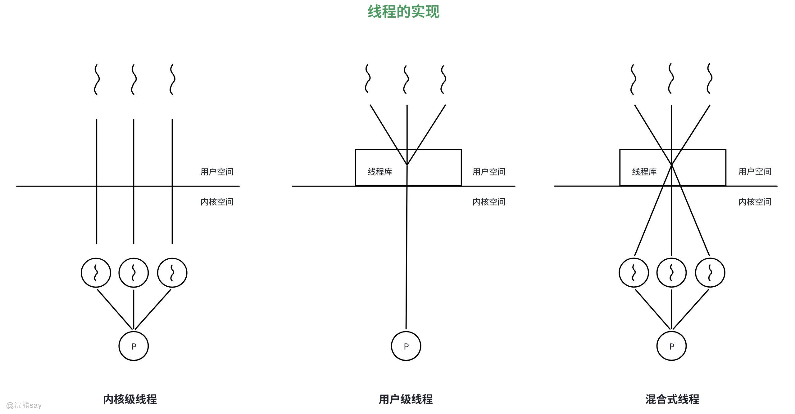

**(1) 用户级线程 (ULT)：**由用户应用程序建立、调度和管理的线程；不依赖于 OS 内核，应用进程利用线程库提供创建、同步、调度和管理线程的函数来控制用户线程。调度由应用软件内部进行，通常采用非抢先式和更简单的规则，也无需用户态 / 核心态切换，所以速度特别快。一个线程发起系统调用而阻塞，则整个进程在等待。时间片分配给进程，多线程则每个线程就慢。

-   线程库：基于多线程的应用程序的开发和运行环境。其作用是：创建、撤消线程；在线程之间传递消息和数据；调度线程执行；保护和恢复线程上下文。
-   用户级线程的活动：内核不知道线程的活动，但仍然管理线程所属进程的活动；当线程调用系统调用时，整个进程阻塞；但对线程库来说，线程仍然是运行状态，即线程状态是与进程状态独立的。
-   用户级线程的优点：线程切换不调用内核；调度是应用程序特定的，可以选择最好的算法；ULT 可运行在任何操作系统上 (只需要线程库)。
-   用户级线程的缺点：大多数系统调用是阻塞的，因此核心阻塞进程，故进程中所有线程将被阻塞；核心只将处理器分配给进程，同一进程中的两个线程不能同时运行于两个处理器上。

**(2) 内核级线程 (KLT)：**由操作系统的内核建立、调度和管理的线程；所有线程管理由内核完成；没有线程库，但对内核线程工具提供 API；内核维护进程和线程的上下文；线程之间的切换需要内核支持；以线程为基础进行调度。

-   内核级线程的优点：对多处理器，内核可以同时调度同一进程的多个线程；阻塞是在线程一级完成；内核例程是多线程的。
-   内核级线程的缺点：在同一进程内的线程切换调用内核，导致速度下降。

用户级和内核级线程有以下不同：

-   调度和切换速度：ULT 切换快，KLT 切换与进程切换相似。ULT 通常发生在一个应用进程的诸线程中，无需通过中断进入内核。
-   系统调用：ULT 进行系统调用时，会引起进程的阻塞；KLT 进行系统调用时只会引起该线程阻塞。
-   线程执行时间：ULT 以进程为单位调度，KLT 以线程为单位调度。例如：ULT—— 进程 A 有 1 个线程，进程 B 有 100 个线程，则 A 的线程比 B 快；KLT—— 进程 A 有 1 个线程，进程 B 有 100 个线程，则 B 比 A 快。
-   使用范围：ULT 广，任何 OS；KLT 需 OS 内核支持。
-   调度算法：ULT 与 OS 调度算法无关，可针对应用优化。
-   多处理器支持：KLT 可充分利用多处理器。

**(3) 混合式线程：**线程创建在用户空间完成；大量线程调度和同步在用户空间完成，程序员可以调整 KLT 的数量，可以取两者中最好的，根据线程运行的地址空间可分为：

-   用户线程：运行在用户地址空间的线程。
-   内核线程：运行在内核空间的线程。所有用户级线程都是用户线程。
-   内核级线程可以是用户线程，也可以是内核线程。

| 【真题示例】若系统中只有用户级线程，则处理机调度单位是()。A.线程B.进程C.程序D.作业答案：B解析： 用户级线程是在用户空间管理的，操作系统（内核）看不到这些线程，只认识进程。所以处理机（CPU）的调度单位还是进程 —— 内核先把 CPU 分给进程，进程再自己调度内部的用户级线程。如果是内核级线程，调度单位才是线程，这里明确是 “用户级线程”，所以选 B。 |
| --- |

## 进程调度算法

调度的核心是系统资源的合理分配，而调度算法则是实现这一目标的具体规则 —— 它根据系统预设的资源分配策略（如追求高吞吐量、低响应时间、公平性等），决定如何将 CPU、内存等关键资源分配给作业或进程。不同调度算法的适用场景存在差异：部分仅适用于作业调度（如批处理系统中选择作业进入内存），部分仅适用于进程调度（如分时系统中分配 CPU），还有部分可同时支持两种调度场景。

操作系统中核心的调度算法包括：先进先出调度算法（FCFS）、优先级调度算法、时间片轮转算法（RR）、最短进程优先调度算法（SJF）、最短剩余时间优先调度算法（SRTF）、最高响应比优先调度算法（HRRN）、多级反馈队列调度算法

## 先进先出调度算法（First-Come, First-Served，FCFS）

FCFS 是最基础的调度算法，其核心逻辑遵循 “先来后到” 的原则，是理解其他复杂算法的基础。

### 核心机制

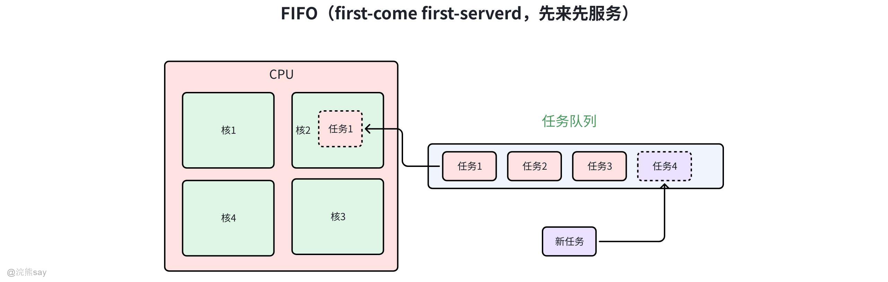

**基本原则：**完全按照作业提交到系统的顺序（或进程进入就绪队列的先后次序）分配资源。即先提交的作业优先被调入内存，先进入就绪队列的进程优先获得 CPU。

**调度方式：**不可抢占—— 一旦资源（如 CPU）分配给某个进程，必须等待该进程主动释放（如执行完成、发生 I/O 阻塞）后，才能分配给下一个进程，中间不会被其他进程打断。

**关键特性：**算法逻辑简单，实现成本低，无需复杂的优先级计算或时间估计，仅需维护一个 FIFO 队列即可。

### 优缺点分析

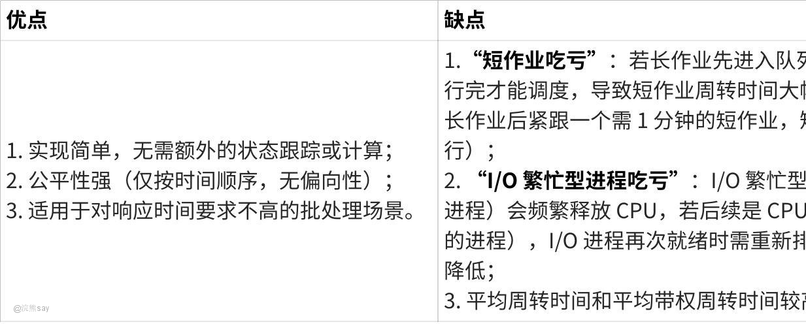

**点击图片可查看完整电子表格**

### 适用场景

-   不作为独立的核心调度策略，尤其不适用于分时系统（需快速响应用户交互）和实时系统（需严格满足时间约束）；
-   常作为 “辅助策略”，例如结合优先级算法使用（如低优先级队列内部采用 FCFS）；
-   可用于作业调度（批处理系统中选择作业进入内存）和进程调度（对响应时间要求低的场景）。

### 实例计算（以进程调度为例）

假设系统中有 4 个进程，提交时间和执行时间如下表，采用 FCFS 算法调度，计算周转时间、带权周转时间及平均值（注：周转时间 = 完成时间 - 提交时间；带权周转时间 = 周转时间 / 执行时间，用于衡量 “实际等待成本与执行成本的比例”，值越小越好）：

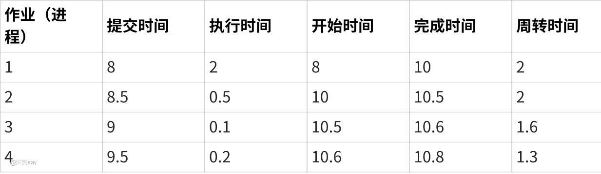

**点击图片可查看完整电子表格**

-   平均周转时间：(2.00 + 2.00 + 1.60 + 1.30) / 4 = 1.725
-   平均带权周转时间：(1 + 4 + 16 + 6.5) / 4 = 6.875

从结果可见，短作业（如作业 3，执行时间 0.10）因排在长作业后，带权周转时间高达 16，资源利用率极低。

## 优先级调度算法（Priority Scheduling）

优先级调度算法通过为作业 / 进程分配 “优先级”，让高优先级任务优先获得资源，解决了 FCFS 对关键任务响应不足的问题。

### 核心机制

**基本原则：**按照作业或进程的优先级高低分配资源 —— 优先级越高，越先获得 CPU 或被调入内存。优先级可通过数值表示（如 0 为最高优先级，数值越大优先级越低；或反之）。

**应用场景：**同时适用于作业调度（选择高优先级作业进入内存）和进程调度（分配 CPU 给高优先级进程）。

**调度方式分类：**

1.  非抢占式优先级调度：一旦低优先级进程获得 CPU，即使有高优先级进程进入就绪队列，也需等待低优先级进程执行完或主动阻塞后，高优先级进程才能调度（适用于对实时性要求不高的场景）；
2.  抢占式优先级调度：若有高优先级进程进入就绪队列，无论当前进程是否执行完，立即抢占 CPU 并分配给高优先级进程（适用于实时系统，如工业控制、医疗设备，需优先响应紧急任务）。

### 优先级的确定方式

优先级的设定直接影响调度公平性和系统性能，分为 “静态” 和 “动态” 两种方式：

# （1）静态优先级

-   定义：在作业 / 进程创建时，由系统或用户根据预设规则确定优先级，且在整个生命周期内保持不变。
-   优先级判定依据：
-   系统层面：进程类型（如内核进程优先级高于用户进程）、资源需求（如内存需求少的进程优先级可略高）；
-   用户层面：用户可通过命令指定作业优先级（如 Linux 的nice命令），但需受系统权限限制（避免用户滥用高优先级）。
-   优缺点：实现简单，系统开销小；但无法适应进程运行状态的变化，可能导致低优先级进程长期 “饥饿”（如始终有高优先级进程进入队列，低优先级进程永远无法调度）。

# （2）动态优先级

-   定义：在作业 / 进程创建时赋予初始优先级，在运行过程中根据实际状态动态调整，以优化调度性能。
-   常见调整规则：

1.  等待时间补偿：进程在就绪队列中等待时间越长，优先级越高（例如每等待 1 秒，优先级数值 + 1），避免低优先级进程 “饥饿”；
2.  执行时间惩罚：进程每占用 CPU 一个时间片，优先级降低（例如每执行 100ms，优先级数值 - 1），防止单个进程长期占用 CPU；
3.  I/O 行为激励：I/O 繁忙型进程（如频繁读写磁盘、网络的进程）优先级适当提高 —— 这类进程占用 CPU 时间短，频繁释放 CPU 用于 I/O，提高其优先级可减少 I/O 设备空闲时间。

-   优缺点：能动态适应系统状态，减少 “饥饿” 现象，调度更公平；但需实时跟踪进程状态并计算优先级，系统开销略高于静态优先级。

### 优缺点分析

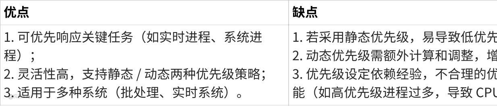

**点击图片可查看完整电子表格**

## 时间片轮转算法（Round-Robin，RR）

RR 算法是分时系统的核心调度算法，其目标是让多个用户进程 “公平共享 CPU”，保证每个用户的交互请求能及时响应（如键盘输入、鼠标操作）。

### 核心机制

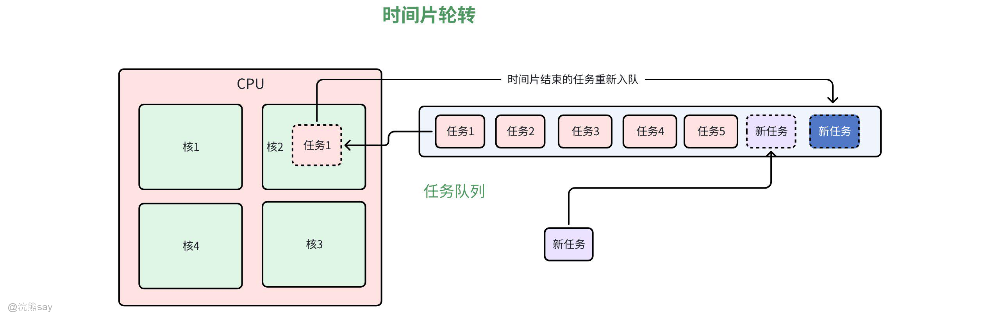

-   基本原则：

1.  队列管理：将系统中所有就绪进程按 FIFO 原则排成一个就绪队列；
2.  时间片分配：每次调度时，将 CPU 分配给队首进程，允许其执行一个固定时长的 “时间片”（通常为 10ms~100ms，由系统根据硬件性能和用户需求设定）；
3.  调度触发：

-   若进程在时间片内执行完成，主动释放 CPU，调度程序将其从队列中移除，调度下一个队首进程；
-   若时间片结束时进程仍未执行完，触发时钟中断，调度程序暂停当前进程，将其移至就绪队列末尾，然后调度新的队首进程；
-   若进程在时间片内需要 I/O 操作（如读文件），主动进入阻塞队列，CPU 分配给下一个进程。
-   调度方式：可抢占—— 时间片结束是强制抢占 CPU 的触发条件，确保没有进程能长期占用 CPU。
-   核心目标：保证 “响应时间公平”，每个进程都能在较短时间内获得 CPU，满足分时系统中用户对交互延迟的要求（通常响应时间需控制在 1~3 秒内）。

### 时间片长度的确定（关键设计点）

时间片的长度直接影响系统响应时间和 CPU 利用率，是 RR 算法的核心参数，需平衡以下因素：

# （1）时间片过长的问题

-   若时间片长度超过大多数进程的执行时间（如设置为 10 秒，而多数进程只需 1 秒即可完成），则 RR 算法退化为 FCFS 算法 —— 长进程会阻塞短进程，响应时间大幅延长，失去分时系统的 “交互性”。

# （2）时间片过短的问题

-   时间片过短（如 1ms）会导致进程切换过于频繁：每次切换需保存当前进程的上下文（寄存器、程序计数器、栈指针等），并加载下一个进程的上下文，这一过程会消耗 CPU 时间（称为 “上下文切换开销”）。
-   例如：若时间片为 1ms，上下文切换开销为 0.1ms，则 CPU 用于实际计算的时间仅为 1/(1+0.1)≈90.9%，其余时间浪费在切换上，系统吞吐量下降。

# （3）影响时间片长度的关键因素

1.  就绪进程数目：当系统响应时间要求固定时，就绪进程越多，时间片应越小（例如响应时间要求 2 秒，若有 20 个就绪进程，时间片需≤100ms，才能保证每个进程在 2 秒内获得一次 CPU）；
2.  系统处理能力：时间片长度应确保 “用户一次交互请求能在一个时间片内处理完”（如键盘输入一个字符，处理逻辑需在 100ms 内完成），否则用户需等待多个时间片才能看到响应，体验下降；
3.  上下文切换开销：时间片长度应远大于上下文切换开销（通常建议时间片是切换开销的 10 倍以上），避免切换开销占比过高。

### 适用场景与优缺点

-   适用场景：仅用于进程调度，是分时系统（如 Linux、Windows 的桌面模式）的默认调度策略；也可用于多用户共享的服务器（如 Web 服务器），保证多个客户端请求公平响应。
-   优点：

1.  响应时间公平，每个进程都能及时获得 CPU，无 “饥饿” 风险；
2.  交互性好，符合分时系统用户对延迟的要求；
3.  实现逻辑清晰，仅需维护 FIFO 队列和时间片计时器。

-   缺点：

1.  平均周转时间和带权周转时间可能高于 SJF、HRRN 等算法（因短进程可能需多次时间片才能完成）；
2.  时间片长度需人工调优，不合理的设置会影响性能；
3.  对长进程不友好 —— 长进程需多次排队等待时间片，完成时间可能延长。

## 最短进程优先调度算法（Shortest-Job-First，SJF）

SJF 算法的核心思想是 “优先处理短任务”，通过减少短任务的等待时间，降低系统的平均周转时间，是批处理系统中常用的高效算法。

### 核心机制

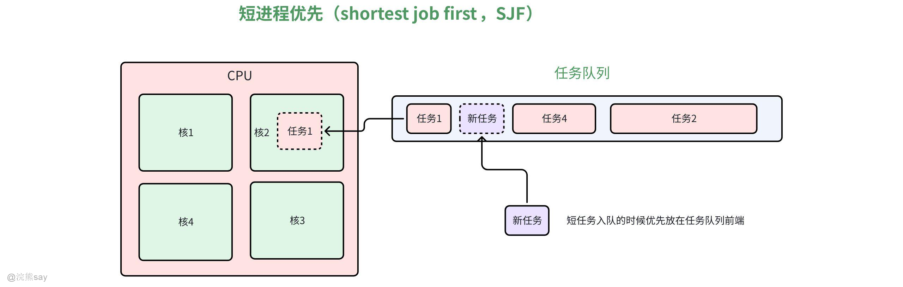

-   基本原则：从就绪队列（或待调度作业队列）中，选择估计执行时间最短的作业 / 进程优先分配资源（CPU 或内存）。
-   调度方式：非抢占式—— 一旦短进程获得 CPU，必须执行完成或主动阻塞（如 I/O 请求），才能调度其他进程；即使有更短的进程进入就绪队列，也需等待当前进程释放 CPU。
-   执行时间估计：算法依赖对作业 / 进程执行时间的 “预先估计”，通常由用户在提交作业时指定（如批处理系统中用户填写作业预计运行时间），或由系统根据历史执行数据预测（如根据该进程上次的执行时间估算本次时间）。

### 适用场景与优缺点

-   适用场景：主要用于批处理系统的作业调度，或对交互性要求不高的进程调度；不适用于分时系统（分时系统需快速响应，而 SJF 可能让长进程阻塞短交互进程）。
-   优点：

1.  相比 FCFS 算法，能显著降低平均周转时间和平均带权周转时间（短进程优先执行，减少了长进程对短进程的阻塞）；
2.  系统吞吐量高（单位时间内可完成更多短进程）。

-   缺点：

1.  “长进程饥饿”：若系统中持续有短进程进入队列，长进程会被无限期推迟调度，导致 “饥饿”（极端情况下可能永远无法执行）；
2.  执行时间估计不准确：用户可能低估作业执行时间（以获得优先调度），或系统预测偏差大，导致实际调度性能下降；
3.  无紧急度区分：无法优先响应紧急任务（如实时进程），仅按执行时间长短调度。

### 实例计算（与 FCFS 对比）

仍以 4 个进程为例，采用 SJF 算法调度，计算关键指标（注：作业 1 执行期间，作业 2、3、4 依次提交，作业 1 完成后，选择就绪队列中执行时间最短的进程）：

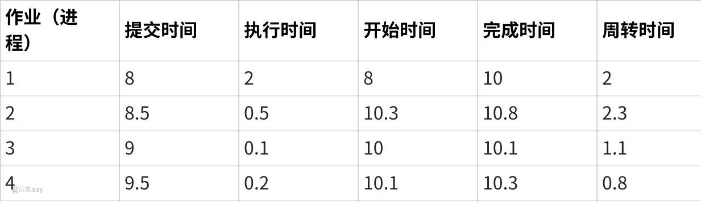

**点击图片可查看完整电子表格**

-   平均周转时间：(2.00 + 2.30 + 1.10 + 0.80) / 4 = 1.55
-   平均带权周转时间：(1 + 4.6 + 11 + 4) / 4 = 5.15

对比 FCFS 的结果（平均周转时间 1.725，平均带权周转时间 6.875），SJF 的两项指标均显著降低，证明其对系统效率的提升。

## 最短剩余时间优先调度算法（Shortest Remaining Time First，SRTF）

SRTF 是 SJF 算法的 “抢占式变种”，通过实时比较进程的剩余执行时间，进一步优化短进程的响应速度，适用于对延迟敏感的场景。

### 核心机制

-   基本原则：在任何时刻，调度程序都选择剩余执行时间最短的进程占用 CPU—— 不仅包括就绪队列中的进程，还包括新进入系统的进程。
-   调度方式：可抢占式—— 当有新进程进入就绪队列时，若其估计执行时间（即剩余执行时间，因新进程未执行过）短于当前运行进程的剩余执行时间，立即抢占 CPU，将当前进程放回就绪队列，执行新进程。
-   剩余执行时间计算：剩余执行时间 = 初始估计执行时间 - 已执行时间（需系统实时跟踪进程的执行时长）。

### 适用场景与优缺点

-   适用场景：可用于分时系统（需快速响应短交互进程）和批处理系统，尤其适合短进程占比较高的场景。
-   优点：

1.  相比 SJF（非抢占式），进一步缩短短进程的等待时间和周转时间，平均周转时间更低；
2.  对短进程的响应更及时，减少了短进程被长进程阻塞的时间。

-   缺点：

1.  执行时间估计依赖度高：若估计不准确，抢占逻辑可能失效，甚至导致调度性能比 SJF 更差；
2.  系统开销大：需实时跟踪每个进程的剩余执行时间，且新进程进入时需频繁比较和切换 CPU，上下文切换开销高于 SJF；
3.  长进程 “饥饿” 风险更高：若持续有短进程进入，长进程的剩余执行时间可能始终高于新短进程，导致长期无法执行。

## 最高响应比优先调度算法（Highest Response Ratio Next，HRRN）

HRRN 是 FCFS 和 SJF 的 “折中算法”，通过引入 “响应比” 这一动态指标，兼顾短进程、长进程和等待时间长的进程，解决了 FCFS 对短进程不利、SJF 对长进程不利的问题。

### 核心机制

-   基本原则：调度时选择响应比最高的作业 / 进程优先分配资源，响应比综合考虑了进程的 “等待时间” 和 “执行时间”，避免单一指标的偏向性。
-   响应比计算公式：
    响应比 = (等待时间 + 要求的服务时间) / 要求的服务时间 = 响应时间 / 要求的服务时间
    （注：响应时间 = 等待时间 + 服务时间，即从进程提交到完成的总时间）
-   调度方式：非抢占式—— 仅当当前进程执行完成或主动阻塞后，才计算所有就绪进程的响应比，选择最高者调度，避免频繁计算和切换的开销。

### 响应比的特性（为何能兼顾公平与效率）

-   对短进程友好：若多个进程等待时间相同，服务时间越短，响应比越高（如等待时间均为 1 秒，服务时间 1 秒的进程响应比 = 2，服务时间 5 秒的进程响应比 = 1.2，短进程优先）；
-   对长进程友好：若进程服务时间长，但等待时间足够长，响应比会逐渐升高（如服务时间 10 秒的进程，等待 10 秒后响应比 =(10+10)/10=2，可能超过新进入的短进程，避免 “饥饿”）；
-   对等待时间长的进程友好：即使是长进程，等待时间越长，响应比越高，确保其最终能被调度。

### 适用场景与优缺点

-   适用场景：适用于批处理系统，也可用于对公平性和效率要求均较高的通用系统，尤其适合长、短进程混合的场景。
-   优点：

1.  兼顾短进程（提高效率）、长进程（避免饥饿）、等待时间长的进程（保证公平），是综合性能最优的非抢占式算法之一；
2.  无需动态调整优先级，仅在调度时计算响应比，系统开销低于动态优先级算法。

-   缺点：

1.  调度前需计算所有就绪进程的响应比，相比 FCFS 增加了计算开销（尤其就绪进程数量多时）；
2.  非抢占式调度，对实时性要求高的进程响应不足（如紧急任务需等待当前进程执行完）。

### 实例计算

仍以 4 个进程为例，采用 HRRN 算法调度，计算关键指标（注：当前进程完成后，计算所有就绪进程的响应比，选择最高者）：

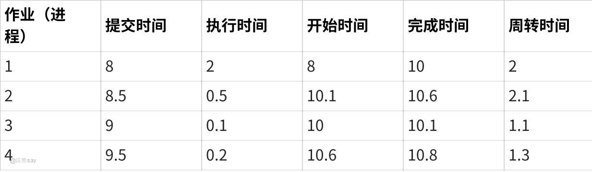

**点击图片可查看完整电子表格**

-   平均周转时间：(2.00 + 2.10 + 1.10 + 1.30) / 4 = 1.625
-   平均带权周转时间：(1 + 4.2 + 11 + 6.5) / 4 = 5.675

## 多级反馈队列调度算法（Multilevel Feedback Queue，MLFQ）

MLFQ 是目前主流操作系统（如 Linux、Windows）采用的调度算法，它融合了 “时间片轮转” 和 “优先级调度” 的优点，通过动态调整进程的优先级和时间片，无需预先估计执行时间，即可适应不同类型进程（短进程、长进程、I/O 型进程、计算型进程）的需求，是综合性能最优的调度算法之一。

### 核心机制（四阶段逻辑）

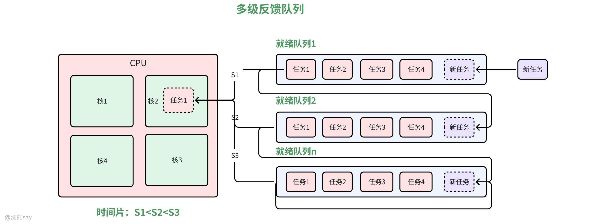

MLFQ 的核心是 “多队列 + 动态优先级 + 时间片调整”，具体逻辑分为以下四步：

# （1）队列层级与优先级设计

-   设置多个就绪队列（如 Linux 默认设置 140 个优先级队列，简化模型通常设 4~5 个），每个队列对应一个优先级 —— 队列编号越小，优先级越高（如队列 1 优先级最高，队列 2 次之，…，队列 n 优先级最低）。
-   每个队列对应一个固定时间片：优先级越高，时间片越短（如队列 1 时间片 10ms，队列 2 时间片 20ms，队列 3 时间片 40ms，队列 n 时间片 80ms）—— 高优先级队列的短时间片用于快速响应短进程，低优先级队列的长时间片减少长进程的切换开销。

# （2）初始调度逻辑

-   新进程创建后，默认进入最高优先级队列（队列 1）的末尾，按 FIFO 原则等待调度；
-   仅当最高优先级队列为空时，才调度次高优先级队列的进程；若低优先级队列调度时，有新进程进入高优先级队列，立即抢占 CPU，执行新进程。

# （3）动态优先级调整（核心优化点）

MLFQ 通过 “时间片用完降级” 和 “I/O 完成升级” 的规则，动态适配进程特性：

1.  时间片用完降级：若进程在当前队列的一个时间片内未执行完（说明不是短进程），自动降低优先级，移至下一级队列的末尾（如队列 1 的进程执行 10ms 未完成，移至队列 2 末尾）；
2.  I/O 完成升级：若进程在时间片内因 I/O 操作（如读磁盘、网络请求）主动阻塞，I/O 完成后回到之前所在队列（而非降级），甚至可适当升级队列（如从队列 2 升级到队列 1）—— 鼓励 I/O 型进程，减少 I/O 设备空闲时间；
3.  长期等待升级：若低优先级队列的进程等待时间过长（如超过 30 秒），自动升级到高一级队列，避免 “饥饿”（如队列 4 的进程等待 30 秒后，升级到队列 3）。

# （4）最终队列调度

进程若逐级降级至最低优先级队列（队列 n），则该队列采用 “时间片轮转” 算法调度 —— 长进程在低优先级队列中用较长时间片执行，减少切换开销。

### 优缺点与实际应用

**优点：**

1.  综合性能最优：兼顾短进程（低周转时间）、I/O 型进程（低响应时间）、长进程（无饥饿），满足所有用户需求；
2.  无需估计执行时间：通过动态调整自动适配进程特性，避免 SJF、SRTF 的估计误差问题；
3.  系统开销可控：仅在时间片用完或 I/O 完成时调整优先级，无实时计算开销，适合实际操作系统。

**缺点：**

1.  实现逻辑复杂（需维护多队列、动态调整优先级）；
2.  若队列层级和时间片设置不合理（如高优先级队列时间片过长），可能导致调度性能下降。

## 七大调度算法对比
| 算法名称 | 调度方式 | 核心指标 | 适用场景 | 优点 | 缺点 |
| --- | --- | --- | --- | --- | --- |
| 先进先出（FCFS） | 非抢占 | 提交顺序 | 批处理系统（辅助） | 实现简单，公平 | 短作业吃亏，平均周转时间高 |
| 优先级调度 | 抢占 / 非抢占 | 静态 / 动态优先级 | 实时系统、批处理系统 | 优先响应关键任务 | 低优先级进程易饥饿 |
| 时间片轮转（RR） | 抢占 | 时间片 + FIFO | 分时系统 | 响应时间公平，交互性好 | 平均周转时间高，时间片难调优 |
| 最短进程优先（SJF） | 非抢占 | 估计执行时间 | 批处理系统 | 平均周转时间低 | 长进程饥饿，依赖时间估计 |
| 最短剩余时间优先（SRTF） | 抢占 | 剩余执行时间 | 分时系统、批处理系统 | 最短平均周转时间 | 系统开销大，长进程饥饿风险高 |
| 最高响应比优先（HRRN） | 非抢占 | 响应比（等待 + 服务时间） | 批处理系统（通用） | 兼顾公平与效率，无饥饿 | 需计算响应比，实时性不足 |
| 多级反馈队列（MLFQ） | 抢占 | 动态优先级 + 时间片 | 通用系统（Linux/Windows） | 适配所有场景，综合性能最优 | 实现复杂 |

| 【例题1】一种既有利于短小作业又兼顾到长作业的作业调度算法是()A.先来先服务B.轮转C.最高响应比优先D.最短作业优先答案：C解析： 逐个看算法特点：A（先来先服务）：按作业到达顺序执行，长作业会堵着短作业，不利于短作业；B（轮转）：按时间片轮流执行，短作业能快速完成，但长作业会频繁切换，兼顾性一般；C（最高响应比优先）：响应比 =（等待时间 + 运行时间）/ 运行时间，短作业响应比高先执行，长作业等久了响应比也会提高，不会被饿死，完美兼顾短作业和长作业；D（最短作业优先）：只选最短的先执行，长作业可能一直等，不利于长作业。 |
| --- |

| 【例题2】时间片轮转调度算法是为了()A.多个终端都能得到系统的及时响应B.先来先服务C.优先级高的进程先使用 CPUD.紧急事 件优先处理答案：A解析： 时间片轮转是把 CPU 分成固定时间片，所有就绪进程轮流用。比如多个终端用户同时操作，每个用户的进程能分到时间片快速响应，不会出现 “一个用户占着 CPU，其他人等半天” 的情况，核心目的是让多个终端得到及时响应。B 是先来先服务的逻辑，C 是优先级调度，D 是紧急调度，都和轮转算法无关。 |
| --- |

| 【例题3】()调度算法与作业的估计运行时间有关。A.时间片轮转B.先来先服务C.优先级调度D.短作业优先答案：D解析： 短作业优先（SJF）的核心是 “选估计运行时间最短的作业先执行”，必须知道作业的估计运行时间才能调度，所以和估计运行时间直接相关。A（时间片轮转）只看时间片长度，B（先来先服务）看到达顺序，C（优先级调度）看优先级，都和作业估计运行时间没关系。 |
| --- |

## 同步和互斥

## 同步和互斥概念

### 同步概念

进程同步是指在多道程序环境下，进程是并发执行的，不同进程之间存在着不同的相互制约关 系。

(1)间接制约关系一互斥：多进程因共享资源而产生间接制约关系，例如各进程争用一台计算机， 这时各进程使用这台打印机时有一定的限制，如各进程随意使用打印机，会造成打印机结果交织在 一起难以区分。

(2)直接制约关系一同步：一组并发进程因直接制约而互相发送消息、进行互相合作、互相等待， 使得各进程按一定的速度执行的过程称为进程间的同步。

### 互斥概念

互斥是操作系统中用于解决多个进程或线程对共享资源（临界资源）竞争访问的机制，其核心目标是保证在同一时间内，只有一个执行单元（进程或线程）能够进入操作该资源的临界段（即访问共享资源的代码区域）。

这种机制通过限制对临界资源的排他性访问，防止多个执行单元同时操作共享资源而导致的数据不一致、逻辑错误等问题。例如，当多个线程需要修改同一个共享变量时，互斥机制能确保每次只有一个线程进行修改，避免因并发操作引发的计算错误。

实现互斥的方式包括软件方法（如各种标志位算法）和硬件方法（如中断屏蔽、专用硬件指令等），但软件方法往往存在局限性（如可能违反互斥性、前进性等原则），而硬件方法虽更有效，但也可能存在忙等待等问题。本质上，互斥是并发环境下保障共享资源访问安全性的基础手段。
| 【例题1】下列( )只属于进程互斥问题。A.田径场上的接力比赛B.一个进程读文件， 一个进程写文件C.一个生产者和一个消费者通过 一个缓冲区传递产品D.司机和售票员问题答案：B解析： 进程互斥的核心是 “竞争临界资源，不能同时访问”；同步是 “进程间有协作顺序，需按规则执行”。A（接力赛）：需按顺序传递接力棒，是进程同步（协作关系）；B（一读一写文件）：文件是临界资源，不能同时读写（否则数据混乱），只涉及互斥，无协作；C（生产者 - 消费者）：既需互斥访问缓冲区（互斥），又需 “先生产后消费”（同步），是混合问题；D（司机和售票员）：需 “停车开门、关门开车” 的协作顺序，是同步问题。 |
| --- |

| 【例题2】对进程间互斥的使用临界资源，进程可以()。A.互斥的进入临界区B.互斥的进入各自的临界区C.互斥的进入同一临界区D.互斥的进入各答案：C解析： 临界资源是多个进程共享的资源（如文件、缓冲区），临界区是访问该资源的代码段。进程互斥使用临界资源，本质是 “不能同时进入访问该资源的同一临界区”（比如多个进程读同一文件，需互斥进入读文件的临界区）；A、B 错：没强调 “同一临界区”（各自的临界区对应不同资源，无需互斥）；D 选项不完整，且逻辑不符。 |
| --- |

## 临界区和临界区资源

在操作系统中，临界区与临界区资源是解决**进程（或线程）并发执行时资源竞争问题** 的核心概念，二者紧密关联但定义不同，具体解释如下：

### 临界区资源（Critical Resource）

临界区资源，又称**共享资源** ，指的是计算机系统中**一次仅允许一个进程（或线程）访问的资源** 。这类资源若被多个进程同时操作，会导致数据不一致、结果错误或系统异常（例如两个进程同时修改同一个文件、同时操作打印机等），临界区资源主要分为两类：

1.  **硬件类**：如中央处理器（CPU，单CPU环境下同一时间仅能执行一个进程）、打印机、扫描仪、磁盘控制器等。

-   示例：打印机同一时间只能处理一个打印任务，若两个进程同时发送打印请求，会导致打印内容错乱。

1.  **软件类**：如共享变量、共享文件、数据库中的表、消息队列等。

-   示例：一个银行账户的余额变量（假设初始为1000元），若两个进程同时执行“取款500元”操作，可能因并发修改导致最终余额错误（理论应剩0元，实际可能剩500元）。

# 核心特性

-   **排他性**：必须保证同一时间只有一个进程（或线程）对其进行操作，否则会破坏资源的“一致性”。
-   **共享性**：多个进程（或线程）都有访问需求，若不共享则无需定义为临界区资源（如进程的私有栈、私有变量）。

### 临界区（Critical Section）

临界区是指**进程（或线程）中访问临界区资源的那段代码** 。换句话说，任何进程中涉及对“一次仅允许一个进程访问的资源”进行操作的代码片段，都属于该进程的临界区。

假设进程P1和P2都需要修改共享变量count（临界区资源），则两个进程中修改count的代码片段就是各自的临界区：

-   进程P1的临界区：count = count + 1;
-   进程P2的临界区：count = count - 1;

若不对这两段临界区代码的执行进行控制，可能出现“竞态条件”（Race Condition）——即count的最终结果依赖于进程执行的先后顺序，导致结果不可控。

### 临界区的访问原则（同步机制）

为了避免多个进程同时进入临界区导致资源竞争问题，操作系统要求进程访问临界区时必须遵循**“空闲让进、忙则等待、有限等待、让权等待”** 四大原则，通常通过同步机制（如信号量、互斥锁、管程等）实现：

1.  **空闲让进**：若临界区资源当前未被任何进程占用（临界区空闲），则允许申请访问的进程立即进入临界区。
2.  **忙则等待**：若临界区资源已被某个进程占用（临界区忙），则其他申请访问的进程必须等待，直到占用者退出临界区。
3.  **有限等待**：等待进入临界区的进程不能无限期等待，需保证在有限时间内一定能进入临界区（避免“饥饿”）。
4.  **让权等待**：若进程无法进入临界区（临界区忙），应主动释放CPU资源（如进入阻塞态），避免“忙等”（浪费CPU资源）。

| 【例题1】在多进程系统中，为了保证公共变量的完整性，各进程应互斥进入临界区。所谓临界区是指()。A.一个缓冲区B.一段数据区C.同步机制D.一段程序答案：D解析： 临界区不是资源或数据，而是进程中 “访问临界资源（比如公共变量、文件）的那段程序代码”。简单说：临界区是 “一段要互斥执行的代码”，不是 A（缓冲区，资源）、B（数据区，数据）、C（同步机制，工具），所以选 D |
| --- |

| 【例题2】在一段时间内，只允许一个进程访问的资源称为()。A.共享资源B.独占临源C.临界资源D.共享区答案：C解析： 临界资源的核心定义就是 “一段时间内只能让一个进程访问”（比如打印机、共享文件），避免数据混乱。A（共享资源）可以多个进程同时访问（比如只读文件），B 是错别字且逻辑不符，D（共享区）是存储区域不是资源类型，所以选 C。 |
| --- |

## 信号量机制

### 什么是信号量机制

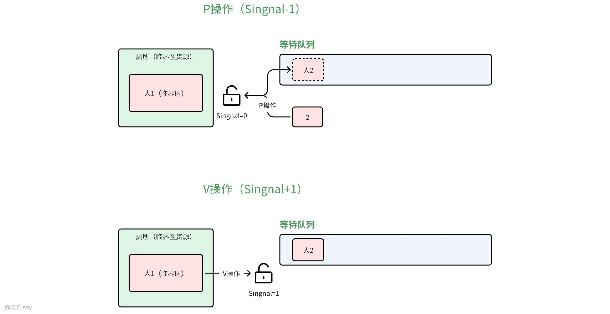

信号量是一种用于实现进程同步的机制，在多个相互合作的进程之间使用相同的信号来同步， 一个进程强制的被停止在一个特定的 地方直到收到一个专门的信号，这个信号也就是信号量。其核心原理有点儿像我们给厕所门口挂上了一把锁，包括Wait/P 操作、Signal/V 操作两种基本操作：

-   **P操作**：也称为等待操作，用于测试信号量的值。P操作会将信号量的值减1，如果结果大于等于0，则进程继续执行；如果结果小于0，则进程进入等待队列。
-   **V操作**：也称为信号操作，用于增加信号量的值。V操作会将信号量的值加1，如果结果大于0，则V操作结束；如果结果小于等于0，则唤醒等待队列中的一个进程。

信号量本质是通过 “信号” 控制进程的执行状态 —— 强制进程在特定位置暂停，直到收到允许继续的信号。Wait 和 Signal 操作必须 “完整执行，不可中断”，由硬件指令（如 test-and-set）或操作系统核心原语保证，避免并发操作导致的逻辑错误。

### 信号量物理含义

信号量用变量 S 表示，其值的变化直接反映资源状态和等待进程数，具体规则如下：
| 信号量值（S） | 物理含义 |
| --- | --- |
| S > 0 | 表示当前可用的共享资源数量（S 的值 = 剩余可用资源数） |
| S = 0 | 表示无可用资源，且无进程在等待队列中 |
| S  0：释放资源后无等待进程，当前进程继续执行；
-   若 S ≤ 0：表示等待队列中有进程，需唤醒队列中第一个进程（使其进入就绪态），当前进程继续执行。

| 【例题1】当一进程因在记录型信号量S 上执行V(S) 操作而导致唤醒另一进程后，S 的 值 为 ( )。A.>0B. Need\[i\]\[j\]（进程申请的资源超过其剩余需求），则**拒绝请求** （进程请求不合理，可能存在错误）。
2.  **检查请求是否可满足（不超过空闲资源）**若 Request\[i\]\[j\] > Available\[j\]（系统当前空闲资源不足以满足请求），则**拒绝请求** （进程需等待，避免资源不足导致死锁）。
3.  **模拟资源分配**若前两步通过，系统先“预分配”资源，更新核心数据结构（注意：此时并未实际分配，仅为验证安全）：

-   Available\[j\] = Available\[j\] - Request\[i\]\[j\]（空闲资源减少）；
-   Allocation\[i\]\[j\] = Allocation\[i\]\[j\] + Request\[i\]\[j\]（进程已分配资源增加）；
-   Need\[i\]\[j\] = Need\[i\]\[j\] - Request\[i\]\[j\]（进程剩余需求减少）。

1.  **验证安全状态**调用“步骤1：安全状态检查”，判断预分配后的系统是否处于安全状态：

-   若**安全** ：则**实际执行资源分配** （确认预分配的结果）；
-   若**不安全** ：则**撤销预分配** （恢复到分配前的数据结构），并拒绝进程的请求（避免系统进入不安全状态）。

### 示例：银行家算法执行流程

假设系统有 3个进程（P₀,P₁,P₂）、3种资源（R₀,R₁,R₂），初始数据如下：
| 进程 | Max（最大需求） | Allocation（已分配） | Need（剩余需求） | Available（空闲） |
| --- | --- | --- | --- | --- |
| P₀ | [7,5,3] | [0,1,0] | [7,4,3] | [3,3,2] |
| P₁ | [3,2,2] | [2,0,0] | [1,2,2] |   |
| P₂ | [9,0,2] | [3,0,2] | [6,0,0] |   |

## 初始安全状态检查

-   初始化：Work = \[3,3,2\]，Finish = \[F,F,F\]
-   遍历进程：
-   P₀：Need\[7,4,3\] > Work\[3,3,2\] → 不满足；
-   P₁：Need\[1,2,2\] ≤ Work\[3,3,2\] → 满足。标记Finish\[1\]=T，Work更新为 \[3+2, 3+0, 2+0\] = \[5,3,2\]；
-   再次遍历：P₀：Need\[7,4,3\] > Work\[5,3,2\] → 不满足；P₂：Need\[6,0,0\] > Work\[5,3,2\] → 不满足；
-   再次遍历：P₀：Need\[7,4,3\] > Work\[5,3,2\] → 不满足；P₂：Need\[6,0,0\] > Work\[5,3,2\] → 不满足？（实际需重新检查：P₂的Need\[6,0,0\] > Work\[5,3,2\]，仍不满足；此时需再次遍历已完成的P₁，无新进程。→ 此处初始状态是否安全？需修正：若P₁完成后，Work=\[5,3,2\]，再检查P₂：Need\[6,0,0\] > 5 → 不满足；检查P₀：Need\[7,4,3\] > 5 → 不满足。因此初始状态\*\*不安全\*\*？需调整示例数据，此处仅为流程演示。）

## 假设P₁请求资源Request[1] = [0,1,0]

-   步骤1：检查Request\[1\] = \[0,1,0\] ≤ Need\[1\] = \[1,2,2\] → 合法；
-   步骤2：检查Request\[1\] = \[0,1,0\] ≤ Available = \[3,3,2\] → 可满足；
-   步骤3：预分配：
-   Available = \[3-0, 3-1, 2-0\] = \[3,2,2\]；
-   Allocation\[1\] = \[2+0, 0+1, 0+0\] = \[2,1,0\]；
-   Need\[1\] = \[1-0, 2-1, 2-0\] = \[1,1,2\]；
-   步骤4：安全检查：
-   Work = \[3,2,2\]，Finish=\[F,F,F\]；
-   找P₁：Need\[1,1,2\] ≤ Work\[3,2,2\] → 满足。标记Finish\[1\]=T，Work更新为 \[3+2, 2+1, 2+0\] = \[5,3,2\]；
-   找P₂：Need\[6,0,0\] > 5 → 不满足；找P₀：Need\[7,4,3\] > 5 → 不满足；
-   再次遍历：仍无满足的进程 → 预分配后系统不安全，\*\*撤销分配，拒绝P₁的请求\*\*。
