# 3、存储器管理

**Part 03：存储器管理**
| 【原创声明】大家好，我是浣熊say，是这篇文章的原创作者！985硕士毕业，应届进入某大厂后道心破碎，社招上岸多家855半垄断央企，因为自己淋过雨，希望帮大家撑把伞，帮助更多同学找到不内卷、能够好好生活的央国企，已帮助1000+同学上岸央国企，需要连联系学长的加微信：wx_hxsay |
| --- |

## 什么是存储器？

## 存储器定义

计算机存储器是计算机系统中用于存储数据和程序的关键部件，是信息存储、处理和交换的基础。从功能角度，存储器主要分为内存储器（内存）和外存储器（外存）两大类。

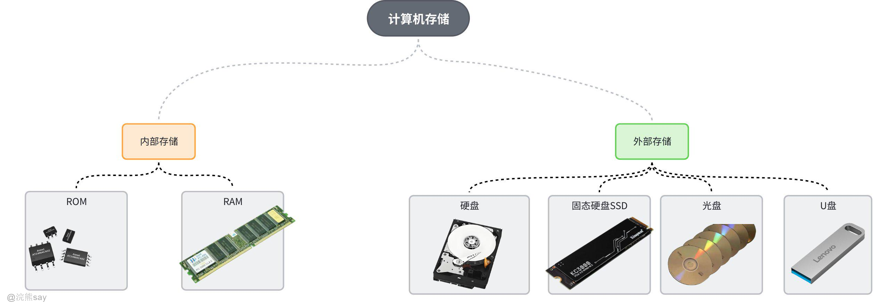

内存储器直接与中央处理器（CPU）进行数据交互，通常由高速随机存取存储器（RAM）组成，可实现数据的快速读写，支持CPU快速调用运行中的程序和数据，显著提升计算机的运算效率，但存储容量有限，且掉电后数据立即丢失。只读存储器（ROM）也是内存的组成部分，数据写入后不可随意更改，常用于存储计算机启动所需的基本输入输出系统（BIOS）等关键程序。

外存储器则侧重于数据的长期、大容量存储，包括硬盘、固态硬盘（SSD）、光盘、U盘等设备。这类存储器不直接参与CPU的数据交互，数据访问速度相对较慢，但存储容量大、成本低，且断电后数据依然得以保存，可用于存储操作系统、应用程序以及用户的文档、多媒体文件等大量信息。

此外，现代计算机系统为优化存储性能，还引入了高速缓冲存储器（Cache），作为CPU与内存之间的高速数据缓冲区域，通过缓存CPU近期可能频繁访问的数据，进一步减少CPU等待数据读取的时间，提升整体系统性能。不同层级的存储器相互配合，构建起层次化存储体系，共同满足计算机系统对存储速度、容量和数据持久性的多样化需求。

## 为什么要有存储器？——存储器的层次结构

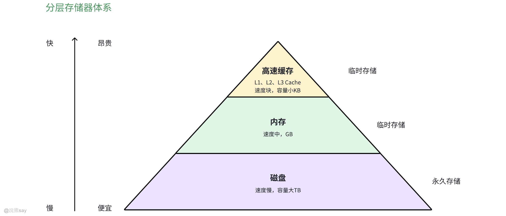

如上图所示，为了平衡计算机CPU读写速度快、而存储设备读写速度较慢的问题，计算机结构设计的科学家们采用了分层存储器系统。采用昂贵但是速度极快的高速缓存作为直接和CPU交互的存储器，而存储器则是连接速度较快的高速缓存和速度非常慢的磁盘的桥梁，使得CPU能够高速、流畅运行。

1.  **高速缓存（Cache）**

位于 CPU 和主存之间，是速度最快但容量最小的存储层次。它存储着 CPU 近期可能会频繁访问的数据和指令，能极大地减少 CPU 访问内存的时间，提高系统性能。

1.  **主存储器（内存）**

主要由随机存取存储器（RAM）组成，速度较快，能与 CPU 快速进行数据交互，用于存储正在运行的程序和数据。但容量相对有限，且断电后数据丢失。只读存储器（ROM）也属于主存的一部分，用于存储一些固定的、开机时需要的基本程序和数据，如 BIOS。

1.  **辅助存储器（外存）**

包括硬盘（机械硬盘 HDD 和固态硬盘 SSD）、光盘、U 盘等。外存容量大、成本低，可长期保存数据，但数据访问速度比内存慢。它用于存储大量的程序、文件和数据，当需要使用时再调入内存。

## 内存管理

## 什么是内存管理

存储器作为计算机系统的核心组成部分，其管理效率直接决定了存储器利用率与系统整体性能，因此对存储器的高效管理始终是现代操作系统（OS）的关键研究内容。其中，主存（内存）管理作为存储器管理的核心环节，主要承担以下四大核心功能：

1.  **主存分配与回收**

该功能的核心目标是实现主存资源的高效复用，通过将有限的主存空间合理分配给多个并发程序，最大化提升主存利用率。在具体实现中，需重点设计并优化**分配算法、回收算法及配套数据结构**—— 既要确保主存分配的公平性与合理性，避免空间浪费，又要提升分配与回收操作的执行速度，减少对程序运行的延迟影响，保障系统整体调度效率。

1.  **地址转换与重定位**

此功能旨在屏蔽物理内存的硬件使用细节，解决用户程序在 “生成 - 装入 - 运行” 全生命周期中的地址适配问题。具体涵盖三方面关键作用：一是支持用户程序**部分装入主存**，无需将完整程序加载即可启动运行，降低主存瞬时占用压力；二是处理可执行文件生成过程中的链接操作，确保程序各模块地址协调；三是实现程序加载时的重定位，以及进程运行过程中硬件与软件协同的地址变换，保障程序指令准确访问目标内存单元。

1.  **存储保护与主存共享**

在多用户、多任务的操作系统环境下，该功能是保障系统稳定性与数据安全性的关键。一方面，通过**设置地址空间访问权限**（如读、写、执行权限），严格限制不同进程对内存区域的访问范围，防止某一进程因错误操作或恶意行为篡改、破坏其他进程的代码与数据，避免系统崩溃；另一方面，实现程序代码与数据的高效共享，例如多个进程可共享同一套只读的系统库代码，无需在主存中重复存储，显著节省主存空间，提升资源利用效率。

1.  **存储器扩充**

为解决用户程序对内存容量的需求与主存实际物理容量之间的矛盾，存储器扩充功能可让运行中的程序突破主存大小的限制，实现 “虚拟内存” 的效果，主要通过两种核心机制实现：

1.  **覆盖技术**：由应用程序主动控制，将程序中暂时无需运行的模块调出主存，腾出空间加载当前所需模块，仅适用于结构清晰、模块间依赖简单的程序；
2.  **交换技术**：由操作系统统一控制，包括 “虚拟存储的请求调入”（程序运行过程中，仅将当前需要的部分进程空间调入主存）与 “预调入”（根据程序运行规律，提前将可能需要的进程空间装入主存），可动态调整主存中的进程数据，大幅提升主存的 “逻辑容量” 与使用灵活性。

| 【例题1】外存(如磁盘)上存放的程序和数据()。A.必须在CPU 访问之前移入内存B.是必须由文件系统管理的C.必须由进程调度程序管理D. 断电后，外存上的程序和数据会消失答案：A解析： 核心知识点：CPU不能直接访问外存（磁盘、U盘等），外存上的程序和数据要想被CPU处理，必须先移入内存（比如打开软件时，程序从硬盘加载到内存），这是A正确的原因。B错：“必须”太绝对，简单系统（如部分嵌入式系统）可能没有完整文件系统，也能管理外存数据；C错：进程调度程序管的是CPU调度，和外存数据管理无关；D错：外存是持久存储，断电后数据不会消失（比如硬盘里的文件断电后还在），内存才会断电丢数据。 |
| --- |

## 内存的物理组织

内存的物理组织核心是明确 “地址” 与 “地址空间” 的定义及分类，区分用户视角与硬件视角的地址差异，为后续程序装入、地址转换提供底层逻辑支撑。

1.  物理地址与物理地址空间

-   **物理地址**：内存被划分为若干大小相等的存储单元（基本单位为 8 位，即 1 字节），每个存储单元对应唯一的编号，该编号即为物理地址（又称绝对地址、实地址）。物理地址是硬件层面识别内存单元的 “唯一标识”，直接与内存硬件电路的寻址逻辑绑定。
-   **物理地址空间**：所有物理地址的集合构成物理地址空间（也称主存地址空间），其本质是一个一维线性空间 —— 地址从起始编号到最大编号连续排列，硬件可通过线性寻址直接定位到目标存储单元。

1.  程序地址与程序地址空间

-   **程序地址**：用户编写程序时使用的地址，又称逻辑地址（或虚地址）。其基本单位可与内存的字节单位一致，也可根据程序设计需求采用其他单位（如按 “字” 编址），完全独立于物理内存的实际硬件编址。
-   **程序地址空间**：所有程序地址的集合构成逻辑地址空间（也称虚地址空间），其编址规则固定从 0 开始，可根据程序结构设计为一维线性空间（如单段式程序），也可设计为多维空间（如分段、分页式程序）。

1.  逻辑地址与物理地址分离的核心原因

程序运行时采用逻辑地址而非物理地址，主要解决三大关键问题：一是避免用户编写程序时需精确计算物理内存空间与存放地址，降低编程复杂度；二是若直接使用物理地址，多道程序并发运行时易出现地址冲突（如多个程序争抢同一物理地址），难以实现内存资源的安全共享；三是物理地址与具体硬件绑定，若程序依赖物理地址编写，将无法在不同硬件配置的计算机上运行，严重影响程序的可移植性。
| 【例题1】内存的地址空间常称为( )。A.逻辑地址空间B.程序地址空间C.物理地址空间D.相对地址空间答案：C解析： 内存的地址空间是指内存硬件本身的实际地址范围（比如内存是8GB，对应的物理地址从0到8GB-1），这叫物理地址空间。A、D是程序运行时使用的“逻辑地址/相对地址”（不是内存实际地址），需要映射到物理地址才能访问内存；B是程序编译后使用的地址空间，本质也是逻辑地址空间，不是内存本身的地址空间。 |
| --- |

## 程序的接入和链接

### 程序装入方式

程序的装入是将编译 / 汇编生成的目标模块加载到内存物理地址空间的过程，根据地址转换的时机与方式不同，分为三种核心装入方式，各方式在灵活性、硬件依赖、适用场景上存在显著差异。

1.  **绝对装入方式**

该方式下，程序运行所需的绝对地址（即物理地址）可通过两种途径确定：一是由程序员在编写程序时直接赋予；二是程序中采用符号地址编写，在编译或汇编阶段由工具将符号地址转换为绝对地址。

但前者存在明显缺陷：要求程序员必须熟悉当前内存的物理使用情况（如哪些地址已被占用），且一旦程序代码或数据被修改，可能需要逐一调整程序中的所有绝对地址，维护成本极高。因此，实际应用中更常用后者 —— 通过符号地址间接生成绝对地址，降低程序员的硬件认知负担。

1.  **可重定位装入方式（静态重定位）**

目标模块的地址设计遵循 “相对地址规则”：起始地址从 0 开始，程序内所有其他地址均相对于起始地址计算（即相对地址）。装入时，操作系统会根据当前内存的空闲空间分布，将装入模块分配到内存的 “适当物理位置”，并在装入过程中**一次性完成相对地址到物理地址的转换**，转换后程序在运行期间地址不再改变（即静态重定位）。

该方式的优势是无需硬件支持，实现简单；但存在明显局限：程序装入内存后无法移动（地址已固定），且要求程序必须占用连续的物理存储空间，无法利用内存中的不连续空闲区域，降低了内存空间的利用率。

1.  **动态运行时装入方式（动态重定位）**

该方式又称动态重定位，核心特点是 “地址转换推迟到程序执行时”：装入程序仅将目标模块加载到内存，不立即将模块内的相对地址转换为物理地址，而是保留相对地址；当程序真正执行某条指令时，才由硬件（如重定位寄存器）或软件协同完成相对地址到物理地址的实时转换。

这种方式允许程序在运行过程中动态调整在内存中的物理位置（地址转换实时进行，位置变动不影响指令执行），且无需程序占用连续物理空间，大幅提升了内存使用的灵活性；但需依赖硬件支持（如重定位寄存器、地址变换机构），实现复杂度高于静态重定位。

### 程序链接方式

程序的链接是将多个独立编译生成的目标模块（如主程序模块、函数库模块、子模块）装配为一个完整装入模块的过程，根据链接时机的不同，分为三种方式，直接影响程序的装入效率、内存占用与可维护性。

1.  **静态链接方式**

在程序装入内存前，提前将所有关联的目标模块（如主模块、依赖的库模块）装配成一个完整的装入模块，链接过程需解决两个核心问题：一是对各目标模块内的相对地址进行统一修改（确保模块间地址协调，如子模块地址相对于主模块起始地址重新计算）；二是处理外部调用符号（将主模块中调用子模块的符号，替换为子模块在装入模块中的实际地址）。

静态链接的优势是程序装入后可直接运行，无需额外链接操作；但缺陷是装入模块体积大（包含所有依赖模块），若依赖模块更新，需重新编译链接整个程序，维护成本高，且多个程序共享同一依赖模块时会重复加载，浪费内存空间。

1.  **装入时动态链接**

用户源程序编译生成的多个目标模块，在装入内存时 “边装入边链接”：装入程序先加载主目标模块，若主模块中存在外部模块调用（如调用某库函数），则立即查找对应的外部目标模块，将其加载到内存，并同步修改主模块中调用处的相对地址（转换为外部模块在内存中的实际地址）。

该方式的核心优势是便于模块修改与更新（仅需替换对应外部模块，无需重新链接整个程序），且支持多个程序共享同一外部模块（只需加载一次，其他程序直接引用），节省内存空间；同时简化了程序的编译流程，无需提前整合所有模块。

1.  **运行时动态链接**

将模块链接操作推迟到程序 “执行过程中”：程序装入内存后直接启动运行，当执行到某条调用指令时，若发现被调用的模块尚未装入内存，操作系统会立即查找该模块并加载到内存，同时完成模块间的地址链接（将调用指令中的符号地址转换为模块的物理地址）；对于程序运行过程中未被调用的目标模块，始终不会被调入内存和链接。

这种方式进一步优化了程序的装入效率（仅加载必要模块，缩短装入时间），且最大程度节省内存空间（未使用模块不占用内存），尤其适用于依赖大量模块但运行时仅需部分模块的复杂程序（如大型软件、操作系统内核），是现代操作系统中主流的链接方式。
| 【例题】设有3个起始地址都是0的目标模块A、B、C, 长度依次为L、M、N, 这3个模块按A、B、C 顺序采用静态连接方式连接在一起后，模块C 的起始地址变为()。A.L+M+NB.L+MC.L+M-1D.L+M+1答案：B解析： 静态连接是把模块按顺序“拼接”起来，后一个模块的起始地址 = 前所有模块的长度之和。模块A长度L，占地址0~L-1；模块B接在A后面，起始地址是L，占地址L~L+M-1；模块C接在B后面，起始地址就是A的长度+ B的长度 = L+M。 |
| --- |

## 覆盖与交换技术

在多道程序设计环境中，为解决物理内存容量有限与程序对内存空间需求之间的矛盾，覆盖技术与交换技术成为两种经典的内存扩充手段，二者均通过 “内外存数据交互” 实现内存 “逻辑容量” 的扩展，但在实现逻辑、适用场景与操作方式上存在显著差异。

### 覆盖技术

覆盖技术的核心目标是让较大的程序能在较小的可用内存中运行，常与分区存储管理方式配合使用，通过 “时间换空间” 的思路优化内存资源利用。

1.  核心原理

覆盖技术基于 “程序模块按时间顺序占用内存” 的逻辑设计：将程序划分为 “必要部分” 与 “可选部分”—— 其中，程序的常用功能模块（必要部分）的代码和数据会常驻内存，确保程序基础运行需求；而不常用的功能模块（可选部分）则存储在外存的 “覆盖文件” 中，仅在程序执行到需要该模块的逻辑时，才将其装入内存的 “公共空间”。

同时，不存在调用关系的模块无需同时驻留内存，可相互占用同一块公共内存空间（即 “覆盖”），例如模块 A 执行完毕后，模块 B 可覆盖模块 A 的内存区域，大幅减少程序对内存连续空间的占用需求。

1.  优缺点分析

-   **缺点**：一是增加编程复杂度，程序员在开发阶段必须提前划分程序模块，并明确模块间的覆盖关系（如哪些模块可相互覆盖、模块加载顺序），对程序结构设计要求较高；二是存在 “时间开销”，从外存读取覆盖文件并装入内存需要消耗 I/O 时间，是以程序执行速度的轻微延长换取内存空间的节省。
-   **优势**：无需依赖复杂的硬件支持，仅通过软件层面的模块规划即可实现，在早期内存容量极小的计算机系统中，是运行大型程序的关键手段。

1.  实现方式

覆盖技术的实现主要有两种路径：一是通过**函数库**实现，由应用程序自身调用函数库接口管理模块的加载与覆盖，操作系统无需感知覆盖逻辑，仅负责基础的内外存数据传输；二是由**操作系统直接支持**，系统提供专门的覆盖管理模块，统一调度外存覆盖文件的装入与内存模块的替换，降低应用程序的实现成本。

### 交换技术

交换技术（又称 “对换技术”）针对多道程序并发执行场景设计，通过 “进程整体内外存迁移” 的方式，动态调整内存中的进程数量，提升内存利用率与系统响应效率。

1.  核心原理

交换技术的本质是 “进程地址空间的整体换入换出”：当内存空间不足，无法装入新的就绪进程，或部分进程因等待资源（如 I/O 操作）暂时无法执行时，操作系统会暂停内存中暂时不能执行的进程，将其**整个地址空间完整保存到外存的 “交换区”**（即 “换出” 操作），释放出对应的内存空间；随后，将外存中已由阻塞状态转为就绪状态的进程的地址空间，重新读入到释放的内存区域（即 “换入” 操作），并将该进程加入就绪队列，等待处理机调度执行。

1.  优缺点分析

-   **优点**：一是显著增加并发运行的程序数目，通过动态调整内存中的进程，让更多进程处于 “就绪 - 运行” 循环，提升 CPU 利用率；二是给用户提供更优的响应时间，避免因内存不足导致新进程无法启动；三是对程序员透明，编写程序时无需考虑内存扩充逻辑，不影响程序的结构设计。
-   **缺点**：一是增加处理机开销，交换过程中对换入、换出的控制（如进程状态切换、内外存数据传输调度）需要消耗处理机资源；二是 “全量传送” 效率低，交换操作会迁移进程的整个地址空间，未考虑程序执行时的地址访问特性（如部分数据可能全程未被访问），导致不必要的 I/O 传输，尤其对大型进程而言，交换时间过长会影响系统整体性能。

1.  关键待解决问题

交换技术的实际应用中，需重点解决两大问题：一是**程序换入时的重定位**，进程换出后再换入时，可能被分配到与原物理地址不同的内存区域，需通过重定位机制（如动态重定位）确保进程指令能正确访问目标内存单元；二是**减少交换中的数据传送量**，针对大型进程，可通过 “部分交换”（仅传送进程当前需要的内存页 / 段）替代 “全量交换”，降低 I/O 时间开销，提升交换效率。
| 【例题1】除操作系统占用的内存空间之外，所剩余的全部内存只供一个用户进程使用，其他进程都放在 外存上，这种设计称为( )。A.覆盖技术B.虚拟技术C.对换技术D.物理扩充答案：C解析： 核心看技术定义匹配：A（覆盖技术）：是把一个进程的不同段交替放入内存（比如常用段在内存，不用的在外存），不是“其他进程放外存”；B（虚拟技术）：是通过内存+外存模拟大内存，允许多进程的虚拟地址空间，不是“只供一个用户进程用”；C（对换技术）：核心是“内存中只留一个（或少数）用户进程运行，其他进程暂时换出到外存，需要时再换入”，和题目描述完全一致；D（物理扩充）：是增加实际内存硬件，题目没提加硬件，只是内存分配方式，排除。 |
| --- |

## 连续分配存储管理

在计算机系统的存储管理中，连续分配存储管理是一种基础且重要的方式。其核心概念是**为每个用户程序分配一段连续的内存空间，确保程序中的逻辑地址在物理内存中也是相邻的。**简单来说，就像是在一个书架上分配连续的格子来放置书籍，每本书籍对应一个程序，而这些格子就是内存空间。这种分配方式的设计简单直观，易于实现，在计算机发展的早期阶段发挥了重要作用。

从计算机操作系统的发展历程来看，连续分配存储管理占据着重要地位。在早期的单用户、单任务操作系统中，计算机的硬件资源相对有限，处理能力和内存容量都无法与现代计算机相提并论。此时，简单的连续分配存储管理方式便应运而生，它能够满足当时计算机系统的基本需求。例如，20 世纪 80 年代广泛使用的 CP/M、MS - DOS 及 RT11 等操作系统，就采用了单一连续分配这种最简单的连续分配方式 ，在当时的单用户环境下，这种方式成本较低，且能有效运行。

随着计算机技术的飞速发展，计算机系统逐渐向多任务和多用户方向演进。用户对计算机的功能需求日益多样化，希望计算机能够同时运行多个程序，实现更高效的工作。在这种背景下，连续分配存储管理也不断发展，出现了固定分区连续分配、动态分区分配等方式，以适应计算机系统发展的需求，提升内存资源的利用效率。

## 单一连续分配

单一连续分配是连续分配存储管理中最为基础和简单的一种方式，主要应用于早期的单用户、单任务操作系统。在这种分配方式下，内存被明确地划分为两个区域：**系统区和用户区**。系统区通常处于内存的低地址部分，专门用于存放操作系统运行所需的各种数据和程序代码，就如同一个专属的小仓库，操作系统的各项功能在这里有序运作；而用户区则用于装载单一的用户程序，整个用户空间被该程序独占 ，用户程序在这片专属空间中执行任务。例如，在早期的 CP/M 操作系统中，内存被清晰地分为系统区和用户区，用户程序在用户区中运行，这种方式在当时的单用户环境下，保证了系统的基本运行。

在单一连续分配中，用户程序的存储具有连续性和独占性的特点。程序一旦被装入用户区，就会占据连续的一片内存空间，从逻辑上来说，程序中的各个部分在内存中的物理地址也是紧密相连的。**这就好比在一个书架上，为某一本书籍专门预留了一整排连续的格子，这本书的每一页都依次放置在这些格子中，方便查找和翻阅。同时，由于整个用户区只允许一个用户程序存在，所以该程序对用户区的内存资源拥有绝对的独占权，不会受到其他程序的干扰 。**

## 固定分区连续分配

固定分区分配的核心是将内存用户空间划分为若干个固定大小的区域，每个区域被称为一个分区 。在这些分区中，每个分区仅能装入一道作业，从而实现多道作业的并发执行。当某个分区处于空闲状态时，系统会从外存的后备作业队列中挑选一个大小合适的作业装入该分区；当该作业执行完毕后，系统又会从后备作业队列中选取另一个作业调入这个空闲分区 。

在划分分区时，主要有两种方式：分区大小相等和分区大小不等。分区大小相等的方式相对简单，但其灵活性较差，通常适用于利用一台计算机去控制多个相同对象的场合。例如，在一些工业控制系统中，可能需要同时控制多个相同的设备，每个设备对应的程序大小相同，此时采用大小相等的固定分区就能很好地满足需求。

而分区大小不等的方式则更具灵活性，它能够满足不同大小进程的需求。一般会根据系统中常见作业的大小情况，划分出多个较小的分区、适量的中等分区以及少量的大分区 。以早期的一些计算机系统为例，系统中既有小型的监控程序，也有大型的数据分析程序，通过设置不同大小的分区，就可以适应不同程序的内存需求。为了便于内存分配，操作系统通常会将这些分区按大小进行排序，并建立一张分区说明表 。表中的每个表项都记录了对应分区的起始地址、大小以及状态（是否已分配）等信息 。当有用户程序需要装入内存时，操作系统会检索该表，寻找一个大小合适且未被分配的分区，将其分配给该程序，并将分区状态标记为 “已分配”；若找不到合适的分区，系统则会拒绝为该用户程序分配内存。

## 动态分区分配

动态分区分配是多道程序设计环境下主流的内存管理方式之一，其核心特点是 “按需分配、动态调整”—— 操作系统不预先划分固定大小的内存分区，而是在作业或进程请求内存时，根据实际需求从空闲内存中划分出大小匹配的分区；当进程结束释放内存时，回收的分区可重新归入空闲资源池，供后续进程使用，能有效提升内存利用率，同时适配不同大小的进程内存需求。

### 动态分区分配的数据结构

数据结构是实现空闲分区管理、已分配分区追踪及分配 / 回收操作的基础，核心围绕 “空闲分区” 与 “已分配分区” 两类资源设计，主要包括以下结构：​

#### 空闲分区管理结构

# （1）空闲分区链

最主流的结构，以链表组织空闲分区，每个节点包含分区描述信息（起始地址、大小、空闲状态）与链表指针（前驱、后继）。根据排序规则不同适配各类算法：按地址递增适配 FF/NF 算法，按容量增减适配 BF/WF 算法，按容量分类拆分为多链表适配 Quick Fit 算法。分配时需切割分区并调整链表指针，回收时需检测邻接空闲分区并合并，灵活性高，适用于所有分配算法与多分区场景。

# （2）空闲分区表

以表格记录空闲分区，每行对应一个分区，包含起始地址、大小、状态，按固定规则排序。分配时遍历表格查找适配分区，切割后修改或新增表格行；回收时合并邻接分区并更新表格。结构简单易实现，但表格大小固定时难以支持大量分区动态增减，查找开销随分区数量线性上升，适用于早期小型系统或分区数量少的场景。

# （3）空闲分区位图

将物理内存划分为等大位块，每个位块对应位图 1 个二进制位（1 表示空闲，0 表示已分配）。分配时查找连续 N 个 “1” 的位块组，回收时将对应位块设为 “1”。可通过位运算加速查找，回收无需额外合并操作，但位图大小随内存容量线性增长，查找大连续位块组效率低，适用于小内存、位块精细划分的场景。

#### 已分配分区管理结构

# （1）已分配分区链

以链表组织已分配分区，节点除包含起始地址、大小、已分配状态外，额外记录进程标识（如 PID），绑定分区与进程的归属关系。进程创建时新增节点加入链表，进程终止时通过 PID 定位节点并回收；结合基址 - 限长寄存器实现存储保护，避免越界访问，适用于单段式进程地址空间，实现简单且适配空闲分区链的回收逻辑。

 / 段表

当动态分区结合分段 / 分页技术时，为进程维护页表或段表：段表记录每个逻辑段（代码段、数据段）的物理地址、段长与访问权限；页表记录逻辑页与物理页框的对应关系。二者均用于实现逻辑地址到物理地址的转换，支持复杂进程地址空间管理与资源共享，是动态分区向虚拟存储过渡的关键结构，适用于多段 / 分页进程与需共享地址空间的场景。

### 动态分区分配算法

在动态分区存储管理中，当多个空闲分区均能满足作业的内存需求时，需通过特定的分配算法选择最优分区，以平衡内存利用率、查找效率与碎片产生情况。常见的动态分区分配算法主要包括首次适应算法、循环首次适应算法、最佳适应算法、最坏适应算法和快速适应算法，各类算法的设计逻辑、核心特点与适用场景存在显著差异，具体如下：

#### 首次适应算法（First Fit，FF）

首次适应算法是动态分区分配中最基础的算法之一，其核心设计围绕 “按地址顺序查找” 展开。

**算法原理**：要求所有空闲分区按物理地址递增的次序链接成空闲分区链。当作业请求内存时，从空闲链的链首开始顺序查找，一旦找到大小能满足需求的空闲分区，立即停止查找 —— 从该分区中划出与作业大小相等的空间分配给请求者，剩余的空闲部分仍保留在空闲链中；若遍历整个空闲链都未找到符合条件的分区，则内存分配失败，返回错误信息。

**特点与适用场景**：优点在于优先利用内存低址部分的空闲分区，能最大限度保留高址部分的大空闲区，为后续大作业的内存分配创造条件，且不会产生内部碎片（分配空间与作业需求完全匹配，无分区内未利用空间）。缺点是低址部分会因频繁分配与释放，逐渐产生大量难以利用的小空闲分区（即外部碎片）；同时每次查找均从链首开始，随着空闲分区数量增加，查找开销会显著上升。该算法适用于大作业需求较多、对内存高址大空间保留需求较高的场景。

#### 循环首次适应算法（Next Fit，NF）

循环首次适应算法是对首次适应算法的优化，核心改进是 “改变查找起始位置”，避免每次均从低址链首开始查找。

**算法原理**：系统需维护一个 “起始查询指针”，用于记录下一次查找的起始空闲分区。当为作业分配内存时，从起始查询指针指向的分区开始依次查找，若当前分区大小满足需求，则从中划出对应空间分配给作业，并将起始查询指针更新为该分区的下一个空闲分区；若当前分区不满足需求，则继续向后查找，直至链尾 —— 若链尾分区仍不满足需求，则返回链首继续查找（形成循环查找逻辑）。

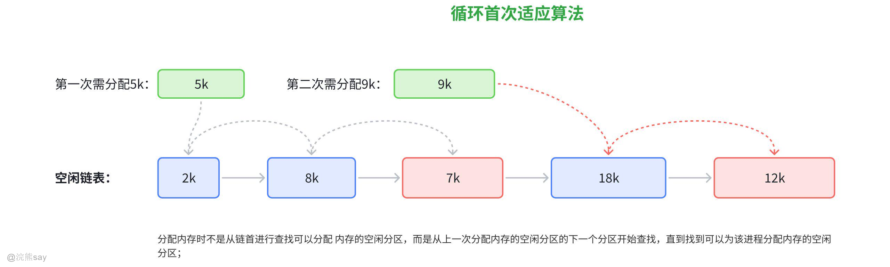

**特点与适用场景**：优点是通过循环查找，使内存中各区域的空闲分区被均匀利用，避免低址部分过度碎片化，同时减少了查找开销（无需每次从链首遍历至低址小分区），且同样不会产生内部碎片。缺点是长期运行后，高址部分的大空闲分区可能因频繁被分配而逐渐被划分成小分区，导致系统中缺乏大空闲分区，难以满足后续大作业的需求，仍会产生外部碎片。该算法适用于作业大小相对均匀、无过多大作业需求，且希望平衡各区域空闲分区利用频率的场景。

#### 最佳适应算法（Best Fit，BF）

最佳适应算法的核心目标是 “避免大材小用”，追求内存空间的极致利用率，通过 “精准匹配” 减少空间浪费。

**算法原理**：要求所有空闲分区按容量从小到大的顺序链接成空闲分区链。当作业请求内存时，只需从链首开始查找 —— 由于分区已按容量排序，第一个能满足作业需求的空闲分区，就是容量最小的适配分区（即 “最佳” 分区），找到后从中划出与作业大小相等的空间分配给作业，剩余小分区仍留在空闲链中（按容量重新排序）。

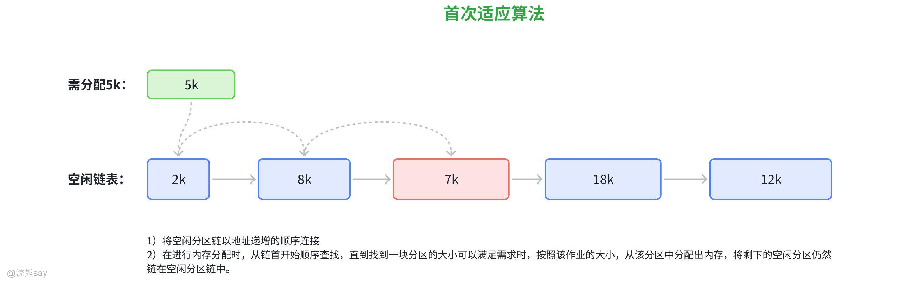

**特点与适用场景**：理论上能实现内存的最优利用，可最大限度减少每次分配后剩余的空闲分区大小，避免大分区被不必要地占用。但实际应用中，由于每次分配后剩余的空闲分区均为极小的 “残余分区”，长期积累会产生大量难以利用的外部碎片；同时，为维持空闲分区的容量排序，每次分区分配或释放后需调整空闲链顺序，增加了系统管理开销。该算法适用于作业大小差异较大、对内存空间利用率要求极高，且能接受一定外部碎片管理成本的场景。

#### 最坏适应算法（Worst Fit，WF）

最坏适应算法与最佳适应算法逻辑相反，核心思路是 “优先使用大分区”，避免产生过多小碎片。

**算法原理**：要求所有空闲分区按容量从大到小的顺序链接成空闲分区链。当作业请求内存时，直接查看链首的最大空闲分区 —— 若该分区大小满足需求，则从中划出与作业大小相等的空间分配给作业，剩余的空闲分区（仍为较大分区）按容量重新插入空闲链；若链首最大分区仍不满足需求，则整个系统无适配分区，分配失败。

**特点与适用场景**：优点是每次分配后剩余的空闲分区容量较大，仍具备被后续作业利用的价值，产生外部碎片的几率相对较低，对中、小作业的适配性较好；同时查找效率极高，仅需判断链首分区是否满足需求，无需遍历后续分区。缺点是由于优先使用最大空闲分区，会导致系统中大分区被快速消耗，短期内就可能出现无大分区可用的情况，无法满足后续大作业的内存需求。该算法适用于中、小作业占比高，大作业需求极少，且追求快速查找与低碎片产生率的场景。

#### 快速适应算法（Quick Fit）

快速适应算法（又称分类搜索法）的核心创新是 “按分区容量分类管理”，通过 “预分类” 实现快速查找，牺牲部分管理开销换取查找效率提升。

**算法原理**：将空闲分区按 “常用容量” 进行分类（如 2KB、4KB、8KB、16KB 等），每一类容量的空闲分区单独形成一条空闲分区链表；同时在内存中维护一张 “管理索引表”，表中每个表项对应一种容量类型，记录该类型空闲分区链表的表头指针。对于非标准容量的空闲分区（如 7KB），可将其归入最接近的大容量链表（如 8KB 链表），或单独设立 “特殊容量链表” 统一管理。当作业请求内存时，只需根据作业需求容量，通过管理索引表定位到对应容量的链表，直接从链表中选取一个分区分配即可。

**特点与适用场景**：优点是查找速度极快，无需遍历所有空闲分区，仅需通过索引表精准定位目标链表，能快速满足作业的内存需求。缺点是需维护多组空闲分区链表与管理索引表，增加了系统的管理开销与复杂度；若容量分类不合理（如分类粒度过粗或过细），可能导致部分链表中的空闲分区难以被充分利用（如将 7KB 作业分配到 8KB 分区，产生 1KB 内部碎片）。该算法适用于作业容量相对固定、对内存分配响应速度要求高（如实时系统、高频小作业场景），且能接受一定管理开销与内部碎片的场景。

### 动态分区分配的关键操作：分配与回收

1.  **分配操作**

核心是 “找到适配分区并切割”：首先通过对应算法与数据结构（如空闲分区链、位图）查找能满足进程需求的空闲分区；若分区大小恰好匹配，直接将其从空闲资源池移除，标记为已分配并关联至进程；若分区大于需求，从分区起始地址切割出与需求大小一致的空间分配给进程，剩余部分仍保留在空闲资源池（按数据结构规则更新信息，如空闲分区链调整指针、位图修改对应位）。

1.  **回收操作**

核心是 “回收分区并合并邻接空闲区”：当进程终止释放内存时，首先定位对应的已分配分区（如通过已分配分区链的 PID 查找）；然后检测该分区的前后邻接分区是否为空闲状态：仅前邻空闲则与前邻合并，仅后邻空闲则与后邻合并，前后均空闲则三者合并，无邻接空闲则直接将分区归入空闲资源池（按数据结构规则插入，如空闲分区链按排序插入、位图设对应位为 1），避免产生过多外部碎片，提升空闲分区利用率。

## 分页式存储管理

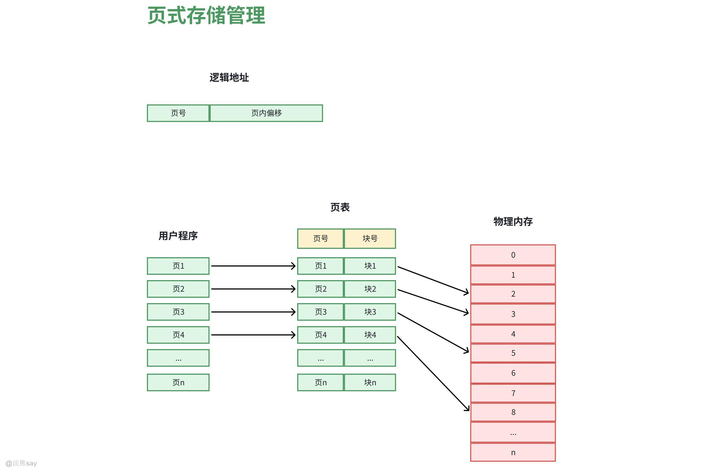

页式虚拟存储器是目前应用最广泛的虚拟存储管理方案，其核心设计思路是将逻辑地址空间与物理内存空间统一划分为固定大小的 “页”，并通过 “页表” 建立虚页与物理页框的精准映射。这一设计从根本上解决了内存外部碎片问题，大幅提升了内存利用率，同时为多进程运行提供了可靠的地址隔离机制，是现代计算机系统的核心内存管理技术之一。

## 逻辑地址、物理地址和页表

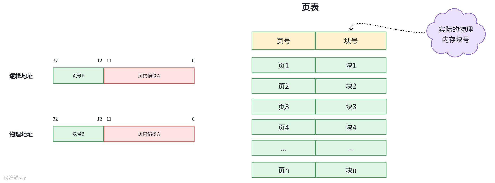

逻辑地址划分与页大小的设计是页式虚拟存储器的基础，直接决定了地址映射的逻辑与内存使用效率。逻辑地址与物理地址均采用 “页号 + 页内偏移” 的二元结构：逻辑地址由 “页号（Page Number）” 和 “页内偏移（Page Offset）” 组成，物理地址则由 “物理块号（Frame Number）” 和 “页内偏移” 组成。由于虚拟内存与物理内存的页大小完全一致，两者的页内偏移位数也保持相同，这一设计确保了页内地址转换的直接性，无需额外适配。

页大小的选择需在内存利用率与页表开销之间进行权衡，通常设定为 2 的幂次（常见值为 4KB、8KB，高端系统支持 2MB/1GB 大页）：页容量越大，虽会导致页内碎片（最后一页未填满的空间）增多，但能减少页表项数量，降低页表存储开销；页容量越小，页内碎片越少，内存利用越精细，但会增加页表项数量，提升页表管理成本。最终页大小需结合硬件架构与操作系统需求协同确定，平衡各项性能指标。

页表是实现虚页到物理页框映射的核心数据结构，本质上是一张存储 “页号 - 物理块号” 对应关系的对照表，通常常驻于物理内存中，为地址转换提供关键依据。每个页表项（Page Table Entry）包含两类核心信息：一是物理块号，用于指明目标数据在物理内存中的起始页框地址，是完成地址转换的核心参数；二是状态控制位，涵盖有效位（标识虚页是否已加载至物理内存，1 为有效、0 为无效）、访问位（记录页的访问频率，为置换算法提供决策支持）、修改位（标识页是否被修改，若修改则置换时需写回辅存）、权限位（控制页的读 / 写 / 执行权限，保障系统安全）。这些信息共同确保了地址映射的准确性、安全性与灵活性。

## 逻辑地址和物理地址的转换

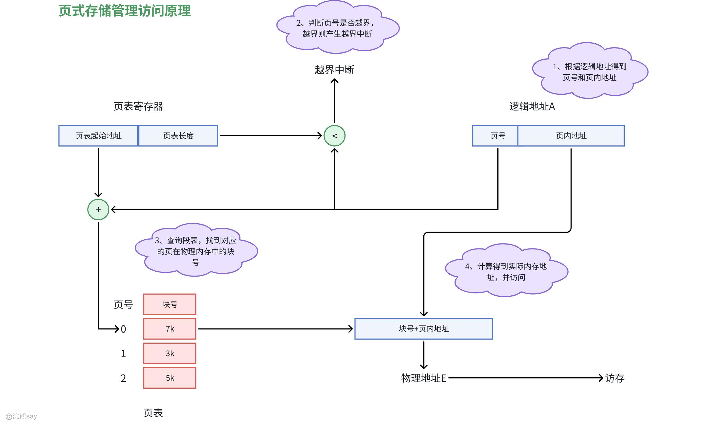

页式存储访问的核心是通过页表完成逻辑地址到物理地址的映射，整个过程由硬件自动执行，高效且对用户透明，其主要流程如下：

1.  逻辑地址拆分：CPU 生成的逻辑地址会被硬件自动拆分为页号与页内地址两部分。由于内存物理块与页面的大小固定且相等，页内地址无需额外转换，可直接作为物理块内的偏移量。
2.  越界合法性检查：系统通过页表寄存器获取页表长度，将拆分出的页号与页表长度对比。若页号超出范围，说明该逻辑地址属于非法访问，会立即触发越界中断，阻止错误地址的进一步处理，保障内存访问安全。
3.  页表映射查询：若页号合法，硬件以页表寄存器中的 “页表起始地址” 为基址，结合页号定位到页表的对应表项，从中读出该页在物理内存中对应的块号，完成页到物理块的地址映射。
4.  物理地址合成与访存：将获取的物理块号与原始页内地址拼接，生成最终的物理地址。硬件依据该地址访问内存，完成数据的读写操作。整个过程无需软件干预，映射与地址转换效率高，是现代操作系统主流的内存管理方式之一。

综上，页式存储访问通过硬件驱动的地址映射机制，实现了逻辑地址到物理地址的高效转换，全程对用户程序透明，既通过越界检查保障了内存访问的安全性，又借助页表的灵活映射提升了内存空间的利用率，有效解决了连续存储管理中内存碎片与地址空间受限的问题，成为现代操作系统实现内存虚拟化、支撑多进程并发执行的核心技术之一。

## 缺页中断（Page Fault）

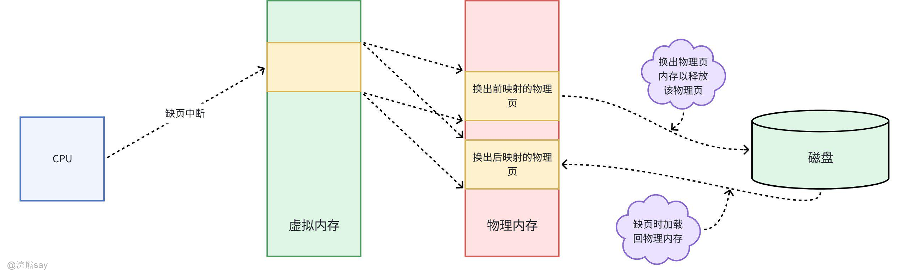

缺页中断是页式虚拟存储器中处理 “虚页未加载至物理内存” 场景的关键机制，其核心目的是通过操作系统介入，将所需虚页从辅存加载至物理内存，从而保障程序的正常执行，具体流程如下：

1.  立即暂停当前进程的执行，并完整保存进程的上下文信息（如寄存器状态、程序计数器值等），为后续恢复执行做好准备；
2.  检查物理内存中是否存在空闲页框，若物理内存已无空闲页框，则依据预设的页面置换算法，选取一个暂时不被使用的页框，若该页框内的数据已被修改，则需先将其写回辅存，释放出可用的页框资源；
3.  从辅存中读取目标虚页的数据，将其写入已分配的空闲页框中；
4.  更新对应虚页的页表项，将分配的物理块号填入表项，并将表项的有效位置为 1，随后恢复此前保存的进程上下文；
5.  重新执行触发缺页中断的指令，此时系统可正常完成地址映射与数据访问，进程得以继续运行。

综上，缺页中断机制通过操作系统与硬件的协同配合，巧妙衔接了虚拟内存与物理内存的资源调度，既解决了虚页未加载时的程序执行障碍，又借助页面置换算法实现了物理内存空间的高效复用，是页式虚拟存储技术能够突破物理内存容量限制、支撑多进程并发执行的核心保障

## 优缺点分析

页式虚拟存储器的设计特性决定了其在性能、成本与安全性上的综合表现，核心优缺点可从内存利用、实现难度、系统特性及潜在开销四个维度总结：

优点方面：① 消除外部碎片（固定页大小让内存分配更规整），大幅提升物理内存利用率；② 地址映射逻辑简单，硬件实现成本低；③ 逻辑地址与物理地址完全分离，支持多进程独立逻辑地址空间，隔离性与安全性强；

缺点方面：① 存在页内碎片（每页末尾未使用的空间），页越大碎片浪费越严重；② 页表查询需访问物理内存，引入额外访存开销（需通过 TLB 快表优化命中率）；③ 缺页中断会引发进程上下文切换，频繁缺页会显著影响系统性能。

整体而言，页式虚拟存储器凭借其高内存利用率、简单实现与强隔离性成为主流方案，而其短板可通过合理选择页大小、优化 TLB 设计及置换算法等方式缓解，适用于多数通用计算机系统场景
| 【例题1】下列方法中，解决碎片问题最好的存储管理方法是()。A.基本页式存储管理B.基本分段存储管理C.固定大小分区管理D.不同大小分区管理答案：A解析： 碎片分 “内碎片”（分区内未用的空间）和 “外碎片”（分区之间的空闲空间），核心看哪种方法碎片最少：C（固定分区）：分区大小固定，进程大小不匹配时会产生内碎片，碎片多；D（不同大小分区 / 动态分区）：按进程大小分配分区，会产生外碎片，时间久了碎片累积；B（基本分段）：按逻辑段分配，同样会产生外碎片；A（基本页式）：把内存和进程都分成固定大小的 “页框” 和 “页面”，虽可能有少量内碎片（单个页框未用完），但没有外碎片，且碎片大小固定（不超过一页），是四种里解决碎片问题最好的。 |
| --- |

| 【例题2】页式存储管理中，每次从主存中取指令或取操作数，当读快表失败时，要读()次主存。A.1B.2C.3D.4答案：B解析： 快表是页表的缓存，快表失败意味着要去主存查完整页表：第一次读主存：根据逻辑地址找到主存中的页表，取出对应的物理地址；第二次读主存：根据拿到的物理地址，读取指令或操作数。所以总共要读 2 次主存，选 B。 |
| --- |

## 段式存储管理

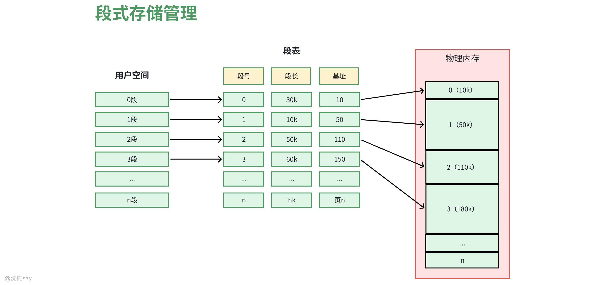

段式虚拟存储器是一种**贴合程序逻辑特性**的存储管理方式，其核心设计思路是按照程序的逻辑功能模块（如子程序、数据块、栈、堆等），划分出长度可变的 “段”，并通过核心数据结构 “段表”，实现虚拟段到物理内存空间的映射。这种管理方式高度契合程序开发的模块化思维习惯，突出了内存管理的灵活性与段的共享性，尤其适配需要对程序逻辑单元进行独立管理的应用场景。

## 逻辑地址、段表

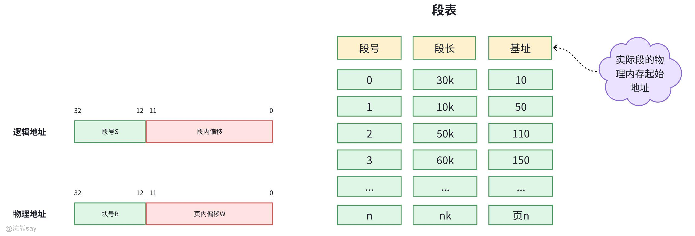

段是段式虚拟存储中程序的基本逻辑单位，其长度并非固定值，而是由对应功能模块的实际大小灵活决定。每个段在逻辑上都保持完整且相互独立，典型如代码段、数据段、公共函数库段等。系统会为每个段分配唯一的段号，段内地址则从 0 开始连续编址，以此保证段内数据的连续性与有序性。

程序运行时生成的逻辑地址，由 “段号（Segment Number）” 与 “段内偏移（Segment Offset）” 两部分组成。其中，段号的核心作用是在段表中索引对应的段表项，为地址映射提供依据；段内偏移则用于精准定位段内的具体数据。需要注意的是，段内偏移的取值必须小于该段的总长度，一旦超出阈值，系统会立即触发地址越界中断，以此严格保障内存访问的合法性。

段表是实现虚拟段与物理内存映射的核心载体，系统中的每个段都会对应一个段表项，每个表项包含四项关键信息，共同支撑段的管理与访问控制：

-   装入位（存在位）：用于标识该段是否已加载至物理内存，取值为 1 表示段在内存中，取值为 0 则表示段暂存于辅存，需通过缺段中断机制动态加载。
-   段起始地址：记录该段在物理内存中的起始物理地址，是完成虚拟地址到物理地址转换的核心参数。
-   段长度：存储该段的总长度，主要用于校验段内偏移是否超出范围，避免越界访问。
-   权限位：定义该段的访问权限，如读、写、执行等，既能实现段级别的内存共享，也能对不同进程的访问行为进行限制，防止非法篡改或越权执行。

这种以逻辑段为核心的设计，让段式虚拟存储天然契合程序的模块化开发思维，开发者可直接基于功能模块划分段，大幅降低内存管理与程序维护的复杂度。同时，段表的权限控制与缺段中断机制，既保障了内存访问的安全性，又实现了物理内存资源的按需分配，在需要高频共享代码段、重视逻辑单元独立性的场景中，展现出独特的技术优势。

## 段式存储访问原理

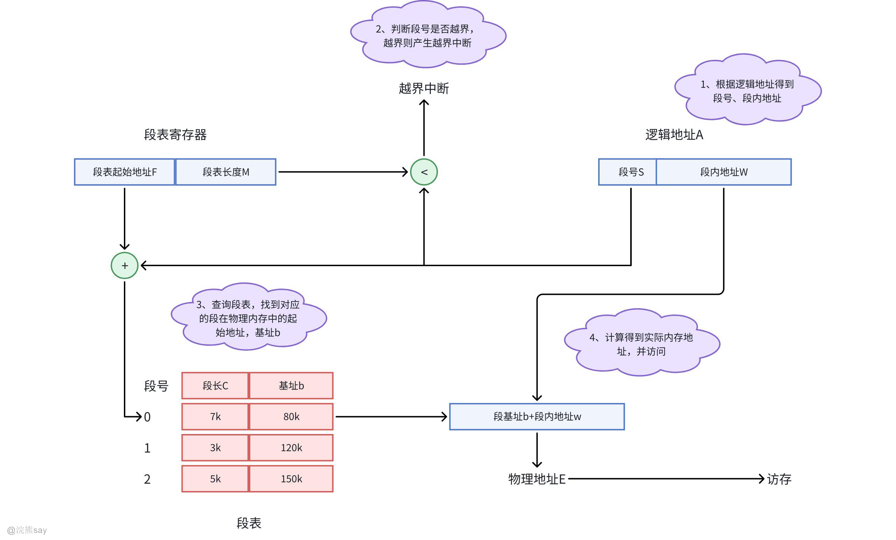

段式虚拟存储器的地址转换流程与页式虚拟存储有共通的映射逻辑，但由于段是按程序逻辑划分的独立单元，因此流程中更突出对逻辑合法性的校验环节，具体如下：

1.  **段表定位与加载检查**：CPU 从逻辑地址中提取段号，以段表起始地址为基址定位到对应的段表项，首先通过检查装入位，判断该段是否已加载至物理内存。
2.  **地址转换与合法性校验**：若装入位为 1，系统会先校验段内偏移量是否小于该段的总长度，以此避免越界访问；若偏移合法，则将段表项中记录的 “段起始地址” 与逻辑地址中的 “段内偏移” 相加，生成最终的物理地址，进而完成内存访问。
3.  **缺段中断与动态加载**：若装入位为 0，会立即触发缺段中断。此时操作系统介入，从辅存中读取目标段，为其分配物理内存空间并完成加载，随后更新段表项中的装入位为 1，并填入该段的物理起始地址；待段表更新完成后，重新校验段内偏移的合法性，再执行地址转换与访存操作。

段式虚拟存储的地址转换以程序的逻辑分段为核心，通过段表映射与多层次的合法性校验，既保障了逻辑地址到物理地址的准确转换，又能在段未加载时通过缺段中断机制完成动态加载，兼顾了内存访问的安全性与程序执行的连续性，尤其适合对代码、数据等逻辑单元进行独立管理与保护的场景。

## 优缺点分析

-   **优点**：① 逻辑适配性强：分段与程序逻辑结构一致，便于模块的开发、维护与调试（如子程序可独立成段，修改时不影响其他模块）；② 支持段共享与精准保护：公共函数库、数据段可被多个程序共享，减少内存冗余；通过权限位可限制段的访问方式（如代码段设为 “只读执行”），提升系统安全；③ 动态灵活性高：段长可随数据量动态调整（如堆段随内存分配扩展、栈段随函数调用收缩），适配程序的实际运行需求；
-   **缺点**：① 存在外部碎片：段长度不固定，多次分配与释放后会产生大量无法利用的小空闲块（外部碎片），需通过 “内存紧凑” 技术整理，增加系统开销；② 访存效率低：地址转换需先访问段表（多一次物理内存访问），缺段时还需加载辅存数据，整体访存延迟高于页式；③ 管理复杂度高：共享段的权限控制、数据同步难度大；段数量增多会导致段表体积庞大，占用物理内存且查表速度变慢。

段表是计算机中存储逻辑段和主存中实际物理地址的映射表，段表中的每一行记录了与某个段对应的段号、装入位、段起始点和段长度等信息。由于段的长度是可变的，所以段表中才会给出各个段的其实地址与段的长度。

## 段页式存储

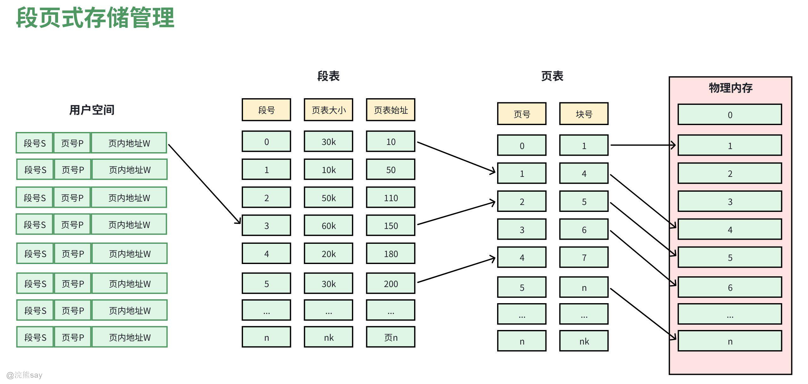

段页式虚拟存储器是融合段式与页式管理优势的混合存储方案，其核心设计逻辑是 “先按逻辑分段，再对段内分页”—— 既保留段式管理对程序逻辑结构的适配性，又借助页式管理解决内存碎片问题，实现 “逻辑灵活 + 存储高效” 的双重目标。具体来说，程序先按功能模块（如代码、数据、栈）划分为独立的段，每个段再被拆分为固定大小的页面；主存仍按固定页框划分，数据的调入、调出以页为基本单位，兼顾了模块化管理与内存利用率。

## 逻辑地址、段表、页表

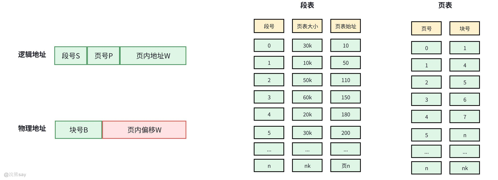

段页式虚拟存储的逻辑地址采用三段式结构，从高位到低位依次划分为“段号（Segment Number）、段内页号（Page Number）、页内地址（Offset）”。三段地址各司其职：段号用于索引段表以定位对应段表项，段内页号用于索引该段专属的页表以找到目标物理页框，页内地址则直接作为页内数据的偏移量，精准定位具体存储单元。

地址映射的核心前提的是双重页表组织与地址对齐规则：一是每个程序对应一张全局段表，而每个逻辑段会配置一张独立的页表，段表项中存储的“页表起始地址”，作为访问该段页表的核心索引入口；二是段的长度必须是页大小的整数倍，且段的起始地址需严格对齐到物理页框边界。这一设计能确保段内分页无地址重叠、分页粒度统一，从根本上简化地址转换逻辑，避免映射过程中出现地址冲突。

## 段页式存储的访问原理

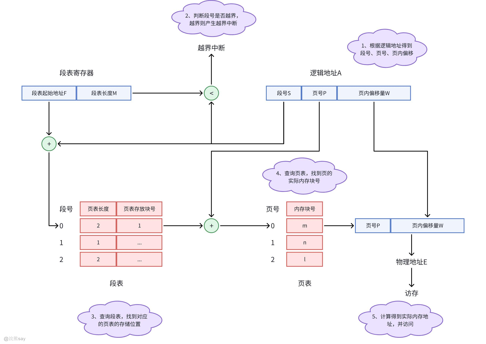

段页式的地址转换需经过 “段表查询→页表查询→物理地址合成” 三步，全程由硬件（MMU）自动完成，流程如下：

1.  **段表查询**：CPU 通过逻辑地址中的段号，结合段表起始地址，找到对应的段表项，从中获取该段的页表起始地址（同时校验段的装入位与权限，确保段有效且可访问）；
2.  **页表查询**：将 “段的页表起始地址” 与逻辑地址中的 “段内页号” 结合，定位到该段页表中的目标页表项，提取对应的物理块号（校验页的有效位，判断页是否在主存）；
3.  **物理地址合成**：将物理块号与逻辑地址中的 “页内地址” 拼接，形成最终的物理地址，完成访存。

若段未加载到主存（缺段）或页未加载到主存（缺页），则触发对应的中断，操作系统按缺段 / 缺页流程加载数据并更新段表、页表。

## 优缺点分析

-   **优点**：完美融合段式与页式的核心优势 ——① 逻辑适配性强：按程序模块分段，支持模块化开发、共享与保护，契合程序员的编程逻辑；② 内存利用率高：段内分页消除了外部碎片，仅存在少量页内碎片，兼顾灵活与高效；③ 权限管控精细：支持段级与页级双重权限控制，系统安全性更高；
-   **缺点**：地址转换开销较大 —— 相比页式（1 次页表查询）或段式（1 次段表查询），段页式需两次查表（段表→页表），若段表、页表均在主存，会增加一次主存访问延迟；此外，段表与页表的维护成本更高，占用更多物理内存。
