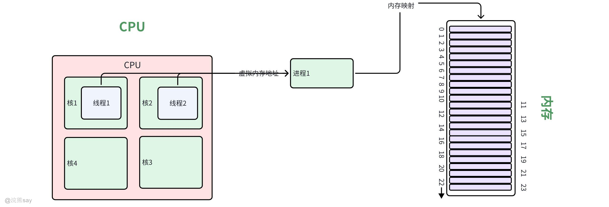
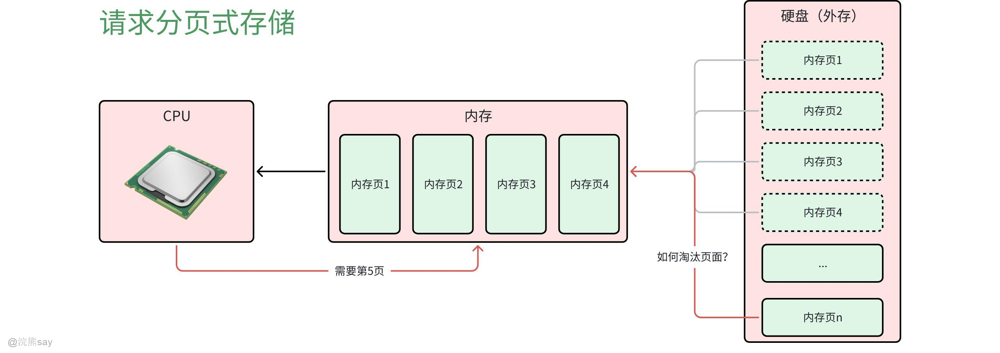
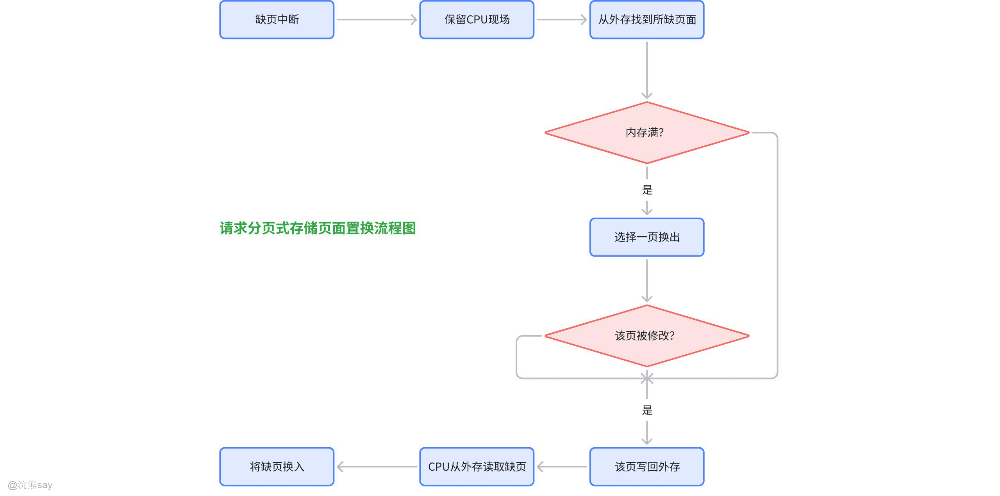
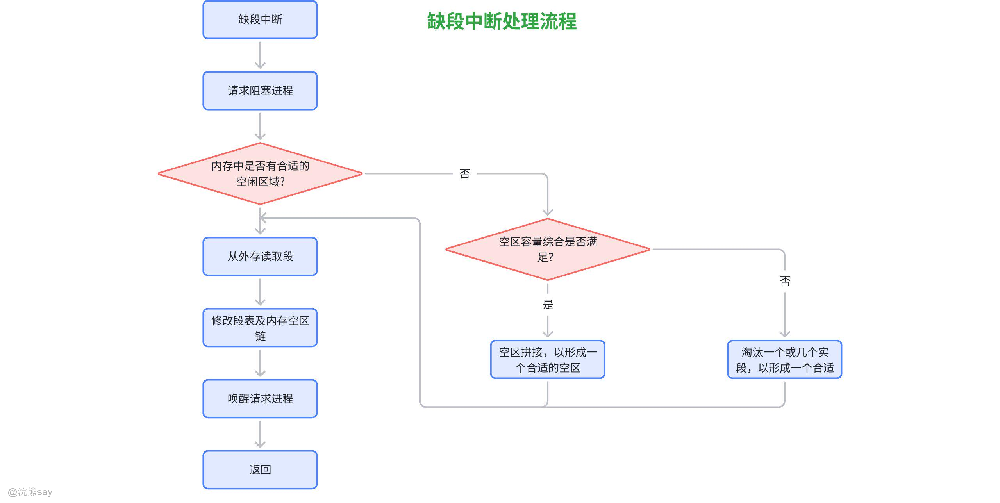
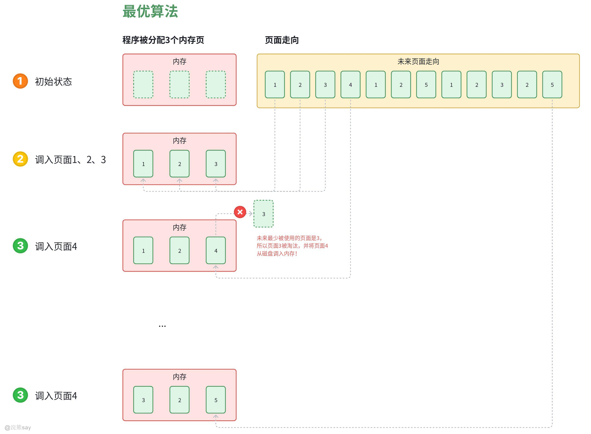
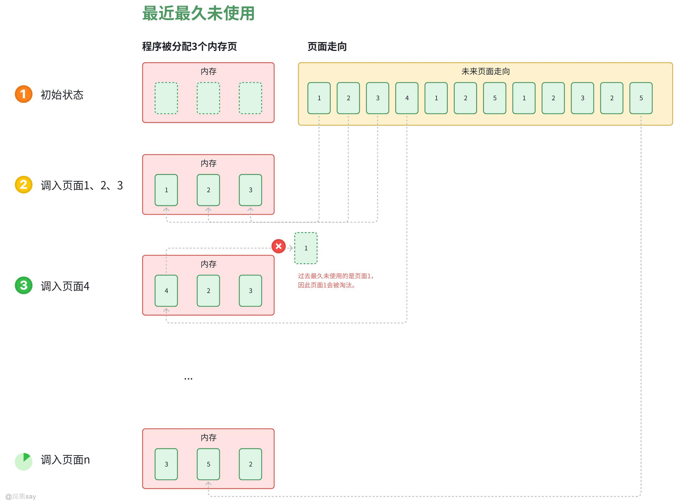
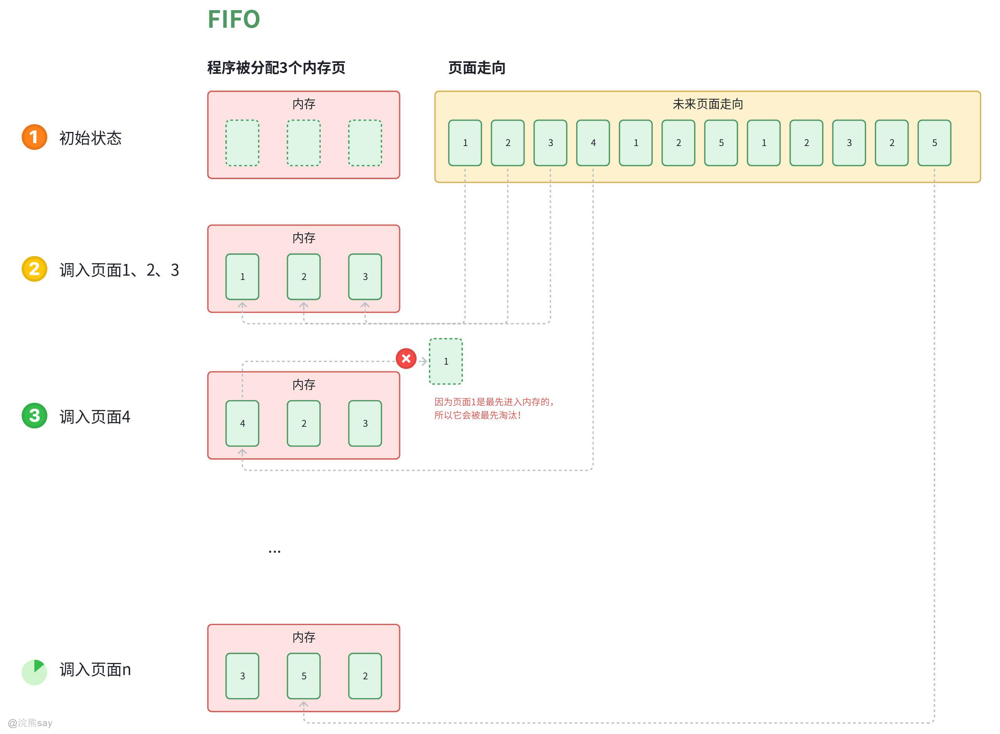
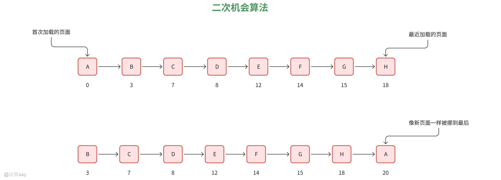
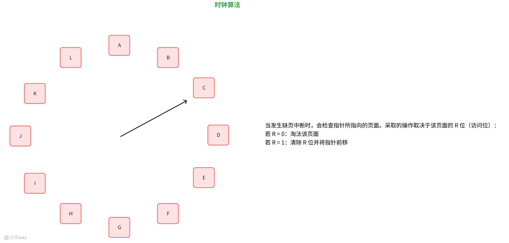

# 4、虚拟内存技术

**Part 04：虚拟内存技术**
| 【原创声明】大家好，我是say，是这篇文章的原创作者！985硕士毕业，应届进入某大厂后道心破碎，社招上岸多家855半垄断央企，因为自己淋过雨，希望帮大家撑把伞，帮助更多同学找到不内卷、能够好好生活的央国企，已帮助1000+同学上岸央国企，需要连联系学长的加微信：wx_hxsay |
| --- |

## 虚拟内存

## 虚拟内存定义

在前面介绍的内存管理技术当中，我们运行任何一个程序都需要将所有程序代码都加载进入内存之后才能运行，但是当我们程序越来越大，如现在游戏动不动几十个G，内存难以一次性将程序所需要的资源全部加载进入内存。既然物理上扩充内存容量不现实，那么可以从逻辑上来扩充内存容量——虚拟内存技术。

**虚拟内存（Virtual Memory）是现代操作系统中一种重要的内存管理技术，它允许计算机系统使用比实际物理内存更大的地址空间。虚拟内存通过将一部分磁盘空间用作扩展内存**，使得应用程序可以像使用物理内存一样访问这部分磁盘空间，从而大大增加了可使用的内存总量。

需要注意的是，每个程序拥有自己的地址空间，这个地址空间被分割成多个块，每一块称为一页。这些页被映射到物理内存，但不需要映射到连续的物理内存，也不需要所有页都必须在物理内存中。当程序引用到不在物理内存中的页时，由硬件执行必要的映射，将缺失的部分装入物理内存并重新执行失败的指令。

从上面的描述中可以看出，虚拟内存允许程序不用将地址空间中的每一页都映射到物理内存，也就是说一个程序不需要全部调入内存就可以运行，这使得有限的内存运行大程序成为可能。**例如有一台计算机可以产生 16 位地址，那么一个程序的地址空间范围是 0~64K。该计算机只有 32KB 的物理内存，虚拟内存技术允许该计算机运行一个 64K 大小的程序。**
| 【例题】虚拟内存的主要目的是（ ）A. 提高内存访问速度B. 扩大内存物理空间C. 为用户提供更大的逻辑地址空间D. 实现内存与外存的数据交换答案：C解析： 虚拟内存的核心目的是“给用户提供比实际物理内存更大的逻辑地址空间”——简单说，就算你的电脑只有8GB物理内存，虚拟内存能让程序“以为”有更大的内存可用，从而运行比物理内存还大的程序（比如大型软件、多程序同时运行）。A错：虚拟内存需要在内存和外存之间交换数据，反而可能降低访问速度，不是提高；B错：物理内存是硬件大小（比如内存条容量），虚拟内存不能扩大物理空间，只是用外存模拟额外内存；D错：内存与外存的数据交换是虚拟内存的“实现方式”，不是目的。 |
| --- |

## 局部性原理

在程序运行过程中会出现局部性规律，即在短时间内，程序的运行仅仅限于某个部分，所访问的存储空间也局限于某个区域，主要分为时间局部性和空间局部性两种：

-   **时间局部性**：如果一个信息项正在被访问，那么在近期它很可能会被再次访问。例如，在一个循环中，程序会反复访问循环变量和循环体内的指令，这些被重复访问的内容就具有时间局部性。

-   **空间局部性**：当一个信息项被访问时，在它附近的信息项也很可能很快被访问。这是因为程序在访问内存时，通常是以连续的方式进行的。例如，当访问一个数组元素时，程序很可能随后会访问该数组的其他相邻元素，因为数组在内存中是连续存储的。

局部性原理是现代计算机系统设计的重要基础，它使得计算机系统能够通过一些策略和技术来提高性能，例如：

-   **高速缓存（Cache）技术**：利用局部性原理，将近期可能会频繁访问的数据和指令存储在高速缓存中。当CPU需要访问数据时，首先在高速缓存中查找，如果找到就直接从缓存中读取，大大提高了访问速度。
-   **虚拟内存管理**：操作系统利用局部性原理来管理虚拟内存，将当前正在使用的页面加载到物理内存中，而将不常用的页面交换到磁盘上。这样可以在有限的物理内存空间中运行更大的程序，同时也能保证程序的运行效率。
-   **指令流水线**：通过将指令执行过程分成多个阶段，使得多条指令可以同时在不同阶段进行处理，提高了CPU的利用率。由于程序具有局部性，后续指令很可能与当前指令在时间和空间上具有相关性，从而可以更好地利用指令流水线的并行性。

| 【例题】局部性原理是以下哪项计算机技术的核心基础？A. 中断处理机制B. 高速缓存（Cache）技术C. 进程调度算法D. 虚拟内存的页面置换算法答案：B、D解析：B (Cache)：利用局部性，将近期可能访问的数据 / 指令复制到高速缓存中，减少 CPU 访问主存的时间。D (页面置换)：利用局部性，预测未来可能访问的页面，从而决定将哪个页面置换出内存，以减少缺页中断。 |
| --- |

| 【例题】以下哪一项最能体现空间局部性原理？A. 函数被递归调用B. 访问一个结构体变量的成员后，接着访问其下一个成员C. 一个变量在函数中被多次赋值和使用D. 频繁地对同一个全局变量进行读写操作答案：B解析：空间局部性指访问某个数据时，其附近的数据也很可能被访问。结构体的成员在内存中是连续存放的，访问相邻成员体现了空间局部性。 |
| --- |

## 虚拟存储器特征

虚拟存储器具有离散性、多次性、对换性、虚拟性四个主要特征：

1.  **离散性**

虚拟存储器采用离散分配方式，将进程的地址空间分散地存储在内存中，而不是连续存放。这样可以更有效地利用内存空间，提高内存的利用率。例如，一个进程的代码段、数据段和堆栈段可以分别存放在不同的内存块中，而这些内存块不一定是相邻的。

1.  **多次性**

多次性是指一个作业可以被分成多次调入内存运行。在传统的存储管理方式中，作业必须一次性全部装入内存才能运行。而在虚拟存储器中，作业可以按照需要分多次调入内存，只有当前需要运行的部分才会被调入，其他部分则暂时存放在外存中。例如，一个大型程序可能包含多个模块，但在某一时刻可能只需要运行其中的一部分模块，此时只需将该部分模块调入内存即可。

1.  **对换性**

对换性是指允许在作业运行过程中，将暂时不用的程序和数据从内存换出到外存，腾出内存空间给其他需要运行的程序和数据使用；当需要用到被换出的程序和数据时，再将它们从外存换入到内存。通过对换，可以在有限的内存空间中运行多个作业，提高系统的并发度。例如，当系统内存紧张时，系统会选择一些暂时不活动的进程，将其部分数据或整个进程换出到外存，以缓解内存压力。

1.  **虚拟性**

虚拟性是虚拟存储器最根本的特征，它通过借助外存来扩充内存，使得用户所看到的内存容量远大于实际的物理内存容量。用户可以编写和运行比实际内存空间大得多的程序，就好像系统拥有一个非常大的内存一样。例如，一个计算机系统实际只有4GB的物理内存，但通过虚拟存储器技术，用户可以运行需要8GB内存的程序，系统会将暂时不用的数据和程序存放在外存上，在需要时再调入内存，从而给用户一种内存空间很大的错觉。

## 虚拟内存的实现方法

虚拟内存的实现方法主要有2种，**请求分页存储管理**和**请求分段式存储管理**

请求分页存储管理，是将进程的逻辑地址空间划分为若干个大小相等的页面，把内存的物理地址空间也划分为与页面大小相同的物理块。进程在运行时，只将当前需要的页面装入内存，其他页面则存放在外存中。当进程访问的页面不在内存时，产生缺页中断，系统将该页面从外存调入内存。

请求分段存储管理，是将进程的逻辑地址空间按照程序的逻辑结构划分为若干个大小不等的段，每个段都有一个段名和段号。内存的分配以段为单位，每个段在内存中可以不连续存放。进程在运行时，只将当前需要的段装入内存，其他段存放在外存中。当进程访问的段不在内存时，产生缺段中断，系统将该段从外存调入内存。

## 请求分页式存储管理

## 什么是请求分页式存储？

虚拟存储管理和分页式存储管理的基本原理大致是一样的，但是不同点在于分页式存储管理主要针对的是实际物理内存，因此要求将所有物理内存页面一次性装入内存当中，而虚拟存储管理则只需要一次性装入部分内存页面即可。同时虚拟内存管理嗨增加了请求调页和页面置换等功能。

如上图所示，请求分页式存储管理是一种虚拟内存管理技术，它将**进程的逻辑地址空间划分为大小相等的页面**，把**内存的物理地址空间划分为与页面大小相同的物理块**。进程运行时，只把当前需要的页面装入内存，其余页面存放在外存中，当进程访问的页面不在内存时，通过缺页中断机制将其从外存调入内存。

## 页表机制

对于请求分页式系统来说，主要的数据结构依旧是页表，但是相较于分页式存储的页表而言由于需要将一部分页面调入内存，因此需要在页表中增加一些字段来供操作系统换入和换出的时候进行参考。但页表的基本作用依旧是将用户空间中的逻辑地址变换成为实际的物理地址。

-   **状态位P：**用于指示该页是否在物理内存中。若状态位为“1”，表示该页已装入物理内存；若为“0”，则表示该页当前不在物理内存中，此时若要访问该页，会产生缺页中断，需要从外存将该页调入内存。

-   **访问字段A：**用于记录该页被访问的情况，比如最近被访问的次数或者最近一次被访问的时间等。操作系统可以根据这个字段的信息，来决定在发生页面置换（当内存不足需要换出页面时）时，选择哪些页面换出，通常会优先换出长时间未被访问的页面，以利用局部性原理提高系统性能。

-   **修改位M：**用于表示该页在装入物理内存后是否被修改过。如果修改位为“1”，说明该页的内容被修改过；若为“0”，则表示未被修改。当需要置换该页时，若修改位为“1”，则需要将该页写回外存，以保证外存中该页的内容是最新的；若为“0”，则不需要写回，直接淘汰即可，因为外存中已有该页的正确副本。

-   **外存地址：**指出该页在外存（如磁盘等）上的存储地址。当发生缺页中断时，操作系统根据这个地址从外存中找到该页，并将其调入物理内存。

## 缺页中断机制

### 缺页中断和页面调入

在请求分页式存储系统中，当进程发**出内存访问请求，且所访问的页面不在内存中时，就会触发页面调入**。在指令执行过程中，如果发现要访问的指令或数据所在的页面未在内存，CPU 会产生缺页中断，此时操作系统会暂停当前进程的执行，开始页面调入操作。

页面调入的位置是内存中的空闲物理块。**操作系统会维护一个空闲物理块链表，用于记录哪些物理块是可用的**。当需要调入页面时，就从这个链表中选取一个空闲物理块来存放调入的页面。如果没有足够的空闲物理块，可能会根据一定的页面置换算法，选择一个已在内存中的页面，将其换出到外存，以腾出空间来存放新调入的页面。

如上图所示，请求分页式存储的缺页中断和页面调入过程如下：

1.  发生缺页中断时，系统首先根据缺页地址计算出所缺页面的页号。
2.  然后查找页表，确定该页面在外存中的位置。
3.  接着在内存中寻找空闲物理块，如果有空闲块，则将外存中的页面读入到该空闲块中；如果没有空闲块，就需要根据页面置换算法选择一个要被替换的页面。
4.  如果被替换的页面在内存期间被修改过，需要先将其写回外存，然后再将所缺页面调入内存。
5.  最后，更新页表项，将该页面的状态设置为 “在内存”，并记录其所在的物理块号，同时恢复被中断的进程，让其继续执行。

### 缺页率

缺页率是指在一段时间内，进程访问页面时发生缺页中断的次数与总的页面访问次数之比，它是衡量请求分页式存储管理系统性能的一个重要指标。

**缺页率 = 缺页中断次数 / 页面访问总次数。**

例如，一个进程在一段时间内共访问了 1000 次页面，其中发生了 100 次缺页中断，则缺页率为 100 / 1000 = 0.1（或 10%）。

内存中页面的数量、页面置换算法的性能、进程的页面访问序列等都会影响缺页率。一般来说，内存中页面数量越多，缺页率越低；选择合适的页面置换算法也可以有效降低缺页率。
| 【例题1】在请求分页系统中，假如一个作业的页面走向是1,2,1,3,1,2,4,2,1,3,4,分配给该作业的该作业的物理块数M为2(初始为空),当用LRU页面置换算法时，所发生的缺页次数是()次。A.10B.9C.8D.7答案：C（8 次）解析： LRU（最近最少使用）算法核心：置换最久没被使用的页面，按页面走向逐步模拟（物理块数 = 2，初始为空）：1（缺）→[1]；2（缺）→[1,2]；1（不缺）→[2,1]；3（缺，换 2）→[1,3]；1（不缺）→[3,1]；2（缺，换 3）→[1,2]；4（缺，换 1）→[2,4]；2（不缺）→[4,2]；1（缺，换 4）→[2,1]；3（缺，换 2）→[1,3]；4（缺，换 1）→[3,4]。统计缺页次数：共 8 次，选 C。 |
| --- |

| 【例题2】在请求页式存储管理中，当查找的页不在()中时，要产生缺页中断。A.外存B.虚存C.内存D.地址空间答案：C解析： 缺页中断的定义就是 “要访问的页面不在内存中” 时触发的中断（目的是把外存的页面调入内存）。A（外存）是页面存放的地方，B（虚存）是逻辑地址空间，D（地址空间）不是存储区域，所以选 C。 |
| --- |

| 【例题3】缺页中断发生时，操作系统首先执行的操作是（ ）A. 淘汰内存中的某个页面B. 从外存读取缺失页面到内存C. 检查页表确定页面状态D. 调整进程优先级答案：C解析： 缺页中断发生后，操作系统第一步先 “检查页表”—— 确认页面是不是真的不在内存（比如是否在外存、是否为无效页），才能决定后续是淘汰页面还是读取页面。A、B 是后续操作，D（调整优先级）和缺页中断无关，所以选 C。 |
| --- |

## 请求分段式存储

请求分段式存储，顾名思义就是将“分段式存储”和“虚拟内存技术”相结合的内存管理方式，它的核心思想是：程序运行时，并非将所有分段都装入内存，而是只装入当前需要的分段。当访问到一个不在内存中的分段时，系统会产生一个**缺段中断**，然后由操作系统将所需分段从外存调入内存。

## 段表机制

请求分段式存储的核心数据结构依旧是段表，因为进程在将段调入内存的时候只会将一部分的段调入内存，而大多数的段依旧存在于外存，因此需要在“分段式存储”的段表基础上拓展一些字段，来支持程序的调入和调出，“请求分段式存储”的段表如下：

如上图所示，请求分页式存储的段表，除了段名、段长和段在内存中的基址之外，还增加了一些如存取方式、访问字段、修改为、存在位...等数据项。

1.  存取方式：标记本段的存取方式，分为可执行、只读、只写或允许读/写。
2.  访问字段A：记录该段被访问的频繁程度。
3.  修改位M：记录该段在进入内存之后是否被修改过，供页面置换算法的时候进行参考。
4.  存在位P：记录本段是否已经调入了内存。
5.  增补位：表示本段在运行过程中是否做过动态增长。
6.  外存地址：表示本段在外存中的起始地址，也就是起始的盘块号。

了解以上的段表的构成，可以帮助大家更好的理解分段式存储的相关原理。

## 缺段中断机制

所谓缺段中断机制，是指当进程试图访问某个段，而该段尚未调入内存时，系统就会产生缺段中断。具体来说，在地址转换过程中，系统会根据逻辑地址中的段号查找段表，若段表项中的 “存在位” 为 0，表明该段不在内存，此时便触发缺段中断。例如，程序执行过程中要调用一个函数，而这个函数所在的段当前不在内存，就会引发缺段中断。

缺段中断的处理流程如下：

1.  **暂停当前进程**：操作系统接收到缺段中断信号后，会立即暂停当前正在运行的进程，保存其运行现场，包括程序计数器（PC）的值、寄存器的内容等，以便后续恢复进程的执行。
2.  **检查内存空间**：查看内存中是否有足够的空闲空间来容纳即将调入的分段。可以通过内存空闲分区表等数据结构来进行判断。
3.  **分配内存**：
4.  如果内存有足够的空闲空间，直接从外存（如磁盘）将所需分段调入内存，并在段表中更新该段的相关信息，如将 “存在位” 设置为 1，填入该段在内存中的起始地址（基址）等。
5.  若内存空闲空间不足，就需要采用段置换算法，从内存中选择一个或多个暂时不用的分段换出到外存，释放出足够的空间，然后再从外存调入所需分段，并更新段表信息 。常见的段置换算法有最近最少使用（LRU）算法、先进先出（FIFO）算法等。比如使用 LRU 算法时，会优先选择一段时间内最少被访问的段进行换出。
6.  **恢复进程执行**：完成分段的调入和段表更新后，恢复之前被暂停的进程的运行现场，然后重新执行导致缺段中断的那条指令，此时由于所需分段已在内存，地址转换能够顺利完成，进程可以继续正常运行。

## 地址变换

## 请求分页式存储和请求分段式存储区别？
| 特性 | 请求分段式 (Demand Segmentation) | 请求分页式 (Demand Paging) |
| --- | --- | --- |
| 分配单位 | 段 (Segment)，是逻辑单位，大小不固定。 | 页 (Page)，是物理单位，大小固定。 |
| 地址空间 | 二维地址空间 (段号，段内偏移)。 | 一维地址空间 (页号，页内偏移)。 |
| 内存碎片 | 存在外部碎片（因为段大小不一，换入换出后会产生许多小的空闲块）。 | 存在内部碎片（一个页可能未被完全利用）。 |
| 处理越界 | 可以精确处理，因为段长已知，若偏移量超过段长则越界。 | 处理相对模糊，可能访问到同一页内的错误数据而不被发现。 |
| 共享与保护 | 易于实现。因为段是完整的逻辑单位（如一个函数、一个数组），可以方便地共享和设置访问权限。 | 较难实现。共享一个逻辑单位（如一个函数）可能需要共享多个页，权限管理更复杂。 |
| 置换效率 | 换入换出的是整个段，I/O 开销可能很大，尤其是对于大段。 | 换入换出的是固定大小的页，I/O 开销相对较小且均匀。 |

| 【例题1】综合了段式和页式虚拟存储器的优点，许多微机机用()虚拟存储管理方式。A.程序B.段页式C.分段D.页划分答案：B解析： 段页式虚拟存储管理是 “段式 + 页式” 的结合，既继承了段式的优点（按逻辑分段，方便编程、共享和保护），又继承了页式的优点（解决碎片问题，内存利用率高），综合了两者优势，是很多微机常用的方式。A、C、D 都只侧重单一方式，不符合 “综合两者优点” 的描述，所以选 B。 |
| --- |

| 【例题2】段页式管理中，地址映象表是()。A.每个作业或进程一张段表，一张页表B.每个作业或进程的每个段一张段表，一张页表C.每个作业或进程一张段表，每个段一张页表D.每个作业一张页表，每个段一张段表答案：C解析： 段页式管理的地址映射逻辑：每个作业 / 进程先按逻辑分成若干段，因此需要一张全局段表（记录每个段的基本信息，比如对应页表的起始地址）；每个段内部再分成固定大小的页面，因此每个段需要一张独立页表（记录该段页面与内存页框的映射关系）。简单说：“进程有段表，段内有页表”，对应选项 C。其他选项要么混淆段表和页表的归属，要么数量对应错误，均不符合段页式的地址映象结构。 |
| --- |

## 页面置换算法

**在程序运行过程中，如果要访问的页面不在内存中，就发生缺页中断从而将该页调入内存中。此时如果内存已无空闲空间，系统必须从内存中调出一个页面到磁盘对换区中来腾出空间。**页面置换算法和缓存淘汰策略类似，可以将内存看成磁盘的缓存。在缓存系统中，缓存的大小有限，当有新的缓存到达时，需要淘汰一部分已经存在的缓存，这样才有空间存放新的缓存数据。页面置换算法的主要目标是使页面置换频率最低（也可以说缺页率最低）。

## 最佳（OPT, Optimal replacement algorithm）

最佳选择**未来最长时间内不会被访问的页面进行置换**，这样可以保证获得最低的缺页率，但是由于我们无法预测未来内存页面的使用情况，所以该方法是一种理论上的算法。现实中我们无法预知未来要访问哪些页面，OPT算法是理论上的最优解，用来衡量其他算法（如LRU、FIFO）的效率差距。

如上图所示，当程序需要调入新的内存页面而内存空间不足的时候，会产生缺页中断，并计算未来最少被使用到的页面，将其调入内存，更加完整的流程见如下的表格：
| 页面走向 | 1 | 2 | 3 | 4 | 1 | 2 | 5 | 1 | 2 | 3 | 2 | 5 |
| --- | --- | --- | --- | --- | --- | --- | --- | --- | --- | --- | --- | --- |
| 物理块 1 | 1 | 1 | 1 | 1 | 1 | 1 | 1 | 1 | 1 | 3 | 2 | 5 |
| 物理块 2 |   | 2 | 2 | 2 | 2 | 2 | 2 | 2 | 2 | 3 | 2 | 5 |
| 物理块 3 |   |   | 3 | 4 | 4 | 4 | 5 | 5 | 5 | 5 | 5 | 5 |
| 是否缺页中断 | √ | √ | √ | √ |   |   | √ |   |   |   | √ |   |

使用最佳调度算法，却也中断产生了6次，页面访问总次数是12次，因此可以计算出缺页率为：缺页率 = 6÷12 ≈ 0.5，即 50% 。
| 【例题】下列页面置换算法中，理论上缺页率最低的是（ ）A. 先进先出算法（FIFO）B. 最近最少使用算法（LRU）C. 最优置换算法（OPT）D. 时钟置换算法（Clock）答案：C解析： 核心看“理论上缺页率最低”的核心逻辑——最优置换算法（OPT）的本质是“预知未来”：每次置换时，选择“未来最长时间内不会被访问”的页面。这种策略能最大限度减少后续缺页次数，是理论上的最优方案，缺页率最低。A（FIFO）：按页面进入内存的顺序置换，易出现“Belady异常”（物理块增多缺页率反而上升），缺页率较高；B（LRU）：置换最近最少使用的页面，是实际中最接近OPT的算法，但依赖历史访问记录，无法预知未来，缺页率高于OPT；D（Clock）：是LRU的近似算法，通过“时钟指针+访问位”判断，缺页率比LRU更高，更不及OPT。注意：OPT虽理论最优，但实际中无法实现（无法预知未来页面访问情况），仅作为衡量其他算法的基准。 |
| --- |

## 最近最久未使用（LRU, Least Recently Used）

虽然无法知道将来要使用的页面情况，但是可以知道**过去使用页面的情况，LRU 将最近最久未使用的页面换出**。实现 LRU，需要在内存中维护一个所有页面的链表。当一个页面被访问时，将这个页面移到链表表头。这样就能保证链表表尾的页面是最近最久未访问的。因为每次访问都需要更新链表，因此这种方式实现的 LRU 代价很高。

完整的调度表格如下表所示：
| 页面走向 | 1 | 2 | 3 | 4 | 1 | 2 | 5 | 1 | 2 | 3 | 2 | 5 |
| --- | --- | --- | --- | --- | --- | --- | --- | --- | --- | --- | --- | --- |
| 物理块 1 | 1 | 1 | 1 | 4 | 4 | 4 | 5 |   |   | 3 |   | 3 |
| 物理块 2 |   | 2 | 2 | 2 | 1 | 1 | 1 |   |   | 1 |   | 5 |
| 物理块 3 |   |   | 3 | 3 | 3 | 2 | 2 |   |   | 2 |   | 2 |
| 是否缺页中断 | √ | √ | √ | √ | √ | √ | √ |   |   | √ |   | √ |

使用最近最久未使用的调度算法，中断产生了9次，页面访问总次数是12次，因此可以计算出缺页率为：缺页率 = 9÷12 ≈ 75，即 75% 。
| 【例题】页面走向为 4, 3, 2, 1, 4, 3, 5, 4, 3, 2, 1, 5，物理块数为 4，采用最近最少使用（LRU）置换算法时，缺页中断次数为（ ）A. 5 B. 6 C. 7 D. 8答案：D（8 次）解析：无 |
| --- |

## 最近未使用（NRU, Not cently Used）

每个页面都有两个状态位：R 与 M，当页面被访问时设置页面的 R=1，当页面被修改时设置 M=1。其中 R 位会定时被清零。可以将页面分成以下四类：

-   R=0，M=0
-   R=0，M=1
-   R=1，M=0
-   R=1，M=1

当发生缺页中断时，NRU 算法随机地从类编号最小的非空类中挑选一个页面将它换出。NRU 优先换出已经被修改的脏页面（R=0，M=1），而不是被频繁使用的干净页面（R=1，M=0）。

## 先进先出（FIFO）

选择换出的页面是最先进入的页面，该算法会将那些经常被访问的页面换出，导致缺页率升高，这个算法基本上就是数据结构里面的队列了，非常简单。

但是FIFO算法有一个问题，由于最先进入的内存页面可能是后续会被频繁使用的，因此贸然将它淘汰可能会造成中断率偏高的问题。上面的例子中完成的内存页面置换表格如下：
| 页面走向 | 1 | 2 | 3 | 4 | 1 | 2 | 5 | 1 | 2 | 3 | 2 | 5 |
| --- | --- | --- | --- | --- | --- | --- | --- | --- | --- | --- | --- | --- |
| 物理块 1 | 1 | 1 | 1 | 4 | 4 | 4 | 5 |   |   | 5 |   |   |
| 物理块 2 |   | 2 | 2 | 2 | 1 | 1 | 1 |   |   | 3 |   |   |
| 物理块 3 |   |   | 3 | 3 | 3 | 2 | 2 |   |   | 2 |   |   |
| 是否缺页中断 | √ | √ | √ | √ | √ | √ | √ |   |   | √ |   |   |

使用FIFO调度算法，中断产生了8次，页面访问总次数是12次，因此可以计算出缺页率为：缺页率 = 8÷12 ≈0.667，即 66.7% 。

## 第二次机会算法（Second-Chance Algorithm）

“第二次机会算法”（Second-Chance Algorithm）是一种经典的**页面置换算法**，用于操作系统中解决内存分页管理的问题。它的核心思想是在决定淘汰哪个页面时，给每个页面一个 “改过自新” 的机会，从而实现比简单的 FIFO（先进先出）算法更好的性能。

大家回忆下FIFO算法，有个致命的缺点就是FIFO 算法可能会把经常使用的页面置换出去，为了避免这一问题，我们可以对FIFO算法做一个简单的修改，下面以图书借阅为例子来阐述这个问题。

1.  每本书都有一个标签，记录这本书“最近是否被翻阅过”
2.  当进来一本新书（内存页面），而书架（内存）已经被放满了，需要淘汰掉一本书。
3.  管理员从最早进入的那本书开始检查

-   如果这本书的标签是“未被翻阅”，就直接把它淘汰掉。
-   如果标签是 “已翻阅”，就把标签改为 “未翻阅”，然后把这本书放到队列的末尾，就像它刚被借进来一样。这就是所谓的 “第二次机会”。

1.  重复这个过程，直到找到一本可以被淘汰的书（即访问位为 0 的页面）。

所以说这个算法本质上是 FIFO，但它会跳过那些 “最近被访问过” 的老页面，优先淘汰那些既老又长时间未被访问的页面。因为它给那些近期被读过（被标记）的书一次不被替换的机会，让它们在书架上多留一会儿，避免了像FIFO算法那样，可能把经常使用的书过早替换掉的情况。

与FIFO算法相比，它考虑到了页面的使用情况。虽然没有像LRU（最近最少使用算法）那样精准地根据使用频率来置换页面，但它在一定程度上避免了把经常使用的页面置换出去，减少了缺页次数，提高了系统性能。它的实现相对简单，在FIFO算法的基础上增加了少量的额外操作（标记和调整顺序），却能带来更好的效果。

## 时钟（Clock Algorithm）

时钟算法（Clock Algorithm）是第二次机会算法的高效变种，也被称为最近未使用算法（NRU, Not Recently Used）的简化版本。它通过环形结构和指针优化了页面置换的效率，在现代操作系统中被广泛应用。

时钟算法将内存中的页面想象成一个环形队列（就像时钟的表盘），并使用一个指针指向当前需要检查的页面。每个页面依然有一个访问位（reference bit）：

1.  当需要置换页面时，检查指针指向的页面
2.  如果访问位为 1，将其设为 0 并移动指针到下一个页面（给予 "第二次机会"）
3.  如果访问位为 0，直接置换该页面，并将指针移动到下一个页面

这种设计避免了第二次机会算法中频繁移动页面的操作，大大提高了效率，时钟算法在 Windows、Linux 等现代操作系统的内存管理中都有应用，是平衡性能和实现复杂度的优秀选择。
