# 5、IO设备管理

**Part 05：IO设备管理**
| 【原创声明】大家好，我是浣熊say，是这篇文章的原创作者！985硕士毕业，应届进入某大厂后道心破碎，社招上岸多家855半垄断央企，因为自己淋过雨，希望帮大家撑把伞，帮助更多同学找到不内卷、能够好好生活的央国企，已帮助1000+同学上岸央国企，需要连联系学长的加微信：wx_hxsay |
| --- |

## I/O设备管理概述

## I/O设备

I/O 设备管理是操作系统的关键功能，负责协调 CPU 与外部设备之间的数据交换，是计算机系统高效稳定运行的基石。如下图所示，鼠标、键盘、显示器和打印机等都属于I/O设备，I/O设备扮演着计算机与外界交互的关键角色，承担着计算机与外部进行输入输出的重要任务，因此也被称作外部设备，简称外设。

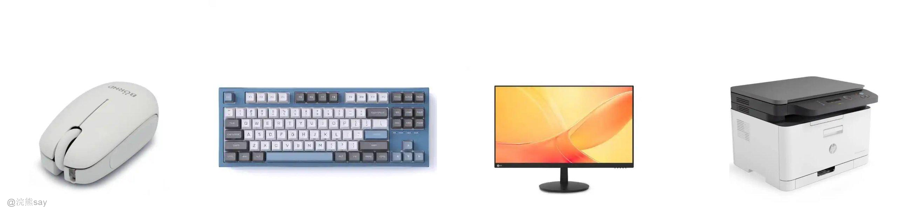

而负责管理设备以及输入输出操作的机构，便是输入输出系统，即 I/O 系统。I/O 系统由设备、控制器、通道、总线以及输入输出软件协同构成，各部分紧密配合，共同保障计算机系统输入输出功能的稳定运行 。

## I/O设备分类

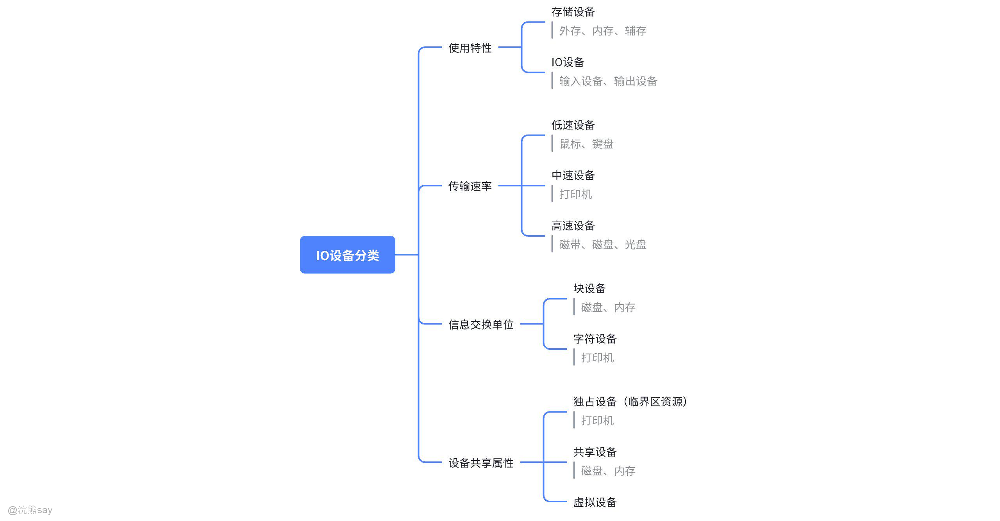

### 按数据传输单位分类（最常用）

1.  **块设备 (Block Device)**

-   **特点**：以**块**为单位（如 512 字节或 4KB）进行数据传输，具备寻址能力，可以随机访问任意块。
-   **管理**：通常使用**缓冲区**来提高性能，并通过 I/O 调度器优化访问顺序。
-   **举例**：硬盘（HDD）、固态硬盘（SSD）、U 盘。

1.  **字符设备 (Character Device)**

-   **特点**：以**字符流**的方式进行数据传输，通常不具备随机访问能力，数据按顺序读取。
-   **管理**：通常采用**中断驱动**方式，适合交互式或实时性要求高的场景。
-   **举例**：键盘、鼠标、串口、打印机。

### 按设备功能分类

-   **存储设备**：用于长期保存数据。如硬盘、SSD、光盘、磁带。
-   **输入设备**：将外部信息输入计算机。如键盘、鼠标、扫描仪、麦克风。
-   **输出设备**：将计算机处理结果展示给用户。如显示器、打印机、音箱。
-   **通信设备**：负责与其他计算机或设备进行数据交换。如网卡、调制解调器（Modem）。

### 按数据传输速率分类

-   **低速设备**：数据传输速率较低，通常为 KB/s 级别。如键盘、鼠标、打印机。
-   **中速设备**：速率介于低速和高速之间，通常为 MB/s 级别。如扫描仪、一些旧款的网络设备。
-   **高速设备**：数据传输速率非常高，通常为 GB/s 级别。如现代的硬盘（SATA/SAS）、SSD（NVMe）、网卡（10G/100G 以太网）。

### 按共享方式分类

-   **独占设备**：在一段时间内只能被一个进程独占使用。如打印机、绘图仪。
-   **共享设备**：可以被多个进程同时访问。如硬盘、网卡。
-   **虚拟设备**：通过**SPOOLing 技术**（假脱机技术），将一台独占设备虚拟化为多台逻辑设备，供多个用户同时使用，最典型的例子是**共享打印机**。

## I/O设备管理技术

## I/O控制方式

### 程序控制方式

CPU 主动周期性查询 I/O 设备状态，若设备未就绪（如未准备好数据传输），CPU 持续循环查询；直到设备就绪，才执行数据传输操作。 实现简单，但 CPU 大量时间耗费在无效查询上，严重占用 CPU 资源，导致 CPU 利用率极低，无法高效处理其他任务。

想象一下，你在等水壶烧水，每隔几秒就跑过去看看 “水开了没”，哪怕水没开也一直重复看。CPU 对设备的轮询就像这样：CPU 没事就问 I/O 设备 “准备好传输数据没”，不管设备有没有准备好，一直问。这种方式特别 “耗 CPU 精力”，CPU 大部分时间浪费在无意义的询问上，啥正事儿都干不了，效率极低。

### 中断驱动方式

I/O 设备准备好数据传输时，主动向 CPU 发送中断请求。CPU 响应中断，暂停当前任务，执行 I/O 数据传输操作，完成后返回原任务继续执行。 无需 CPU 持续查询，提升了 CPU 利用率；但每次中断仍需 CPU 参与数据传输过程，频繁中断会影响 CPU 处理其他任务的效率。

还是烧水的例子：这次水壶装了个响铃，水开了会主动 “叮” 一声提醒你。中断可编程 IO 就是设备准备好数据传输时，主动给 CPU 发信号（像响铃）。CPU 收到信号后，暂时放下手头工作，处理数据传输，处理完再回去干原来的活儿。这样 CPU 不用一直盯着设备，节省了不少时间，但每次设备喊 CPU，CPU 还是得亲自处理传输，频繁被打断也有点麻烦。

### DMA 方式（直接内存访问）

借助 DMA 控制器（硬件），在内存与 I/O 设备间直接传输数据。CPU 仅需初始化 DMA 控制器（如设定传输起始地址、数据长度等），传输过程由 DMA 控制器独立完成，传输结束后再通知 CPU。 大幅减少 CPU 对数据传输的干预，CPU 在初始化后可处理其他任务，提升了系统并行处理能力，适用于高速设备（如磁盘）的批量数据传输。

好比你网购，告诉代购（DMA 控制器）“帮我买 XX 商品，收货地址是 XXX”，之后代购自己处理收货流程，收完货再告诉你。DMA 方式就是 CPU 告诉 DMA 控制器 “数据从哪传、传到哪、传多少”，然后 DMA 控制器自己负责在内存和设备间传数据，传完再通知 CPU。CPU 不用一直盯着传输过程，中间还能去干别的事，特别适合像硬盘这种一次传大量数据的设备。

### 通道控制方式

通道是独立于 CPU 的专用 I/O 处理机，可执行通道程序（控制 I/O 操作的指令集合）。CPU 只需发送启动通道的指令，通道即可自主管理 I/O 设备，完成数据传输、状态监控等操作，结束后向 CPU 反馈结果。 进一步解放 CPU，支持多设备并发操作，适合大型复杂的 I/O 系统（如大型主机的外设管理），显著提升系统 I/O 处理的灵活性和效率。

这就像你装修房子：找个专业装修公司（通道），告诉他们 “房子要装成啥样”，之后装修公司自己管理工人（设备）、安排流程，最后装完告诉你验收。通道是更专业的 “IO 大管家”，独立于 CPU 工作，能同时管理多个设备的 IO 操作。CPU 只需要下任务，剩下的全交给通道，大大解放了 CPU，适合大型复杂的设备管理场景。
| 【例题1】在下面的I/O控制方式中，需要CPU干预最少的方式是()。A.程序I/0方式B.中断驱动1/0控制方式C.直接存储器访问DMA控制方式D.I/O通道控制方式答案：C解析： 核心看 “CPU 干预程度”，逐个对比：A（程序 I/O 方式）：CPU 全程轮询外设（比如一直问 “数据准备好了吗”），全程盯着，干预最多；B（中断驱动 I/O）：CPU 先让外设干活，自己去做别的，外设完成后发中断通知 CPU，CPU 只需要处理中断，干预中等；C（DMA 控制方式）：外设和内存直接传数据，不用 CPU 帮忙（比如硬盘直接把数据写入内存），CPU 只需要启动 DMA 和接收完成信号，干预最少；D（I/O 通道控制方式）：通道是专门管 I/O 的硬件，能独立处理多个外设，但仍需要 CPU 初始化通道、分配任务，干预比 DMA 多。所以 CPU 干预最少的是 DMA 方式，选 C。 |
| --- |

| 【例题2】通道能够完成()之间数据的传输。A.CPU与外设B.内存与外设C.CPU与主存D.外设与外设答案：B解析： 通道的核心功能是 “代替 CPU 管理 I/O 传输”，专门负责内存和外设之间的数据搬运（比如把硬盘里的数据读到内存，或把内存数据写到打印机）。A（CPU 与外设）：不需要通道，程序 I/O 或中断方式就能实现；C（CPU 与主存）：是 CPU 直接访问内存，和通道无关；D（外设与外设）：一般需要通过内存中转，通道不直接处理外设之间的传输。故选 B。 |
| --- |

## I/O软件层次结构

I/O 软件采用分层架构，主要是为了**隐藏硬件细节**并**提供统一接口，**这种设计将复杂的 I/O 管理任务分解为易于处理的层次，常见的IO软件分成以下几个层次：

（1）逻辑 I/O (Logical I/O)，位于最上层，直接面向用户和应用程序，核心功能是提供**抽象的、设备无关的**接口。例如，**对于存储设备**体现为文件系统，用户操作的是文件名和路径（如/home/user/file.txt），而不是具体的磁盘扇区地址。**对于通信设备**体现为网络协议栈，用户调用socket接口发送数据，而无需关心网卡的物理地址或信号编码。

（2）设备IO (Device I/O)，位于中间层，是逻辑 I/O 与物理设备之间的 “翻译官” 和 “协调者”。**核心功能是命令转换，即**将上层抽象的Read/Write命令，翻译成针对特定设备的、具体的操作序列；**I/O 缓冲，即**管理内存中的缓冲区，协调 CPU（快）与设备（慢）之间的速度差异，减少 I/O 次数，显著提升效率。

（3）调度和控制 (Scheduling & Control)，该层位于最底层，直接与硬件打交道，**核心功能包括：**

-   **设备驱动程序**：这是该层的主要组成部分。
-   **并发调度**：管理来自多个进程的 I/O 请求队列，决定设备的服务顺序（例如，磁盘的电梯调度算法）。
-   **硬件控制**：执行最终的硬件指令，控制设备完成数据读写。
-   **中断处理**：响应设备的完成信号，处理硬件产生的异常和状态变化。

| 【例题】操作系统的I/O子系统通常由四个层次组成，每一层明确定义了与邻层的接口，其合理的层次组织排列次序是()。A.用户级1/0软件、设备无关软件、设备驱动程序、中断处理程序B.用户级I/O软件、设备无关软件、中断处理程序、设备驱动程序C.用户级l/O软件、设备驱动程序、设备无关软件、中断处理程序D.用户级l/O软件、中断处理程序、设备无关软件、设备驱动程序答案：A解析： I/O子系统的层次结构遵循“从用户到硬件、层层抽象屏蔽”的逻辑，核心是每一层为上层提供统一接口，下层对接具体实现，合理顺序从顶层到底层依次为：用户级I/O软件（最顶层）：直接面向用户/应用程序，提供简单的I/O操作接口（如打开文件、读写数据），无需关心底层设备细节；设备无关软件（中间层）：屏蔽不同设备的硬件差异，为上层提供统一的逻辑设备接口（比如不管是硬盘还是U盘，都用相同的read/write指令），同时负责设备分配、缓冲管理等；设备驱动程序（底层驱动层）：针对具体硬件设备（如打印机、硬盘）的专用软件，知道如何与设备硬件通信（比如发送控制信号、读取设备状态），是设备无关软件和硬件之间的桥梁；中断处理程序（最底层）：直接对接硬件中断信号，当设备完成I/O操作后（如数据读取完毕），触发中断并由该程序处理（比如通知上层软件“操作完成”），是硬件与软件的直接交互入口。其他选项的层次顺序均违背“抽象到具体、上层到下层”的逻辑（如B、D将中断处理程序提前，C颠倒设备无关软件与驱动程序的顺序），因此选A。 |
| --- |

## 缓冲区管理

## 为什么要有缓冲区？

缓冲区在计算机里面有点儿类似于水库得概念，当上游发大水的时候缓冲区可以起到蓄水、调节流量的作用，缓冲区也一样。在计算机中CPU和IO设备的效率是不一样的，如果CPU直接使用IO的数据，那么会导致CPU长时间空转，啥事儿也干不了。因此，在IO设备和CPU之间引入了缓冲区的概念，主要为了解决以下几个问题：

1.  **缓和速度矛盾：**CPU 快、IO 慢，缓冲区先存 IO 的数据，CPU 直接从缓冲区快速取，不用干等 IO，就像水库蓄水，按需放水流。
2.  **减少 CPU 中断麻烦：**IO 不用频繁喊 CPU 处理数据，缓冲区攒够数据再通知，放宽 CPU 处理中断的时间限制。
3.  **让 CPU 和 IO 并行干活：**CPU 处理缓冲区数据时，IO 能同时准备新数据，提升整体效率。
4.  **解决数据 “颗粒” 不匹配**：比如 IO 一次读很多数据，CPU 一次处理不了那么多，缓冲区拆分或整合数据，适配双方需求。

总得来说引入缓冲区之后可以有效减少CPU与I/O设备速度不匹配的矛盾，有效减少CPU的中断频率，提高CPU和IO设备之间的并行性。

## 单缓冲区——食堂打饭（只有一个窗口）

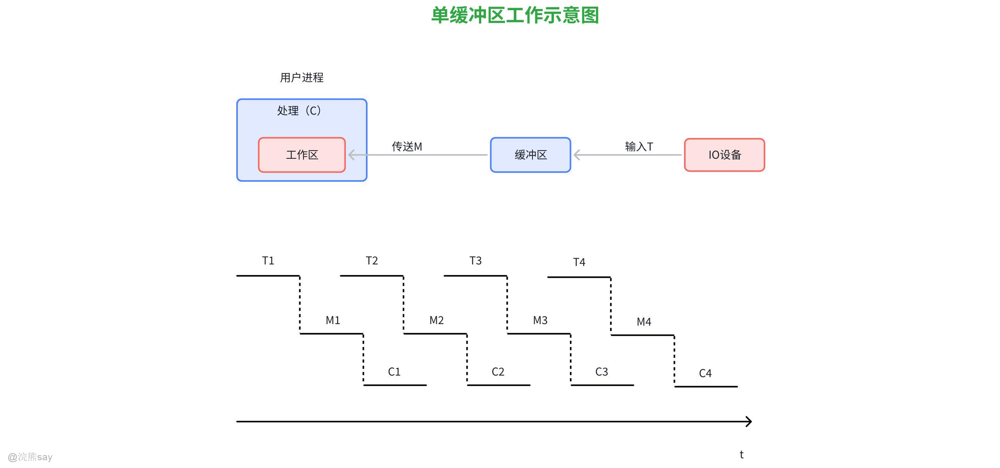

单缓冲区的情况有点儿像厨房师傅打饭，厨师（IO）把饭放窗口，学生（CPU）来窗口取饭。IO 先把数据放单缓冲区，放满后通知 CPU 来取，CPU 取完，IO 才能再放新数据。但是这样一来，IO 和 CPU 只能 “轮流干活”，比如 CPU 取饭时，厨师得等；厨师放饭时，学生也得等，效率不够高。

## 双缓冲区——还是食堂场景（两个窗口）

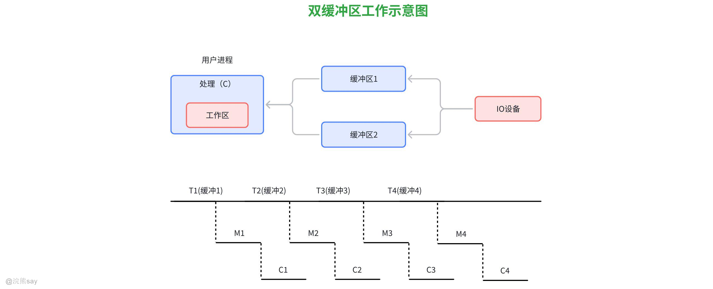

还是以食堂打饭的例子来讲，双缓冲区的机制就像：厨师先往窗口 1 放饭，放满后，学生来窗口 1 取饭；同时，厨师赶紧往窗口 2 放饭，学生取完窗口 1，又可以取窗口 2 的饭，厨师再接着填窗口 1。这样一来IO 和 CPU 能 “并行” 一些，比如学生取窗口 1 时，厨师填窗口 2，两边不耽误，比单缓冲区效率更高，减少等待时间。

## 环行缓冲区——像工厂的环形传送带

缓冲区是一个环形队列，数据按顺序存入环的一端，从另一端取出，填满后，又从开头循环使用。当输入/输出速度相差很大的时候，双缓冲的效果不够理想，此时可以引入多缓冲机制，可将多个缓冲区域组成环形缓冲区。

## 缓冲池

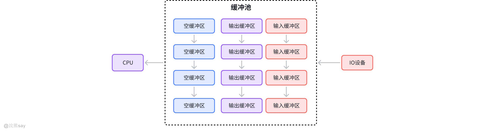

缓冲池故名思义就是多个缓冲区的集合，动态分配使用，优点类似于Java当中的线程池的概念，缓冲池一般存在3种缓冲区：

1.  空缓冲区
2.  装满输入数据的缓冲区
3.  装满输出数据的缓冲区

为了管理上的方便，可以将同类型的缓冲区链接成一个链表，因此可以形成三个队列，数据输入/输出的时候可以方面取用。目前的操作系统广泛适用缓冲池，缓冲池可以设置多个可供若干线程共享的缓冲区，既能够用于输入，也能用于输出。
| 【例题1】缓冲技术用于()。A.提高主机和设备交换信息的速度B.提供主、辅存接口C.提高设备利用率D.扩充相对地址空间答案：A解析： 缓冲技术的核心作用是 “缓解 CPU 与外设之间的速度不匹配问题”——CPU 运算速度极快，而外设（如硬盘、打印机）读写速度较慢，直接交换数据会导致 CPU 长时间等待外设，效率低下。缓冲技术在内存中开辟临时存储区域（缓冲区），CPU 先将数据写入缓冲区（或从缓冲区读取数据），再由缓冲区与外设异步交换数据，CPU 无需等待外设完成，可同时处理其他任务，从而提高主机和设备交换信息的整体速度；B（提供主辅存接口）是存储管理的功能，与缓冲无关；C（提高设备利用率）是间接效果，而非缓冲技术的核心用途；D（扩充相对地址空间）是虚拟内存的作用，与缓冲技术无关。 |
| --- |

| 【例题2】为了使多个进程能有效地同时处理输入和输出，最好使用()结构的缓冲技术。A.单缓冲区B.双缓冲区C.多缓冲区环D.缓冲池答案：D解析： 需结合 “多个进程同时处理 I/O” 的核心需求 —— 要求缓冲技术支持共享、高效分配，避免进程冲突：A（单缓冲区）：仅一个缓冲区，同一时间只能供一个进程的 I/O 操作使用，多进程会竞争资源，无法有效并行；B（双缓冲区）：两个缓冲区交替使用，仅能支持少量进程（如生产者 - 消费者）的简单 I/O 并行，无法满足 “多个进程” 的场景；C（多缓冲区环）：环形结构的多个缓冲区，仍针对单个设备或特定进程组，灵活性差，共享性不足；D（缓冲池）：由多个缓冲区组成的公共资源池，通过空闲队列、忙队列等机制统一管理，多个进程可按需申请、释放缓冲区，能高效支持多进程同时进行 I/O 操作，是最适合的结构。 |
| --- |

## SPOOLing技术

## 什么是SPOOLing技术

假脱机技术（Spooling，全称 Simultaneous Peripheral Operations On-Line），可以将独立设备编程共享的设备以提高设备利用率。它主要是用来**解决低速设备与高速 CPU 之间的速度不匹配问题**，比如打印机这类设备。**Spoling技术简单来说就是将一台物理的IO设备虚拟为多台逻辑上的IO设备，这样就允许多个用户共享一台物理IO设备**。就以打印任务来说，Spooling 技术就是让电脑像 “快递中转站” 一样处理任务。比如你同时发送多个打印任务，电脑不会让打印机立刻逐个处理，而是先把这些任务全部存到一个临时仓库（比如硬盘上的特定区域），然后按顺序慢慢交给打印机执行。

## SPOOLing技术原理

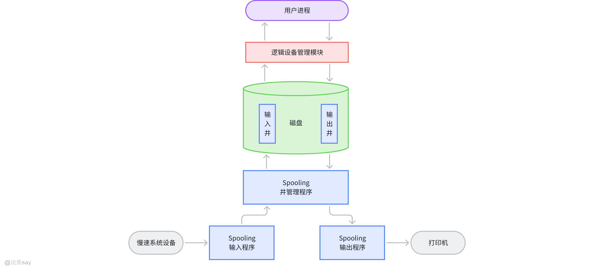

SPOOLing 的核心是通过**SPOOLing 程序**作为 “中介”，分离 “应用程序的 I/O 请求” 与 “外设的实际 I/O 操作”，并通过**两级缓冲区**实现数据暂存与调度。

**（1）SPOOLing 程序的 “双向中介” 作用**

SPOOLing 程序是技术的核心，承担 “数据转发与调度” 功能，同时与两类对象交互。一方面与外设交互（实际 I/O），即直接和物理外设（如打印机、键盘）进行数据交换，这一步是 “实际 I/O”（速度由外设决定，通常较慢）。

另一方面与应用程序交互（虚拟 I/O），即接收应用程序的 I/O 请求（读 / 写），通过缓冲区与应用程序交换数据，这一步是 “虚拟 I/O”（速度由内存 / 高速外存决定，远快于实际 I/O）。

**（2）两级缓冲区的分工**

SPOOLing 程序需要管理**内存缓冲区**和**高速外存缓冲池**（通常称为 “输入井” 和 “输出井”），两者分工明确，共同解决 “数据暂存” 和 “速度匹配” 问题：
| 缓冲区类型 | 位置 | 作用 | 特点 |
| --- | --- | --- | --- |
| 内存缓冲区 | 内存 | 临时存放 “外设→外存缓冲池” 或 “外存缓冲池→应用程序” 的数据，减少频繁外存访问 | 速度极快，容量小，临时暂存 |
| 高速外存缓冲池 | 磁盘等外存 | 长期暂存多批 I/O 数据（分为 “输入井” 和 “输出井”） | 容量大，速度中等，长期暂存 |

**输入井**：暂存外设（如键盘、扫描仪）输入的数据，SPOOLing 程序先将外设数据读入输入井，后续应用程序直接从输入井取数据（无需等外设）。

**输出井**：暂存应用程序要输出到外设（如打印机）的数据，应用程序先将数据写入输出井，SPOOLing 程序再按顺序将输出井数据传给外设（应用程序无需等外设完成）。

**（3）实际 I/O 与虚拟 I/O 的 “时间分离”**

**虚拟 I/O（应用程序视角）**：应用程序的 I/O 操作仅与 SPOOLing 的缓冲区（内存 / 外存缓冲池）交互 —— 读数据从输入井取，写数据到输出井存。这一步速度极快（接近内存 / 磁盘速度），应用程序无需等待低速外设，可快速完成 I/O 并继续执行其他任务。

**实际 I/O（SPOOLing 程序视角）**：SPOOLing 程序在后台异步完成 “外设与缓冲池” 的数据交换 —— 空闲时从外设读数据到输入井，或从输出井写数据到外设。这一步的速度不影响应用程序，实现了 “应用程序执行” 与 “外设 I/O” 的并行。

## SPOOLing系统特点

**（1）实现 “高速虚拟 I/O”，缩短应用程序执行时间**

应用程序的 I/O 操作从 “直接访问低速外设”（如打印机每秒仅能打印几十行），变为 “访问高速缓冲池”（内存 / 磁盘每秒可传输 GB 级数据），速度大幅提升。更关键的是 “时间分离”：应用程序完成虚拟 I/O 后即可继续运行，无需等待实际外设完成 I/O（如无需等打印机打印完文档），显著减少进程等待时间。

**实例**：当你在电脑上点击 “打印文档” 后，无需等打印机打印结束就能继续编辑其他文件 —— 因为文档数据已先写入输出井（虚拟 I/O 完成），SPOOLing 程序会在后台调度打印机逐步打印（实际 I/O 异步执行）。

**（2）实现 “独享设备共享”，提升外设利用率**

物理外设分为 “独享设备”（如打印机、磁带机，同一时间只能被一个进程使用）和 “共享设备”（如磁盘，可被多个进程同时访问）。SPOOLing 通过 “虚拟设备” 技术，让独享设备具备 “共享能力”：

-   SPOOLing 程序为每个请求外设的进程提供一个 “虚拟设备”（如 “虚拟打印机”），进程认为自己在 “独占” 设备（实际是操作缓冲池）。
-   多个进程的 I/O 数据先暂存到缓冲池（输入井 / 输出井），SPOOLing 程序按 “先来先服务” 等策略，依次将缓冲池数据交给实际外设处理，实现 “多个进程共享一个独享设备”。

**实例**：办公室 10 个员工同时打印文档，无需排队等待前一个人打印完 —— 所有人的文档先存入输出井，SPOOLing 程序按顺序将文档传给打印机，员工只需等待 “虚拟打印完成”（数据写入输出井），而非实际打印完成，大幅提升打印机利用率和员工效率。
| 【例题1】CPU输出数据的速度远远高于打印机的打印速度，为解决这一矛盾，可采用()。A.并行技术B.缓冲技术C.虚拟存储器技术D.覆盖技术答案：B解析： 核心矛盾是 “CPU 速度快、打印机速度慢”，需缓解两者速度不匹配问题：A（并行技术）：是让多个设备 / 任务同时工作，无法解决 “单个 CPU 与单个外设的速度差”；B（缓冲技术）：在内存中开辟缓冲区，CPU 先将数据写入缓冲区，再由缓冲区异步传给打印机（CPU 无需等待打印机完成），完美解决速度矛盾；C（虚拟存储器技术）：用于扩充逻辑地址空间，与 I/O 速度无关；D（覆盖技术）：用于解决内存不足，让小内存运行大程序，和速度矛盾无关。 |
| --- |

| 【例题2】使用SPOOLing系统的目的是为了提高()的使用效率。A.操作系统B.I/O设备C.内存D.CPU答案：B解析： SPOOLing（假脱机）技术的核心是 “把独占 I/O 设备（如打印机、磁带机）变成共享设备”：比如多个进程要打印文件，SPOOLing 会先把所有打印任务存到磁盘缓冲队列，再依次交给打印机打印，避免 “一个进程占着打印机，其他进程等待”，让 I/O 设备一直处于忙碌状态，从而提高 I/O 设备的使用效率；A（操作系统）是管理软件，不是 “使用效率” 的对象；C（内存）、D（CPU）的效率提升不是 SPOOLing 的核心目的。 |
| --- |

| 【例题3】操作系统中的SPOOLing技术，实质上是将()“转化”为共享设备的技术。A.临界设备B.虚拟设备C.脱机设备D.块设备答案：A解析： 临界设备（又称独占设备）是 “一段时间内只能让一个进程使用的设备”（如打印机、扫描仪），这是其本质属性；SPOOLing 技术通过 “磁盘缓冲队列 + 后台进程”，让多个进程的 I/O 请求排队处理，看似多个进程同时使用该设备，实质是将 “临界设备” 转化为逻辑上的 “共享设备”；B（虚拟设备）是 SPOOLing 的实现结果（不是转化对象）；C（脱机设备）是物理上脱离主机的设备，与技术逻辑无关；D（块设备）是按块存储的设备（如硬盘），本身可共享，无需转化。 |
| --- |

## 磁盘管理

## 磁盘的结构
|   |   |
| --- | --- |

如上图所示为机械硬盘的示意图，机械硬盘是由多个物理盘片组成的，每个**盘片**有的是单面存储，有的是双面存储的。同时，每个盘面又被又被划分成多个**磁道**，磁道是磁盘的**磁头**在上面读取数据的路径，每个磁道又会被划分为多个**扇区**，磁盘读/写数据是以扇区为单位进行的。

## 磁盘调度算法

### 一次磁盘读/写操作需要的时间

1.  **寻道时间**

启动磁头臂需要时间 s（比如 0.1ms），移动每跨越 1 个磁道耗时 m（比如 0.01ms）

1.  **延迟时间**

磁盘延迟时间是指磁盘旋转使磁头定位到目标扇区所需的时间。由于磁盘是匀速旋转的，平均而言，磁头需要旋转半圈才能到达目标扇区。

磁盘每转一圈所用的时间是（为磁盘转速，单位：转 / 秒），那么旋转半圈的平均时间就是，这就是延迟时间公式的由来

r 是磁盘转速（转 / 秒），比如 7200 转 / 分≈120 转 / 秒 → TR≈0.00417 秒≈4.17ms。

1.  **传输时间**

磁盘以恒定的转速_r_（转 / 秒）旋转，每转一圈，磁头可以读取或写入一个磁道的数据。已知每磁道有_N_个字节，那么每秒磁盘能够传输的数据量就是_r_×_N_字节。

b 是读写数据量，N 是每磁道字节数。假设一次读 1KB，N=1MB → Tt≈0.0000083 秒≈0.0083ms。

下面我们将介绍5种磁盘调度算法，都以假设磁头的初始位置是100号磁道，有多个进程先后陆续地请求访问 55、58、39、18、90、160、 150、38、184 号磁道为例，来看看各种方法的所需寻址时间。

### 先来先服务算法(FCFS)

根据进程**请求访问磁盘的先后顺序进行调度**，按照 FCFS 的规则，按照请求到达的顺序，最开始磁头在100号位置，磁头需要依次移动到 55、58、39、18、90、160、150、 38、184 号磁道。

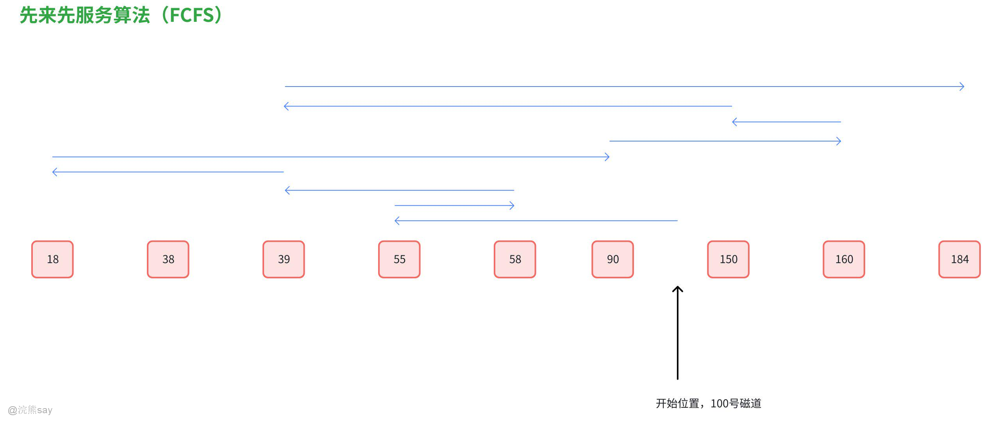

磁头总共移动了 45+3+19+21+72+70+10+112+146 = 498 个磁道，响应一个请求平均需要移动 498/9 = 55.3 个磁道(平均寻找长度)

**优点:**公平;如果请求访问的磁道比较集中的话，算法性能还算过的去

**缺点:**如果有大量进程竞争使用磁盘，请求访问的磁道很分散，则FCFS在性能上很差，寻道时间长。

### 最短寻找时间优先(SSTF)

SSTF 算法会优先处理的磁道是与当前磁头最近的磁道，可以保证每次的寻道时间最短，但是并不能保证总的寻道时间最短。(其实就是贪心算法的思想，只是选择眼前最优，但是总体未必最优)

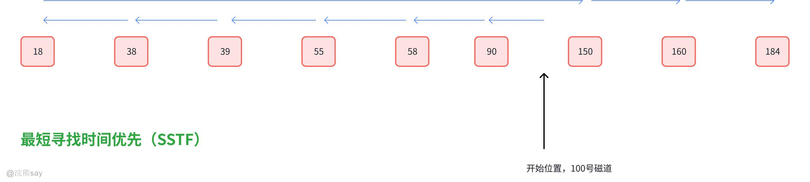

磁头总共移动了 (100-18) + (184-18) = 248 个磁道， 响应一个请求平均需要移动 248/9 = 27.5 个磁道(平均寻找长度)

**优点:**性能较好，平均寻道时间短

**缺点:**可能产生“饥饿”现象

**Eg:**本例中，如果在处理18号磁道的访问请求时又来了一个38号磁道的访问请求，处理38号磁道 的访问请求时又来了一个18号磁道的访问请求。如果有源源不断的 18号、38号磁道的访问请求 到来的话，150、160、184 号磁道的访问请求就永远得不到满足，从而产生“饥饿”现象。

**产生饥饿的原因在于:**磁头在一个小区域内来回来去地移动

### 扫描算法(SCAN)

SSTF 算法会产生饥饿的原因在于:磁头有可能在一个小区域内来回来去地移动。为了防止这个问题，可以规定，只有磁头移动到最外侧磁道的时候才能往内移动，移动到最内侧磁道的时候才能往外移动。这就是扫描算法(SCAN)的思想。由于磁头移动的方式很像电梯，因此也叫电梯算法。

假设某磁盘的磁道为 0~200号，磁头的初始位置是100号磁道，且此时磁头正在往磁道号增大的方向 移动，有多个进程先后陆续地请求访问 55、58、39、18、90、160、150、38、184 号磁道。

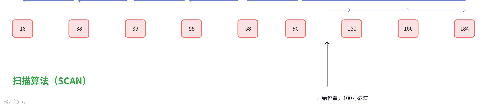

磁头总共移动了 (200-100) + (200-18) = 282 个磁道， 响应一个请求平均需要移动 282/9 = 31.3 个磁道(平均寻找长度)

优点:性能较好，平均寻道时间较短，不会产生饥饿现象

缺点:

1.  只有到达最边上的磁道时才能改变磁头移动方向，事实上，处理了184号磁道的访问请求之后就不需要再往右移动磁头了。

1.  SCAN算法对于各个位置磁道的响应频率不平均(如:假设此时磁头正在往右移动，且刚处理过 90号磁道，那么下次处理90号磁道的请求就需要等磁头移动很长一段距离;而响应了184号磁道 的请求之后，很快又可以再次响应 184 号磁道的请求了)

### LOOK 调度算法

扫描算法(SCAN)中，只有到达最边上的磁道时才能改变磁头移动方向，事实上，处理了184号磁 道的访问请求之后就不需要再往右移动磁头了。LOOK 调度算法就是为了解决这个问题，如果在磁 头移动方向上已经没有别的请求，就可以立即改变磁头移动方向。(边移动边观察，因此叫 LOOK)

假设某磁盘的磁道为 0~200号，磁头的初始位置是100号磁道，且此时磁头正在往磁道号增大的方向 移动，有多个进程先后陆续地请求访问 55、58、39、18、90、160、150、38、184 号磁道.

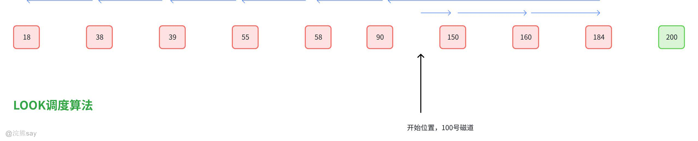

磁头总共移动了 (184-100) + (184-18) = 250 个磁道, 响应一个请求平均需要移动 250/9 = 27.5 个磁道(平均寻找长度)

优点:比起 SCAN 算法来，不需要每次都移动到最外侧或最内侧才改变磁头方向，使寻道时间进 一步缩短.

### 循环扫描算法(C-SCAN)

SCAN算法对于各个位置磁道的响应频率不平均，而 C-SCAN 算法就是为了解决这个问题。规定只有 磁头朝某个特定方向移动时才处理磁道访问请求，而返回时直接快速移动至起始端而不处理任何请求。

假设某磁盘的磁道为 0~200号，磁头的初始位置是100号磁道，且此时磁头正在往磁道号增大的方向移动，有多个进程先后陆续地请求访问 55、58、39、18、90、160、150、38、184 号磁道

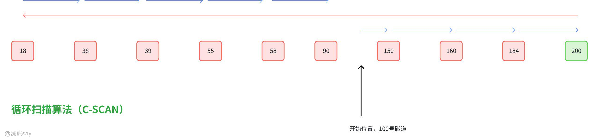

磁头总共移动了 (200-100) + (200-0) + (90-0)= 390 个磁道, 响应一个请求平均需要移动 390/9 = 43.3 个磁道(平均寻找长度).

优点:比起SCAN 来，对于各个位置磁道的响应频率很平均。

缺点:只有到达最边上的磁道时才能改变磁头移动方向，事实上，处理了184号磁道的访问请求 之后就不需要再往右移动磁头了;并且，磁头返回时其实只需要返回到18号磁道即可，不需要返回到最边缘的磁道。另外，比起SCAN算法来，平均寻道时间更长。

### C-LOOK 调度算法

C-SCAN 算法的主要缺点是只有到达最边上的磁道时才能改变磁头移动方向，并且磁头返回时不一定 需要返回到最边缘的磁道上。C-LOOK 算法就是为了解决这个问题。如果磁头移动的方向上已经没有 磁道访问请求了，就可以立即让磁头返回，并且磁头只需要返回到有磁道访问请求的位置即可。还是上面的例子：

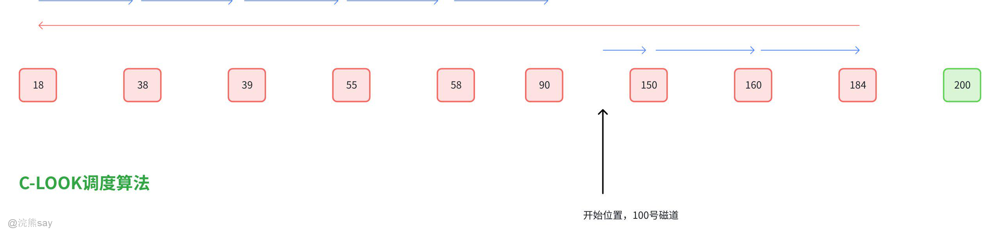

磁头总共移动了 (184-100) + (184-18) + (90-18)= 322 个磁道 响应一个请求平均需要移动 322/9 = 35.8 个磁道(平均寻找长度)

优点:比起 C-SCAN 算法来，不需要每次都移动到最外侧或最内侧才改变磁头方向，使寻道时间 进一步缩短
| 【例题1】在磁盘调度算法中，选择与当前磁头移动方向一致、磁头单向移动且距离最近的进程的算法为()。A.FIFOB.SCANC.CSCAND.FSCAN答案：B解析： 核心看磁盘调度算法的核心特征匹配：A（FIFO）：按请求顺序处理，不考虑磁头移动方向和距离，排除；B（SCAN，电梯算法）：磁头像电梯一样 “单向移动”，只处理与移动方向一致、距离最近的请求（比如磁头向右移时，优先处理右侧最近的请求，直到端点再反向），完全符合题干描述；C（CSCAN，循环扫描）：磁头单向移动到端点后，直接跳回另一端起点（不反向），不满足 “沿当前方向处理最近请求” 的逻辑，排除；D（FSCAN）：是 SCAN 的改进版（分前后台队列），核心逻辑仍不匹配题干 “单向 + 就近” 的核心要求，排除。 |
| --- |

| 【例题2】磁盘上的文件以()为单位读写。A.数组B.块C.记录D.磁盘E.柱面答案：B解析： 磁盘是 “块设备”，物理读写的基本单位是 “块”（又称物理块、扇区组）—— 操作系统会将文件拆分成固定大小的块，再写入磁盘或从磁盘读取，块是磁盘 I/O 的最小单位。A（数组）：是程序中的数据结构，与磁盘读写无关；C（记录）：是文件逻辑上的组织单位（如数据库文件的一条数据），不是物理读写单位；D（磁盘）：是整个存储设备，不是 “单位”；E（柱面）：是磁盘的物理结构（多个盘面的同一磁道组成），用于定位磁头，不是读写单位。 |
| --- |

## 磁盘高速缓存

磁盘高速缓存就是在计算机中，为了让数据读写更快而设置的一个“临时仓库”。我们知道，计算机的磁盘就像一个大仓库，里面存储着很多数据。但是磁盘读写数据的速度相对较慢，就好比从一个很大的仓库里找东西并拿出来，或者把东西放进去，这个过程比较耗时。

而磁盘高速缓存呢，就是在内存中划出一块区域，作为磁盘数据的临时存放地。当计算机需要从磁盘读取数据时，它会先去高速缓存里看看，如果数据在里面，就直接从缓存中读取，这比从磁盘读取要快得多。

同样，当计算机要往磁盘写入数据时，也会先把数据放在高速缓存中，等缓存中的数据积累到一定量，或者满足一定条件时，再一起写入磁盘。这样就可以减少对磁盘的直接读写次数，提高数据的读写速度，让计算机运行得更快更流畅。

## 磁盘提高IO速度的方法

除了磁盘高速缓存之外，还有几种方法能够有效提高磁盘IO速度：

1.  **提前读**：就像你看书时，提前预判接下来可能会用到的内容并先读好准备着一样。计算机系统会猜测程序接下来可能需要哪些数据，然后提前把这些数据从磁盘读取到内存中。这样当程序真正需要这些数据时，就可以直接从内存中快速获取，而不用再去慢慢从磁盘读取，从而提高了数据读取的速度。

1.  **延迟写**：好比你要把东西放到一个比较远的仓库，但是不马上放过去，而是先把东西放在一个离你较近的临时地方，等攒够一定数量或者过一段时间再一起送到仓库。计算机在写数据到磁盘时，先把数据暂时存放在内存的缓冲区中，而不是立刻写入磁盘。等到缓冲区中的数据达到一定量，或者满足某些特定条件（如系统空闲时），再将这些数据一次性写入磁盘。这样可以减少磁盘的写入次数，因为每次写入磁盘都需要一定的时间和开销，从而提高了整体的写入效率。

1.  **优化文件物理分布**：可以把磁盘想象成一个大书架，文件就像书架上的书。如果书摆放得杂乱无章，找起来就很费劲，放回去也不方便。优化文件物理分布就是把文件在磁盘上的存储位置进行合理安排，让相关的文件或数据尽量放在磁盘上相邻的位置，这样在读取或写入文件时，磁头就不用在磁盘上跳来跳去寻找数据，就像你在书架上找书时，能很容易地找到相邻放置的相关书籍一样，从而减少了磁头的移动距离和时间，提高了I/O速度。

1.  **虚拟盘**：这是在计算机内存中模拟出一个像磁盘一样的存储区域。因为内存的读写速度比实际的磁盘要快很多，所以把一些经常需要读写的数据放在虚拟盘中，就可以让计算机像访问磁盘一样访问这个虚拟的存储区域，而且速度会快很多。就好像在你身边建了一个小型的、速度很快的“临时仓库”，用来存放你最常用的东西，需要时可以快速拿到，而不用去远处的大仓库（实际磁盘）拿，从而提高了数据的读写速度。不过虚拟盘也有个缺点，就是计算机一旦关机或断电，虚拟盘中的数据就会丢失，因为内存中的数据是临时存储的，不像磁盘那样可以长期保存数据。
