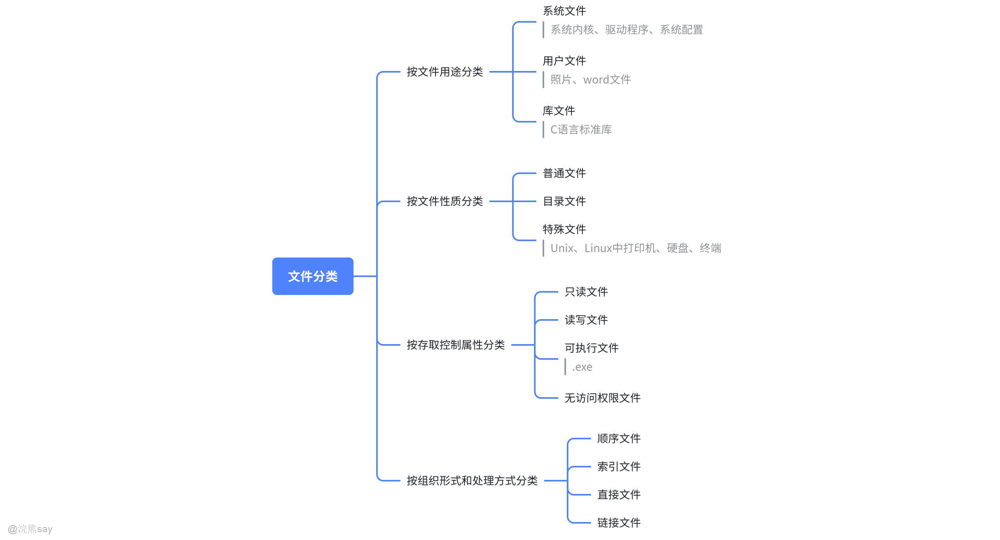
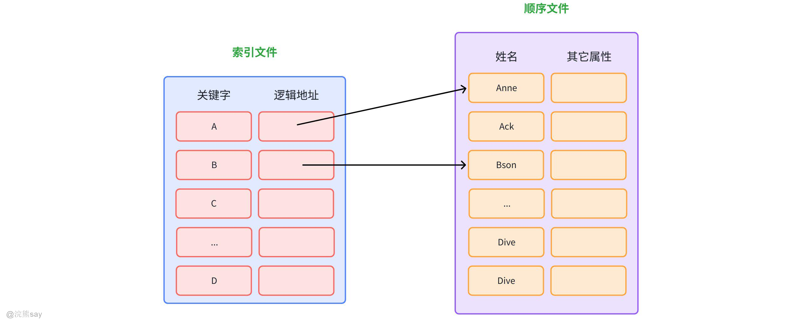
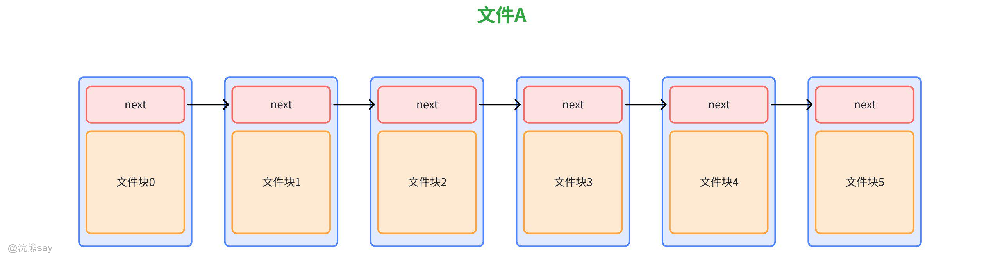
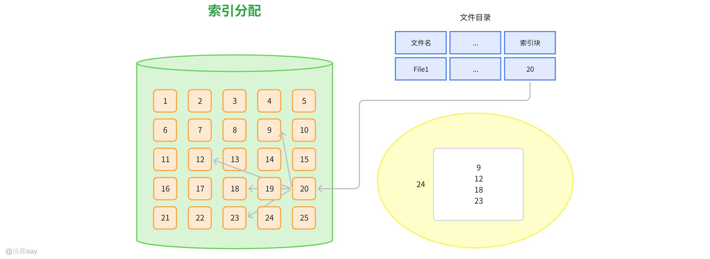
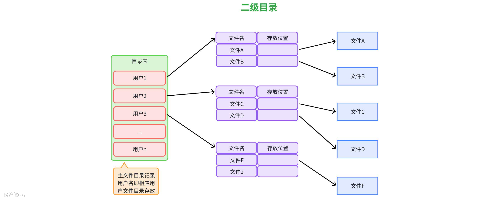
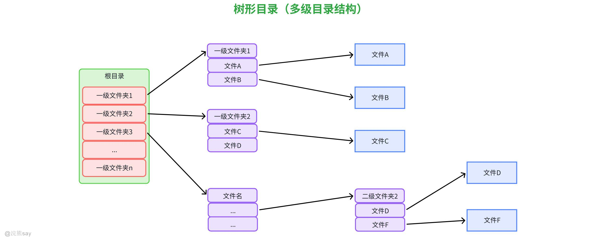
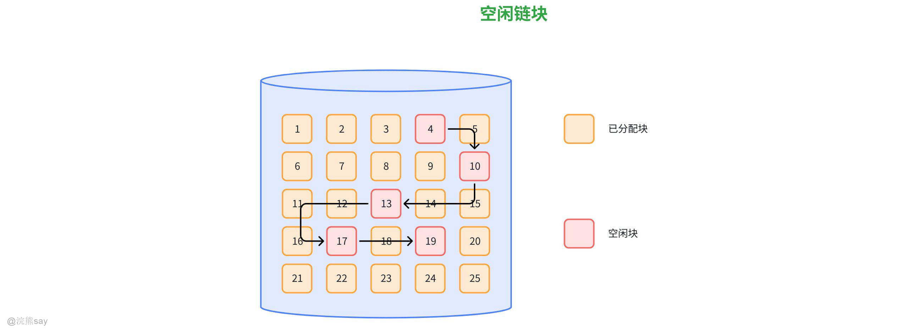

# 6、文件管理

**Part 06：文件管理**
| 【原创声明】大家好，我是浣熊say，是这篇文章的原创作者！985硕士毕业，应届进入某大厂后道心破碎，社招上岸多家855半垄断央企，因为自己淋过雨，希望帮大家撑把伞，帮助更多同学找到不内卷、能够好好生活的央国企，已帮助1000+同学上岸央国企，需要连联系学长的加微信：wx_hxsay |
| --- |

## 文件与文件系统概念

## 文件管理的目的

在计算机系统中，所有应用程序的运行都依赖于 “存储信息” 与 “检索信息” 的能力。为满足这一基础需求，信息管理需遵循三大核心要求，而操作系统（OS）则通过一系列文件管理机制，实现对文件的高效、安全管控。文件管理本质是解决 “如何安全、高效地存储与共享数据” 的问题，具体需满足以下三点：

1.  **能够存储大量的信息**应用程序（如数据库、文档处理软件）产生的数据量往往远超内存容量，且需长期留存，因此必须依赖磁盘、U 盘等外部存储介质，以文件为基本单元承载海量信息，突破内存的临时性和容量限制。
2.  **长期保存信息**内存属于 “易失性存储”（断电后数据丢失），而文件存储在外部介质中，可实现数据的持久化保存 —— 即使系统重启或断电，文件中的信息仍能稳定留存，满足用户对数据长期使用的需求（如个人文档、系统配置文件）。
3.  **可以共享信息**在多用户、多进程环境中（如服务器、多人协作场景），不同用户或进程可能需要访问同一数据（如共享文档、公共配置）。文件管理需支持信息共享，同时避免因并发访问导致的数据冲突或泄露。

在满足 “大量存储、长期保存、安全共享” 三大需求的基础上，通过操作系统的精细化管控，平衡**用户便捷性**（统一接口、符号命名）、**系统性能**（并发控制、性能优化）与**数据安全性**（权限控制、差错恢复），为应用程序和用户提供可靠的信息存储与检索服务。

## 数据项、记录和文件

1.  **什么是数据项？**

是数据的最小单位，通常表示一个简单的事实，如一个人的姓名、年龄、电话号码等。它是不可再分的数据单位，在计算机系统中通常占据固定的存储空间。

1.  **什么是记录？**

由若干相关的数据项组成，用于描述一个具体的实体或对象。例如，一条学生记录可能包含学号、姓名、年龄、性别、成绩等数据项，这些数据项共同描述了一个学生的相关信息。记录可以看作是数据项的集合，它是文件中数据组织的基本单位。

1.  **什么是文件？**

所谓文件是指具有文件名的一组相关信息的集合，它可以包含多个记录。文件将数据以一种有组织的方式存储在计算机的存储设备上，以便于管理和访问。例如，一个学生信息文件可能包含了所有学生的记录，通过文件名可以方便地对该文件进行操作，如读取、写入、删除等。

## 文件名

文件名是文件的唯一标识，是操作系统管理文件、用户访问文件的核心依据。其结构、长度、字符规则及扩展名含义，会因操作系统不同而存在差异，其中 DOS/Windows 系统的 “主文件名.扩展名” 格式最为典型。

**主文件名的**核心作用是标识文件的具体内容或用途（如readme表示说明文件，chapter11表示第 11 章文档）。主文件名长度不超过 8 个字符，确保系统能高效处理文件索引。
| 文件扩展名 | 对应文件类型 | 示例 |
| --- | --- | --- |
| .C | C 语言源程序文件 | II.c（名为 II 的 C 源文件） |
| .COM | 可执行文件（小模式，体积较小） | Il.com |
| .EXE | 可执行文件（大模式，功能更全） | Il.exe |
| .BAT | 批处理文件（自动执行一系列命令） | autoexec.bat |
| .OBJ | 目标文件（编译后的中间文件） | H.obj |
| .TXT | 文本文件（纯文字，无格式） | readme.txt |
| .PP | 部分文档或演示文件（如早期 PPT 雏形） | chapter11.pp |

**扩展名**标识文件的类型，帮助操作系统关联对应的打开程序（如.txt关联记事本，.exe直接关联执行程序），上面表格中列举了WINDOWS系统中常见扩展名。

## 文件类型

如上图所示，文件按照不同的角度可以进行分类：

-   按用途分为：系统文件、用户文件、库文件；
-   按照文件性质分：普通文件、目录文件和特殊文件；
-   按照存取控制属性分为：只读文件、读写文件、可执行文件和无权限访问文件；
-   按照组织形式和处理方式分为：顺序文件、索引文件、直接文件和链接文件；

不同类型的文件打开的方式不同，打开所需要的程序也不同。

## 文件系统

文件系统是操作系统的关键组成部分，其核心角色是**连接用户 / 应用程序与辅存储器（如磁盘、U 盘等外存）的桥梁**，负责统一管理辅存上的文件信息，为用户和程序提供安全、高效的文件存储、访问及维护能力。文件系统本质上是一套 “软件 + 数据结构” 的集合，主要解决两个核心问题：

**屏蔽硬件差异**：用户无需了解辅存的物理结构（如磁道、扇区、存储介质类型），只需通过文件系统提供的接口操作文件，由文件系统将逻辑文件请求转化为对辅存的物理读写指令。

**高效管理文件**：通过目录结构、索引机制、空间管理等技术，实现文件的有序组织、快速检索和合理存储，避免文件混乱或存储空间浪费。
| 【例题】操作系统对系统中的数据进行管理的部分通常叫做()。A.数据库系统B.文件系统C.检索系统D.数据库E.数据存储系统F.数据结构答案：B解析： 操作系统中专门负责 “管理文件和存储空间” 的部分称为文件系统 —— 核心功能是组织、存储、检索用户数据，以及管理文件的创建、删除、读写等操作。A（数据库系统）是独立的软件系统，并非操作系统的组成部分；C（检索系统）、D（数据库）、E（数据存储系统）、F（数据结构）均与操作系统的文件管理模块无关，故选 B。 |
| --- |

| 【例题】文件系统所追求的最重要目标是()。A.提高对文件的存取速度B.提高I/0速度C.提高存储空间的利用率D.文件保护答案：C解析： 文件系统的核心目标是 “高效利用存储空间”—— 通过合理的文件组织方式（如连续、链接、索引存储）和空间分配策略（如空闲块管理），减少存储碎片，提高磁盘等存储设备的利用率，这是所有文件操作的基础。A（存取速度）、B（I/O 速度）是性能优化目标，D（文件保护）是安全目标，均不如 “存储空间利用率” 核心，故选 C。 |
| --- |

| 【例题】操作系统管理用户数据的单位是()。A.扇区B.文件C.磁道D.文件夹答案：B解析： 操作系统对用户数据的管理以 “文件” 为基本单位 —— 用户的文档、程序等数据都会被组织成文件，OS 通过文件系统统一管理文件的存储、访问权限等。A（扇区）、C（磁道）是磁盘的物理结构单位，属于底层硬件层面；D（文件夹）是文件的组织方式（用于分类存放文件），并非管理用户数据的单位，故选 B。 |
| --- |

## 文件的逻辑结构

文件逻辑结构是从**用户视角**定义的文件内部组织方式与访问模式，其核心特征是**独立于外存物理存储**，仅关注 “用户如何使用文件”，也称 “文件组织”。它直接决定了文件的访问效率、修改便捷性及存储转换的难易度。文件逻辑结构的设计需平衡**访问性能**与**存储性能**，具体要求如下：

-   **访问性能**：便于快速检索（如随机查找、顺序查找）、便于内容修改（如插入、删除、更新记录）。
-   **存储性能**：能快速转换为物理存储格式（降低逻辑 - 物理映射开销）、节省存储空间（减少冗余）。

文件根据逻辑结构的组织方式不同，分为顺序文件、索引顺序文件、索引文件、哈希文件或直接文件四种文件组成。

## 无结构文件（流式文件）

流式文件是最简单的逻辑结构形式，它将文件中的数据视为**连续的字节流（或字符流）**，文件内部没有预定义的 “记录” 划分，也不存在固定的结构格式，无结构文件的特点如下：

1.  **无固定结构：**系统不解释文件内容的含义，仅按字节序列存储和传输。
2.  **灵活性高：**用户可根据需求自定义数据格式（如文本文件中的换行符、二进制文件中的特定标识）。
3.  **适用场景：**主要用于存储无结构化或半结构化数据，例如：
4.  文本文件（.txt、.md）：由字符序列组成，通过换行符、空格等用户定义的规则区分内容。
5.  二进制文件（.exe、.jpg、.mp4）：由二进制字节序列组成，结构由应用程序（如编译器、图像引擎）自行解析。
6.  **典型系统支持：**UNIX、Linux 系统中，所有文件默认均为流式文件，系统仅处理字节流，不干预内容结构。

## 有结构文件

### 顺序文件

顺序文件是最基础、最常用的文件结构，核心特点是 “无固定记录划分”，以**字节流**形式存储。无预设记录边界，文件内容视为连续的字节序列（无 “记录” 概念，仅从用户角度可自定义数据块）。支持**顺序访问**（从文件起始位置依次读写），也可指定任意数据长度进行随机读写（如读取第 100-200 字节）。文本文件、二进制文件（如.exe、.txt、.jpg）等无需按记录管理的文件。

### 索引顺序文件

索引顺序文件是顺序文件的优化版，通过增加 “索引” 和 “溢出文件”，解决了顺序文件检索速度慢的问题，适用于 “记录量大且需按关键字排序” 的场景。

如上图所示，索引顺序文件主要由顺序文件和索引文件组成：

1.  **顺序文件（主文件，Main File）**：核心数据区，记录按关键字**有序排列**（如学生记录按学号升序）。
2.  **索引文件**：检索加速区，将主文件的关键字划分为若干**区间**（如 A~Z 姓氏分为 26 个区间），每个区间对应一个 “索引项”，索引项存储 “区间关键字范围” 和 “区间起始记录位置”。
3.  **溢出文件**：临时存储区，新插入的记录暂存于此，定期归并到主文件（避免直接修改主文件导致的排序混乱）。

索引顺序文件的核心优势在于检索性能，顺序文件的平均检索长度为 **N/2**（N 为总记录数，需遍历一半记录，可结合折半查找优化）；一级索引顺序文件的平均检索长度为 **i/2 + N/(2i)**（i 为索引项数量，先查索引再查主文件，检索效率大幅提升）；支持**多级索引**（如 “一级索引→二级索引→主文件”），进一步降低检索长度。

### 索引文件

索引文件的核心特点是记录大小可以不同，也不需要排序，索引文件与索引顺序文件的核心区别是，**主文件无需有序排列**，适用于 “记录大小不统一、需按多关键字检索” 的场景，如商品文件按 “价格”“销量” 分别检索。

### 哈希文件

哈希文件通过**哈希函数**直接计算记录的存储位置，核心特点是 “访问速度快、记录大小统一”，适用于 “需按记录编号快速定位” 的场景，如用户 ID 映射用户信息。
| 【例题】逻辑文件存放在到存储介质上时，采用的组织形式是与()有关的。A.逻辑文件结构B.存储介质特性C.主存储器管理方式D.分配外设方式答案：B解析： 逻辑文件存储到介质上的组织形式（物理文件结构），核心取决于存储介质特性—— 比如磁盘支持随机访问，可采用索引、链接存储；磁带是顺序存储介质，只能采用连续存储。A（逻辑文件结构）是用户层面的组织形式（如流式、记录式），与物理存储无关；C（主存管理方式）管的是内存，和外存文件存储无关；D（分配外设方式）是 I/O 设备分配逻辑，不影响文件物理组织。 |
| --- |

| 【例题】索引式(随机)文件组织的一个主要优点是()。A.不需要链接指针B.能实现物理块的动态分配C.回收实现比较简单D.用户存取方便答案：D解析： 索引式文件的核心优势是支持随机存取，用户存取方便—— 通过索引表可直接定位任意物理块的地址，无需像连续文件那样顺序查找，或链接文件那样顺着指针遍历。A（不需要链接指针）是次要特点，非核心优点；B（动态分配物理块）是链接、索引文件的共同特性，不是索引式独有的主要优点；C（回收简单）是连续存储的特点，索引文件回收需维护索引表，并不简单。 |
| --- |

## 文件的物理结构

所谓文件的物理结构就是指文件在硬盘上的存储方式，我们知道磁盘是由一个个的扇区组成的，一个扇区一般是512字节，并且每个扇区都会有一个编号，叫做物理块号。因此，文件的物理结构就是指文件如何存储在磁盘上的，以及文件内容和磁盘块号之间的关系。不同操作系统的组织方式有所不同，常见的几种物理存储结构包括：连续分配、链接分配和索引分配。

## 连续分配方式

连续分配方式要求每个文件在磁盘上占有一组连续的块，类似于数据结构当中的数组，这些文件不仅逻辑上是连续的，物理块号上也是连续的。采用连续分配的方式，优点在于支持顺序访问和直接访问(即随机访问)，只需要知道文件中的第一个物理块的位置就能找到其它文件内容的位置，顺序访问时速度比较快；缺点在于不方便文件拓展;存储空间利用率低，会产生磁盘碎片；

如上图所示，表示一个文件由3个记录组成，这些记录所处的物理块号分别为101、102和103三个相邻的物理块，这里假设文件的逻辑结构和物理结构对应的大小式一样的，那么查找这样一个文件的记录将会变得非常简单。比如说给定记录号r，物理块大小为size，则相对块号为： 。由此，对于连续的分配方式来说，存取文件内容将会变得非常迅速。

## 链式分配（串联文件结构）

链式分配不要求文件的数据块在磁盘上物理连续，而是将每个文件的数据块设计为一个 “节点”，每个节点中除了存储文件的实际数据外，还额外存储一个**指针（Pointer）**，该指针指向文件的下一个数据块的物理地址。整个文件的结构如同一条 “链表”，文件的链式分配主要有下面3个特点：

1.  **数据块分散存储**：文件的数据块可以随机分布在磁盘的空闲区域，无需提前分配连续空间。
2.  **指针串联逻辑**：第一个数据块（首块）的地址记录在**文件控制块（FCB）** 中，后续每个数据块通过指针指向后续块，最后一个数据块的指针设为NULL（表示链表结束）。
3.  **无固定大小限制**：文件大小可随数据块的动态添加而扩展，只要磁盘有空闲块即可。

## 索引分配

索引分配的核心思想是为每个文件创建一个**索引块（Index Block）**，该索引块中包含一系列指针，每个指针指向文件数据所在的物理块。文件控制块（FCB）中只需记录索引块的地址，通过索引块即可找到文件所有的数据块，具体的分配思路如下：

1.  系统为每个文件分配一个或多个索引块
2.  索引块中的每个条目记录一个数据块的物理地址
3.  文件的逻辑块号与索引块中的条目位置一一对应
4.  访问文件时，先通过 FCB 找到索引块，再根据逻辑块号查找对应的物理块地址

按照索引的层级可以分为单级索引分配、多级索引分配和混合索引分配。

## 文件物理分配方式对比
| 物理结构 | 存储特点 | 存取方式 | 空间利用率 | 适用场景 |
| --- | --- | --- | --- | --- |
| 连续分配 | 数据块物理连续 | 顺序 / 随机存取 | 低（有外部碎片） | 大型、固定大小、随机访问多（如数据库文件） |
| 链式分配 | 数据块分散，指针串联 | 顺序为主（显式支持随机） | 高（无外部碎片） | 小型、动态扩展、顺序访问多（如日志、音频） |
| 索引分配 | 数据块分散，索引表记录地址 | 顺序 / 随机存取 | 较高（无外部碎片，有索引开销） | 大型、动态扩展、随机访问多（如文档、视频） |

| 【例题】文件的存储方法依赖于()。A.文件的物理结构B.存放文件的存储设备的特性C.进程D.文件的逻辑结构答案：B解析： 文件的存储方法（即物理存储结构，如连续、链接、索引）核心依赖于存储设备的特性：例如磁盘支持随机访问，可采用索引、链接存储；磁带是顺序存储介质，只能采用连续存储；A（物理结构）是存储方法的具体体现，而非依赖对象；C（进程）、D（逻辑结构）与物理存储方法无关。 |
| --- |

| 【例题】逻辑文件必须存放在连续存储空间中的存储结构有()结构。A.链接B.顺序C.索引D.流式答案：B解析： 物理存储结构中，只有顺序结构要求逻辑文件的物理块连续存放（比如文件数据依次存放在磁盘的连续扇区）；A（链接）、C（索引）均为离散存储（物理块分散，通过指针或索引表关联）；D（流式）是逻辑文件的结构类型，并非存储结构。 |
| --- |

| 【例题】以下有关文件的叙述中错误的是()。A.索引文件结构是既可以满足文件动态增长的要求，又可以较为方便和迅速地实现随机存取的文件结构B.串联文件结构不仅适合于顺序存取，而且也适合于随机存取C.在文件存储空间的管理中，如果采用空闲块链法，对于空闲块的分配和回收可以同时进行，以提高效率D.一般来说，在一级文件目录结构中，目录表是存放在内存中的E顺序存取方法是按记录的编号来存取文件任一记录的答案：B、D、E解析： 逐个分析选项核心错误点：A 正确：索引文件可通过新增物理块 + 更新索引表实现动态增长，且通过索引表直接定位物理块，支持随机存取；B 错误：串联文件（链接文件）依赖指针遍历物理块，仅适合顺序存取，随机存取需逐指针查找，效率极低；C 正确：空闲块链法（如双向链表）中，分配时从链头取块，回收时将块插入链中，两者可并行处理，提升效率；D 错误：一级文件目录表存储在外存（如磁盘目录区） ，仅访问时部分缓存到内存，并非直接存放在内存；E 错误：顺序存取是 “按记录顺序依次读取”（如从头读到尾），按记录编号存取是随机存取的定义。 |
| --- |

## 文件目录

## 目录概念

目录（Directory）本质是一种**特殊的文件**—— 它不存储用户数据，而是存储 “文件名” 与 “文件控制块（或 inode 号）” 的映射关系，相当于文件系统的 “导航目录表” 或 “文件夹”。用户通过目录可以快速找到目标文件的 FCB，进而定位文件的物理位置，避免在整个磁盘中 “遍历搜索” 所有文件（极大提升检索效率），目录的核心功能包括以下几点：

1.  **实现文件的按名存取**：用户输入 “路径 + 文件名”（如C:\\Documents\\report.docx），操作系统按目录层级依次查找，最终找到对应的 FCB。
2.  **组织文件结构**：将大量文件按 “层级” 或 “类别” 分组（如 “文档”“图片”“音乐” 目录），避免文件混乱（类似现实中用文件夹分类整理纸质文件）。
3.  **提供文件共享与安全控制**：目录本身也有权限（如 “只读目录” 禁止新增文件），通过目录权限可批量控制其下所有文件的访问范围（如仅管理员可进入系统目录）。

## 目录结构

### 一级目录

系统中所有文件仅存于一张线性目录表中，目录表包含文件名、物理地址、文件属性等信息，是最简单的目录结构。一级目录的优点**优点是**结构简单，实现成本低，适合文件数量极少的单用户操作系统（如早期 DOS 雏形）。一级目录的缺点是，**索效率低**：文件数量增多时，需遍历整个目录表查找，时间复杂度为 O (n)。**命名冲突严重**：无法支持 “重名”（多个文件同名）或 “别名”（一个文件多个名称），因为目录表中文件名唯一。

### 二级目录

在 “根目录”（第一级）下，为每个用户创建一个专属的 “用户目录”（第二级），用户的所有文件仅存于自己的用户目录中，且用户目录下无下级子目录（仅存文件）。

二级目录的优点在于，解决多用户命名冲突：不同用户可使用相同文件名（如 “文档.txt”），因文件分属不同用户目录，系统通过 “根目录→用户目录→文件” 的路径区分。权限隔离：可对用户目录设置访问权限，限制不同用户间的文件访问，提升安全性。

二级目录的缺点在于用户目录下无层级划分，若单个用户文件数量多，仍存在检索效率低的问题。

### 多级目录（树状目录）

以 “根目录”（/，如 Linux/Unix 的根目录）为起点，各级目录可嵌套创建子目录，形成 “树状结构”—— 中间节点为目录，叶子节点可为文件或空目录。这是目前主流操作系统（Linux、Windows、macOS）采用的核心结构，目录名可修改，不影响目录下的文件 / 子目录（仅路径标识变化）。

1.  **目录层级关系**：
2.  **根目录（/）**：树状结构的起点，唯一且无父目录。
3.  **当前目录（工作目录）**：用户当前操作所在的目录，用.表示。
4.  **父目录**：当前目录的上一级目录，用..表示（根目录的父目录是自身）。
5.  **子目录**：当前目录下创建的下级目录。
6.  **路径（Path）**：标识文件 / 目录位置的唯一字符串，分两种形式：
7.  **绝对路径**：从根目录开始的完整路径（如/usr/local/bin）。
8.  **相对路径**：从当前目录开始的路径（如当前目录为/usr，则local/bin是相对路径

| 【例题】树型目录结构的第一级称为目录树的()。A.分支节点B.根节点C.叶节点D.终节点答案：B解析： 树型目录结构像一棵倒置的树，最顶层的目录称为根节点（如 Windows 的 C 盘、D 盘，Linux 的 / 目录），后续各级目录是分支节点，最终的文件或空目录是叶节点。A、C、D 均不符合 “第一级” 的定义，故选 B。 |
| --- |

| 【例题】如果允许不同用户的文件可以具有相同的文件名，通常采用()来保证按名存取的安全。A.重名翻译机构B.建立索引表C.建立指针D.多级目录结构答案：D解析： 多级目录结构通过 “路径” 区分重名文件（如/用户A/文档.txt和/用户B/文档.txt），即使文件名相同，不同路径也能唯一标识文件，保证按名存取的安全性。A（重名翻译机构）不是标准解决方案；B（索引表）、C（指针）用于文件物理存储定位，与重名处理无关。故选 D。 |
| --- |

## 文件共享与保护

## 利用符号链实现文件共享

符号链（Symbolic Link）是文件共享的重要实现方式，其核心逻辑围绕“索引结点指针归属”和“访问失败处理”展开，有效解决了传统共享方式中“悬空指针”的问题。

（1）核心机制：指针与路径名的分离

1.  **文件主（所有者）**：唯一拥有指向该文件**索引结点（Inode）的指针** ，对文件拥有完整的控制权（如修改、删除、权限设置等）。
2.  **共享用户**：不持有索引结点指针，仅保存该文件的**路径名** （即符号链本身）。访问文件时，系统需通过路径名逐层查找，最终定位到文件的索引结点。

（2）关键优势：避免“悬空指针”问题

“悬空指针”指文件主删除共享文件后，其他用户持有的索引结点指针因指向已失效的索引结点，导致访问错误且难以处理。而符号链通过以下逻辑规避该问题：

1.  文件主删除共享文件后，文件的索引结点及数据被释放，仅留下其他用户保存的“路径名”（符号链）。
2.  当共享用户通过符号链访问文件时，系统会按路径名查找，因原文件已删除，会直接返回“文件不存在”的错误，访问失败。
3.  用户发现访问失败后，可自行删除无效的符号链，整个过程不会产生残留的错误指针，也不会影响系统其他文件或功能。

## 磁盘容错技术

文件保护的目标是应对不同因素导致的“文件不安全性”（如文件损坏、丢失、未授权访问等），磁盘容错技术是其中针对“硬件故障”的关键方案，同时需结合其他机制形成完整保护体系。

（1）三类风险与对应保护策略
| 风险来源 | 保护机制 | 核心作用 |
| --- | --- | --- |
| 人为因素 | 存取控制机制 | 防止未授权访问（如读、写、删除），通过权限设置（如用户组、读写执行权限）限定操作范围 |
| 磁盘硬件故障 | 磁盘容错技术 | 应对磁盘部分故障（如坏道、磁头错误），保障数据读写的连续性，减少数据丢失风险 |
| 自然因素（如火灾、地震）或重大系统故障 | 后备系统（数据备份） | 通过定期备份（如全量备份、增量备份）将数据复制到其他存储介质，实现数据灾难恢复 |

（2）磁盘容错技术补充说明

磁盘容错技术并非“完全避免故障”，而是通过硬件冗余（如RAID磁盘阵列）、错误检测与修复（如校验码、坏道标记）等方式，降低故障对数据的影响：

1.  例如RAID 1（镜像卷）通过两块磁盘同步存储相同数据，当一块磁盘故障时，另一块磁盘可继续提供数据，保障业务不中断；
2.  RAID 5则通过分布式校验码，在多块磁盘中存储数据和校验信息，允许单块磁盘故障，通过校验信息恢复丢失数据。

## 文件空间的分配与管理

文件是分配在磁盘上的，而磁盘不是连续的，需要标记出哪些磁盘块已经被使用过了，哪些磁盘块属于空闲状态，常见的文件空间分配管理方法分成三种：空间文件项和空间区表、空闲块链、位视图。

**（1）空闲文件项和空闲区表**
| 序号 | 名字 | 逻辑记录大小 | 逻辑记录个数 | 第一个物理块地址 | 物理块 |
| --- | --- | --- | --- | --- | --- |
| 1 | 人事 | 80 | 100 | 2 | 2~9 |
| 2 | 空闲 | 1000 | 4 | 10 | 10~13 |
| 3 | 工资 | 132 | 5 | 14 | 14 |
| 4 | 空闲 | 1000 | 5 | 15 | 15~19 |

把每个空闲区当作一个文件，登记在文件目录里，目录表目按文件起始地址从小到大排列；分配时系统扫描整个目录表，找标志为空闲且大小符合要求的表目来分配；缺点是会增加目录尺寸和管理复杂性；适用于系统中只有少量大空闲区的情况。同时还通过表格展示了文件（包括空闲区）的存储空间组织，像 “人事”“工资” 文件以及 “空闲” 区的逻辑记录大小、个数、物理块地址等信息。

**（2）空闲块链**

空闲块链会将所有的空闲块通过指针依次链接起来，形成一条链。每个空闲块中都包含一个指针，指向下一个空闲块的位置（物理块地址），通过这些指针将所有空闲块串联成一条链，链的头指针指向第一个空闲块。当需要为文件分配空闲块时，从链头开始，取下若干个空闲块进行分配，同时更新头指针，使其指向下一个空闲块。当有文件删除等操作释放出空闲块时，将释放的空闲块插入到空闲块链的适当位置（通常是链头或链尾）。

优点在于,不需要额外的大型空闲区映象表来记录空闲块信息，仅通过块内指针链接，节省了存储空间。缺点在于，如果要找到特定位置的空闲块，需要从链头开始依次遍历指针，当空闲块数量较多时，遍历过程耗时，随机分配空闲块的效率不高。

**（3）位视图**
| 物理块编号 | 2 | 3 | 4 | 5 | 6 | 7 | 8 | 9 | 10 | 11 | 12 | 13 | 14 | 15 | 16 | 17 | 18 | 19 |
| --- | --- | --- | --- | --- | --- | --- | --- | --- | --- | --- | --- | --- | --- | --- | --- | --- | --- | --- |
| 位示图对应位 | 1 | 1 | 1 | 1 | 1 | 1 | 1 | 1 | 0 | 0 | 0 | 0 | 1 | 0 | 0 | 0 | 0 | 0 |

位示图是用连续字节组成的表，每一位对应物理块，以“1”“0”表示块是否分配，分配时找“0”位转成盘块号并修改，因尺寸固定可放内存，能高效管理文件存储空间。
| 【例题】如果一个磁盘的容量为40G,盘块的大小为4K,那么该磁盘的FAT大小为()。A.20MB.25MC.30MD.35M答案：C（30M）解析： 核心公式：FAT大小 = 总盘块数 × 单个表项字节数计算总盘块数：磁盘容量 40G（按 1024 换算）= 40×1024×1024 KB，盘块大小 4KB，总盘块数 = (40×1024×1024) ÷ 4 = 10485760 块；确定表项大小：需能容纳所有盘块号，10485760 块需 3 字节表项（2 字节仅能表示 65536 块，不足）；计算 FAT 大小：10485760 × 3 字节 = 31457280 字节 ≈ 30MB，对应选项 C。 |
| --- |

| 【例题】使用文件之前必须先()文件。A.命名B.打开C.建立D.备份答案：B（打开）解析： 操作系统规定，使用已存在的文件前必须先执行 “打开” 操作 —— 目的是将文件的目录项加载到内存，建立进程与文件的关联（获取文件描述符），后续读写操作无需重复查找目录，提高效率。A（命名）、C（建立）是创建文件时的操作；D（备份）是文件使用后的保护操作，均非使用前的必需步骤。 |
| --- |

| 【例题】假定磁盘的大小为1K,对于1.2MB的软盘，FAT需占用()的存储空间。A.1KBB.1.5KBC.1.8KBD.2.4KB答案：D（2.4KB）解析： 核心公式同第 1 题，步骤如下：计算总盘块数：1.2MB 软盘（标准容量 1228800 字节），盘块大小 1K=1024 字节，总盘块数 = 1228800 ÷ 1024 = 1200 块；确定表项大小：1200 块仅需 2 字节表项（2 字节可表示 65536 块，完全满足）；计算 FAT 大小：1200 × 2 字节 = 2400 字节 ≈ 2.4KB，对应选项 D。 |
| --- |
