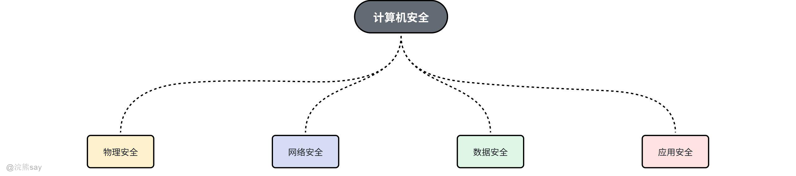
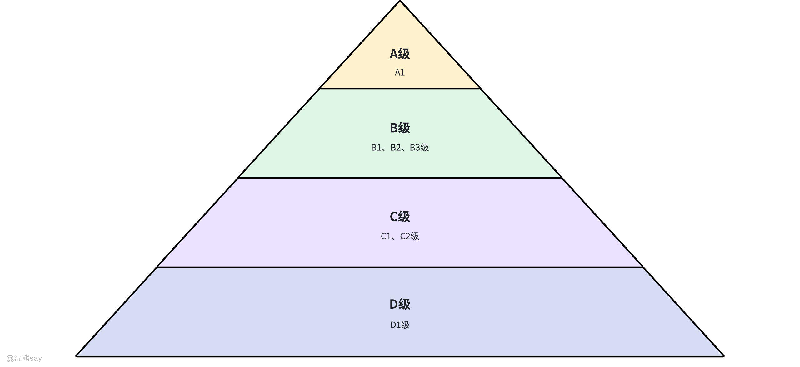
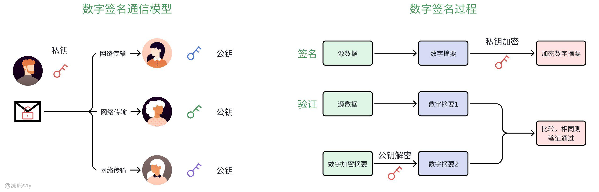

# 7、操作系统安全和保护

**Part 07：操作系统安全和保护**
| 【原创声明】大家好，我是say，是这篇文章的原创作者！985硕士毕业，应届进入某大厂后道心破碎，社招上岸多家855半垄断央企，因为自己淋过雨，希望帮大家撑把伞，帮助更多同学找到不内卷、能够好好生活的央国企，已帮助1000+同学上岸央国企，需要连联系学长的加微信：wx_hxsay |
| --- |

## 计算机安全

## 计算机安全分类

计算机安全以下四个方面：

1.  物理安全‌：物理安全又称作实体安全，主要保护计算机设备、设施（如网络及通信线路）免遭地震、水灾等环境事故的破坏。这包括防止硬件被盗或损坏1。
2.  网络安全‌：网络安全涉及网络上信息的安全，确保网络中传输和保存的数据不受破坏、更改和泄露，网络系统能够正常运行，网络服务不中断。保障网络安全的技术包括密码技术、防火墙、入侵检测技术、访问控制技术、虚拟专用网技术和认证技术等2。
3.  数据安全‌：数据安全确保数据的完整性、保密性和可用性。这包括防止未经授权的访问和数据泄露，确保数据的真实性和可靠性1。
4.  应用安全‌：应用安全保障软件应用的安全性和可靠性。这包括Web安全技术、电子邮件安全等，确保应用程序在使用过程中和结果的安全12。

## 计算机安全评价标准

在“可信任计算机系统评价标准”（TCSEC）中，计算机系统的安全程度被划分为D、C、B、A四类，共分为D、C1、C2、B1、B2、B3和A1七个等级，具体的分类等级如下：

**D 类**：

-   **D1**：最低安全类别，称为安全保护欠缺级。该类安全等级只包括一个最低安全等级 D1。

**C 类**：

-   **C1**：仅高于 D 类的安全类别，能够提供审慎的保护。
-   **C2**：亦称为受控存取控制级，是在 C1 级基础上，增加了一个个体层访问控制，加强了可调的审慎控制。

**B 类**：

-   **B1**：具有 C2 级的全部安全属性，B 类系统具有强制性保护功能，即所有的用户都必须与安全等级相关联，否则无法进行任何存取操作。
-   **B2**：具有 B1 级的全部安全属性。B2 级要求系统必须采用自上而下的结构化设计方法，并能够对设计方法进行检验，能对可能存在的隐蔽信道进行安全分析。
-   **B3**：包含 B2 级的全部安全属性。在 B3 级中必须包含有用户和组的访问控制表（ACL）、足够的安全审计和灾难恢复能力。

**A 类**：

-   **A1**：最高的安全级别，目前 A 类安全等级只包含 A1 一个安全类别。

## 数字签名

## 什么是数字签名？

数字签名是利用非对称加密算法生成的一组密钥对，用于对文档、数据或消息进行加密和解密，同时通过数字签名来验证文档、数据或消息的完整性和真实性。

其原理简单通俗来说类似于你有一把锁和很多把钥匙，你每次发送信件的时候用你的这把锁把信件锁住，然后你的钥匙分发给不同的人，只有拥有你分发钥匙的人才能打开锁查看你信件当中的内容。例子中的锁就是加密算法或者叫做私钥，发给其它人钥匙就叫做公钥。常见的数字加密算法包括：RSA Signature、DSA Signature等。

## 数字签名的三个条件

数字签名至少应满足以下三个条件：

1.  **接收者能验证签名‌**：接收者必须能够使用发送者的公钥验证签名的真实性，确保签名是由发送者生成的，并且没有被篡改
2.  **发送者不能否认签名‌**：发送者在签名后不能否认自己的签名行为。如果发生签名真伪的争执，有第三方能够解决争执，确保发送者不能否认自己的签名
3.  **接收者不能伪造签名‌：**接收者无法伪造签名，即任何其他人不能伪造签名，确保签名的唯一性和不可复制性

## 计算机病毒的特征

计算机病毒是一种恶意软件，具有以下特征：

-   **寄生性**：早期病毒覆盖在正常程序上，使程序无法运行，病毒很快会被用户发现。现在大多数病毒都采用寄生方法，附着在正常程序上，在病毒发作时原来程序仍能正常运行，用户难以及时发现。
-   **传染性**：为了给系统带来更大的危害，病毒会不断进行自我复制，以增加病毒的数量。
-   **隐蔽性**：为了避免被系统管理员和用户发现，以及逃避反病毒软件的检测，病毒设计者通过多种手段来隐藏病毒，使病毒能在系统中长期生存。
-   **破坏性**：病毒的破坏性表现在占用系统空间和处理机时间，对系统中的文件造成破坏，使机器运行发生异常情况。

## 设计安全操作系统的原则

设计安全操作系统时，需要遵循以下原则，以确保系统的安全性：

-   **微内核原则**：操作系统的核心功能尽量精简，只保留最基本的内核功能，其他功能通过模块化的方式实现。这样可以减少内核的复杂性，降低安全风险。
-   **策略和机制分离原则**：将安全策略和安全机制分开设计，策略定义安全规则，机制实现这些规则。这样可以提高系统的灵活性和可维护性。
-   **安全入口原则**：系统的所有入口点都必须经过严格的安全检查，确保只有合法的用户和进程能够访问系统资源。
-   **分离原则**：将不同的安全功能和组件分离，避免单一故障点。例如，将用户数据和系统数据分开存储，将不同的安全模块分开实现。
-   **部分硬件实现原则**：利用硬件特性来增强系统的安全性，例如，使用硬件加密模块、安全启动等技术。
-   **分层设计原则**：将系统分为多个层次，每一层只负责特定的功能，层次之间通过明确的接口进行通信。这样可以降低系统的复杂性，提高安全性和可维护性。

通过以上内容，我们可以看到，操作系统安全和保护是计算机系统中的一个重要组成部分，涉及安全等级分类、数字签名、计算机病毒特征和设计安全操作系统的原则等多个方面。理解和掌握这些概念和技术，对于设计和维护安全可靠的计算机系统具有重要意义。
