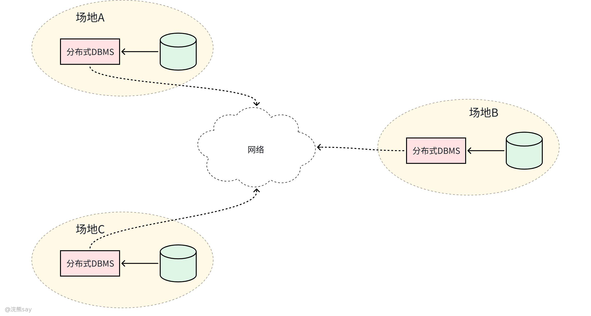
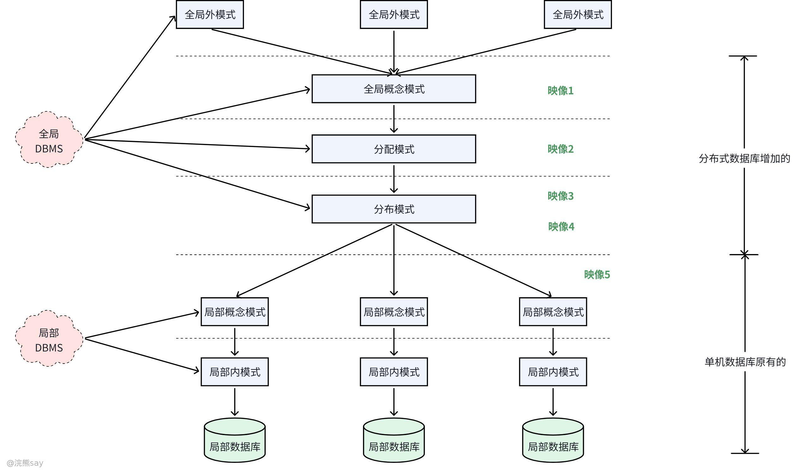
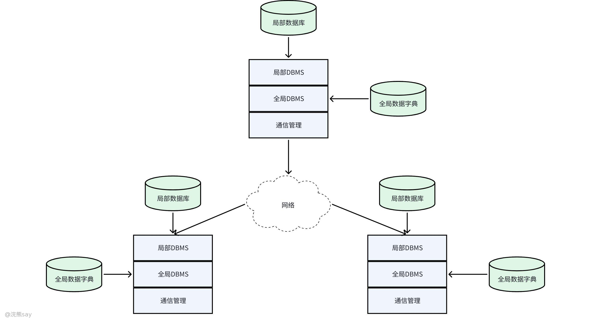
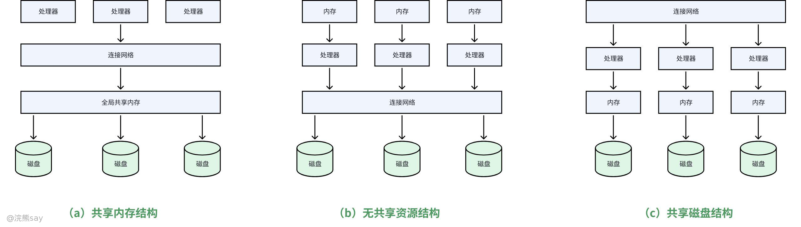

# 10、数据库新技术

**数据库新技术**

## 分布式数据库

## 分布式数据库概念

### 什么是分布式数据库？

分布式数据库是一种 “逻辑上统一、物理上分布” 的数据库系统 —— 数据被分散存储在多个独立的物理节点（计算机或服务器）上，节点通过网络连接协同工作，对外呈现为一个统一的数据库服务。其核心目标是突破集中式数据库在大数据量、高并发访问、单点故障等场景下的性能与可用性瓶颈，最终实现系统的高扩展性、高可用性和高性能，适配现代业务的规模化发展需求。

### 分布式数据库和集中式数据库对比
| 对比维度 | 集中式数据库 | 分布式数据库 |
| --- | --- | --- |
| 核心架构 | 数据集中存储在单一节点（服务器），所有操作依赖该节点。 | 数据分散存储在多个物理节点，通过网络协同形成逻辑统一系统。 |
| 数据存储 | 数据整体存于单节点，无分片或复制（除非手动配置主备）。 | 数据通过分片（水平 / 垂直）拆分到多节点，同时可能存在多副本。 |
| 扩展性 | 主要依赖 “垂直扩展”（升级服务器硬件，如 CPU、内存），上限有限。 | 支持 “水平扩展”（新增节点），理论上可无限扩展，成本更低。 |
| 可用性 | 单点故障会导致整个系统不可用，需依赖主备切换（被动容错）。 | 多副本存储，单点故障后自动切换到其他节点，可用性更高（主动容错）。 |

### 分布式数据库优缺点

分布式数据库的核心优势源于 “物理分布、逻辑统一” 的架构设计：一是扩展性强，可按需新增节点，灵活支撑数据量与访问量的爆发式增长；二是高可用性，多节点备份避免单点故障，保障业务持续运行；三是性能优化，数据就近存储降低访问延迟，多节点并行处理提升并发能力；四是成本可控，可通过普通服务器集群替代高端大型机，降低硬件投入；五是合规适配，支持数据本地化存储，满足不同地区的数据合规要求。

但其短板也同样突出：一是设计与维护复杂度高，需解决数据分片、跨节点一致性、负载均衡等技术难题，对开发与运维团队的专业能力要求高；二是受 CAP 定理约束，需在一致性、可用性、分区容错性之间权衡，弱一致性场景可能增加业务逻辑设计难度；三是网络依赖强，跨节点操作需通过网络通信，可能存在延迟、丢包等问题，影响系统性能；四是事务支持有限，跨节点分布式事务的一致性保障难度大，对金融等强事务需求场景适配性不足。

因此，分布式数据库需结合业务实际权衡使用：更适合数据量巨大、访问并发高、对可用性要求严格的大型互联网应用、企业级核心业务系统；而对于数据量小、业务逻辑简单的小规模应用，分布式架构的复杂度可能超过其价值，选择集中式数据库更具性价比。

分布式数据库的 “6 级模式、5 级映像” 是对其架构分层及层级间映射关系的核心概括，旨在明确数据的抽象层次、分布特性与转换规则，最终实现系统的数据独立性、分布透明性和全局一致性，是理解分布式数据库架构设计的关键。

## 6级模式和5级映像

### 6级模式——分布式数据库的抽象层次

分布式数据库的 “6 级模式” 是在传统集中式数据库 “外模式 - 模式 - 内模式” 三级模式基础上，针对 “数据分布” 特性扩展而来，形成从 “用户视角” 到 “物理存储” 的完整抽象链条，各层级各司其职、层层递进：

1.  **全局外模式（Global External Schema）**：对应集中式数据库的 “外模式”，是用户或应用程序感知到的全局数据视图。每个用户或应用可根据需求定义专属的全局外模式，该视图完全屏蔽了数据的物理分布细节 —— 用户无需关心数据存放在哪个节点、如何分片，仅需按逻辑统一的方式访问数据，实现 “分布透明性” 的第一层保障。
2.  **全局概念模式（Global Conceptual Schema）**：对应集中式数据库的 “模式”，是对分布式数据库中全体数据的逻辑结构与关系的整体抽象，定义了全局数据的实体、属性、关联及约束（如全局关系、全局主键约束等）。其核心特点是 “不涉及物理分布”，仅回答 “数据是什么”，不关心 “数据在哪存”，是连接用户视图与分布式存储的核心桥梁。
3.  **分片模式（Fragmentation Schema）**：专门描述全局数据的拆分规则，即如何将全局概念模式中的数据分割为若干个逻辑独立的局部数据片段（分片）。常见的分片方式包括水平分片（按行拆分，如按用户所在地区拆分用户表）、垂直分片（按列拆分，如将用户表拆分为基础信息表和详细信息表）及混合分片（水平 + 垂直结合）。该模式的核心价值是保证 “分片独立性”—— 当全局数据的分片方式发生变化（如新增分片、调整拆分规则）时，无需修改全局概念模式，仅需调整对应映射关系即可。
4.  **分配模式（Allocation Schema）**：定义每个数据分片的物理存储位置，即确定每个分片分配到分布式系统中的哪个或哪些节点。分配方式可分为集中式（所有分片存储于单一节点，退化为集中式架构）、分割式（分片分散存储于不同节点，无重复，追求存储效率）、复制式（分片在多个节点重复存储，追求高可用性与访问性能）。该模式保障 “分配独立性”—— 当分片的存储位置发生变化（如节点迁移、扩容）时，无需修改分片模式，仅需更新分配映射，实现分布透明性。
5.  **局部概念模式（Local Conceptual Schema）**：每个物理节点对应一个局部概念模式，描述该节点上存储的局部数据（即分配到该节点的分片）的逻辑结构与约束（如局部关系、局部索引、局部约束等）。它本质是集中式数据库 “模式” 在局部节点的体现，是全局数据分片在局部节点的逻辑映射，确保局部数据的独立性与完整性。
6.  **局部内模式（Local Internal Schema）**：对应集中式数据库的 “内模式”，描述单个节点上数据的物理存储细节，包括文件结构、索引类型、存储路径、数据压缩方式等，与具体的数据库管理系统（DBMS）强相关。该模式保障 “物理独立性”—— 当局部节点的物理存储方式发生变化（如更换存储介质、调整索引结构）时，无需修改局部概念模式，仅需更新对应映射即可。

### 5级映像——各模式之间的转换规则

“5 级映像” 是连接 6 级模式的核心转换机制，通过定义各层级间的映射规则，实现数据的独立性、分布透明性和全局一致性，每一层映像都承担着特定的 “隔离与适配” 功能：

1.  **全局外模式→全局概念模式映像**：定义全局外模式与全局概念模式之间的对应关系（如用户视图中的 “简化用户表” 与全局概念模式中 “完整用户表” 的字段映射）。当全局概念模式发生修改（如新增字段、调整约束）时，仅需修改该映像，无需调整全局外模式，确保用户应用不受影响，实现**逻辑独立性**。
2.  **全局概念模式→分片模式映像**：定义全局概念模式中的全局数据如何映射为分片模式中的数据分片（如全局用户表如何按地区拆分为华北、华东等分片）。当分片模式发生变化（如调整分片规则、新增分片）时，仅需更新该映像，全局概念模式保持不变，确保上层用户视图不受分片调整影响，实现**分片独立性**。
3.  **分片模式→分配模式映像**：定义每个数据分片与物理存储节点的对应关系（如 “华北用户分片” 分配到节点 A，“华东用户分片” 分配到节点 B）。当分配模式发生变化（如分片迁移至其他节点、新增节点扩容）时，仅需修改该映像，分片模式无需调整，上层应用完全感知不到数据存储位置的变化，是**分布透明性**的核心保障。
4.  **分配模式→局部概念模式映像**：定义分配到某一节点的分片如何映射为该节点的局部概念模式（如 “华北用户分片” 在节点 A 上对应的局部用户表结构）。当局部概念模式发生修改（如调整局部索引、新增局部约束）时，仅需更新该映像，分配模式保持不变，确保全局架构不受局部节点调整影响。
5.  **局部概念模式→局部内模式映像**：与集中式数据库的 “模式→内模式映像” 作用一致，定义局部数据的逻辑结构与物理存储结构的对应关系（如局部用户表与磁盘上的物理文件、索引的映射）。当局部节点的物理存储方式发生变化（如更换存储引擎、调整数据分区）时，无需修改局部概念模式，实现**物理独立性**。

6 级模式构建了分布式数据库从 “用户视角” 到 “物理存储” 的完整抽象链条，而 5 级映像则作为连接各层级的 “转换桥梁”，通过隔离不同层级的变化，既保证了系统的灵活性与可扩展性，又实现了数据的独立性与分布透明性，共同支撑起分布式数据库 “逻辑统一、物理分布” 的核心架构。

## 分片模式

分片模式是分布式数据库实现数据分布式存储的核心技术，本质是将全局关系（表）按预设规则拆分为若干逻辑独立、物理分散的数据片段（分片），通过分片实现数据的负载均衡与就近访问，提升系统扩展性。

1.  **分片方法**

-   **水平分片**：按特定条件（如地区、时间、用户 ID 范围）将全局关系的所有元组（行）划分为互不相交的子集，每个子集为一个独立分片。例如，将全国用户表按省份拆分为 “华北用户分片”“华东用户分片” 等，每个分片包含对应区域的完整用户记录，分片间无重复行数据。
-   **垂直分片**：按业务需求将全局关系的属性集（列）拆分为若干子集，对每个子集执行投影运算，形成独立的垂直分片。例如，将用户表拆分为 “用户基础信息分片”（含 ID、姓名、手机号）和 “用户详细信息分片”（含地址、生日、兴趣标签），分片间通过主键关联，确保数据完整性。
-   **混合分片**：结合水平分片与垂直分片的逻辑，可先水平后垂直，或先垂直后水平。例如，先按省份水平拆分用户表，再将每个省份的用户表按 “基础信息 + 详细信息” 进行垂直拆分，兼顾地域分布与业务字段拆分需求。
-   **导出分片（导出水平分片）**：水平分片的划分条件不依赖当前关系的属性，而是基于其他关联关系的属性。例如，根据 “订单表” 的 “下单时间” 属性，拆分 “用户表” 中对应时间段有下单行为的用户记录，形成专属分片，适用于关联查询频繁的场景。

1.  **分片准则**

-   **完备性条件**：全局关系的所有数据必须完整映射到至少一个分片，不允许存在 “属于全局关系但不属于任何分片” 的数据，避免数据丢失。
-   **可重构条件**：所有分片必须能够通过特定运算重建原始全局关系 —— 水平分片可通过 “并操作” 合并所有行数据，垂直分片可通过 “连接操作”（基于主键）整合所有列数据，确保分片不破坏数据的全局逻辑结构。
-   **不相交条件**：同一全局关系的不同分片（除垂直分片的主键外）必须互不重叠，即同一数据记录不能同时存在于多个分片，避免数据冗余与更新冲突。

## 分配模式

分配模式是在分片模式的基础上，定义各数据分片在分布式系统中物理存储位置的策略，核心目标是平衡存储负载、优化访问性能、提升系统可用性，主要分为四种类型：

1.  **集中式分配**：所有数据分片统一存储在同一个物理场地（节点）。其优势是数据控制与管理简单，无需处理跨节点一致性问题，数据一致性易保障；但劣势显著 —— 单个节点存储与访问压力集中，存在单点故障风险，节点故障会导致整个系统不可用，本质上未发挥分布式架构的优势。
2.  **分割式分配**：所有数据仅保留一份，按分片逻辑分散存储在不同物理场地，每个分片仅分配给一个节点。其优势是充分利用多节点的存储资源，存储容量可随节点扩容线性提升，单个节点故障仅影响该节点上的分片，系统整体仍可运行；劣势是跨节点查询与修改需通过网络通信，数据传输耗时较长，影响操作效率。
3.  **全复制式分配**：每个数据分片在所有物理场地均保留完整副本，即每个节点都存储全局数据的完整备份。其优势是可靠性极高，单点或多个节点故障不影响数据访问，查询响应速度快（可就近读取本地副本），数据库恢复简单；但劣势是数据同步成本高昂，任何节点的修改需实时同步至所有节点，增加网络带宽与存储开销，且同步延迟可能导致短期数据不一致。
4.  **混合式分配**：介于分割式与全复制式之间的折中方案，根据分片的重要性与访问频率灵活分配 —— 核心分片（如高频查询的业务表）采用全复制式分配，提升可用性；非核心分片（如历史归档数据）采用分割式分配，节省资源。该模式兼顾可用性与资源效率，是实际应用中最常用的分配策略。

## 分布式查询

分布式查询的核心挑战是跨节点数据传输带来的性能损耗，因此查询处理的核心目标是最小化数据传输量、优化执行效率，具体包括传输代价分析与连接查询优化两大核心内容：

### 查询处理的传输代价

查询执行开销是衡量分布式查询性能的关键指标，与集中式数据库存在显著差异：

-   集中式数据库的查询开销主要由 I/O 代价（磁盘读写）与 CPU 代价（数据计算）构成；
-   分布式数据库的查询开销需额外增加通信代价（跨节点数据传输），且通信代价通常是影响查询效率的主要因素 —— 网络延迟、带宽限制会导致大量数据传输耗时远超本地计算耗时。

因此，分布式查询优化的核心逻辑是 “减少跨节点数据传输量”，通过合理的分片设计、查询路由、数据过滤，降低通信开销，提升查询响应速度。

### 连接查询的优化策略

连接查询是分布式数据库中最常见的复杂查询（如关联多个节点的分片表），优化的核心是通过策略调整缩减需传输的数据量，主要分为两种核心方案：

1.  **半连接优化策略**：先对参与连接的关系（或分片）进行过滤，仅传输连接所需的关键属性（如主键、外键），在目标节点完成连接后，再按需获取其他属性数据。例如，节点 A 的 “用户分片” 与节点 B 的 “订单分片” 连接时，先传输用户 ID 与订单关联的用户 ID，完成连接后仅返回匹配的完整记录，大幅减少传输数据量。
2.  **直接连接优化策略**：通过优化数据传输顺序与节点选择，减少连接过程中的数据冗余传输。例如，将小体量的分片传输至大体量分片所在节点，避免大量数据跨节点传输；或选择网络带宽充足、负载较低的节点作为连接执行节点，提升连接效率。

两种策略的核心目标均是降低通信代价，实际应用中需根据分片数据量、网络状况、查询频率灵活选择，平衡传输效率与计算开销。

## 分布式数据库管理系统

分布式数据库管理系统（DBMS）是支撑分布式数据库运行的核心软件，负责协调多个物理节点的数据库资源，对外提供统一、透明的数据库服务，其核心价值是屏蔽分布式环境的复杂性，实现数据的分布式管理与协同访问。

### DBMS主要功能

1.  请求路由与解析：接收用户或应用的全局数据请求，通过解析请求内容与数据分布信息，判定请求需访问的物理节点，或协调多个节点协同响应；
2.  数据字典管理：访问并维护全局网络数据字典，存储数据分片规则、节点分布、副本信息等元数据，为请求路由、数据访问提供决策依据；
3.  分布式处理协调：当目标数据分散在多个节点时，协调各节点执行局部操作，整合处理结果，确保全局请求的正确响应；
4.  跨节点通信接口：提供标准化通信接口，实现用户、局部 DBMS 与其他节点 DBMS 之间的信息交互与数据传输，屏蔽不同节点的通信协议差异；
5.  异构环境适配：在异构分布式环境（如不同厂商 DBMS、不同操作系统）中，提供数据格式转换、进程移植等支持，保障跨平台协同的兼容性。

### 系统组成

DDBMS 由四大核心子系统构成，各子系统分工协作，保障分布式数据库的稳定运行：

1.  查询子系统：负责全局查询的解析、优化与分解，将全局查询转换为多个节点的局部查询，同时优化查询执行计划，减少跨节点数据传输量；
2.  完整性子系统：维护全局数据的一致性约束（如主键唯一、外键关联），监控各节点的数据修改操作，避免因分布式存储导致的数据不一致；
3.  调度子系统：协调各节点的资源分配与任务执行，处理并发访问冲突（如跨节点锁竞争），确保分布式事务的原子性与隔离性；
4.  可靠性子系统：负责故障检测、节点容错与数据恢复，当某节点故障时，自动切换至备用节点或副本，保障系统可用性与数据安全性。

### 存在的问题

1.  通信速度不匹配：网络通信速度远低于局部 DBMS 的存储部件存取速度，导致跨节点数据传输成为性能短板；
2.  高存取延迟：通信系统存在天然的传输延迟，尤其在跨地域分布式架构中，延迟会显著影响查询响应速度；
3.  通信处理代价高：CPU 需消耗大量资源处理跨节点数据传输、协议解析等操作，增加系统整体开销；
4.  异构通信兼容性差：不同通信系统的字符编码、数据格式存在差异，转换效率可能相差千倍，存取延迟甚至相差百万倍，导致同一设计方案在不同环境中适配性差异极大。

### 客户/服务器结构的分布式 DBS

1.  架构组成：包含多个数据库服务器（节点）与多个客户机，服务器间可协调工作，共同为客户机提供服务；
2.  功能分布：DBMS 软件分为客户级与服务器级两级 —— 客户级负责处理全局查询，将其分解为各节点的局部查询，并向服务器发送应用请求；服务器级负责执行本地局部查询，完成事务处理、数据访问控制与资源管理，再将结果返回给客户机；
3.  核心优势：功能分层减轻了服务器端的计算与通信负担，使其能集中资源处理事务与数据访问，支持更多并发用户，同时提升系统整体响应速度与扩展性。

## 分布式事务一致性协议——两阶段提交协议

### 2PC协议

两阶段提交协议（Two-Phase Commit，2PC）是分布式事务领域最经典的强一致性协议，核心目标是解决多节点参与的分布式事务原子性问题 —— 确保所有参与节点的操作 “要么全部提交，要么全部回滚”，避免出现 “部分提交、部分未提交” 的数据不一致状态（如跨银行转账时 A 账户扣款成功但 B 账户未到账），是分布式环境下保障数据强一致性的核心算法。2PC 通过 “协调者 - 参与者” 的二元架构实现分布式决策，角色分工明确：

1.  协调者（Coordinator）：全局事务的统筹节点，可为事务发起方或专门的中心协调节点，唯一掌握事务最终决策权限（提交 / 回滚）。核心职责包括：发起协议流程、向所有参与者发送指令、收集反馈结果、下达最终执行指令，同时记录全局事务日志，用于故障后的恢复；
2.  事务参与者（Participants）：参与分布式事务的每个本地节点（如数据库实例），负责执行本地事务操作（增删改），并反馈自身是否具备提交条件。核心职责是严格遵循协调者指令：收到 “准备提交” 指令后执行本地操作并进入 “就绪状态”（暂不最终提交），收到 “提交” 指令后确认本地事务，收到 “回滚” 指令后撤销已执行操作。

### 2PC算法流程详解（以跨银行转账为例）

假设场景：A 银行节点（参与者 1）向 B 银行节点（参与者 2）转账 100 元，协调者为转账发起方的中心系统，2PC 流程分为 “表决阶段” 与 “执行阶段” 两步：

 Phase）—— 确认 “是否可提交”

-   协调者行动：在本地日志中记录 “全局事务准备开始”，向所有参与者（A 银行、B 银行）发送 “准备提交”（Prepare）消息，等待所有参与者反馈；
-   参与者行动：

1.  A 银行收到消息后，执行本地事务（扣除 A 账户 100 元），不最终提交，仅记录 “准备提交” 日志，进入 “就绪状态”（资源锁定，可随时提交或回滚），回复协调者 “可以提交”（Yes）；
2.  B 银行收到消息后，执行本地事务（增加 B 账户 100 元），同样暂不提交，记录日志并回复 “可以提交”（Yes）；
3.  若任一参与者执行失败（如 B 银行账户状态异常、网络中断），则记录 “准备回滚” 日志，回复协调者 “不可提交”（No），或因超时未反馈被协调者判定为 “不可提交”；

-   协调者决策：若所有参与者均回复 “Yes”，则判定 “全局可提交”；若任一参与者回复 “No” 或超时未反馈，则判定 “全局需回滚”。

 Phase）—— 执行 “最终决策”

 1：全局提交

-   协调者向所有参与者发送 “提交”（Commit）指令，在本地日志中记录 “全局提交”；
-   参与者收到指令后，正式提交本地事务（A 银行确认扣款，B 银行确认到账），释放锁定资源，记录 “事务提交完成” 日志，回复协调者 “确认提交”（Ack）；
-   协调者收到所有参与者的 Ack 后，记录 “全局事务结束”，整个事务完成。

 2：全局回滚

-   协调者向所有参与者发送 “回滚”（Rollback）指令，在本地日志中记录 “全局回滚”；
-   参与者收到指令后，撤销本地事务（A 银行恢复 100 元，B 银行取消到账），释放资源，记录 “事务回滚完成” 日志，回复协调者 “确认回滚”（Ack）；
-   协调者收到所有 Ack 后，记录 “全局事务结束”，事务终止。

## 真题
| 【农业银行2018】根据我国制定的《分布式数据库系统标准》，分布式数据库系统抽象为四层的结构模式，以下层次错误的是？A. 全局概念层B. 局部概念层C. 全局内层D. 全局外层答案 ：C解析 ：根据我国制定的《分布式数据库系统标准》，分布式数据库系统抽象为 4 层的结构模式。这种结构模式得到了国内外的支持和认同。4 层模式划分为全局外层、全局概念层、局部概念层和局部内层，在各层间还有相应的层间映射。这种 4 层模式适用于同构型分布式数据库系统，也适用于异构型分布式数据库系统。并未提及全局内层，故选 C。 |
| --- |

| 【国家电网2018】数据管理技术的发展是与计算机技术及其应用的发展联系在一起的，经历了由低级到高级的发展。分布式数据库、面向对象数据库等新型数据库属于哪一个发展阶段？A. 人工管理阶段B. 文件系统阶段C. 数据库系统阶段D. 高级数据库技术阶段答案 ：D解析 ：高级数据库技术阶段大约从 20 世纪 70 年代后期开始。在这一阶段中，计算机技术获得了更快的发展，并更加广泛地与其他学科技术相互结合、相互渗透，在数据库领域中诞生了很多高新技术，并产生了许多新型数据库，如分布式数据库和面向对象的数据库。 |
| --- |

## 并行数据库

并行数据库是基于多处理器架构设计的数据库系统，核心目标是通过充分利用多处理器的并行计算能力，突破单处理器的性能瓶颈，在高并发事务处理与复杂决策支持场景中，实现高性能、高可用性与高扩充性的统一。

## 多处理机结构的发展背景

计算机体系结构的核心发展趋势之一是从单处理器向多处理器过渡，背后逻辑清晰：一方面，单处理器的性能提升受物理极限约束（如芯片制程、功耗限制），继续优化的技术难度与成本极高；另一方面，多处理器架构可通过廉价的普通处理器集群替代高端单处理器，以分布式计算能力实现整体性能的线性提升，成为兼顾成本与性能的最优解。

## 并行数据库的核心特点

并行数据库以 “三高” 为核心指标，精准适配多处理器平台的能力：通过挖掘多种维度的并行性，在联机事务处理（OLTP，如高频小额交易）与决策支持（OLAP，如复杂数据分析）两种典型应用场景中，同时优化响应时间（减少单个请求的处理耗时）与事务吞吐量（提升单位时间内处理的请求数量），实现高效的并行数据处理。

## 并行计算机的体系结构类型

并行计算机的体系结构按资源共享方式可分为三类，核心差异在于 CPU、内存与磁盘的共享逻辑：

1.  紧耦合全对称多处理器（SMP）系统：所有 CPU 共享同一内存与磁盘存储，处理器地位平等，可随时获取共享资源；
2.  松耦合集群机系统：所有 CPU 通过网络连接，共享磁盘存储资源，但各自拥有独立内存，避免内存访问冲突；
3.  大规模并行处理（MPP）系统：每个 CPU 均配备专属的内存与磁盘，无全局共享资源，节点间通过高速网络通信协同工作。

## 并行数据库系统的体系结构

并行数据库系统的体系结构与并行计算机架构对应，核心分为三类，各有优劣：

1.  共享内存结构：所有处理器共享同一内存与磁盘，实现难度低，处理器负载易平衡；但存在明显瓶颈 —— 内存与磁盘的访问竞争会随着处理器数量增加而加剧，可伸缩性差，且单一内存或磁盘故障可能导致整个系统不可用，可用性不足；
2.  共享磁盘结构：处理器拥有独立内存，仅共享磁盘存储，消除了内存访问瓶颈；但磁盘仍为共享资源，易出现访问冲突，且分布式缓存的一致性维护成为新瓶颈，整体可扩充性有限；
3.  无共享资源结构：处理器、内存、磁盘均为节点专属，无任何全局共享资源，虽在设计上难以实现负载均衡，但彻底避免了资源竞争瓶颈，具备极佳的可伸缩性，处理器数量可按需扩充。

## 四种不同粒度的并行性

并行数据库采用多线程、多线索的架构设计，支持从粗到细四种粒度的并行性，覆盖不同层次的计算需求：

1.  不同用户事务间的并行性：多个用户的独立事务同时执行，是最粗粒度的并行，核心提升系统的并发处理能力；
2.  同一事务内不同查询间的并行性：单个事务包含的多个独立查询并行执行，缩短事务整体处理时间；
3.  同一查询内不同操作间的并行性：又称垂直并行或流水线并行，将单个查询的执行流程拆分为多个连续操作（如过滤、排序、连接），不同操作并行推进，类似流水线作业；
4.  同一操作内的并行性：又称水平并行或划分并行，将单个操作（如全表扫描、批量插入）的数据按预设规则拆分，多个处理器同时处理不同数据分片，最大化利用并行计算能力。

## 真题
| 【国家电网 2018】数据管理技术的发展是与计算机技术及其应用的发展联系在一起的，经历了由低级到高级的发展。分布式数据库、面向对象数据库等新型数据库属于哪一个发展阶段？A. 人工管理阶段B. 文件系统阶段C. 数据库系统阶段D. 高级数据库技术阶段答案 ：D解析 ：高级数据库技术阶段大约从 20 世纪 70 年代后期开始。在这一阶段中，计算机技术获得了更快的发展，并更加广泛地与其他学科技术相互结合、相互渗透，在数据库领域中诞生了很多高新技术，并产生了许多新型数据库，如分布式数据库和面向对象的数据库。 |
| --- |
