# 2、关系型数据库基本理论

**关系型数据库基本理论**

## 关系型数据库概念

关系型数据库是基于关系模型的数据库管理系统，以表格形式组织和存储数据，通过表与表之间的关联关系实现数据的高效查询与管理。其核心是由埃德加・科德（Edgar F. Codd）于 1970 年提出的关系模型，将数据抽象为二维表格（关系表），表格由行（记录 / 元组）和列（字段 / 属性）构成，例如学生表包含 “学号”“姓名”“年龄” 等列，每行对应一条完整的学生信息。

## 关系数据库核心概念

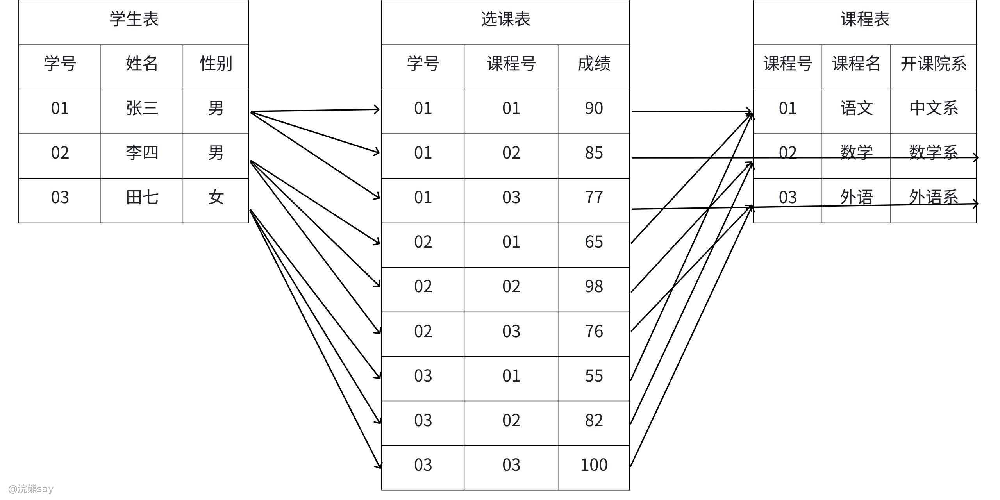

1.  **表（Table）**：数据存储的基本单位，类似 Excel 表格结构，由列和行组成，例如 “学生表”“课程表”“成绩表” 等，每张表对应一类实体数据。
2.  **列（Column）与行（Row）**：列定义数据的属性，每个列有固定数据类型（如整数、字符串、日期等），例如 “学号” 列为整数类型、“姓名” 列为字符串类型；行又称 “记录”，代表一条完整的数据实例，由各列的具体值组成，例如 “学号 = 1001，姓名 = 张三，年龄 = 20”。
3.  **键（Key）**：用于标识数据唯一性或建立表间关系的核心元素，主要包括：

-   主键（Primary Key）：唯一标识表中每一行的列或列组合，不允许为空且值唯一，每个表必须有一个主键（未显式定义时，数据库可能自动生成隐藏主键如自增 ID），且主键值确定后不建议修改，例如学生表的 “学号”、成绩表的 “学号 + 课程号”（组合主键）。
-   外键（Foreign Key）：用于建立表间关联的列，其值必须对应另一张表的主键或候选键值，外键所在表为 “子表”，被引用表为 “父表”，通过外键约束确保子表与父表数据的一致性，例如成绩表的 “学号” 关联学生表的 “学号”。

1.  **关系（Relationship）**：通过外键建立的表间关联，主要分为三种类型：

-   一对一（1:1）：如 “学生” 与 “身份证” 表，一个学生对应唯一身份证记录；
-   一对多（1:N）：如 “部门” 与 “员工” 表，一个部门可对应多个员工；
-   多对多（M:N）：如 “学生” 与 “课程” 表，需通过中间表（如 “成绩表”）实现关联。

## 码

### 码的定义与作用

在关系型数据库中，“码”是用于标识和关联数据的关键概念，它通过定义数据间的唯一性和关联性，确保数据库的完整性和查询效率。一个或多个列的组合，核心作用包括：确保数据的唯一性和完整性（避免重复记录）、建立表间关联关系、加速数据查询（如通过主键索引快速定位记录），是保障数据库规范与效率的关键机制。

### 码的主要类型及详解

1.  **主键（Primary Key）**：作为表中数据的唯一标识，是从候选键中选定的核心键，具有非空、唯一的特性，是数据库实体完整性的核心保障。
2.  **候选键（Candidate Key）**：除主键外，能唯一标识表中每行数据的列或列组合，不允许包含空值，一个表可能有多个候选键，例如学生表中 “学号” 和 “身份证号”（假设唯一）均可作为候选键。
3.  **外键（Foreign Key）**：连接子表与父表的关键，通过引用父表的主键或候选键，确保表间数据的一致性，支持级联操作（如删除父表记录时同步处理子表相关数据）。
4.  **超键（Super Key）**：包含候选键的列组合，虽能唯一标识数据，但可能包含冗余列，例如学生表中 “学号 + 姓名”“学号 + 年龄 + 性别” 均为超键，实际应用中较少直接使用。
5.  **复合键（Composite Key）**：由多个列组合而成的键（可作为主键或外键），单个列无法唯一标识数据，组合列的值共同保证唯一性，且所有列均不可为空，例如选课表的 “学生 ID + 课程 ID”、订单明细表的 “订单 ID + 商品 ID”。

### 码的约束与完整性

1.  **实体完整性**：由主键和候选键保障，确保表中无重复记录，且主键列不为空，例如学生表中不允许存在相同学号，且学号列必须有值。
2.  **参照完整性**：由外键保障，确保子表的外键值在父表中存在，例如成绩表中的 “学号” 必须对应学生表中已存在的学号，否则插入或更新操作会失败。
3.  **用户定义完整性**：用户自定义的约束规则（如唯一约束、检查约束），辅助码实现数据规范，例如为 “邮箱” 列添加唯一约束，使其成为候选键。

码是关系型数据库的核心机制，通过主键、外键等类型定义数据唯一性和关联性，确保数据库的完整性和查询效率，是数据库设计中必须深入理解的基础概念。

## 浣熊真题
| 【国家电网2021】下列关于关系模型中键（码）的描述正确的是（）A. 由一个或多个属性组成，其值能够惟一标识关系中一个元组B. 至多由一个属性组成C. 可以由关系中任意个属性组成D. 关系中可以不存在键答案 ：A解析 ：关系模型中的键（码）是由一个或多个属性组成，其值能够唯一标识关系中一个元组。 |
| --- |

| 【国家电网2021】关系中的某个属性不是该关系的主码或只是主码的一部分，但却是另一个关系的主码时，称该属性为()A. 元组 B. 主属性 C. 外码 D. 参照关系答案 ：C解析 ：外码是指关系中的某个属性不是该关系的主码或只是主码的一部分，但却是另一个关系的主码。 |
| --- |

| 【中国铁塔2021】现有一个关系:借阅(书号、书名，库存数，读者号，借期，还期)，假如同一本书允许一个读者多次借阅，但不能同时对一种书借多本。则该关系模式的码是（）？A. 书号 B. 读者号 C. 书号+读者号 D.书名答案 ：C解析 ：根据题目条件，同一本书允许一个读者多次借阅，但不能同时对一种书借多本，因此需要书号和读者号组合才能唯一标识一次借阅记录 |
| --- |

| 【国家电网2022】在关系中，下列说法错误的是()A. 元组的顺序很重要B. 属性名可以重名C. 任意两个元组不允许重复D. 每个元组的一个属性可以由多个值组成答案 ：ABD解析 ：关系的性质包括：元组顺序无关（A 错误）、属性名唯一（B 错误）、元组不重复（C 正确）、属性是单值（D 错误） |
| --- |

## 关系代数

关系代数是基于集合论的形式化查询语言，通过一系列严谨的数学运算对关系（表）进行处理，是 SQL 语言的理论基础，其运算逻辑直接指导数据库查询的本质与优化，也是数据库设计、查询优化及数据分析的核心理论支撑。

## 基本概念

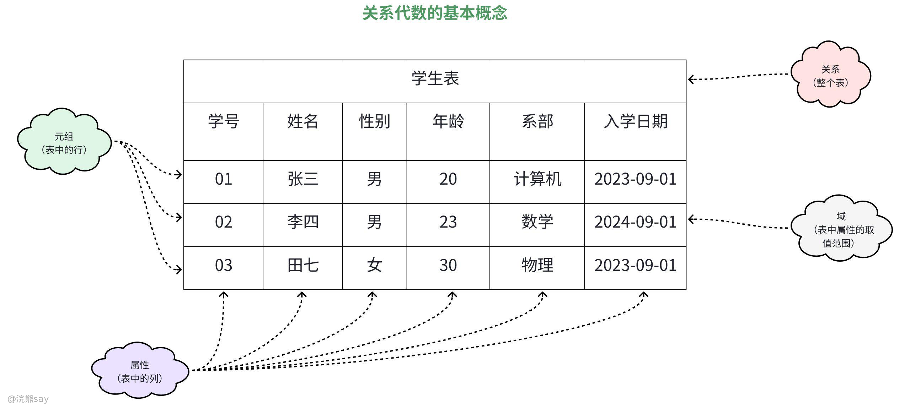

关系代数的核心概念源于关系模型，除基础定义外，需明确关系的核心特性，确保数据操作的规范性：​

1.  **关系（Relation）**：即二维表，由行（元组）和列（属性）组成，如学生表（Students）、课程表（Courses）。核心特性：①原子性（属性值不可再分，如 “地址” 不能拆分为 “省 + 市” 存储）；②无重复元组（每行唯一）；③元组无序（行的排列顺序不影响数据意义）；④属性无序（列的排列顺序不影响数据意义）。
2.  **属性（Attribute）**：表中的列，定义数据的类别与数据类型，如 “学号”（INT）、“姓名”（VARCHAR）、“年龄”（Age），每个属性对应一个域。
3.  **元组（Tuple）**：表中的行，代表一条完整的数据实例。示例：学生表中的元组（1001，张三，20，男，计算机系）。
4.  **域（Domain）**：属性的取值范围，需符合数据类型约束。示例：“性别” 的域为 {男，女}；“成绩” 的域为 \[0，100\]；“日期” 的域为合法的日期格式（如‘YYYY-MM-DD’）。

## 关系代数的运算分类

关系代数运算分为**基本运算**（6 种，不可再分，是所有复杂运算的基础）和**组合运算**（由基本运算推导而来，适配复杂业务场景），所有运算均遵循 “输入为关系，输出为新关系” 的封闭性规则，确保运算结果仍可参与后续运算。

### 选择（Selection，σ）

选择运算是从关系中筛选满足**指定条件**的元组，仅保留行，不改变列结构。条件支持比较运算（>、≠、≥、≤）、逻辑运算（AND、OR、NOT）及范围运算（BETWEEN...AND...、IN），用符号σ\_条件(关系)来表示。

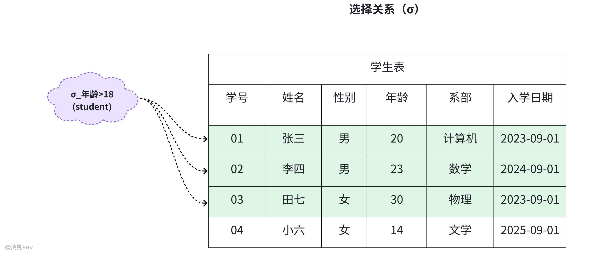

如上图所示，从学生表（如下）中筛选年龄 > 18 岁的学生，表达式为σ\_年龄>18(Students)，使用SQL的表达式为：
| Javaselect * from student where age > 18; |
| --- |

上面这个语句会将学生表中，所有年龄大于18的元组给筛选出来，即表中标记绿色的元组。

### 投影（Projection，π）

投影运算是指从关系中选取**指定属性列**，自动去除重复元组，生成列数减少的新关系，若未指定属性顺序，默认按原表列顺序排列。用符号可以表示为π\_属性1,属性2,...(关系)

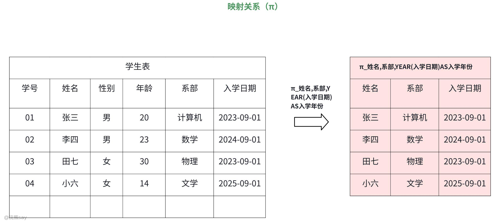

例如：学生表中查询 “姓名 + 系部 + 入学年份”，表达式为π\_姓名,系部,YEAR(入学日期)AS入学年份(Students)（支持属性派生），使用SQL表示式如下所示：
| JavaSELECT DISTINCT 姓名, 系部, YEAR(入学日期) AS 入学年份 FROM Students; |
| --- |

### 并（Union，∪）

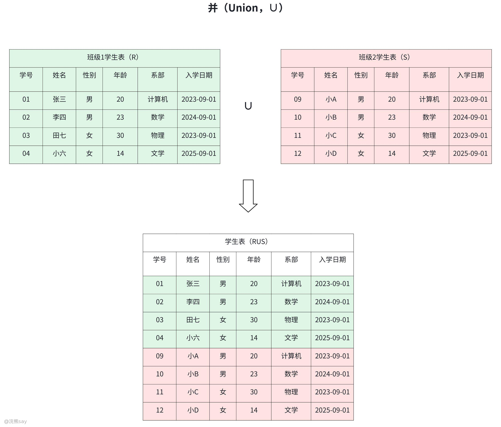

并运算是指合并两个**结构完全相同**（属性数相同、对应属性域一致、数据类型匹配，属性名可不同但语义一致）的关系，返回去重后的元组集合。用符号可以表示为关系1 ∪ 关系2，例如：合并 “班级 1 学生”（R）和 “班级 2 学生”（S），两表结构均为 “学号、姓名、年龄、系部”。对应的SQL语句为：
| JavaSELECT 学号,姓名,年龄,系部 FROM 班级1学生 UNION SELECT 学号,姓名,年龄,系部 FROM 班级2学生; |
| --- |

### 差（Difference，−）

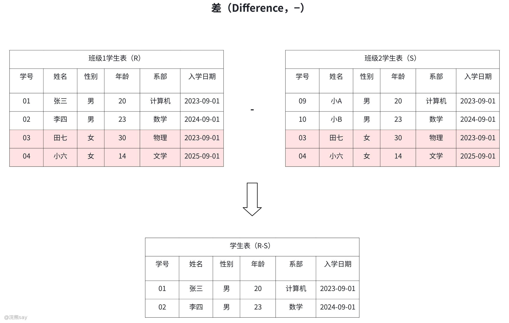

差运算是指从关系 1（R）中剔除同时存在于关系 2（S）中的元组，仅保留 R 独有的元组，要求 R 和 S 结构完全相同（属性数、域、数据类型一致），用符号可以表示为R − S。

### 交（Intersection，∩）

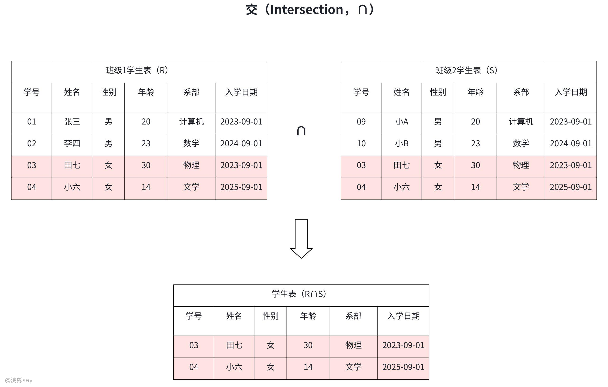

交运算是指给定两个结构相同的关系 R 和 S，它们的交（Intersection）返回同时存在于 R 和 S 中的元组，记作R ∩ S，R 和 S 必须具有相同的属性集（列数相同且对应属性域一致）。其等价表达为R ∩ S = R − (R − S) 或 R ∩ S = S − (S − R)（通过差运算实现）。

### 笛卡尔积（Cartesian Product，×）

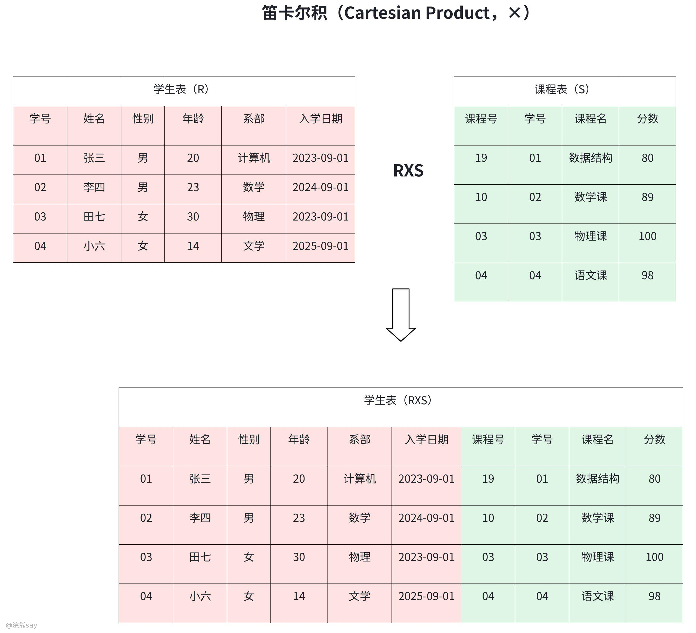

笛卡尔积是指将两个关系（R、S）的所有元组交叉组合，新关系的属性数为 R 和 S 的属性数之和，行数为 R 行数 ×S 行数，若 R 有 m 行、S 有 n 行，结果为 m×n 行。笛卡尔积的符号表示为R × S，对应的SQL操作是：
| SQLSELECT * FROM 学生表, 课程表;（隐式交叉连接） |
| --- |

需要注意的是，笛卡尔积通常需结合选择或连接运算使用，避免结果集过大。

### 连接（Join）

连接是关系型数据库中组合多表数据的核心操作，核心是基于列值匹配关联不同表的行，主要分为自然连接、内连接和外连接三类，其核心差异在于匹配规则和结果集范围。

#### 自然连接

在数据库操作里，自然连接（Natural Join）是一种用于组合两个或多个表的操作，它会基于表中相同名称的列来创建关联。自然连接会自动识别所有名称相同的列，然后返回这些列的值完全一致的行所构成的结果集。

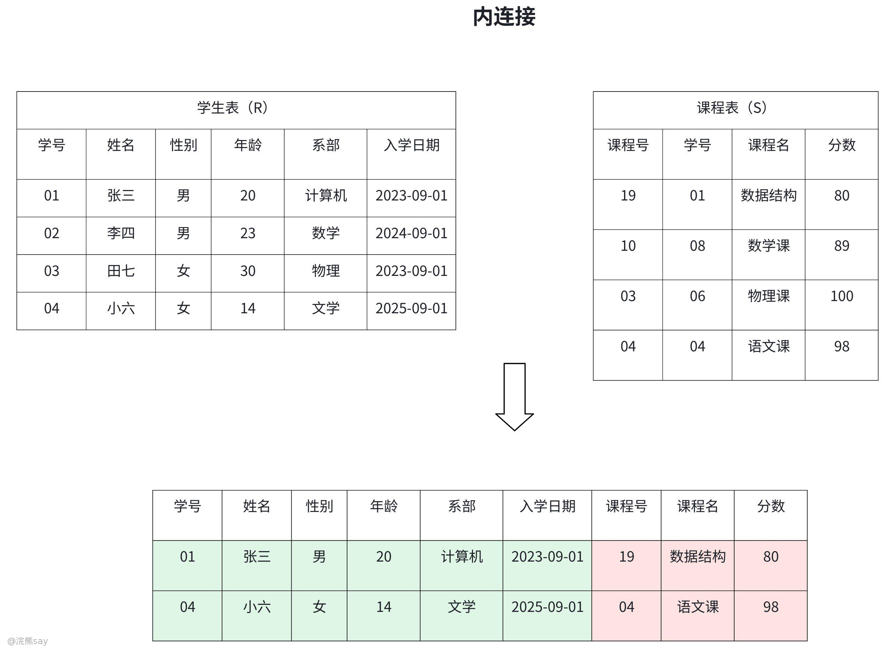

自然连接会依据所有同名的列来进行连接操作，这意味着只有当两个表中所有同名列的值都相等时，对应的行才会被包含在结果集中，在结果表里，同名的列只会出现一次，在 SQL 中使用自然连接的基本语法如下：
| SQLSELECT * FROM 学生表 NATURAL JOIN 课程表; |
| --- |

上面的SQL会自动匹配两表的同名列（如学号），返回列值一致的学生 - 课程表的关联数据，如上表所示，在课程表和学生表中，学号一致的行会被筛选出来，放在一起。

#### 内连接、外连接

##### 内连接

内连接（INNER JOIN）是关系型数据库中最常用的连接类型，用于根据指定条件组合两个或多个表中的行。它通过匹配不同表之间的列值来创建结果集，只返回满足连接条件的行。**内连接和自然连接区别之处在于内连接可以自定义两张表的不同列字段。**

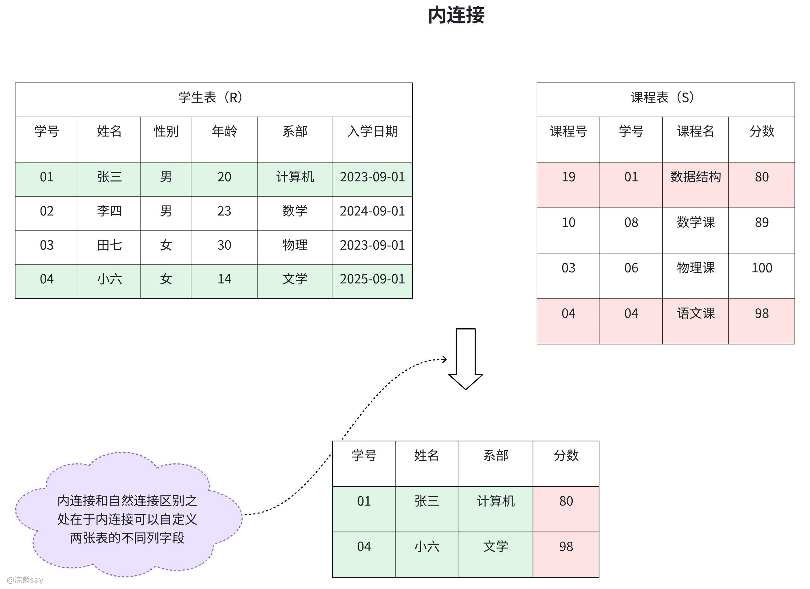

内连接基于用户指定的条件（通常使用 ON 子句）将多个表连接起来。只有当两个表中的列值满足条件时，对应的行才会被包含在结果集中。与自然连接不同，内连接不会自动匹配同名列，而是需要显式指定连接条件。内连接的标准语法如下：
| SQLSELECT 学号，姓名，课程，分数FROM 学生表INNER JOIN 课程表ON 学生表.学号 = 课程表.学号; |
| --- |

-   **INNER JOIN**：指定连接类型，可简写为 JOIN。
-   **ON子句** ：定义连接条件，用于匹配两个表中的列。

##### 外连接（Outer Join）

外连接突破了 “仅返回匹配行” 的限制，会优先保留某一个（或两个）表的全部记录，另一表无匹配项时，对应字段以NULL填充，适用于 “需保留主表全部数据，同时关联副表匹配数据” 的场景，分为左外连接、右外连接、全外连接三类：

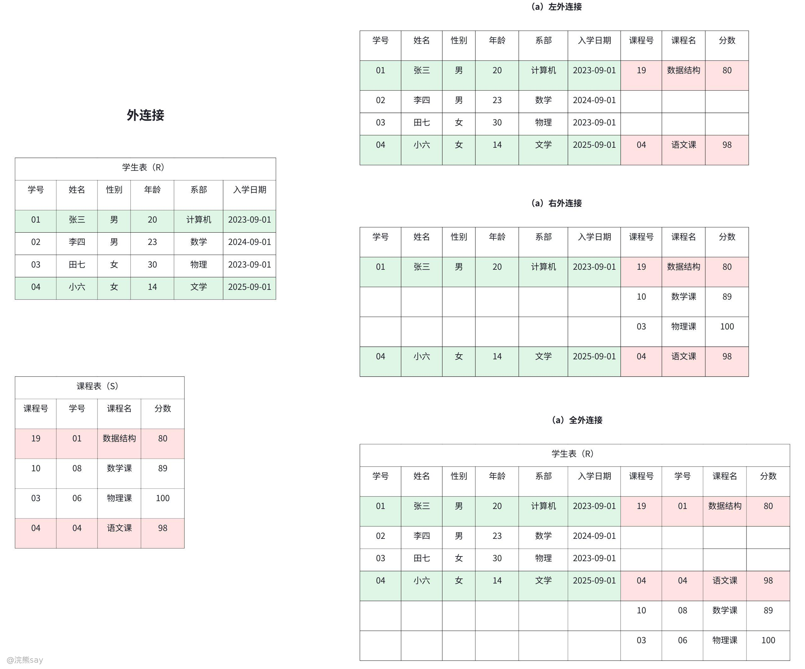

**左外连接（Left Join）**：返回左表的所有记录，以及右表中匹配的记录。
| SQLSELECT *FROM 学生表LEFT JOIN 学号ON 学生表.学号= 课程表.学号; |
| --- |

**右外连接（Right Join）**：返回右表的所有记录，以及左表中匹配的记录。
| SQLSELECT *FROM 学生表RIGHT JOIN 学号ON 学生表.学号= 课程表.学号; |
| --- |

**全外连接（Full Join）**：返回两个表中的所有记录，无论是否有匹配项。
| SQLSELECT *FROM 学生表FULL JOIN 学号ON 学生表.学号= 课程表.学号; |
| --- |

### 除运算（Division，÷）

除运算是解决 “全部满足” 类查询问题的核心运算，例如 “查询选修了所有课程的学生”。设关系 R（如学生选课表，含学号、课程号）、关系 S（如所有课程表，含课程号），则R ÷ S表示 “选修了 S 中所有课程的学生学号”。

SQL 语法中无直接对应 “除运算” 的关键字，需通过双层 NOT EXISTS 子查询实现，其核心逻辑是 “反向验证：不存在‘该学生未选修的课程’”：
| SQLSELECT 学号 FROM 选课表 RWHERE NOT EXISTS (SELECT 课程号 FROM 课程表 SWHERE NOT EXISTS (SELECT * FROM 选课表 R2WHERE R2.学号=R.学号 AND R2.课程号=S.课程号)); |
| --- |

关系代数通过严谨的数学运算定义了关系型数据库的操作逻辑，是SQL语言的理论根基。掌握其核心运算（如选择、投影、连接）有助于理解数据库查询的本质，进而优化SQL语句和数据库设计。在实际应用中，关系代数的运算思想被数据库引擎用于查询优化，确保复杂查询的高效执行。

### 关系代数常见符号

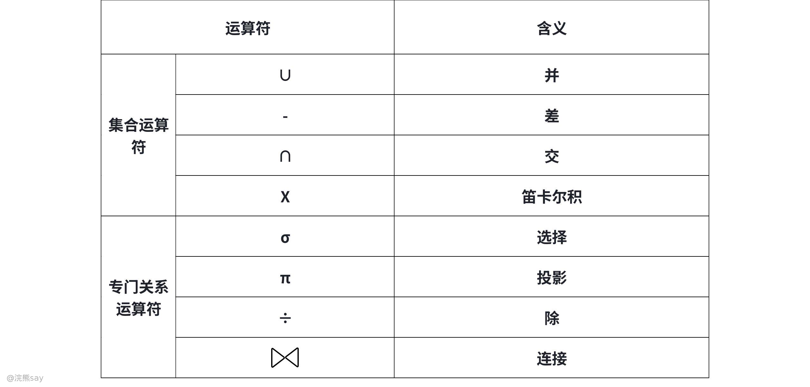

1.  **∪（并）**：合并两个结构相同的关系，且自动去重，结果包含所有在任一关系中的行。
2.  **\-（差）**：返回存在于第一个关系但不存在于第二个关系中的行。
3.  **∩（交）**：返回同时存在于两个关系中的行。
4.  **×（笛卡尔积）**：将两个关系的所有行进行两两组合，结果行数是两表行数的乘积，列数是两表列数之和。
5.  **σ（选择）**：从关系中筛选出满足条件的行，相当于 SQL 中的WHERE子句。
6.  **π（投影）**：从关系中选取指定的列，并自动去重，相当于 SQL 中的SELECT指定字段。
7.  **⋈（连接）**：基于列值匹配，将两个关系的行组合起来，包含自然连接、内连接、外连接等多种类型。
8.  **÷（除）**：用于解决 “全部满足” 类问题，比如 “查询选修了所有课程的学生”，在 SQL 中需通过子查询实现。

## 浣熊真题
| 【国家电网2021】若在实体 R 的诸属性中，属性 A 不是 R 的主键，是另一个实体 S 的主键，则称 A 为 R 的（）A. 候选码 B. 非主属性 C. 主属性 D. 外键答案 ：D解析 ：外键是指关系中的某个属性不是该关系的主码或只是主码的一部分，但却是另一个关系的主码 |
| --- |

| 【国家电网2021】自然连接是构成新关系的有效方法。一般情况下，当对关系 R 和 S 使用自然连接时，要求 R 和 S 含有一个或多个共有的（）A. 属性 B. 记录 C. 元组 D. 行答案 ：A解析 ：自然连接是通过共有的属性生成新关系，因此要求 R 和 S 含有一个或多个共有的属性。 |
| --- |
