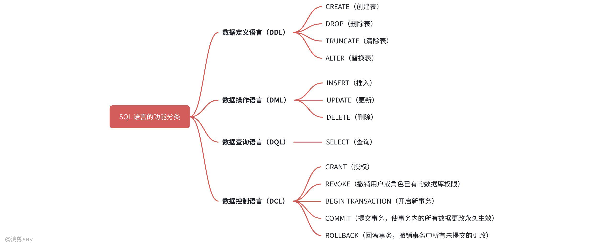
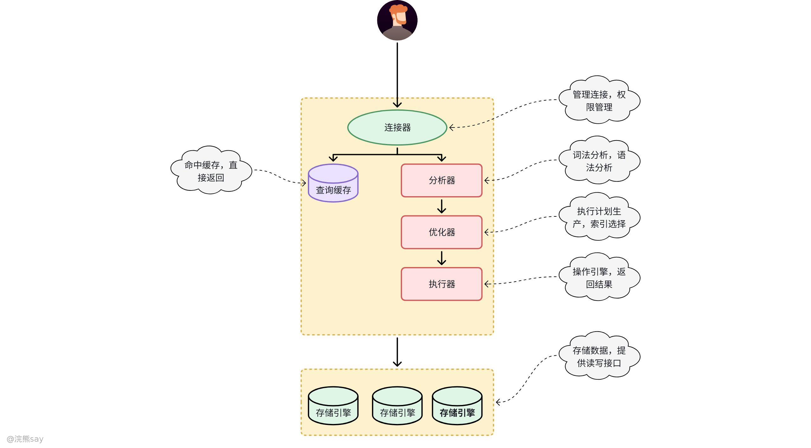
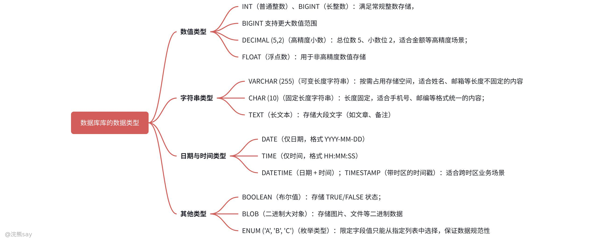

# 3、关系数据库标准语言SQL

**关系数据库标准语言SQL**

## SQL语言概念

SQL（Structured Query Language，结构化查询语言）是专为管理和操作关系型数据库设计的编程语言，也是关系型数据库的核心组成。它为用户提供了统一、高效的数据库交互方式，覆盖数据库创建、结构修改、数据处理全流程，用户无需掌握数据库底层实现细节，仅通过简洁的命令即可完成各类数据操作。数据库系统对 SQL 语句的处理是一套复杂且高效的标准化流程，会依次经过词法分析、语法分析、语义分析、查询优化、执行计划生成、执行及结果返回等步骤，从语法校验到效率优化，全方位保障 SQL 语句的正确与高效执行。

## SQL语言分类

SQL 语言依据功能差异可分为数据定义语言（DDL）、数据操作语言（DML）、数据查询语言（DQL）和数据控制语言（DCL）四大类，其中事务控制语言（TCL）是 DCL 中专门用于事务管理的专属子模块，各类语言各司其职、相互配合，实现对数据库的全方位管理与操作。

1.  **数据定义语言（DDL）**：核心用于定义和管理数据库的各类对象结构，围绕数据库对象的生命周期开展操作，包括 CREATE（创建数据库、表、视图、索引等数据库对象）、ALTER（修改已存在数据库对象的结构）、DROP（删除数据库对象），同时也包含 TRUNCATE 语句，可实现清空表中所有数据但保留表结构的操作。
2.  **数据操作语言（DML）**：专注于对数据库表中的实际业务数据进行增删改操作，是实现数据动态更新的核心语言，常用语句为 INSERT（向表中插入新数据）、UPDATE（修改表中已存在的指定数据）、DELETE（删除表中的指定数据）。
3.  **数据查询语言（DQL）**：是 SQL 中使用频率最高的类别，专门用于从数据库中检索目标数据，核心语句为 SELECT，可基于自定义条件对单表或多表数据进行过滤、排序、分组、聚合等精细化处理，最终返回符合业务需求的结果集。
4.  **数据控制语言（DCL）**：主要负责数据库的权限管理和事务控制两大核心工作，其中权限管理通过 GRANT（为用户或角色授予数据库对象的特定访问 / 操作权限）、REVOKE（撤销用户或角色已有的数据库权限）实现；事务控制则由 TCL（事务控制语言）完成，核心语句包含 BEGIN TRANSACTION（开启新事务）、COMMIT（提交事务，使事务内的所有数据更改永久生效）、ROLLBACK（回滚事务，撤销事务中所有未提交的更改），同时还可通过 SAVEPOINT 在事务中设置保存点，实现回滚至事务指定节点的精细化控制。

SQL 四大功能类别的划分形成了一套完整的数据库管理体系：DDL 搭建数据库的 “骨架”，定义数据存储的结构基础；DML 填充数据库的 “血肉”，实现业务数据的动态更新；DQL 挖掘数据库的 “价值”，是提取有效信息的核心手段；DCL 守护数据库的 “安全与一致性”，通过权限管控和事务管理保障数据操作的合规与可靠。四类语言分工明确、协同配合，覆盖了从数据库结构搭建到数据使用、安全管控的全流程，是高效管理和操作关系型数据库的核心支撑。

## SQL语言处理过程

当用户向数据库系统提交一条 SQL 语句后，系统会按照固定的步骤完成解析、优化与执行，各步骤依次衔接、层层校验，既保证语句的合法性，又通过优化提升执行效率，最终将执行结果反馈给用户，具体处理流程如下：

1.  **词法分析**：数据库系统首先将完整的 SQL 语句拆解为一个个独立的词法单元，包括关键字、标识符、运算符、常量等，这一过程类似于阅读文章时将句子拆分为独立单词，是后续所有分析工作的基础。
2.  **语法分析**：系统基于 SQL 语言的标准语法规则，对拆分后的词法单元进行组合校验，同时构建语法树，该树形结构能直观体现 SQL 语句的整体语法结构及各部分之间的逻辑关联；若语句不符合语法规则，系统会在此阶段直接抛出语法错误，终止后续处理。
3.  **语义分析**：在语法校验通过后，系统对语法树进行进一步的语义校验，核心核查表名、列名是否在数据库中存在、字段数据类型是否匹配、执行语句的用户是否具备相关数据库对象的访问 / 操作权限等关键内容，若存在语义错误，系统会在此阶段报错并终止处理。
4.  **查询优化**：在确认 SQL 语句语法和语义均无错误后，查询优化器会结合数据库的实际情况，分析多种可能的执行方案，同时综合考虑数据存储方式、索引使用情况、系统资源利用效率等因素，从所有可行方案中选择执行效率最优的方案，核心优化方向包括选取合适的索引、确定多表查询的连接顺序等。
5.  **执行计划生成**：完成查询优化后，数据库系统会将选定的最优方案转化为具体、可执行的执行计划，该计划是一系列明确的操作步骤，也是后续数据库引擎执行 SQL 语句的直接依据。
6.  **执行**：数据库引擎按照生成的执行计划，逐步骤执行 SQL 语句，执行过程中会根据语句类型访问数据库中的目标数据，完成查询、插入、更新、删除等相应操作。
7.  **结果返回**：数据库系统将 SQL 语句的最终执行结果反馈给用户，结果形式会根据语句类型有所不同，查询语句的结果通常以结果集的形式呈现，数据定义或数据操作语句的结果则为操作状态信息，如受影响的行数、操作成功标识等。

整个流程既保障了 SQL 语句执行的准确性和安全性，又通过优化环节提升了数据库的响应效率，是数据库系统能够高效、稳定处理各类数据操作请求的核心逻辑。

## 浣熊真题
| 【国家电网2017】SQL 语言称为（）A.结构化操纵语言B.结构化定义语言C.结构化控制语言D.结构化查询语言答案：D解析：SQL 的全称是结构化查询语言（Structured Query Language） |
| --- |

| 【国家电网2017】下列关于对 SQL 的描述不正确的是（）。A.SQL 语言是关系数据的标准语言B.1974 年 SQL 语言首先由 IBM 公司的研究人员提出并实现C.SQL 具有集查询、操作、定义、控制、发布及备份等功能于一身的一体化特点D.SQL 的使用方式有两种：交互式联机使用方式，二是嵌入到某种高级语言中答案：A解析：SQL 是结构化查询语言 |
| --- |

## 数据库的基本操作

## 数据类型

不同数据库系统（如 MySQL、PostgreSQL、SQL Server）的基础数据类型略有差异，但核心类型通用，主要用于定义字段的存储格式，常见类别如下：

1.  **数值类型**：适配不同精度、范围的数字存储需求

-   INT（普通整数）、BIGINT（长整数）：满足常规整数存储，
-   BIGINT 支持更大数值范围
-   DECIMAL (5,2)（高精度小数）：总位数 5、小数位 2，适合金额等高精度场景；
-   FLOAT（浮点数）：用于非高精度数值存储

1.  **字符串类型**：存储文本类数据，适配不同长度和格式需求

-   VARCHAR (255)（可变长度字符串）：按需占用存储空间，适合姓名、邮箱等长度不固定的内容
-   CHAR (10)（固定长度字符串）：长度固定，适合手机号、邮编等格式统一的内容；
-   TEXT（长文本）：存储大段文字（如文章、备注）

1.  **日期与时间类型**：存储时间相关数据，适配不同时间维度需求

-   DATE（仅日期，格式 YYYY-MM-DD）
-   TIME（仅时间，格式 HH:MM:SS）
-   DATETIME（日期 + 时间）；TIMESTAMP（带时区的时间戳）：适合跨时区业务场景

1.  **其他类型**：满足特殊存储需求

-   BOOLEAN（布尔值）：存储 TRUE/FALSE 状态；
-   BLOB（二进制大对象）：存储图片、文件等二进制数据
-   ENUM ('A', 'B', 'C')（枚举类型）：限定字段值只能从指定列表中选择，保证数据规范性

据库核心数据类型虽因系统不同存在细节差异，但整体分类和适用逻辑通用，且每类类型下的细分项均有明确的业务适配场景：数值类型聚焦 “精度与范围”、字符串类型聚焦 “长度与格式”、日期时间类型聚焦 “时间维度与时区”、其他类型聚焦 “特殊存储需求”。在实际数据库设计中，需根据业务场景精准选择数据类型，这不仅能提升数据存储效率、保证数据规范性，还能优化后续数据查询与运算的性能。

## 数据定义（DDL）

数据定义语言（DDL）核心用于创建、修改和删除数据库对象（如表、视图、索引等），是搭建数据库基础结构的核心语法，以下以表对象为例展示核心操作：
| SQL-- 创建表CREATE TABLE users (id INT PRIMARY KEY,name VARCHAR(50),age INT,email VARCHAR(100) UNIQUE);-- 修改表结构ALTER TABLE users ADD COLUMN created_at TIMESTAMP;-- 删除表DROP TABLE IF EXISTS users; |
| --- |

## 数据的增删改查（DML ）

数据操作语言（DML）专注于对表中实际业务数据进行增、删、改、查操作，是日常数据管理中最常用的语法类别。

### 插入数据（INSERT）
| SQLINSERT INTO users (id, name, age, email)VALUES (1, 'Alice', 25, 'alice@example.com');-- 批量插入INSERT INTO users (id, name, age)VALUES (2, 'Bob', 30), (3, 'Charlie', 22); |
| --- |

### 查询数据（SELECT）
| SQL-- 查询所有记录SELECT * FROM users;-- 条件查询SELECT name, age FROM users WHERE age > 25;-- 排序与分页SELECT * FROM users ORDER BY age DESC LIMIT 10 OFFSET 5;-- 聚合函数SELECT COUNT(*), AVG(age) FROM users; |
| --- |

### 更新数据（UPDATE）
| SQLUPDATE users SET age = age + 1 WHERE name = 'Alice'; |
| --- |

### 删除数据（DELETE）
| SQLDELETE FROM users WHERE id = 3; |
| --- |

## 数据控制语言（DCL）

数据控制语言（Database Control Language，DCL）是 SQL 语言三大核心分支（DDL、DML、DCL）中聚焦数据库权限管控的核心语言，也是数据库安全体系的基础。它的核心价值在于通过精细化的权限分配与回收，明确不同用户对数据库资源的操作边界 —— 比如让普通业务用户只能查询指定表的数据，让开发人员能修改测试库数据但无法删除生产库表，从权限层面防止数据泄露、误操作或恶意篡改。

DCL的核心语句围绕两大功能模块展开：一是权限管理类（GRANT、REVOKE），用于管控用户/角色对数据库对象的访问权限；二是事务控制类（BEGIN TRANSACTION、COMMIT、ROLLBACK），用于保障复杂数据操作的完整性，所有语句均遵循ANSI SQL标准，在MySQL、Oracle、PostgreSQL、SQL Server等主流关系型数据库中高度兼容（仅存在少量厂商方言差异）。

### 权限管理

权限管理是DCL保障数据安全的核心功能，通过“授予-回收”的闭环操作，实现“最小权限原则”——用户仅获取完成工作所需的最小权限，避免权限滥用导致的安全风险，核心语句为GRANT（授权）与REVOKE（撤销权限）。

#### GRANT（权限授予）

GRANT语句用于向用户或角色分配特定的数据库访问权限，支持按“数据库级、表级、列级”的精细化粒度授权，覆盖查询、插入、修改、删除、创建对象等全场景操作权限，是权限管理的基础操作，其核心语法结构为：
| SQL-- 通用语法（适配多数数据库）GRANT 权限类型1, 权限类型2... ON 数据库对象 TO 用户名/角色名 [WITH GRANT OPTION]; |
| --- |

-   权限类型：包括SELECT（查询）、INSERT（插入）、UPDATE（修改）、DELETE（删除）、CREATE（创建对象）、ALTER（修改对象结构）、DROP（删除对象）、ALL PRIVILEGES（所有权限）等；
-   数据库对象：可指定具体范围，如\*.\*（所有数据库的所有表）、db\_name.\*（指定数据库的所有表）、db\_name.table\_name（指定数据库的指定表）、db\_name.table\_name(column1, column2)（指定表的指定列）；
-   WITH GRANT OPTION：可选参数，允许被授权用户将自身拥有的权限授予其他用户（仅管理员授权时慎用）。

SQL示例：
| SQL-- 1. 向普通开发用户授予指定表的查询与插入权限（表级授权）GRANT SELECT, INSERT ON shop_db.users TO 'dev_zhang'@'192.168.1.0/24';-- 2. 向数据分析用户授予指定表的查询权限（列级授权，仅允许查询姓名和年龄列）GRANT SELECT (name, age) ON shop_db.users TO 'analyst_li'@'localhost';-- 3. 向管理员授予所有数据库的全量权限，并允许其授权给他人GRANT ALL PRIVILEGES ON *.* TO 'admin_wang'@'10.0.0.0/8' WITH GRANT OPTION;-- 4. 向角色授予权限（先创建角色，再批量分配给用户，适用于多用户统一授权）CREATE ROLE 'read_only_role'; -- 创建只读角色GRANT SELECT ON shop_db.* TO 'read_only_role'; -- 角色授予所有表查询权限GRANT 'read_only_role' TO 'dev_li'@'localhost', 'dev_zhao'@'localhost'; -- 角色分配给用户 |
| --- |

#### REVOKE（权限撤销）

REVOKE语句用于回收已授予用户或角色的权限，语法与GRANT高度对称，确保权限管理的灵活性——当用户离职、角色变更或权限过度授予时，可通过该语句及时撤销权限，避免安全风险，其核心语法结构为：
| SQL-- 通用语法（与GRANT对应）REVOKE 权限类型1, 权限类型2... ON 数据库对象 FROM 用户名/角色名; |
| --- |

SQL示例：
| SQL-- 1. 回收普通用户对users表的插入权限（保留查询权限）REVOKE INSERT ON shop_db.users FROM 'dev_zhang'@'192.168.1.0/24';-- 2. 回收管理员的全量权限及授权能力REVOKE ALL PRIVILEGES, GRANT OPTION ON *.* FROM 'admin_wang'@'10.0.0.0/8';-- 3. 回收角色的查询权限（所有关联用户的权限同步失效）REVOKE SELECT ON shop_db.* FROM 'read_only_role'; |
| --- |

### 事务控制

事务控制是DCL保障数据一致性的核心功能，适用于多步关联操作（如转账、订单创建、库存扣减），通过“开启-提交-回滚”的流程，确保一系列操作要么全部成功生效，要么全部失败回滚，避免“部分执行”导致的数据异常。

#### BEGIN TRANSACTION（开启事务）

BEGIN TRANSACTION（部分数据库简写为BEGIN或START TRANSACTION）用于标记事务的起始点，从该语句执行后，所有后续的INSERT、UPDATE、DELETE等数据操作均会被纳入事务上下文，暂不永久写入数据库，直至执行COMMIT或ROLLBACK，其语法如下：
| SQL-- MySQL/Oracle/PostgreSQL（通用简写）BEGIN;-- 或START TRANSACTION;-- SQL Server（标准语法）BEGIN TRANSACTION; |
| --- |

其核心作用是将多步操作绑定为一个原子单元，后续操作可通过COMMIT确认生效，或通过ROLLBACK撤销，确保操作的整体性。

#### COMMIT（提交事务）

COMMIT语句用于确认事务内所有操作的有效性，执行后，事务中所有已完成的INSERT、UPDATE、DELETE等操作将被永久写入数据库，数据变更不可逆，同时事务上下文结束，释放相关资源（如锁），其语法（所有主流数据库通用）：
| SQLCOMMIT; |
| --- |

SQL示例（转账业务）：
| SQL-- 开启事务：用户A向用户B转账100元BEGIN;-- 步骤1：用户A账户扣款100元UPDATE bank_accounts SET balance = balance - 100 WHERE user_id = 'A';-- 步骤2：用户B账户到账100元UPDATE bank_accounts SET balance = balance + 100 WHERE user_id = 'B';-- 提交事务：两步操作均成功，数据永久生效COMMIT; |
| --- |

#### ROLLBACK（回滚事务）

ROLLBACK语句用于撤销事务内所有未提交的操作，当事务中某一步操作失败（如数据约束冲突、网络异常、业务逻辑错误）时，执行该语句可将数据库状态恢复至事务开始前的状态，避免无效数据残留，语法（所有主流数据库通用）如下：
| SQLROLLBACK; |
| --- |

实操场景示例（转账失败回滚）：
| SQL-- 开启事务：用户A向用户B转账100元BEGIN;-- 步骤1：用户A账户扣款100元（执行成功）UPDATE bank_accounts SET balance = balance - 100 WHERE user_id = 'A';-- 步骤2：用户B账户到账100元（执行失败，如用户B账户不存在）UPDATE bank_accounts SET balance = balance + 100 WHERE user_id = 'B'; -- 执行报错-- 回滚事务：撤销步骤1的扣款操作，数据库恢复初始状态ROLLBACK; |
| --- |

DCL通过权限管理与事务控制两大核心能力，构建了数据库的安全防护与数据一致性保障体系。GRANT与REVOKE实现了权限的精细化管控，从访问源头保障数据安全；BEGIN TRANSACTION、COMMIT、ROLLBACK则确保了复杂业务操作的原子性与完整性，避免数据异常。

## 浣熊真题
| 【国家电网2017】SQL 语言中，删除一个表的命令是（）A.DELETE；B.DROP；C.CLEAR；D.REMOVE答案：B解析：DROP TABLE用于删除表，DELETE用于删除表中数据 |
| --- |

| 【中国铁塔2019】将查询 Student 表的权限授予用户 User1，并允许该用户将此权限授予其他用户，实现的 SQL 语句是（）A.Grant Select To Table Student On User1 With Public；B.Grant Select On Table Student To User1 With Public；C.Grant Select On Table Student To User1 With Grant Option；D.Grant Select To Table Student On User1 With Grant Option答案：C解析：授予权限并允许转授的语法为Grant 权限 On 表名 To 用户 With Grant Option |
| --- |

| 【国家电网2018】下列 SQL 语句中，能够实现“收回用户 ZHAO 对学生表(STUD)中学号(XH)的修改权”这一功能的是（）A.REVOKE UPDATE(XH) ON TABLE FROM ZHAO；B.REVOKE UPDATE(XH) ON TABLE FROM PUBLIC；C.REVOKE UPDATE(XH) ON STUD FROM ZHAO；D.REVOKE UPDATE(XH) ON STUD FROM PUBLIC答案：C解析：收回权限的语法为REVOKE 权限 ON 表名 FROM 用户，需指定具体表名（STUD）和用户（ZHAO |
| --- |

## SQL基本操作

## 什么是SQL？

### SQL的定义

SQL（Structured Query Language，结构化查询语言）是用于管理关系型数据库的标准化计算机语言，是数据库与用户 / 应用程序之间的核心交互接口，并非编程语言（无复杂逻辑控制能力），而是专注于数据的定义、查询、操纵与控制，被所有主流关系型数据库（如 MySQL、Oracle、PostgreSQL、SQL Server）兼容，是数据领域的基础通用工具。

SQL 的核心定位是 “数据操作与管理的桥梁”，其设计理念贴近自然语言，语法简洁直观，无需关注数据存储的底层实现（如索引结构、物理存储），用户只需通过简单语句描述 “需要什么数据” 或 “要做什么操作”，数据库会自动优化执行逻辑。它覆盖了关系型数据库全生命周期的操作需求：数据定义层面，可通过 CREATE、ALTER、DROP 等语句创建表、修改表结构、删除数据库对象；数据操纵层面，通过 INSERT、UPDATE、DELETE 语句实现数据的插入、更新与删除；数据查询层面，借助 SELECT 语句（支持条件筛选、排序、分组、联表查询等）从数据库中提取所需数据，这也是 SQL 最常用的功能；数据控制层面，通过 GRANT、REVOKE 等语句管理用户对数据库的访问权限，保障数据安全。

作为标准化语言，SQL 具有极强的通用性和兼容性，虽然不同数据库厂商会在标准 SQL 基础上扩展方言（如 MySQL 的 LIMIT、Oracle 的 ROWNUM），但核心语法（如 SELECT、INSERT、JOIN）完全遵循 ANSI SQL 标准，掌握标准 SQL 后可快速适配各类关系型数据库。其非过程化的特性让用户无需编写复杂的执行流程，仅需聚焦业务需求，大幅降低了数据操作的门槛，广泛应用于网站开发、数据分析、企业管理系统、数据仓库等场景 —— 从电商平台的订单查询、用户信息管理，到数据分析中的数据提取与统计，再到后台系统的批量数据处理，都离不开 SQL 的支持。

### SQL的发展历史

SQL（Structured Query Language，结构化查询语言）的发展历程是关系型数据库技术演进的核心缩影，从实验室原型到全球通用标准，再到适配现代数据场景的持续迭代，其脉络始终围绕“简化数据操作、统一交互接口、拓展应用边界”展开，可分为四个关键阶段：

#### 起源与原型阶段（20世纪70年代：关系模型奠基与语言雏形）

SQL的诞生源于关系数据库理论的突破。1970年，IBM研究员E.F. Codd在《A Relational Model of Data for Large Shared Data Banks》中提出关系代数理论，打破了当时层次型、网状数据库需手动导航数据链路的复杂模式，为结构化查询语言奠定了理论基础。1974年，IBM圣何塞研究实验室启动System R项目，旨在将关系模型落地为实际数据库系统，研究员Donald Chamberlin与Raymond Boyce基于该项目开发出首个查询语言原型——SEQUEL（Structured English Query Language，结构化英语查询语言），其设计理念贴近自然语言，无需用户关注底层存储实现，只需描述“所需数据”而非“执行流程”。1977年，System R迎来首个商业客户Pratt & Whitney，验证了关系型数据库的事务处理性能；1979年，当时名为Relational Software的Oracle公司推出Oracle V2，成为首个商业化支持SQL（因版权问题将SEQUEL简化为SQL）的数据库产品，开启了SQL的商业应用之路。这一阶段的核心价值在于，SQL首次将复杂的数据操作转化为简洁直观的语句，解决了传统数据库查询效率低、学习门槛高的痛点。

#### 标准化与普及阶段（20世纪80年代：从厂商私有到全球通用标准）

随着Oracle、Sybase、Informix等厂商相继推出支持SQL的数据库产品，语法差异成为行业痛点，标准化成为必然趋势。1986年，美国国家标准学会（ANSI）发布首个正式SQL标准（ANSI X3.135-1986），次年被国际标准化组织（ISO）采纳为ISO 9075:1987，标志着SQL从厂商私有语言升级为全球通用规范。1989年，SQL-89作为修订版发布，补充了表别名、列别名、索引定义等基础功能，进一步完善了语法细节。这一阶段的里程碑是1992年SQL-92（又称SQL2）标准的推出，它首次定义了复杂查询的核心语法，包括多表连接（INNER JOIN/LEFT JOIN等）、子查询、集合操作（UNION/INTERSECT）、视图、完整事务隔离级别及时间数据类型，成为首个被广泛普及的SQL标准，至今仍是全球98.7%关系型数据库的核心兼容基准。标准化不仅降低了数据库迁移成本，更推动SQL成为企业级数据操作的“事实标准”，Oracle等厂商凭借对标准的率先支持，迅速占据市场主导地位。

#### 技术扩展与场景适配阶段（20世纪90年代-21世纪10年代：功能深化与多场景兼容）

进入90年代后，数据管理需求从简单查询转向复杂分析、分布式处理和多类型数据存储，SQL标准随之进入快速扩展期。1999年发布的SQL:1999（SQL3）是一次里程碑式升级，首次引入面向对象特性与高级分析功能，包括窗口函数、递归公共表表达式（Recursive CTE）、用户定义类型（UDT）、XML支持和触发器标准化，为层次化数据处理、复杂统计分析提供了原生支持。此后，SQL标准以增量更新形式持续适配新场景：2003年SQL:2003优化触发器语法与XML数据转换，强化外键约束灵活性；2008年SQL:2008引入MERGE语句，统一插入、更新、删除的同步逻辑；2011年SQL:2011聚焦时序数据需求，推出时态表功能，支持自动记录数据历史变更，适配物联网、监控等场景。与此同时，各厂商在兼容标准的基础上推出方言扩展（如Oracle的PL/SQL、SQL Server的T-SQL），并将SQL适配到分布式数据库、数据仓库等场景——1995年Tandem NonStop SQL实现跨节点事务，支撑全球ATM交易系统；2007年Facebook开源Hive，让SQL能够处理PB级大数据，形成HiveSQL等衍生语言，推动SQL从传统关系型数据库延伸至大数据生态。

#### 现代演进与生态融合阶段（21世纪20年代至今：适配新型数据与技术趋势）

近年来，SQL标准持续拥抱新型数据需求与技术变革，核心方向是“兼容非结构化数据、强化分析能力、衔接云原生与多模态场景”。2023年发布的SQL:2023（ISO/IEC 9075:2023）是最新标准，在保留核心语法兼容性的基础上，强化了JSON数据处理、多维数组支持和属性图查询（SQL/PGQ），进一步缩小了SQL与NoSQL数据库的功能边界。这一阶段的显著特征是“生态融合”：一方面，传统关系型数据库（MySQL 8.0、PostgreSQL 16）全面兼容最新标准特性，支持JSON、XML等多类型数据存储；另一方面，SQL与云原生、大数据、人工智能场景深度结合，阿里MaxCompute、腾讯TDSQL等平台日均处理数千万条SQL作业，支撑实时数据分析与业务决策。同时，国产数据库在SQL标准适配与创新上持续发力，不仅全面兼容SQL-92及后续核心标准，还针对中文处理、分布式事务等场景优化语法扩展，推动SQL标准在本土场景的落地与创新。

## SQL插入操作

SQL 中的 INSERT 语句是向数据库表添加新数据行的核心命令，支持完整行插入、指定列插入、多行批量插入及跨表数据导入等多种场景，灵活适配不同业务需求。

### 基本语法

#### 插入完整行（所有列）
| SQLINSERT INTO table_nameVALUES (value1, value2, value3, ...); |
| --- |

-   **注意**：值的顺序必须与表中列的顺序一致。

#### 指定列名插入
| SQLINSERT INTO table_name (column1, column2, column3, ...)VALUES (value1, value2, value3, ...); |
| --- |

-   **优点**：无需按顺序插入所有列，可省略允许 NULL 或有默认值的列。

### 插入示例

假设存在表 users：
| SQLCREATE TABLE users (id INT PRIMARY KEY,name VARCHAR(50),age INT,email VARCHAR(100) UNIQUE,created_at TIMESTAMP DEFAULT CURRENT_TIMESTAMP); |
| --- |

#### 插入完整行
| SQLINSERT INTO usersVALUES (1, 'Alice', 25, 'alice@example.com', '2023-01-01 10:00:00'); |
| --- |

#### 指定列插入
| SQL-- 省略 created_at（使用默认值）INSERT INTO users (id, name, age, email)VALUES (2, 'Bob', 30, 'bob@example.com'); |
| --- |

#### 插入多行
| SQLINSERT INTO users (id, name, age)VALUES(3, 'Charlie', 22),(4, 'David', 28); |
| --- |

## SQL删除操作

在 SQL 中，**DELETE 语句** 用于从数据库表中删除数据行。以下是 DELETE 操作的详细用法和示例：

### 基本语法
| SQLDELETE FROM table_nameWHERE condition; |
| --- |

-   **作用**：删除满足 WHERE 条件的所有行。
-   **注意**：若省略 WHERE 子句，将删除表中\*\*所有数据\*\*（表结构保留）。

### 删除示例

假设存在表 products：
| SQLCREATE TABLE products (id INT PRIMARY KEY,name VARCHAR(50),category VARCHAR(50),price DECIMAL(10, 2),created_at TIMESTAMP); |
| --- |

1.  **删除单条记录**

| SQLDELETE FROM productsWHERE id = 1001; |
| --- |

1.  **按条件删除多条记录**

| SQL-- 删除价格低于 10 且类别为“玩具”的产品DELETE FROM productsWHERE price  100AND stock > 0; |
| --- |

1.  **去重查询**

| SQLSELECT DISTINCT category FROM products; -- 返回唯一的分类 |
| --- |

### 高级查询技巧

#### 排序（ORDER BY）
| SQL-- 按价格降序排列，相同价格按创建时间升序SELECT * FROM productsORDER BY price DESC, created_at ASC; |
| --- |

#### 分页（LIMIT/OFFSET）
| SQL-- MySQL/PostgreSQL 语法：获取第 2 页数据（每页 10 条）SELECT * FROM productsLIMIT 10 OFFSET 10; -- 跳过前 10 条，取接下来的 10 条-- SQL Server 语法：SELECT * FROM productsORDER BY idOFFSET 10 ROWS FETCH NEXT 10 ROWS ONLY; |
| --- |

#### 聚合函数
| SQLSELECTCOUNT(*) AS 总产品数,SUM(stock) AS 总库存,AVG(price) AS 平均价格,MAX(price) AS 最高价格,MIN(price) AS 最低价格FROM products; |
| --- |

#### 分组（GROUP BY）与过滤（HAVING）
| SQL-- 查询每个分类的产品数量和平均价格，只返回平均价大于 200 的分类SELECT category, COUNT(*), AVG(price)FROM productsGROUP BY categoryHAVING AVG(price) > 200; |
| --- |

### 多表连接查询

假设存在关联表 orders 和 customers：
| SQLCREATE TABLE customers (id INT PRIMARY KEY,name VARCHAR(50),city VARCHAR(50));CREATE TABLE orders (id INT PRIMARY KEY,customer_id INT,order_date DATE,amount DECIMAL(10, 2),FOREIGN KEY (customer_id) REFERENCES customers(id)); |
| --- |

#### 内连接（INNER JOIN）
| SQL-- 查询每个订单及其客户信息SELECT o.id, c.name, o.amount, o.order_dateFROM orders oINNER JOIN customers c ON o.customer_id = c.id; |
| --- |

#### 左连接（LEFT JOIN）
| SQL-- 查询所有客户及其订单（包括无订单的客户）SELECT c.name, o.id, o.amountFROM customers cLEFT JOIN orders o ON c.id = o.customer_id; |
| --- |

#### 多表连接
| SQL-- 连接三个表：客户、订单、产品SELECT c.name, o.order_date, p.name AS product_nameFROM customers cJOIN orders o ON c.id = o.customer_idJOIN order_items oi ON o.id = oi.order_idJOIN products p ON oi.product_id = p.id; |
| --- |

### 子查询与复杂条件

#### 标量子查询
| SQL-- 查询价格高于平均价的产品SELECT * FROM productsWHERE price > (SELECT AVG(price) FROM products); |
| --- |

#### IN/NOT IN 子查询
| SQL-- 查询有订单的客户SELECT * FROM customersWHERE id IN (SELECT DISTINCT customer_id FROM orders); |
| --- |

#### EXISTS/NOT EXISTS
| SQL-- 查询有订单的客户（性能优于 IN）SELECT * FROM customers cWHERE EXISTS (SELECT 1 FROM orders o WHERE o.customer_id = c.id); |
| --- |

#### 复杂条件组合
| SQL-- 查询近 30 天内下单金额超过 1000 的北京客户SELECT c.*FROM customers cJOIN orders o ON c.id = o.customer_idWHERE c.city = '北京'AND o.order_date >= DATE_SUB(CURRENT_DATE, INTERVAL 30 DAY)GROUP BY c.idHAVING SUM(o.amount) > 1000; |
| --- |

### 常见函数与表达式

#### 字符串函数
| SQLSELECTUPPER(name) AS 大写名称, -- 转大写LENGTH(name) AS 名称长度, -- 字符串长度CONCAT(category, ': ', name) AS 完整名称 -- 字符串拼接FROM products; |
| --- |

#### 日期函数
| SQLSELECTorder_date,DATE_ADD(order_date, INTERVAL 7 DAY) AS 预计送达, -- 日期加 7 天YEAR(order_date) AS 订单年份, -- 提取年份DATEDIFF(CURRENT_DATE, order_date) AS 已过去天数 -- 计算日差FROM orders; |
| --- |

#### 条件表达式
| SQL-- 根据价格区间分类SELECTname,price,CASEWHEN price > 1000 THEN '高价'WHEN price > 500 THEN '中价'ELSE '低价'END AS 价格等级FROM products; |
| --- |

## 浣熊真题
| 【中国银行2022】MYSQL 中 DEPT 表 DEPTNO 为 20、30、40，NEWDEPT 表 DEPTNO 为 10、50、null，查询 DEPT 中有而 NEWDEPT 中没有的数据，原 SQL（select * from DEPT where DEPTNO not in(SELECT DEPTNO from NEWDEPT)）查不到结果，改写正确的是（）A.select * from DEPT where not (DEPTNO=10 or DEPTNO=50 or DEPTNO=null)；B.select * from DEPT where DEPTNO not in(10;50,null)；C.select * from DEPT where not exists (SELECT DEPTNO from NEWDEPT)；D.select * from DEPT d where not exists (SELECT null from NEWDEPT e where d.DEPTNO=e.DEPTNO)答案：D解析：not in无法处理null值，not exists通过关联查询避免null影响，准确匹配不存在的部门号。 |
| --- |

| 【中国银行2022】当开发工资管理系统时，员工工资表 salary 包含“日期”“员工号”“姓名”“基本工资”“奖金”“工资合计”（工资合计=基本工资+奖金），希望插入一行时自动计算工资合计，下列代码能实现的是（）A.update salary set 工资合计=基本工资+奖金；B.insert into salary(工资合计)values(基本工资+奖金)；C.create trigger tg on salary for insert as update salary set 工资合计=a.基本工资+a.奖金 from salary a join inserted b on a.员工号=b.员工号 and a.日期=b.日期；D.alter table salary add check(工资合计=基本工资+奖金)答案：C解析：通过创建插入触发器（trigger），在插入后关联inserted临时表更新工资合计 |
| --- |

| 【国家电网2017】SQL 语言称为（）A.结构化操纵语言B.结构化定义语言C.结构化控制语言D.结构化查询语言答案：D解析：SQL 的全称是结构化查询语言（Structured Query Language） |
| --- |

| 【国家电网2017】下列关于对 SQL 的描述不正确的是（）A.SQL 语言是关系数据的标准语言；B.1974 年 SQL 语言首先由 IBM 公司的研究人员提出并实现；C.SQL 具有集查询、操作、定义、控制、发布及备份等功能于一身的一体化特点；D.SQL 的使用方式有两种：交互式联机使用方式，二是嵌入到某种高级语言中答案：A解析：SQL 是结构化查询语言，并非“关系数据的标准语言”表述不准 |
| --- |

| 【国家电网2021】关系数据库的标准语言是 SQL，其主要特点包括（）A.以同一种语法结构提供两种使用方式(自含式和嵌入式)；B.集数据定义语言(DDL)、数据操纵语言(DML)、数据控制语言(DCL)的功能于一体；C.面向集合的操作方式；D.高度过程化答案：ABC解析：SQL 特点包括：两种使用方式（自含/嵌入）、一体化功能（DDL/DML/DCL）、面向集合操作、高度非过程化（无需指定存取路径） |
| --- |

| 【国家电网2018】如下面的数据库的表中，若职工表的主关键字是职工号，部门表的主关键字是部门号，SQL 操作不能执行（）A.从职工表中删除行(‘025’,‘王芳’,‘03’,720)；B.将行(‘005,’,‘乔兴’,‘04’,750)插入到职工表中；C.将职工号为‘001’的工资改为 700；D.将职工号为‘038’的部门号改为‘03’答案：B解析：职工表主关键字是职工号，插入行‘005,’可能存在职工号重复（或部门号‘04’未在部门表中存在），违反完整性约束 |
| --- |
