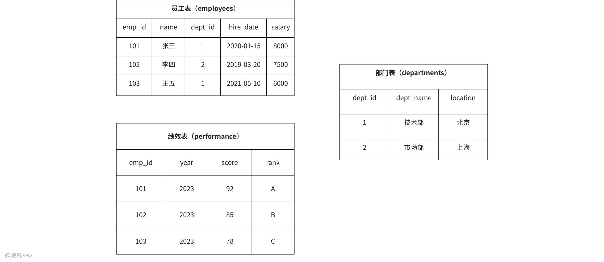

# 4、数据库对象

**数据库对象**

## 数据库基本对象

数据库基本对象是构成数据库系统的核心元素，各对象各司其职、协同工作，共同实现数据的存储、组织、管理与高效访问。这些对象是所有关系型数据库管理系统（如MySQL、Oracle、SQL Server、PostgreSQL等）的通用基础，理解其定义、特性与用途，是熟练使用数据库的关键前提。以下是数据库核心基本对象的详细解析：

## 表（Table）

表是数据库中最核心的存储对象，是数据的物理载体，以二维表格结构组织数据——横向为行（Row，也称记录，对应一条具体数据），纵向为列（Column，也称字段，定义数据的类型与属性）。表的结构由字段名、数据类型（如INT、VARCHAR、DATE）及约束规则共同定义，所有实际业务数据（如用户信息、订单记录、商品详情）均存储于表中。表的设计直接影响数据存储效率与查询性能，需结合业务需求合理规划字段、选择数据类型，避免冗余或设计缺陷。

## 索引（Index）

索引是为加速数据查询而设计的辅助数据结构，本质是数据的“检索目录”，通过提前对表中特定字段（或字段组合）建立有序映射，避免查询时全表扫描，从而大幅提升检索效率。其设计遵循“用空间换时间”的思路，需占用额外存储空间，但能将查询复杂度从O(n)降至O(logn)。索引适配多种查询场景，常见类型包括主键索引、唯一索引、普通索引、组合索引等，需根据查询模式合理创建，避免过度索引导致数据增删改性能下降。

## 视图（View）

视图是基于一个或多个表的查询结果生成的虚拟表，本身不存储实际数据，仅保存查询逻辑，数据实时关联源表。其核心价值在于简化复杂查询（将多表联查、聚合计算等逻辑封装为视图，用户直接查询视图即可）和精细化权限控制（仅向用户暴露视图中指定的列或行，隐藏源表敏感数据）。视图的查询结果会随源表数据实时更新，且不允许直接修改（或仅支持有限修改），适用于报表统计、多系统数据共享等场景。

## 存储过程（Stored Procedure）

存储过程是预编译并存储在数据库中的SQL语句集合，支持接收输入参数、执行复杂逻辑操作（如条件判断、循环、多表关联）并返回结果。其核心优势在于减少客户端与数据库的网络交互（将多步SQL合并为一个存储过程调用），且预编译后重复执行效率更高，同时能封装复杂业务逻辑（如订单创建、数据批量处理），提升代码复用性与维护性。存储过程适用于高频执行的复杂业务场景，但移植性较差（不同数据库方言存在差异）。

## 函数（Function）

函数与存储过程类似，是预编译的SQL逻辑集合，但核心区别在于**必须返回一个值**（单个标量值或表结构数据），且不可执行数据修改操作（如INSERT、UPDATE、DELETE）。函数分为标量函数（返回单个值，如计算年龄、字符串拼接）和表值函数（返回表结构数据，如查询指定条件的用户列表），常用于数据计算、格式转换或查询逻辑封装，可嵌入SELECT语句中直接使用，灵活适配数据处理需求。

## 触发器（Trigger）

触发器是绑定在表上的自动执行SQL代码块，当表发生特定操作（INSERT、UPDATE、DELETE）时会自动触发执行，无需手动调用。其核心用途包括数据校验（如禁止插入年龄0、性别只能是“男”或“女”）。约束由数据库自动校验，违反约束的操作会直接报错。

## 索引

## 什么是索引？

索引是 SQL 中用于优化数据检索效率的特殊数据结构，核心作用是帮助数据库系统快速定位表中特定数据，避免全表扫描，其功能和原理可类比书籍目录 —— 无需逐页翻找，通过目录就能直接定位目标内容。索引（Index）本质是存储 “列值与数据行物理位置” 映射关系的数据结构，部署在数据库表上后，能从三个维度提升数据操作效率：

1.  加速数据检索：数据库可通过索引直接跳转至符合查询条件的数据位置，替代逐行扫描全表的低效方式；
2.  保障数据唯一性：唯一索引、主键索引可强制约束列值不重复，从结构上保证数据完整性；
3.  优化排序分组：索引默认按列值排序，可直接支撑 ORDER BY、GROUP BY 等操作，无需额外排序计算。

虽然索引能够加速数据的检索，但索引并非无代价的，首先，索引作为冗余数据结构，需占用额外磁盘空间，复杂索引（如组合索引、全文索引）的存储开销可能接近甚至超过原始数据；其次，数据增删改时，索引需同步更新以维持一致性，这会增加操作延迟，尤其在高频写入场景（如秒杀订单、实时日志）中，过多索引会明显降低数据变更性能；最后，索引的维护成本较高，随着数据量增长和结构变化，索引可能产生碎片，需定期通过重建、优化等操作保障其有效性，且需持续关注索引使用情况，避免无效索引占用资源。

## 索引工作原理

以书籍目录类比：若要找 “第 10 章” 内容，目录会直接告知对应页码范围，无需逐页翻书；同理，索引会预先存储 “列值→数据行位置” 的映射关系（如 “年龄 = 25→数据行位置 0x12345”“年龄 = 30→数据行位置 0x67890”），查询时数据库只需检索索引即可快速定位目标数据。
| Plain Text年龄=25 → 数据行位置 0x12345年龄=30 → 数据行位置 0x67890 |
| --- |

索引的底层实现主要有两种方式，适配不同查询场景：

-   B + 树索引：是大多数数据库的默认索引类型，支持范围查询（如 WHERE age BETWEEN 20 AND 30）、排序等操作；
-   哈希索引：仅适配等值查询（如 WHERE id = 123），查询速度极快，但无法支持范围查询、排序等操作。

简言之，索引是表中一列 / 多列值的排序规则，创建索引的核心目标是**加快数据查找速度**，同时优化排序、分组等操作效率。

## 索引的类型

### 主键索引（PRIMARY KEY）

主键索引是表中具备强唯一标识属性的核心索引，由主键字段自动生成，既是表结构的重要组成部分，也是表与表之间建立外键关联的基础。它通过单个或多个字段组合，唯一锁定表中每一条记录，核心约束为字段值不可重复且不允许存储 NULL 值，若为多字段组合（复合主键），则组合后的整体值需保持唯一。

创建表时指定主键会隐式生成该索引，例如下面通过SQL语句展示了索引的创建方法，其中id 字段作为主键自动拥有主键索引，也可通过修改表结构添加主键索引，适用于已有表的优化场景。
| SQLCREATE TABLE users (id INT PRIMARY KEY, -- 隐式创建主键索引name VARCHAR(50)); |
| --- |

在多数数据库（如 MySQL InnoDB）中，主键索引默认作为聚簇索引，叶节点直接存储完整数据行，查询时无需回表，效率最高，因此适用于所有需要唯一标识记录的表（如用户表、订单表），实际使用中优先选择自增 INT/BIGINT 作为主键，避免使用易变更的业务字段（如手机号），减少索引重构的开销。

### 唯一索引（UNIQUE INDEX）

唯一索引的核心作用是保证索引列值的唯一性，同时兼具加速查询的功能，灵活性高于主键索引。与主键索引的关键区别在于，它允许存储一个或多个 NULL 值，且 NULL 值之间不判定为重复，一个表可创建多个唯一索引，无需作为表的主键。

这类索引适合用于需唯一约束但非主键的字段，例如用户表的邮箱、手机号（避免重复注册）、商品表的 SKU 编码等，其SQL语法如下：
| SQLCREATE UNIQUE INDEX idx_email ON users (email); |
| --- |

使用时需注意，插入重复值会触发数据库报错，需在业务层提前做去重校验；若字段允许为空，需确认业务场景是否接受多个 NULL 值共存（如备用手机号字段）。

### 普通索引（INDEX）

普通索引是最基础、使用频率最高的索引类型，仅用于加速查询，无任何数据约束（允许字段值重复、允许存储 NULL 值），维护成本低。它基于单个字段创建，通过字段值快速定位数据行，不影响数据的插入、修改操作（无需校验唯一性），适用于姓名、年龄、商品分类 ID 等高频查询但无需唯一约束的字段。
| SQLCREATE INDEX idx_age ON users (age); |
| --- |

创建语法简洁，例如CREATE INDEX idx\_age ON users (age);即可为用户表的 age 字段建立普通索引，也可在建表时直接定义索引。需要注意的是，避免为低频查询字段过度创建普通索引，否则会增加数据增删改时的索引维护开销，应优先为查询条件中的 “筛选列”“排序列” 建立普通索引，最大化提升查询效率。

### 组合索引（复合索引）

组合索引是基于多个字段按固定顺序组合创建的索引，核心优势是适配多条件组合查询，减少索引数量，提升复用性，其使用效果完全依赖 “最左前缀原则”—— 查询条件需从索引的最左列开始连续匹配，才能有效触发索引。
| SQL-- 创建组合索引（name为最左列，age为次列）CREATE INDEX idx_name_age ON users (name, age);-- 有效利用索引：匹配最左列+后续列SELECT * FROM users WHERE name = 'Alice' AND age = 25;-- 部分利用索引：仅匹配最左列SELECT * FROM users WHERE name = 'Bob';-- 无法利用索引：跳过最左列直接匹配次列SELECT * FROM users WHERE age = 30; |
| --- |

创建时需明确字段顺序，仅匹配最左列也能部分利用索引，而SELECT \* FROM users WHERE age = 30;跳过最左列则索引失效。设计组合索引时，应将高选择性字段（取值唯一度高，如用户 ID）、查询频率高的列放在左侧，提升筛选效率和复用性；同时可利用组合索引实现 “覆盖查询”（索引列包含查询所需所有字段），避免回表操作。需避免创建过多列的组合索引（索引长度过长，占用存储空间大），且查询时不要对最左列进行函数操作或类型转换，否则会导致索引失效。

### 全文索引（FULLTEXT INDEX）

全文索引是针对长文本数据设计的关键词搜索专用索引，通过分词技术将文本拆分为词元（关键词），建立词元与数据行的映射，突破普通索引仅支持前缀 / 后缀匹配的限制，支持自然语言查询和布尔查询。它仅适用于 VARCHAR、TEXT 等文本类型字段，例如文章内容、商品详情描述、论坛帖子等场景：
| SQLCREATE FULLTEXT INDEX idx_content ON articles (content);-- 查询包含“数据库”的文章SELECT * FROM articles WHERE MATCH(content) AGAINST('数据库'); |
| --- |

不同数据库的分词规则存在差异，MySQL 默认对中文分词支持有限，需安装 ngram 插件；大规模全文搜索场景更推荐使用 Elasticsearch（基于倒排索引，分词能力更强）。使用时需注意，短文本字段（如手机号、姓名）无需创建全文索引，普通索引或前缀索引效率更高；高频更新的文本字段也应避免使用，减少分词和索引维护的开销。

## 索引相关操作

索引的创建、删除、查看是数据库日常运维的基础操作，以下结合主流数据库（MySQL、PostgreSQL）的语法示例，详细说明操作要点，确保实操性：

### 创建索引

创建索引需根据业务需求选择对应的索引类型，语法需遵循 “索引类型 + 索引名称 + 表名 + 字段（组合索引需指定顺序）” 的结构，普通索引的创建语法如下：
| SQL-- 普通索引CREATE INDEX idx_name ON users (name);-- 唯一索引（确保列值唯一）CREATE UNIQUE INDEX idx_email ON users (email);-- 组合索引（多列）CREATE INDEX idx_age_name ON users (age, name); |
| --- |

创建时需注意，避免在高频更新的字段上创建过多索引，组合索引的字段数量不宜过多（建议不超过 3-4 个），同时需确认字段类型与索引类型匹配（如全文索引仅支持文本类型），避免创建无效索引。

### 删除索引

删除索引的核心语法为DROP INDEX 索引名称 ON 表名;
| SQLDROP INDEX idx_name ON users; |
| --- |

适用于索引失效、业务变更不再需要该索引，或索引过多影响数据增删改效率的场景。删除前需确认索引是否被高频查询依赖，避免误删导致查询性能下降；若为唯一索引或主键索引，删除前需先解除对应的唯一性约束（主键索引需先指定新的主键或取消主键约束），避免触发数据库报错。删除操作会同步清理索引占用的存储空间，对大表操作时建议在业务低峰期执行，减少对系统性能的影响。

### 查看索引

查看索引用于验证索引是否创建成功、检查索引结构（如字段顺序、索引类型），不同数据库的语法存在差异。MySQL 中使用SHOW INDEX FROM users;，可查看表中所有索引的详细信息，包括索引名称、类型、关联字段、是否唯一等；
| SQL-- MySQLSHOW INDEX FROM users;-- PostgreSQLSELECT * FROM pg_indexes WHERE tablename = 'users'; |
| --- |

查看索引时需重点确认索引类型与业务需求一致、组合索引的字段顺序正确、唯一索引的约束生效，若发现无效索引（如未被查询使用的索引），可结合业务情况考虑删除，优化数据库性能。

## 索引的优缺点

索引是数据库 “用空间换时间” 的核心优化工具，利弊相伴且需合理权衡。其核心优势在于能大幅提升查询效率，通过 B + 树等底层数据结构快速定位数据，避免全表扫描，适配等值、范围、多条件等多种查询场景，同时可利用自身有序性优化排序与分页操作，减少额外排序带来的 CPU 开销，主键索引与唯一索引还能强化数据非空、唯一的约束，减少业务层校验成本，不同类型的索引（组合、全文、空间等）也能满足多样化的查询需求。

而索引的潜在弊端同样不可忽视，它作为冗余数据结构会占用额外磁盘空间，复杂索引或过多索引会加剧存储消耗；数据增删改时需同步维护索引结构，索引数量越多，写入操作的开销越大，会降低数据变更性能；查询条件使用不当（如对索引列做函数操作、跳过组合索引最左列）可能导致索引失效，使数据库退化为全表扫描；合理设计索引需结合业务查询模式与数据特点，后续还需定期清理冗余索引、优化索引碎片，增加了设计与运维成本，且过度创建索引易引发 “索引爆炸”，不仅浪费存储空间，还可能拖累数据库优化器的选择，反而降低整体效率。

综上，索引的使用关键在于平衡 “查询收益” 与 “维护成本”，需按需为高频查询、排序字段创建索引，控制单表索引数量（建议不超过 5-8 个），避免过度优化，同时定期维护，才能最大化发挥其查询优化价值，规避性能损耗。

## 索引建立原则

1.  精准选择建索引的列：优先为查询条件列（WHERE/JOIN 子句）、主键 / 外键、排序 / 分组列（ORDER BY/GROUP BY）建立索引，这类列能最大化索引的查询优化价值；避免为极少查询、筛选价值低的列建索引，数据量极小的表也无需建索引，否则收益不及维护成本。
2.  控制索引数量，避免过度建索引：索引并非越多越好，过多索引会占用额外存储空间，且数据更新（INSERT/UPDATE/DELETE）时需同步维护所有索引，大幅降低写操作性能；需聚焦高价值列，摒弃无意义的冗余索引。
3.  适配列的特性设计索引：字符串列需考虑字符集与排序规则，避免因编码或排序规则问题导致索引失效；优先为值分布均匀、区分度高的列建索引，值区分度低（如性别、状态列）的字段单独建索引收益有限。
4.  科学规划组合索引：组合索引需遵循 “高频 / 高筛选性列在前” 的原则，同时严格遵守 “最左前缀匹配” 规则，仅当查询条件包含索引最左侧起始列时，才能有效触发索引使用。
5.  定期维护优化索引：数据增删改会产生索引碎片，需定期重建或优化索引结构以恢复性能；结合查询日志分析索引使用情况，保留高频有效索引、清理长期闲置的冗余索引，避免无用索引占用资源。

## 真题
| 【国家电网2022】在数据库系统运维过程中，当对有索引表的数据进行大量更新后，为了提高数据库查询性能，下列操作中，一般情况下合适的是()。A. 将该表数据导出后重新导入B. 重建该表上的索引并重启数据库C. 重新启动数据库D. 重建该表上的索引答案 ：D解析 ：在对有索引表的数据进行大量更新后，索引可能会变得不高效，重建索引可以提高查询性能 |
| --- |

| 【中电28所】以下关于数据库索引的说法正确的是（ ）A. 可以提高查询速度B. 会增加数据插入、更新和删除的时间C. 索引越多越好D. 可以根据多个字段创建复合索引答案 ：ABD解析 ：索引能加快查询速度，但在插入、更新和删除数据时，因为要维护索引，会增加时间开销。索引并非越多越好，过多索引会占用大量存储空间且影响性能。可以根据多个字段创建复合索引来满足更复杂的查询需求。 |
| --- |

| 【国家电网2021】在关系数据库中，索引(index)属于三级模式结构中的()A. 外模式B. 内模式C. 模式D. 子模式答案 ：B解析 ：内模式也称为存储模式，是数据库物理结构和存储方式的描述，索引属于内模式 |
| --- |

## 视图

## 视图作用

数据库视图（Database View）是基于 SQL 查询结果集创建的虚拟表，不存储实际数据，仅作为访问数据的逻辑窗口，核心作用可归纳为：

1.  简化复杂查询：将多表连接、子查询等高频复杂操作封装为视图，用户直接查询视图即可，无需重复编写复杂 SQL 结构；
2.  管控数据安全：通过视图精准暴露必要字段，限制用户对敏感数据的访问（如仅允许员工查看自身工资信息）；
3.  保障数据逻辑独立性：底层表结构变更时，只需修改视图定义，无需调整应用程序中的查询语句；
4.  整合跨表数据与兼容历史系统：既能将多表数据整合为统一视图，提供标准化访问接口；也能为结构变更的表提供兼容旧系统的视图接口，降低改造成本。

## 视图语法

### 创建视图
| SQLCREATE [OR REPLACE] [TEMPORARY] VIEW view_name [(column_list)]ASSELECT column1, column2, ...FROM table_nameWHERE condition; |
| --- |

-   OR REPLACE：如果视图已存在，则替换它
-   TEMPORARY：创建临时视图，会话结束时自动删除
-   column\_list：自定义视图列名，需与SELECT列数量匹配

示例：创建简单视图
| SQLCREATE VIEW customer_orders ASSELECT c.customer_id, c.name, o.order_date, o.total_amountFROM customers cJOIN orders o ON c.customer_id = o.customer_id; |
| --- |

示例：带条件的视图
| SQLCREATE VIEW high_value_orders ASSELECT * FROM ordersWHERE total_amount > 1000; |
| --- |

### 查看视图定义
| SQLSHOW CREATE VIEW view_name;-- 查看视图基本信息DESCRIBE view_name; |
| --- |

### 修改视图
| SQL-- 方式一：使用CREATE OR REPLACECREATE OR REPLACE VIEW customer_orders ASSELECT c.customer_id, c.name, o.order_date, o.total_amount, p.payment_methodFROM customers cJOIN orders o ON c.customer_id = o.customer_idJOIN payments p ON o.order_id = p.order_id;-- 方式二：使用ALTER VIEW（仅限修改视图定义）ALTER VIEW customer_orders ASSELECT c.customer_id, c.name, o.order_dateFROM customers cJOIN orders o ON c.customer_id = o.customer_id; |
| --- |

### 删除视图
| SQLDROP VIEW [IF EXISTS] view_name; |
| --- |

## 视图实例

假设存在员工表、部门表和绩效表三张表，分别记录了员工的基本信息，公司的部门信息和员工的绩效信息，如图所示：

现在HR部门需要频繁查询“2023年度员工的完整绩效信息”，包括：员工姓名、所属部门、薪资、绩效得分和等级。每次查询都需要手动关联3张表，操作繁琐，而通过创建视图可大幅简化操作。

### 创建视图

使用 CREATE VIEW 语句，将3张表的关联查询封装为视图 v\_2023\_performance：
| SQLCREATE VIEW v_2023_performance ASSELECTe.name AS 员工姓名,d.dept_name AS 所属部门,d.location AS 部门地点,e.salary AS 薪资,p.score AS 绩效得分,p.rank AS 绩效等级FROMemployees eINNER JOIN departments d ON e.dept_id = d.dept_id -- 关联员工与部门INNER JOIN performance p ON e.emp_id = p.emp_id -- 关联员工与绩效WHEREp.year = 2023; -- 只包含2023年数据 |
| --- |

### 使用视图

创建视图后，HR部门无需再写复杂的关联查询，直接像查询表一样使用视图：
| SQL-- 查询所有员工的2023年度绩效信息SELECT * FROM v_2023_performance; |
| --- |

查询结果如下：
| 员工姓名 | 所属部门 | 部门地点 | 薪资 | 绩效得分 | 绩效等级 |
| --- | --- | --- | --- | --- | --- |
| 张三 | 技术部 | 北京 | 8000 | 92 | A |
| 李四 | 市场部 | 上海 | 7500 | 85 | B |
| 王五 | 技术部 | 北京 | 6000 | 78 | C |

## 视图与表的区别
| 特性 | 视图 | 表 |
| --- | --- | --- |
| 数据存储 | 不存储数据，仅是查询定义 | 实际存储数据 |
| 创建语法 | CREATE VIEW | CREATE TABLE |
| 占用空间 | 仅存储视图定义 | 占用实际存储空间 |
| 数据操作 | 部分视图支持DML操作 | 支持完整DML操作 |
| 依赖关系 | 依赖于底层表，表结构变更可能影响视图 | 独立存储数据 |

## 真题
| 【国家电网】在 SQL 语言中的视图 VIEW 不是数据库的（ ）A. 外模式 B. 模式 C. 内模式 D. 存储模式答案 ：BCD解析 ：视图是数据库的外模式，它是从一个或几个基本表（或视图）导出的表，对应数据库的外模式。 |
| --- |

| 【国家电网2022】数据库系统中的视图、存储文件和基本表分别对应数据库系统结构中的（ ）A. 模式、内模式和外模式B. 外模式、模式和内模式C. 模式、外模式和内模式D. 外模式、内模式和模式答案 ：B解析 ：视图是从基本表导出的虚表，对应外模式；基本表对应模式；存储文件对应内模式 |
| --- |

## 存储过程和触发器

## 存储过程

### 什么是存储过程？

存储过程是一组为实现特定功能而预编译的 SQL 语句集合，存储于数据库中，本质是数据库层面的 “函数”。它支持 IF-ELSE 逻辑判断、WHILE/FOR 循环等程序结构，可接收参数并返回结果，用户无需重复编写复杂 SQL，仅通过调用名称即可执行，适用于批量数据处理、复杂业务逻辑封装（如订单结算、数据统计分析）等场景。

1.  **优点**：预编译执行减少重复编译开销，提升运行性能；仅传输名称与参数，降低网络流量；通过权限控制增强安全性，隐藏底层表结构；实现 SQL 逻辑复用，避免重复开发；支持事务管理，保障数据一致性。
2.  **缺点**：复杂存储过程的代码可读性与维护性较差；不同数据库的调试工具有限，调试难度高；语法差异大导致移植性低；过度使用易造成业务逻辑分散在数据库与应用程序中，增加维护成本。

总体而言，存储过程是数据库层面封装复杂业务逻辑的重要工具，其核心价值在于提升执行性能、简化调用流程并保障数据安全与一致性。

### 创建存储过程
| SQLDELIMITER $$ -- 修改语句结束符，避免与存储过程中的分号冲突CREATE PROCEDURE 存储过程名([IN|OUT|INOUT 参数名 数据类型, ...])BEGIN-- 存储过程体：SQL语句和逻辑代码END$$DELIMITER ; -- 恢复默认结束符 |
| --- |

### 修改与删除存储过程
| SQL-- 修改存储过程（MySQL）​DROP PROCEDURE IF EXISTS GetDeptEmployees; -- 先删除旧版本-- 重新创建修改后的存储过程...-- 删除存储过程DROP PROCEDURE IF EXISTS BatchInsertTestData; |
| --- |

## 触发器

### 什么是触发器？

触发器（Trigger）是一种**特殊的存储过程** ，它会在**特定的数据库事件** （如INSERT、UPDATE、DELETE操作）发生时**自动执行** 。触发器与表紧密关联，主要用于实现数据完整性约束、日志记录或复杂的业务规则，其核心特点如下：

1.  触发时机分为 BEFORE（事件执行前触发，如数据校验）和 AFTER（事件执行后触发，如日志记录）；
2.  触发粒度支持 FOR EACH ROW（行级触发器，对每一条受影响的记录执行一次，为常用类型）和 FOR EACH STATEMENT（语句级触发器，对整个 SQL 语句执行一次，较少使用）；
3.  行级触发器可通过 OLD 和 NEW 关键字直接访问数据，无需手动查询表数据；

触发器主要用于四类场景：数据完整性约束（阻止非法数据插入 / 更新，如薪资不能为负数、年龄需在合理范围）；日志审计（记录数据变更历史，如薪资调整记录、订单状态修改日志）；级联操作（自动同步关联数据，如删除用户时，自动删除其关联的订单、收藏记录）；业务规则执行（满足复杂业务逻辑，如插入订单后，自动减少库存数量）。

### 定义触发器
| SQLDELIMITER $$CREATE TRIGGER 触发器名[BEFORE|AFTER] [INSERT|UPDATE|DELETE] ON 触发表名FOR EACH ROW -- 行级触发器（默认常用）BEGIN-- 触发器逻辑（可使用OLD/NEW关键字）END$$DELIMITER ; |
| --- |

其中，OLD 关键字仅在 UPDATE/DELETE 事件中可用，代表数据变更前的记录（如OLD.salary为更新前的薪资）；NEW 关键字仅在 INSERT/UPDATE 事件中可用，代表数据变更后的记录（如NEW.salary为更新后的薪资）；需注意 OLD 为只读属性，NEW 在 BEFORE 触发时可修改（如校正数据），在 AFTER 触发时为只读。

**示例：记录员工表的更新日志**
| SQLDELIMITER $$CREATE TRIGGER after_employee_updateAFTER UPDATE ON employeesFOR EACH ROWBEGININSERT INTO employee_logs (employee_id, old_salary, new_salary, update_time)VALUES (OLD.id, OLD.salary, NEW.salary, NOW());END$$DELIMITER ; |
| --- |

### 激活触发器

触发器会在关联的表发生指定事件时**自动激活** ，无需手动调用。例如：
| SQL-- 执行UPDATE操作时，自动触发after_employee_update触发器UPDATE employees SET salary = salary * 1.1 WHERE department = '研发部'; |
| --- |

### 删除触发器

使用DROP TRIGGER语句删除触发器：
| SQLDROP TRIGGER IF EXISTS after_employee_update; |
| --- |

## 真题
| 【中国银行2022】当开发工资管理系统时，员工工资表 salary 包含“日期”“员工号”“姓名”“基本工资”“奖金”“工资合计”（工资合计=基本工资+奖金），希望插入一行时自动计算工资合计，下列代码能实现的是（）A. update salary set 工资合计=基本工资+奖金；B. insert into salary(工资合计)values(基本工资+奖金)；C. create trigger tg on salary for insert as update salary set 工资合计=a.基本工资+a.奖金 from salary a join inserted b on a.员工号=b.员工号 and a.日期=b.日期；D. alter table salary add check(工资合计=基本工资+奖金)答案 ：C解析 ：通过创建插入触发器（trigger），在插入后关联inserted临时表更新工资合计 |
| --- |
