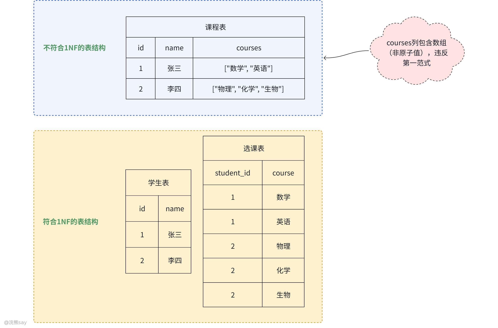
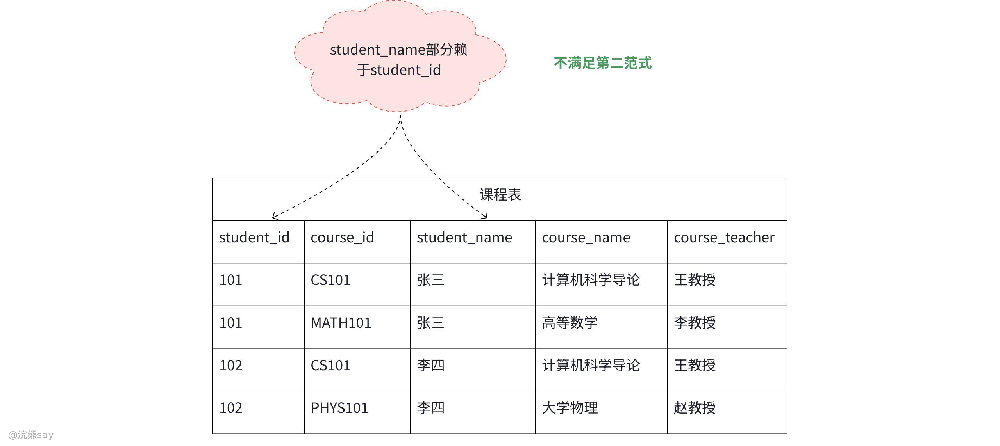
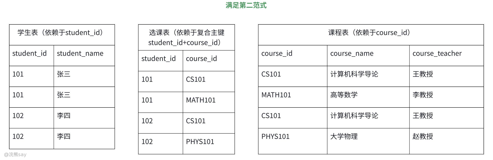
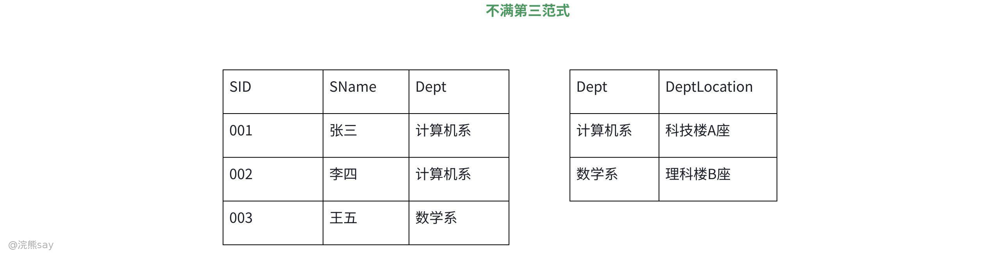

# 6、关系数据理论

**关系数据理论**

## 数据依赖

## 数据依赖概念

数据依赖是数据库系统的核心概念，指关系中属性（列）之间的相互依赖关系，反映了数据的内在逻辑关联，是数据库 schema（模式）设计与关系结构规范化的重要依据。理解数据依赖可有效避免数据冗余、插入异常、删除异常等问题，其主要类型包括函数依赖、多值依赖、连接依赖三类。

## 数据依赖对关系模式的影响

### 什么是关系模式？

关系模式是数据库中 关系（即数据表）的结构蓝图，它定义了一个关系的静态框架，明确了该关系包含哪些属性（列）、属性之间的逻辑关联（如数据依赖），以及属性的取值范围（域），是对关系本质特征的抽象描述，举个例子：

建立一个描述学校的数据库，以学校数据库为场景，涉及对象包括学生学号（SNO）、所在系（SDEPT）、系主任姓名（MNAME）、课程名（CNAME）、成绩（GRADE）。若数据库模式由单一关系模式 STUDENT 构成，其属性集合为：

现实世界中一个系有若干学生，但一个学生只属于一个系;一个系只有一名主任;一个学生可以选修多门课程，每门课程有若干学生选修;每个学生所学的每门课程都有一个成绩，由此可得到属性组U上的一组函数依赖F:

这个例子是一个典型的关系模式，通过属性集定义了 “学生 - 院系 - 课程 - 成绩” 的关联维度，通过函数依赖集明确了属性间的逻辑规则（如学号决定所在系、系别决定主任），后续所有学生的选课数据（关系实例）都必须遵循这个模式的结构存储，这也是数据依赖能影响关系模式合理性的前提。

### 数据依赖对关系模式的影响

1.  数据冗余过大：大量存储空间被浪费。例如，系主任姓名需随该系学生的每门课程成绩重复存储，重复次数与该系学生的课程成绩记录数完全一致；
2.  更新异常：数据冗余导致更新操作的完整性维护代价极高。例如，某系更换系主任后，需逐一修改所有该系学生相关的元组，否则会出现 “同一系主任不一致” 的数据矛盾；
3.  插入异常：符合业务逻辑的数据无法正常插入。例如，新成立的系尚未招收学生时，因缺少 “SNO”（学号）这一关键属性，无法将该系及系主任的基础信息存入数据库；
4.  删除异常：不应删除的核心数据被迫丢失。例如，某系学生全部毕业并删除其信息时，会同步删除该系及系主任的关联记录，导致历史院系信息丢失。

## 函数依赖（Functional Dependency，FD）

### 什么是函数依赖？

设关系模式 R (U) 是一个属性集 U 上的关系模式，X 和 Y 是 U 的子集。若对于 R (U) 的任意一个可能的关系 r，r 中不可能存在两个元组在 X 上的属性值相等，而在 Y 上的属性值不等，则称 “X 函数确定 Y” 或 “Y 函数依赖于 X”，记作 X→Y。

函数依赖体现了属性间的 “确定性关系”：当 X 的值确定时，Y 的值被唯一确定。这类似于数学中的函数—— 给定一个 x，只有唯一的 y 与之对应。

通俗的来说，函数依赖就是数据之间的 “决定关系”：只要一个属性（或一组属性）的值确定了，另一个属性的值就肯定能确定，打个比方：在学生表中，“学号” 确定了，“姓名” 就确定了（一个学号只对应一个学生），这就是 “学号→姓名” 的函数依赖；但 “姓名” 不能确定 “学号”（可能有重名），所以反过来不行。

### 平凡函数依赖与非平凡函数依赖

#### 平凡函数依赖

若 ，则称函数依赖 为平凡函数依赖，本质上来说，平凡函数依赖是必然成立的，无需任何额外条件，因为若 X 的值确定，则其任何子集 Y 的值自然确定。简单说，平凡函数依赖就是 “废话式” 的依赖关系，一听就觉得 “这不是 obvious 吗”，举个例子：如果一个表有 “姓名” 和 “年龄” 两列，那么 “姓名 + 年龄” 肯定能决定 “姓名”—— 因为 “姓名” 本身就包含在前面的组合里，这就是平凡函数依赖。

#### 非平凡函数依赖

若 ，则称函数依赖 为非平凡函数依赖，本质上来说，非平凡函数依赖揭示了属性间的 “非自包含” 约束关系，是数据库设计中需要重点关注的依赖类型。非平凡函数依赖，简单说就是 “有实际信息量” 的依赖关系 —— 用一些属性能确定另一个不包含在它们里面的属性，不是那种一眼就能看出来的废话，举个例子：学生表有 “学号” 和 “姓名”，“学号→姓名” 就是非平凡的。因为 “学号” 里不包含 “姓名”，但通过学号能唯一确定姓名，这是有实际意义的依赖。

#### 对比
| 特征 | 平凡函数依赖 | 非平凡函数依赖 |
| --- | --- | --- |
| 条件 |   |   |
| 是否必然成立 | 是 | 否（需依赖业务规则） |
| 语义价值 | 无（仅反映属性包含关系） | 有（揭示数据间的约束关系） |
| 规范化中的作用 | 通常忽略 | 关键分析对象 |
| 示例 |   |   |

### 完全函数依赖与部分函数依赖

#### 完全函数依赖（Full Functional Dependency）

设 是关系模式 R 的一个函数依赖，若对于 X 的任何一个真子集 ，都有 ，则称 Y 对 X完全函数依赖，记作 。

1.  Y 的值必须依赖于 X 的整体，而非部分属性。
2.  若 X 是复合属性集（由多个属性组成），则移除 X 中的任何一个属性后，剩余属性无法决定 Y。

举个例子，在关系模式 中，因为单独的 “学号” 或 “课程号” 无法确定 “成绩”，必须两者组合才能唯一确定，所以成绩对于学号和课程号完全函数依赖。

#### 部分函数依赖（Partial Functional Dependency）

设 是关系模式 R 的一个函数依赖，若存在 X 的真子集 使得 ，则称 Y 对 X部分函数依赖，记作 。

1.  Y 的值仅依赖于 X 的部分属性，而非整个 X。
2.  部分函数依赖通常出现在复合主键（由多个属性组成）的关系模式中。

举个例子，在关系模式 Student(学号，课程号，姓名，年龄)中：假设主键为（学号，课程号），则：，即姓名部分函数依赖于（学号，课程号）。因为一个学生的姓名肯定只依赖于其学号，而不依赖于课程号，所以姓名部分依赖于（学号，课程号）。

#### 对比
| 特征 | 完全函数依赖 | 部分函数依赖 |
| --- | --- | --- |
| 定义 | Y 依赖于 X 的整体 | Y 仅依赖于 X 的部分属性 |
| 条件 | 移除 X 中任何属性后，依赖不成立 | 存在 X 的真子集 使 |
| 主键依赖性 | 若 X 是主键，则 Y 必须依赖整个主键 | 若 X 是主键，Y 仅依赖主键的一部分 |
| 数据冗余风险 | 较低（依赖关系明确） | 较高（部分属性重复存储） |
| 规范化影响 | 符合第二范式（2NF）要求 | 违反第二范式（导致插入 / 更新异常） |
| 示例 |   |   |

### 传递函数依赖

设关系模式 _R_(_U_) 中，满足以下条件的函数依赖链：、、（Y 不是 X 的子集）、（Z 不是 Y 的子集）、（Y 不函数依赖于 X）。则称 Z 对 X 传递函数依赖，记作 ,本质上来说，Z 的值通过中间属性 Y 间接依赖于 X，而非直接依赖。传递依赖揭示了属性间的间接约束关系，是导致数据库冗余和异常的重要原因。

例如在关系，学生 - 系别 - 系主任中Student(学号，系名，系主任)，则存在传递依赖：，因为学生首先肯定是属于某个系，这个系再关联斗个系主任，因此，学生和系主任之间存在传递依赖。

## 浣熊真题
| 【国家电网2015】下面哪几个依赖是平凡函数依赖( )A. (Sno, Cname, Grade)→(Cname, Grade)B. (Sno,Cname)→(Cname,Grade)C. (Sno,Cname)→(Sname,Grade)D. (Sno, Sname)→Sname答案 ：AD解析 ：平凡函数依赖是指右边属性集是左边属性集的子集。选项 A 中右边的(Cname, Grade)是左边(Sno, Cname, Grade)的子集；选项 D 中右边的 Sname 是左边(Sno, Sname)的子集，均属于平凡函数依赖。选项 B 和 C 右边属性有不在左边属性集中的部分，属于非平凡函数依赖 |
| --- |

| 【国家电网】某销售公司数据库的零件关系 P(零件号，零件名称，供应商，供应商所在地，库存量)，函数依赖集 F={零件号→零件名称,(零件号，供应商)→库存量,供应商→供应商所在地}。零件关系 P 属于()。A. 1NFB. 2NFC. 3NFD. 4NF答案 ：A解析 ：基于函数依赖集 F，零件 P 关系中的(零件号，供应商)可决定零件 P 关系的所有属性，因此零件 P 关系的主键为(零件号，供应商)。又因为"(零件号，供应商)→零件名称"，而"零件号→零件名称"、"供应商→供应商所在地"，由此可知零件名称和供应商所在地都部分依赖于码，所以关系模式 P∈1NF。 |
| --- |

| 【国家电网】给定关系模式 R(U,F),其中,U 为关系模式 R 中的属性集,F 是 U 上的一组函数依赖。假设 U={A1,A2,A3,A4}，F={A1→A2,A1A2→A3,A1→A4,A2→A4}，那么函数依赖集 F 中的( )是冗余的。A. A1→A2B. A1A2→A3C. A1→A4D. A2→A4答案 ：C解析 ：根据原题给出的条件 F={A1→A2，A1A2→A3，A1→A4，A2→A4}，因此 A1 可以直接决定 A2，A1 可以直接决定 A4，A1 和 A2 可以决定 A3(传递依赖)，因此 A1A2A3A4 都找到了，所以 A1 就是一个超码。如果某个属性集能够蕴含全部的属性，并且它的任意真子集都不能蕴含全部属性，它才是主键。因为 A1 决定 A2，A1A2 决定 A3，A2 决定 A4，此时 A1A2A3A4 都已齐全，因此 A1→A4 是冗余的 |
| --- |

## 范式

## 什么是范式？

在数据库设计中，范式（Normalization） 是一套用于规范关系数据库表结构的规则体系，目的是通过消除数据冗余、避免数据操作异常（如插入 / 更新 / 删除异常），来确保数据的完整性和数据库的性能，其核心作用如下：

1.  消除数据冗余：避免同一数据在表中重复存储（如用户地址在多个表中重复记录）。
2.  保障数据一致性：减少因冗余导致的更新不一致问题（如修改用户地址时需更新多处）。
3.  优化操作效率：通过合理拆分表结构，提升查询、插入、更新等操作的性能。

范式可以分为第一范式(1NF)、第二范式(2NF)、第三范式(3NF)、第四范式(4NF)、第五范式(5NF)，范式之间的依赖关系为1NF>2NF>3NF>4NF>5NF。

## 第一范式——消除非原子性

### 第一范式概念

第一范式（1NF） 是关系型数据库规范化的最低要求，它确保数据库表的每一列都是原子性 的（不可再分），且不存在重复的记录组，具体规则如下：

1.  原子性：每列的值不可拆分（如不能存储逗号分隔的列表）。
2.  无重复组：表中不能有两行列完全相同的记录。
3.  列同质性：同一列的数据类型必须相同。

### 第一范式示例

如上图所示，课程表中，courses中存在的课程还能进一步拆分，比如\[“数学”,“英语”\]可以拆分成独立的课程表，因此不满足原子性的要求，不满足第一范式。因此，改造后的符合第一范式的表是将课程单独拆分出来。

### 第一范式存在的问题

1.  数据冗余：1NF虽消除了非原子性，但可能存在数据冗余。例如，当多个学生选修同一门课程时，课程名称会在enrollments表中重复存储。
2.  更新异常：

-   插入异常：若新增一门课程但暂无学生选修，由于依赖student\_id，无法独立插入课程信息。
-   删除异常：若删除某学生的所有选课记录，当该学生是唯一选修此课程的学生时，可能会无意中删除课程本身。
-   修改异常：修改课程名称时，需要更新所有相关记录，否则会出现数据不一致的情况。

1.  表结构刚性：若需要新增课程属性（如course\_teacher），必须修改原表结构，这违反了开闭原则。

## 第二范式——消除部分依赖

### 第二范式概念

第二范式（2NF）是数据库设计中的一个重要规则，它要求数据库表中的非主属性必须完全依赖于主键，而不能只依赖于主键的一部分，即消除部分依赖。在数据库中部分依赖指的是，在一个复合主键（由多个字段组成）的表中，某个非主属性只依赖于主键中的一部分字段，而非整个主键。这种依赖关系会导致数据冗余和更新异常等问题。要满足第二范式，需要确保：

1.  表满足第一范式（所有字段都是原子性的，不可再分）。
2.  非主属性完全依赖于整个主键，而不是主键的一部分。

第二范式主要有以下作用：

1.  减少数据冗余：避免了重复存储部分依赖的数据
2.  消除更新异常：修改学生姓名或课程信息时，只需在一个地方修改
3.  提高数据完整性：数据存储更加合理，减少了不一致的可能性

但是第二范式仅解决了 “部分依赖” 带来的问题，并未处理 “传递依赖”—— 即非主属性不直接依赖于主键，而是通过某个中间属性间接依赖于主键的情况，这一局限性导致其仍存在明显缺陷：

1.  数据冗余：传递依赖导致重复存储（如部门位置随员工记录重复）；
2.  操作异常：修改传递依赖数据需更新多处（如修改部门位置需改所有该部门员工记录）；新增无主键关联的中间属性数据无法插入（如新增部门无员工时，无法录入部门位置）；删除主键记录可能连带删除传递依赖数据（如删除所有员工导致部门信息丢失）。

第二范式优化了复合主键场景下的数据存储结构，减少冗余与更新异常，但由于其未解决传递依赖问题，仍存在数据冗余和操作异常的隐患，因此在实际数据库设计中，通常需要在 2NF 的基础上进一步遵循第三范式（3NF），通过消除传递依赖实现更严谨、高效的数据存储方案。

### 第二范式示例

为了解释什么是第二范式，假设有一个课程注册系统，设计了如下的表结构：

这个表的主键是(student\_id, course\_id)的组合，但是：student\_name只依赖于student\_id而course\_name和course\_teacher只依赖于course\_id，这些都是部分依赖，会导致数据冗余（比如每个学生选的每门课都要重复存储学生姓名和课程信息），分解为符合第二范式的表可以将上面的表分解为：

经过改造后，学生表的主键是student\_id，所有字段完全依赖于它；课程表的主键是course\_id，所有字段完全依赖于它；选课表的主键是(student\_id, course\_id)，没有非主属性，因此上述的表结构均满足第二范式，即消除了部分依赖。

### 第二范式存在的问题

1.  存在传递依赖问题：第二范式仅消除了部分依赖，但未处理非主属性之间的传递依赖。即：非主属性 A 依赖于非主属性 B，而 B 依赖于主键，导致 A 通过 B 间接依赖于主键。
2.  数据冗余问题：传递依赖会导致数据重复存储。例如：员工表中部门位置依赖于部门 ID，而部门 ID 依赖于员工 ID，同一部门的位置信息会随员工数量多次重复。
3.  更新异常问题：修改传递依赖的数据时需更新多处记录，易遗漏导致数据不一致。例如：修改部门位置时，需更新该部门所有员工的记录，若漏改则产生矛盾。
4.  插入异常问题：若传递依赖的中间属性（如部门 ID）无主键关联时，无法插入数据。例如：新增部门但无员工时，因无员工 ID（主键）无法录入部门位置信息。
5.  删除异常问题：删除主键记录可能连带删除传递依赖的数据。例如：删除某部门所有员工时，该部门的位置信息会被一并删除，导致部门数据丢失。

## 第三范式——消除传递依赖

### 第三范式概念

第三范式（3NF） 是数据库设计中的规范化理论概念，其核心目标是消除关系模式中的传递函数依赖，确保数据的一致性和完整性。其核心要求是在满足第二范式（2NF）的基础上，数据库表中的非主属性不能传递依赖于主键，即：每个非主属性必须直接依赖于主键，而非通过其他非主属性间接依赖。

若关系模式 R 属于第二范式（2NF），且每个非主属性都不传递依赖于 R 的候选键，则 R 属于第三范式。传递函数依赖：设 X、Y、Z 是关系 R 的三个属性（或属性组），若 X→Y（Y 不包含于 X，且 Y→X 不成立），Y→Z（Z 不包含于 Y），则称 Z 传递依赖于 X。

### 第三范式示例

假设存在学生表，由学生id、学生名、系名称、位置组成，Student(SID, SName, Dept, DeptLocation)，首先学生名称和所属院系是依赖于学生id的，因此存在完全函数依赖：SID → SName, Dept，而系地址通过系名间接依赖于学号，即SID→ Dept→ DeptLocation，因此存在传递依赖，因此不满足第三范式。

如上图所示，进行规范化后的 3NF 关系模式，学生表Student(SID, SName, Dept)；部门表 Department(Dept, DeptLocation)。消除传递依赖，在 Student 表中，非主属性（SName, Dept）直接依赖于主键 SID，在 Department 表中，非主属性 DeptLocation 直接依赖于主键 Dept。

### 第三范式存在问题

1.  未消除主属性之间的依赖：3NF仅约束非主属性对候选键的依赖，不限制主属性之间的依赖关系。例如，关系模式R(A, B, C)的候选键为(A,B)，存在依赖B→C，而C属于候选键的一部分（主属性），此时R满足3NF，但C依赖于部分主属性B，可能导致数据冗余。
2.  多值依赖问题：当关系中存在多值依赖时，3NF无法解决此类问题。例如，关系Teacher(Course, Student, Book)中，一门课程可由多个学生选修且对应多本教材，存在多值依赖Course→→Student和Course→→Book，即使满足3NF，仍可能存在数据冗余（需进一步规范化为第四范式4NF）。
3.  过度规范化的风险：

-   拆分关系可能导致表数量增多，增加关联查询的复杂度和性能开销；
-   若拆分不合理，可能破坏业务逻辑的完整性（如忽略属性间的隐含依赖关系）。

## 浣熊真题
| 【国家电网】某销售公司数据库的零件关系 P(零件号，零件名称，供应商，供应商所在地，库存量)，函数依赖集 F={零件号→零件名称,(零件号，供应商)→库存量,供应商→供应商所在地}。零件关系 P 属于()。A. 1NFB. 2NFC. 3NFD. 4NF答案 ：A解析 ：基于函数依赖集 F，零件 P 关系中的(零件号，供应商)可决定零件 P 关系的所有属性，因此零件 P 关系的主键为(零件号，供应商)。又因为"(零件号，供应商)→零件名称"，而"零件号→零件名称"、"供应商→供应商所在地"，由此可知零件名称和供应商所在地都部分依赖于码，所以关系模式 P∈1NF |
| --- |

| 【国家电网】设有关系 W(工号,姓名,工种,定额),将其规范化到第三范式,正确的答案是()。A. W1(工号，姓名)，W2(工种，定额)B. W1(工号，工种，定额)，W2(工号，姓名)C. W1(工号，姓名，工种)，W2(工种，定额)D. W1(工号，姓名),W2（工号，姓名）答案 ：C解析 ：该关系的函数依赖集为{工号→姓名，工号→工种,工种→定额}，候选码为"工号"。经分析可知："定额"经"工种"传递函数依赖于"工号"，这个传递依赖应消除。选项 A 中的两个关系没有公共属性，不正确。选项 B 中未消除传递依赖。正确的规范化是将关系分解为 W1(工号，姓名，工种)和 W2(工种，定额)，这样消除了传递依赖，达到第三范式 |
| --- |

| 【中国银行2022】能使一个关系从第一范式转化为第二范式的条件是（）。A. 每一个非属性都完全函数依赖主属性B. 每一个非属性都部分函数依赖主属性C. 在一个关系中没有非属性存在D. 主键由一个属性构成答案 ：A解析 ：第二范式(2NF)要求实体的属性完全依赖于主关键字。所谓完全依赖是指不能存在仅依赖主关键字一部分的属性，如果存在，那么这个属性和主关键字的这一部分应该分离出来形成一个新的实体，新实体与原实体之间是一对多的关系。因此，每一个非属性都完全函数依赖主属性是关系从第一范式转化为第二范式的条件 |
| --- |

| 【国家电网】在关系模式 R(A,B,C,D)中，有函数依赖集 F={B→C,C→D,D→A)}，则 R 能达到()。A. 1NFB. 2NFC. 3NFD. 以上三者都不行答案 ：B解析 ：该关系模式的候选码是 B，因为 B→C,C 不能确定 B，C→D，所以存在非主属性 D 对候选码的传递函数依赖，R 不是 3NF。又因为不存在非主属性对候选码的部分函数依赖，所以 R 是 2NF |
| --- |
