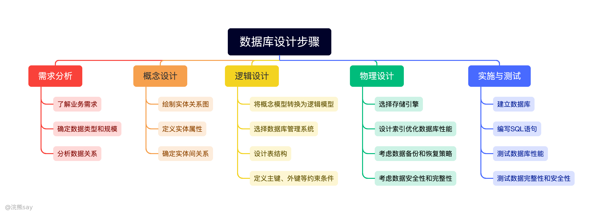
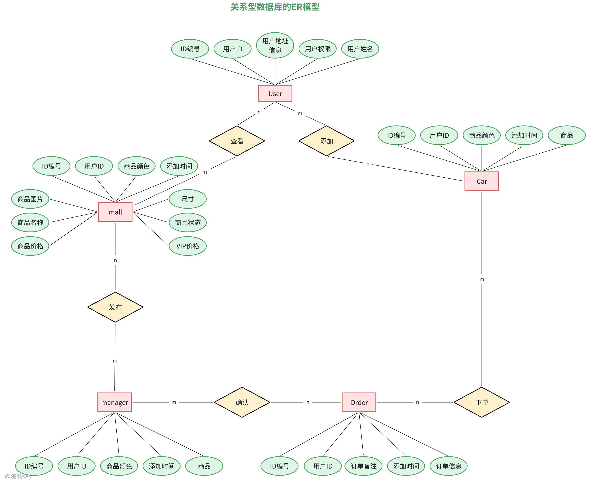
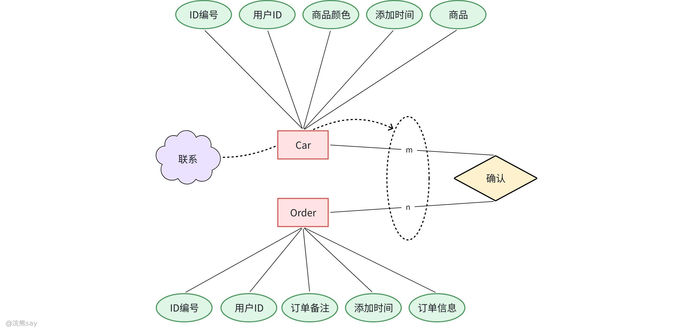

# 7、数据库设计与实现

**数据库设计与实现**

## 数据库设计步骤

数据库设计步骤

1.  **需求分析：**与业务 stakeholders 沟通，通过访谈、用例分析等方式梳理核心业务流程（如电商的购物车、支付流程），明确数据输入/输出项、业务规则（如库存扣减逻辑）及约束条件（如唯一键、数据范围），最终形成包含数据字典、数据流图的需求规格说明书。
2.  **概念设计：**基于需求文档，使用实体-关系图（E-R 图）抽象系统数据模型，识别核心实体（如用户、商品、订单）及其属性（如用户 ID、姓名、邮箱），定义实体间关系（如订单与用户的“多对一”、订单与商品的“多对多”），确保模型覆盖所有业务场景。
3.  **逻辑设计：**将 E-R 图转换为具体数据库表结构，遵循关系模型规范，将实体映射为表、属性映射为字段、关系映射为外键或中间表（如“用户-角色”多对多关系拆分为 user\_role 表），同时应用三范式消除数据冗余（如避免非主属性对主键的部分依赖或传递依赖）。
4.  **物理设计**：根据数据库选型（如 MySQL、PostgreSQL）和业务场景，选择合适的存储引擎（如 InnoDB 支持事务）、设计索引策略（为高频查询字段创建复合索引）、规划表分区（如按时间范围拆分历史数据），并优化字段类型（如用 TINYINT 代替 INT 存储布尔值）。
5.  **实施建库：**使用 DDL 语句创建数据库、表结构及约束（如 PRIMARY KEY、UNIQUE），编写数据导入脚本迁移历史数据，通过单元测试验证表关联的完整性（如外键约束是否生效），并生成初始数据快照用于开发环境。
6.  **性能测试：**通过数据库性能监控工具（如 EXPLAIN 分析查询计划）定位慢查询，针对热点数据优化索引（如覆盖索引）或表结构（如垂直拆分大字段），测试事务并发处理能力（如模拟 100+ 用户同时下单），调整参数（如 InnoDB 缓冲池大小）提升吞吐量。
7.  **文档维护：**编写数据库设计文档（包含表结构、索引设计、物理模型图），建立版本控制（如使用 Git 管理 SQL 脚本），根据业务变更（如新功能需求）评估对现有表结构的影响，通过 ALTER TABLE 语句安全演进数据库 schema，并更新相关文档与测试用例。

| 【中国铁塔2021】在关系数据库设计中，设计关系模式是数据库设计中（ ）阶段的任务A.逻辑设计B.物理设计C.需求分析D.概念设计答案：A解析：数据库设计包括六个主要步骤：1.需求分析（了解用户需求）；2.概念设计（设计 E-R 模型）；3.逻辑设计（设计模式和外模式，如关系模式）；4.物理设计（设计存储结构）；5.系统实施；6.运行维护 |
| --- |

## 概念设计

## 概念设计常用术语

1.  **概念模型**：用于信息世界的建模工具，是现实世界与机器世界之间的核心中间层次，也是数据库设计阶段的关键建模载体，能够清晰映射现实事物的关联逻辑。
2.  **实体**：客观存在、可相互区分且具有独立意义的事物，既可以是具体的人、事、物（如学生、图书），也可以是抽象的概念（如订单、项目）。
3.  **属性**：实体所具备的固有特性，一个实体可通过若干个属性完整刻画其核心信息（如 “学生” 实体可通过学号、姓名、年龄等属性描述）。
4.  **码**：唯一标识实体的最小属性集（即无冗余属性的属性组合），确保实体在集合中具有唯一性。
5.  **域**：属性的合法取值范围，限定了属性的数值、类型或格式边界（如 “性别” 的域为 {男，女}）。
6.  **实体型**：用 “实体名 + 属性名集合” 共同抽象、刻画同类实体的统一结构，是对某类实体的标准化描述（如 “学生（学号，姓名，性别，出生日期）”）。
7.  **实体集**：具有相同实体型的所有实体构成的集合，即同类实体的整体（如 “2024 级全体本科生”“图书馆所有馆藏图书”）。
8.  **联系**：现实世界中事物内部或事物之间的关联关系，在信息世界中对应两类形式：
9.  实体内部的联系：同一实体中各属性之间的逻辑关联（如 “学生” 实体中 “出生日期” 与 “年龄” 的推导关联）；
10.  实体之间的联系：不同实体集之间的业务关联（如 “学生” 与 “课程” 之间的选课关联）。

## 概念模型——实体联系

1.  **一对一联系（1:1）：**实体集 A 中的一个实体最多与实体集 B 中的一个实体相关联，反之亦然。例如，一个人只有一个身份证号码，一个身份证号码也只对应一个人。
2.  **一对多联系（1:n）：**实体集 A 中的一个实体可以与实体集 B 中的多个实体相关联，而实体集 B 中的一个实体只能与实体集 A 中的一个实体相关联。如一个班级可以有多个学生，但一个学生只能属于一个班级。
3.  **多对多联系（m:n）：**实体集 A 中的一个实体可以与实体集 B 中的多个实体相关联，实体集 B 中的一个实体也可以与实体集 A 中的多个实体相关联。比如，一个学生可以选修多门课程，一门课程也可以被多个学生选修。

## 概念模型——ER图

ER 模型（Entity-Relationship Model，实体 - 联系模型）由美籍华裔计算机科学家陈品山（Peter Chen）于 1976 年提出，是描述现实世界数据结构与关联关系的经典概念模型，也是数据库设计的基础工具，至今仍广泛应用于需求分析与逻辑设计阶段。

### 实体（Entity）

现实世界中可唯一区分、且具备可描述属性的 “事物” 或 “对象”，既包括具体实体（如学生、图书、订单），也包括抽象概念（如课程、合同、活动）。每个实体拥有若干属性，其中能唯一标识该实体的属性（或最小属性集）称为主键（Primary Key），例如 “学生” 实体的主键可为 “学号”，“图书” 实体的主键可为 “ISBN 编号”。

### 实体集（Entity Set）

具有相同实体型（即相同属性结构）的同类实体的集合，是对某一类事物的整体抽象。例如：“某高校所有在校学生” 构成 “学生” 实体集，“某电商平台所有在售商品” 构成 “商品” 实体集，“某公司所有部门” 构成 “部门” 实体集。

### 属性（Attribute）

用于描述实体或联系特性的基本信息单元，每个属性都有明确的取值范围（即域）。根据特性不同，属性可分为以下类别：

1.  **简单属性**：不可进一步拆分的原子属性，如 “年龄”“性别”“手机号”；
2.  **复合属性**：由多个相互关联的简单属性组合而成，可拆分为独立子属性，如 “地址” 可拆分为 “省、市、区、详细地址”，“联系人信息” 可拆分为 “姓名、电话、邮箱”；
3.  **单值属性**：一个实体在该属性上仅能拥有一个取值，如 “学号”“身份证号”“员工编号”；
4.  **多值属性**：一个实体在该属性上可拥有多个取值，如 “学生的联系方式”（可包含手机号、家庭电话、邮箱）、“商品的标签”（可包含 “新品”“折扣”“热销”）；
5.  **派生属性**：无需直接存储，可通过其他属性计算或推导得出的属性，如 “年龄” 可由 “出生日期” 和当前日期推导，“订单总金额” 可由 “商品单价 × 购买数量” 计算得出。

### 联系（Relationship）

实体集之间的有意义关联，直接映射现实世界的业务逻辑关系（如 “学生选课”“员工入职部门”“客户订购商品”）。联系同样分为 1:1、1:n、m:n 三类，同类联系的集合称为 “联系集”—— 例如所有 “学生与课程的选课关联记录”，共同构成 “选课” 联系集；所有 “员工与部门的隶属关联记录”，共同构成 “隶属” 联系集。

### ER图的表示方法

ER模型通常用**ER图（Entity-Relationship Diagram）** 可视化，核心符号包括：
| 元素 | 图形表示 | 示例 |
| --- | --- | --- |
| 实体 | 矩形框 | □ 学生 |
| 属性 | 椭圆形框 | ○ 学号（下划线标注主键） |
| 联系 | 菱形框 | ◇ 选课 |
| 实体-联系连接 | 无向边 | 学生 ——◇—— 课程 |
| 属性-实体连接 | 无向边 | 学生 ——○ 姓名 |

## 浣熊真题
| 【中国铁塔2021】概念模型是（ ）A.用于信息世界的建模，与具体的 DBMS 有关B.用于信息世界的建模，与具体的 DBMS 无关C.用于现实的建模，与具体的 DBMS 有关D.用于现实的建模，与具体的 DBMS 无关答案：B解析：概念模型（Conceptual Data Model）是面向数据库用户的现实世界模型，用于描述世界的概念化结构，与具体 DBMS 无关，需转换为逻辑数据模型才能在 DBMS 中实现 |
| --- |

| 【国家电网】在数据库技术中，实体－联系模型是一种()A.概念数据模型B.结构数据模型C.物理数据模型D.逻辑数据模型答案：A解析：实体-联系模型（E-R 模型）是概念数据模型，用于抽象描述现实世界的实体及联系 |
| --- |

## 逻辑设计

## 逻辑设计概念

数据库逻辑设计是连接概念设计与物理实现的核心桥梁，其核心任务是将概念设计阶段产出的 E-R 图等概念模型，转化为特定数据库管理系统（DBMS）支持的逻辑数据模型（如关系模型），并通过结构化优化确保数据库满足业务需求、性能高效且数据可靠。

1.  将概念模型（如E-R图）转换为特定DBMS支持的逻辑数据模型（如关系模型）。
2.  确定数据之间的关系和约束，确保数据的完整性和一致性。
3.  优化逻辑结构，减少数据冗余，提高查询效率。

通过上面三点，精准映射现实业务逻辑，建立结构清晰的逻辑数据结构；明确数据间的关联关系与约束规则，保障数据完整性与一致性；通过冗余精简、查询路径优化等手段，提升数据操作效率。

## ER图转换成逻辑模型的原则

### 实体的转换

概念模型中的每个实体直接对应一个关系表，表名与实体名保持一致（可根据命名规范微调）；实体的属性转化为表的字段，属性的数据类型、约束条件同步映射为字段的定义；实体的主键直接作为关系表的主键，确保实体记录的唯一性。示例：“学生” 实体（属性：学号、姓名、年龄）转换为 “学生表”，字段定义为 “学号（主键）、姓名、年龄”，字段类型分别匹配属性的取值特性（如学号为字符型、年龄为数值型）。

### 实体间关系的转换

**一对一关系（1:1）**：两种常见实现方式，一是在任意一方实体对应的表中，添加另一方实体的主键作为外键（如 “学生” 与 “学生证” 1:1 关联，可在 “学生证表” 中增加 “学号” 字段作为外键，关联 “学生表” 主键）；二是当两个实体属性关联紧密时，可直接合并为一张表（如 “用户” 与 “用户详情” 1:1 关联，合并为 “用户表” 包含双方属性）。

**一对多关系（1:n）**：统一采用 “外键关联” 方案，在 “多” 端实体对应的表中，添加 “一” 端实体的主键作为外键。示例：“班级” 与 “学生” 1:n 关联，在 “学生表” 中新增 “班级 ID” 字段作为外键，关联 “班级表” 的主键 “班级 ID”，实现学生对班级的归属映射。

**多对多关系（m:n）**：需新增独立的 “关联表”（又称中间表），该表的主键为两个关联实体主键的组合（联合主键），同时通过这两个字段分别关联对应实体表的主键。示例：“学生” 与 “课程” m:n 关联，创建 “选课表”，包含 “学号”“课程号” 两个字段作为联合主键，分别关联 “学生表” 的 “学号” 和 “课程表” 的 “课程号”，存储每一组选课关联记录。

### 属性的处理

针对概念模型中的复杂属性，需转换为符合关系模型要求的基础形式：复合属性（如 “地址” 含省、市、区）需拆分为多个独立字段，直接纳入实体对应的表中；多值属性（如 “学生兴趣”“联系方式”）需单独创建关联表，通过外键与原实体表关联（如 “学生兴趣表” 包含 “学号”“兴趣名称” 字段，“学号” 关联 “学生表” 主键）；派生属性（如 “年龄” 由 “出生日期” 推导）通常不直接存储，仅在查询时通过计算获取，避免数据冗余与不一致。

## 逻辑结构的优化

### 范式化设计

范式化是消除数据冗余、解决操作异常的核心手段，需根据业务场景逐步满足各级范式要求：

**1NF（第一范式）**：属性不可再分（如“姓名”不能拆分为“姓”和“名”存于同一字段）。

**2NF（第二范式）**：在1NF基础上，非主键属性完全依赖于主键（如复合主键“学号+课程号”决定“成绩”，而非单独依赖“学号”）。

**3NF（第三范式）**：在2NF基础上，消除非主键属性对主键的传递依赖（如“学生表”中“学号→班级ID→班级名称”，应拆分“班级表”独立存储“班级ID”和“班级名称”）。

但是，过度范式化会导致表数量增多、查询关联复杂，需平衡 “范式化” 与 “反范式化”—— 对于查询频繁、关联复杂的场景，可适当保留少量冗余字段（如订单表中存储 “商品名称”，避免每次查询关联商品表），以提升查询效率。

### 索引设计

索引是提升查询、排序与关联效率的关键，需针对核心业务场景精准设计：主键字段默认创建聚簇索引，保障主键查询的高效性；频繁作为查询条件（如 “学生表” 的 “姓名”“手机号”）、排序字段（如 “订单表” 的 “创建时间”）或关联字段（如外键字段）的字段，需创建非聚簇索引；避免为更新频繁、取值重复率高（如 “性别” 字段）的字段创建索引，同时控制单表索引数量，防止索引过多导致插入、更新操作性能下降。

### 表结构优化

针对表的规模与业务关联特性，进行结构化调整：拆分大表，将不常用字段（如 “用户表” 的 “个人简介”）、大字段（如文本、图片 URL）拆分至独立表，减少核心查询的数据量；合并小表，对于关联紧密、查询时必联合查询的小表（如 “用户基本信息表” 与 “用户登录信息表”），可合并为一张表，减少表连接次数；合理设计字段类型，根据属性取值范围选择最小可行的字段类型（如 “年龄” 用 TINYINT 而非 INT），缩短数据存储长度与查询 IO 时间。

## 浣熊真题
| 【中国铁塔2021】在关系数据库设计中，设计关系模式是数据库设计中（ ）阶段的任务A. 逻辑设计B. 物理设计C. 需求分析D. 概念设计答案：A解析：数据库设计分为需求分析、概念设计、逻辑结构设计、物理结构设计等六个步骤。其中逻辑结构设计阶段的任务是设计系统的模式和外模式，对于关系模型而言，主要就是设计基本表（关系模式）和视图 |
| --- |

| 【国家电网2020】数据库逻辑结构设计是指从数据库概念模型出发，设计表示为逻辑模式的数据库逻辑结构。其主要步骤包括 ER 图转换为初始关系模式、对初始关系模式进行优化等。这一过程属于数据库设计的哪个阶段？A. 需求分析B. 概念设计C. 逻辑设计D. 物理设计答案：C解析：数据库逻辑结构设计是从数据库概念模型（如 E-R 模型）出发，设计表示为逻辑模式的数据库逻辑结构，核心任务是将 ER 图转换为初始关系模式并优化，属于数据库设计的逻辑设计阶段 |
| --- |

## 物理设计

## 物理设计概念

数据库物理设计是在逻辑设计的基础上，结合特定数据库管理系统（DBMS）的特性与硬件环境，对数据的存储结构、存取方式进行具象化设计与优化的关键环节。其核心目标是将抽象的逻辑数据模型转化为可落地的物理存储方案，保障数据库运行的高效性、稳定性与资源利用率 —— 其设计质量直接决定数据库的 I/O 效率、资源占用率及业务响应速度，具体核心任务包括：

1.  存储结构设计：确定数据在存储介质上的组织方式，包括数据页的大小、记录的存储格式、索引的结构等。
2.  存取方法设计：设计如何快速访问数据的方法，如索引的选择、聚簇的设计等。
3.  物理优化：对数据库的物理结构进行优化，以提高数据库的性能，如调整数据的存储位置、分配存储空间等

## 物理设计的步骤

### 确定数据的存储结构

-   数据页大小的选择：数据页的大小会影响数据库的 I/O 效率。较大的数据页可以减少 I/O 次数，但会占用更多的存储空间；较小的数据页则相反。一般来说，数据页的大小应根据数据库的应用场景和数据量来选择。
-   记录的存储格式：记录的存储格式包括字段的存储顺序、数据类型的存储方式等。合理的存储格式可以提高数据的存取效率。
-   索引的结构：索引是一种用于快速查找数据的结构。常见的索引结构有 B 树索引、哈希索引等。不同的索引结构适用于不同的查询场景。

### 设计存取方法

-   索引的选择：根据查询需求，选择合适的字段建立索引。索引可以提高查询效率，但会增加插入、更新和删除操作的开销。因此，在选择索引时，需要权衡查询效率和更新效率。
-   聚簇的设计：聚簇是将相关的数据记录存储在一起的一种方法。聚簇可以提高相关数据的查询效率，但会影响数据的插入和更新操作。

### 物理优化

-   调整数据的存储位置：将频繁访问的数据存储在快速存储设备上，如固态硬盘（SSD），以提高数据的存取效率。
-   分配存储空间：合理分配存储空间，避免数据存储过于分散，以提高数据的存取效率。
-   优化数据库参数：根据数据库的应用场景和硬件环境，优化数据库的参数，如缓冲区大小、日志文件大小等。

## 浣熊真题
| 【国家电网】根据系统所提供的存取路径，选择合理的存取策略，这种优化方式称为()。A.物理优化B.代数优化C.规则优化D.代价估算优化【答案】 A【解析】 物理优化是根据数据字典中的存取路径、数据的存储分布以及聚簇情况等信息来选择低层的存取路径。 |
| --- |

| 【国家电网2019】数据库中，数据的物理独立性是指()A.数据库与数据库管理系统的相互独立B.用户程序与 DBMS 的相互独立C.用户的应用程序与存储在磁盘上数据库中的数据是相互独立的D.应用程序与数据库中数据的逻辑结构相互独立答案 ：C解析 ：物理独立性是指应用程序与存储在磁盘上的具体数据相互独立，即数据物理存储结构改变时，应用程序无需修改 |
| --- |
