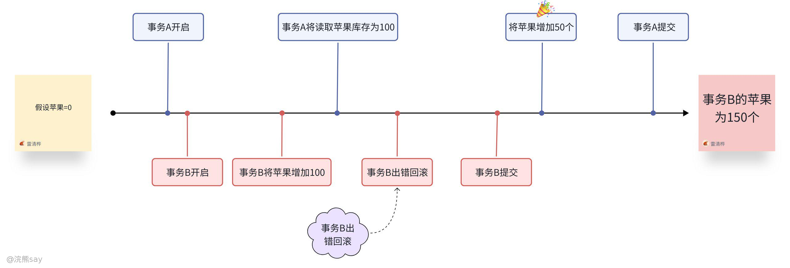
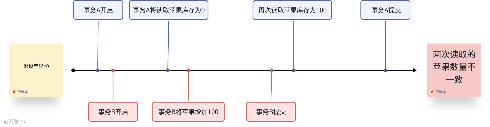
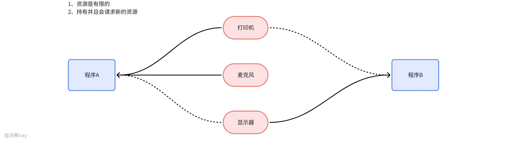

# 8、数据库并发控制

**数据库并发控制**

## 数据库并发控制

## 什么是并发控制？

数据库并发控制是多用户环境下保障数据可靠性的核心机制，指当多个用户或应用程序同时访问、操作数据库时，通过一系列协调策略对并发事务进行管理，避免数据一致性、完整性与隔离性遭到破坏。在事务并行执行场景中，若缺乏有效控制，易引发丢失修改、脏读、不可重复读、幻读等问题 —— 例如电商平台中两个用户同时修改同一商品库存，后提交的事务可能覆盖先提交的修改结果，导致数据失真。

其核心目标是严格保障事务的 ACID 特性（原子性、一致性、隔离性、持久性），其中隔离性是并发控制的核心聚焦点。常用实现技术包括：锁机制（按粒度可分为表锁、行锁等，按类型可分为共享锁、排他锁，通过锁定资源避免冲突）；多版本并发控制（MVCC，为数据维护多个版本，允许读写操作并行执行，减少锁竞争）；乐观 / 悲观并发控制（乐观策略默认无冲突，仅在提交时校验，适用于低冲突场景；悲观策略默认有冲突，提前锁定资源，适用于高冲突场景）。此外，数据库通过定义读未提交、读已提交、可重复读、可串行化四个隔离级别，实现 “并发性” 与 “数据一致性” 的平衡，用户需结合业务场景（如电商高并发读场景、银行高并发写场景）选择适配策略，在确保数据准确性的前提下最大化系统处理效率。

## 并发控制的主要问题

### 丢失修改（Lost Update）

丢失修改是指多个事务同时针对同一数据执行修改操作时，后提交的事务会覆盖先提交事务的修改结果，导致先提交事务的变更永久丢失。典型场景如电商库存管理：商品初始库存为 10，用户 A 发起事务将库存从 10 改为 8 并提交，同一时间用户 B 发起事务读取到初始库存 10，改为 9 后提交，最终数据库中库存为 9，用户 A 的修改被完全覆盖，造成数据不一致。

### 脏读（Dirty Read）

[脏读](https://www.baidu.com/s?rsv_idx=1&wd=%E8%84%8F%E8%AF%BB&fenlei=256&usm=1&ie=utf-8&rsv_pq=a40505a80005b733&oq=%E8%84%8F%E8%AF%BB&rsv_t=0440X5YQwQVifNJqf88SbOm02NKnsWPA5L5qDv%2BJiP8KAFjZD9CRxz6Cbto&sa=re_dqa_generate)（Dirty Read）是指在[数据库管理](https://www.baidu.com/s?rsv_idx=1&wd=%E6%95%B0%E6%8D%AE%E5%BA%93%E7%AE%A1%E7%90%86&fenlei=256&usm=1&ie=utf-8&rsv_pq=a40505a80005b733&oq=%E8%84%8F%E8%AF%BB&rsv_t=89ceizhu_TXCXLZajyt%2BpG9nfKjki_NuZup7kBrDe5oHrSaFBrgQ27syins&sa=re_dqa_generate)中，一个事务读取了另一个事务未提交的数据。 这种情况会导致数据的不一致性，因为被读取的数据可能最终会被回滚。脏读主要发生在更新操作中，当一个事务正在访问数据并对其进行修改，而另一个事务也访问这些数据时，可能会导致基于未提交数据的操作不正确。

脏读会导致数据的不一致性，因为被读取的数据可能最终会被回滚。例如，事务T1修改了某个值，事务T2读取了这个值，然后T1因为某种原因撤销了对该值的修改，这时T2读取到的数据就是无效的。这种情况会导致基于脏数据所做的操作可能是不正确的，为了避免脏读，可以采取以下措施：

1.  使用事务隔离级别：将事务的隔离级别设置为可重复读（Repeatable Read）或更高，这样可以防止一个事务中的更改影响到另一个事务的读取操作。
2.  锁定机制：在读取数据时加锁，确保在数据提交之前，其他事务不能读取该数据。
3.  优化事务设计：合理安排事务的执行顺序和时间，减少并发冲突的可能性。

### 不可重复读（Non-Repeatable Read）

[不可重复读](https://www.baidu.com/s?rsv_idx=1&wd=%E4%B8%8D%E5%8F%AF%E9%87%8D%E5%A4%8D%E8%AF%BB&fenlei=256&usm=1&ie=utf-8&rsv_pq=9187aaad00744882&oq=%E4%B8%8D%E5%8F%AF%E9%87%8D%E5%A4%8D%E8%AF%BB&rsv_t=b8c4WQkddD0tSQ8HeXjpLR4i4PrqN1QHWSC%2B4iM2f_Lbn4uEqDICij36sFE&sa=re_dqa_generate)（Non-repeatable Read）是指在一个事务内，多次读取同一数据时，由于其他事务的修改，导致第一次和第二次读取的数据不一致。这种情况发生在同一个事务中，对同一批数据的多次读取结果不同。

不可重复读的主要原因是其他事务在第一个事务的读取过程中对数据进行了修改并提交。例如，事务A多次读取同一数据，而事务B在事务A多次读取的过程中修改了该数据并提交，导致事务A多次读取的结果不一致。如上图的例子来说，最开始的苹果数量为0，事务A读取到的苹果库存为0，这时候事务B将苹果增加了100，这个时候事务B在读取苹果数量的时候就变成了100，这样就出现了不可重复读。

为了解决不可重复读问题，可以使用更严格的隔离级别，如可串行化隔离级别，或者使用行级锁或多版本并发控制（‌[MVCC](https://www.baidu.com/s?rsv_idx=1&wd=MVCC&fenlei=256&usm=1&ie=utf-8&rsv_pq=9187aaad00744882&oq=%E4%B8%8D%E5%8F%AF%E9%87%8D%E5%A4%8D%E8%AF%BB&rsv_t=4aaetibS4TCWiMof%2B_liPMi7FMBYnmendeaOxrs5cV7QZQKS_9PZyQb2t4k&sa=re_dqa_generate)）。这些方法可以确保在一个事务执行过程中，其他事务的修改不会影响到该事务的读取结果。

### 幻读（Phantom Read）

[幻读](https://www.baidu.com/s?rsv_idx=1&wd=%E5%B9%BB%E8%AF%BB&fenlei=256&usm=3&ie=utf-8&rsv_pq=a6214c88004b42c2&oq=%E5%B9%BB%E8%AF%BB&rsv_t=794b2IYQzjS2yOAnk%2BMbHueXCB5cfZuxnb37JlsLGmygadzgpTF9E6zX_ao&sa=re_dqa_generate)（Phantom Read）是指当事务不是独立执行时发生的一种现象。 具体来说，当一个事务在读取某个范围内的记录时，另一个事务又在该范围内插入了新的记录，当第一个事务再次读取该范围时，会发现有“幻影”数据出现，仿佛第一次读取时这些数据就不存在。12

幻读的产生通常是因为多个事务在并发执行时，对同一数据集进行操作。例如，事务A读取了某个范围内的数据，事务B在这个范围内插入了新的数据，当事务A再次读取时，会发现有新的数据出现，仿佛第一次读取时这些数据就不存在一样。

解决幻读的方法通常是通过增加范围锁（Range Locks），这样可以避免事务在读取数据时出现幻读现象。在数据库的隔离级别中，最高级别的[SERIALIZABLE](https://www.baidu.com/s?rsv_idx=1&wd=SERIALIZABLE&fenlei=256&usm=3&ie=utf-8&rsv_pq=a6214c88004b42c2&oq=%E5%B9%BB%E8%AF%BB&rsv_t=c040N7bR3Lk3fYtfkwlz2jt8zBG_gTKqMCJJ_GZEF9ANZevXBoWNytzV7Ro&sa=re_dqa_generate)可以保证不出现幻读问题。Repeatable Read (RR) 隔离级别通过加锁机制保证读取的数据在事务内是一致的，从而避免幻读。

例如财务对账场景：事务 A 查询金额大于 1000 元的订单，首次查询返回 3 条记录；期间事务 B 插入一条金额 1500 元的订单并提交，事务 A 再次执行相同条件查询时，结果变为 4 条记录，新增的记录超出了事务 A 初始查询的预期范围，导致对账逻辑异常。

## 真题
| 【中国铁塔2021】并发操作会带来哪些数据不一致性（）？A.丢失修改、不可重复读、读脏数据、死锁B.不可重复读、读脏数据、死锁C.丢失修改、读脏数据、死锁D.丢失修改、不可重复读、读脏数据答案：D解析：并发操作可能破坏事务的隔离性，带来的数据不一致性包括三类：丢失修改、不可重复读、读"脏"数据。 |
| --- |

| 【国家电网2017】在数据库中，产生数据不一致的根本原因是（）A.数据存储量太大B.没有严格保护数据C.未对数据进行完整性控制D.数据冗余答案：D解析：数据冗余是导致数据库中数据不一致的根本原因。在并发环境下，数据冗余会导致脏读、不可重复读和幻读等问题 |
| --- |

## 事务

## 什么是事务？

事务是[数据库](https://cloud.tencent.com/product/tencentdb-catalog?from_column=20065&from=20065)操作的最小工作单元，是作为单个逻辑工作单元执行的一系列操作；这些操作作为一个整体一起向系统提交，要么都执行、要么都不执行；事务是一组不可再分割的操作集合（工作逻辑单元）；

事务是作为单个逻辑工作单元执行的一系列操作。一个逻辑工作单元必须有四个属性，称为原子性、一致性、隔离性和持久性 (ACID) 属性，只有这样才能成为一个事务。事务一般都是与数据库打交道的操作。

事务就是被绑定在一起作为一个逻辑工作单元的SQL语句分组，如果任何一个语句操作失败那么整个操作就被失败，以后操作就会回滚到操作前状态，或者是上有个节点。为了确保要么执行，要么不执行，就可以使用事务。要将有组语句作为事务考虑，就需要通过ACID测试，即原子性，一致性，隔离性和持久性。

## 事务的特性

1.  原子性：事务是数据库的逻辑工作单位，事务中包含的各操作要么都做，要么都不做
2.  一致性：事 务执行的结果必须是使数据库从一个一致性状态变到另一个一致性状态。因此当数据库只包含成功事务提交的结果时，就说数据库处于一致性状态。如果数据库系统 运行中发生故障，有些事务尚未完成就被迫中断，这些未完成事务对数据库所做的修改有一部分已写入物理数据库，这时数据库就处于一种不正确的状态，或者说是 不一致的状态。
3.  隔离性：一个事务的执行不能其它事务干扰。即一个事务内部的操作及使用的数据对其它并发事务是隔离的，并发执行的各个事务之间不能互相干扰。
4.  持续性：也称永久性，指一个事务一旦提交，它对数据库中的数据的改变就应该是永久性的。接下来的其它操作或故障不应该对其执行结果有任何影响。

## 事务语句

MySQL中使用事务主要通过以下语句实现，以下是关键语法和示例：

### 开启事务
| SQLSTART TRANSACTION;-- 或使用 BEGIN; 效果相同 |
| --- |

**作用**：标记事务的开始，后续SQL语句将作为一个整体执行。

### 提交事务
| SQLCOMMIT; |
| --- |

**作用**：将事务中的所有操作永久保存到数据库。若执行成功，事务结束。

### 回滚事务
| SQLROLLBACK; |
| --- |

**作用**：撤销事务中所有未提交的操作，恢复到事务开始前的状态。

### 事务隔离级别设置
| SQLSET TRANSACTION ISOLATION LEVEL [隔离级别]; |
| --- |

**隔离级别可选值**：

-   READ UNCOMMITTED（读未提交）
-   READ COMMITTED（读已提交，MySQL默认）
-   REPEATABLE READ（可重复读）
-   SERIALIZABLE（可串行化）

**示例**：设置当前会话的隔离级别为可重复读：
| SQLSET SESSION TRANSACTION ISOLATION LEVEL REPEATABLE READ; |
| --- |

### 自动提交模式控制
| SQLSET autocommit = 0; -- 关闭自动提交（开启显式事务）SET autocommit = 1; -- 开启自动提交（每条SQL作为独立事务） |
| --- |

**说明**：

-   MySQL默认采用自动提交模式（autocommit=1），每条SQL语句单独作为一个事务。
-   显式开启事务（START TRANSACTION）后，自动提交模式暂时失效，直至COMMIT或ROLLBACK。

### 完整示例：银行转账事务
| SQLSTART TRANSACTION; -- 开启事务UPDATE accounts SET balance = balance - 100 WHERE id = 1; -- 扣款UPDATE accounts SET balance = balance + 100 WHERE id = 2; -- 存款-- 检查业务逻辑（如余额是否不足）IF (SELECT balance FROM accounts WHERE id = 1) < 0 THENSIGNAL SQLSTATE '45000' SET MESSAGE_TEXT = '余额不足'; -- 自定义错误ROLLBACK; -- 回滚事务ELSECOMMIT; -- 提交事务END IF; |
| --- |

## 事务隔离级别

事务的隔离级别是数据库并发控制的核心规则，由SQL标准定义，用于明确多个并发事务之间的隔离程度。其核心作用是在“数据一致性”与“系统并发性”之间寻求平衡——隔离级别从低到高，数据一致性逐步增强，但数据库并发处理能力会相应减弱。不同隔离级别对应不同的并发问题解决方案，SQL标准规定了四个核心隔离级别，各数据库（如MySQL、Oracle）可能存在默认实现差异（例：MySQL默认“可重复读”，Oracle默认“读已提交”）。

### 读未提交（Read Uncommitted）

这是最低的隔离级别，允许一个事务读取另一个事务**尚未提交**的修改数据。其核心特性是：完全不隔离并发事务的中间修改，仅能避免“丢失修改”（需配合基础锁机制），但无法防止脏读、不可重复读和幻读。

典型场景：临时数据查询（如后台监控实时数据波动），无需严格一致性，优先追求查询效率。例如：事务B修改商品库存但未提交，事务A可直接读取该未提交的库存值，若事务B回滚，事务A读取的即为脏数据，但该级别查询无锁等待，响应速度最快。

实现特点：通常基于“无锁读取”机制，不对数据加共享锁，仅在修改时加排他锁，并发性能最优，但数据可靠性最低。

### 读已提交（Read Committed）

这是最常用的隔离级别之一，要求事务只能读取其他事务**已经提交**的修改数据，禁止读取未提交的中间数据。其核心特性是：能有效避免“脏读”，但仍可能出现不可重复读和幻读；默认可避免“丢失修改”（依赖数据库锁机制优化）。

典型场景：电商商品详情查询、新闻内容浏览等高频读场景。例如：用户A查询商品价格（事务A），此时用户B修改价格但未提交，事务A读取的仍是原价格；只有当事务B提交后，事务A再次查询才能获取新价格，避免了脏数据影响，但同一事务A内两次查询结果可能因其他事务提交而变化（不可重复读）。

实现特点：多数数据库通过“MVCC（多版本并发控制）”或“瞬间共享锁”实现——读取时仅获取数据的已提交版本，修改时加排他锁，兼顾并发性能与基础数据可靠性，是多数业务的默认选择。

### 可重复读（Repeatable Read）

该级别在“读已提交”基础上进一步增强隔离性，确保**同一事务内多次读取同一批数据时，结果始终一致**，不受其他事务提交的修改影响。其核心特性是：能避免脏读、不可重复读，但仍可能存在幻读（部分数据库如MySQL通过MVCC优化，可间接避免幻读）；完全避免丢失修改。

典型场景：财务统计、订单对账等需要数据稳定性的场景。例如：事务A执行“查询今日订单总额”操作，过程中事务B新增订单并提交，但事务A再次查询同一统计范围时，结果仍与第一次一致，确保统计逻辑的连贯性，直到事务A结束后才会感知到新订单。

实现特点：主流通过MVCC机制实现——事务启动时生成数据快照，后续读取均基于该快照，不感知其他事务提交的修改；修改操作仍需加排他锁，平衡了数据稳定性与并发性能，是MySQL的默认隔离级别。

### 可串行化（Serializable）

这是最高的隔离级别，要求所有事务**串行执行**（本质是通过锁机制将并发事务转化为顺序执行），完全隔离所有并发问题。其核心特性是：能彻底避免脏读、不可重复读、幻读和丢失修改，数据一致性最强，但并发性能最差。

典型场景：银行转账、金融交易等对数据一致性要求极高的场景。例如：事务A执行“从账户X转账到账户Y”，期间事务B尝试查询账户X余额或修改该账户金额，会被阻塞直到事务A完成并提交，确保转账过程中数据无任何并发干扰。

实现特点：通常基于“表级锁”或“范围锁”实现，事务执行时会锁定整个表或查询范围，禁止其他事务对该范围数据进行修改或插入，完全避免冲突，但会导致大量锁等待，仅适用于低并发、高一致性需求的场景。

### 事务隔离级别核心对比表
| 隔离级别 | 避免脏读 | 避免不可重复读 | 避免幻读 | 避免丢失修改 | 并发性能 | 典型适用场景 |
| --- | --- | --- | --- | --- | --- | --- |
| 读未提交 | ❌ | ❌ | ❌ | ✅（基础锁） | 最高 | 实时监控、临时查询 |
| 读已提交 | ✅ | ❌ | ❌ | ✅ | 较高 | 电商浏览、高频查询 |
| 可重复读 | ✅ | ✅ | ❌/✅（优化） | ✅ | 中等 | 财务统计、订单对账 |
| 可串行化 | ✅ | ✅ | ✅ | ✅ | 最低 | 银行转账、金融交易 |

## 真题
| 【国家电网】如果有两个事务，同时对数据库中同一数据进行操作，可能引起冲突的操作是（ ）？A. 一个是 DELETE，一个是 SELECTB. 一个是 SELECT，一个是 DELETEC. 两个都是 UPDATED. 两个都是 SELECT答案 ：C解析 ：当两个事务同时对同一数据进行更新操作时，会导致冲突，因为后提交的事务可能会覆盖先提交事务的修改结果，造成数据不一致 |
| --- |

| 【国家电网2017】在数据库中，产生数据不一致的根本原因是（ ）？A. 数据存储量太大B. 没有严格保护数据C. 未对数据进行完整性控制D. 数据冗余答案 ：D解析 ：数据冗余是导致数据库中数据不一致的根本原因。在并发环境下，数据冗余会导致脏读、不可重复读和幻读等问题 |
| --- |

| 【中国铁塔2021】并发操作会带来哪些数据不一致性（ ）？A. 丢失修改、不可重复读、读脏数据、死锁B. 不可重复读、读脏数据、死锁C. 丢失修改、读脏数据、死锁D. 丢失修改、不可重复读、读脏数据答案 ：D解析 ：并发操作可能破坏事务的隔离性，带来的数据不一致性包括三类：丢失修改、不可重复读、读“脏”数据 |
| --- |

## 锁机制

## 锁的概念

锁是数据库并发控制的核心手段，核心目标是在多用户并发访问场景中，保障数据的一致性与完整性。其底层机制是通过对数据库资源（如记录、表、数据页等）施加锁定限制，避免多个并发事务对同一资源的冲突访问。具体工作逻辑为：

1.  当一个事务获取锁后，其他事务需等待锁释放才能访问该资源
2.  根据锁的类型，决定是否允许并发访问（如读锁可共享，写锁需独占）
3.  锁的管理由系统内核或数据库引擎负责，通过锁表记录锁的状态

## 共享锁（Shared Lock）与排他锁（Exclusive Lock）

### 共享锁（S 锁 / 读锁）

共享锁又称读锁，是面向数据查询场景的锁定方式，核心特点是 “共享只读、禁止写操作”—— 多个事务可同时获取同一资源的共享锁，实现并发读操作，但任何持有共享锁的资源都不允许其他事务施加写锁（即禁止修改、删除数据）。其优势在于最大化读操作并发性，适配高频查询场景；劣势是若读锁持有时间过长，会阻塞后续写操作，降低写并发效率。典型应用场景为 SELECT 语句执行时，数据库自动为查询数据加共享锁，确保读取过程中数据不被篡改。

### 排他锁（X 锁 / 写锁）

排他锁又称写锁，是面向数据修改场景的锁定方式，核心特点是 “独占资源、禁止并发访问”—— 同一资源同一时间仅能被一个事务获取排他锁，持有锁的事务可执行修改操作（如 UPDATE、DELETE、INSERT），其他事务既无法获取该资源的共享锁（禁止读），也无法获取排他锁（禁止写），需等待锁释放后才能操作。典型应用场景为数据更新、插入、删除操作，例如 MySQL 中可通过 LOCK TABLES t WRITE; 语法为表 t 施加排他锁，防止并发修改导致数据冲突。

## 意向锁

在数据库管理系统（DBMS）中，意向锁（Intention Lock） 是一种用于提高并发控制效率的锁机制，主要作用是在表级锁和行级锁之间建立层次关系，避免不必要的锁检查。当数据库中存在行级锁（如行级共享锁、排他锁）时，若此时需要对表加锁（如表级锁），需要先检查表中是否已有行级锁。意向锁通过在表级标记 “是否存在行级锁”，避免全表扫描行锁，从而提升加锁效率，意向锁一般分为2类：

1.  意向共享锁（IS 锁，Intention Shared Lock）：表示事务打算对表中的某些行加共享锁（S 锁），若事务要对表中某行加 S 锁，需先获取表级 IS 锁。
2.  意向排他锁（IX 锁，Intention Exclusive Lock）：表示事务打算对表中的某些行加排他锁（X 锁），例如：若事务要对表中某行加 X 锁，需先获取表级 IX 锁。

不同类型锁之间的兼容关系（“兼容” 表示两种锁可同时存在，“不兼容” 表示后申请的锁需等待前锁释放）如下表所示：
| 现有锁 \ 请求锁 | IS（意向共享） | IX（意向排他） | S（表级共享） | X（表级排他） |
| --- | --- | --- | --- | --- |
| IS（意向共享） | 兼容 | 兼容 | 兼容 | 不兼容 |
| IX（意向排他） | 兼容 | 兼容 | 不兼容 | 不兼容 |
| S（表级共享） | 兼容 | 不兼容 | 兼容 | 不兼容 |
| X（表级排他） | 不兼容 | 不兼容 | 不兼容 | 不兼容 |

## 锁粒度

锁粒度（Lock Granularity）指锁作用的数据单元大小，其选择直接决定数据库的并发性能与锁管理开销 —— 锁粒度越小，并发度越高（多个事务可同时操作不同单元），但锁管理开销越大；锁粒度越大，并发度越低，但锁管理越简单。常见锁粒度从大到小分为以下五类：

### 数据库级锁

作用范围覆盖整个数据库实例，典型应用于数据库维护（如备份、恢复）、DDL 操作（表结构修改）等场景，例如 MySQL 中通过 FLUSH TABLES WITH READ LOCK 可锁定全库。其特点是并发度极低（全库锁定期间，所有事务无法访问数据库），但锁管理逻辑最简单，无需复杂的资源定位。

### 表级锁

作用范围为整张数据表，核心类型包括表级共享锁（允许其他事务读表、禁止写表）和表级排他锁（禁止其他事务读写表）。适配读多写少的场景（如历史数据查询表）或批量操作场景（如批量插入数据），典型案例是 MySQL 的 MyISAM 存储引擎默认使用表级锁。其优势是锁管理开销小（仅需维护表级锁状态），劣势是并发度较低（表被锁定时，其他事务无法访问该表）。

### 页级锁

作用范围为数据库的数据页（通常单页大小为 8KB 或 16KB），锁定一个数据页内的所有行数据，性能介于表级锁与行级锁之间 —— 并发度高于表级锁、低于行级锁，锁管理开销则相反。适配数据访问以页为单位的场景（如批量更新同一数据页的记录），典型支持数据库包括 IBM DB2、SQL Server 的部分存储引擎。

### 行级锁

作用范围为表中的单行数据，核心类型包括行级共享锁（允许其他事务读该行、禁止写）和行级排他锁（禁止其他事务读写该行）。适配高并发、细粒度操作场景（如电商订单表的单行状态更新），典型案例是 MySQL 的 InnoDB 存储引擎默认使用行级锁。其优势是并发度最高（不同事务可同时操作表中不同行），劣势是锁管理开销最大（需为每行数据维护锁状态），且可能引发死锁。

### 列级锁

作用范围为表中的单列数据，是锁粒度最小的类型，理论并发度最高，但实现逻辑复杂（需记录每列的锁状态），主流关系型数据库较少原生支持。仅适用于特定场景（如敏感列加密数据的并发访问），部分分布式数据库（如 CockroachDB）提供该功能支持。

## 锁协议

### 锁协议概念

锁协议（Lock Protocol）是数据库管理系统（DBMS）为协调并发事务对共享数据的访问而制定的一套标准化规则与机制，核心目标是通过规范锁的申请、持有、释放逻辑，避免脏读、不可重复读、幻读、丢失修改等并发异常，确保数据一致性，其核心价值体现在三方面：

1.  保证数据一致性：确保并发事务执行的结果与某一串行执行结果等价（可串行化调度）。
2.  协调资源访问：控制多个事务对同一数据的读写操作，避免冲突。
3.  平衡并发与性能：在保证数据正确性的前提下，尽可能提高系统并发处理能力。

锁协议可以分为一级锁协议、二级锁协议、三级锁协议

### 一级锁协议——丢失修改

一级锁协议（First-Level Lock Protocol） 是数据库并发控制中最基础的锁协议，其核心点在于事务在修改数据项之前，必须先对该数据项加排他锁（X 锁），且该锁需持有至事务结束（提交或回滚）后才释放。对于读取操作（不修改数据），一级锁协议不做强制加锁要求，即读操作无需加锁。一级锁协议解决的核心问题是丢失修改，丢失修改是指两个事务同时修改同一数据，后提交的事务覆盖先提交的事务的修改，导致先提交的修改丢失。例如：

1.  事务 T1 读取数据 A=100，准备修改为 A=120；
2.  事务 T2 同时读取 A=100，准备修改为 A=150；
3.  若 T1 先提交，A 变为 120；T2 后提交，A 变为 150，T1 的修改丢失。

一级锁协议的解决方案：T1 修改 A 前加 X 锁，T2 无法同时获取 X 锁，只能等待 T1 提交释放锁后再操作，避免并行修改导致的覆盖。X 锁在事务开始修改数据前获取，直至事务结束才释放，确保修改期间其他事务无法修改该数据。

## 二级锁协议——丢失修改、脏读

二级锁协议（Second-Level Lock Protocol） 是在一级锁协议基础上扩展的数据库并发控制协议，其核心规则为：

1.  写操作规则：与一级锁协议相同，事务修改数据项前需加排他锁（X 锁），并持有至事务结束。
2.  读操作规则：事务读取数据项前需加共享锁（S 锁），但 S 锁可在读完数据后立即释放（无需持有至事务结束）。

二级锁协议通过为读操作添加共享锁并允许提前释放，在一级锁的基础上解决了 “脏读” 问题，同时提升了系统并发性能。其核心优势在于平衡了数据一致性与并发效率，适用于需要避免脏读但对重复读不敏感的场景（如电商商品浏览、日志查询）。若业务要求更高的隔离性（如金融交易中的事务一致性），则需进一步升级至三级锁协议或两段锁协议。

## 三级锁协议——丢失修改、脏读、不可重复读

三级锁协议（Third-Level Lock Protocol） 是数据库并发控制中最高级别的锁协议之一，在二级锁协议基础上进一步强化读操作的锁机制，核心规则为：

1.  写操作规则：同二级锁协议，事务修改数据项前加排他锁（X 锁），持有至事务结束。
2.  读操作规则：事务读取数据项前加共享锁（S 锁），且S 锁需持有至事务结束（与二级锁的关键区别）。

三级锁协议通过将读操作的共享锁持有至事务结束，在二级锁的基础上解决了 “不可重复读” 问题，实现了更高的数据隔离性。其核心价值在于保证事务内数据的一致性，但代价是降低了系统并发度。在实际应用中，需根据业务对一致性和性能的需求权衡是否采用，或结合其他锁机制（如范围锁）进一步解决幻读问题，以达到序列化（Serializable）的最高隔离级别。

## 两段锁协议

两段锁协议是数据库并发控制中最经典的锁协议之一，其核心规则是将事务的锁操作分为两个严格阶段，两阶段之间无交叉，即一旦事务开始释放锁，就不能再获取任何锁。：

1.  加锁阶段（扩展阶段）：事务只能获取锁，不能释放任何锁。
2.  解锁阶段（收缩阶段）：事务只能释放锁，不能获取任何新锁。

两段锁协议通过将锁操作划分为加锁和解锁两个严格阶段，从理论上保证了事务调度的可串行化，是数据库并发控制的核心机制。尽管其可能带来死锁和性能问题，但通过合理的锁策略（如选择不同的 2PL 变种）和死锁处理机制，仍被广泛应用于对一致性要求高的场景。在实际应用中，需根据业务特性权衡隔离性与并发性能，选择合适的 2PL 实现方式。

## 死锁

数据库死锁是指两个或多个并发事务在执行过程中，因互相争夺锁资源而陷入循环等待的状态 —— 每个事务都持有对方继续执行所需的锁，且均无法主动释放自身持有的锁，最终导致所有相关事务都被阻塞，无法继续推进，只能通过外部干预解除。

## 死锁产生的必要条件
| 条件 | 描述 |
| --- | --- |
| 互斥条件 | 一个资源每次只能被一个事务使用，即资源具有独占性，无法被多个事务同时共享使用。 |
| 请求和保持条件 | 事务因请求资源而阻塞时，对已获得的其他资源保持不放，即事务在持有部分资源的同时，又去请求新资源，且不释放已持有的资源。 |
| 不剥夺条件 | 事务已获得的资源，在未使用完之前，不能被强行剥夺，只能由事务自身主动释放，其他事务无法强制获取该资源。 |
| 循环等待条件 | 发生死锁时，存在事务 —— 资源的环形链，事务集合 {T0，T1，T2，…，Tn} 中，T0 等待 T1 占用的资源，T1 等待 T2 占用的资源，……，Tn 等待 T0 占用的资源，形成循环等待关系。 |

## 死锁的示例场景

以银行账户转账业务为例，两个事务 T1 和 T2 同时操作两个账户的余额更新，若执行顺序不当，极易引发死锁。具体操作流程如下：

-   **事务 T1（账户 1 向账户 2 转账 100 元）**

| SQLBEGIN TRANSACTION;UPDATE accounts SET balance = balance - 100 WHERE id = 1;-- 此处可能发生时间片切换，事务T2开始执行UPDATE accounts SET balance = balance + 100 WHERE id = 2;COMMIT; |
| --- |

-   **事务 T2（账户 2 向账户 1 转账 200 元）**

| SQLBEGIN TRANSACTION;UPDATE accounts SET balance = balance - 200 WHERE id = 2;-- 此处可能发生时间片切换，回到事务T1执行UPDATE accounts SET balance = balance + 200 WHERE id = 1;COMMIT; |
| --- |

在上面这个例子中，如果两个事务按照特定的顺序执行，就可能发生死锁：

1.  T1更新了id=1的记录并持有锁
2.  T2更新了id=2的记录并持有锁
3.  T1尝试更新id=2的记录，但被T2阻塞
4.  T2尝试更新id=1的记录，但被T1阻塞

此时，T1和T2互相等待对方释放锁，形成死锁。

## 死锁处理

数据库系统对死锁的处理核心围绕 “预防 - 检测 - 恢复” 三个环节，通过主动规避或被动解除的方式，保障系统正常运行。

### 死锁预防

死锁预防是通过破坏死锁产生的四个必要条件（互斥、占有并等待、不可抢占、循环等待）中的一个或几个来防止死锁的发生，主要策略有：

1.  **一次封锁法**

| SQLBEGIN TRANSACTION;-- 一次性获取所有需要的锁SELECT * FROM table1 WHERE id = 1 FOR UPDATE;SELECT * FROM table2 WHERE id = 2 FOR UPDATE;-- 执行事务操作UPDATE table1 SET column1 = 'value1' WHERE id = 1;UPDATE table2 SET column2 = 'value2' WHERE id = 2;COMMIT; |
| --- |

要求事务在执行之初，一次性申请并获取所有后续操作所需的全部锁资源，若有任一资源无法获取，则不执行任何操作，直至所有资源均可锁定。例如，事务需操作表 1 的 id=1 和表 2 的 id=2，需先通过SELECT \* FROM table1 WHERE id=1 FOR UPDATE;和SELECT \* FROM table2 WHERE id=2 FOR UPDATE;一次性锁定两个资源，再执行更新操作。该策略的优势是实现简单，直接破坏 “请求和保持条件”；劣势是锁持有时间长，大幅降低系统并发度，尤其适用于操作资源明确且较少的场景。

1.  **顺序封锁法**

预先为数据库中所有可能被争夺的资源（如表、行、数据页）制定统一的锁定顺序（如按资源 ID 升序、表名字典序），所有事务必须严格按照该顺序申请锁资源。例如，规定所有事务必须先锁定 id 较小的账户，再锁定 id 较大的账户，那么 T1 和 T2 都会先尝试锁定 id=1，再锁定 id=2，避免循环等待。该策略通过破坏 “循环等待条件” 预防死锁，适用于资源类型固定、可明确排序的场景。

### 死锁检测

死锁检测是指系统通过特定机制，实时或定期判断当前是否存在死锁，常用方法包括：

1.  **超时法**

| SQL-- MySQL中设置锁等待超时时间SET innodb_lock_wait_timeout = 50; -- 单位为秒 |
| --- |

为事务的锁等待设置超时阈值（如 MySQL 的innodb\_lock\_wait\_timeout参数，默认 50 秒），若一个事务等待锁的时间超过阈值，系统则判定为死锁，并触发后续恢复机制。该方法的优势是实现简单、无需额外维护复杂数据结构；劣势是存在误判风险 —— 长时间等待可能是高并发导致的正常阻塞，而非死锁，适用于对死锁敏感度较低、追求实现简洁的场景。

1.  **等待图法**

数据库系统维护一张 “事务 - 资源” 等待图，其中节点分为事务节点和资源节点，有向边表示 “事务等待资源” 或 “资源被事务持有” 的关系。系统定期扫描该图，若发现图中存在闭环（即事务之间形成循环等待链），则直接判定为死锁。该方法检测精准，无漏判或误判，是主流数据库（如 Oracle、MySQL InnoDB）采用的核心检测方式，但需额外消耗系统资源维护等待图

### 死锁恢复

当检测到死锁后，需要采取措施恢复系统正常运行，主要策略有：

1.  **选择牺牲者**

从死锁的事务集合中，选择一个 “回滚代价最小” 的事务作为牺牲者，强制回滚该事务，释放其持有的所有锁资源，使其他事务能够继续执行。选择牺牲者的核心原则包括：优先回滚执行时间短、已完成操作少的事务（回滚代价低）；优先回滚持有锁资源少的事务（释放后能快速解除阻塞）；优先回滚低优先级事务（不影响核心业务）。

1.  **部分回滚**

| SQLBEGIN TRANSACTION;-- 执行部分操作SAVEPOINT sp1;UPDATE table1 SET column1 = 'value1' WHERE id = 1;-- 执行其他操作，可能导致死锁UPDATE table2 SET column2 = 'value2' WHERE id = 2;-- 发生死锁，回滚到保存点ROLLBACK TO SAVEPOINT sp1;-- 重新尝试或采取其他措施 |
| --- |

无需回滚整个事务，而是回滚至事务中预设的保存点（Savepoint），仅释放导致死锁的部分锁资源，之后事务可从保存点重新执行或调整操作顺序。例如，事务在执行关键更新前创建保存点sp1，若后续操作引发死锁，可通过ROLLBACK TO SAVEPOINT sp1;回滚至保存点，释放相关锁资源，避免因全事务回滚导致的业务损失。该方法适用于事务流程较长、可拆分的场景，能减少回滚带来的性能损耗。

## 真题
| 【国家电网2014】如果的四个必要条件之一不成立，就可以防止死锁的发生。但由于资源本身的固有特性行不通的是()A、破坏占有并等待资源条件B、破坏互斥使用资源条件C、破坏不可抢夺资源条件D、破坏循环等待资源条件答案 ：B解析 ：死锁的四个必要条件包括互斥条件、占有并等待条件、不可抢夺条件和循环等待条件。由于资源本身的固有特性，破坏互斥使用资源条件在很多情况下是行不通的，因为很多资源本身就是互斥使用的，如打印机等。 |
| --- |

| 【国家电网2018】计算机系统产生死锁的原因是()A.系统总资源不足B.系统发生重大故障C.进程资源分配不当D.并发进程推进顺序不当答案 ：C、D解析 ：计算机系统产生死锁的原因是进程资源分配不当和并发进程推进顺序不当。当资源分配不当或进程推进顺序不合理时，可能导致多个进程互相等待对方持有的资源，形成死锁 |
| --- |

| 【国家电网2019】计算机系统产生死锁的根本原因是()A.资源有限B.进程推进顺序不当C.系统中进程太多D.A 和 B答案 ：D解析 ：计算机系统产生死锁的根本原因是资源有限和进程推进顺序不当。当系统资源有限且进程推进顺序不合理时，容易导致多个进程互相等待对方持有的资源，形成死锁 |
| --- |
