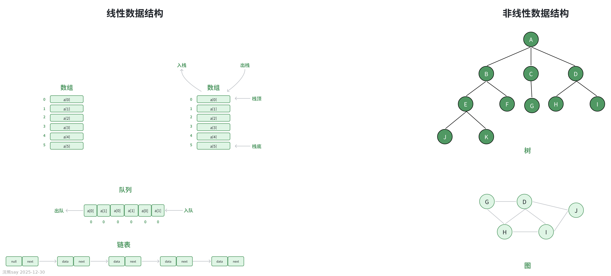
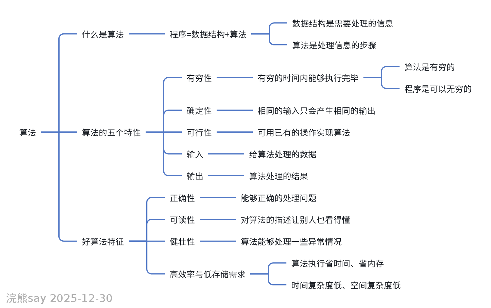

# 数据结构以及概念

## 数据结构概念

**数据**：数据是对客观事物的符号表示，它是计算机科学中的基础概念之一。在计算机科学领域，数据指的是所有可以被计算机接收并处理的信息，这些信息以各种符号形式存在，如数字、字符、图像等。

**数据元素**：数据元素是构成数据的基本单位，是数据结构课程中最基础的研究对象。在计算机程序中，数据元素通常被视为一个整体来进行处理。一个数据元素可以由一个或多个数据项组成，每个数据项代表了数据元素的一个属性。例如一个List，Map或者Set都叫做一个数据元素，数据库的一张表也叫做数据元素。

**数据项（数据对象）**：数据项是数据元素内部的最小单位，是构成数据元素的具体信息片段。例如，数据库中的一个User对象的数据元素可能包括姓名、年龄、性别等多个数据项。

**数据结构**：数据结构是指相互之间存在一种或多种特定关系的数据元素的集合。它是计算机科学中的一个重要分支，主要研究数据的组织方式、处理方法以及它们之间的关系,数据结构包括三个核心方面：

-   **逻辑结构**：逻辑结构描述的是数据元素之间的抽象关系，不涉及具体的实现细节。逻辑结构主要分为两大类：线性结构和非线性结构。例如线性表就是一个逻辑结构，它的具体实现包含了数组和链表。

-   **存储结构**：存储结构指的是数据元素在计算机中的存储方式，包括顺序结构、链式结构、索引结构和散列结构。

-   **运算**：运算定义了在数据结构上可以执行的各种操作，如插入、删除、查找等。

**数据的逻辑结构**：根据数据元素之间关系的不同，逻辑结构可以分为线性结构和非线性结构。线性结构中，每个元素只有一个直接前驱和一个直接后继，如数组和链表；非线性结构中，元素之间的关系可以是一对多或多对多，如树和图。

**数据的物理结构（存储结构）**：根据数据元素在计算机内存中的存储方式不同，物理结构可以分为以下几种：

-   **顺序结构**：顺序结构是最直观的存储方式，逻辑上相邻的元素在物理位置上也是相邻的。这种方式便于快速访问和处理，但插入和删除操作可能较为低效。

-   **链式结构**：链式结构中，逻辑上相邻的元素在物理位置上不一定相邻，而是通过指针链接起来。这种方式在插入和删除操作上有优势，但在访问特定元素时可能不如顺序结构高效。

-   **索引结构**：索引结构不仅存储数据本身，还维护了一个索引表，该表包含了关键字和对应的物理地址。索引结构提高了查找效率，特别适合于大型数据集。

-   **散列结构**：散列结构是一种高效的存储方式，它通过散列函数将关键字转换为存储地址，实现了快速存取。散列结构在处理大数据集时非常有效，但也需要注意解决哈希冲突的问题。

## 真题练习

【国家电网2014年|||在决定选取何种存储结构时，一般不考虑（ ）

A. 各结点的值如何

B. 结点个数的多少

C. 对数据有哪些运算

D. 所用的编程语言实现这种结构是否方便

答案：A

解析：选存储结构只看节点数量、要做的运算和编程语言实现是否方便，不看节点里具体存什么值，所以答案选A】

【国家电网2017|||某数据库中的学生信息表，包含学号、姓名、专业等字段。对该表进行如下操作：① 按照学号顺序连续存储在内存中② 为快速按专业查询，建立专业→学号的索引表③ 将学生信息组织成树形结构显示院系-专业-学生的层次关系上述操作分别涉及的数据结构特征是：

A. ①物理结构 ②物理结构 ③逻辑结构

B. ①逻辑结构 ②物理结构 ③逻辑结构

C. ①物理结构 ②逻辑结构 ③物理结构

D. ①逻辑结构 ②逻辑结构 ③物理结构

答案：A

解析：操作①：顺序存储方式 → 物理（存储）结构操作②：建立索引表 → 物理（存储）结构（索引存储）操作③：树形关系描述 → 逻辑结构（非线性结构）】

# 算法及其基本概念

## 思维导图

## 算法基本概念

**算法**：算法是一组明确定义的指令集合，用于解决特定问题或执行特定任务。它是计算机科学的核心概念之一，指导着计算机如何有效地处理数据。

**算法特征**：

-   **有穷性**：任何算法都必须在有限的步骤内完成，不能无限循环。

-   **确切性**：算法的每一步都应该是清晰且无歧义的，确保执行过程中的准确性。

-   **输入**：算法可以接受零个或多个输入值，这些输入是算法开始执行时提供的。

-   **输出**：算法至少产生一个输出结果，这是算法执行的最终目的。

-   **可行性**：算法描述的操作应该是现实中可实现的，不应包含理论上无法完成的任务。

**算法评价标准**：

-   **健壮性**：算法应该能够处理各种异常情况，即使输入数据不符合预期，也不应导致程序崩溃。

-   **可读性**：算法的描述应该清晰易懂，便于其他开发者阅读和维护。

-   **正确性**：算法必须能够正确地解决问题，产生预期的结果。

-   **时间复杂度**：时间复杂度是衡量算法执行效率的重要指标，它反映了算法随着输入规模增长而增加的计算工作量。时间复杂度通常用大O符号表示，如O(1)、O(n)、O(log n)等。

-   **空间复杂度**：空间复杂度衡量算法在运行过程中所需的额外存储空间。它不仅包括输入数据所占的空间，还包括算法执行过程中动态分配的临时空间。空间复杂度同样用大O符号表示。

**算法描述方法**：

-   **自然语言**：自然语言描述算法是一种直观的方式，适用于初步设计阶段，但可能不够精确。

-   **流程图**：流程图通过图形化的方式展示算法的逻辑流程，有助于理解算法的各个步骤。

-   **伪代码**：伪代码是一种介于自然语言和编程语言之间的描述方式，它既保持了自然语言的可读性，又具备编程语言的结构性，是算法设计中常用的工具。

**时间复杂度计算**：掌握如何计算算法的时间复杂度是算法分析的基础。时间复杂度的计算通常基于算法中基本操作的执行次数，通过分析这些操作的频率来评估算法的效率。例如，对于一个简单的循环，如果循环体内的操作执行了n次，那么该算法的时间复杂度为O(n)。

## 真题练习

【国家电网（2014）|||一个算法必须在执行有穷步之后结束，这是算法的（ ）

A. 正确性

B. 有穷性

C. 确定性

D. 可行性

答案：B

解析：算法的有穷性定义就是 “执行有限步骤后必须结束”，A 是指算法结果正确，C 是步骤无歧义，D 是步骤可实现，均不符合题意。】

【国家电网（2016）|||

对一个算法的评价，不包括如下（ ）方面的内容

A. 健壮性和可读性

B. 并行性

C. 正确性

D. 时空复杂度

答案：B

解析：算法评价核心看正确性、健壮性、可读性、时空复杂度，并行性是程序执行方式，不是算法的评价维度。】

【国家电网（2018）|||算法指的是（ ）

A. 计算机程序B. 解决问题的计算方法

C. 排序算法

D. 解决问题的有限运算序列

解析：算法的标准定义是 “解决问题的有限运算序列”，A 中程序是算法的实现形式而非算法本身，B 表述太笼统，C 只是算法的一种具体类型。正确

答案：D】

【国家电网（2020）||| 算法设计的要求包括（ ）

A. 正确性

B. 可读性

C. 健壮性

D. 确定性

解析：算法设计的要求包括正确性（结果准确）、可读性（易理解）、健壮性（抗异常输入），D 是算法的基本特性（步骤无歧义），并非设计要求。正确

答案：A、B、C（多选题）】

【国家电网（2015）|||下列关于算法的叙述中，错误的是（ ）

A. 算法是问题的程序化解决方案

B. 算法必须有输出

C. 算法必须在有限步骤内结束

D. 算法可以没有输入正确

答案：A

解析：算法是 “解决问题的有限运算序列”，而非 “程序化解决方案”（程序化是程序的特点）；算法必须有输出（至少 1 个），可无输入，且需有限步骤结束，B、C、D 均正确。】

# 浣熊考点速记

## 数据结构核心速记

三大基本单位：数据（计算机可处理的符号）→ 数据元素（基本单位，如 List、数据库表）→ 数据项（最小单位，如姓名、学号）

数据结构三要素：逻辑结构（元素关系）、存储结构（物理存储）、运算（插入 / 删除 / 查找等）

逻辑结构分类：线性结构（一对一，如数组、链表）、非线性结构（一对多 / 多对多，如树、图）

存储结构 4 种类型及关键特点：

-   **顺序结构**：物理相邻，查快（O (1)），增删慢（移元素）

-   **链式结构**：指针链接，增删快（改指针），查慢（遍历）

-   **索引结构**：含索引表（关键字 + 地址），查快，适配动态增删

-   **散列结构**：哈希函数映射地址，查极快（近 O (1)），需解决冲突

存储结构选择依据：节点个数、运算需求（查 / 增删频率）、编程语言实现难度（不看节点具体值）

## 算法核心速记

算法定义：解决问题的**有限运算序列**（≠程序、≠笼统方法）

算法五大特征：有穷性（有限步骤结束）、确切性（步骤无歧义）、输入（0 个或多个）、输出（至少 1 个）、可行性（操作可实现）

算法评价标准：正确性、健壮性（抗异常）、可读性、时空复杂度（≠并行性）

算法设计要求：正确性、可读性、健壮性（确定性是特征，非要求）

复杂度核心：时间复杂度（执行效率，如 O (1)、O (n)）、空间复杂度（额外存储空间），均用大 O 符号表示
